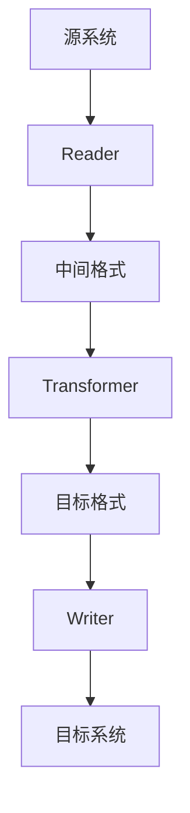
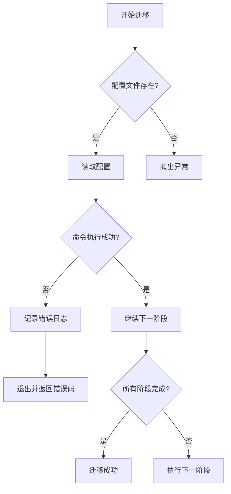

# API参考

<cite>
**本文档引用的文件**
- [SpecUtil.java](file://spec/src/main/java/com/aliyun/dataworks/common/spec/SpecUtil.java)
- [migrationx.py](file://client/migrationx/src/main/bin/migrationx.py)
- [migrationx.json](file://client/migrationx/src/main/conf/migrationx.json)
- [dataworks-transformer-config.json](file://client/migrationx/migrationx-transformer/src/main/conf/dataworks-transformer-config.json)
- [SpecUtilTest.java](file://spec/src/test/java/com/aliyun/dataworks/common/spec/SpecUtilTest.java)
</cite>

## 目录
1. [简介](#简介)
2. [SpecUtil API参考](#specutil-api参考)
3. [MigrationX迁移接口](#migrationx迁移接口)
4. [协议特定示例](#协议特定示例)
5. [错误处理策略](#错误处理策略)
6. [安全注意事项](#安全注意事项)
7. [版本控制](#版本控制)
8. [客户端实现指南](#客户端实现指南)
9. [性能优化建议](#性能优化建议)

## 简介
dataworks-spec项目提供了一套完整的API接口，用于在JSON字符串和领域对象之间进行转换，以及在不同工作流引擎之间进行模型迁移。本API参考文档重点介绍SpecUtil类的核心接口和MigrationX的迁移功能，为开发者提供详细的使用指南和最佳实践。

## SpecUtil API参考

### SpecUtil.parseToDomain()
将JSON字符串解析为领域对象的静态方法。

**参数**
- `spec`: JSON格式的字符串，包含要解析的规范定义

**返回值**
- `Specification<T>`: 解析后的领域对象，其中T是Spec的子类型

**异常处理**
- 当输入为null时返回null
- 内部使用ToDomainRootParser进行解析，会处理JSON解析异常和领域模型验证异常

**使用模式**
```java
String jsonSpec = "{\"version\": \"1.0.0\", \"kind\": \"CycleWorkflow\", ...}";
Specification<DataWorksWorkflowSpec> domainObject = SpecUtil.parseToDomain(jsonSpec);
```

**Section sources**
- [SpecUtil.java](file://spec/src/main/java/com/aliyun/dataworks/common/spec/SpecUtil.java#L71-L77)
- [SpecUtilTest.java](file://spec/src/test/java/com/aliyun/dataworks/common/spec/SpecUtilTest.java#L113-L114)

### SpecUtil.writeToSpec()
将领域对象序列化为JSON字符串的静态方法。

**参数**
- `specification`: 要序列化的Specification对象

**返回值**
- `String`: 格式化的JSON字符串表示

**异常处理**
- 当输入为null时返回null
- 验证version、spec和kind字段不能为空，否则抛出IllegalArgumentException
- 如果找不到合适的Writer，抛出SpecException

**使用模式**
```java
Specification<DataWorksWorkflowSpec> domainObject = ...;
String jsonSpec = SpecUtil.writeToSpec(domainObject);
```

**Section sources**
- [SpecUtil.java](file://spec/src/main/java/com/aliyun/dataworks/common/spec/SpecUtil.java#L79-L95)
- [SpecUtilTest.java](file://spec/src/test/java/com/aliyun/dataworks/common/spec/SpecUtilTest.java#L236)

### SpecUtil.parse()
通用的解析方法，用于将JSON字符串解析为指定类型的领域实体。

**参数**
- `json`: JSON字符串
- `specCls`: 目标类的Class对象
- `context`: 解析上下文

**返回值**
- `T`: 指定类型的领域实体对象

**异常处理**
- 如果找不到对应的解析器，抛出NullPointerException

**Section sources**
- [SpecUtil.java](file://spec/src/main/java/com/aliyun/dataworks/common/spec/SpecUtil.java#L109-L113)

### SpecUtil.write()
通用的序列化方法，用于将领域对象写入指定格式。

**参数**
- `specObject`: 要序列化的对象
- `context`: 写入上下文

**返回值**
- `Object`: 序列化后的对象

**异常处理**
- 当输入为null时返回null

**Section sources**
- [SpecUtil.java](file://spec/src/main/java/com/aliyun/dataworks/common/spec/SpecUtil.java#L98-L106)

## MigrationX迁移接口

### 迁移流程概述
MigrationX提供了一个完整的迁移工作流，包括导出（Reader）、转换（Transformer）和导入（Writer）三个阶段。



**Diagram sources**
- [migrationx.py](file://client/migrationx/src/main/bin/migrationx.py#L15-L33)

### 输入输出格式
#### 输入格式
- **Reader配置**: 从migrationx.json文件读取，包含源系统的连接信息和参数
- **Transformer配置**: 从dataworks-transformer-config.json文件读取，包含转换规则和设置

#### 输出格式
- **Writer输出**: 支持多种格式，通过"format"参数指定，包括DWMA、SPEC和WORKFLOW

**Section sources**
- [migrationx.json](file://client/migrationx/src/main/conf/migrationx.json)
- [dataworks-transformer-config.json](file://client/migrationx/migrationx-transformer/src/main/conf/dataworks-transformer-config.json)

### 调用方式
MigrationX通过Python脚本进行调用，主要入口是migrationx.py。

```python
#!/usr/bin/env python
import os
import sys
import json
import common

# 读取配置文件
migrationx_config_file = os.path.join(conf_path, "migrationx.json")
migrationx_config = json.load(open(migrationx_config_file))

# 构建命令列表
cmd_list = []
if "reader" in migrationx_config:
    reader_cmd = ["python", reader_bin]
    reader_cmd.extend([common.replace_os_env_variables(param) for param in migrationx_config["reader"]["params"]])
    cmd_list.append(" ".join(reader_cmd))

# 执行命令
for cmd in cmd_list:
    ret = os.system(cmd)
    if ret != 0:
        sys.exit(ret)
```

**Section sources**
- [migrationx.py](file://client/migrationx/src/main/bin/migrationx.py)

## 协议特定示例

### DolphinScheduler到DataWorks迁移示例
```json
{
  "reader": {
    "name": "dolphinscheduler",
    "params": [
      "-a dolphinscheduler",
      "-e ${DOLPHINSCHEDULER_API_ENDPOINT}",
      "-t ${DOLPHINSCHEDULER_API_TOKEN}",
      "-v ${DOLPHINSCHEDULER_VERSION}",
      "-p ${DOLPHINSCHEDULER_PROJECT_NAME}",
      "-f ${PWD}/${DOLPHINSCHEDULER_PROJECT_NAME}.zip"
    ]
  },
  "transformer": {
    "name": "dolphinscheduler_to_dataworks",
    "params": [
      "-a dolphinscheduler_to_dataworks",
      "-c ${MIGRATIONX_HOME}/conf/dataworks-transformer-config.json",
      "-s ${PWD}/${DOLPHINSCHEDULER_PROJECT_NAME}.zip",
      "-t ${PWD}/${DOLPHINSCHEDULER_PROJECT_NAME}_dw.zip"
    ]
  },
  "writer": {
    "name": "dataworks",
    "params": [
      "-a dataworks",
      "-e dataworks.${ALIYUN_REGION_ID}.aliyuncs.com",
      "-i ${ALIYUN_ACCESS_KEY_ID}",
      "-k ${ALIYUN_ACCESS_KEY_SECRET}",
      "-p ${ALIYUN_DATAWORKS_WORKSPACE_ID}",
      "-r ${ALIYUN_REGION_ID}",
      "-f ${PWD}/${DOLPHINSCHEDULER_PROJECT_NAME}_dw.zip",
      "-t SPEC"
    ]
  }
}
```

**Section sources**
- [migrationx.json](file://client/migrationx/src/main/conf/migrationx.json)

### 转换器配置示例
```json
{
  "format": "SPEC",
  "locale": "zh_CN",
  "skipUnSupportType": true,
  "transformContinueWithError": true,
  "specContinueWithError": true,
  "filterTasks": [],
  "settings": {
    "workflow.converter.shellNodeType": "DIDE_SHELL",
    "workflow.converter.commandSqlAs": "EMR_HIVE",
    "workflow.converter.sparkSubmitAs": "EMR_SPARK",
    "workflow.converter.target.unknownNodeTypeAs": "DIDE_SHELL",
    "workflow.converter.mrNodeType": "EMR_MR",
    "workflow.converter.target.engine.type": "EMR",
    "workflow.converter.dolphinscheduler.sqlNodeTypeMapping": {
      "POSTGRESQL": "EMR_HIVE",
      "MYSQL": "EMR_HIVE",
      "HIVE": "EMR_HIVE",
      "CLICKHOUSE": "CLICK_SQL"
    }
  }
}
```

**Section sources**
- [dataworks-transformer-config.json](file://client/migrationx/migrationx-transformer/src/main/conf/dataworks-transformer-config.json)

## 错误处理策略

### SpecUtil错误处理
- **空值处理**: 当输入为null时，parseToDomain()和writeToSpec()方法返回null
- **验证异常**: writeToSpec()方法会验证version、spec和kind字段，如果为空则抛出IllegalArgumentException
- **解析器异常**: 如果找不到合适的解析器或写入器，抛出SpecException

### MigrationX错误处理
- **命令执行失败**: 如果任何阶段的命令执行失败（返回码非0），整个迁移过程将终止
- **配置错误**: 如果配置文件缺失或格式错误，会抛出相应的异常
- **环境变量**: 使用common.replace_os_env_variables()方法处理环境变量替换，确保配置的灵活性



**Diagram sources**
- [migrationx.py](file://client/migrationx/src/main/bin/migrationx.py#L37-L40)

**Section sources**
- [migrationx.py](file://client/migrationx/src/main/bin/migrationx.py)

## 安全注意事项

### 敏感信息保护
- **环境变量**: 所有敏感信息（如API密钥、访问密钥等）都通过环境变量传递，避免硬编码在配置文件中
- **配置文件权限**: 确保配置文件的权限设置正确，防止未授权访问

### 访问控制
- **API令牌**: 使用API令牌进行身份验证，确保只有授权用户才能执行迁移操作
- **访问密钥**: 使用阿里云访问密钥进行身份验证，遵循最小权限原则

### 数据安全
- **传输安全**: 所有API调用都应使用HTTPS协议，确保数据在传输过程中的安全性
- **数据加密**: 敏感数据在存储时应进行加密处理

**Section sources**
- [migrationx.json](file://client/migrationx/src/main/conf/migrationx.json)

## 版本控制

### API版本管理
- **语义化版本**: 遵循语义化版本控制规范（SemVer）
- **向后兼容**: 确保新版本的API对旧版本保持向后兼容性

### 配置文件版本
- **配置文件格式**: 配置文件格式应保持稳定，避免频繁变更
- **版本标记**: 在配置文件中添加版本标记，便于识别和管理

### 迁移脚本版本
- **脚本版本**: 每个迁移脚本都应有明确的版本号
- **版本兼容性**: 确保不同版本的迁移脚本能够协同工作

**Section sources**
- [SpecUtil.java](file://spec/src/main/java/com/aliyun/dataworks/common/spec/SpecUtil.java#L84-L86)

## 客户端实现指南

### 初始化配置
1. 创建migrationx.json配置文件
2. 设置环境变量
3. 验证配置文件的正确性

### 执行迁移
1. 调用migrationx.py脚本
2. 监控执行过程
3. 处理可能的错误

### 验证结果
1. 检查输出文件
2. 验证数据完整性
3. 确认迁移成功

**Section sources**
- [migrationx.py](file://client/migrationx/src/main/bin/migrationx.py)

## 性能优化建议

### 批量处理
- **批量导出**: 尽可能使用批量导出功能，减少API调用次数
- **批量导入**: 使用批量导入功能，提高导入效率

### 并行处理
- **并行执行**: 如果可能，将不同的迁移任务并行执行
- **多线程**: 在转换阶段使用多线程处理，提高处理速度

### 缓存机制
- **结果缓存**: 对于重复的转换操作，使用缓存机制避免重复计算
- **元数据缓存**: 缓存源系统的元数据，减少API调用

### 资源优化
- **内存管理**: 优化内存使用，避免内存溢出
- **文件处理**: 使用流式处理大文件，减少内存占用

**Section sources**
- [migrationx.py](file://client/migrationx/src/main/bin/migrationx.py)