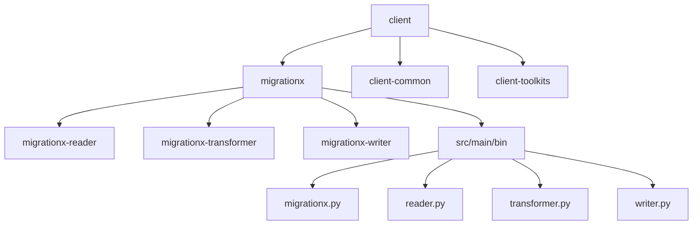
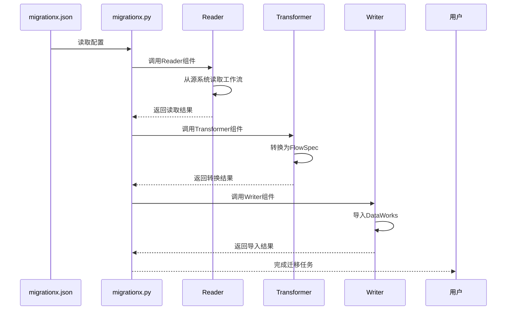
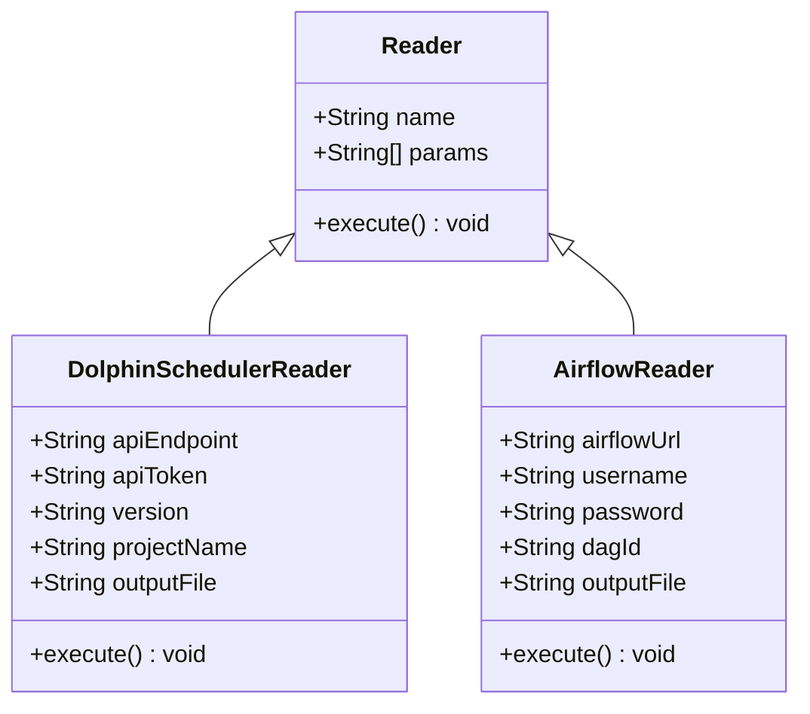
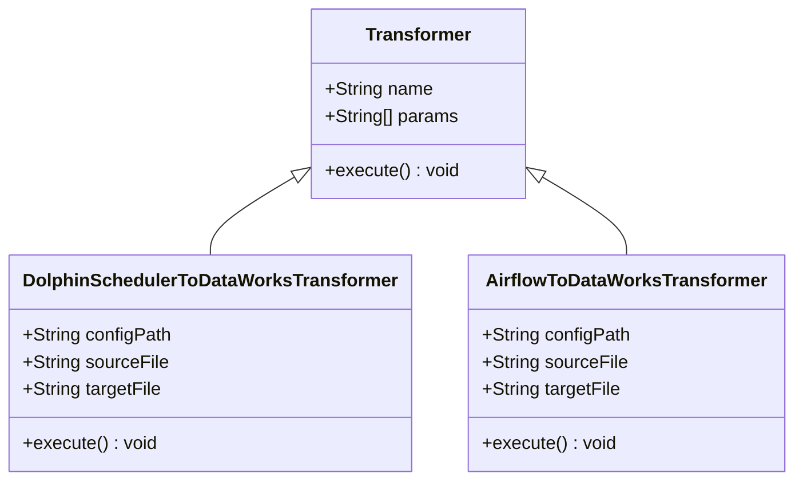
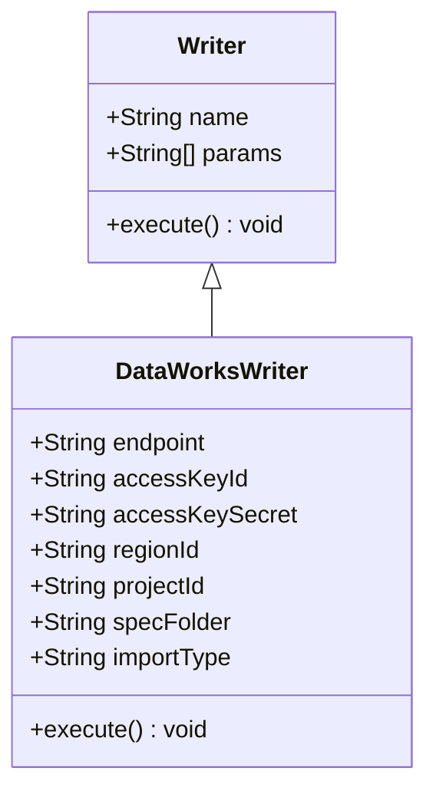
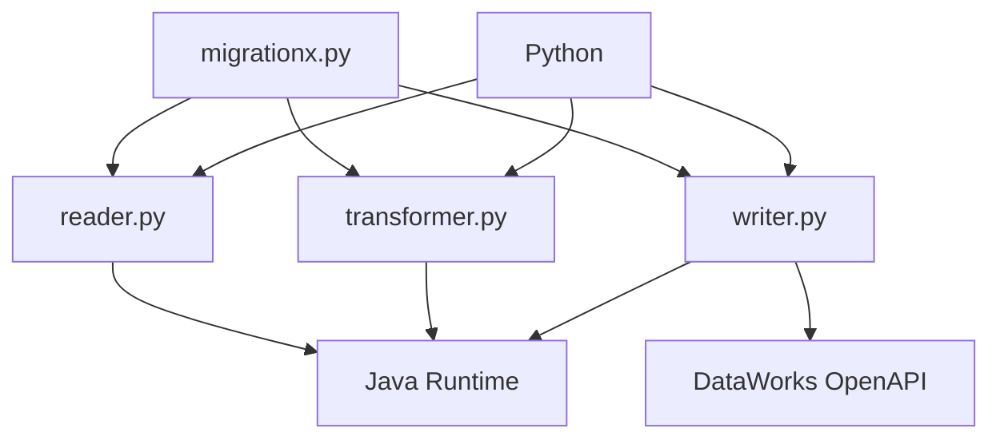

# MigrationX迁移API

<cite>
**本文档引用的文件**
- [migrationx.py](file://client/migrationx/src/main/bin/migrationx.py)
- [migrationx.json](file://client/migrationx/src/main/conf/migrationx.json)
- [reader.py](file://client/migrationx/src/main/bin/reader.py)
- [transformer.py](file://client/migrationx/src/main/bin/transformer.py)
- [writer.py](file://client/migrationx/src/main/bin/writer.py)
- [common.py](file://client/client-common/src/main/bin/common.py)
- [DataWorksMigrationSpecificationImportWriter.java](file://client/migrationx/migrationx-writer/src/main/java/com/aliyun/dataworks/migrationx/writer/DataWorksMigrationSpecificationImportWriter.java)
- [DataWorksFlowSpecWriter.java](file://client/migrationx/migrationx-writer/src/main/java/com/aliyun/dataworks/migrationx/writer/dataworks/DataWorksFlowSpecWriter.java)
</cite>

## 目录
1. [简介](#简介)
2. [项目结构](#项目结构)
3. [核心组件](#核心组件)
4. [架构概述](#架构概述)
5. [详细组件分析](#详细组件分析)
6. [依赖分析](#依赖分析)
7. [性能考虑](#性能考虑)
8. [故障排除指南](#故障排除指南)
9. [结论](#结论)

## 简介
MigrationX迁移API是一个用于将不同调度系统的工作流迁移到DataWorks平台的工具。它采用管道-过滤器架构，包含三个核心组件：Reader、Transformer和Writer。该工具通过读取配置文件migrationx.json来执行迁移任务，支持从DolphinScheduler、Airflow等多种数据源读取工作流定义，转换为DataWorks标准的FlowSpec格式，并通过OpenAPI导入到DataWorks平台。

## 项目结构
MigrationX项目采用模块化设计，主要包含client、docs、dwcli、schema和spec等目录。client目录下包含migrationx模块，实现了迁移的核心功能。

**图源**
- [migrationx.py](file://client/migrationx/src/main/bin/migrationx.py)
- [reader.py](file://client/migrationx/src/main/bin/reader.py)
- [transformer.py](file://client/migrationx/src/main/bin/transformer.py)
- [writer.py](file://client/migrationx/src/main/bin/writer.py)

**章节源**
- [migrationx.py](file://client/migrationx/src/main/bin/migrationx.py)
- [project_structure](file://project_structure)

## 核心组件
MigrationX迁移API的核心由三个组件构成：Reader负责从源系统读取工作流定义，Transformer负责将源系统模型转换为DataWorks标准FlowSpec，Writer负责通过OpenAPI将转换后的Spec导入DataWorks。

**章节源**
- [migrationx.py](file://client/migrationx/src/main/bin/migrationx.py)
- [common.py](file://client/client-common/src/main/bin/common.py)

## 架构概述
MigrationX采用管道-过滤器架构模式，通过配置文件驱动执行流程。主入口脚本migrationx.py读取migrationx.json配置文件，依次调用Reader、Transformer和Writer组件完成迁移任务。

**图源**
- [migrationx.py](file://client/migrationx/src/main/bin/migrationx.py)
- [migrationx.json](file://client/migrationx/src/main/conf/migrationx.json)

## 详细组件分析

### Reader组件分析
Reader组件负责从各种调度系统读取工作流定义。通过配置文件中的reader部分定义数据源类型和参数，支持DolphinScheduler、Airflow等多种数据源。

**图源**
- [reader.py](file://client/migrationx/src/main/bin/reader.py)
- [common.py](file://client/client-common/src/main/bin/common.py)

**章节源**
- [reader.py](file://client/migrationx/src/main/bin/reader.py)
- [common.py](file://client/client-common/src/main/bin/common.py)

### Transformer组件分析
Transformer组件负责将源系统的工作流模型转换为DataWorks标准的FlowSpec格式。通过配置文件中的transformer部分定义转换器类型和参数，支持dolphinscheduler_to_dataworks等转换器。

**图源**
- [transformer.py](file://client/migrationx/src/main/bin/transformer.py)
- [common.py](file://client/client-common/src/main/bin/common.py)

**章节源**
- [transformer.py](file://client/migrationx/src/main/bin/transformer.py)
- [common.py](file://client/client-common/src/main/bin/common.py)

### Writer组件分析
Writer组件负责通过DataWorks OpenAPI将转换后的FlowSpec导入到DataWorks平台。通过配置文件中的writer部分定义目标平台参数，包括endpoint、access key等认证信息。

**图源**
- [writer.py](file://client/migrationx/src/main/bin/writer.py)
- [DataWorksMigrationSpecificationImportWriter.java](file://client/migrationx/migrationx-writer/src/main/java/com/aliyun/dataworks/migrationx/writer/DataWorksMigrationSpecificationImportWriter.java)

**章节源**
- [writer.py](file://client/migrationx/src/main/bin/writer.py)
- [DataWorksMigrationSpecificationImportWriter.java](file://client/migrationx/migrationx-writer/src/main/java/com/aliyun/dataworks/migrationx/writer/DataWorksMigrationSpecificationImportWriter.java)

## 依赖分析
MigrationX迁移API依赖于多个外部组件和库，包括Java运行时环境、Python解释器、DataWorks OpenAPI SDK等。各组件之间通过标准输入输出进行数据传递。

**图源**
- [migrationx.py](file://client/migrationx/src/main/bin/migrationx.py)
- [common.py](file://client/client-common/src/main/bin/common.py)

**章节源**
- [migrationx.py](file://client/migrationx/src/main/bin/migrationx.py)
- [common.py](file://client/client-common/src/main/bin/common.py)

## 性能考虑
MigrationX迁移API的性能主要受以下几个因素影响：网络延迟、源系统API响应时间、DataWorks OpenAPI导入速度以及本地处理能力。建议在迁移大量工作流时分批进行，并监控系统资源使用情况。

## 故障排除指南
当遇到配置错误或认证失败等问题时，可参考以下排查步骤：

1. 检查migrationx.json配置文件格式是否正确
2. 验证环境变量是否已正确设置
3. 确认源系统API endpoint和认证信息是否有效
4. 检查DataWorks access key和secret是否具有足够权限
5. 查看日志文件获取详细错误信息

**章节源**
- [migrationx.json](file://client/migrationx/src/main/conf/migrationx.json)
- [DataWorksMigrationSpecificationImportWriter.java](file://client/migrationx/migrationx-writer/src/main/java/com/aliyun/dataworks/migrationx/writer/DataWorksMigrationSpecificationImportWriter.java)

## 结论
MigrationX迁移API提供了一套完整的解决方案，用于将不同调度系统的工作流迁移到DataWorks平台。通过管道-过滤器架构，实现了Reader、Transformer和Writer三个核心组件的解耦，使得系统具有良好的扩展性和维护性。该工具支持多种数据源和灵活的配置方式，能够满足不同场景下的迁移需求。