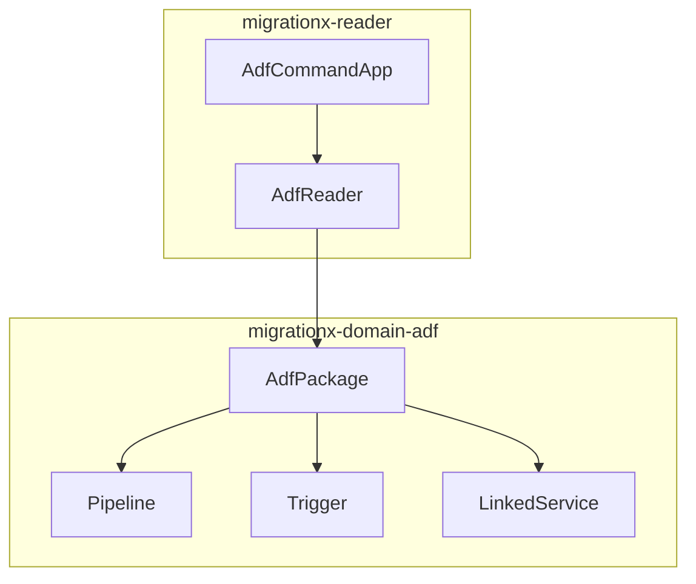
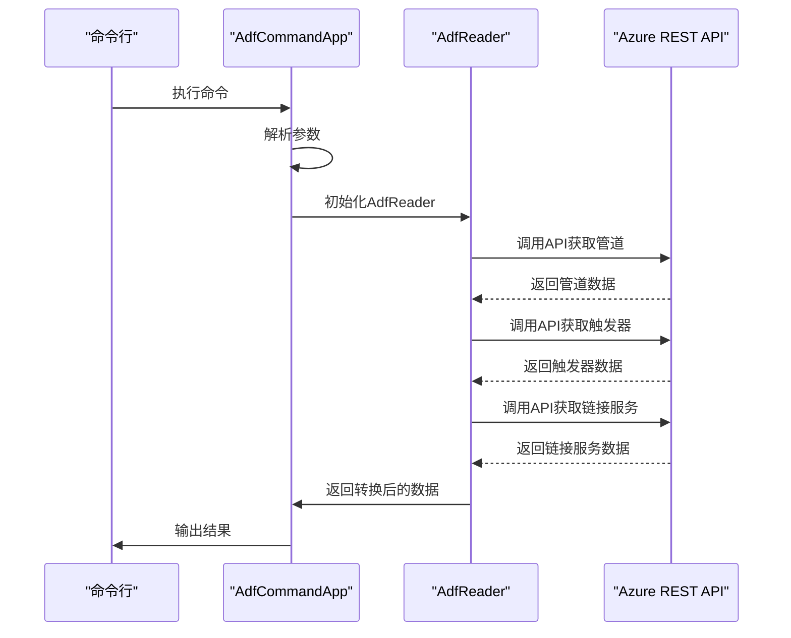
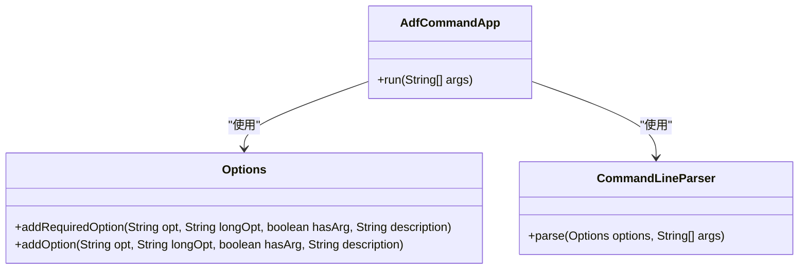
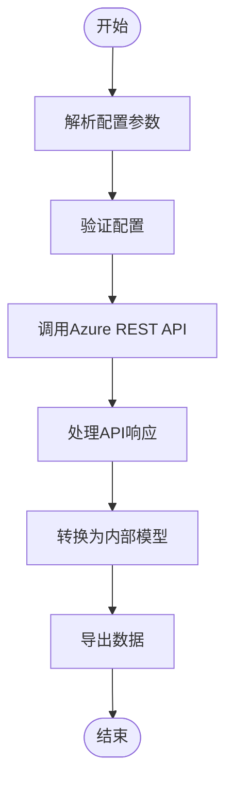
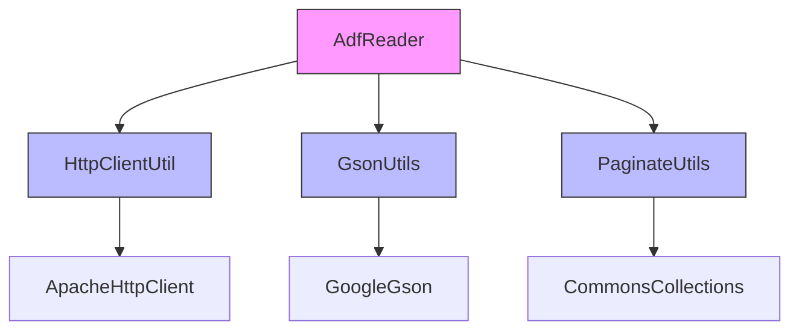
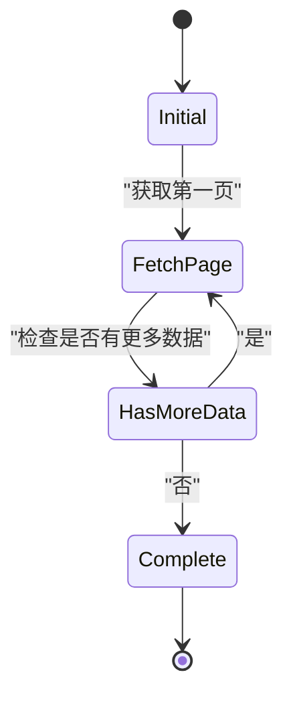

# ADF读取器

<cite>
**本文档引用的文件**
- [AdfCommandApp.java](file://client/migrationx/migrationx-reader/src/main/java/com/aliyun/dataworks/migrationx/reader/adf/AdfCommandApp.java)
- [AdfReader.java](file://client/migrationx/migrationx-reader/src/main/java/com/aliyun/dataworks/migrationx/reader/adf/AdfReader.java)
- [AdfConf.java](file://client/migrationx/migrationx-domain/migrationx-domain-adf/src/main/java/com/aliyun/dataworks/migrationx/domain/adf/AdfConf.java)
- [AdfPackage.java](file://client/migrationx/migrationx-domain/migrationx-domain-adf/src/main/java/com/aliyun/dataworks/migrationx/domain/adf/AdfPackage.java)
- [Pipeline.java](file://client/migrationx/migrationx-domain/migrationx-domain-adf/src/main/java/com/aliyun/dataworks/migrationx/domain/adf/Pipeline.java)
- [Trigger.java](file://client/migrationx/migrationx-domain/migrationx-domain-adf/src/main/java/com/aliyun/dataworks/migrationx/domain/adf/Trigger.java)
- [LinkedService.java](file://client/migrationx/migrationx-domain/migrationx-domain-adf/src/main/java/com/aliyun/dataworks/migrationx/domain/adf/LinkedService.java)
- [CommandAppEntrance.java](file://client/client-common/src/main/java/com/aliyun/dataworks/client/command/CommandAppEntrance.java)
- [CommandAppFactory.java](file://client/client-common/src/main/java/com/aliyun/dataworks/client/command/CommandAppFactory.java)
- [apps.json](file://client/migrationx/src/main/conf/apps.json)
- [PaginateUtils.java](file://client/migrationx/migrationx-common/src/main/java/com/aliyun/migrationx/common/utils/PaginateUtils.java)
- [HttpClientUtil.java](file://client/migrationx/migrationx-common/src/main/java/com/aliyun/migrationx/common/http/HttpClientUtil.java)
</cite>

## 目录
1. [简介](#简介)
2. [项目结构](#项目结构)
3. [核心组件](#核心组件)
4. [架构概述](#架构概述)
5. [详细组件分析](#详细组件分析)
6. [依赖分析](#依赖分析)
7. [性能考虑](#性能考虑)
8. [故障排除指南](#故障排除指南)
9. [结论](#结论)

## 简介
ADF读取器是MigrationX工具集中的一个关键组件，用于从Azure Data Factory（ADF）读取工作流元数据。该组件通过Azure REST API获取管道、触发器和链接服务等资源，并将其转换为MigrationX内部统一模型。AdfCommandApp作为命令行入口点，负责解析配置参数并启动读取过程。本文档详细介绍了ADF读取器的实现机制、配置文件格式以及常见问题的解决方案。

## 项目结构
ADF读取器的代码主要分布在`client/migrationx/migrationx-reader`和`client/migrationx/migrationx-domain/migrationx-domain-adf`两个目录中。`migrationx-reader`包含读取器的核心实现，而`migrationx-domain-adf`则定义了ADF相关的数据模型。

**图示来源**
- [AdfCommandApp.java](file://client/migrationx/migrationx-reader/src/main/java/com/aliyun/dataworks/migrationx/reader/adf/AdfCommandApp.java)
- [AdfReader.java](file://client/migrationx/migrationx-reader/src/main/java/com/aliyun/dataworks/migrationx/reader/adf/AdfReader.java)
- [AdfPackage.java](file://client/migrationx/migrationx-domain/migrationx-domain-adf/src/main/java/com/aliyun/dataworks/migrationx/domain/adf/AdfPackage.java)

**章节来源**
- [AdfCommandApp.java](file://client/migrationx/migrationx-reader/src/main/java/com/aliyun/dataworks/migrationx/reader/adf/AdfCommandApp.java)
- [AdfReader.java](file://client/migrationx/migrationx-reader/src/main/java/com/aliyun/dataworks/migrationx/reader/adf/AdfReader.java)

## 核心组件
ADF读取器的核心组件包括AdfCommandApp和AdfReader。AdfCommandApp作为命令行入口点，负责解析命令行参数并初始化AdfReader。AdfReader则负责调用Azure REST API获取ADF资源，并将其转换为MigrationX内部模型。

**章节来源**
- [AdfCommandApp.java](file://client/migrationx/migrationx-reader/src/main/java/com/aliyun/dataworks/migrationx/reader/adf/AdfCommandApp.java)
- [AdfReader.java](file://client/migrationx/migrationx-reader/src/main/java/com/aliyun/dataworks/migrationx/reader/adf/AdfReader.java)

## 架构概述
ADF读取器的架构主要包括命令行解析、API调用和数据转换三个部分。AdfCommandApp负责解析命令行参数，AdfReader负责调用Azure REST API获取数据，最后将数据转换为MigrationX内部模型。

**图示来源**
- [AdfCommandApp.java](file://client/migrationx/migrationx-reader/src/main/java/com/aliyun/dataworks/migrationx/reader/adf/AdfCommandApp.java)
- [AdfReader.java](file://client/migrationx/migrationx-reader/src/main/java/com/aliyun/dataworks/migrationx/reader/adf/AdfReader.java)

## 详细组件分析

### AdfCommandApp分析
AdfCommandApp是ADF读取器的命令行入口点，负责解析命令行参数并启动读取过程。

#### 命令行参数解析

**图示来源**
- [AdfCommandApp.java](file://client/migrationx/migrationx-reader/src/main/java/com/aliyun/dataworks/migrationx/reader/adf/AdfCommandApp.java)

#### AdfReader分析
AdfReader负责调用Azure REST API获取ADF资源，并将其转换为MigrationX内部模型。

##### API调用流程

**图示来源**
- [AdfReader.java](file://client/migrationx/migrationx-reader/src/main/java/com/aliyun/dataworks/migrationx/reader/adf/AdfReader.java)

**章节来源**
- [AdfReader.java](file://client/migrationx/migrationx-reader/src/main/java/com/aliyun/dataworks/migrationx/reader/adf/AdfReader.java)

## 依赖分析
ADF读取器依赖于多个核心组件，包括HTTP客户端、JSON处理工具和分页工具。

**图示来源**
- [AdfReader.java](file://client/migrationx/migrationx-reader/src/main/java/com/aliyun/dataworks/migrationx/reader/adf/AdfReader.java)
- [HttpClientUtil.java](file://client/migrationx/migrationx-common/src/main/java/com/aliyun/migrationx/common/http/HttpClientUtil.java)
- [PaginateUtils.java](file://client/migrationx/migrationx-common/src/main/java/com/aliyun/migrationx/common/utils/PaginateUtils.java)

**章节来源**
- [AdfReader.java](file://client/migrationx/migrationx-reader/src/main/java/com/aliyun/dataworks/migrationx/reader/adf/AdfReader.java)
- [HttpClientUtil.java](file://client/migrationx/migrationx-common/src/main/java/com/aliyun/migrationx/common/http/HttpClientUtil.java)
- [PaginateUtils.java](file://client/migrationx/migrationx-common/src/main/java/com/aliyun/migrationx/common/utils/PaginateUtils.java)

## 性能考虑
ADF读取器在处理大量数据时需要考虑性能优化，主要包括分页处理和并发调用。

### 分页处理
当从Azure Data Factory读取大量资源时，API通常会返回分页结果。AdfReader实现了分页处理逻辑，确保能够完整获取所有数据。

**图示来源**
- [PaginateUtils.java](file://client/migrationx/migrationx-common/src/main/java/com/aliyun/migrationx/common/utils/PaginateUtils.java)

## 故障排除指南
在使用ADF读取器时可能会遇到各种问题，以下是一些常见问题及其解决方案。

### API调用限制
Azure REST API有调用频率限制，如果遇到429错误（Too Many Requests），可以采取以下措施：
- 实现指数退避重试机制
- 增加请求间隔时间
- 使用批处理API减少请求数量

### 认证失败
如果遇到认证失败问题，可以检查以下几点：
- 确保token有效且未过期
- 检查订阅ID、资源组名称和工厂名称是否正确
- 确认Azure账户有足够权限访问相关资源

### 日志调试
通过启用详细日志记录可以帮助调试读取过程中的问题。可以在logback.xml中配置日志级别为DEBUG，以获取更详细的执行信息。

**章节来源**
- [AdfReader.java](file://client/migrationx/migrationx-reader/src/main/java/com/aliyun/dataworks/migrationx/reader/adf/AdfReader.java)
- [HttpClientUtil.java](file://client/migrationx/migrationx-common/src/main/java/com/aliyun/migrationx/common/http/HttpClientUtil.java)

## 结论
ADF读取器是一个功能强大的工具，能够有效地从Azure Data Factory读取工作流元数据。通过合理的架构设计和错误处理机制，它能够稳定地处理各种复杂场景。未来可以考虑增加更多优化特性，如缓存机制、并发处理等，以进一步提升性能和用户体验。