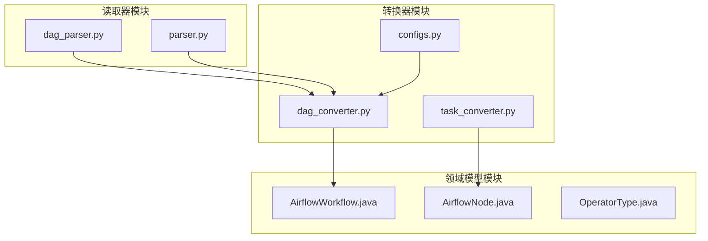
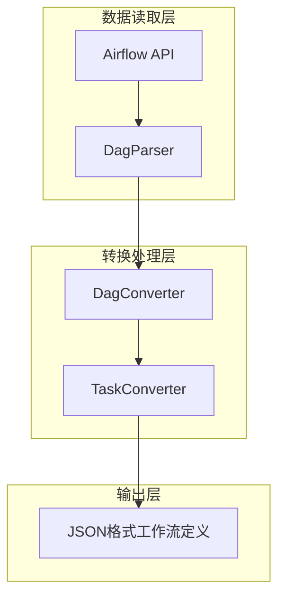
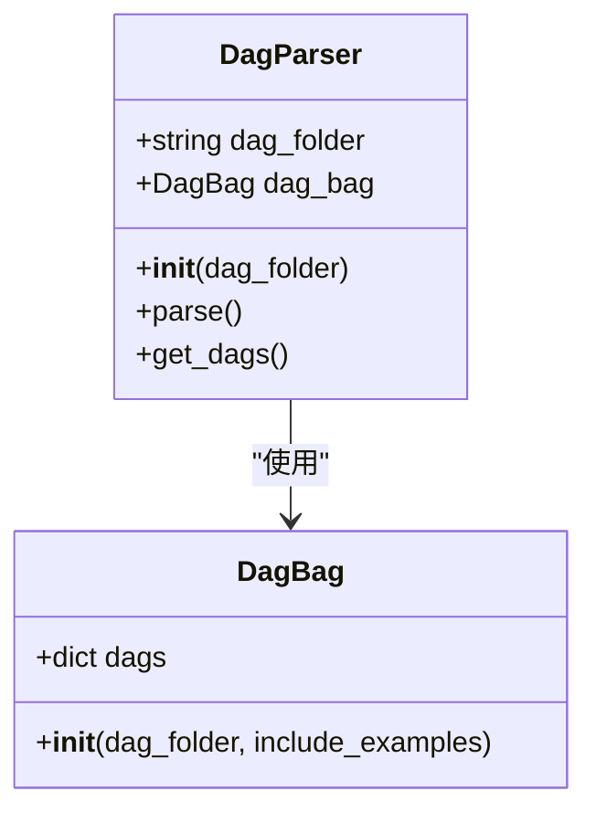
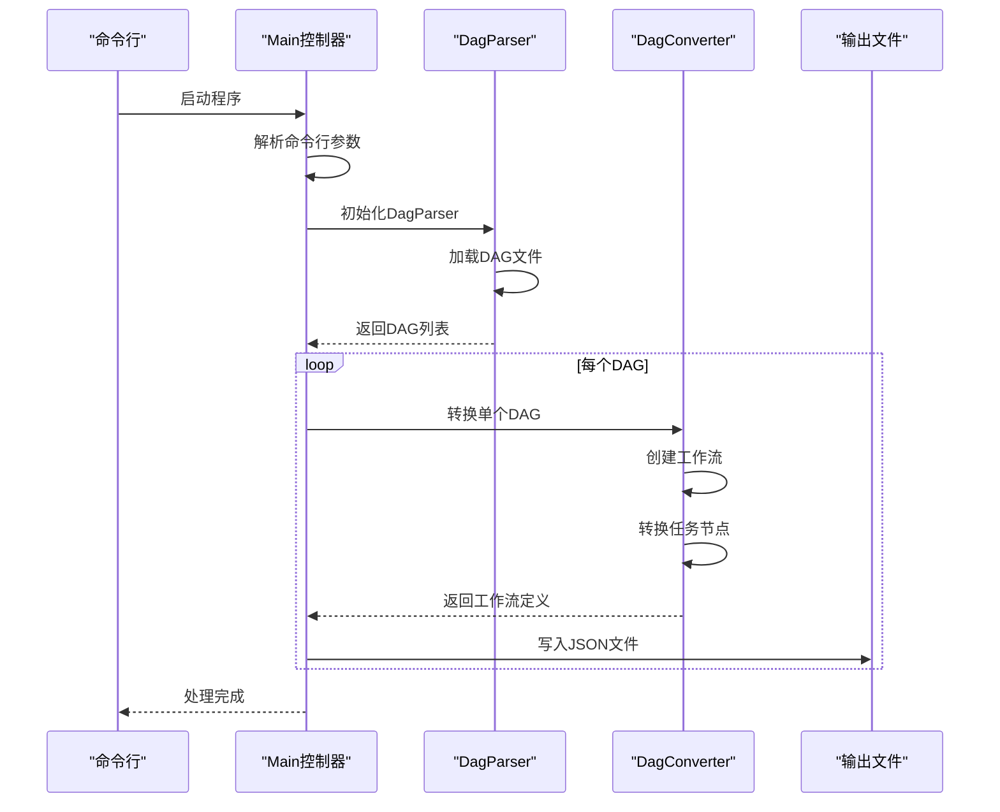
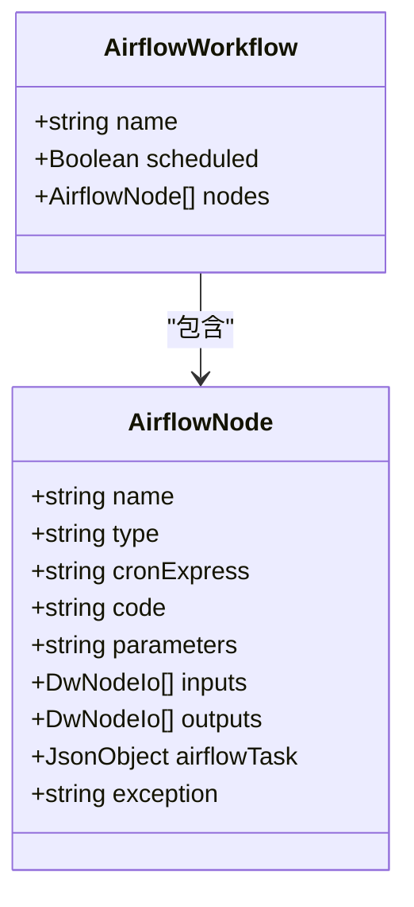
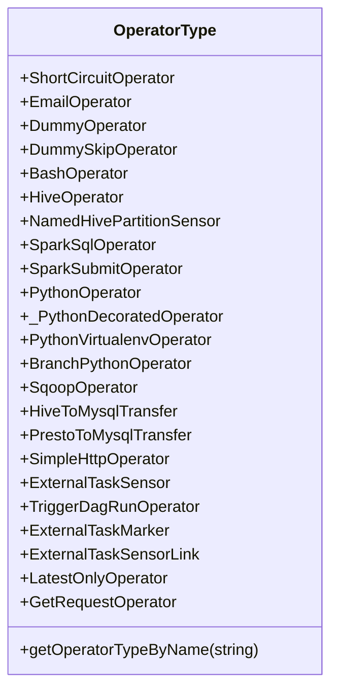
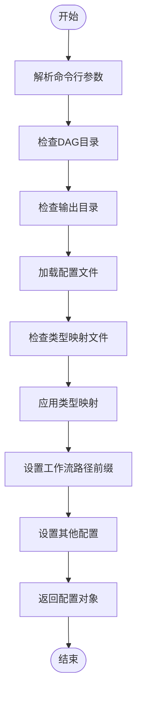
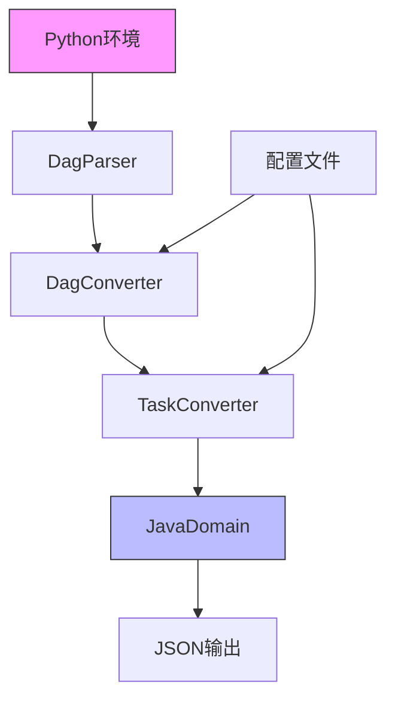

# Airflow读取器

<cite>
**本文档引用的文件**
- [dag_parser.py](file://client/migrationx/migrationx-reader/src/main/python/src/airflow_dag_parser/dag_parser.py)
- [parser.py](file://client/migrationx-transformer/src/main/python/airflow_dag_parser/parser.py)
- [AirflowWorkflow.java](file://client/migrationx/migrationx-domain/migrationx-domain-airflow/src/main/java/com/aliyun/dataworks/migrationx/domain/dataworks/airflow/AirflowWorkflow.java)
- [AirflowNode.java](file://client/migrationx/migrationx-domain/migrationx-domain-airflow/src/main/java/com/aliyun/dataworks/migrationx/domain/dataworks/airflow/AirflowNode.java)
- [OperatorType.java](file://client/migrationx/migrationx-domain/migrationx-domain-airflow/src/main/java/com/aliyun/dataworks/migrationx/domain/dataworks/airflow/OperatorType.java)
- [DagConverter.py](file://client/migrationx-transformer/src/main/python/airflow_dag_parser/converter/dag_converter.py)
- [task_converter.py](file://client/migrationx-transformer/src/main/python/airflow_dag_parser/converter/task_converter.py)
- [configs.py](file://client/migrationx-transformer/src/main/python/airflow_dag_parser/common/configs.py)
</cite>

## 目录
1. [简介](#简介)
2. [项目结构](#项目结构)
3. [核心组件](#核心组件)
4. [架构概述](#架构概述)
5. [详细组件分析](#详细组件分析)
6. [依赖分析](#依赖分析)
7. [性能考虑](#性能考虑)
8. [故障排除指南](#故障排除指南)
9. [结论](#结论)

## 简介
本文档详细介绍了Airflow读取器的工作原理，重点阐述了如何从Apache Airflow读取DAG定义。文档解释了AirflowCommandApp如何通过Python脚本解析器(dag_parser.py)提取DAG元数据，包括任务节点、依赖关系、调度周期等信息。同时详细说明了Python到Java的跨语言调用机制，以及如何将Airflow的Operator模型映射到DataWorks的节点类型。

## 项目结构
Airflow读取器的项目结构主要分为几个核心模块：读取器(reader)、转换器(transformer)和领域模型(domain)。读取器负责从Airflow环境中提取DAG定义，转换器负责将提取的数据转换为DataWorks兼容的格式，领域模型则定义了数据结构和类型。

**图源**
- [dag_parser.py](file://client/migrationx/migrationx-reader/src/main/python/src/airflow_dag_parser/dag_parser.py)
- [parser.py](file://client/migrationx-transformer/src/main/python/airflow_dag_parser/parser.py)
- [AirflowWorkflow.java](file://client/migrationx/migrationx-domain/migrationx-domain-airflow/src/main/java/com/aliyun/dataworks/migrationx/domain/dataworks/airflow/AirflowWorkflow.java)

**节源**
- [dag_parser.py](file://client/migrationx/migrationx-reader/src/main/python/src/airflow_dag_parser/dag_parser.py)
- [parser.py](file://client/migrationx-transformer/src/main/python/airflow_dag_parser/parser.py)

## 核心组件
Airflow读取器的核心组件包括DAG解析器、任务转换器和类型映射器。DAG解析器负责加载和解析Airflow的DAG文件，任务转换器将Airflow的任务节点转换为DataWorks的节点模型，类型映射器则处理不同系统间的操作符类型映射。

**节源**
- [dag_parser.py](file://client/migrationx/migrationx-reader/src/main/python/src/airflow_dag_parser/dag_parser.py)
- [task_converter.py](file://client/migrationx-transformer/src/main/python/airflow_dag_parser/converter/task_converter.py)
- [OperatorType.java](file://client/migrationx/migrationx-domain/migrationx-domain-airflow/src/main/java/com/aliyun/dataworks/migrationx/domain/dataworks/airflow/OperatorType.java)

## 架构概述
Airflow读取器采用分层架构设计，从下到上分别为数据读取层、转换处理层和输出层。数据读取层使用Airflow的DagBag类加载DAG定义，转换处理层将原始DAG数据转换为DataWorks的工作流规范，输出层则生成最终的JSON格式工作流定义。

**图源**
- [dag_parser.py](file://client/migrationx/migrationx-reader/src/main/python/src/airflow_dag_parser/dag_parser.py)
- [DagConverter.py](file://client/migrationx-transformer/src/main/python/airflow_dag_parser/converter/dag_converter.py)

## 详细组件分析

### DAG解析器分析
DAG解析器是Airflow读取器的核心组件之一，负责从指定目录加载和解析所有DAG文件。它使用Airflow内置的DagBag类来处理DAG文件的加载和语法解析。

**图源**
- [dag_parser.py](file://client/migrationx/migrationx-reader/src/main/python/src/airflow_dag_parser/dag_parser.py)

**节源**
- [dag_parser.py](file://client/migrationx/migrationx-reader/src/main/python/src/airflow_dag_parser/dag_parser.py#L8-L26)

### 主处理流程分析
主处理流程控制器负责协调整个DAG解析和转换过程，从命令行参数解析到最终工作流文件的生成。

**图源**
- [parser.py](file://client/migrationx-transformer/src/main/python/airflow_dag_parser/parser.py#L35-L190)

**节源**
- [parser.py](file://client/migrationx-transformer/src/main/python/airflow_dag_parser/parser.py#L35-L190)

### 领域模型分析
Airflow读取器的Java领域模型定义了从Airflow到DataWorks的数据转换结构，包括工作流、节点和操作符类型等核心概念。

#### Airflow工作流模型

**图源**
- [AirflowWorkflow.java](file://client/migrationx/migrationx-domain/migrationx-domain-airflow/src/main/java/com/aliyun/dataworks/migrationx/domain/dataworks/airflow/AirflowWorkflow.java)
- [AirflowNode.java](file://client/migrationx/migrationx-domain/migrationx-domain-airflow/src/main/java/com/aliyun/dataworks/migrationx/domain/dataworks/airflow/AirflowNode.java)

**节源**
- [AirflowWorkflow.java](file://client/migrationx/migrationx-domain/migrationx-domain-airflow/src/main/java/com/aliyun/dataworks/migrationx/domain/dataworks/airflow/AirflowWorkflow.java#L31-L35)
- [AirflowNode.java](file://client/migrationx/migrationx-domain/migrationx-domain-airflow/src/main/java/com/aliyun/dataworks/migrationx/domain/dataworks/airflow/AirflowNode.java#L33-L44)

#### 操作符类型枚举

**图源**
- [OperatorType.java](file://client/migrationx/migrationx-domain/migrationx-domain-airflow/src/main/java/com/aliyun/dataworks/migrationx/domain/dataworks/airflow/OperatorType.java)

**节源**
- [OperatorType.java](file://client/migrationx/migrationx-domain/migrationx-domain-airflow/src/main/java/com/aliyun/dataworks/migrationx/domain/dataworks/airflow/OperatorType.java#L27-L62)

### 配置管理分析
配置管理系统负责管理类型映射、工作流路径前缀等运行时配置，支持通过外部JSON文件覆盖默认配置。

**图源**
- [parser.py](file://client/migrationx-transformer/src/main/python/airflow_dag_parser/parser.py#L122-L179)

**节源**
- [parser.py](file://client/migrationx-transformer/src/main/python/airflow_dag_parser/parser.py#L122-L179)
- [configs.py](file://client/migrationx-transformer/src/main/python/airflow_dag_parser/common/configs.py)

## 依赖分析
Airflow读取器的依赖关系清晰地展示了各组件之间的交互和数据流。Python组件负责DAG的读取和初步处理，Java领域模型提供类型定义和数据结构，转换器组件则完成最终的数据转换。

**图源**
- [go.mod](file://go.mod)
- [pom.xml](file://client/migrationx/migrationx-transformer/pom.xml)

**节源**
- [parser.py](file://client/migrationx-transformer/src/main/python/airflow_dag_parser/parser.py)
- [DagConverter.py](file://client/migrationx-transformer/src/main/python/airflow_dag_parser/converter/dag_converter.py)

## 性能考虑
Airflow读取器在设计时考虑了性能优化，通过批量处理DAG文件、缓存配置信息和并行转换等机制提高处理效率。建议在处理大量DAG文件时，合理配置Python环境和内存资源，以确保解析过程的稳定性和效率。

## 故障排除指南
当遇到DAG解析错误时，首先检查Python环境配置是否正确，确保Airflow相关依赖已正确安装。查看日志文件中的详细错误信息，特别是语法错误和导入错误。对于复杂的DAG文件，可以尝试简化测试用例来定位问题。确保DAG文件路径配置正确，并且有适当的读取权限。

**节源**
- [dag_parser.py](file://client/migrationx/migrationx-reader/src/main/python/src/airflow_dag_parser/dag_parser.py)
- [parser.py](file://client/migrationx-transformer/src/main/python/airflow_dag_parser/parser.py)

## 结论
Airflow读取器提供了一套完整的解决方案，用于将Apache Airflow的DAG定义转换为DataWorks兼容的工作流格式。通过清晰的架构设计和模块化实现，系统能够高效地处理各种复杂的DAG结构，并支持灵活的配置和扩展。该工具对于从Airflow迁移到DataWorks的场景具有重要价值。