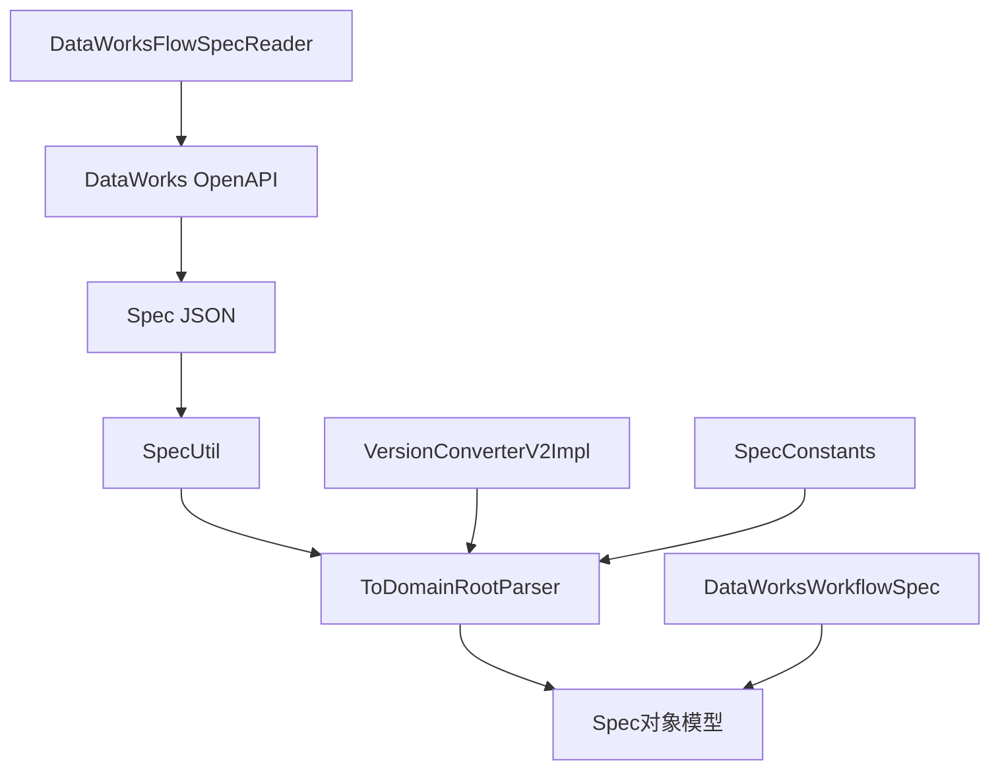
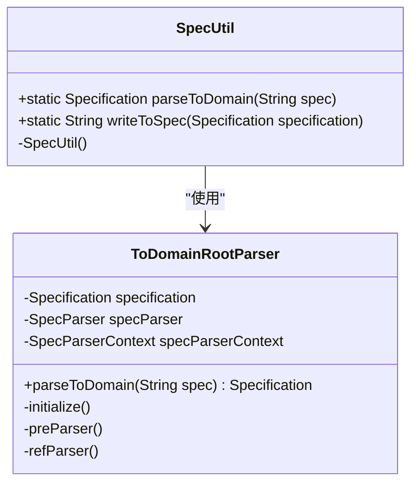
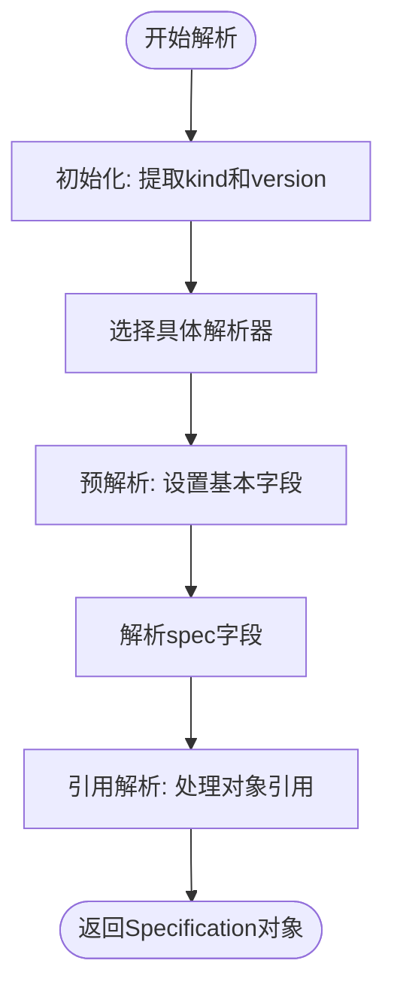
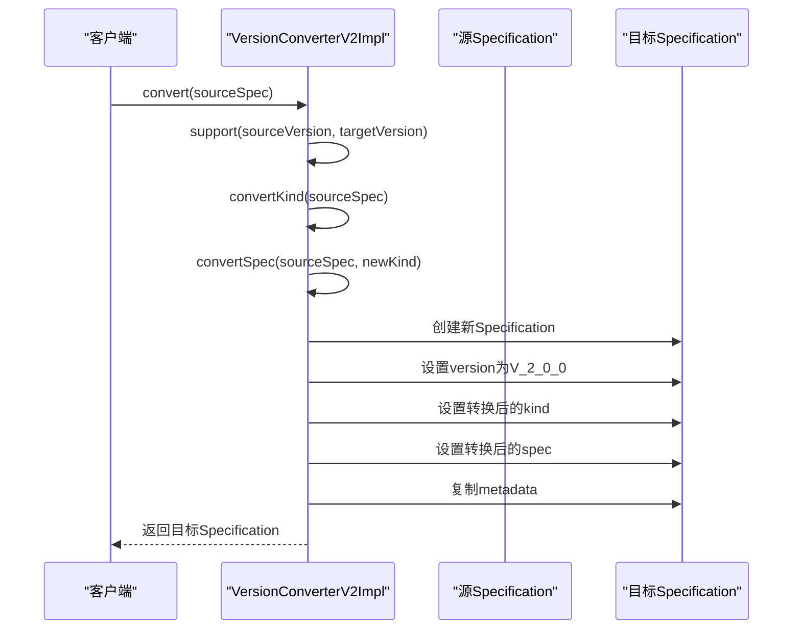
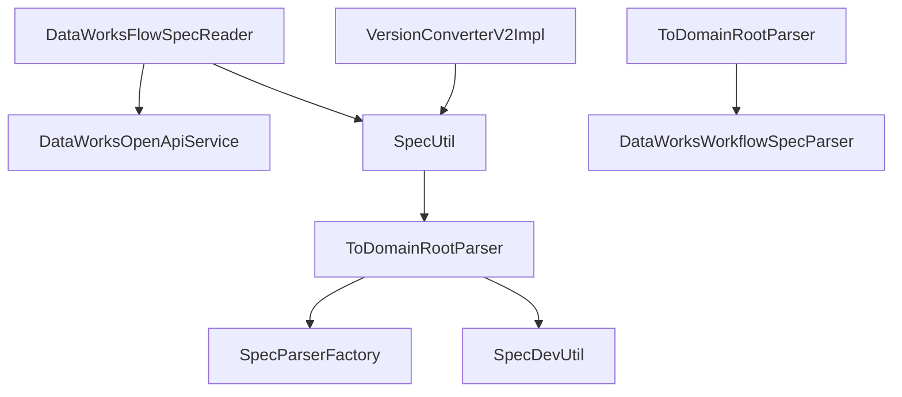

# DataWorks读取器

<cite>
**本文档引用的文件**  
- [DataWorksFlowSpecReader.java](file://client/migrationx/migrationx-reader/src/main/java/com/aliyun/dataworks/migrationx/reader/dataworks/DataWorksFlowSpecReader.java)
- [SpecUtil.java](file://spec/src/main/java/com/aliyun/dataworks/common/spec/SpecUtil.java)
- [ToDomainRootParser.java](file://spec/src/main/java/com/aliyun/dataworks/common/spec/parser/ToDomainRootParser.java)
- [VersionConverterV2Impl.java](file://spec/src/main/java/com/aliyun/dataworks/common/spec/version/VersionConverterV2Impl.java)
- [DataWorksWorkflowSpec.java](file://spec/src/main/java/com/aliyun/dataworks/common/spec/domain/DataWorksWorkflowSpec.java)
- [SpecConstants.java](file://spec/src/main/java/com/aliyun/dataworks/common/spec/domain/SpecConstants.java)
</cite>

## 目录
1. [简介](#简介)
2. [核心组件](#核心组件)
3. [架构概述](#架构概述)
4. [详细组件分析](#详细组件分析)
5. [依赖分析](#依赖分析)
6. [性能考虑](#性能考虑)
7. [故障排除指南](#故障排除指南)
8. [结论](#结论)

## 简介
DataWorks读取器是DataWorks平台中用于解析和处理FlowSpec文件的核心组件。该系统能够从本地或远程位置读取JSON格式的Spec文件，并将其反序列化为Java领域对象模型。本系统支持不同版本的Spec格式，包括v1到v2的兼容性转换，确保了向后兼容性和平滑的版本升级。通过SpecUtil工具类，系统提供了强大的JSON解析功能，能够处理复杂的嵌套结构和引用关系。读取器还支持从OSS等远程存储读取Spec文件，提供了灵活的配置选项，包括文件路径、编码格式等参数。系统设计注重错误处理和日志记录，能够有效诊断和解决JSON解析错误、版本不兼容等常见问题。

## 核心组件
DataWorks读取器的核心组件包括DataWorksFlowSpecReader、SpecUtil、ToDomainRootParser和VersionConverterV2Impl。DataWorksFlowSpecReader负责从DataWorks OpenAPI读取工作流定义，并将Spec内容写入本地文件。SpecUtil是核心工具类，提供将JSON字符串解析为领域对象模型的功能。ToDomainRootParser是SpecUtil的底层实现，负责具体的解析逻辑，包括初始化、预解析和引用解析。VersionConverterV2Impl处理不同版本Spec格式的转换，确保系统能够处理v1到v2的兼容性转换。这些组件协同工作，实现了完整的Spec文件读取和解析功能。

**本节来源**
- [DataWorksFlowSpecReader.java](file://client/migrationx/migrationx-reader/src/main/java/com/aliyun/dataworks/migrationx/reader/dataworks/DataWorksFlowSpecReader.java)
- [SpecUtil.java](file://spec/src/main/java/com/aliyun/dataworks/common/spec/SpecUtil.java)
- [ToDomainRootParser.java](file://spec/src/main/java/com/aliyun/dataworks/common/spec/parser/ToDomainRootParser.java)
- [VersionConverterV2Impl.java](file://spec/src/main/java/com/aliyun/dataworks/common/spec/version/VersionConverterV2Impl.java)

## 架构概述
DataWorks读取器采用分层架构设计，各组件职责明确，协同工作。系统从DataWorksFlowSpecReader开始，通过命令行接口接收配置参数，调用DataWorks OpenAPI服务读取远程工作流定义。获取的Spec JSON字符串通过SpecUtil工具类进行解析，SpecUtil内部使用ToDomainRootParser执行具体的解析过程。ToDomainRootParser首先初始化解析上下文，然后执行预解析阶段，设置基本字段值，最后处理对象间的引用关系。对于不同版本的Spec格式，系统通过VersionConverterV2Impl进行转换，确保兼容性。整个架构设计遵循单一职责原则，各组件松耦合，便于维护和扩展。

**图表来源**
- [DataWorksFlowSpecReader.java](file://client/migrationx/migrationx-reader/src/main/java/com/aliyun/dataworks/migrationx/reader/dataworks/DataWorksFlowSpecReader.java)
- [SpecUtil.java](file://spec/src/main/java/com/aliyun/dataworks/common/spec/SpecUtil.java)
- [ToDomainRootParser.java](file://spec/src/main/java/com/aliyun/dataworks/common/spec/parser/ToDomainRootParser.java)
- [VersionConverterV2Impl.java](file://spec/src/main/java/com/aliyun/dataworks/common/spec/version/VersionConverterV2Impl.java)
- [SpecConstants.java](file://spec/src/main/java/com/aliyun/dataworks/common/spec/domain/SpecConstants.java)
- [DataWorksWorkflowSpec.java](file://spec/src/main/java/com/aliyun/dataworks/common/spec/domain/DataWorksWorkflowSpec.java)

## 详细组件分析

### DataWorksFlowSpecReader分析
DataWorksFlowSpecReader是读取器的主要入口点，负责从DataWorks平台读取工作流定义。该组件通过命令行接口接收配置参数，包括endpoint、projectId、文件路径等。它使用DataWorksOpenApiService与DataWorks平台进行交互，通过分页方式获取所有工作流定义。对于每个工作流，提取其Spec JSON内容，并写入指定的输出文件。该组件支持过滤特定工作流ID，提供了灵活的读取选项。在写入文件时，将多个工作流的Spec内容组织为JSON数组格式，便于后续处理。

**本节来源**
- [DataWorksFlowSpecReader.java](file://client/migrationx/migrationx-reader/src/main/java/com/aliyun/dataworks/migrationx/reader/dataworks/DataWorksFlowSpecReader.java)

### SpecUtil工具类分析
SpecUtil是Spec解析系统的核心工具类，提供了将JSON字符串转换为领域对象模型的静态方法。其主要方法parseToDomain接收JSON字符串作为输入，返回对应的Specification对象。该方法内部创建ToDomainRootParser实例，并调用其parseToDomain方法执行解析。SpecUtil还提供了writeToSpec方法，用于将领域对象模型序列化回JSON字符串。该工具类封装了复杂的解析逻辑，为上层应用提供了简洁的API接口。

**图表来源**
- [SpecUtil.java](file://spec/src/main/java/com/aliyun/dataworks/common/spec/SpecUtil.java)
- [ToDomainRootParser.java](file://spec/src/main/java/com/aliyun/dataworks/common/spec/parser/ToDomainRootParser.java)

**本节来源**
- [SpecUtil.java](file://spec/src/main/java/com/aliyun/dataworks/common/spec/SpecUtil.java)

### ToDomainRootParser解析流程分析
ToDomainRootParser是Spec解析的核心实现，采用多阶段解析策略。解析过程分为三个主要阶段：初始化、预解析和引用解析。在初始化阶段，解析器从JSON上下文中提取kind和version信息，确定使用哪个具体的解析器（SpecParser）。预解析阶段处理基本字段的赋值，包括简单字段、枚举字段和Map字段。最后的引用解析阶段处理对象间的引用关系，通过实体上下文和实体映射来解析和替换引用对象。这种分阶段的设计使得解析过程清晰有序，便于处理复杂的对象关系。

**图表来源**
- [ToDomainRootParser.java](file://spec/src/main/java/com/aliyun/dataworks/common/spec/parser/ToDomainRootParser.java)

**本节来源**
- [ToDomainRootParser.java](file://spec/src/main/java/com/aliyun/dataworks/common/spec/parser/ToDomainRootParser.java)

### 版本兼容性转换分析
VersionConverterV2Impl负责处理不同版本Spec格式的转换，确保系统能够处理v1到v2的兼容性转换。该组件实现了VersionConverter接口，通过support方法判断是否支持特定的版本转换。convert方法执行具体的转换逻辑，根据源Specification的kind类型，将其转换为目标版本的格式。转换过程中，会重新组织Spec对象的结构，确保符合目标版本的规范。该组件的设计使得系统能够平滑地支持Spec格式的演进，同时保持对旧版本格式的兼容性。

**图表来源**
- [VersionConverterV2Impl.java](file://spec/src/main/java/com/aliyun/dataworks/common/spec/version/VersionConverterV2Impl.java)

**本节来源**
- [VersionConverterV2Impl.java](file://spec/src/main/java/com/aliyun/dataworks/common/spec/version/VersionConverterV2Impl.java)

## 依赖分析
DataWorks读取器的组件间依赖关系清晰，遵循分层设计原则。DataWorksFlowSpecReader依赖于DataWorksOpenApiService进行远程调用，获取工作流定义。SpecUtil作为高层工具类，依赖于ToDomainRootParser执行具体的解析逻辑。ToDomainRootParser依赖于SpecParserFactory获取具体的解析器实现，并使用SpecDevUtil工具类进行字段赋值和对象操作。VersionConverterV2Impl依赖于SpecUtil来查找匹配的实体对象。整个依赖关系呈现为树状结构，高层组件依赖于低层组件，但低层组件不依赖于高层组件，确保了系统的可维护性和可测试性。

**图表来源**
- [DataWorksFlowSpecReader.java](file://client/migrationx/migrationx-reader/src/main/java/com/aliyun/dataworks/migrationx/reader/dataworks/DataWorksFlowSpecReader.java)
- [SpecUtil.java](file://spec/src/main/java/com/aliyun/dataworks/common/spec/SpecUtil.java)
- [ToDomainRootParser.java](file://spec/src/main/java/com/aliyun/dataworks/common/spec/parser/ToDomainRootParser.java)
- [VersionConverterV2Impl.java](file://spec/src/main/java/com/aliyun/dataworks/common/spec/version/VersionConverterV2Impl.java)

**本节来源**
- [DataWorksFlowSpecReader.java](file://client/migrationx/migrationx-reader/src/main/java/com/aliyun/dataworks/migrationx/reader/dataworks/DataWorksFlowSpecReader.java)
- [SpecUtil.java](file://spec/src/main/java/com/aliyun/dataworks/common/spec/SpecUtil.java)
- [ToDomainRootParser.java](file://spec/src/main/java/com/aliyun/dataworks/common/spec/parser/ToDomainRootParser.java)
- [VersionConverterV2Impl.java](file://spec/src/main/java/com/aliyun/dataworks/common/spec/version/VersionConverterV2Impl.java)

## 性能考虑
DataWorks读取器在设计时考虑了性能优化。DataWorksFlowSpecReader采用分页方式读取工作流定义，避免一次性加载大量数据导致内存溢出。SpecUtil和ToDomainRootParser采用流式解析策略，逐个处理JSON对象，减少内存占用。系统使用Reflections库进行类路径扫描，缓存解析器实例，避免重复创建。在处理大型Spec文件时，建议合理设置JVM堆内存大小，并考虑使用流式处理方式。对于频繁的解析操作，可以考虑缓存解析结果，避免重复解析相同的Spec文件。

## 故障排除指南
在使用DataWorks读取器时，可能会遇到JSON解析错误、版本不兼容等问题。对于JSON解析错误，首先检查输入的JSON格式是否正确，确保符合Spec格式规范。可以通过SpecValidateUtil工具类验证JSON的有效性。对于版本不兼容问题，检查Spec文件的version字段，确保系统支持该版本。在解析过程中，启用详细的日志记录，可以帮助定位问题。常见的错误包括缺少必需字段、字段类型不匹配、引用对象不存在等。通过查看日志中的错误信息，可以快速定位并解决问题。

**本节来源**
- [SpecUtil.java](file://spec/src/main/java/com/aliyun/dataworks/common/spec/SpecUtil.java)
- [ToDomainRootParser.java](file://spec/src/main/java/com/aliyun/dataworks/common/spec/parser/ToDomainRootParser.java)
- [SpecValidateUtil.java](file://spec/src/main/java/com/aliyun/dataworks/common/spec/utils/SpecValidateUtil.java)

## 结论
DataWorks读取器是一个功能强大且设计良好的系统，能够高效地解析和处理FlowSpec文件。通过分层架构和清晰的组件职责划分，系统实现了高内聚低耦合的设计目标。SpecUtil工具类提供了简洁的API接口，ToDomainRootParser实现了复杂的解析逻辑，VersionConverterV2Impl确保了版本兼容性。整个系统设计考虑了性能、可维护性和可扩展性，为DataWorks平台的Spec文件处理提供了可靠的基础。通过合理的配置和使用，可以有效支持各种Spec文件的读取和解析需求。