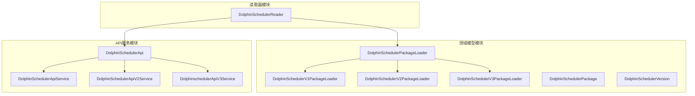
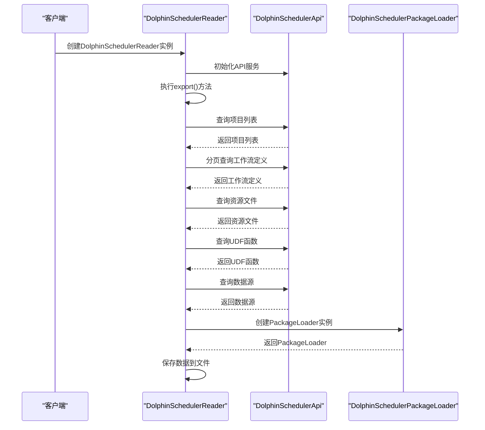
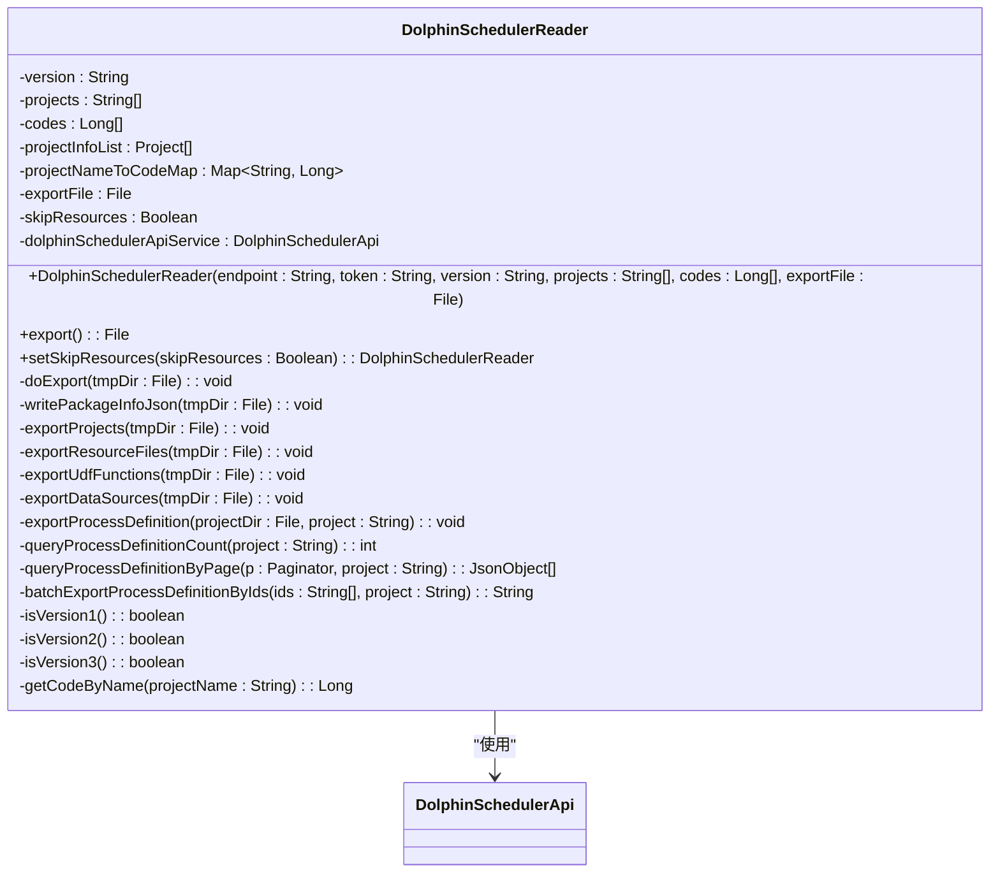
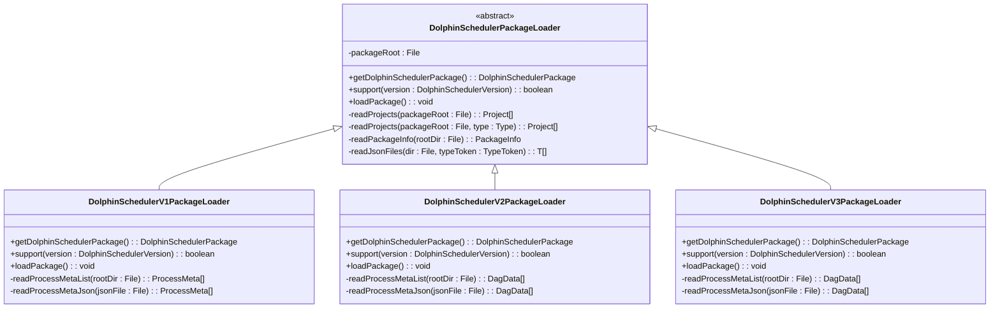
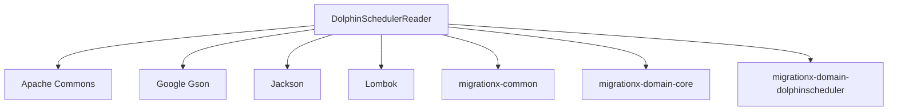

# DolphinScheduler读取器

<cite>
**本文档引用的文件**  
- [DolphinSchedulerReader.java](file://client/migrationx/migrationx-reader/src/main/java/com/aliyun/dataworks/migrationx/reader/dolphinscheduler/DolphinSchedulerReader.java)
- [DolphinSchedulerPackageLoader.java](file://client/migrationx/migrationx-domain/migrationx-domain-dolphinscheduler/src/main/java/com/aliyun/dataworks/migrationx/domain/dataworks/dolphinscheduler/service/DolphinSchedulerPackageLoader.java)
- [DolphinSchedulerV1PackageLoader.java](file://client/migrationx/migrationx-domain/migrationx-domain-dolphinscheduler/src/main/java/com/aliyun/dataworks/migrationx/domain/dataworks/dolphinscheduler/service/DolphinSchedulerV1PackageLoader.java)
- [DolphinSchedulerV2PackageLoader.java](file://client/migrationx/migrationx-domain/migrationx-domain-dolphinscheduler/src/main/java/com/aliyun/dataworks/migrationx/domain/dataworks/dolphinscheduler/service/DolphinSchedulerV2PackageLoader.java)
- [DolphinSchedulerV3PackageLoader.java](file://client/migrationx/migrationx-domain/migrationx-domain-dolphinscheduler/src/main/java/com/aliyun/dataworks/migrationx/domain/dataworks/dolphinscheduler/service/DolphinSchedulerV3PackageLoader.java)
- [DolphinSchedulerApiService.java](file://client/migrationx/migrationx-domain/migrationx-domain-dolphinscheduler/src/main/java/com/aliyun/dataworks/migrationx/domain/dataworks/dolphinscheduler/v1/DolphinSchedulerApiService.java)
- [DolphinSchedulerApiV2Service.java](file://client/migrationx/migrationx-domain/migrationx-domain-dolphinscheduler/src/main/java/com/aliyun/dataworks/migrationx/domain/dataworks/dolphinscheduler/v2/DolphinSchedulerApiV2Service.java)
- [DolphinschedulerApiV3Service.java](file://client/migrationx/migrationx-domain/migrationx-domain-dolphinscheduler/src/main/java/com/aliyun/dataworks/migrationx/domain/dataworks/dolphinscheduler/v3/DolphinschedulerApiV3Service.java)
- [DolphinSchedulerVersion.java](file://client/migrationx/migrationx-domain/migrationx-domain-dolphinscheduler/src/main/java/com/aliyun/dataworks/migrationx/domain/dataworks/dolphinscheduler/DolphinSchedulerVersion.java)
- [PackageInfo.java](file://client/migrationx/migrationx-domain/migrationx-domain-dolphinscheduler/src/main/java/com/aliyun/dataworks/migrationx/domain/dataworks/dolphinscheduler/PackageInfo.java)
</cite>

## 目录
1. [简介](#简介)
2. [项目结构](#项目结构)
3. [核心组件](#核心组件)
4. [架构概述](#架构概述)
5. [详细组件分析](#详细组件分析)
6. [依赖分析](#依赖分析)
7. [性能考虑](#性能考虑)
8. [故障排除指南](#故障排除指南)
9. [结论](#结论)

## 简介
DolphinScheduler读取器是DataWorks迁移工具套件中的一个关键组件，负责从DolphinScheduler系统中读取工作流元数据。该读取器通过REST API与DolphinScheduler交互，支持v1、v2、v3三个主要版本的API，能够分页获取项目、工作流定义、资源文件、数据源等信息，并将其转换为内部统一模型。读取器的设计考虑了多版本兼容性，通过工厂模式和策略模式实现了不同版本API的适配，确保了对不同DolphinScheduler版本的无缝支持。

## 项目结构
DolphinScheduler读取器的代码结构遵循模块化设计原则，主要分为读取器模块、领域模型模块和API服务模块。读取器模块负责协调数据读取流程，领域模型模块定义了DolphinScheduler的元数据模型，API服务模块封装了与DolphinScheduler REST API的交互逻辑。

**图表来源**
- [DolphinSchedulerReader.java](file://client/migrationx/migrationx-reader/src/main/java/com/aliyun/dataworks/migrationx/reader/dolphinscheduler/DolphinSchedulerReader.java)
- [DolphinSchedulerPackageLoader.java](file://client/migrationx/migrationx-domain/migrationx-domain-dolphinscheduler/src/main/java/com/aliyun/dataworks/migrationx/domain/dataworks/dolphinscheduler/service/DolphinSchedulerPackageLoader.java)
- [DolphinSchedulerApiService.java](file://client/migrationx/migrationx-domain/migrationx-domain-dolphinscheduler/src/main/java/com/aliyun/dataworks/migrationx/domain/dataworks/dolphinscheduler/v1/DolphinSchedulerApiService.java)

**章节来源**
- [DolphinSchedulerReader.java](file://client/migrationx/migrationx-reader/src/main/java/com/aliyun/dataworks/migrationx/reader/dolphinscheduler/DolphinSchedulerReader.java)
- [DolphinSchedulerPackageLoader.java](file://client/migrationx/migrationx-domain/migrationx-domain-dolphinscheduler/src/main/java/com/aliyun/dataworks/migrationx/domain/dataworks/dolphinscheduler/service/DolphinSchedulerPackageLoader.java)

## 核心组件
DolphinScheduler读取器的核心组件包括DolphinSchedulerReader、DolphinSchedulerPackageLoader和DolphinSchedulerApi。DolphinSchedulerReader是主要的入口类，负责协调整个读取流程。DolphinSchedulerPackageLoader是一个抽象基类，定义了加载DolphinScheduler包的通用接口，并通过具体的实现类（DolphinSchedulerV1PackageLoader、DolphinSchedulerV2PackageLoader、DolphinSchedulerV3PackageLoader）支持不同版本的DolphinScheduler。DolphinSchedulerApi是一个接口，定义了与DolphinScheduler REST API交互的方法，具体的实现类根据DolphinScheduler的版本提供了不同的API调用方式。

**章节来源**
- [DolphinSchedulerReader.java](file://client/migrationx/migrationx-reader/src/main/java/com/aliyun/dataworks/migrationx/reader/dolphinscheduler/DolphinSchedulerReader.java)
- [DolphinSchedulerPackageLoader.java](file://client/migrationx/migrationx-domain/migrationx-domain-dolphinscheduler/src/main/java/com/aliyun/dataworks/migrationx/domain/dataworks/dolphinscheduler/service/DolphinSchedulerPackageLoader.java)
- [DolphinSchedulerApi.java](file://client/migrationx/migrationx-domain/migrationx-domain-dolphinscheduler/src/main/java/com/aliyun/dataworks/migrationx/domain/dataworks/dolphinscheduler/v1/DolphinSchedulerApi.java)

## 架构概述
DolphinScheduler读取器的架构设计采用了分层模式，将数据读取、数据处理和数据存储分离。读取器首先通过API服务模块与DolphinScheduler交互，获取原始的JSON数据；然后通过领域模型模块将原始数据转换为内部统一的Java对象模型；最后通过读取器模块将处理后的数据保存到指定的输出文件中。

**图表来源**
- [DolphinSchedulerReader.java](file://client/migrationx/migrationx-reader/src/main/java/com/aliyun/dataworks/migrationx/reader/dolphinscheduler/DolphinSchedulerReader.java)
- [DolphinSchedulerApi.java](file://client/migrationx/migrationx-domain/migrationx-domain-dolphinscheduler/src/main/java/com/aliyun/dataworks/migrationx/domain/dataworks/dolphinscheduler/v1/DolphinSchedulerApi.java)
- [DolphinSchedulerPackageLoader.java](file://client/migrationx/migrationx-domain/migrationx-domain-dolphinscheduler/src/main/java/com/aliyun/dataworks/migrationx/domain/dataworks/dolphinscheduler/service/DolphinSchedulerPackageLoader.java)

## 详细组件分析

### DolphinSchedulerReader分析
DolphinSchedulerReader是读取器的主要实现类，负责协调整个数据读取流程。它通过构造函数接收DolphinScheduler的API端点、认证令牌、版本号、项目列表、工作流代码列表和输出文件等参数。在构造函数中，根据指定的版本号初始化相应的API服务实例。export()方法是主要的入口方法，它创建临时目录，调用doExport()方法执行数据导出，最后根据输出文件的扩展名决定是否将临时目录打包为ZIP文件。

**图表来源**
- [DolphinSchedulerReader.java](file://client/migrationx/migrationx-reader/src/main/java/com/aliyun/dataworks/migrationx/reader/dolphinscheduler/DolphinSchedulerReader.java)

**章节来源**
- [DolphinSchedulerReader.java](file://client/migrationx/migrationx-reader/src/main/java/com/aliyun/dataworks/migrationx/reader/dolphinscheduler/DolphinSchedulerReader.java)

### DolphinSchedulerPackageLoader分析
DolphinSchedulerPackageLoader是一个抽象基类，定义了加载DolphinScheduler包的通用接口。它通过工厂方法create()根据package_info.json中的版本信息创建相应的具体加载器实例。具体的加载器实现类（DolphinSchedulerV1PackageLoader、DolphinSchedulerV2PackageLoader、DolphinSchedulerV3PackageLoader）继承自该基类，并实现了具体的加载逻辑。

**图表来源**
- [DolphinSchedulerPackageLoader.java](file://client/migrationx/migrationx-domain/migrationx-domain-dolphinscheduler/src/main/java/com/aliyun/dataworks/migrationx/domain/dataworks/dolphinscheduler/service/DolphinSchedulerPackageLoader.java)
- [DolphinSchedulerV1PackageLoader.java](file://client/migrationx/migrationx-domain/migrationx-domain-dolphinscheduler/src/main/java/com/aliyun/dataworks/migrationx/domain/dataworks/dolphinscheduler/service/DolphinSchedulerV1PackageLoader.java)
- [DolphinSchedulerV2PackageLoader.java](file://client/migrationx/migrationx-domain/migrationx-domain-dolphinscheduler/src/main/java/com/aliyun/dataworks/migrationx/domain/dataworks/dolphinscheduler/service/DolphinSchedulerV2PackageLoader.java)
- [DolphinSchedulerV3PackageLoader.java](file://client/migrationx/migrationx-domain/migrationx-domain-dolphinscheduler/src/main/java/com/aliyun/dataworks/migrationx/domain/dataworks/dolphinscheduler/service/DolphinSchedulerV3PackageLoader.java)

**章节来源**
- [DolphinSchedulerPackageLoader.java](file://client/migrationx/migrationx-domain/migrationx-domain-dolphinscheduler/src/main/java/com/aliyun/dataworks/migrationx/domain/dataworks/dolphinscheduler/service/DolphinSchedulerPackageLoader.java)

### API服务分析
DolphinScheduler的API服务模块封装了与DolphinScheduler REST API的交互逻辑。DolphinSchedulerApi是一个接口，定义了查询项目列表、查询工作流定义、导出工作流定义、查询资源列表、下载资源、查询UDF函数列表、查询数据源列表等方法。具体的实现类根据DolphinScheduler的版本提供了不同的API调用方式。

```mermaid
classDiagram
class DolphinSchedulerApi {
<<interface>>
+queryProcessDefinitionByPaging(request : QueryProcessDefinitionByPaginateRequest) : PaginateResponse~JsonObject~
+batchExportProcessDefinitionByIds(request : BatchExportProcessDefinitionByIdsRequest) : String
+queryResourceList(request : QueryResourceListRequest) : Response~JsonObject[]~
+downloadResource(request : DownloadResourceRequest) : File
+queryUdfFuncListByPaging(request : QueryUdfFuncListByPaginateRequest) : PaginateResponse~JsonObject~
+queryDataSourceListByPaging(request : QueryDataSourceListByPaginateRequest) : PaginateResponse~JsonObject~
+queryAllProjectList(request : DolphinSchedulerRequest) : Response~JsonObject[]~
}
class DolphinSchedulerApiService {
+queryProcessDefinitionByPaging(request : QueryProcessDefinitionByPaginateRequest) : PaginateResponse~JsonObject~
+batchExportProcessDefinitionByIds(request : BatchExportProcessDefinitionByIdsRequest) : String
+queryResourceList(request : QueryResourceListRequest) : Response~JsonObject[]~
+downloadResource(request : DownloadResourceRequest) : File
+queryUdfFuncListByPaging(request : QueryUdfFuncListByPaginateRequest) : PaginateResponse~JsonObject~
+queryDataSourceListByPaging(request : QueryDataSourceListByPaginateRequest) : PaginateResponse~JsonObject~
+queryAllProjectList(request : DolphinSchedulerRequest) : Response~JsonObject[]~
}
class DolphinSchedulerApiV2Service {
+queryProcessDefinitionByPaging(request : QueryProcessDefinitionByPaginateRequest) : PaginateResponse~JsonObject~
+batchExportProcessDefinitionByIds(request : BatchExportProcessDefinitionByIdsRequest) : String
+queryResourceList(request : QueryResourceListRequest) : Response~JsonObject[]~
+downloadResource(request : DownloadResourceRequest) : File
+queryUdfFuncListByPaging(request : QueryUdfFuncListByPaginateRequest) : PaginateResponse~JsonObject~
+queryDataSourceListByPaging(request : QueryDataSourceListByPaginateRequest) : PaginateResponse~JsonObject~
+queryAllProjectList(request : DolphinSchedulerRequest) : Response~JsonObject[]~
}
class DolphinschedulerApiV3Service {
+queryProcessDefinitionByPaging(request : QueryProcessDefinitionByPaginateRequest) : PaginateResponse~JsonObject~
+batchExportProcessDefinitionByIds(request : BatchExportProcessDefinitionByIdsRequest) : String
+queryResourceList(request : QueryResourceListRequest) : Response~JsonObject[]~
+downloadResource(request : DownloadResourceRequest) : File
+queryUdfFuncListByPaging(request : QueryUdfFuncListByPaginateRequest) : PaginateResponse~JsonObject~
+queryDataSourceListByPaging(request : QueryDataSourceListByPaginateRequest) : PaginateResponse~JsonObject~
+queryAllProjectList(request : DolphinSchedulerRequest) : Response~JsonObject[]~
}
DolphinSchedulerApi <|-- DolphinSchedulerApiService
DolphinSchedulerApi <|-- DolphinSchedulerApiV2Service
DolphinSchedulerApi <|-- DolphinschedulerApiV3Service
```

**图表来源**
- [DolphinSchedulerApi.java](file://client/migrationx/migrationx-domain/migrationx-domain-dolphinscheduler/src/main/java/com/aliyun/dataworks/migrationx/domain/dataworks/dolphinscheduler/v1/DolphinSchedulerApi.java)
- [DolphinSchedulerApiService.java](file://client/migrationx/migrationx-domain/migrationx-domain-dolphinscheduler/src/main/java/com/aliyun/dataworks/migrationx/domain/dataworks/dolphinscheduler/v1/DolphinSchedulerApiService.java)
- [DolphinSchedulerApiV2Service.java](file://client/migrationx/migrationx-domain/migrationx-domain-dolphinscheduler/src/main/java/com/aliyun/dataworks/migrationx/domain/dataworks/dolphinscheduler/v2/DolphinSchedulerApiV2Service.java)
- [DolphinschedulerApiV3Service.java](file://client/migrationx/migrationx-domain/migrationx-domain-dolphinscheduler/src/main/java/com/aliyun/dataworks/migrationx/domain/dataworks/dolphinscheduler/v3/DolphinschedulerApiV3Service.java)

**章节来源**
- [DolphinSchedulerApi.java](file://client/migrationx/migrationx-domain/migrationx-domain-dolphinscheduler/src/main/java/com/aliyun/dataworks/migrationx/domain/dataworks/dolphinscheduler/v1/DolphinSchedulerApi.java)

## 依赖分析
DolphinScheduler读取器依赖于多个外部库和内部模块。主要的外部依赖包括Apache Commons、Google Gson、Jackson、Lombok等。内部依赖包括migrationx-common、migrationx-domain-core等模块。这些依赖关系确保了读取器的功能完整性和代码质量。

**图表来源**
- [pom.xml](file://client/migrationx/migrationx-reader/pom.xml)

**章节来源**
- [pom.xml](file://client/migrationx/migrationx-reader/pom.xml)

## 性能考虑
DolphinScheduler读取器在设计时考虑了性能优化。通过分页查询API，避免了一次性获取大量数据导致的内存溢出问题。同时，读取器支持跳过资源文件的下载，以减少网络传输和磁盘I/O开销。对于大规模的DolphinScheduler实例，建议合理设置分页大小和并发数，以平衡性能和资源消耗。

## 故障排除指南
在使用DolphinScheduler读取器时，可能会遇到连接超时、认证失败、API版本不兼容等常见问题。针对连接超时问题，可以检查网络连接和API端点是否正确。针对认证失败问题，需要确认认证令牌是否有效。针对API版本不兼容问题，需要确保读取器的版本与DolphinScheduler的版本匹配。通过查看日志文件，可以获取详细的错误信息，帮助定位和解决问题。

**章节来源**
- [DolphinSchedulerReader.java](file://client/migrationx/migrationx-reader/src/main/java/com/aliyun/dataworks/migrationx/reader/dolphinscheduler/DolphinSchedulerReader.java)
- [DolphinSchedulerApiService.java](file://client/migrationx/migrationx-domain/migrationx-domain-dolphinscheduler/src/main/java/com/aliyun/dataworks/migrationx/domain/dataworks/dolphinscheduler/v1/DolphinSchedulerApiService.java)

## 结论
DolphinScheduler读取器是一个功能强大且设计良好的工具，能够有效地从DolphinScheduler系统中读取工作流元数据。通过支持多版本API和分页查询，读取器能够适应不同规模和版本的DolphinScheduler实例。其模块化的设计和清晰的代码结构使得维护和扩展变得更加容易。未来可以考虑增加对更多DolphinScheduler特性的支持，如任务实例、告警规则等，以提供更全面的数据迁移能力。