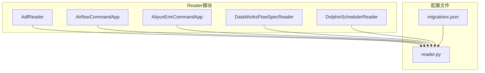
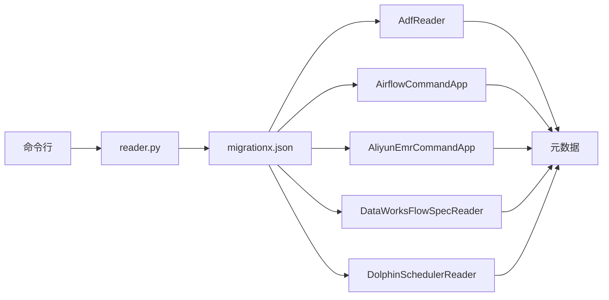
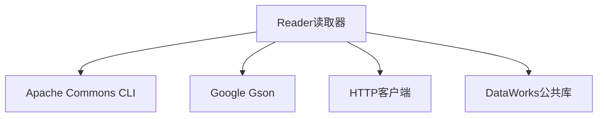

# Reader读取器

<cite>
**本文档引用的文件**
- [reader.py](file://client/migrationx/src/main/bin/reader.py)
- [migrationx.json](file://client/migrationx/src/main/conf/migrationx.json)
- [AdfReader.java](file://client/migrationx/migrationx-reader/src/main/java/com/aliyun/dataworks/migrationx/reader/adf/AdfReader.java)
- [AirflowCommandApp.java](file://client/migrationx/migrationx-reader/src/main/java/com/aliyun/dataworks/migrationx/reader/airflow/AirflowCommandApp.java)
- [AliyunEmrCommandApp.java](file://client/migrationx/migrationx-reader/src/main/java/com/aliyun/dataworks/migrationx/reader/aliyunemr/AliyunEmrCommandApp.java)
- [DataWorksFlowSpecReader.java](file://client/migrationx/migrationx-reader/src/main/java/com/aliyun/dataworks/migrationx/reader/dataworks/DataWorksFlowSpecReader.java)
- [DolphinSchedulerReader.java](file://client/migrationx/migrationx-reader/src/main/java/com/aliyun/dataworks/migrationx/reader/dolphinscheduler/DolphinSchedulerReader.java)
- [DolphinSchedulerCommandApp.java](file://client/migrationx/migrationx-reader/src/main/java/com/aliyun/dataworks/migrationx/reader/dolphinscheduler/DolphinSchedulerCommandApp.java)
- [common.py](file://client/migrationx/src/main/bin/common.py)
- [usage_zh_CN.md](file://docs/migrationx/usage_zh_CN.md)
</cite>

## 目录
1. [简介](#简介)
2. [项目结构](#项目结构)
3. [核心组件](#核心组件)
4. [架构概述](#架构概述)
5. [详细组件分析](#详细组件分析)
6. [依赖分析](#依赖分析)
7. [性能考虑](#性能考虑)
8. [故障排除指南](#故障排除指南)
9. [结论](#结论)

## 简介
Reader读取器是MigrationX管道-过滤器架构中的数据源接入组件，负责从不同的调度系统读取工作流元数据。该组件支持多种调度系统，包括Airflow、DolphinScheduler、阿里云EMR等，并将这些元数据转换为内部统一模型，以便后续的转换和写入操作。

## 项目结构
项目结构清晰地展示了各个模块的组织方式。核心的Reader实现位于`client/migrationx/migrationx-reader/src/main/java/com/aliyun/dataworks/migrationx/reader`目录下，每个具体的调度系统都有对应的实现类。

**图示来源**
- [AdfReader.java](file://client/migrationx/migrationx-reader/src/main/java/com/aliyun/dataworks/migrationx/reader/adf/AdfReader.java)
- [AirflowCommandApp.java](file://client/migrationx/migrationx-reader/src/main/java/com/aliyun/dataworks/migrationx/reader/airflow/AirflowCommandApp.java)
- [AliyunEmrCommandApp.java](file://client/migrationx/migrationx-reader/src/main/java/com/aliyun/dataworks/migrationx/reader/aliyunemr/AliyunEmrCommandApp.java)
- [DataWorksFlowSpecReader.java](file://client/migrationx/migrationx-reader/src/main/java/com/aliyun/dataworks/migrationx/reader/dataworks/DataWorksFlowSpecReader.java)
- [DolphinSchedulerReader.java](file://client/migrationx/migrationx-reader/src/main/java/com/aliyun/dataworks/migrationx/reader/dolphinscheduler/DolphinSchedulerReader.java)
- [migrationx.json](file://client/migrationx/src/main/conf/migrationx.json)
- [reader.py](file://client/migrationx/src/main/bin/reader.py)

## 核心组件
Reader读取器的核心组件包括AdfReader、AirflowCommandApp、AliyunEmrCommandApp、DataWorksFlowSpecReader和DolphinSchedulerReader。这些组件分别负责从Azure Data Factory、Airflow、阿里云EMR、DataWorks和DolphinScheduler读取工作流元数据。

**组件来源**
- [AdfReader.java](file://client/migrationx/migrationx-reader/src/main/java/com/aliyun/dataworks/migrationx/reader/adf/AdfReader.java)
- [AirflowCommandApp.java](file://client/migrationx/migrationx-reader/src/main/java/com/aliyun/dataworks/migrationx/reader/airflow/AirflowCommandApp.java)
- [AliyunEmrCommandApp.java](file://client/migrationx/migrationx-reader/src/main/java/com/aliyun/dataworks/migrationx/reader/aliyunemr/AliyunEmrCommandApp.java)
- [DataWorksFlowSpecReader.java](file://client/migrationx/migrationx-reader/src/main/java/com/aliyun/dataworks/migrationx/reader/dataworks/DataWorksFlowSpecReader.java)
- [DolphinSchedulerReader.java](file://client/migrationx/migrationx-reader/src/main/java/com/aliyun/dataworks/migrationx/reader/dolphinscheduler/DolphinSchedulerReader.java)

## 架构概述
Reader读取器采用管道-过滤器架构，通过命令行工具`reader.py`调用不同的Reader实现类，从不同的调度系统读取元数据。配置文件`migrationx.json`定义了读取器的参数，包括源类型、配置文件路径等。

**图示来源**
- [reader.py](file://client/migrationx/src/main/bin/reader.py)
- [migrationx.json](file://client/migrationx/src/main/conf/migrationx.json)
- [AdfReader.java](file://client/migrationx/migrationx-reader/src/main/java/com/aliyun/dataworks/migrationx/reader/adf/AdfReader.java)
- [AirflowCommandApp.java](file://client/migrationx/migrationx-reader/src/main/java/com/aliyun/dataworks/migrationx/reader/airflow/AirflowCommandApp.java)
- [AliyunEmrCommandApp.java](file://client/migrationx/migrationx-reader/src/main/java/com/aliyun/dataworks/migrationx/reader/aliyunemr/AliyunEmrCommandApp.java)
- [DataWorksFlowSpecReader.java](file://client/migrationx/migrationx-reader/src/main/java/com/aliyun/dataworks/migrationx/reader/dataworks/DataWorksFlowSpecReader.java)
- [DolphinSchedulerReader.java](file://client/migrationx/migrationx-reader/src/main/java/com/aliyun/dataworks/migrationx/reader/dolphinscheduler/DolphinSchedulerReader.java)

## 详细组件分析
### AdfReader分析
AdfReader负责从Azure Data Factory读取工作流元数据。它通过API调用获取管道、触发器和链接服务的配置，并将其转换为内部模型。

**组件来源**
- [AdfReader.java](file://client/migrationx/migrationx-reader/src/main/java/com/aliyun/dataworks/migrationx/reader/adf/AdfReader.java)

### AirflowCommandApp分析
AirflowCommandApp从Airflow的DAG文件夹中读取工作流定义，并将其转换为内部模型。它支持从本地文件系统读取DAG文件。

**组件来源**
- [AirflowCommandApp.java](file://client/migrationx/migrationx-reader/src/main/java/com/aliyun/dataworks/migrationx/reader/airflow/AirflowCommandApp.java)

### AliyunEmrCommandApp分析
AliyunEmrCommandApp从阿里云EMR读取工作流元数据。它通过EMR的API获取项目和工作流信息，并将其转换为内部模型。

**组件来源**
- [AliyunEmrCommandApp.java](file://client/migrationx/migrationx-reader/src/main/java/com/aliyun/dataworks/migrationx/reader/aliyunemr/AliyunEmrCommandApp.java)

### DataWorksFlowSpecReader分析
DataWorksFlowSpecReader从本地Spec文件中解析工作流定义。它支持从JSON文件中读取工作流配置，并将其转换为内部模型。

**组件来源**
- [DataWorksFlowSpecReader.java](file://client/migrationx/migrationx-reader/src/main/java/com/aliyun/dataworks/migrationx/reader/dataworks/DataWorksFlowSpecReader.java)

### DolphinSchedulerReader分析
DolphinSchedulerReader通过API分页获取项目、工作流定义和资源文件等信息，并将其转换为内部统一模型。它支持从DolphinScheduler的API中读取元数据。

**组件来源**
- [DolphinSchedulerReader.java](file://client/migrationx/migrationx-reader/src/main/java/com/aliyun/dataworks/migrationx/reader/dolphinscheduler/DolphinSchedulerReader.java)

## 依赖分析
Reader读取器依赖于多个外部库和内部模块。主要依赖包括Apache Commons CLI用于命令行解析，Google Gson用于JSON处理，以及自定义的HTTP客户端用于API调用。

**图示来源**
- [pom.xml](file://client/migrationx/migrationx-reader/pom.xml)

## 性能考虑
在处理大规模工作流元数据时，Reader读取器需要考虑性能优化。建议使用分页查询和批量处理来减少API调用次数，提高数据读取效率。

## 故障排除指南
### 连接超时
确保网络连接稳定，检查API端点是否正确。可以增加超时时间来避免连接超时。

### 认证失败
检查访问密钥和密钥是否正确，确保权限足够。可以使用环境变量来管理敏感信息。

### 日志调试
通过日志文件查看详细的读取过程，定位问题所在。可以在配置文件中启用详细日志模式。

**组件来源**
- [common.py](file://client/migrationx/src/main/bin/common.py)
- [usage_zh_CN.md](file://docs/migrationx/usage_zh_CN.md)

## 结论
Reader读取器作为MigrationX管道-过滤器架构的数据源接入组件，提供了强大的功能来从不同的调度系统读取工作流元数据。通过合理的配置和优化，可以高效地完成数据迁移任务。