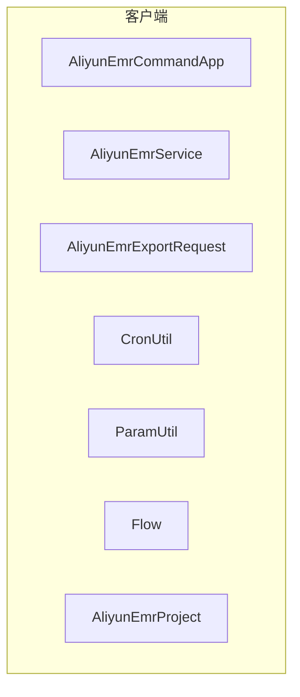
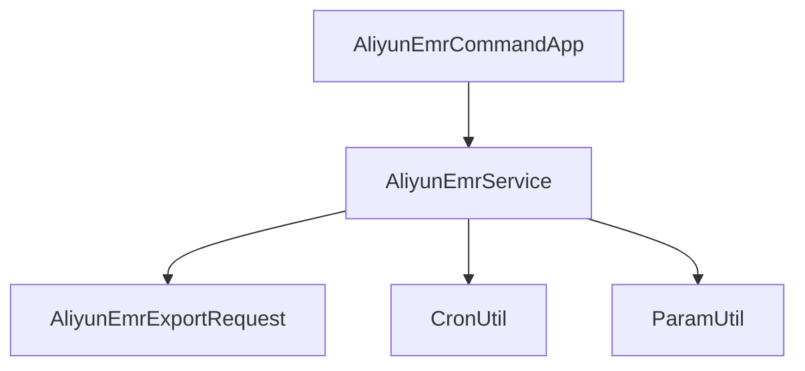
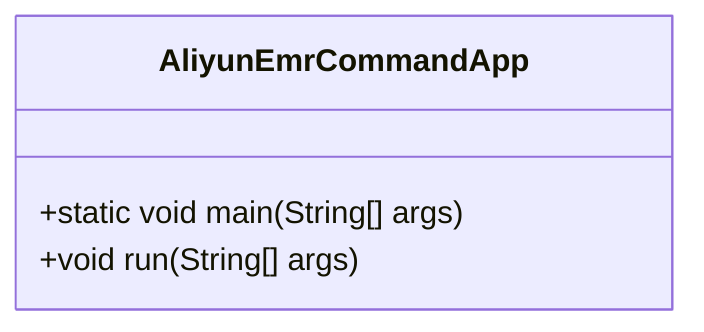
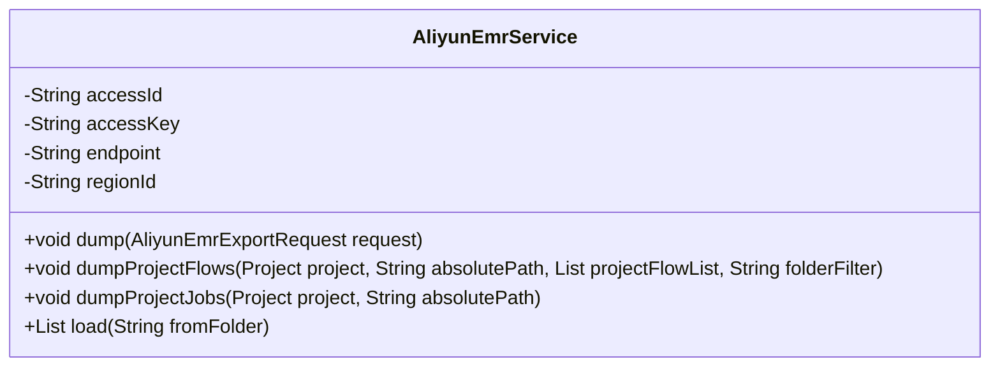
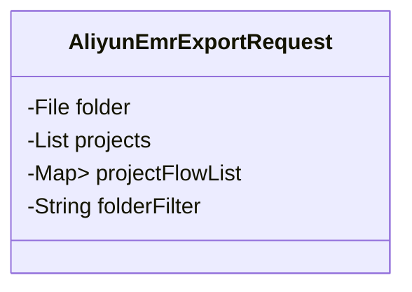
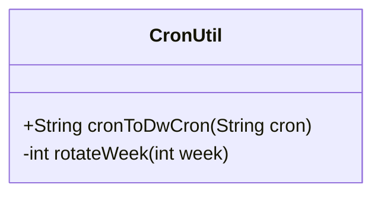

# 阿里云EMR读取器

<cite>
**本文档引用的文件**
- [AliyunEmrCommandApp.java](file://client/migrationx/migrationx-reader/src/main/java/com/aliyun/dataworks/migrationx/reader/aliyunemr/AliyunEmrCommandApp.java)
- [AliyunEmrService.java](file://client/migrationx/migrationx-domain/migrationx-domain-aliyunemr/src/main/java/com/aliyun/dataworks/migrationx/domain/dataworks/aliyunemr/AliyunEmrService.java)
- [AliyunEmrExportRequest.java](file://client/migrationx/migrationx-domain/migrationx-domain-aliyunemr/src/main/java/com/aliyun/dataworks/migrationx/domain/dataworks/aliyunemr/AliyunEmrExportRequest.java)
- [CronUtil.java](file://client/migrationx/migrationx-domain/migrationx-domain-aliyunemr/src/main/java/com/aliyun/dataworks/migrationx/domain/dataworks/aliyunemr/CronUtil.java)
- [ParamUtil.java](file://client/migrationx/migrationx-domain/migrationx-domain-aliyunemr/src/main/java/com/aliyun/dataworks/migrationx/domain/dataworks/aliyunemr/ParamUtil.java)
- [Flow.java](file://client/migrationx/migrationx-domain/migrationx-domain-aliyunemr/src/main/java/com/aliyun/dataworks/migrationx/domain/dataworks/aliyunemr/Flow.java)
- [AliyunEmrProject.java](file://client/migrationx/migrationx-domain/migrationx-domain-aliyunemr/src/main/java/com/aliyun/dataworks/migrationx/domain/dataworks/aliyunemr/AliyunEmrProject.java)
</cite>

## 目录
1. [简介](#简介)
2. [项目结构](#项目结构)
3. [核心组件](#核心组件)
4. [架构概述](#架构概述)
5. [详细组件分析](#详细组件分析)
6. [依赖分析](#依赖分析)
7. [性能考虑](#性能考虑)
8. [故障排除指南](#故障排除指南)
9. [结论](#结论)

## 简介
阿里云EMR读取器是一个用于从阿里云EMR集群读取工作流定义的工具。该工具通过OpenAPI获取EMR项目、工作流、任务节点等资源信息，并将其转换为内部统一模型。本文档详细介绍了AliyunEmrCommandApp如何从阿里云EMR集群读取工作流定义，包括API调用的实现细节、配置文件格式、代码示例以及常见问题的解决方案。

## 项目结构
阿里云EMR读取器的项目结构主要包括以下几个部分：
- `client/migrationx/migrationx-reader/src/main/java/com/aliyun/dataworks/migrationx/reader/aliyunemr/`：包含AliyunEmrCommandApp等核心类。
- `client/migrationx/migrationx-domain/migrationx-domain-aliyunemr/src/main/java/com/aliyun/dataworks/migrationx/domain/dataworks/aliyunemr/`：包含AliyunEmrService、AliyunEmrExportRequest等数据模型和工具类。

**图表来源**
- [AliyunEmrCommandApp.java](file://client/migrationx/migrationx-reader/src/main/java/com/aliyun/dataworks/migrationx/reader/aliyunemr/AliyunEmrCommandApp.java)
- [AliyunEmrService.java](file://client/migrationx/migrationx-domain/migrationx-domain-aliyunemr/src/main/java/com/aliyun/dataworks/migrationx/domain/dataworks/aliyunemr/AliyunEmrService.java)
- [AliyunEmrExportRequest.java](file://client/migrationx/migrationx-domain/migrationx-domain-aliyunemr/src/main/java/com/aliyun/dataworks/migrationx/domain/dataworks/aliyunemr/AliyunEmrExportRequest.java)
- [CronUtil.java](file://client/migrationx/migrationx-domain/migrationx-domain-aliyunemr/src/main/java/com/aliyun/dataworks/migrationx/domain/dataworks/aliyunemr/CronUtil.java)
- [ParamUtil.java](file://client/migrationx/migrationx-domain/migrationx-domain-aliyunemr/src/main/java/com/aliyun/dataworks/migrationx/domain/dataworks/aliyunemr/ParamUtil.java)
- [Flow.java](file://client/migrationx/migrationx-domain/migrationx-domain-aliyunemr/src/main/java/com/aliyun/dataworks/migrationx/domain/dataworks/aliyunemr/Flow.java)
- [AliyunEmrProject.java](file://client/migrationx/migrationx-domain/migrationx-domain-aliyunemr/src/main/java/com/aliyun/dataworks/migrationx/domain/dataworks/aliyunemr/AliyunEmrProject.java)

**章节来源**
- [AliyunEmrCommandApp.java](file://client/migrationx/migrationx-reader/src/main/java/com/aliyun/dataworks/migrationx/reader/aliyunemr/AliyunEmrCommandApp.java)
- [AliyunEmrService.java](file://client/migrationx/migrationx-domain/migrationx-domain-aliyunemr/src/main/java/com/aliyun/dataworks/migrationx/domain/dataworks/aliyunemr/AliyunEmrService.java)

## 核心组件
阿里云EMR读取器的核心组件包括AliyunEmrCommandApp、AliyunEmrService、AliyunEmrExportRequest、CronUtil和ParamUtil。这些组件共同协作，实现从阿里云EMR集群读取工作流定义的功能。

**章节来源**
- [AliyunEmrCommandApp.java](file://client/migrationx/migrationx-reader/src/main/java/com/aliyun/dataworks/migrationx/reader/aliyunemr/AliyunEmrCommandApp.java)
- [AliyunEmrService.java](file://client/migrationx/migrationx-domain/migrationx-domain-aliyunemr/src/main/java/com/aliyun/dataworks/migrationx/domain/dataworks/aliyunemr/AliyunEmrService.java)
- [AliyunEmrExportRequest.java](file://client/migrationx/migrationx-domain/migrationx-domain-aliyunemr/src/main/java/com/aliyun/dataworks/migrationx/domain/dataworks/aliyunemr/AliyunEmrExportRequest.java)
- [CronUtil.java](file://client/migrationx/migrationx-domain/migrationx-domain-aliyunemr/src/main/java/com/aliyun/dataworks/migrationx/domain/dataworks/aliyunemr/CronUtil.java)
- [ParamUtil.java](file://client/migrationx/migrationx-domain/migrationx-domain-aliyunemr/src/main/java/com/aliyun/dataworks/migrationx/domain/dataworks/aliyunemr/ParamUtil.java)

## 架构概述
阿里云EMR读取器的架构主要包括以下几个部分：
- **AliyunEmrCommandApp**：主入口类，负责解析命令行参数并调用AliyunEmrService进行数据读取。
- **AliyunEmrService**：服务类，负责通过OpenAPI与阿里云EMR集群进行交互，获取项目、工作流、任务节点等资源信息。
- **AliyunEmrExportRequest**：请求类，封装了导出请求的参数，如访问ID、访问密钥、端点、区域ID等。
- **CronUtil**：工具类，负责将Cron表达式从阿里云EMR格式转换为DataWorks格式。
- **ParamUtil**：工具类，负责解析和转换任务节点中的参数表达式。

**图表来源**
- [AliyunEmrCommandApp.java](file://client/migrationx/migrationx-reader/src/main/java/com/aliyun/dataworks/migrationx/reader/aliyunemr/AliyunEmrCommandApp.java)
- [AliyunEmrService.java](file://client/migrationx/migrationx-domain/migrationx-domain-aliyunemr/src/main/java/com/aliyun/dataworks/migrationx/domain/dataworks/aliyunemr/AliyunEmrService.java)
- [AliyunEmrExportRequest.java](file://client/migrationx/migrationx-domain/migrationx-domain-aliyunemr/src/main/java/com/aliyun/dataworks/migrationx/domain/dataworks/aliyunemr/AliyunEmrExportRequest.java)
- [CronUtil.java](file://client/migrationx/migrationx-domain/migrationx-domain-aliyunemr/src/main/java/com/aliyun/dataworks/migrationx/domain/dataworks/aliyunemr/CronUtil.java)
- [ParamUtil.java](file://client/migrationx/migrationx-domain/migrationx-domain-aliyunemr/src/main/java/com/aliyun/dataworks/migrationx/domain/dataworks/aliyunemr/ParamUtil.java)

**章节来源**
- [AliyunEmrCommandApp.java](file://client/migrationx/migrationx-reader/src/main/java/com/aliyun/dataworks/migrationx/reader/aliyunemr/AliyunEmrCommandApp.java)
- [AliyunEmrService.java](file://client/migrationx/migrationx-domain/migrationx-domain-aliyunemr/src/main/java/com/aliyun/dataworks/migrationx/domain/dataworks/aliyunemr/AliyunEmrService.java)

## 详细组件分析

### AliyunEmrCommandApp分析
AliyunEmrCommandApp是阿里云EMR读取器的主入口类，负责解析命令行参数并调用AliyunEmrService进行数据读取。它通过命令行参数获取访问ID、访问密钥、端点、区域ID等配置信息，并将这些信息传递给AliyunEmrService。

**图表来源**
- [AliyunEmrCommandApp.java](file://client/migrationx/migrationx-reader/src/main/java/com/aliyun/dataworks/migrationx/reader/aliyunemr/AliyunEmrCommandApp.java)

**章节来源**
- [AliyunEmrCommandApp.java](file://client/migrationx/migrationx-reader/src/main/java/com/aliyun/dataworks/migrationx/reader/aliyunemr/AliyunEmrCommandApp.java)

### AliyunEmrService分析
AliyunEmrService是阿里云EMR读取器的核心服务类，负责通过OpenAPI与阿里云EMR集群进行交互，获取项目、工作流、任务节点等资源信息。它实现了分页查询、错误重试机制和认证处理。

**图表来源**
- [AliyunEmrService.java](file://client/migrationx/migrationx-domain/migrationx-domain-aliyunemr/src/main/java/com/aliyun/dataworks/migrationx/domain/dataworks/aliyunemr/AliyunEmrService.java)

**章节来源**
- [AliyunEmrService.java](file://client/migrationx/migrationx-domain/migrationx-domain-aliyunemr/src/main/java/com/aliyun/dataworks/migrationx/domain/dataworks/aliyunemr/AliyunEmrService.java)

### AliyunEmrExportRequest分析
AliyunEmrExportRequest是阿里云EMR读取器的请求类，封装了导出请求的参数，如访问ID、访问密钥、端点、区域ID等。

**图表来源**
- [AliyunEmrExportRequest.java](file://client/migrationx/migrationx-domain/migrationx-domain-aliyunemr/src/main/java/com/aliyun/dataworks/migrationx/domain/dataworks/aliyunemr/AliyunEmrExportRequest.java)

**章节来源**
- [AliyunEmrExportRequest.java](file://client/migrationx/migrationx-domain/migrationx-domain-aliyunemr/src/main/java/com/aliyun/dataworks/migrationx/domain/dataworks/aliyunemr/AliyunEmrExportRequest.java)

### CronUtil分析
CronUtil是阿里云EMR读取器的工具类，负责将Cron表达式从阿里云EMR格式转换为DataWorks格式。

**图表来源**
- [CronUtil.java](file://client/migrationx/migrationx-domain/migrationx-domain-aliyunemr/src/main/java/com/aliyun/dataworks/migrationx/domain/dataworks/aliyunemr/CronUtil.java)

**章节来源**
- [CronUtil.java](file://client/migrationx/migrationx-domain/migrationx-domain-aliyunemr/src/main/java/com/aliyun/dataworks/migrationx/domain/dataworks/aliyunemr/CronUtil.java)

### ParamUtil分析
ParamUtil是阿里云EMR读取器的工具类，负责解析和转换任务节点中的参数表达式。

**图表来源**
- [ParamUtil.java](file://client/migrationx/migrationx-domain/migrationx-domain-aliyunemr/src/main/java/com/aliyun/dataworks/migrationx/domain/dataworks/aliyunemr/ParamUtil.java)

**章节来源**
- [ParamUtil.java](file://client/migrationx/migrationx-domain/migrationx-domain-aliyunemr/src/main/java/com/aliyun/dataworks/migrationx/domain/dataworks/aliyunemr/ParamUtil.java)

## 依赖分析
阿里云EMR读取器的依赖关系如下图所示：

**图表来源**
- [AliyunEmrCommandApp.java](file://client/migrationx/migrationx-reader/src/main/java/com/aliyun/dataworks/migrationx/reader/aliyunemr/AliyunEmrCommandApp.java)
- [AliyunEmrService.java](file://client/migrationx/migrationx-domain/migrationx-domain-aliyunemr/src/main/java/com/aliyun/dataworks/migrationx/domain/dataworks/aliyunemr/AliyunEmrService.java)
- [AliyunEmrExportRequest.java](file://client/migrationx/migrationx-domain/migrationx-domain-aliyunemr/src/main/java/com/aliyun/dataworks/migrationx/domain/dataworks/aliyunemr/AliyunEmrExportRequest.java)
- [CronUtil.java](file://client/migrationx/migrationx-domain/migrationx-domain-aliyunemr/src/main/java/com/aliyun/dataworks/migrationx/domain/dataworks/aliyunemr/CronUtil.java)
- [ParamUtil.java](file://client/migrationx/migrationx-domain/migrationx-domain-aliyunemr/src/main/java/com/aliyun/dataworks/migrationx/domain/dataworks/aliyunemr/ParamUtil.java)

**章节来源**
- [AliyunEmrCommandApp.java](file://client/migrationx/migrationx-reader/src/main/java/com/aliyun/dataworks/migrationx/reader/aliyunemr/AliyunEmrCommandApp.java)
- [AliyunEmrService.java](file://client/migrationx/migrationx-domain/migrationx-domain-aliyunemr/src/main/java/com/aliyun/dataworks/migrationx/domain/dataworks/aliyunemr/AliyunEmrService.java)

## 性能考虑
阿里云EMR读取器在设计时考虑了性能优化，主要体现在以下几个方面：
- **分页查询**：通过分页查询减少单次请求的数据量，避免内存溢出。
- **错误重试机制**：在网络不稳定的情况下，自动重试失败的请求，确保数据读取的可靠性。
- **认证处理**：通过缓存认证信息，减少重复认证的开销。

## 故障排除指南
在使用阿里云EMR读取器时，可能会遇到以下常见问题：
- **API限流**：如果请求频率过高，可能会触发API限流。建议降低请求频率或增加请求间隔。
- **网络超时**：在网络不稳定的情况下，可能会出现网络超时。建议增加超时时间或重试机制。
- **认证失败**：如果认证信息不正确，可能会导致认证失败。建议检查访问ID和访问密钥是否正确。

**章节来源**
- [AliyunEmrCommandApp.java](file://client/migrationx/migrationx-reader/src/main/java/com/aliyun/dataworks/migrationx/reader/aliyunemr/AliyunEmrCommandApp.java)
- [AliyunEmrService.java](file://client/migrationx/migrationx-domain/migrationx-domain-aliyunemr/src/main/java/com/aliyun/dataworks/migrationx/domain/dataworks/aliyunemr/AliyunEmrService.java)

## 结论
阿里云EMR读取器是一个功能强大的工具，能够从阿里云EMR集群读取工作流定义，并将其转换为内部统一模型。通过本文档的介绍，用户可以深入了解其架构、核心组件、依赖关系以及常见问题的解决方案，从而更好地使用该工具。