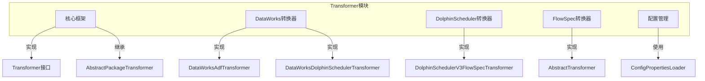
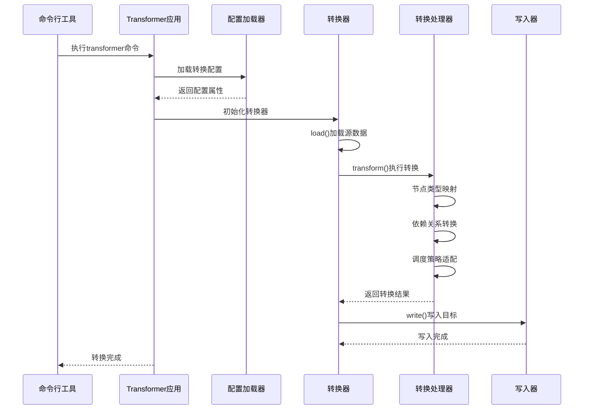
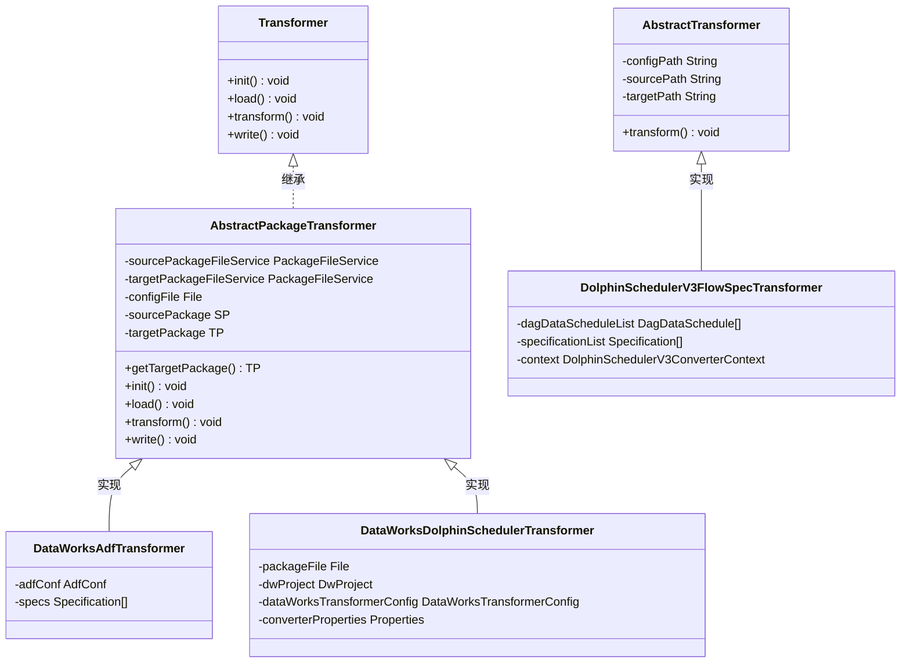
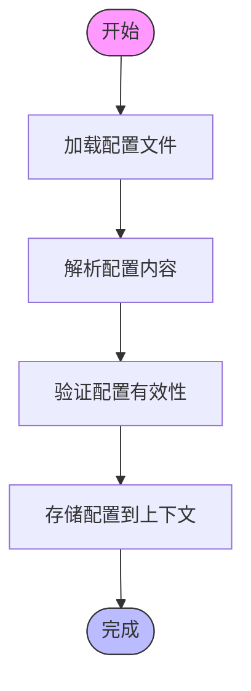
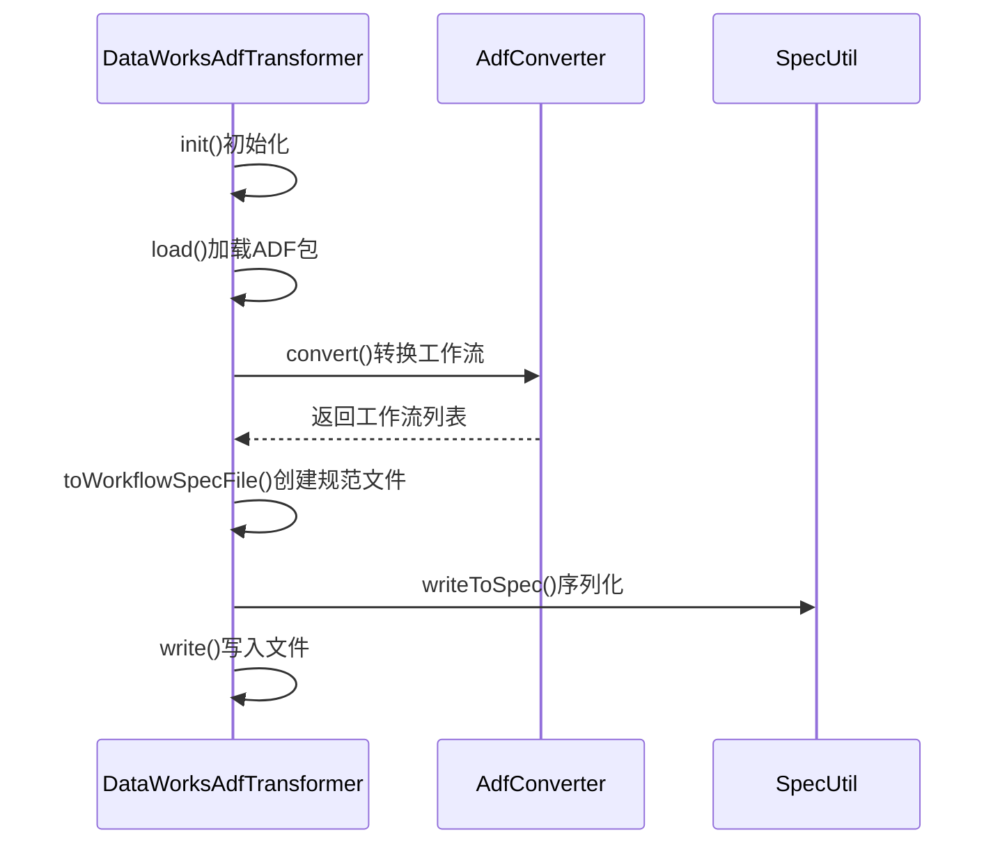
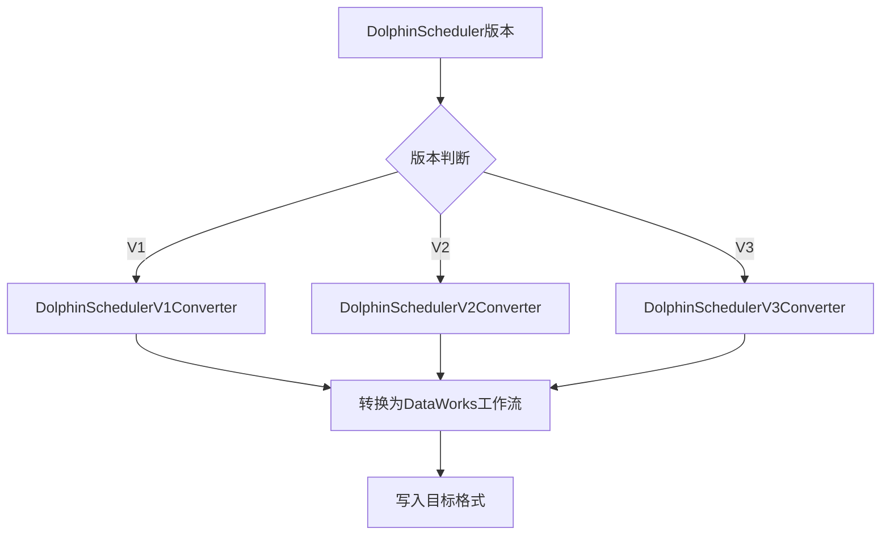
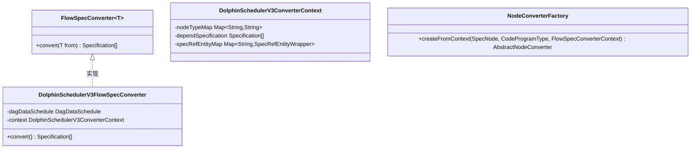
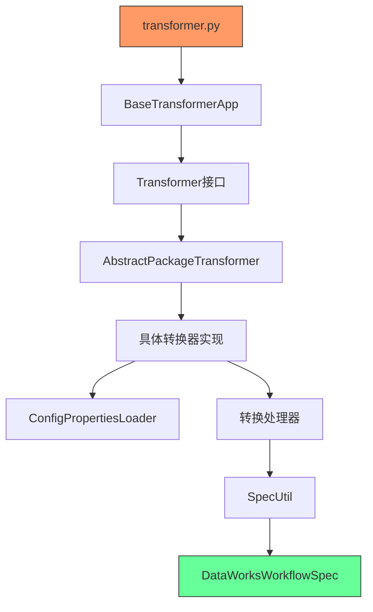

# Transformer转换器

<cite>
**本文档引用的文件**
- [transformer.py](file://client/migrationx/src/main/bin/transformer.py)
- [Transformer.java](file://client/migrationx/migrationx-transformer/src/main/java/com/aliyun/dataworks/migrationx/transformer/core/transformer/Transformer.java)
- [AbstractPackageTransformer.java](file://client/migrationx/migrationx-transformer/src/main/java/com/aliyun/dataworks/migrationx/transformer/core/transformer/AbstractPackageTransformer.java)
- [ConfigPropertiesLoader.java](file://client/migrationx/migrationx-transformer/src/main/java/com/aliyun/dataworks/migrationx/transformer/core/loader/ConfigPropertiesLoader.java)
- [DataWorksAdfTransformer.java](file://client/migrationx/migrationx-transformer/src/main/java/com/aliyun/dataworks/migrationx/transformer/dataworks/transformer/DataWorksAdfTransformer.java)
- [DataWorksDolphinSchedulerTransformer.java](file://client/migrationx/migrationx-transformer/src/main/java/com/aliyun/dataworks/migrationx/transformer/dataworks/transformer/DataWorksDolphinSchedulerTransformer.java)
- [DataWorksTransformerConfig.java](file://client/migrationx/migrationx-transformer/src/main/java/com/aliyun/dataworks/migrationx/transformer/dataworks/transformer/DataWorksTransformerConfig.java)
- [DolphinSchedulerV3FlowSpecTransformer.java](file://client/migrationx/migrationx-transformer/src/main/java/com/aliyun/dataworks/migrationx/transformer/flowspec/transformer/dolphinscheduler/DolphinSchedulerV3FlowSpecTransformer.java)
- [AbstractTransformer.java](file://client/migrationx/migrationx-transformer/src/main/java/com/aliyun/dataworks/migrationx/transformer/flowspec/transformer/AbstractTransformer.java)
- [FlowSpecConverter.java](file://client/migrationx/migrationx-transformer/src/main/java/com/aliyun/dataworks/migrationx/transformer/flowspec/converter/FlowSpecConverter.java)
</cite>

## 目录
1. [简介](#简介)
2. [项目结构](#项目结构)
3. [核心组件](#核心组件)
4. [架构概述](#架构概述)
5. [详细组件分析](#详细组件分析)
6. [依赖分析](#依赖分析)
7. [性能考虑](#性能考虑)
8. [故障排除指南](#故障排除指南)
9. [结论](#结论)

## 简介
Transformer转换器是MigrationX管道-过滤器架构中的核心转换引擎，负责将不同源系统的作业流定义转换为DataWorks标准的FlowSpec格式。该组件通过抽象化的接口设计和配置驱动的转换策略，实现了对多种调度系统（如Data Factory、Airflow、DolphinScheduler等）的统一转换支持。

## 项目结构
Transformer模块位于`client/migrationx/migrationx-transformer`目录下，采用分层架构设计，主要包含核心转换框架、数据源特定的转换器实现以及配置管理组件。

**图示来源**
- [Transformer.java](file://client/migrationx/migrationx-transformer/src/main/java/com/aliyun/dataworks/migrationx/transformer/core/transformer/Transformer.java)
- [AbstractPackageTransformer.java](file://client/migrationx/migrationx-transformer/src/main/java/com/aliyun/dataworks/migrationx/transformer/core/transformer/AbstractPackageTransformer.java)
- [DataWorksAdfTransformer.java](file://client/migrationx/migrationx-transformer/src/main/java/com/aliyun/dataworks/migrationx/transformer/dataworks/transformer/DataWorksAdfTransformer.java)
- [DataWorksDolphinSchedulerTransformer.java](file://client/migrationx/migrationx-transformer/src/main/java/com/aliyun/dataworks/migrationx/transformer/dataworks/transformer/DataWorksDolphinSchedulerTransformer.java)
- [DolphinSchedulerV3FlowSpecTransformer.java](file://client/migrationx/migrationx-transformer/src/main/java/com/aliyun/dataworks/migrationx/transformer/flowspec/transformer/dolphinscheduler/DolphinSchedulerV3FlowSpecTransformer.java)
- [AbstractTransformer.java](file://client/migrationx/migrationx-transformer/src/main/java/com/aliyun/dataworks/migrationx/transformer/flowspec/transformer/AbstractTransformer.java)

## 核心组件

Transformer转换器的核心由接口定义、抽象基类和配置管理三部分组成，共同构成了可扩展的转换框架。

**组件来源**
- [Transformer.java](file://client/migrationx/migrationx-transformer/src/main/java/com/aliyun/dataworks/migrationx/transformer/core/transformer/Transformer.java#L1-L48)
- [AbstractPackageTransformer.java](file://client/migrationx/migrationx-transformer/src/main/java/com/aliyun/dataworks/migrationx/transformer/core/transformer/AbstractPackageTransformer.java#L1-L58)
- [ConfigPropertiesLoader.java](file://client/migrationx/migrationx-transformer/src/main/java/com/aliyun/dataworks/migrationx/transformer/core/loader/ConfigPropertiesLoader.java#L1-L49)

## 架构概述

Transformer采用管道-过滤器架构模式，通过标准化的转换流程将源系统模型映射到DataWorks标准FlowSpec。

**图示来源**
- [transformer.py](file://client/migrationx/src/main/bin/transformer.py#L1-L6)
- [DataWorksTransformerConfig.java](file://client/migrationx/migrationx-transformer/src/main/java/com/aliyun/dataworks/migrationx/transformer/dataworks/transformer/DataWorksTransformerConfig.java#L1-L50)
- [DataWorksDolphinSchedulerTransformer.java](file://client/migrationx/migrationx-transformer/src/main/java/com/aliyun/dataworks/migrationx/transformer/dataworks/transformer/DataWorksDolphinSchedulerTransformer.java#L1-L158)

## 详细组件分析

### Transformer接口与抽象类分析

Transformer框架基于接口和抽象类的设计模式，提供了标准化的转换流程。

#### 类图

**图示来源**
- [Transformer.java](file://client/migrationx/migrationx-transformer/src/main/java/com/aliyun/dataworks/migrationx/transformer/core/transformer/Transformer.java#L1-L48)
- [AbstractPackageTransformer.java](file://client/migrationx/migrationx-transformer/src/main/java/com/aliyun/dataworks/migrationx/transformer/core/transformer/AbstractPackageTransformer.java#L1-L58)
- [DataWorksAdfTransformer.java](file://client/migrationx/migrationx-transformer/src/main/java/com/aliyun/dataworks/migrationx/transformer/dataworks/transformer/DataWorksAdfTransformer.java#L1-L109)
- [DataWorksDolphinSchedulerTransformer.java](file://client/migrationx/migrationx-transformer/src/main/java/com/aliyun/dataworks/migrationx/transformer/dataworks/transformer/DataWorksDolphinSchedulerTransformer.java#L1-L158)
- [AbstractTransformer.java](file://client/migrationx/migrationx-transformer/src/main/java/com/aliyun/dataworks/migrationx/transformer/flowspec/transformer/AbstractTransformer.java#L1-L32)
- [DolphinSchedulerV3FlowSpecTransformer.java](file://client/migrationx/migrationx-transformer/src/main/java/com/aliyun/dataworks/migrationx/transformer/flowspec/transformer/dolphinscheduler/DolphinSchedulerV3FlowSpecTransformer.java#L1-L148)

### 配置管理分析

配置管理组件负责加载和解析转换所需的配置信息。

#### 配置加载流程

**组件来源**
- [ConfigPropertiesLoader.java](file://client/migrationx/migrationx-transformer/src/main/java/com/aliyun/dataworks/migrationx/transformer/core/loader/ConfigPropertiesLoader.java#L1-L49)
- [DataWorksTransformerConfig.java](file://client/migrationx/migrationx-transformer/src/main/java/com/aliyun/dataworks/migrationx/transformer/dataworks/transformer/DataWorksTransformerConfig.java#L1-L50)

### 具体转换器分析

#### DataWorksAdfTransformer分析
DataWorksAdfTransformer负责将Azure Data Factory的作业流转换为DataWorks标准格式。

**组件来源**
- [DataWorksAdfTransformer.java](file://client/migrationx/migrationx-transformer/src/main/java/com/aliyun/dataworks/migrationx/transformer/dataworks/transformer/DataWorksAdfTransformer.java#L1-L109)

#### DolphinScheduler转换器分析
DolphinScheduler转换器系列负责将不同版本的DolphinScheduler作业流转换为DataWorks标准格式。

##### 版本适配策略

**组件来源**
- [DataWorksDolphinSchedulerTransformer.java](file://client/migrationx/migrationx-transformer/src/main/java/com/aliyun/dataworks/migrationx/transformer/dataworks/transformer/DataWorksDolphinSchedulerTransformer.java#L1-L158)
- [DolphinSchedulerV3FlowSpecTransformer.java](file://client/migrationx/migrationx-transformer/src/main/java/com/aliyun/dataworks/migrationx/transformer/flowspec/transformer/dolphinscheduler/DolphinSchedulerV3FlowSpecTransformer.java#L1-L148)

#### FlowSpec转换器分析
FlowSpec转换器提供了一种更细粒度的转换能力，直接处理FlowSpec级别的转换。

**图示来源**
- [FlowSpecConverter.java](file://client/migrationx/migrationx-transformer/src/main/java/com/aliyun/dataworks/migrationx/transformer/flowspec/converter/FlowSpecConverter.java#L1-L32)
- [DolphinSchedulerV3FlowSpecTransformer.java](file://client/migrationx/migrationx-transformer/src/main/java/com/aliyun/dataworks/migrationx/transformer/flowspec/transformer/dolphinscheduler/DolphinSchedulerV3FlowSpecTransformer.java#L1-L148)
- [NodeConverterFactory.java](file://client/migrationx/migrationx-transformer/src/main/java/com/aliyun/dataworks/migrationx/transformer/dolphinscheduler/converter/flowspec/common/NodeConverterFactory.java#L79-L99)

## 依赖分析

Transformer模块与其他组件之间存在明确的依赖关系，形成了清晰的调用链路。

**图示来源**
- [transformer.py](file://client/migrationx/src/main/bin/transformer.py#L1-L6)
- [BaseTransformerApp.java](file://client/migrationx/migrationx-transformer/src/main/java/com/aliyun/dataworks/migrationx/transformer/core/BaseTransformerApp.java)
- [Transformer.java](file://client/migrationx/migrationx-transformer/src/main/java/com/aliyun/dataworks/migrationx/transformer/core/transformer/Transformer.java#L1-L48)
- [SpecUtil.java](file://spec/src/main/java/com/aliyun/dataworks/common/spec/SpecUtil.java)

## 性能考虑

Transformer在设计时考虑了以下性能因素：
- 采用流式处理方式，避免一次性加载大量数据到内存
- 使用缓冲写入机制，减少I/O操作次数
- 通过配置缓存减少重复的配置解析开销
- 支持并行转换多个工作流以提高处理效率

## 故障排除指南

### 常见问题及解决方案

| 问题现象 | 可能原因 | 解决方案 |
|---------|--------|--------|
| 转换失败，提示配置文件不存在 | 配置文件路径错误或文件不存在 | 检查--transformer-config参数指定的路径是否正确 |
| 节点类型映射错误 | 配置中的节点类型映射不正确 | 检查转换配置中的nodeTypeMap设置 |
| 字段映射缺失 | 源字段与目标字段不匹配 | 在配置中添加相应的字段映射规则 |
| 类型转换失败 | 数据类型不兼容 | 检查源和目标的数据类型定义，必要时添加类型转换逻辑 |
| 依赖关系丢失 | 依赖解析逻辑有误 | 检查转换器中的依赖关系处理代码 |

### 扩展自定义转换逻辑

要扩展自定义转换逻辑，可以按照以下步骤进行：
1. 继承AbstractPackageTransformer或AbstractTransformer基类
2. 实现init、load、transform、write四个核心方法
3. 在转换配置中注册新的转换器
4. 通过--transformer-config参数指定自定义配置

**组件来源**
- [DataWorksTransformerConfig.java](file://client/migrationx/migrationx-transformer/src/main/java/com/aliyun/dataworks/migrationx/transformer/dataworks/transformer/DataWorksTransformerConfig.java#L1-L50)
- [AbstractTransformer.java](file://client/migrationx/migrationx-transformer/src/main/java/com/aliyun/dataworks/migrationx/transformer/flowspec/transformer/AbstractTransformer.java#L1-L32)

## 结论

Transformer转换器作为MigrationX管道-过滤器架构的核心组件，通过清晰的接口定义、灵活的抽象基类设计和强大的配置管理能力，成功实现了多种调度系统到DataWorks标准FlowSpec的转换。其模块化的设计使得新增源系统支持变得简单高效，为数据工作流的迁移提供了可靠的技术基础。