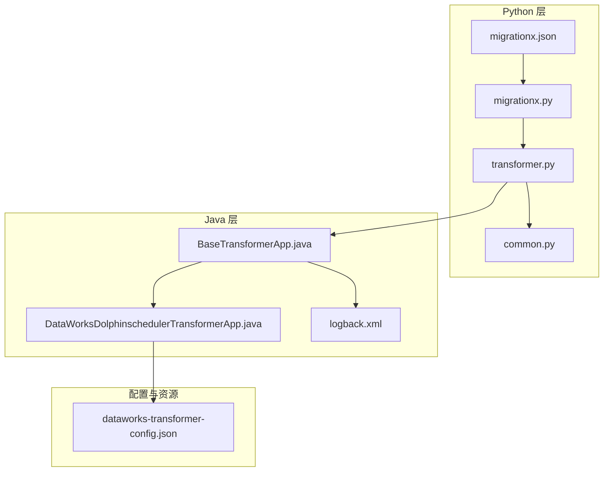
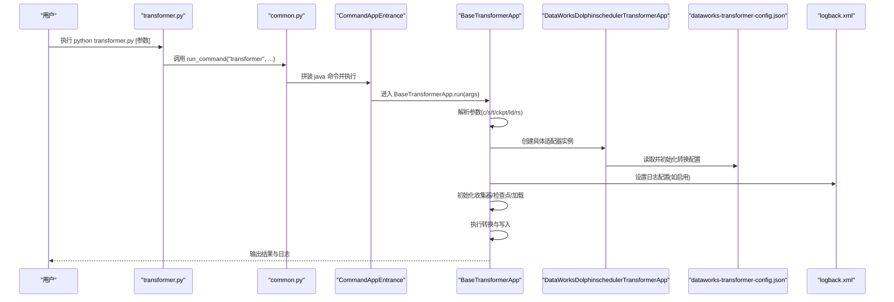
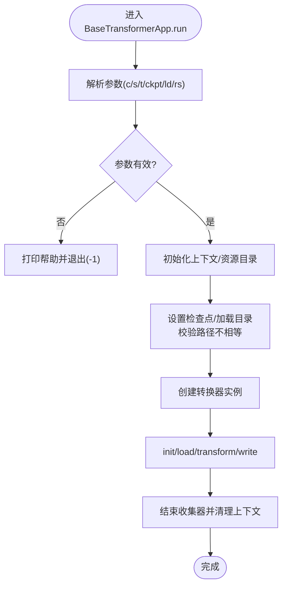
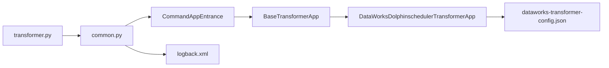

# 命令行工具

<cite>
**本文引用的文件**
- [transformer.py](file://client/migrationx/src/main/bin/transformer.py)
- [common.py](file://client/client-common/src/main/bin/common.py)
- [migrationx.py](file://client/migrationx/src/main/bin/migrationx.py)
- [migrationx.json](file://client/migrationx/src/main/conf/migrationx.json)
- [BaseTransformerApp.java](file://client/migrationx/migrationx-transformer/src/main/java/com/aliyun/dataworks/migrationx/transformer/core/BaseTransformerApp.java)
- [DataWorksDolphinschedulerTransformerApp.java](file://client/migrationx/migrationx-transformer/src/main/java/com/aliyun/dataworks/migrationx/transformer/dataworks/apps/DataWorksDolphinschedulerTransformerApp.java)
- [dataworks-transformer-config.json](file://client/migrationx/migrationx-transformer/src/main/conf/dataworks-transformer-config.json)
- [logback.xml](file://client/client-common/src/main/conf/logback.xml)
</cite>

## 目录
1. [简介](#简介)
2. [项目结构](#项目结构)
3. [核心组件](#核心组件)
4. [架构总览](#架构总览)
5. [详细组件分析](#详细组件分析)
6. [依赖关系分析](#依赖关系分析)
7. [性能考虑](#性能考虑)
8. [故障排查指南](#故障排查指南)
9. [结论](#结论)
10. [附录：命令行参数与示例](#附录命令行参数与示例)

## 简介
本文件面向命令行工具使用者，系统性说明如何使用迁移工具链中的转换器（transformer）模块，重点覆盖以下内容：
- 如何通过命令行参数指定转换配置文件路径（--transformer-config），以及输入输出目录的配置方式
- BaseTransformerApp 作为 Java 应用基类的作用，以及 Python 脚本如何与其协同工作
- 完整的命令行调用示例，包含调试模式、日志级别设置等高级选项
- 针对命令行参数解析错误、配置文件路径无效等常见问题的解决方案
- 如何扩展命令行功能以支持新的操作模式

## 项目结构
该命令行工具由三层组成：
- Python 层：提供统一入口脚本与通用运行时封装
- Java 层：提供可复用的应用基类与具体适配器
- 配置层：提供默认配置模板与环境变量替换机制

图表来源
- [transformer.py](file://client/migrationx/src/main/bin/transformer.py#L1-L6)
- [common.py](file://client/client-common/src/main/bin/common.py#L55-L88)
- [migrationx.py](file://client/migrationx/src/main/bin/migrationx.py#L1-L44)
- [migrationx.json](file://client/migrationx/src/main/conf/migrationx.json#L1-L35)
- [BaseTransformerApp.java](file://client/migrationx/migrationx-transformer/src/main/java/com/aliyun/dataworks/migrationx/transformer/core/BaseTransformerApp.java#L65-L114)
- [DataWorksDolphinschedulerTransformerApp.java](file://client/migrationx/migrationx-transformer/src/main/java/com/aliyun/dataworks/migrationx/transformer/dataworks/apps/DataWorksDolphinschedulerTransformerApp.java#L48-L96)
- [logback.xml](file://client/client-common/src/main/conf/logback.xml#L17-L83)
- [dataworks-transformer-config.json](file://client/migrationx/migrationx-transformer/src/main/conf/dataworks-transformer-config.json#L1-L23)

章节来源
- [transformer.py](file://client/migrationx/src/main/bin/transformer.py#L1-L6)
- [common.py](file://client/client-common/src/main/bin/common.py#L55-L88)
- [migrationx.py](file://client/migrationx/src/main/bin/migrationx.py#L1-L44)
- [migrationx.json](file://client/migrationx/src/main/conf/migrationx.json#L1-L35)
- [BaseTransformerApp.java](file://client/migrationx/migrationx-transformer/src/main/java/com/aliyun/dataworks/migrationx/transformer/core/BaseTransformerApp.java#L65-L114)
- [DataWorksDolphinschedulerTransformerApp.java](file://client/migrationx/migrationx-transformer/src/main/java/com/aliyun/dataworks/migrationx/transformer/dataworks/apps/DataWorksDolphinschedulerTransformerApp.java#L48-L96)
- [logback.xml](file://client/client-common/src/main/conf/logback.xml#L17-L83)
- [dataworks-transformer-config.json](file://client/migrationx/migrationx-transformer/src/main/conf/dataworks-transformer-config.json#L1-L23)

## 核心组件
- Python 入口脚本：通过统一入口脚本启动 Java 应用，并透传命令行参数
- 通用运行时封装：负责构建 classpath、设置 JVM 参数、日志配置与子进程执行
- Java 基类：定义标准命令行参数、解析与校验、生命周期流程编排
- 具体适配器：根据配置选择不同的转换器实现
- 配置文件：提供转换器配置与环境变量替换

章节来源
- [transformer.py](file://client/migrationx/src/main/bin/transformer.py#L1-L6)
- [common.py](file://client/client-common/src/main/bin/common.py#L55-L88)
- [BaseTransformerApp.java](file://client/migrationx/migrationx-transformer/src/main/java/com/aliyun/dataworks/migrationx/transformer/core/BaseTransformerApp.java#L65-L114)
- [DataWorksDolphinschedulerTransformerApp.java](file://client/migrationx/migrationx-transformer/src/main/java/com/aliyun/dataworks/migrationx/transformer/dataworks/apps/DataWorksDolphinschedulerTransformerApp.java#L48-L96)
- [dataworks-transformer-config.json](file://client/migrationx/migrationx-transformer/src/main/conf/dataworks-transformer-config.json#L1-L23)

## 架构总览
下图展示了从用户到 Java 应用的完整调用链路，以及关键参数在各层的传递与处理。

图表来源
- [transformer.py](file://client/migrationx/src/main/bin/transformer.py#L1-L6)
- [common.py](file://client/client-common/src/main/bin/common.py#L55-L88)
- [BaseTransformerApp.java](file://client/migrationx/migrationx-transformer/src/main/java/com/aliyun/dataworks/migrationx/transformer/core/BaseTransformerApp.java#L65-L114)
- [DataWorksDolphinschedulerTransformerApp.java](file://client/migrationx/migrationx-transformer/src/main/java/com/aliyun/dataworks/migrationx/transformer/dataworks/apps/DataWorksDolphinschedulerTransformerApp.java#L48-L96)
- [dataworks-transformer-config.json](file://client/migrationx/migrationx-transformer/src/main/conf/dataworks-transformer-config.json#L1-L23)
- [logback.xml](file://client/client-common/src/main/conf/logback.xml#L17-L83)

## 详细组件分析

### Python 入口与运行时封装
- 入口脚本仅负责透传参数并调用通用运行时函数
- 通用运行时负责：
  - 计算 classpath 并拼接 JVM 启动参数
  - 设置当前工作目录、应用类型等系统属性
  - 可选的日志配置（控制台与文件）
  - 将用户传入的命令行参数原样透传给 Java 主类
  - 子进程执行并退出码回传

章节来源
- [transformer.py](file://client/migrationx/src/main/bin/transformer.py#L1-L6)
- [common.py](file://client/client-common/src/main/bin/common.py#L55-L88)

### Java 基类：BaseTransformerApp
- 定义标准命令行参数：
  - --config/-c：转换配置文件路径（必填）
  - --sourcePackage/-s：源包路径（必填）
  - --targetPackage/-t：目标包路径（必填）
  - --checkpoint/--ckpt：检查点目录（可选）
  - --load/--ld：恢复目录（可选）
  - --resource/--rs：自定义资源目录（可选）
- 参数解析与校验：
  - 使用 Apache Commons CLI 解析
  - 出错时打印帮助并退出
- 生命周期流程：
  - 初始化上下文、设置资源目录
  - 设置检查点与恢复目录，进行一致性校验
  - 初始化转换器、加载数据、执行转换、写入结果
  - 结束指标收集并清理上下文

图表来源
- [BaseTransformerApp.java](file://client/migrationx/migrationx-transformer/src/main/java/com/aliyun/dataworks/migrationx/transformer/core/BaseTransformerApp.java#L65-L114)
- [BaseTransformerApp.java](file://client/migrationx/migrationx-transformer/src/main/java/com/aliyun/dataworks/migrationx/transformer/core/BaseTransformerApp.java#L122-L140)

章节来源
- [BaseTransformerApp.java](file://client/migrationx/migrationx-transformer/src/main/java/com/aliyun/dataworks/migrationx/transformer/core/BaseTransformerApp.java#L65-L114)
- [BaseTransformerApp.java](file://client/migrationx/migrationx-transformer/src/main/java/com/aliyun/dataworks/migrationx/transformer/core/BaseTransformerApp.java#L122-L140)

### 具体适配器：DataWorksDolphinschedulerTransformerApp
- 继承自 BaseTransformerApp，负责：
  - 根据配置选择工作流或全量转换器
  - 读取并校验转换配置文件
  - 初始化全局配置与替换映射
- 配置文件要求：
  - 必须存在且可解析为 DataWorksTransformerConfig
  - 支持格式、语言、跳过不支持类型、容错策略等字段

章节来源
- [DataWorksDolphinschedulerTransformerApp.java](file://client/migrationx/migrationx-transformer/src/main/java/com/aliyun/dataworks/migrationx/transformer/dataworks/apps/DataWorksDolphinschedulerTransformerApp.java#L48-L96)
- [dataworks-transformer-config.json](file://client/migrationx/migrationx-transformer/src/main/conf/dataworks-transformer-config.json#L1-L23)

### 日志与调试
- 日志配置：
  - 通过 JVM 系统属性设置日志文件与 logback 配置
  - 默认根日志级别为 INFO，同时输出到控制台与文件
- 调试模式：
  - 可通过环境变量控制是否输出详细日志
  - 控制台输出与日志文件可同时开启

章节来源
- [common.py](file://client/client-common/src/main/bin/common.py#L55-L88)
- [logback.xml](file://client/client-common/src/main/conf/logback.xml#L17-L83)

## 依赖关系分析
- Python 层依赖：
  - common.py 提供通用运行时能力
  - migrationx.json 提供默认参数模板与环境变量替换
- Java 层依赖：
  - BaseTransformerApp 定义参数与流程
  - 具体适配器按需选择转换器实现
  - 配置文件驱动转换行为

图表来源
- [transformer.py](file://client/migrationx/src/main/bin/transformer.py#L1-L6)
- [common.py](file://client/client-common/src/main/bin/common.py#L55-L88)
- [BaseTransformerApp.java](file://client/migrationx/migrationx-transformer/src/main/java/com/aliyun/dataworks/migrationx/transformer/core/BaseTransformerApp.java#L65-L114)
- [DataWorksDolphinschedulerTransformerApp.java](file://client/migrationx/migrationx-transformer/src/main/java/com/aliyun/dataworks/migrationx/transformer/dataworks/apps/DataWorksDolphinschedulerTransformerApp.java#L48-L96)
- [dataworks-transformer-config.json](file://client/migrationx/migrationx-transformer/src/main/conf/dataworks-transformer-config.json#L1-L23)
- [logback.xml](file://client/client-common/src/main/conf/logback.xml#L17-L83)

章节来源
- [transformer.py](file://client/migrationx/src/main/bin/transformer.py#L1-L6)
- [common.py](file://client/client-common/src/main/bin/common.py#L55-L88)
- [BaseTransformerApp.java](file://client/migrationx/migrationx-transformer/src/main/java/com/aliyun/dataworks/migrationx/transformer/core/BaseTransformerApp.java#L65-L114)
- [DataWorksDolphinschedulerTransformerApp.java](file://client/migrationx/migrationx-transformer/src/main/java/com/aliyun/dataworks/migrationx/transformer/dataworks/apps/DataWorksDolphinschedulerTransformerApp.java#L48-L96)
- [dataworks-transformer-config.json](file://client/migrationx/migrationx-transformer/src/main/conf/dataworks-transformer-config.json#L1-L23)
- [logback.xml](file://client/client-common/src/main/conf/logback.xml#L17-L83)

## 性能考虑
- 大型转换任务建议：
  - 合理设置检查点目录，避免重复转换
  - 使用资源目录缓存常用依赖，减少 IO 开销
  - 在 CI/CD 中分阶段执行（读取、转换、写入），便于并行化
- 日志级别：
  - 生产环境保持默认 INFO 级别
  - 临时调试可开启更详细的日志输出

[本节为通用指导，无需列出章节来源]

## 故障排查指南
- 常见参数解析错误
  - 缺少必要参数（--config/--sourcePackage/--targetPackage）
  - 检查点与加载目录相同导致冲突
  - 解决方案：补齐必填参数；确保 checkpoint 与 load 不同路径
- 配置文件路径无效
  - 配置文件不存在或无法解析
  - 解决方案：确认路径存在且可读；核对 JSON 格式与字段
- 日志定位
  - 查看日志文件与控制台输出，结合 logback.xml 的配置定位问题
- 子进程返回码
  - Python 层会将 Java 子进程的退出码回传，便于上层脚本判断失败原因

章节来源
- [BaseTransformerApp.java](file://client/migrationx/migrationx-transformer/src/main/java/com/aliyun/dataworks/migrationx/transformer/core/BaseTransformerApp.java#L65-L114)
- [BaseTransformerApp.java](file://client/migrationx/migrationx-transformer/src/main/java/com/aliyun/dataworks/migrationx/transformer/core/BaseTransformerApp.java#L122-L140)
- [DataWorksDolphinschedulerTransformerApp.java](file://client/migrationx/migrationx-transformer/src/main/java/com/aliyun/dataworks/migrationx/transformer/dataworks/apps/DataWorksDolphinschedulerTransformerApp.java#L74-L96)
- [logback.xml](file://client/client-common/src/main/conf/logback.xml#L17-L83)
- [common.py](file://client/client-common/src/main/bin/common.py#L55-L88)

## 结论
该命令行工具通过 Python 入口与通用运行时封装，将 Java 基类与具体适配器解耦，形成清晰的三层架构。用户只需关注命令行参数与配置文件，即可完成从源包到目标包的转换流程。通过检查点与资源目录等机制，可在大规模场景中提升稳定性与效率。

[本节为总结性内容，无需列出章节来源]

## 附录：命令行参数与示例

### 命令行参数说明
- --config/-c：转换配置文件路径（必填）
- --sourcePackage/-s：源包路径（必填）
- --targetPackage/-t：目标包路径（必填）
- --checkpoint/--ckpt：检查点目录（可选）
- --load/--ld：恢复目录（可选）
- --resource/--rs：自定义资源目录（可选）

章节来源
- [BaseTransformerApp.java](file://client/migrationx/migrationx-transformer/src/main/java/com/aliyun/dataworks/migrationx/transformer/core/BaseTransformerApp.java#L65-L114)

### 输入输出目录配置方式
- 源包与目标包路径通过命令行参数直接指定
- 资源目录用于存放转换过程中需要的外部资源
- 检查点与恢复目录用于断点续跑与中间结果管理

章节来源
- [BaseTransformerApp.java](file://client/migrationx/migrationx-transformer/src/main/java/com/aliyun/dataworks/migrationx/transformer/core/BaseTransformerApp.java#L122-L140)

### 转换配置文件路径
- 通过 --config/-c 指定转换配置文件路径
- 配置文件示例：dataworks-transformer-config.json
- 配置项包括格式、语言、容错策略、节点类型映射等

章节来源
- [BaseTransformerApp.java](file://client/migrationx/migrationx-transformer/src/main/java/com/aliyun/dataworks/migrationx/transformer/core/BaseTransformerApp.java#L65-L114)
- [dataworks-transformer-config.json](file://client/migrationx/migrationx-transformer/src/main/conf/dataworks-transformer-config.json#L1-L23)

### Python 脚本与 Java 应用协同
- Python 入口脚本调用通用运行时，将参数透传给 Java 主类
- Java 基类解析参数并编排转换流程
- 具体适配器根据配置选择转换器实现

章节来源
- [transformer.py](file://client/migrationx/src/main/bin/transformer.py#L1-L6)
- [common.py](file://client/client-common/src/main/bin/common.py#L55-L88)
- [BaseTransformerApp.java](file://client/migrationx/migrationx-transformer/src/main/java/com/aliyun/dataworks/migrationx/transformer/core/BaseTransformerApp.java#L65-L114)
- [DataWorksDolphinschedulerTransformerApp.java](file://client/migrationx/migrationx-transformer/src/main/java/com/aliyun/dataworks/migrationx/transformer/dataworks/apps/DataWorksDolphinschedulerTransformerApp.java#L48-L96)

### 完整命令行调用示例
- 单步调用（推荐用于本地调试）
  - python transformer.py -c /path/to/config.json -s ./input.zip -t ./output.zip
- 带检查点与资源目录
  - python transformer.py -c ./conf/config.json -s ./input.zip -t ./output.zip --checkpoint ./ckpt --load ./load --resource ./resources
- 通过组合脚本执行（读取-转换-写入）
  - python migrationx.py
  - 该脚本会读取 migrationx.json 中的默认参数并依次执行 reader、transformer、writer

章节来源
- [migrationx.py](file://client/migrationx/src/main/bin/migrationx.py#L1-L44)
- [migrationx.json](file://client/migrationx/src/main/conf/migrationx.json#L1-L35)

### 调试模式与日志级别设置
- 启用详细日志输出（控制台与文件）
  - 通过 JVM 系统属性设置日志文件与 logback 配置
  - 参考 common.py 中的日志参数注入逻辑
- 日志配置文件
  - logback.xml 定义了文件与控制台输出格式及滚动策略

章节来源
- [common.py](file://client/client-common/src/main/bin/common.py#L55-L88)
- [logback.xml](file://client/client-common/src/main/conf/logback.xml#L17-L83)

### 常见问题与解决方案
- 参数缺失或解析失败
  - 确认 --config/--sourcePackage/--targetPackage 是否齐全
  - 使用帮助输出查看参数说明
- 配置文件无效
  - 确认配置文件存在且 JSON 格式正确
  - 核对字段名称与取值范围
- 检查点与加载目录冲突
  - 确保 checkpoint 与 load 指向不同目录
- 日志定位困难
  - 查看 logs 目录下的日志文件与控制台输出

章节来源
- [BaseTransformerApp.java](file://client/migrationx/migrationx-transformer/src/main/java/com/aliyun/dataworks/migrationx/transformer/core/BaseTransformerApp.java#L65-L114)
- [BaseTransformerApp.java](file://client/migrationx/migrationx-transformer/src/main/java/com/aliyun/dataworks/migrationx/transformer/core/BaseTransformerApp.java#L122-L140)
- [DataWorksDolphinschedulerTransformerApp.java](file://client/migrationx/migrationx-transformer/src/main/java/com/aliyun/dataworks/migrationx/transformer/dataworks/apps/DataWorksDolphinschedulerTransformerApp.java#L74-L96)
- [logback.xml](file://client/client-common/src/main/conf/logback.xml#L17-L83)

### 扩展命令行功能
- 新增参数
  - 在 Java 基类中添加新选项并解析
  - 在 Python 层通过配置文件或环境变量提供默认值
- 新增操作模式
  - 新建一个继承自 BaseTransformerApp 的适配器类
  - 在适配器中根据配置选择不同的转换器实现
- 与组合脚本集成
  - 在 migrationx.json 中新增步骤或调整参数顺序
  - 通过环境变量替换实现灵活部署

章节来源
- [BaseTransformerApp.java](file://client/migrationx/migrationx-transformer/src/main/java/com/aliyun/dataworks/migrationx/transformer/core/BaseTransformerApp.java#L65-L114)
- [DataWorksDolphinschedulerTransformerApp.java](file://client/migrationx/migrationx-transformer/src/main/java/com/aliyun/dataworks/migrationx/transformer/dataworks/apps/DataWorksDolphinschedulerTransformerApp.java#L48-L96)
- [migrationx.json](file://client/migrationx/src/main/conf/migrationx.json#L1-L35)