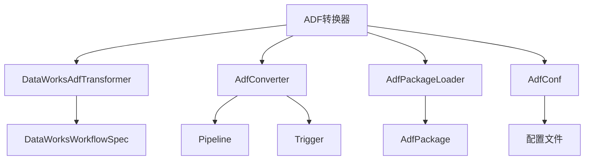
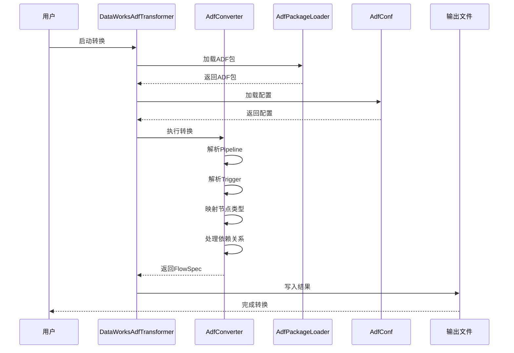
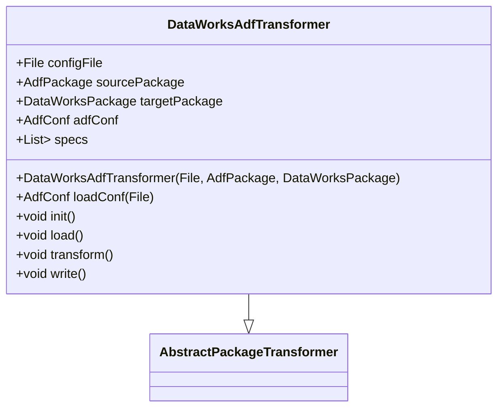
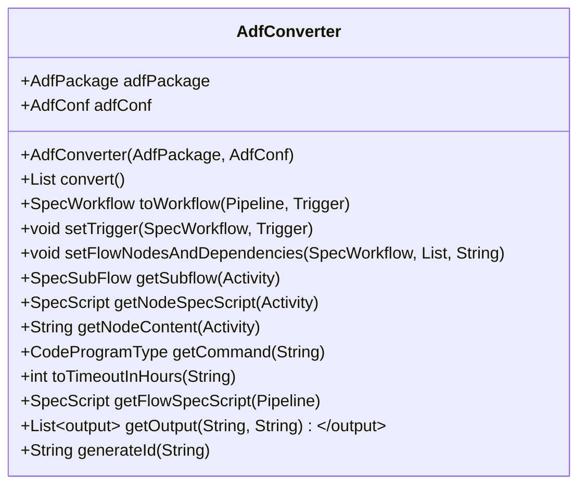
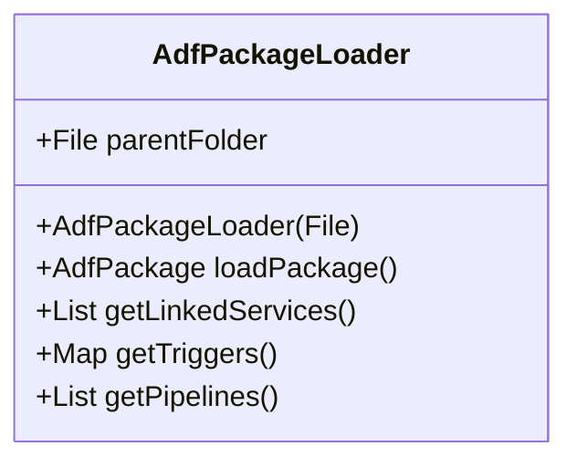
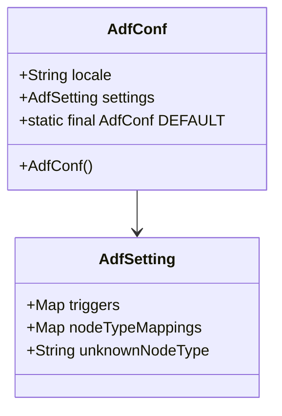
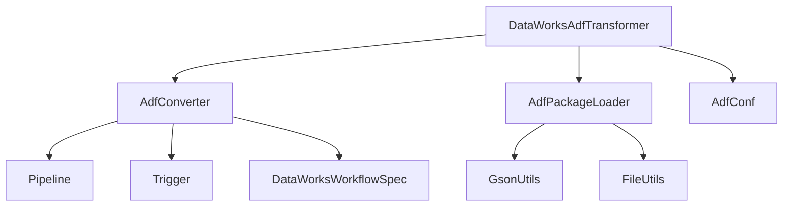

# ADF转换器

<cite>
**本文档引用文件**  
- [DataWorksAdfTransformer.java](file://client/migrationx/migrationx-transformer/src/main/java/com/aliyun/dataworks/migrationx/transformer/dataworks/transformer/DataWorksAdfTransformer.java)
- [AdfConverter.java](file://client/migrationx/migrationx-transformer/src/main/java/com/aliyun/dataworks/migrationx/transformer/dataworks/converter/adf/AdfConverter.java)
- [Pipeline.java](file://client/migrationx/migrationx-domain/migrationx-domain-adf/src/main/java/com/aliyun/dataworks/migrationx/domain/adf/Pipeline.java)
- [Trigger.java](file://client/migrationx/migrationx-domain/migrationx-domain-adf/src/main/java/com/aliyun/dataworks/migrationx/domain/adf/Trigger.java)
- [DataWorksWorkflowSpec.java](file://spec/src/main/java/com/aliyun/dataworks/common/spec/domain/DataWorksWorkflowSpec.java)
- [AdfPackageLoader.java](file://client/migrationx/migrationx-domain/migrationx-domain-adf/src/main/java/com/aliyun/dataworks/migrationx/domain/adf/AdfPackageLoader.java)
- [AdfConf.java](file://client/migrationx/migrationx-domain/migrationx-domain-adf/src/main/java/com/aliyun/dataworks/migrationx/domain/adf/AdfConf.java)
- [adf-mc-transformer-config.json](file://client/migrationx/migrationx-transformer/src/main/conf/adf-mc-transformer-config.json)
</cite>

## 目录
1. [简介](#简介)
2. [项目结构](#项目结构)
3. [核心组件](#核心组件)
4. [架构概述](#架构概述)
5. [详细组件分析](#详细组件分析)
6. [依赖分析](#依赖分析)
7. [性能考虑](#性能考虑)
8. [故障排除指南](#故障排除指南)
9. [结论](#结论)

## 简介
ADF转换器是DataWorks平台中的一个关键组件，用于将Azure Data Factory（ADF）的管道、活动和触发器等模型元素转换为DataWorks标准的FlowSpec格式。该转换器通过解析ADF的JSON结构，将ADF的活动类型映射到DataWorks的节点类型，并处理依赖关系和参数化表达式，从而实现无缝迁移。本文档详细介绍了DataWorksAdfTransformer类的实现逻辑，包括ADF JSON结构解析、活动类型映射、依赖关系转换和参数化表达式转换等关键技术细节。

## 项目结构
ADF转换器的项目结构主要分为以下几个部分：
- `client/migrationx/migrationx-transformer`: 转换器的核心实现，包含ADF转换器的主要逻辑。
- `client/migrationx/migrationx-domain/migrationx-domain-adf`: ADF域模型的定义，包括Pipeline、Trigger等类。
- `spec/src/main/java/com/aliyun/dataworks/common/spec/domain`: DataWorks标准FlowSpec模型的定义。
- `client/migrationx/migrationx-transformer/src/main/conf`: 配置文件，用于定义转换规则和映射关系。

**图示来源**
- [DataWorksAdfTransformer.java](file://client/migrationx/migrationx-transformer/src/main/java/com/aliyun/dataworks/migrationx/transformer/dataworks/transformer/DataWorksAdfTransformer.java)
- [AdfConverter.java](file://client/migrationx/migrationx-transformer/src/main/java/com/aliyun/dataworks/migrationx/transformer/dataworks/converter/adf/AdfConverter.java)
- [AdfPackageLoader.java](file://client/migrationx/migrationx-domain/migrationx-domain-adf/src/main/java/com/aliyun/dataworks/migrationx/domain/adf/AdfPackageLoader.java)
- [AdfConf.java](file://client/migrationx/migrationx-domain/migrationx-domain-adf/src/main/java/com/aliyun/dataworks/migrationx/domain/adf/AdfConf.java)

**节来源**
- [DataWorksAdfTransformer.java](file://client/migrationx/migrationx-transformer/src/main/java/com/aliyun/dataworks/migrationx/transformer/dataworks/transformer/DataWorksAdfTransformer.java)
- [AdfConverter.java](file://client/migrationx/migrationx-transformer/src/main/java/com/aliyun/dataworks/migrationx/transformer/dataworks/converter/adf/AdfConverter.java)
- [AdfPackageLoader.java](file://client/migrationx/migrationx-domain/migrationx-domain-adf/src/main/java/com/aliyun/dataworks/migrationx/domain/adf/AdfPackageLoader.java)
- [AdfConf.java](file://client/migrationx/migrationx-domain/migrationx-domain-adf/src/main/java/com/aliyun/dataworks/migrationx/domain/adf/AdfConf.java)

## 核心组件
ADF转换器的核心组件包括`DataWorksAdfTransformer`、`AdfConverter`、`AdfPackageLoader`和`AdfConf`。这些组件协同工作，完成从ADF到DataWorks的转换任务。

**节来源**
- [DataWorksAdfTransformer.java](file://client/migrationx/migrationx-transformer/src/main/java/com/aliyun/dataworks/migrationx/transformer/dataworks/transformer/DataWorksAdfTransformer.java)
- [AdfConverter.java](file://client/migrationx/migrationx-transformer/src/main/java/com/aliyun/dataworks/migrationx/transformer/dataworks/converter/adf/AdfConverter.java)
- [AdfPackageLoader.java](file://client/migrationx/migrationx-domain/migrationx-domain-adf/src/main/java/com/aliyun/dataworks/migrationx/domain/adf/AdfPackageLoader.java)
- [AdfConf.java](file://client/migrationx/migrationx-domain/migrationx-domain-adf/src/main/java/com/aliyun/dataworks/migrationx/domain/adf/AdfConf.java)

## 架构概述
ADF转换器的架构主要包括以下几个步骤：
1. **加载ADF包**：通过`AdfPackageLoader`加载ADF的JSON文件，解析出Pipeline、Trigger等模型元素。
2. **配置加载**：通过`AdfConf`加载配置文件，获取转换规则和映射关系。
3. **转换处理**：通过`AdfConverter`将ADF的模型元素转换为DataWorks的FlowSpec格式。
4. **输出结果**：将转换后的FlowSpec写入目标文件。

**图示来源**
- [DataWorksAdfTransformer.java](file://client/migrationx/migrationx-transformer/src/main/java/com/aliyun/dataworks/migrationx/transformer/dataworks/transformer/DataWorksAdfTransformer.java)
- [AdfConverter.java](file://client/migrationx/migrationx-transformer/src/main/java/com/aliyun/dataworks/migrationx/transformer/dataworks/converter/adf/AdfConverter.java)
- [AdfPackageLoader.java](file://client/migrationx/migrationx-domain/migrationx-domain-adf/src/main/java/com/aliyun/dataworks/migrationx/domain/adf/AdfPackageLoader.java)
- [AdfConf.java](file://client/migrationx/migrationx-domain/migrationx-domain-adf/src/main/java/com/aliyun/dataworks/migrationx/domain/adf/AdfConf.java)

## 详细组件分析
### DataWorksAdfTransformer分析
`DataWorksAdfTransformer`是ADF转换器的主类，负责协调整个转换过程。它继承自`AbstractPackageTransformer`，并实现了`init`、`load`、`transform`和`write`方法。

**图示来源**
- [DataWorksAdfTransformer.java](file://client/migrationx/migrationx-transformer/src/main/java/com/aliyun/dataworks/migrationx/transformer/dataworks/transformer/DataWorksAdfTransformer.java)

**节来源**
- [DataWorksAdfTransformer.java](file://client/migrationx/migrationx-transformer/src/main/java/com/aliyun/dataworks/migrationx/transformer/dataworks/transformer/DataWorksAdfTransformer.java)

### AdfConverter分析
`AdfConverter`是ADF转换器的核心逻辑实现类，负责将ADF的模型元素转换为DataWorks的FlowSpec格式。它通过`convert`方法遍历所有Pipeline，并调用`toWorkflow`方法进行转换。

**图示来源**
- [AdfConverter.java](file://client/migrationx/migrationx-transformer/src/main/java/com/aliyun/dataworks/migrationx/transformer/dataworks/converter/adf/AdfConverter.java)

**节来源**
- [AdfConverter.java](file://client/migrationx/migrationx-transformer/src/main/java/com/aliyun/dataworks/migrationx/transformer/dataworks/converter/adf/AdfConverter.java)

### AdfPackageLoader分析
`AdfPackageLoader`负责加载ADF的JSON文件，并解析出Pipeline、Trigger等模型元素。它通过`loadPackage`方法读取`pipelines.json`、`triggers.json`和`linked_services.json`文件，并将它们转换为相应的Java对象。

**图示来源**
- [AdfPackageLoader.java](file://client/migrationx/migrationx-domain/migrationx-domain-adf/src/main/java/com/aliyun/dataworks/migrationx/domain/adf/AdfPackageLoader.java)

**节来源**
- [AdfPackageLoader.java](file://client/migrationx/migrationx-domain/migrationx-domain-adf/src/main/java/com/aliyun/dataworks/migrationx/domain/adf/AdfPackageLoader.java)

### AdfConf分析
`AdfConf`是ADF转换器的配置类，用于定义转换规则和映射关系。它包含`locale`、`settings`等字段，其中`settings`字段包含`triggers`、`nodeTypeMappings`和`unknownNodeType`等配置项。

**图示来源**
- [AdfConf.java](file://client/migrationx/migrationx-domain/migrationx-domain-adf/src/main/java/com/aliyun/dataworks/migrationx/domain/adf/AdfConf.java)

**节来源**
- [AdfConf.java](file://client/migrationx/migrationx-domain/migrationx-domain-adf/src/main/java/com/aliyun/dataworks/migrationx/domain/adf/AdfConf.java)

## 依赖分析
ADF转换器的依赖关系主要包括以下几个方面：
- `DataWorksAdfTransformer`依赖于`AdfConverter`、`AdfPackageLoader`和`AdfConf`。
- `AdfConverter`依赖于`Pipeline`、`Trigger`和`DataWorksWorkflowSpec`。
- `AdfPackageLoader`依赖于`GsonUtils`和`FileUtils`。

**图示来源**
- [DataWorksAdfTransformer.java](file://client/migrationx/migrationx-transformer/src/main/java/com/aliyun/dataworks/migrationx/transformer/dataworks/transformer/DataWorksAdfTransformer.java)
- [AdfConverter.java](file://client/migrationx/migrationx-transformer/src/main/java/com/aliyun/dataworks/migrationx/transformer/dataworks/converter/adf/AdfConverter.java)
- [AdfPackageLoader.java](file://client/migrationx/migrationx-domain/migrationx-domain-adf/src/main/java/com/aliyun/dataworks/migrationx/domain/adf/AdfPackageLoader.java)
- [AdfConf.java](file://client/migrationx/migrationx-domain/migrationx-domain-adf/src/main/java/com/aliyun/dataworks/migrationx/domain/adf/AdfConf.java)

**节来源**
- [DataWorksAdfTransformer.java](file://client/migrationx/migrationx-transformer/src/main/java/com/aliyun/dataworks/migrationx/transformer/dataworks/transformer/DataWorksAdfTransformer.java)
- [AdfConverter.java](file://client/migrationx/migrationx-transformer/src/main/java/com/aliyun/dataworks/migrationx/transformer/dataworks/converter/adf/AdfConverter.java)
- [AdfPackageLoader.java](file://client/migrationx/migrationx-domain/migrationx-domain-adf/src/main/java/com/aliyun/dataworks/migrationx/domain/adf/AdfPackageLoader.java)
- [AdfConf.java](file://client/migrationx/migrationx-domain/migrationx-domain-adf/src/main/java/com/aliyun/dataworks/migrationx/domain/adf/AdfConf.java)

## 性能考虑
ADF转换器在处理大型ADF项目时，可能会遇到性能瓶颈。为了优化性能，可以采取以下措施：
- 使用缓存机制，避免重复解析相同的ADF文件。
- 并行处理多个Pipeline，提高转换速度。
- 优化JSON解析和对象映射过程，减少内存占用。

## 故障排除指南
在使用ADF转换器时，可能会遇到以下常见问题：
- **ADF表达式转换错误**：检查ADF表达式是否符合DataWorks的语法要求。
- **类型不匹配**：确保ADF的活动类型与DataWorks的节点类型正确映射。
- **依赖关系转换失败**：检查ADF的依赖关系是否正确配置。

## 结论
ADF转换器是一个强大的工具，能够将Azure Data Factory的管道、活动和触发器等模型元素无缝转换为DataWorks标准的FlowSpec格式。通过深入分析`DataWorksAdfTransformer`类的实现逻辑，我们可以更好地理解其工作原理，并针对常见问题提供有效的解决方案。未来，可以进一步扩展自定义转换逻辑，以支持更多的ADF活动类型。