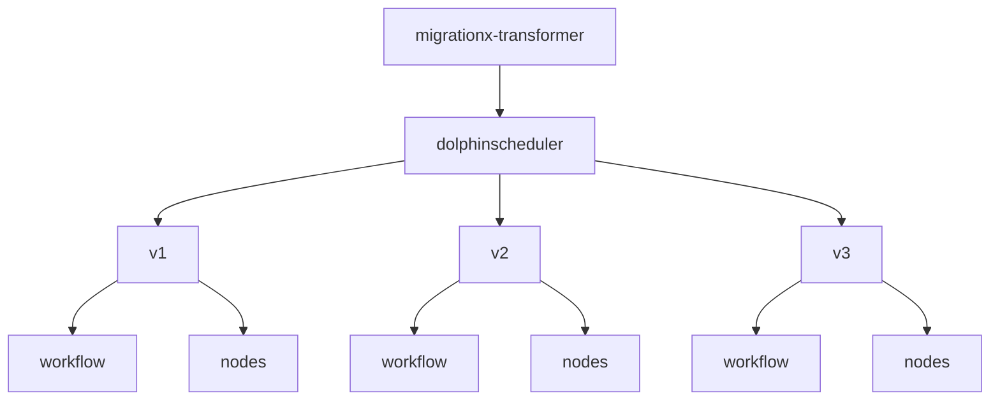
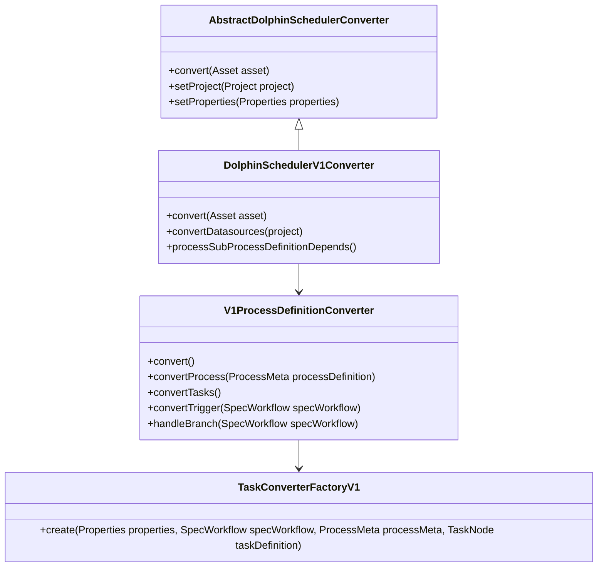
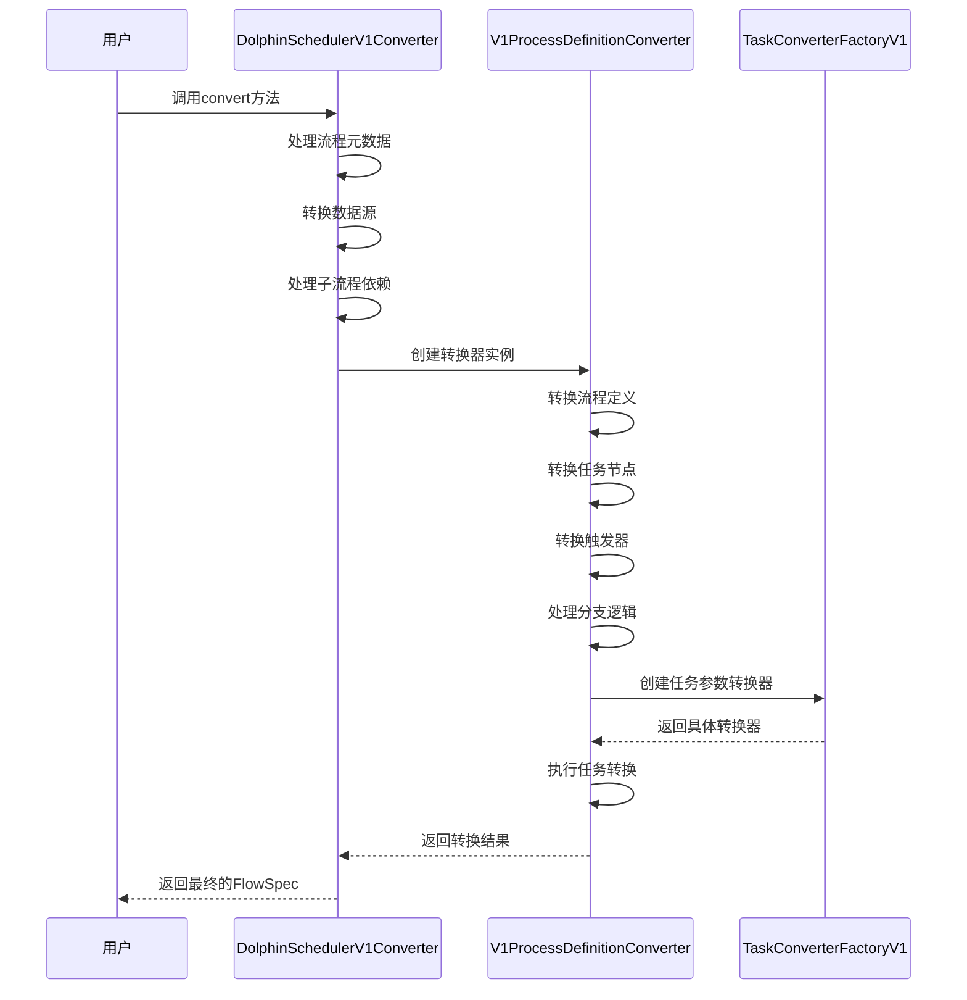
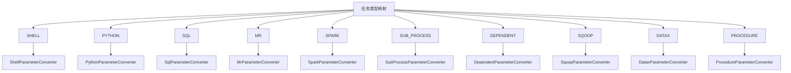
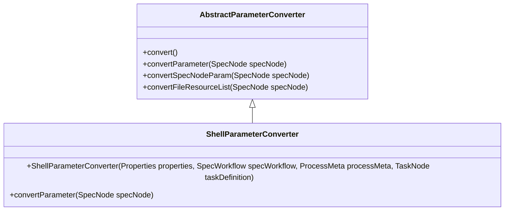
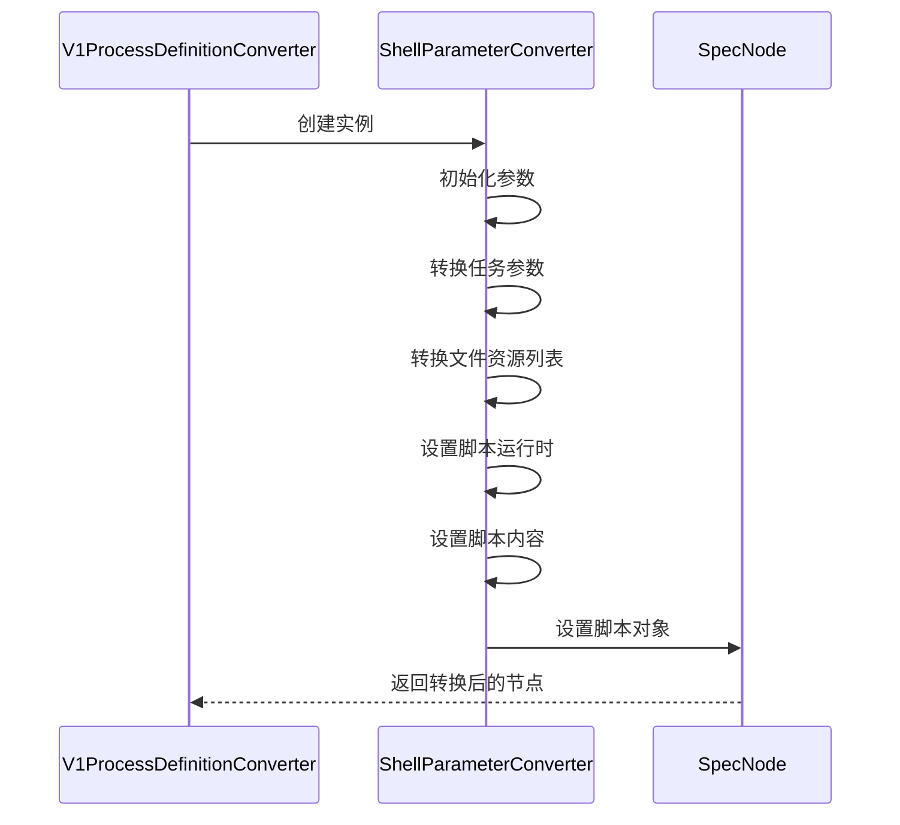
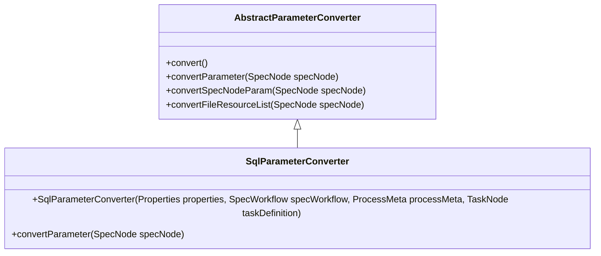
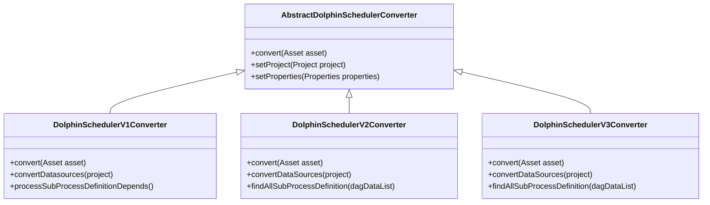
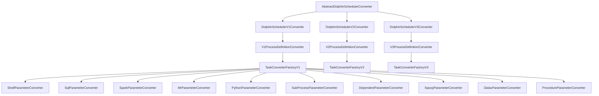

# DolphinScheduler转换器

<cite>
**本文档引用的文件**  
- [DolphinSchedulerV1Converter.java](file://client/migrationx/migrationx-transformer/src/main/java/com/aliyun/dataworks/migrationx/transformer/dataworks/converter/dolphinscheduler/v1/nodes/DolphinSchedulerV1Converter.java)
- [V1ProcessDefinitionConverter.java](file://client/migrationx/migrationx-transformer/src/main/java/com/aliyun/dataworks/migrationx/transformer/dataworks/converter/dolphinscheduler/v1/workflow/V1ProcessDefinitionConverter.java)
- [TaskConverterFactoryV1.java](file://client/migrationx/migrationx-transformer/src/main/java/com/aliyun/dataworks/migrationx/transformer/dataworks/converter/dolphinscheduler/v1/workflow/TaskConverterFactoryV1.java)
- [ShellParameterConverter.java](file://client/migrationx/migrationx-transformer/src/main/java/com/aliyun/dataworks/migrationx/transformer/dataworks/converter/dolphinscheduler/v1/workflow/parameters/ShellParameterConverter.java)
- [SqlParameterConverter.java](file://client/migrationx/migrationx-transformer/src/main/java/com/aliyun/dataworks/migrationx/transformer/dataworks/converter/dolphinscheduler/v1/workflow/parameters/SqlParameterConverter.java)
- [DolphinSchedulerV2Converter.java](file://client/migrationx/migrationx-transformer/src/main/java/com/aliyun/dataworks/migrationx/transformer/dataworks/converter/dolphinscheduler/v2/nodes/DolphinSchedulerV2Converter.java)
- [DolphinSchedulerV3Converter.java](file://client/migrationx/migrationx-transformer/src/main/java/com/aliyun/dataworks/migrationx/transformer/dataworks/converter/dolphinscheduler/v3/nodes/DolphinSchedulerV3Converter.java)
</cite>

## 目录
1. [简介](#简介)
2. [项目结构](#项目结构)
3. [核心组件](#核心组件)
4. [架构概述](#架构概述)
5. [详细组件分析](#详细组件分析)
6. [依赖分析](#依赖分析)
7. [性能考虑](#性能考虑)
8. [故障排除指南](#故障排除指南)
9. [结论](#结论)

## 简介
本文档详细介绍了DolphinScheduler转换器的实现逻辑，重点分析了如何将DolphinScheduler的流程定义、任务节点、依赖关系等模型元素映射到DataWorks标准FlowSpec。文档深入探讨了不同版本DolphinScheduler（V1/V2/V3）的元数据结构差异处理、任务类型映射规则（Shell、SQL、Spark等）、跨项目依赖处理、调度策略适配机制等关键技术细节。

## 项目结构
DolphinScheduler转换器位于`client/migrationx`目录下，主要包含domain、transformer和writer等模块。转换器的核心实现位于`migrationx-transformer`模块中，按照DolphinScheduler的不同版本（v1、v2、v3）分别实现了相应的转换逻辑。

**图示来源**  
- [DolphinSchedulerV1Converter.java](file://client/migrationx/migrationx-transformer/src/main/java/com/aliyun/dataworks/migrationx/transformer/dataworks/converter/dolphinscheduler/v1/nodes/DolphinSchedulerV1Converter.java)
- [DolphinSchedulerV2Converter.java](file://client/migrationx/migrationx-transformer/src/main/java/com/aliyun/dataworks/migrationx/transformer/dataworks/converter/dolphinscheduler/v2/nodes/DolphinSchedulerV2Converter.java)
- [DolphinSchedulerV3Converter.java](file://client/migrationx/migrationx-transformer/src/main/java/com/aliyun/dataworks/migrationx/transformer/dataworks/converter/dolphinscheduler/v3/nodes/DolphinSchedulerV3Converter.java)

**本节来源**  
- [DolphinSchedulerV1Converter.java](file://client/migrationx/migrationx-transformer/src/main/java/com/aliyun/dataworks/migrationx/transformer/dataworks/converter/dolphinscheduler/v1/nodes/DolphinSchedulerV1Converter.java)
- [DolphinSchedulerV2Converter.java](file://client/migrationx/migrationx-transformer/src/main/java/com/aliyun/dataworks/migrationx/transformer/dataworks/converter/dolphinscheduler/v2/nodes/DolphinSchedulerV2Converter.java)
- [DolphinSchedulerV3Converter.java](file://client/migrationx/migrationx-transformer/src/main/java/com/aliyun/dataworks/migrationx/transformer/dataworks/converter/dolphinscheduler/v3/nodes/DolphinSchedulerV3Converter.java)

## 核心组件
DolphinScheduler转换器的核心组件包括版本特定的转换器类（如DolphinSchedulerV1Converter、DolphinSchedulerV2Converter等），这些类负责将DolphinScheduler的流程定义转换为DataWorks的FlowSpec格式。转换器通过继承AbstractDolphinSchedulerConverter抽象类来实现通用的转换逻辑。

**本节来源**  
- [DolphinSchedulerV1Converter.java](file://client/migrationx/migrationx-transformer/src/main/java/com/aliyun/dataworks/migrationx/transformer/dataworks/converter/dolphinscheduler/v1/nodes/DolphinSchedulerV1Converter.java)
- [AbstractDolphinSchedulerConverter.java](file://client/migrationx/migrationx-transformer/src/main/java/com/aliyun/dataworks/migrationx/transformer/dataworks/converter/dolphinscheduler/AbstractDolphinSchedulerConverter.java)

## 架构概述
DolphinScheduler转换器采用分层架构设计，顶层是版本特定的转换器类，中间层是流程定义转换器（如V1ProcessDefinitionConverter），底层是任务参数转换器工厂（TaskConverterFactoryV1）。这种设计使得转换器能够灵活处理不同版本的DolphinScheduler元数据结构。

**图示来源**  
- [DolphinSchedulerV1Converter.java](file://client/migrationx/migrationx-transformer/src/main/java/com/aliyun/dataworks/migrationx/transformer/dataworks/converter/dolphinscheduler/v1/nodes/DolphinSchedulerV1Converter.java)
- [V1ProcessDefinitionConverter.java](file://client/migrationx/migrationx-transformer/src/main/java/com/aliyun/dataworks/migrationx/transformer/dataworks/converter/dolphinscheduler/v1/workflow/V1ProcessDefinitionConverter.java)
- [TaskConverterFactoryV1.java](file://client/migrationx/migrationx-transformer/src/main/java/com/aliyun/dataworks/migrationx/transformer/dataworks/converter/dolphinscheduler/v1/workflow/TaskConverterFactoryV1.java)

## 详细组件分析

### DolphinSchedulerV1Converter分析
DolphinSchedulerV1Converter是处理DolphinScheduler V1版本的核心转换器类。它负责将DolphinScheduler V1的流程定义转换为DataWorks的FlowSpec格式。

#### 转换流程

**图示来源**  
- [DolphinSchedulerV1Converter.java](file://client/migrationx/migrationx-transformer/src/main/java/com/aliyun/dataworks/migrationx/transformer/dataworks/converter/dolphinscheduler/v1/nodes/DolphinSchedulerV1Converter.java)
- [V1ProcessDefinitionConverter.java](file://client/migrationx/migrationx-transformer/src/main/java/com/aliyun/dataworks/migrationx/transformer/dataworks/converter/dolphinscheduler/v1/workflow/V1ProcessDefinitionConverter.java)
- [TaskConverterFactoryV1.java](file://client/migrationx/migrationx-transformer/src/main/java/com/aliyun/dataworks/migrationx/transformer/dataworks/converter/dolphinscheduler/v1/workflow/TaskConverterFactoryV1.java)

#### 任务类型映射规则

**图示来源**  
- [TaskConverterFactoryV1.java](file://client/migrationx/migrationx-transformer/src/main/java/com/aliyun/dataworks/migrationx/transformer/dataworks/converter/dolphinscheduler/v1/workflow/TaskConverterFactoryV1.java)

**本节来源**  
- [DolphinSchedulerV1Converter.java](file://client/migrationx/migrationx-transformer/src/main/java/com/aliyun/dataworks/migrationx/transformer/dataworks/converter/dolphinscheduler/v1/nodes/DolphinSchedulerV1Converter.java)
- [V1ProcessDefinitionConverter.java](file://client/migrationx/migrationx-transformer/src/main/java/com/aliyun/dataworks/migrationx/transformer/dataworks/converter/dolphinscheduler/v1/workflow/V1ProcessDefinitionConverter.java)
- [TaskConverterFactoryV1.java](file://client/migrationx/migrationx-transformer/src/main/java/com/aliyun/dataworks/migrationx/transformer/dataworks/converter/dolphinscheduler/v1/workflow/TaskConverterFactoryV1.java)

### Shell任务转换分析
Shell任务转换器负责将DolphinScheduler的Shell任务节点转换为DataWorks的相应节点。

#### ShellParameterConverter实现

**图示来源**  
- [ShellParameterConverter.java](file://client/migrationx/migrationx-transformer/src/main/java/com/aliyun/dataworks/migrationx/transformer/dataworks/converter/dolphinscheduler/v1/workflow/parameters/ShellParameterConverter.java)

#### Shell任务转换流程

**图示来源**  
- [ShellParameterConverter.java](file://client/migrationx/migrationx-transformer/src/main/java/com/aliyun/dataworks/migrationx/transformer/dataworks/converter/dolphinscheduler/v1/workflow/parameters/ShellParameterConverter.java)

**本节来源**  
- [ShellParameterConverter.java](file://client/migrationx/migrationx-transformer/src/main/java/com/aliyun/dataworks/migrationx/transformer/dataworks/converter/dolphinscheduler/v1/workflow/parameters/ShellParameterConverter.java)

### SQL任务转换分析
SQL任务转换器负责将DolphinScheduler的SQL任务节点转换为DataWorks的相应节点。

#### SqlParameterConverter实现

**图示来源**  
- [SqlParameterConverter.java](file://client/migrationx/migrationx-transformer/src/main/java/com/aliyun/dataworks/migrationx/transformer/dataworks/converter/dolphinscheduler/v1/workflow/parameters/SqlParameterConverter.java)

**本节来源**  
- [SqlParameterConverter.java](file://client/migrationx/migrationx-transformer/src/main/java/com/aliyun/dataworks/migrationx/transformer/dataworks/converter/dolphinscheduler/v1/workflow/parameters/SqlParameterConverter.java)

### 不同版本差异处理
DolphinScheduler转换器针对V1、V2、V3三个主要版本实现了不同的转换逻辑，以处理各版本间的元数据结构差异。

#### 版本差异处理架构

**图示来源**  
- [DolphinSchedulerV1Converter.java](file://client/migrationx/migrationx-transformer/src/main/java/com/aliyun/dataworks/migrationx/transformer/dataworks/converter/dolphinscheduler/v1/nodes/DolphinSchedulerV1Converter.java)
- [DolphinSchedulerV2Converter.java](file://client/migrationx/migrationx-transformer/src/main/java/com/aliyun/dataworks/migrationx/transformer/dataworks/converter/dolphinscheduler/v2/nodes/DolphinSchedulerV2Converter.java)
- [DolphinSchedulerV3Converter.java](file://client/migrationx/migrationx-transformer/src/main/java/com/aliyun/dataworks/migrationx/transformer/dataworks/converter/dolphinscheduler/v3/nodes/DolphinSchedulerV3Converter.java)

**本节来源**  
- [DolphinSchedulerV1Converter.java](file://client/migrationx/migrationx-transformer/src/main/java/com/aliyun/dataworks/migrationx/transformer/dataworks/converter/dolphinscheduler/v1/nodes/DolphinSchedulerV1Converter.java)
- [DolphinSchedulerV2Converter.java](file://client/migrationx/migrationx-transformer/src/main/java/com/aliyun/dataworks/migrationx/transformer/dataworks/converter/dolphinscheduler/v2/nodes/DolphinSchedulerV2Converter.java)
- [DolphinSchedulerV3Converter.java](file://client/migrationx/migrationx-transformer/src/main/java/com/aliyun/dataworks/migrationx/transformer/dataworks/converter/dolphinscheduler/v3/nodes/DolphinSchedulerV3Converter.java)

## 依赖分析
DolphinScheduler转换器的依赖关系主要体现在不同版本转换器之间的继承关系和任务类型转换器之间的工厂模式应用。

**图示来源**  
- [DolphinSchedulerV1Converter.java](file://client/migrationx/migrationx-transformer/src/main/java/com/aliyun/dataworks/migrationx/transformer/dataworks/converter/dolphinscheduler/v1/nodes/DolphinSchedulerV1Converter.java)
- [DolphinSchedulerV2Converter.java](file://client/migrationx/migrationx-transformer/src/main/java/com/aliyun/dataworks/migrationx/transformer/dataworks/converter/dolphinscheduler/v2/nodes/DolphinSchedulerV2Converter.java)
- [DolphinSchedulerV3Converter.java](file://client/migrationx/migrationx-transformer/src/main/java/com/aliyun/dataworks/migrationx/transformer/dataworks/converter/dolphinscheduler/v3/nodes/DolphinSchedulerV3Converter.java)
- [TaskConverterFactoryV1.java](file://client/migrationx/migrationx-transformer/src/main/java/com/aliyun/dataworks/migrationx/transformer/dataworks/converter/dolphinscheduler/v1/workflow/TaskConverterFactoryV1.java)

**本节来源**  
- [DolphinSchedulerV1Converter.java](file://client/migrationx/migrationx-transformer/src/main/java/com/aliyun/dataworks/migrationx/transformer/dataworks/converter/dolphinscheduler/v1/nodes/DolphinSchedulerV1Converter.java)
- [DolphinSchedulerV2Converter.java](file://client/migrationx/migrationx-transformer/src/main/java/com/aliyun/dataworks/migrationx/transformer/dataworks/converter/dolphinscheduler/v2/nodes/DolphinSchedulerV2Converter.java)
- [DolphinSchedulerV3Converter.java](file://client/migrationx/migrationx-transformer/src/main/java/com/aliyun/dataworks/migrationx/transformer/dataworks/converter/dolphinscheduler/v3/nodes/DolphinSchedulerV3Converter.java)
- [TaskConverterFactoryV1.java](file://client/migrationx/migrationx-transformer/src/main/java/com/aliyun/dataworks/migrationx/transformer/dataworks/converter/dolphinscheduler/v1/workflow/TaskConverterFactoryV1.java)

## 性能考虑
DolphinScheduler转换器在设计时考虑了性能优化，通过检查点机制（CheckPoint）来避免重复转换已经处理过的任务，提高了大规模迁移场景下的转换效率。

**本节来源**  
- [V1ProcessDefinitionConverter.java](file://client/migrationx/migrationx-transformer/src/main/java/com/aliyun/dataworks/migrationx/transformer/dataworks/converter/dolphinscheduler/v1/workflow/V1ProcessDefinitionConverter.java)

## 故障排除指南
在使用DolphinScheduler转换器时，可能会遇到一些常见问题，如任务超时配置丢失、资源引用错误等。这些问题通常可以通过检查转换器的配置参数和源数据的完整性来解决。

**本节来源**  
- [DolphinSchedulerV1Converter.java](file://client/migrationx/migrationx-transformer/src/main/java/com/aliyun/dataworks/migrationx/transformer/dataworks/converter/dolphinscheduler/v1/nodes/DolphinSchedulerV1Converter.java)
- [V1ProcessDefinitionConverter.java](file://client/migrationx/migrationx-transformer/src/main/java/com/aliyun/dataworks/migrationx/transformer/dataworks/converter/dolphinscheduler/v1/workflow/V1ProcessDefinitionConverter.java)

## 结论
DolphinScheduler转换器是一个功能完整的迁移工具，能够有效地将DolphinScheduler的流程定义转换为DataWorks的FlowSpec格式。通过分层架构设计和工厂模式的应用，转换器能够灵活处理不同版本的DolphinScheduler元数据结构，并支持多种任务类型的映射。未来可以通过扩展TaskConverterFactory来支持更多的任务类型，进一步增强转换器的功能。