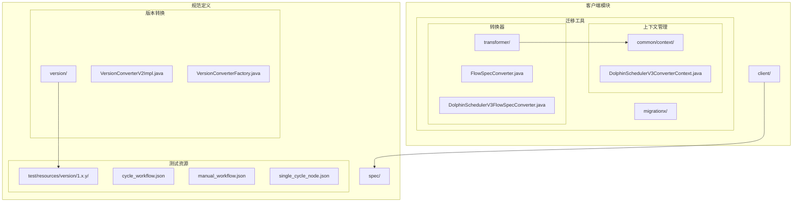
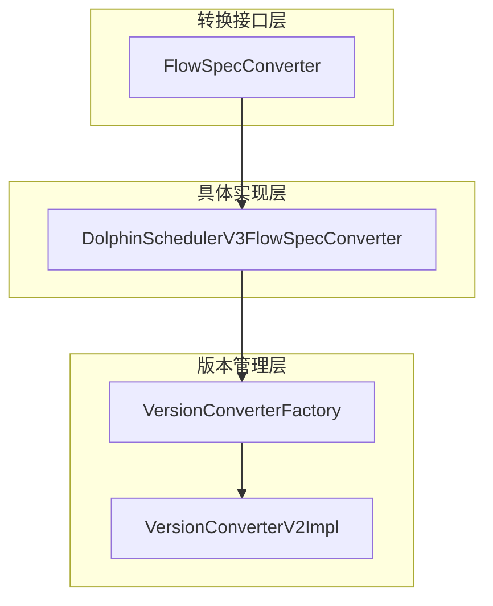
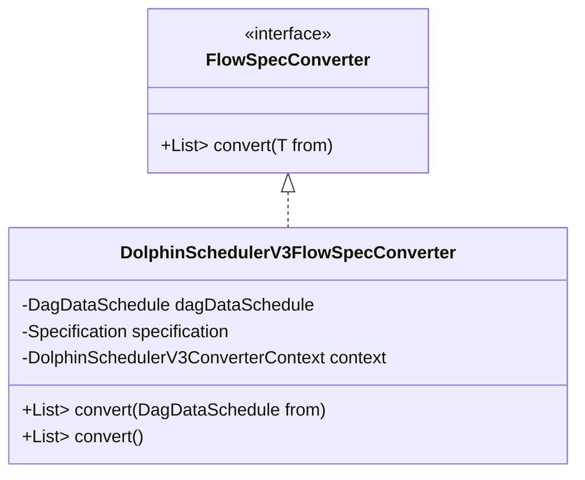
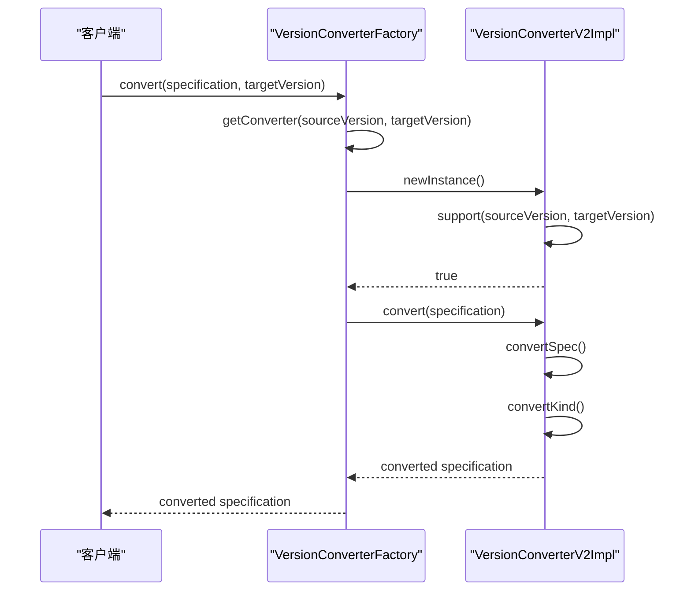
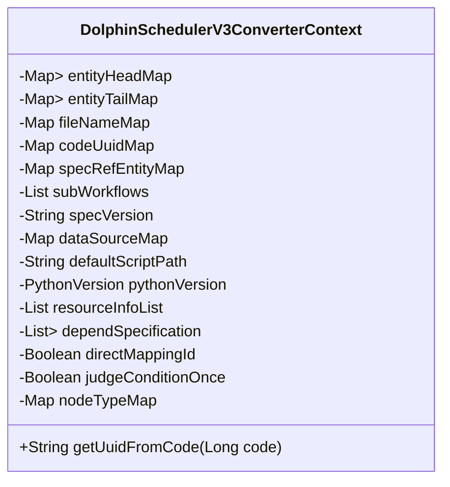
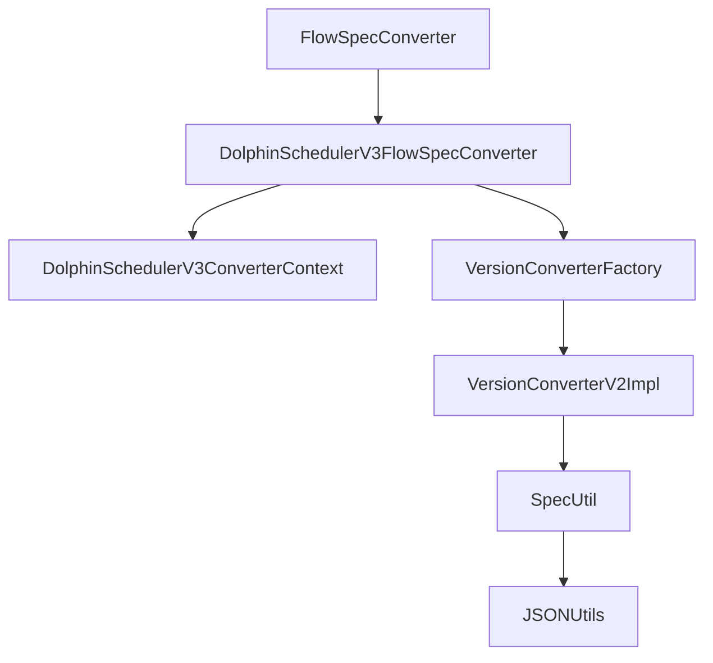

# FlowSpec转换器

<cite>
**本文档引用的文件**   
- [FlowSpecConverter.java](file://client/migrationx/migrationx-transformer/src/main/java/com/aliyun/dataworks/migrationx/transformer/flowspec/converter/FlowSpecConverter.java)
- [DolphinSchedulerV3FlowSpecConverter.java](file://client/migrationx/migrationx-transformer/src/main/java/com/aliyun/dataworks/migrationx/transformer/flowspec/converter/dolphinscheduler/DolphinSchedulerV3FlowSpecConverter.java)
- [DolphinSchedulerV3ConverterContext.java](file://client/migrationx/migrationx-transformer/src/main/java/com/aliyun/dataworks/migrationx/transformer/flowspec/converter/dolphinscheduler/common/context/DolphinSchedulerV3ConverterContext.java)
- [VersionConverterV2Impl.java](file://spec/src/main/java/com/aliyun/dataworks/common/spec/version/VersionConverterV2Impl.java)
- [VersionConverterFactory.java](file://spec/src/main/java/com/aliyun/dataworks/common/spec/version/VersionConverterFactory.java)
- [cycle_workflow.json](file://spec/src/test/resources/version/1.x.y/cycle_workflow.json)
- [manual_workflow.json](file://spec/src/test/resources/version/1.x.y/manual_workflow.json)
- [single_cycle_node.json](file://spec/src/test/resources/version/1.x.y/single_cycle_node.json)
</cite>

## 目录
1. [简介](#简介)
2. [项目结构](#项目结构)
3. [核心组件](#核心组件)
4. [架构概述](#架构概述)
5. [详细组件分析](#详细组件分析)
6. [依赖分析](#依赖分析)
7. [性能考虑](#性能考虑)
8. [故障排除指南](#故障排除指南)
9. [结论](#结论)

## 简介
FlowSpec转换器是DataWorks规范系统中的关键组件，负责将不同版本的FlowSpec规范进行格式转换和升级。该系统支持从旧版本到新版本的字段映射、结构重组和兼容性处理，确保数据工作流在不同版本间的平滑迁移。本文档详细介绍了FlowSpecConverter类的实现逻辑，深入分析了版本间差异处理策略、扩展字段的迁移规则以及校验逻辑的演进等关键技术细节。

## 项目结构
项目结构清晰地划分了客户端、文档、规范定义和工具等模块。核心的FlowSpec转换功能主要集中在`spec`和`client/migrationx`目录下。`spec`目录包含了规范的定义、解析和版本转换逻辑，而`client/migrationx`则包含了具体的转换器实现和上下文管理。

**图表来源**
- [FlowSpecConverter.java](file://client/migrationx/migrationx-transformer/src/main/java/com/aliyun/dataworks/migrationx/transformer/flowspec/converter/FlowSpecConverter.java)
- [DolphinSchedulerV3FlowSpecConverter.java](file://client/migrationx/migrationx-transformer/src/main/java/com/aliyun/dataworks/migrationx/transformer/flowspec/converter/dolphinscheduler/DolphinSchedulerV3FlowSpecConverter.java)
- [DolphinSchedulerV3ConverterContext.java](file://client/migrationx/migrationx-transformer/src/main/java/com/aliyun/dataworks/migrationx/transformer/flowspec/converter/dolphinscheduler/common/context/DolphinSchedulerV3ConverterContext.java)
- [VersionConverterV2Impl.java](file://spec/src/main/java/com/aliyun/dataworks/common/spec/version/VersionConverterV2Impl.java)
- [VersionConverterFactory.java](file://spec/src/main/java/com/aliyun/dataworks/common/spec/version/VersionConverterFactory.java)
- [cycle_workflow.json](file://spec/src/test/resources/version/1.x.y/cycle_workflow.json)
- [manual_workflow.json](file://spec/src/test/resources/version/1.x.y/manual_workflow.json)
- [single_cycle_node.json](file://spec/src/test/resources/version/1.x.y/single_cycle_node.json)

**章节来源**
- [FlowSpecConverter.java](file://client/migrationx/migrationx-transformer/src/main/java/com/aliyun/dataworks/migrationx/transformer/flowspec/converter/FlowSpecConverter.java)
- [DolphinSchedulerV3FlowSpecConverter.java](file://client/migrationx/migrationx-transformer/src/main/java/com/aliyun/dataworks/migrationx/transformer/flowspec/converter/dolphinscheduler/DolphinSchedulerV3FlowSpecConverter.java)
- [DolphinSchedulerV3ConverterContext.java](file://client/migrationx/migrationx-transformer/src/main/java/com/aliyun/dataworks/migrationx/transformer/flowspec/converter/dolphinscheduler/common/context/DolphinSchedulerV3ConverterContext.java)
- [VersionConverterV2Impl.java](file://spec/src/main/java/com/aliyun/dataworks/common/spec/version/VersionConverterV2Impl.java)
- [VersionConverterFactory.java](file://spec/src/main/java/com/aliyun/dataworks/common/spec/version/VersionConverterFactory.java)

## 核心组件
FlowSpec转换器的核心组件包括`FlowSpecConverter`接口、`DolphinSchedulerV3FlowSpecConverter`实现类以及`VersionConverterV2Impl`版本转换器。`FlowSpecConverter`定义了将源对象转换为FlowSpec的基本契约，而`DolphinSchedulerV3FlowSpecConverter`则具体实现了从DolphinScheduler V3数据到FlowSpec的转换逻辑。`VersionConverterV2Impl`负责处理不同版本间的规范转换，确保向后兼容性。

**章节来源**
- [FlowSpecConverter.java](file://client/migrationx/migrationx-transformer/src/main/java/com/aliyun/dataworks/migrationx/transformer/flowspec/converter/FlowSpecConverter.java)
- [DolphinSchedulerV3FlowSpecConverter.java](file://client/migrationx/migrationx-transformer/src/main/java/com/aliyun/dataworks/migrationx/transformer/flowspec/converter/dolphinscheduler/DolphinSchedulerV3FlowSpecConverter.java)
- [VersionConverterV2Impl.java](file://spec/src/main/java/com/aliyun/dataworks/common/spec/version/VersionConverterV2Impl.java)

## 架构概述
FlowSpec转换器的架构分为三层：转换接口层、具体实现层和版本管理层。转换接口层定义了通用的转换契约，具体实现层针对不同的源系统（如DolphinScheduler）提供具体的转换逻辑，版本管理层则负责处理不同版本间的兼容性和转换。

**图表来源**
- [FlowSpecConverter.java](file://client/migrationx/migrationx-transformer/src/main/java/com/aliyun/dataworks/migrationx/transformer/flowspec/converter/FlowSpecConverter.java)
- [DolphinSchedulerV3FlowSpecConverter.java](file://client/migrationx/migrationx-transformer/src/main/java/com/aliyun/dataworks/migrationx/transformer/flowspec/converter/dolphinscheduler/DolphinSchedulerV3FlowSpecConverter.java)
- [VersionConverterFactory.java](file://spec/src/main/java/com/aliyun/dataworks/common/spec/version/VersionConverterFactory.java)
- [VersionConverterV2Impl.java](file://spec/src/main/java/com/aliyun/dataworks/common/spec/version/VersionConverterV2Impl.java)

## 详细组件分析

### FlowSpecConverter接口分析
`FlowSpecConverter`接口是所有具体转换器的基础，定义了将源对象转换为FlowSpec列表的契约。该接口采用泛型设计，支持不同类型源对象的转换。

**图表来源**
- [FlowSpecConverter.java](file://client/migrationx/migrationx-transformer/src/main/java/com/aliyun/dataworks/migrationx/transformer/flowspec/converter/FlowSpecConverter.java)
- [DolphinSchedulerV3FlowSpecConverter.java](file://client/migrationx/migrationx-transformer/src/main/java/com/aliyun/dataworks/migrationx/transformer/flowspec/converter/dolphinscheduler/DolphinSchedulerV3FlowSpecConverter.java)

**章节来源**
- [FlowSpecConverter.java](file://client/migrationx/migrationx-transformer/src/main/java/com/aliyun/dataworks/migrationx/transformer/flowspec/converter/FlowSpecConverter.java)
- [DolphinSchedulerV3FlowSpecConverter.java](file://client/migrationx/migrationx-transformer/src/main/java/com/aliyun/dataworks/migrationx/transformer/flowspec/converter/dolphinscheduler/DolphinSchedulerV3FlowSpecConverter.java)

### 版本转换机制分析
版本转换机制通过`VersionConverterFactory`和`VersionConverterV2Impl`协同工作。工厂类负责发现和管理所有版本转换器，而具体实现类则处理从旧版本到新版本的结构转换和字段映射。

**图表来源**
- [VersionConverterFactory.java](file://spec/src/main/java/com/aliyun/dataworks/common/spec/version/VersionConverterFactory.java)
- [VersionConverterV2Impl.java](file://spec/src/main/java/com/aliyun/dataworks/common/spec/version/VersionConverterV2Impl.java)

**章节来源**
- [VersionConverterFactory.java](file://spec/src/main/java/com/aliyun/dataworks/common/spec/version/VersionConverterFactory.java)
- [VersionConverterV2Impl.java](file://spec/src/main/java/com/aliyun/dataworks/common/spec/version/VersionConverterV2Impl.java)

### 配置上下文管理分析
`DolphinSchedulerV3ConverterContext`类管理转换过程中的上下文信息，包括数据源映射、默认脚本路径、Python版本等配置。这些配置确保了转换过程的灵活性和可定制性。

**图表来源**
- [DolphinSchedulerV3ConverterContext.java](file://client/migrationx/migrationx-transformer/src/main/java/com/aliyun/dataworks/migrationx/transformer/flowspec/converter/dolphinscheduler/common/context/DolphinSchedulerV3ConverterContext.java)

**章节来源**
- [DolphinSchedulerV3ConverterContext.java](file://client/migrationx/migrationx-transformer/src/main/java/com/aliyun/dataworks/migrationx/transformer/flowspec/converter/dolphinscheduler/common/context/DolphinSchedulerV3ConverterContext.java)

## 依赖分析
FlowSpec转换器的依赖关系清晰，主要依赖于规范定义模块和上下文管理模块。通过合理的依赖管理，确保了系统的模块化和可维护性。

**图表来源**
- [FlowSpecConverter.java](file://client/migrationx/migrationx-transformer/src/main/java/com/aliyun/dataworks/migrationx/transformer/flowspec/converter/FlowSpecConverter.java)
- [DolphinSchedulerV3FlowSpecConverter.java](file://client/migrationx/migrationx-transformer/src/main/java/com/aliyun/dataworks/migrationx/transformer/flowspec/converter/dolphinscheduler/DolphinSchedulerV3FlowSpecConverter.java)
- [DolphinSchedulerV3ConverterContext.java](file://client/migrationx/migrationx-transformer/src/main/java/com/aliyun/dataworks/migrationx/transformer/flowspec/converter/dolphinscheduler/common/context/DolphinSchedulerV3ConverterContext.java)
- [VersionConverterFactory.java](file://spec/src/main/java/com/aliyun/dataworks/common/spec/version/VersionConverterFactory.java)
- [VersionConverterV2Impl.java](file://spec/src/main/java/com/aliyun/dataworks/common/spec/version/VersionConverterV2Impl.java)

**章节来源**
- [FlowSpecConverter.java](file://client/migrationx/migrationx-transformer/src/main/java/com/aliyun/dataworks/migrationx/transformer/flowspec/converter/FlowSpecConverter.java)
- [DolphinSchedulerV3FlowSpecConverter.java](file://client/migrationx/migrationx-transformer/src/main/java/com/aliyun/dataworks/migrationx/transformer/flowspec/converter/dolphinscheduler/DolphinSchedulerV3FlowSpecConverter.java)
- [DolphinSchedulerV3ConverterContext.java](file://client/migrationx/migrationx-transformer/src/main/java/com/aliyun/dataworks/migrationx/transformer/flowspec/converter/dolphinscheduler/common/context/DolphinSchedulerV3ConverterContext.java)
- [VersionConverterFactory.java](file://spec/src/main/java/com/aliyun/dataworks/common/spec/version/VersionConverterFactory.java)
- [VersionConverterV2Impl.java](file://spec/src/main/java/com/aliyun/dataworks/common/spec/version/VersionConverterV2Impl.java)

## 性能考虑
FlowSpec转换器在设计时充分考虑了性能因素。通过使用反射机制动态加载转换器，避免了硬编码的依赖关系。同时，上下文对象的合理设计减少了重复计算，提高了转换效率。版本转换工厂采用单例模式和同步机制，确保了线程安全的同时也优化了性能。

## 故障排除指南
在使用FlowSpec转换器时，可能会遇到版本兼容性问题或字段丢失等常见问题。建议首先检查源数据的完整性，确保所有必需字段都已正确填充。其次，验证转换上下文的配置是否正确，特别是数据源映射和默认脚本路径等关键配置。如果问题仍然存在，可以通过启用详细的日志记录来追踪转换过程中的具体步骤，从而定位问题根源。

**章节来源**
- [DolphinSchedulerV3ConverterContext.java](file://client/migrationx/migrationx-transformer/src/main/java/com/aliyun/dataworks/migrationx/transformer/flowspec/converter/dolphinscheduler/common/context/DolphinSchedulerV3ConverterContext.java)
- [VersionConverterV2Impl.java](file://spec/src/main/java/com/aliyun/dataworks/common/spec/version/VersionConverterV2Impl.java)

## 结论
FlowSpec转换器是一个功能强大且设计精良的系统，能够有效地处理不同版本FlowSpec规范之间的转换。通过清晰的架构设计和合理的依赖管理，确保了系统的可扩展性和可维护性。未来可以通过增加更多的转换器实现来支持更多的源系统，进一步提升系统的适用范围。