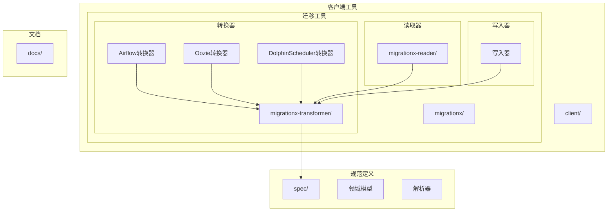
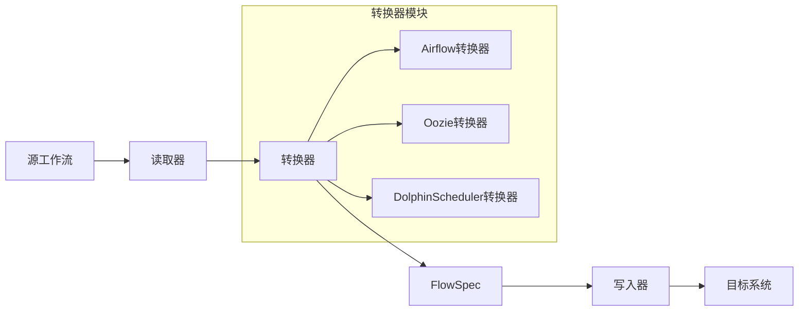
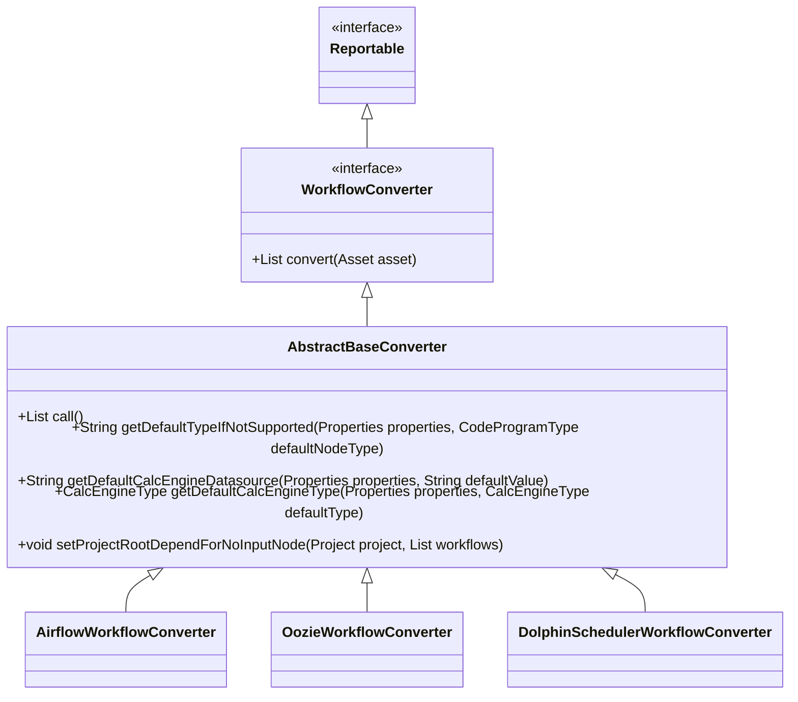
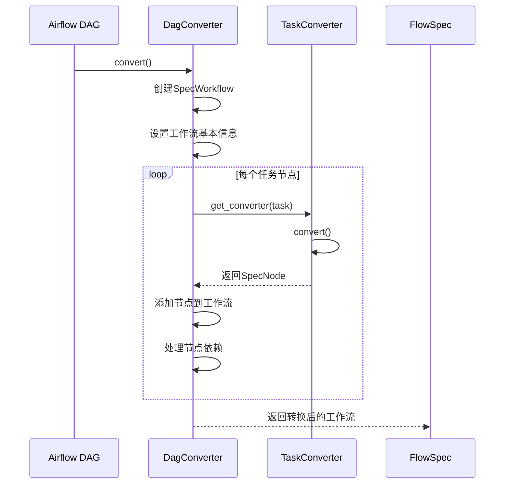
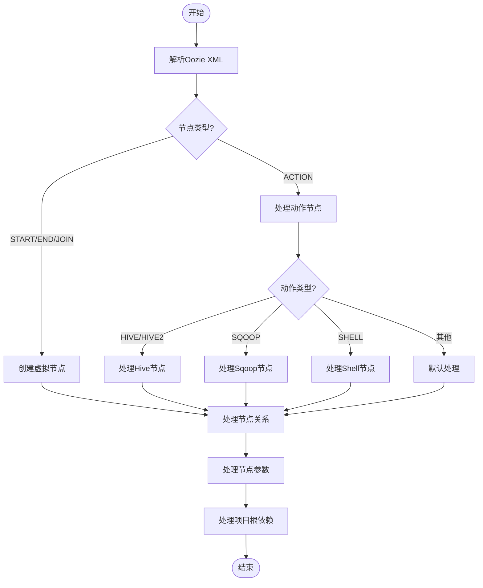
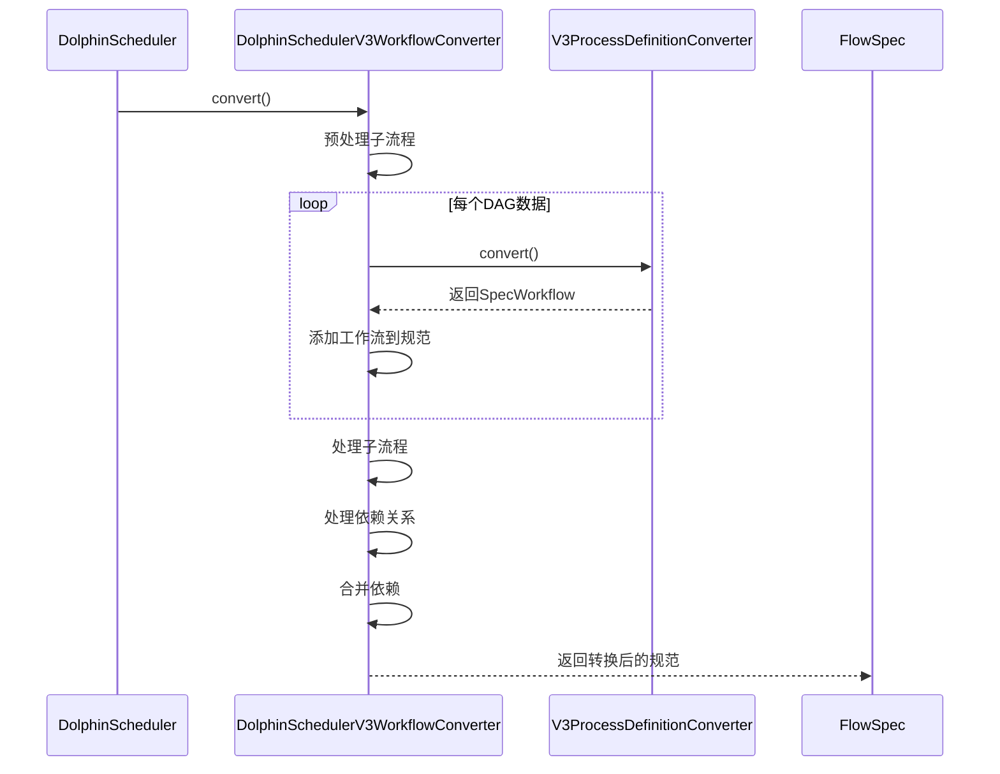
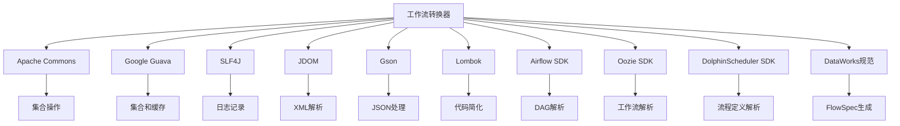

# 工作流转换器

<cite>
**本文档引用的文件**   
- [WorkflowConverter.java](file://client/migrationx/migrationx-transformer/src/main/java/com/aliyun/dataworks/migrationx/transformer/dataworks/converter/WorkflowConverter.java)
- [AbstractBaseConverter.java](file://client/migrationx/migrationx-transformer/src/main/java/com/aliyun/dataworks/migrationx/transformer/dataworks/converter/AbstractBaseConverter.java)
- [dag_converter.py](file://client/migrationx-transformer/src/main/python/airflow_dag_parser/converter/dag_converter.py)
- [task_converter.py](file://client/migrationx-transformer/src/main/python/airflow_dag_parser/converter/task_converter.py)
- [converters.py](file://client/migrationx-transformer/src/main/python/airflow_dag_parser/converter/converters.py)
- [dw_spec.py](file://client/migrationx-transformer/src/main/python/airflow_dag_parser/models/dw_spec.py)
- [OozieWorkflowConverter.java](file://client/migrationx/migrationx-transformer/src/main/java/com/aliyun/dataworks/migrationx/transformer/dataworks/converter/oozie/OozieWorkflowConverter.java)
- [DolphinSchedulerV3WorkflowConverter.java](file://client/migrationx/migrationx-transformer/src/main/java/com/aliyun/dataworks/migrationx/transformer/dataworks/converter/dolphinscheduler/v3/workflow/DolphinSchedulerV3WorkflowConverter.java)
</cite>

## 目录
1. [简介](#简介)
2. [项目结构](#项目结构)
3. [核心组件](#核心组件)
4. [架构概述](#架构概述)
5. [详细组件分析](#详细组件分析)
6. [依赖分析](#依赖分析)
7. [性能考虑](#性能考虑)
8. [故障排除指南](#故障排除指南)
9. [结论](#结论)

## 简介
工作流转换器是DataWorks平台中的关键组件，负责将多种通用工作流模型（如Airflow DAG、Oozie Workflow、DolphinScheduler等）转换为DataWorks标准的FlowSpec格式。该系统通过一系列转换器实现，每个转换器专门处理特定的工作流引擎。转换过程包括DAG结构解析、任务依赖关系转换、调度周期映射、变量和参数处理等关键技术环节。本技术文档将深入分析WorkflowConverter类的实现逻辑，详细说明转换过程中的关键技术细节，并提供完整的配置示例和转换前后对比分析。

## 项目结构
项目结构清晰地组织了工作流转换相关的各个模块，主要包括客户端工具、迁移工具、规范定义和文档等部分。核心的转换逻辑位于`client/migrationx/migrationx-transformer`目录下，其中包含了针对不同工作流引擎的转换器实现。

**图表来源**
- [WorkflowConverter.java](file://client/migrationx/migrationx-transformer/src/main/java/com/aliyun/dataworks/migrationx/transformer/dataworks/converter/WorkflowConverter.java)
- [AbstractBaseConverter.java](file://client/migrationx/migrationx-transformer/src/main/java/com/aliyun/dataworks/migrationx/transformer/dataworks/converter/AbstractBaseConverter.java)

**章节来源**
- [client/migrationx/migrationx-transformer/](file://client/migrationx/migrationx-transformer/)

## 核心组件
工作流转换器的核心组件包括WorkflowConverter接口、AbstractBaseConverter抽象类以及针对不同工作流引擎的具体转换器实现。WorkflowConverter接口定义了转换的基本契约，所有具体的转换器都必须实现该接口。AbstractBaseConverter提供了转换过程中的通用功能，如资产加载、属性配置等。具体的转换器如Airflow、Oozie和DolphinScheduler转换器则实现了特定工作流引擎的解析和转换逻辑。

**章节来源**
- [WorkflowConverter.java](file://client/migrationx/migrationx-transformer/src/main/java/com/aliyun/dataworks/migrationx/transformer/dataworks/converter/WorkflowConverter.java)
- [AbstractBaseConverter.java](file://client/migrationx/migrationx-transformer/src/main/java/com/aliyun/dataworks/migrationx/transformer/dataworks/converter/AbstractBaseConverter.java)

## 架构概述
工作流转换器采用模块化架构，通过接口和抽象类定义通用的转换契约，具体的转换器实现针对不同的工作流引擎。系统通过读取器模块读取源工作流定义，转换器模块进行格式转换，最后通过写入器模块输出为DataWorks标准的FlowSpec格式。这种架构设计使得系统易于扩展，可以方便地添加对新的工作流引擎的支持。

**图表来源**
- [WorkflowConverter.java](file://client/migrationx/migrationx-transformer/src/main/java/com/aliyun/dataworks/migrationx/transformer/dataworks/converter/WorkflowConverter.java)
- [AbstractBaseConverter.java](file://client/migrationx/migrationx-transformer/src/main/java/com/aliyun/dataworks/migrationx/transformer/dataworks/converter/AbstractBaseConverter.java)

## 详细组件分析

### WorkflowConverter接口分析
WorkflowConverter接口是整个转换系统的核心，定义了所有转换器必须实现的契约。该接口继承自Reportable接口，允许转换器报告转换过程中的问题和风险。

**图表来源**
- [WorkflowConverter.java](file://client/migrationx/migrationx-transformer/src/main/java/com/aliyun/dataworks/migrationx/transformer/dataworks/converter/WorkflowConverter.java)
- [AbstractBaseConverter.java](file://client/migrationx/migrationx-transformer/src/main/java/com/aliyun/dataworks/migrationx/transformer/dataworks/converter/AbstractBaseConverter.java)

**章节来源**
- [WorkflowConverter.java](file://client/migrationx/migrationx-transformer/src/main/java/com/aliyun/dataworks/migrationx/transformer/dataworks/converter/WorkflowConverter.java)
- [AbstractBaseConverter.java](file://client/migrationx/migrationx-transformer/src/main/java/com/aliyun/dataworks/migrationx/transformer/dataworks/converter/AbstractBaseConverter.java)

### Airflow转换器分析
Airflow转换器实现了从Airflow DAG到DataWorks FlowSpec的完整转换过程。转换器通过递归解析DAG结构，将每个任务节点转换为对应的DataWorks节点，并处理任务间的依赖关系。

**图表来源**
- [dag_converter.py](file://client/migrationx-transformer/src/main/python/airflow_dag_parser/converter/dag_converter.py)
- [task_converter.py](file://client/migrationx-transformer/src/main/python/airflow_dag_parser/converter/task_converter.py)

**章节来源**
- [dag_converter.py](file://client/migrationx-transformer/src/main/python/airflow_dag_parser/converter/dag_converter.py)
- [task_converter.py](file://client/migrationx-transformer/src/main/python/airflow_dag_parser/converter/task_converter.py)

### Oozie转换器分析
Oozie转换器处理Oozie工作流到DataWorks FlowSpec的转换。转换器需要解析Oozie的XML格式工作流定义，处理各种节点类型（如START、END、JOIN、ACTION等），并转换为DataWorks对应的节点类型。

**图表来源**
- [OozieWorkflowConverter.java](file://client/migrationx/migrationx-transformer/src/main/java/com/aliyun/dataworks/migrationx/transformer/dataworks/converter/oozie/OozieWorkflowConverter.java)

**章节来源**
- [OozieWorkflowConverter.java](file://client/migrationx/migrationx-transformer/src/main/java/com/aliyun/dataworks/migrationx/transformer/dataworks/converter/oozie/OozieWorkflowConverter.java)

### DolphinScheduler转换器分析
DolphinScheduler转换器处理DolphinScheduler工作流到DataWorks FlowSpec的转换。转换器需要处理子流程、依赖任务等复杂场景，并确保转换后的FlowSpec符合DataWorks的标准。

**图表来源**
- [DolphinSchedulerV3WorkflowConverter.java](file://client/migrationx/migrationx-transformer/src/main/java/com/aliyun/dataworks/migrationx/transformer/dataworks/converter/dolphinscheduler/v3/workflow/DolphinSchedulerV3WorkflowConverter.java)

**章节来源**
- [DolphinSchedulerV3WorkflowConverter.java](file://client/migrationx/migrationx-transformer/src/main/java/com/aliyun/dataworks/migrationx/transformer/dataworks/converter/dolphinscheduler/v3/workflow/DolphinSchedulerV3WorkflowConverter.java)

## 依赖分析
工作流转换器系统依赖于多个外部库和内部模块，这些依赖关系确保了系统的功能完整性和扩展性。

**图表来源**
- [pom.xml](file://client/migrationx/migrationx-transformer/pom.xml)
- [requirements.txt](file://client/migrationx-transformer/src/main/python/requirements.txt)

**章节来源**
- [pom.xml](file://client/migrationx/migrationx-transformer/pom.xml)
- [requirements.txt](file://client/migrationx-transformer/src/main/python/requirements.txt)

## 性能考虑
工作流转换器在设计时考虑了多个性能因素，以确保在处理大型工作流时的效率和稳定性。系统采用流式处理方式，避免一次性加载整个工作流到内存中。对于复杂的依赖关系处理，系统使用了缓存机制来避免重复计算。此外，转换过程中的日志记录和错误报告也经过优化，以减少对性能的影响。

## 故障排除指南
在使用工作流转换器时，可能会遇到各种问题。以下是一些常见问题及其解决方案：

1. **循环依赖检测**：当工作流中存在循环依赖时，转换器会抛出异常。解决方案是检查源工作流的依赖关系，确保没有形成环路。

2. **复杂条件分支处理**：对于复杂的条件分支，转换器可能无法完全准确地转换。建议在转换后手动检查和调整分支逻辑。

3. **变量和参数映射**：某些特殊变量可能无法正确映射。可以通过配置文件自定义变量映射规则。

4. **调度周期映射**：不同的工作流引擎可能使用不同的调度表达式格式。转换器提供了配置选项来调整调度周期的映射规则。

**章节来源**
- [WorkflowConverter.java](file://client/migrationx/migrationx-transformer/src/main/java/com/aliyun/dataworks/migrationx/transformer/dataworks/converter/WorkflowConverter.java)
- [dag_converter.py](file://client/migrationx-transformer/src/main/python/airflow_dag_parser/converter/dag_converter.py)

## 结论
工作流转换器是一个功能强大且灵活的系统，能够有效地将多种工作流引擎的定义转换为DataWorks标准的FlowSpec格式。通过模块化的设计和清晰的接口定义，系统不仅能够处理现有的工作流引擎，还易于扩展以支持新的引擎。转换器在DAG结构解析、任务依赖关系转换、调度周期映射等方面表现出色，为用户提供了平滑的迁移体验。未来的工作可以集中在提高转换的准确性和性能，以及支持更多的工作流引擎上。