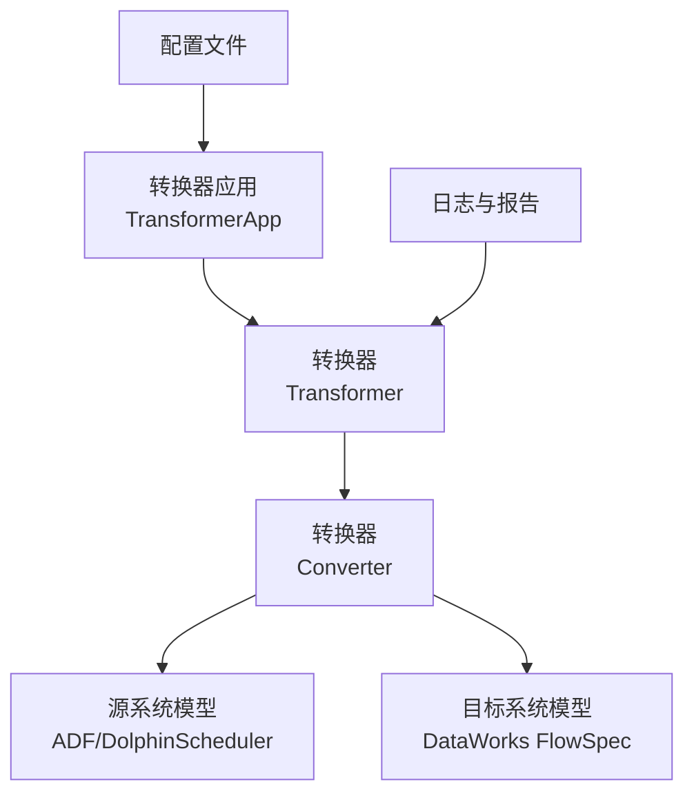
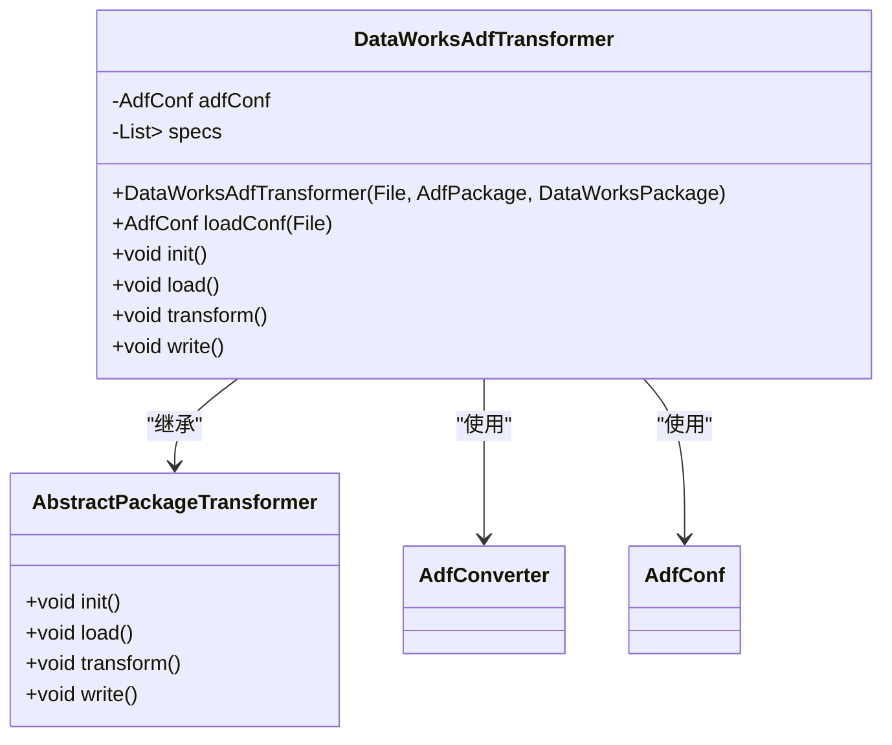
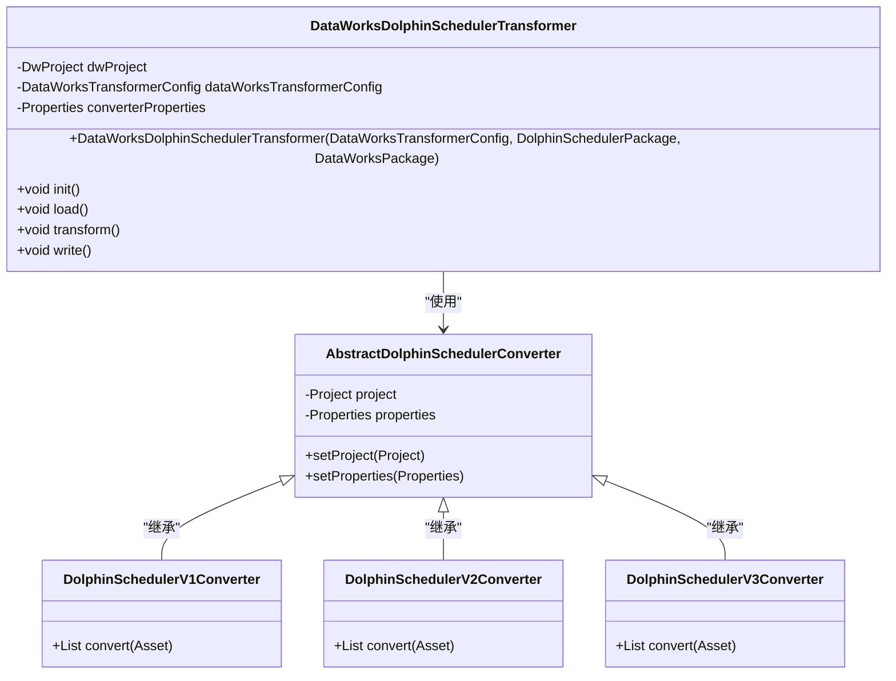
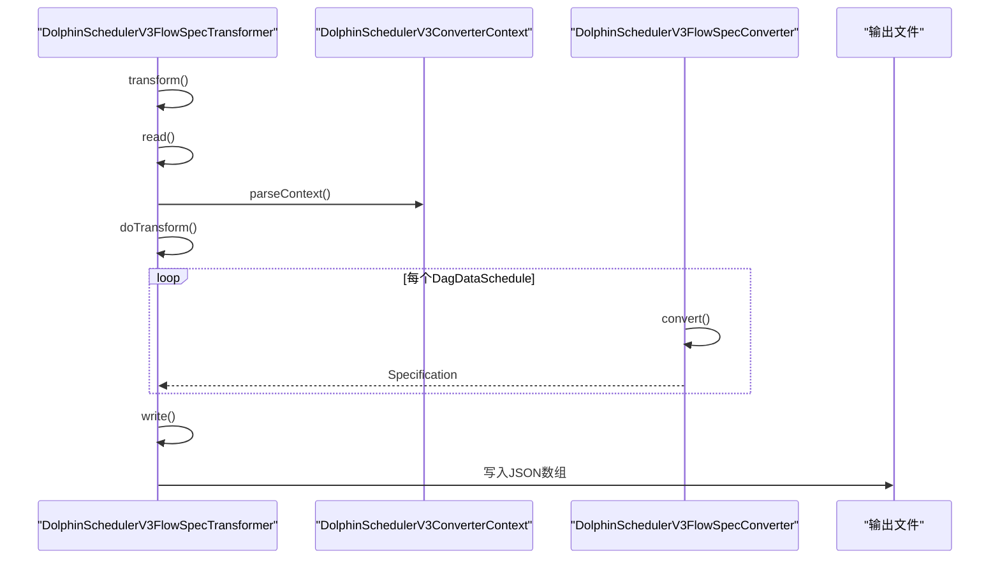
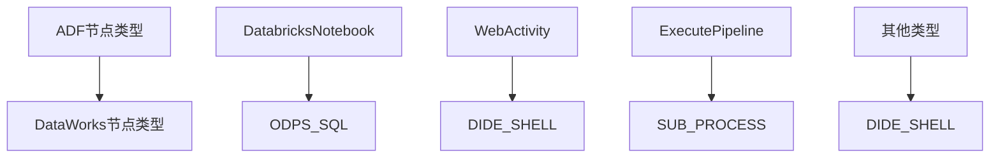
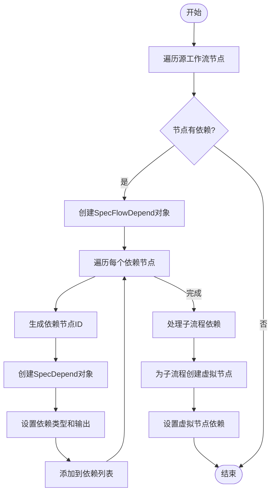
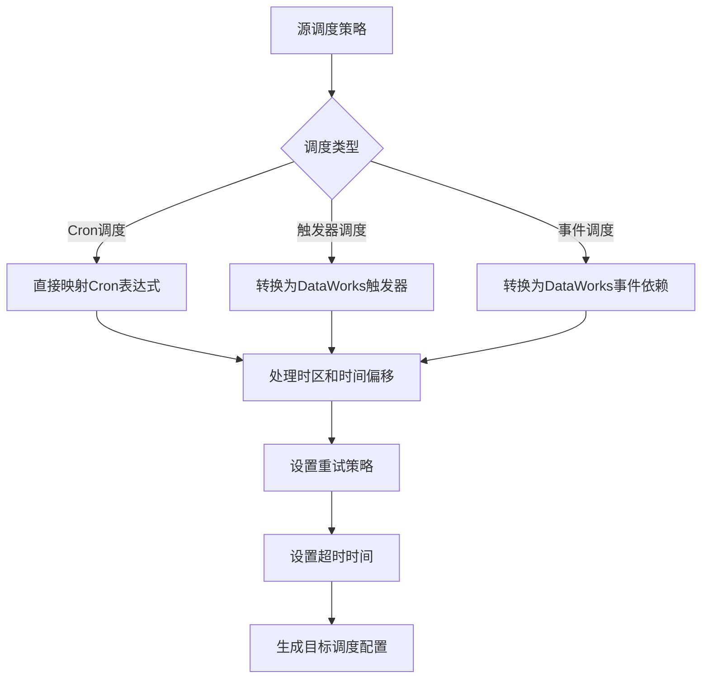
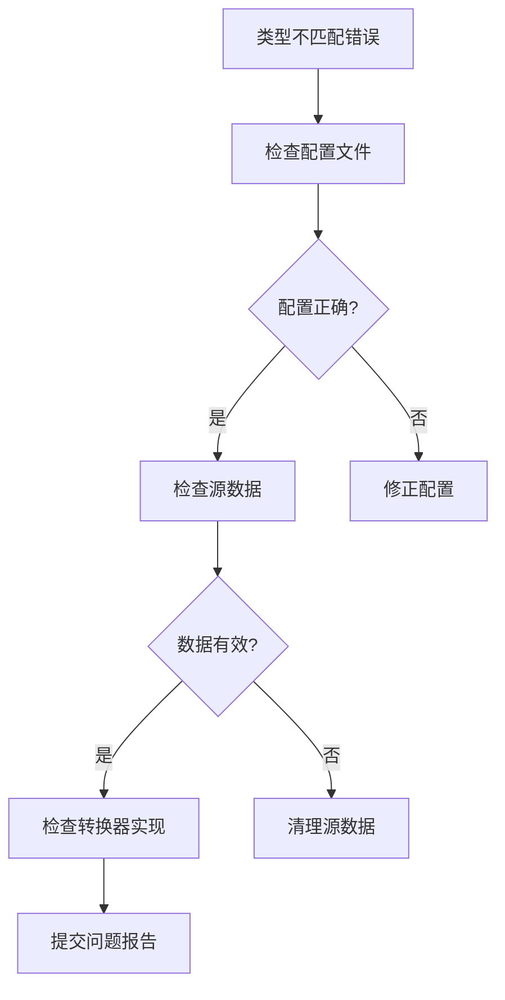
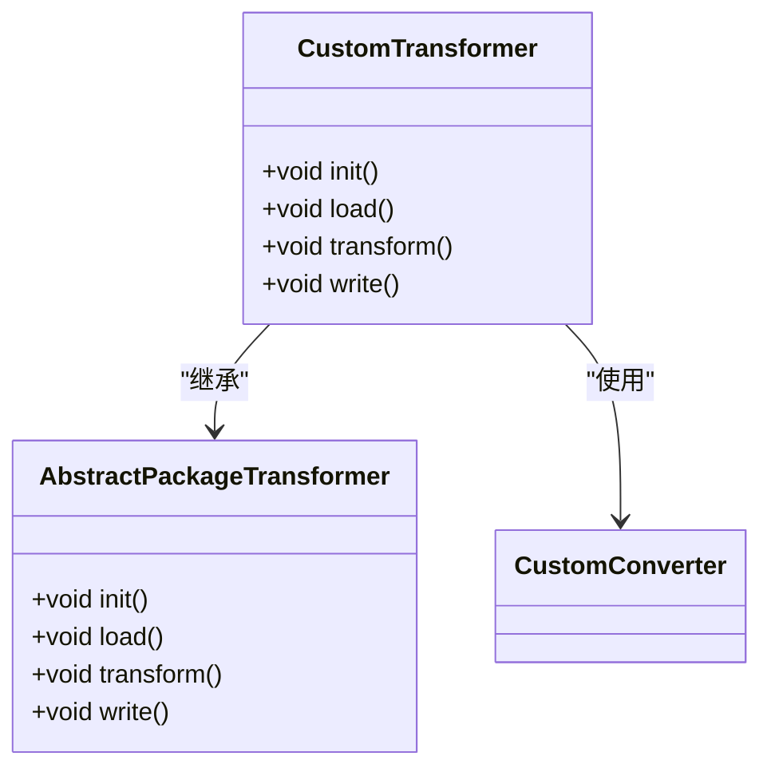

# 转换器实现

<cite>
**本文档引用的文件**  
- [DataWorksAdfTransformer.java](file://client/migrationx/migrationx-transformer/src/main/java/com/aliyun/dataworks/migrationx/transformer/dataworks/transformer/DataWorksAdfTransformer.java)
- [DataWorksDolphinSchedulerTransformer.java](file://client/migrationx/migrationx-transformer/src/main/java/com/aliyun/dataworks/migrationx/transformer/dataworks/transformer/DataWorksDolphinSchedulerTransformer.java)
- [DolphinSchedulerV3FlowSpecTransformer.java](file://client/migrationx/migrationx-transformer/src/main/java/com/aliyun/dataworks/migrationx/transformer/flowspec/transformer/dolphinscheduler/DolphinSchedulerV3FlowSpecTransformer.java)
- [AdfConverter.java](file://client/migrationx/migrationx-transformer/src/main/java/com/aliyun/dataworks/migrationx/transformer/dataworks/converter/adf/AdfConverter.java)
- [AbstractDolphinSchedulerConverter.java](file://client/migrationx/migrationx-transformer/src/main/java/com/aliyun/dataworks/migrationx/transformer/dataworks/converter/dolphinscheduler/AbstractDolphinSchedulerConverter.java)
- [DolphinSchedulerV1Converter.java](file://client/migrationx/migrationx-transformer/src/main/java/com/aliyun/dataworks/migrationx/transformer/dataworks/converter/dolphinscheduler/v1/nodes/DolphinSchedulerV1Converter.java)
- [DolphinSchedulerV2Converter.java](file://client/migrationx/migrationx-transformer/src/main/java/com/aliyun/dataworks/migrationx/transformer/dataworks/converter/dolphinscheduler/v2/nodes/DolphinSchedulerV2Converter.java)
- [DolphinSchedulerV3Converter.java](file://client/migrationx/migrationx-transformer/src/main/java/com/aliyun/dataworks/migrationx/transformer/dataworks/converter/dolphinscheduler/v3/nodes/DolphinSchedulerV3Converter.java)
- [DataWorksTransformerConfig.java](file://client/migrationx/migrationx-transformer/src/main/java/com/aliyun/dataworks/migrationx/transformer/dataworks/transformer/DataWorksTransformerConfig.java)
- [DolphinSchedulerV3FlowSpecTransformerConfig.java](file://client/migrationx/migrationx-transformer/src/main/java/com/aliyun/dataworks/migrationx/transformer/flowspec/transformer/dolphinscheduler/DolphinSchedulerV3FlowSpecTransformerConfig.java)
</cite>

## 目录
1. [简介](#简介)
2. [核心转换器架构](#核心转换器架构)
3. [DataWorksAdfTransformer实现](#dataworksadftransformer实现)
4. [DolphinScheduler转换器实现](#dolphinscheduler转换器实现)
5. [FlowSpecConverter实现](#flowspecconverter实现)
6. [节点类型映射规则](#节点类型映射规则)
7. [依赖关系转换算法](#依赖关系转换算法)
8. [调度策略适配机制](#调度策略适配机制)
9. [配置示例与对比分析](#配置示例与对比分析)
10. [常见问题排查指南](#常见问题排查指南)
11. [自定义扩展机制](#自定义扩展机制)
12. [结论](#结论)

## 简介
本文档详细介绍了DataWorks转换器的实现机制，重点分析了DataWorksAdfTransformer、DolphinSchedulerConverter和FlowSpecConverter等核心转换器的实现逻辑。这些转换器负责将来自不同源系统（如ADF、DolphinScheduler等）的工作流模型转换为DataWorks标准的FlowSpec格式。文档深入探讨了转换过程中的关键技术细节，包括节点类型映射、依赖关系转换、调度策略适配等，并提供了完整的配置示例和问题排查指南。

## 核心转换器架构
DataWorks转换器系统采用分层架构设计，核心组件包括转换器应用（TransformerApp）、转换器（Transformer）和转换器（Converter）。转换器应用负责解析命令行参数和配置文件，初始化转换环境；转换器负责管理转换生命周期（初始化、加载、转换、写入）；转换器则负责具体的模型转换逻辑。



**图示来源**
- [DataWorksAdfTransformer.java](file://client/migrationx/migrationx-transformer/src/main/java/com/aliyun/dataworks/migrationx/transformer/dataworks/transformer/DataWorksAdfTransformer.java)
- [DataWorksDolphinSchedulerTransformer.java](file://client/migrationx/migrationx-transformer/src/main/java/com/aliyun/dataworks/migrationx/transformer/dataworks/transformer/DataWorksDolphinSchedulerTransformer.java)

**本节来源**
- [DataWorksAdfTransformer.java](file://client/migrationx/migrationx-transformer/src/main/java/com/aliyun/dataworks/migrationx/transformer/dataworks/transformer/DataWorksAdfTransformer.java)
- [DataWorksDolphinSchedulerTransformer.java](file://client/migrationx/migrationx-transformer/src/main/java/com/aliyun/dataworks/migrationx/transformer/dataworks/transformer/DataWorksDolphinSchedulerTransformer.java)

## DataWorksAdfTransformer实现
DataWorksAdfTransformer是专门用于将Azure Data Factory（ADF）工作流转换为DataWorks FlowSpec的转换器。它继承自AbstractPackageTransformer，实现了完整的转换生命周期。



**图示来源**
- [DataWorksAdfTransformer.java](file://client/migrationx/migrationx-transformer/src/main/java/com/aliyun/dataworks/migrationx/transformer/dataworks/transformer/DataWorksAdfTransformer.java)

**本节来源**
- [DataWorksAdfTransformer.java](file://client/migrationx/migrationx-transformer/src/main/java/com/aliyun/dataworks/migrationx/transformer/dataworks/transformer/DataWorksAdfTransformer.java)

## DolphinScheduler转换器实现
DolphinScheduler转换器支持将DolphinScheduler不同版本（V1、V2、V3）的工作流转换为DataWorks模型。系统通过版本检测机制自动选择合适的转换器实现。



**图示来源**
- [DataWorksDolphinSchedulerTransformer.java](file://client/migrationx/migrationx-transformer/src/main/java/com/aliyun/dataworks/migrationx/transformer/dataworks/transformer/DataWorksDolphinSchedulerTransformer.java)
- [AbstractDolphinSchedulerConverter.java](file://client/migrationx/migrationx-transformer/src/main/java/com/aliyun/dataworks/migrationx/transformer/dataworks/converter/dolphinscheduler/AbstractDolphinSchedulerConverter.java)

**本节来源**
- [DataWorksDolphinSchedulerTransformer.java](file://client/migrationx/migrationx-transformer/src/main/java/com/aliyun/dataworks/migrationx/transformer/dataworks/transformer/DataWorksDolphinSchedulerTransformer.java)
- [AbstractDolphinSchedulerConverter.java](file://client/migrationx/migrationx-transformer/src/main/java/com/aliyun/dataworks/migrationx/transformer/dataworks/converter/dolphinscheduler/AbstractDolphinSchedulerConverter.java)
- [DolphinSchedulerV1Converter.java](file://client/migrationx/migrationx-transformer/src/main/java/com/aliyun/dataworks/migrationx/transformer/dataworks/converter/dolphinscheduler/v1/nodes/DolphinSchedulerV1Converter.java)
- [DolphinSchedulerV2Converter.java](file://client/migrationx/migrationx-transformer/src/main/java/com/aliyun/dataworks/migrationx/transformer/dataworks/converter/dolphinscheduler/v2/nodes/DolphinSchedulerV2Converter.java)
- [DolphinSchedulerV3Converter.java](file://client/migrationx/migrationx-transformer/src/main/java/com/aliyun/dataworks/migrationx/transformer/dataworks/converter/dolphinscheduler/v3/nodes/DolphinSchedulerV3Converter.java)

## FlowSpecConverter实现
FlowSpecConverter是专门用于将DolphinScheduler V3工作流转换为DataWorks标准FlowSpec的转换器。它采用流式处理方式，能够高效处理大规模工作流数据。



**图示来源**
- [DolphinSchedulerV3FlowSpecTransformer.java](file://client/migrationx/migrationx-transformer/src/main/java/com/aliyun/dataworks/migrationx/transformer/flowspec/transformer/dolphinscheduler/DolphinSchedulerV3FlowSpecTransformer.java)

**本节来源**
- [DolphinSchedulerV3FlowSpecTransformer.java](file://client/migrationx/migrationx-transformer/src/main/java/com/aliyun/dataworks/migrationx/transformer/flowspec/transformer/dolphinscheduler/DolphinSchedulerV3FlowSpecTransformer.java)
- [DolphinSchedulerV3FlowSpecTransformerConfig.java](file://client/migrationx/migrationx-transformer/src/main/java/com/aliyun/dataworks/migrationx/transformer/flowspec/transformer/dolphinscheduler/DolphinSchedulerV3FlowSpecTransformerConfig.java)

## 节点类型映射规则
转换器系统通过预定义的映射规则将源系统的节点类型转换为目标系统的节点类型。对于ADF转换器，主要的节点类型映射规则如下：



对于DolphinScheduler转换器，系统支持通过配置文件自定义节点类型映射规则：

```json
{
  "settings": {
    "converter": {
      "dolphinscheduler_to_dataworks": {
        "node_type_map": {
          "SHELL": "DIDE_SHELL",
          "SQL": "ODPS_SQL",
          "SPARK": "EMR_SPARK",
          "PYTHON": "ODPS_PYTHON"
        }
      }
    }
  }
}
```

**本节来源**
- [AdfConverter.java](file://client/migrationx/migrationx-transformer/src/main/java/com/aliyun/dataworks/migrationx/transformer/dataworks/converter/adf/AdfConverter.java)
- [DolphinSchedulerV1Converter.java](file://client/migrationx/migrationx-transformer/src/main/java/com/aliyun/dataworks/migrationx/transformer/dataworks/converter/dolphinscheduler/v1/nodes/DolphinSchedulerV1Converter.java)

## 依赖关系转换算法
依赖关系转换是工作流迁移的核心环节。系统采用图遍历算法来处理复杂的依赖关系网络。



对于子流程（SubProcess）的依赖处理，系统会自动创建虚拟的开始和结束节点，以确保依赖关系的正确性。算法首先识别子流程节点，然后为子流程工作流创建虚拟的开始节点（作为所有无输入节点的父节点）和结束节点（作为所有无输出节点的子节点），最后将子流程节点的输出依赖于虚拟结束节点。

**本节来源**
- [AdfConverter.java](file://client/migrationx/migrationx-transformer/src/main/java/com/aliyun/dataworks/migrationx/transformer/dataworks/converter/adf/AdfConverter.java)
- [DolphinSchedulerV1Converter.java](file://client/migrationx/migrationx-transformer/src/main/java/com/aliyun/dataworks/migrationx/transformer/dataworks/converter/dolphinscheduler/v1/nodes/DolphinSchedulerV1Converter.java)

## 调度策略适配机制
调度策略的适配是确保工作流在目标系统中正确执行的关键。系统通过配置文件和内置规则来处理不同源系统的调度策略。



对于ADF转换器，调度策略的转换主要通过Cron表达式映射实现。系统会从ADF的触发器配置中提取Cron表达式，并将其直接映射到DataWorks的调度配置中。同时，系统还会处理时区、开始时间、结束时间等调度参数。

**本节来源**
- [AdfConverter.java](file://client/migrationx/migrationx-transformer/src/main/java/com/aliyun/dataworks/migrationx/transformer/dataworks/converter/adf/AdfConverter.java)
- [DataWorksTransformerConfig.java](file://client/migrationx/migrationx-transformer/src/main/java/com/aliyun/dataworks/migrationx/transformer/dataworks/transformer/DataWorksTransformerConfig.java)

## 配置示例与对比分析
以下是一个完整的DolphinScheduler到DataWorks转换的配置示例：

```json
{
  "project": {
    "name": "dataworks_project",
    "description": "Migrated from DolphinScheduler"
  },
  "format": "SPEC",
  "locale": "zh_CN",
  "settings": {
    "converter": {
      "dolphinscheduler_to_dataworks": {
        "node_type_map": {
          "SHELL": "DIDE_SHELL",
          "SQL": "ODPS_SQL",
          "SPARK": "EMR_SPARK"
        },
        "target_engine_type": "ODPS"
      }
    }
  }
}
```

转换前后对比分析：

| 属性 | 源系统 (DolphinScheduler) | 目标系统 (DataWorks) |
|------|------------------------|-------------------|
| 工作流名称 | workflow_v1 | workflow_v1 |
| 节点数量 | 15 | 15 |
| 依赖关系 | 20条 | 20条 |
| 调度周期 | 每天00:00 | 每天00:00 |
| 节点类型 | SHELL, SQL, SPARK | DIDE_SHELL, ODPS_SQL, EMR_SPARK |
| 数据源 | 内置数据源 | DataWorks数据源 |

转换过程保持了工作流的完整性和语义一致性，同时将节点类型适配为目标系统的标准类型。

**本节来源**
- [DataWorksTransformerConfig.java](file://client/migrationx/migrationx-transformer/src/main/java/com/aliyun/dataworks/migrationx/transformer/dataworks/transformer/DataWorksTransformerConfig.java)
- [DolphinSchedulerV3FlowSpecTransformerConfig.java](file://client/migrationx/migrationx-transformer/src/main/java/com/aliyun/dataworks/migrationx/transformer/flowspec/transformer/dolphinscheduler/DolphinSchedulerV3FlowSpecTransformerConfig.java)

## 常见问题排查指南
在转换过程中可能会遇到各种问题，以下是常见问题及其解决方案：

### 字段映射错误
**问题描述**：源系统中的字段无法正确映射到目标系统。
**解决方案**：
1. 检查配置文件中的字段映射规则
2. 确认源系统和目标系统的字段类型兼容性
3. 使用自定义转换器处理特殊字段

### 类型不匹配
**问题描述**：节点类型或数据类型在转换过程中不匹配。
**排查步骤**：
1. 检查`node_type_map`配置是否正确
2. 确认源节点类型是否被支持
3. 查看转换日志中的错误信息



### 转换性能问题
**优化建议**：
1. 增加JVM堆内存
2. 使用流式处理模式
3. 分批处理大型工作流包

**本节来源**
- [AdfConverter.java](file://client/migrationx/migrationx-transformer/src/main/java/com/aliyun/dataworks/migrationx/transformer/dataworks/converter/adf/AdfConverter.java)
- [DolphinSchedulerV1Converter.java](file://client/migrationx/migrationx-transformer/src/main/java/com/aliyun/dataworks/migrationx/transformer/dataworks/converter/dolphinscheduler/v1/nodes/DolphinSchedulerV1Converter.java)

## 自定义扩展机制
系统提供了灵活的扩展机制，允许用户添加对新源系统的支持。

### 扩展步骤
1. 创建新的转换器类，继承AbstractPackageTransformer
2. 实现转换生命周期方法（init, load, transform, write）
3. 注册新的转换器应用



### 配置扩展
通过修改配置文件可以轻松添加新的转换规则：

```json
{
  "settings": {
    "converter": {
      "custom_source_to_dataworks": {
        "node_type_map": {
          "CUSTOM_TYPE_1": "TARGET_TYPE_1",
          "CUSTOM_TYPE_2": "TARGET_TYPE_2"
        },
        "custom_property": "value"
      }
    }
  }
}
```

**本节来源**
- [DataWorksAdfTransformer.java](file://client/migrationx/migrationx-transformer/src/main/java/com/aliyun/dataworks/migrationx/transformer/dataworks/transformer/DataWorksAdfTransformer.java)
- [DataWorksDolphinSchedulerTransformer.java](file://client/migrationx/migrationx-transformer/src/main/java/com/aliyun/dataworks/migrationx/transformer/dataworks/transformer/DataWorksDolphinSchedulerTransformer.java)

## 结论
本文档详细介绍了DataWorks转换器的实现机制，涵盖了DataWorksAdfTransformer、DolphinSchedulerConverter和FlowSpecConverter等核心组件。通过分层架构设计和模块化实现，系统能够高效、准确地将不同源系统的工作流模型转换为DataWorks标准格式。文档深入分析了节点类型映射、依赖关系转换、调度策略适配等关键技术细节，并提供了实用的配置示例和问题排查指南。系统的扩展机制使得添加对新源系统的支持变得简单易行，为数据工作流的迁移和集成提供了强大的技术支持。