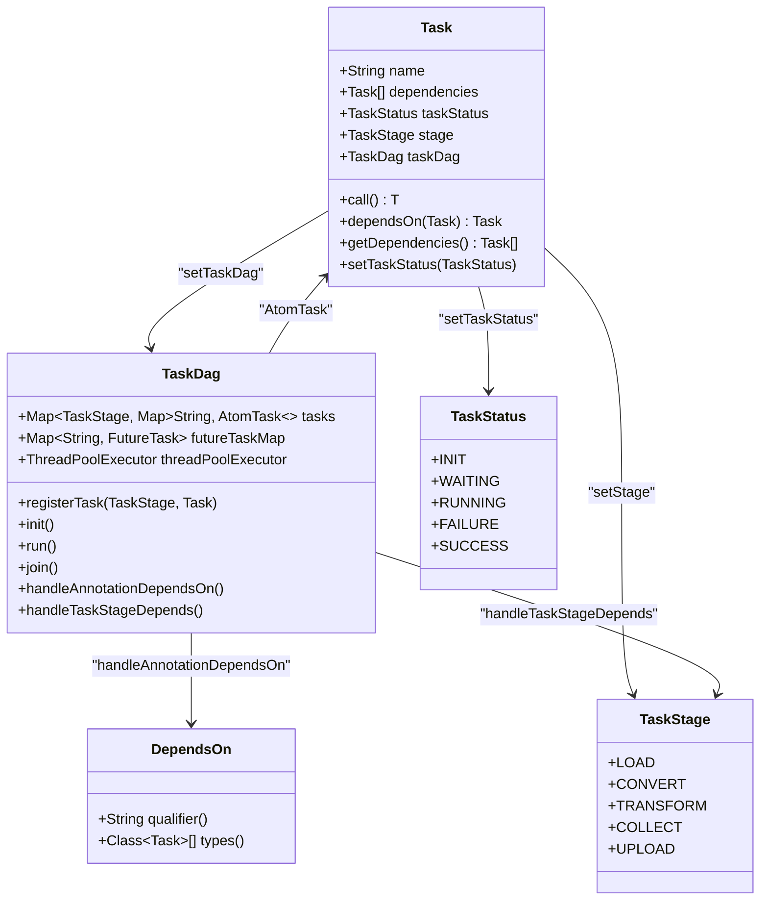
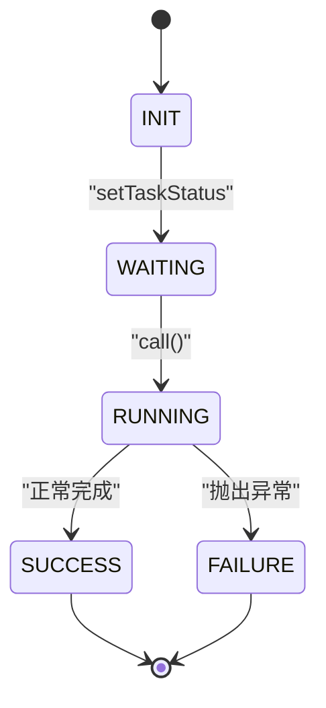
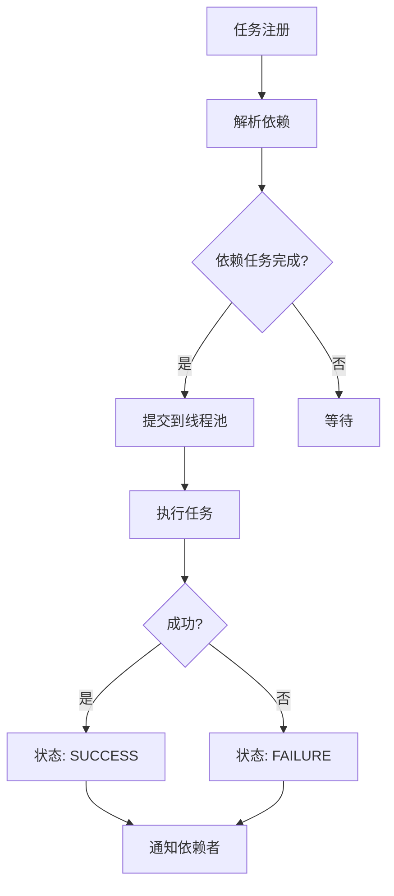
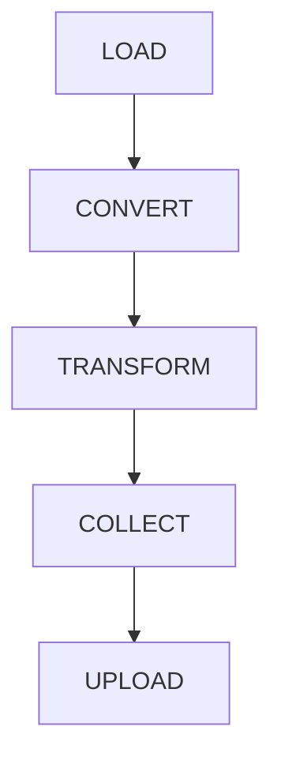
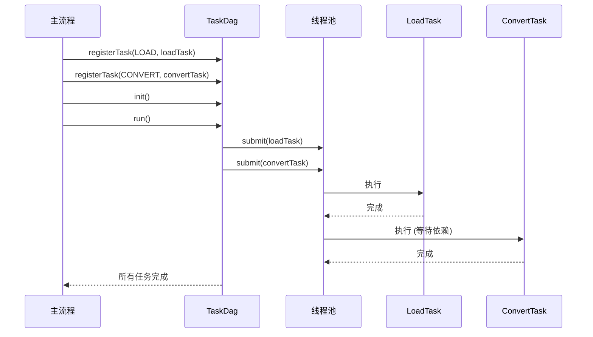

# 任务调度控制器

<cite>
**本文档引用的文件**
- [Task.java](file://client/migrationx/migrationx-transformer/src/main/java/com/aliyun/dataworks/migrationx/transformer/core/controller/Task.java)
- [TaskDag.java](file://client/migrationx/migrationx-transformer/src/main/java/com/aliyun/dataworks/migrationx/transformer/core/controller/TaskDag.java)
- [TaskStatus.java](file://client/migrationx/migrationx-transformer/src/main/java/com/aliyun/dataworks/migrationx/transformer/core/controller/TaskStatus.java)
- [TaskStage.java](file://client/migrationx/migrationx-transformer/src/main/java/com/aliyun/dataworks/migrationx/transformer/core/controller/TaskStage.java)
- [DependsOn.java](file://client/migrationx/migrationx-transformer/src/main/java/com/aliyun/dataworks/migrationx/transformer/core/annotation/DependsOn.java)
- [Priority.java](file://client/migrationx/migrationx-domain/migrationx-domain-dolphinscheduler/src/main/java/com/aliyun/dataworks/migrationx/domain/dataworks/dolphinscheduler/v3/enums/Priority.java)
- [TaskExecutionStatus.java](file://client/migrationx/migrationx-domain/migrationx-domain-dolphinscheduler/src/main/java/com/aliyun/dataworks/migrationx/domain/dataworks/dolphinscheduler/v3/enums/TaskExecutionStatus.java)
</cite>

## 目录
1. [引言](#引言)
2. [核心组件设计](#核心组件设计)
3. [任务接口与状态机管理](#任务接口与状态机管理)
4. [任务有向无环图与依赖解析](#任务有向无环图与依赖解析)
5. [阶段划分机制](#阶段划分机制)
6. [开发实践](#开发实践)
7. [执行流程示例](#执行流程示例)
8. [运行时问题监控与诊断](#运行时问题监控与诊断)
9. [结论](#结论)

## 引言

任务调度控制器是数据迁移与转换系统中的核心组件，负责协调和管理复杂转换流程中各个任务的执行顺序。该控制器通过定义清晰的任务模型、依赖关系和执行策略，确保数据处理流程的正确性、可靠性和高效性。本文档将深入探讨任务调度控制器的设计与实现，重点分析Task接口、TaskDag有向无环图、TaskStage阶段划分等关键机制，并提供开发实践和监控诊断方案。

## 核心组件设计

任务调度控制器的核心设计围绕三个主要组件：`Task`（任务）、`TaskDag`（任务有向无环图）和`TaskStage`（任务阶段）。这些组件共同构成了一个灵活、可扩展的任务调度框架。



**图示来源**
- [Task.java](file://client/migrationx/migrationx-transformer/src/main/java/com/aliyun/dataworks/migrationx/transformer/core/controller/Task.java)
- [TaskDag.java](file://client/migrationx/migrationx-transformer/src/main/java/com/aliyun/dataworks/migrationx/transformer/core/controller/TaskDag.java)
- [TaskStage.java](file://client/migrationx/migrationx-transformer/src/main/java/com/aliyun/dataworks/migrationx/transformer/core/controller/TaskStage.java)
- [TaskStatus.java](file://client/migrationx/migrationx-transformer/src/main/java/com/aliyun/dataworks/migrationx/transformer/core/controller/TaskStatus.java)
- [DependsOn.java](file://client/migrationx/migrationx-transformer/src/main/java/com/aliyun/dataworks/migrationx/transformer/core/annotation/DependsOn.java)

## 任务接口与状态机管理

### Task接口作为最小执行单元

`Task`接口是任务调度系统中的最小执行单元，它是一个抽象类，实现了`Callable`接口，允许任务在独立的线程中执行。每个任务都有一个唯一的名称、依赖的任务列表、当前状态、所属阶段和关联的`TaskDag`。

任务的职责包括：
- **执行逻辑**：通过重写`call()`方法定义具体的业务逻辑。
- **依赖管理**：通过`dependsOn()`方法声明对其他任务的依赖。
- **状态报告**：实现`Reportable`接口，提供执行过程中的报告信息。

### 任务状态机

任务在其生命周期中会经历一系列预定义的状态，这些状态由`TaskStatus`枚举类管理：



**状态说明：**
- **INIT**：任务的初始状态，刚被创建时处于此状态。
- **WAITING**：任务已注册到`TaskDag`，正在等待其依赖任务完成。
- **RUNNING**：任务的`call()`方法正在执行。
- **FAILURE**：任务执行过程中抛出异常，执行失败。
- **SUCCESS**：任务成功完成，结果已设置。

状态转换由`TaskDag`在执行过程中控制。当一个任务开始执行时，其状态从`WAITING`变为`RUNNING`；如果成功完成，则变为`SUCCESS`；如果抛出异常，则变为`FAILURE`。

**本节来源**
- [Task.java](file://client/migrationx/migrationx-transformer/src/main/java/com/aliyun/dataworks/migrationx/transformer/core/controller/Task.java#L39-L46)
- [TaskStatus.java](file://client/migrationx/migrationx-transformer/src/main/java/com/aliyun/dataworks/migrationx/transformer/core/controller/TaskStatus.java)

## 任务有向无环图与依赖解析

### TaskDag与拓扑排序

`TaskDag`（任务有向无环图）是任务调度的核心引擎。它负责管理所有任务的生命周期，解析依赖关系，并按照正确的顺序调度任务执行。

`TaskDag`内部使用拓扑排序算法来确定任务的执行顺序。拓扑排序确保在执行任何任务之前，其所有依赖任务都已完成。`TaskDag`通过以下机制实现依赖解析：

1.  **显式依赖**：通过`Task`的`dependsOn()`方法或`@DependsOn`注解声明。
2.  **隐式依赖**：通过`TaskStage`之间的层级依赖自动建立。

### 循环依赖检测

由于`TaskDag`基于有向无环图（DAG）模型，循环依赖是被严格禁止的。系统通过以下方式防止循环依赖：
- **静态检查**：在`TaskDag`的`init()`阶段，通过`handleAnnotationDependsOn()`方法解析`@DependsOn`注解时，会检查依赖关系的合法性。
- **运行时检查**：在`AtomTask`的`call()`方法中，任务会等待其所有依赖任务完成。如果存在循环依赖，将导致死锁或无限等待，最终超时。

### 并行度控制

`TaskDag`使用`ThreadPoolExecutor`来控制任务的并行执行。其配置如下：
- **核心线程数**：50
- **最大线程数**：100
- **工作队列**：容量为100的`ArrayBlockingQueue`
- **线程工厂**：使用`ThreadFactoryBuilder`创建命名线程

这种配置允许系统在资源允许的情况下并行执行多个独立的任务，从而提高整体吞吐量。

### 任务优先级排序

虽然`TaskDag`本身不直接实现复杂的优先级调度算法，但它支持通过`TaskStage`和外部优先级机制来影响执行顺序。例如，`DolphinScheduler`等下游系统定义了`Priority`枚举（HIGHEST, HIGH, MEDIUM, LOW, LOWEST），在任务转换过程中可以将这些优先级信息传递给`TaskDag`，从而影响任务的调度策略。



**本节来源**
- [TaskDag.java](file://client/migrationx/migrationx-transformer/src/main/java/com/aliyun/dataworks/migrationx/transformer/core/controller/TaskDag.java)
- [Priority.java](file://client/migrationx/migrationx-domain/migrationx-domain-dolphinscheduler/src/main/java/com/aliyun/dataworks/migrationx/domain/dataworks/dolphinscheduler/v3/enums/Priority.java)

## 阶段划分机制

`TaskStage`枚举定义了任务执行的五个逻辑阶段，为复杂转换流程提供了清晰的组织结构：



### 阶段说明

- **LOAD**：加载阶段，负责从源系统加载数据和配置信息。
- **CONVERT**：转换阶段，将加载的数据转换为中间表示或目标格式。
- **TRANSFORM**：变换阶段，执行数据的清洗、聚合、计算等复杂逻辑。
- **COLLECT**：收集阶段，汇总和整理前几个阶段的处理结果。
- **UPLOAD**：上传阶段，将最终结果写入目标系统。

### 阶段间依赖

`TaskDag`通过`handleTaskStageDepends()`方法自动为不同阶段的任务建立依赖关系。具体规则是：后一个阶段的所有任务都依赖于前一个阶段的所有任务。例如，所有`CONVERT`阶段的任务都必须等待所有`LOAD`阶段的任务完成后才能开始执行。这确保了流程的逻辑正确性。

**本节来源**
- [TaskStage.java](file://client/migrationx/migrationx-transformer/src/main/java/com/aliyun/dataworks/migrationx/transformer/core/controller/TaskStage.java)
- [TaskDag.java](file://client/migrationx/migrationx-transformer/src/main/java/com/aliyun/dataworks/migrationx/transformer/core/controller/TaskDag.java#L292-L313)

## 开发实践

### 任务定义

开发者通过继承`Task`抽象类来定义具体任务。一个典型任务的定义如下：

```java
public class MyDataTask extends Task<String> {
    @Override
    public String call() throws Exception {
        // 执行具体的业务逻辑
        String result = "Processed data";
        return result;
    }
}
```

### 依赖注解@DependsOn使用

`@DependsOn`注解提供了一种声明式的方式来定义任务依赖，简化了代码。它有两个主要属性：
- **qualifier**：通过任务名称来指定依赖。
- **types**：通过任务类型来指定依赖。

```java
public class DataProcessorTask extends Task<Void> {
    @DependsOn(qualifier = "dataLoaderTask")
    private DataLoaderTask dataLoader;

    @DependsOn(types = {ValidationTask.class})
    private List<ValidationTask> validationTasks;

    @Override
    public Void call() throws Exception {
        // 依赖的dataLoader和validationTasks会自动注入
        // 执行处理逻辑
        return null;
    }
}
```

### 执行监听器注册

虽然代码库中未直接提供执行监听器的接口，但`Task`实现了`Reportable`接口，允许通过`getReport()`方法收集执行过程中的报告信息。开发者可以在`call()`方法中添加自定义的报告项，用于监控和诊断。

**本节来源**
- [Task.java](file://client/migrationx/migrationx-transformer/src/main/java/com/aliyun/dataworks/migrationx/transformer/core/controller/Task.java)
- [DependsOn.java](file://client/migrationx/migrationx-transformer/src/main/java/com/aliyun/dataworks/migrationx/transformer/core/annotation/DependsOn.java)

## 执行流程示例

以下是一个典型的转换流程示例，展示了控制器如何协调多个任务的执行：

1.  **初始化**：创建`TaskDag`实例，并注册各个阶段的任务。
2.  **依赖解析**：调用`TaskDag.init()`，解析`@DependsOn`注解并建立`TaskStage`间的隐式依赖。
3.  **调度执行**：调用`TaskDag.run()`，`TaskDag`将所有任务提交到线程池。
4.  **并行执行**：`LOAD`阶段的多个数据加载任务并行执行。
5.  **串行执行**：`CONVERT`阶段的任务等待所有`LOAD`任务完成后，再开始执行。
6.  **结果获取**：主流程调用`TaskDag.join()`等待所有任务完成，并通过`getTaskResult()`获取最终结果。



**本节来源**
- [TaskDag.java](file://client/migrationx/migrationx-transformer/src/main/java/com/aliyun/dataworks/migrationx/transformer/core/controller/TaskDag.java#L277-L285)

## 运行时问题监控与诊断

### 任务超时

系统通过`TaskTimeoutParameter`类来管理任务超时。虽然`TaskDag`本身没有内置超时机制，但可以通过以下方式实现：
- **线程池超时**：配置`ThreadPoolExecutor`的超时参数。
- **外部监控**：利用`TaskExecutionStatus`中的`isRunning()`等方法，结合外部监控服务来检测长时间运行的任务。

### 死锁与资源竞争

- **死锁**：主要由循环依赖引起。通过严格的依赖管理和`TaskDag`的拓扑排序，可以有效避免。
- **资源竞争**：由于任务在独立线程中执行，对共享资源的访问需要开发者自行加锁（如`synchronized`或`ReentrantLock`）。

### 监控与诊断方案

1.  **状态监控**：定期调用`Task.getTaskStatus()`获取任务状态，结合`TaskExecutionStatus`的`isFinished()`等方法判断任务是否卡住。
2.  **日志记录**：`TaskDag`使用`SLF4J`进行日志记录，在`run`、`join`等关键方法中输出执行信息。
3.  **报告系统**：任务失败时，异常信息会被捕获并添加到`ReportItem`中，便于事后分析。
4.  **性能分析**：通过`print()`方法可以输出整个`TaskDag`的依赖关系图，帮助分析执行瓶颈。

**本节来源**
- [TaskDag.java](file://client/migrationx/migrationx-transformer/src/main/java/com/aliyun/dataworks/migrationx/transformer/core/controller/TaskDag.java#L332-L347)
- [TaskExecutionStatus.java](file://client/migrationx/migrationx-domain/migrationx-domain-dolphinscheduler/src/main/java/com/aliyun/dataworks/migrationx/domain/dataworks/dolphinscheduler/v3/enums/TaskExecutionStatus.java)
- [TaskTimeoutParameter.java](file://client/migrationx/migrationx-domain/migrationx-domain-dolphinscheduler/src/main/java/com/aliyun/dataworks/migrationx/domain/dataworks/dolphinscheduler/v3/task/TaskTimeoutParameter.java)

## 结论

任务调度控制器通过`Task`、`TaskDag`和`TaskStage`等核心组件，构建了一个强大而灵活的任务调度框架。它利用有向无环图和拓扑排序确保了任务执行的正确性和顺序性，通过阶段划分机制组织了复杂的转换流程，并提供了`@DependsOn`等便捷的开发实践。该设计不仅满足了基本的调度需求，还具备良好的可扩展性和可维护性，为数据迁移与转换系统的稳定运行提供了坚实的基础。