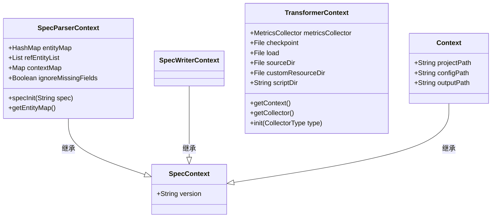
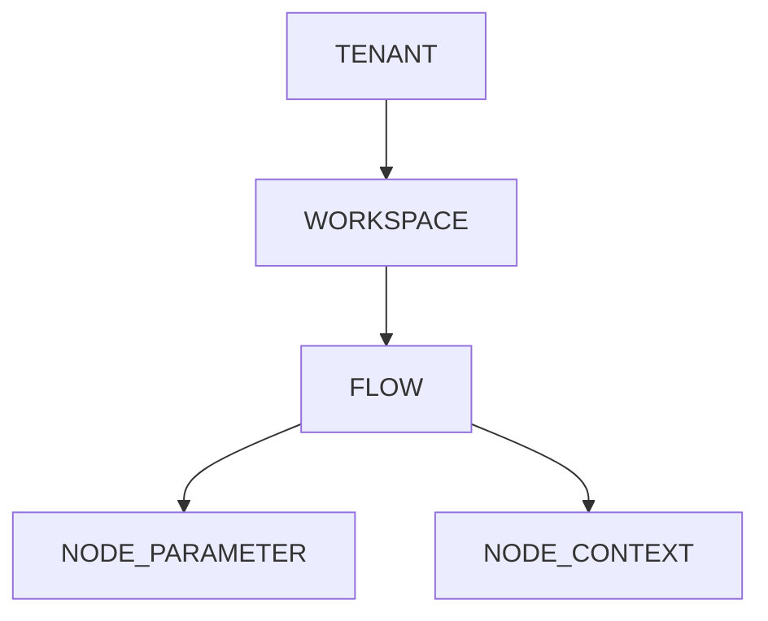
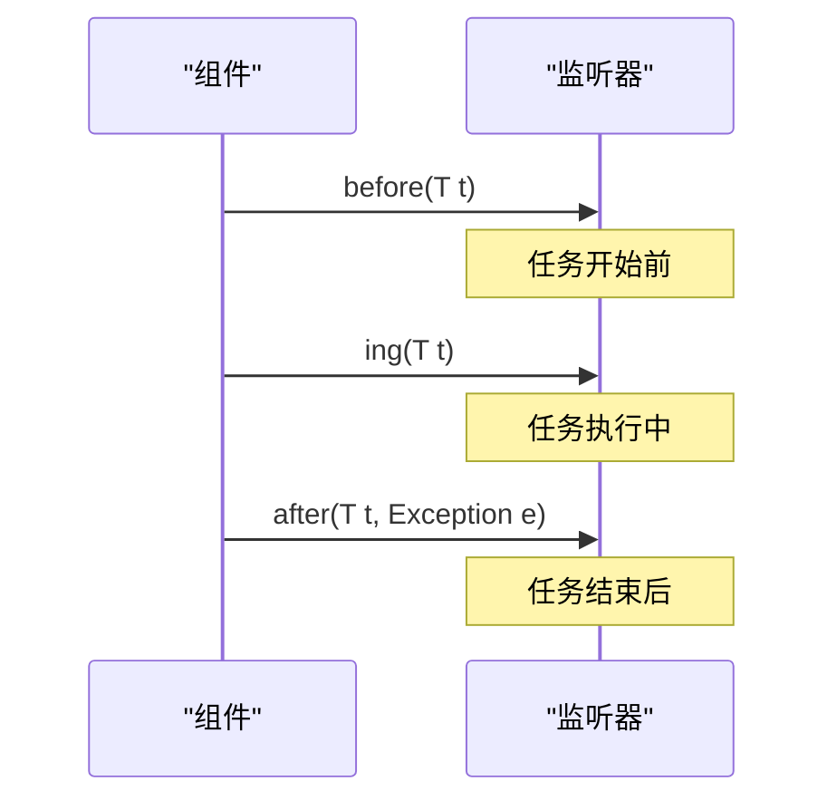
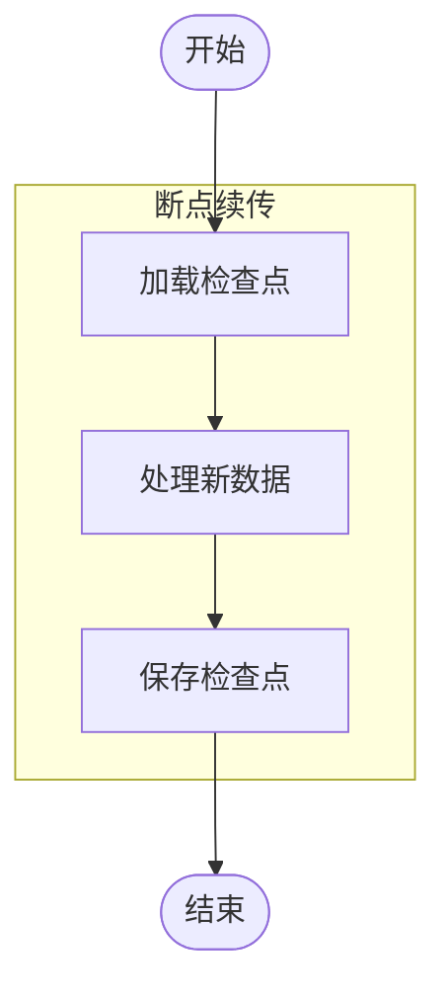

# 转换上下文管理

<cite>
**本文档引用文件**   
- [SpecContext.java](file://spec/src/main/java/com/aliyun/dataworks/common/spec/domain/SpecContext.java)
- [SpecParserContext.java](file://spec/src/main/java/com/aliyun/dataworks/common/spec/parser/SpecParserContext.java)
- [SpecWriterContext.java](file://spec/src/main/java/com/aliyun/dataworks/common/spec/writer/SpecWriterContext.java)
- [TransformerContext.java](file://client/migrationx/migrationx-common/src/main/java/com/aliyun/migrationx/common/context/TransformerContext.java)
- [Context.java](file://client/migrationx/migrationx-transformer/src/main/java/com/aliyun/dataworks/migrationx/transformer/core/common/Context.java)
- [StateCallbackListener.java](file://client/migrationx/migrationx-transformer/src/main/java/com/aliyun/dataworks/migrationx/transformer/core/common/StateCallbackListener.java)
- [CheckPoint.java](file://client/migrationx/migrationx-transformer/src/main/java/com/aliyun/dataworks/migrationx/transformer/core/checkpoint/CheckPoint.java)
- [LocalFileCheckPoint.java](file://client/migrationx/migrationx-transformer/src/main/java/com/aliyun/dataworks/migrationx/transformer/core/checkpoint/file/LocalFileCheckPoint.java)
- [VariableScopeType.java](file://spec/src/main/java/com/aliyun/dataworks/common/spec/domain/enums/VariableScopeType.java)
- [DataWorksNodeInputOutputAdapter.java](file://spec/src/main/java/com/aliyun/dataworks/common/spec/domain/dw/nodemodel/DataWorksNodeInputOutputAdapter.java)
</cite>

## 目录
1. [引言](#引言)
2. [上下文对象设计原理](#上下文对象设计原理)
3. [上下文作用域与数据隔离](#上下文作用域与数据隔离)
4. [状态回调机制](#状态回调机制)
5. [检查点机制](#检查点机制)
6. [API使用示例](#api使用示例)
7. [潜在问题与优化建议](#潜在问题与优化建议)
8. [结论](#结论)

## 引言
在数据迁移和转换过程中，上下文管理是确保数据一致性、状态跟踪和任务协调的核心机制。本文档深入探讨了上下文对象在转换过程中的核心作用，详细说明了上下文作用域的划分机制、状态回调的事件通知模式、检查点的断点续传功能，以及相关的API使用方法和优化建议。

## 上下文对象设计原理

上下文对象作为数据传递的枢纽，在整个转换过程中扮演着至关重要的角色。它不仅承载了转换任务所需的各种配置和状态信息，还提供了统一的数据访问接口，确保了数据在不同组件之间的无缝传递。

### 核心上下文类

系统中存在多个上下文类，它们在不同的层次和场景中发挥作用：

- **SpecContext**: 基础上下文类，定义了版本信息等通用属性。
- **SpecParserContext**: 解析器上下文，用于JSON到对象的转换过程。
- **SpecWriterContext**: 写入器上下文，用于对象到JSON的转换过程。
- **TransformerContext**: 转换器上下文，管理全局的转换状态和资源。
- **Context**: 任务上下文，用于具体的转换任务。



**图源**
- [SpecContext.java](file://spec/src/main/java/com/aliyun/dataworks/common/spec/domain/SpecContext.java)
- [SpecParserContext.java](file://spec/src/main/java/com/aliyun/dataworks/common/spec/parser/SpecParserContext.java)
- [SpecWriterContext.java](file://spec/src/main/java/com/aliyun/dataworks/common/spec/writer/SpecWriterContext.java)
- [TransformerContext.java](file://client/migrationx/migrationx-common/src/main/java/com/aliyun/migrationx/common/context/TransformerContext.java)
- [Context.java](file://client/migrationx/migrationx-transformer/src/main/java/com/aliyun/dataworks/migrationx/transformer/core/common/Context.java)

**节源**
- [SpecContext.java](file://spec/src/main/java/com/aliyun/dataworks/common/spec/domain/SpecContext.java)
- [SpecParserContext.java](file://spec/src/main/java/com/aliyun/dataworks/common/spec/parser/SpecParserContext.java)
- [SpecWriterContext.java](file://spec/src/main/java/com/aliyun/dataworks/common/spec/writer/SpecWriterContext.java)
- [TransformerContext.java](file://client/migrationx/migrationx-common/src/main/java/com/aliyun/migrationx/common/context/TransformerContext.java)
- [Context.java](file://client/migrationx/migrationx-transformer/src/main/java/com/aliyun/dataworks/migrationx/transformer/core/common/Context.java)

## 上下文作用域与数据隔离

为了确保数据的安全性和一致性，系统采用了多层次的上下文作用域划分机制，实现了有效的数据隔离。

### 作用域类型

根据 `VariableScopeType` 枚举的定义，系统支持以下几种作用域：

- **TENANT**: 租户级作用域，适用于整个租户范围内的共享数据。
- **WORKSPACE**: 工作空间级作用域，适用于特定工作空间内的数据共享。
- **FLOW**: 工作流级作用域，适用于单个工作流内的数据传递。
- **NODE_PARAMETER**: 节点参数级作用域，用于节点的输入参数。
- **NODE_CONTEXT**: 节点上下文级作用域，用于节点执行过程中的临时数据。



**图源**
- [VariableScopeType.java](file://spec/src/main/java/com/aliyun/dataworks/common/spec/domain/enums/VariableScopeType.java)

**节源**
- [VariableScopeType.java](file://spec/src/main/java/com/aliyun/dataworks/common/spec/domain/enums/VariableScopeType.java)

### 数据隔离策略

系统通过以下策略实现数据隔离：

1. **作用域继承**: 下层作用域可以访问上层作用域的数据，但不能修改。
2. **命名空间隔离**: 不同作用域使用不同的命名空间，避免名称冲突。
3. **访问控制**: 通过权限控制机制，限制对敏感数据的访问。

## 状态回调机制

状态回调机制是系统实现事件驱动架构的关键，它允许组件在特定事件发生时进行相应的处理。

### StateCallbackListener接口

`StateCallbackListener` 接口定义了状态回调的核心方法：

```java
public interface StateCallbackListener<T> {
    boolean interestIn(Object object);
    void before(T t);
    void before(T t, Map<String, String> context);
    void ing(T t);
    void ing(T t, Map<String, String> context);
    void after(T t, Exception e);
    void after(T t, Exception e, Map<String, String> context);
}
```

### 事件通知模式

系统支持以下关键事件的监听与处理：

- **任务开始**: `before` 方法在任务开始前被调用。
- **任务进行中**: `ing` 方法在任务执行过程中被调用。
- **任务结束**: `after` 方法在任务结束后被调用，无论成功或失败。



**图源**
- [StateCallbackListener.java](file://client/migrationx/migrationx-transformer/src/main/java/com/aliyun/dataworks/migrationx/transformer/core/common/StateCallbackListener.java)

**节源**
- [StateCallbackListener.java](file://client/migrationx/migrationx-transformer/src/main/java/com/aliyun/dataworks/migrationx/transformer/core/common/StateCallbackListener.java)

## 检查点机制

检查点机制是实现转换过程断点续传和状态恢复的核心功能，它通过定期保存系统状态来确保数据的可靠性和一致性。

### CheckPoint接口

`CheckPoint` 接口定义了检查点的核心操作：

```java
public interface CheckPoint<WRITER extends StoreWriter, SPEC> {
    ThreadLocal<CheckPoint> INSTANCE = ThreadLocal.withInitial(() -> new LocalFileCheckPoint());
    
    List<SPEC> doWithCheckpoint(Function<WRITER, List<SPEC>> func, String projectName);
    
    void doCheckpoint(WRITER writer, List<SPEC> workflows, String processName, String taskName);
    
    Map<String, List<SPEC>> loadFromCheckPoint(String projectName, String processName);
    
    static CheckPoint getInstance() {
        return INSTANCE.get();
    }
}
```

### 断点续传实现

系统通过以下步骤实现断点续传：

1. **加载检查点**: 在转换开始时，从检查点文件加载已处理的数据。
2. **处理新数据**: 只处理未在检查点中出现的新数据。
3. **保存检查点**: 定期将处理结果保存到检查点文件。



**图源**
- [CheckPoint.java](file://client/migrationx/migrationx-transformer/src/main/java/com/aliyun/dataworks/migrationx/transformer/core/checkpoint/CheckPoint.java)
- [LocalFileCheckPoint.java](file://client/migrationx/migrationx-transformer/src/main/java/com/aliyun/dataworks/migrationx/transformer/core/checkpoint/file/LocalFileCheckPoint.java)

**节源**
- [CheckPoint.java](file://client/migrationx/migrationx-transformer/src/main/java/com/aliyun/dataworks/migrationx/transformer/core/checkpoint/CheckPoint.java)
- [LocalFileCheckPoint.java](file://client/migrationx/migrationx-transformer/src/main/java/com/aliyun/dataworks/migrationx/transformer/core/checkpoint/file/LocalFileCheckPoint.java)

## API使用示例

本节提供上下文数据存取、事件监听器注册、检查点管理等API的使用示例。

### 上下文数据存取

```java
// 获取转换器上下文
TransformerContext context = TransformerContext.getContext();

// 设置检查点目录
context.setCheckpoint("/path/to/checkpoint");

// 获取度量收集器
MetricsCollector collector = TransformerContext.getCollector();
```

### 事件监听器注册

```java
// 创建自定义监听器
class MyStateCallbackListener implements StateCallbackListener<MyTask> {
    @Override
    public boolean interestIn(Object object) {
        return object instanceof MyTask;
    }
    
    @Override
    public void before(MyTask t) {
        System.out.println("任务开始: " + t.getName());
    }
    
    @Override
    public void ing(MyTask t) {
        System.out.println("任务进行中: " + t.getName());
    }
    
    @Override
    public void after(MyTask t, Exception e) {
        if (e == null) {
            System.out.println("任务成功完成: " + t.getName());
        } else {
            System.out.println("任务失败: " + t.getName() + ", 错误: " + e.getMessage());
        }
    }
}

// 注册监听器（具体注册方式取决于具体实现）
```

### 检查点管理

```java
// 获取检查点实例
CheckPoint checkPoint = CheckPoint.getInstance();

// 加载检查点数据
Map<String, List<SpecNode>> loadedTasks = checkPoint.loadFromCheckPoint("projectName", "processName");

// 执行带检查点的操作
List<SpecNode> result = checkPoint.doWithCheckpoint(writer -> {
    // 处理逻辑
    return processedNodes;
}, "projectName");

// 手动创建检查点
checkPoint.doCheckpoint(writer, workflows, "processName", "taskName");
```

**节源**
- [TransformerContext.java](file://client/migrationx/migrationx-common/src/main/java/com/aliyun/migrationx/common/context/TransformerContext.java)
- [StateCallbackListener.java](file://client/migrationx/migrationx-transformer/src/main/java/com/aliyun/dataworks/migrationx/transformer/core/common/StateCallbackListener.java)
- [CheckPoint.java](file://client/migrationx/migrationx-transformer/src/main/java/com/aliyun/dataworks/migrationx/transformer/core/checkpoint/CheckPoint.java)

## 潜在问题与优化建议

尽管上下文管理机制功能强大，但在实际使用中仍可能遇到一些潜在问题。本节提供相应的优化建议和监控指标。

### 上下文数据膨胀

**问题**: 随着转换任务的进行，上下文中的数据可能不断累积，导致内存占用过高。

**优化建议**:
- 定期清理不再需要的上下文数据。
- 使用弱引用或软引用来管理大型对象。
- 实现数据分页或流式处理。

### 内存泄漏

**问题**: 上下文对象可能因为引用未被正确释放而导致内存泄漏。

**优化建议**:
- 使用ThreadLocal时，确保在适当的时候调用`remove()`方法。
- 实现资源清理的钩子方法，在任务结束时自动清理资源。
- 使用内存分析工具定期检查内存使用情况。

### 序列化兼容性

**问题**: 不同版本的系统之间可能存在序列化兼容性问题。

**优化建议**:
- 在`SpecContext`中维护版本信息，确保版本兼容性。
- 使用向后兼容的序列化策略。
- 提供版本转换工具，支持不同版本之间的数据迁移。

### 监控指标

建议监控以下关键指标：

- **上下文大小**: 监控上下文对象的内存占用。
- **检查点频率**: 监控检查点的创建频率和大小。
- **事件处理时间**: 监控状态回调的处理时间。
- **内存使用率**: 监控JVM的内存使用情况。

**节源**
- [SpecContext.java](file://spec/src/main/java/com/aliyun/dataworks/common/spec/domain/SpecContext.java)
- [TransformerContext.java](file://client/migrationx/migrationx-common/src/main/java/com/aliyun/migrationx/common/context/TransformerContext.java)

## 结论

上下文管理是数据转换系统的核心组成部分，它通过统一的数据传递机制、清晰的作用域划分、灵活的状态回调和可靠的检查点功能，确保了转换过程的稳定性、可靠性和可维护性。通过合理使用和优化上下文管理机制，可以有效提升系统的性能和用户体验。