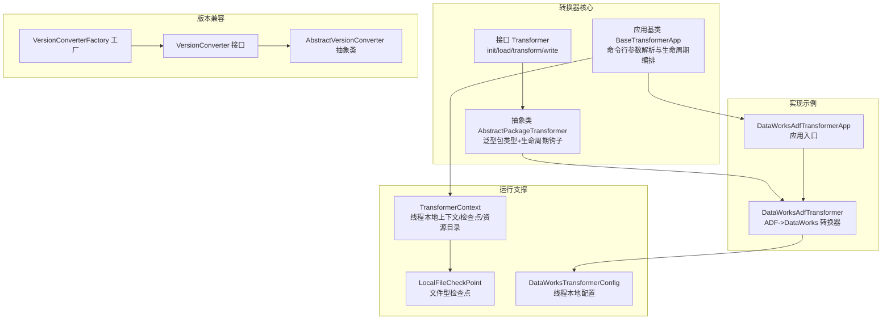
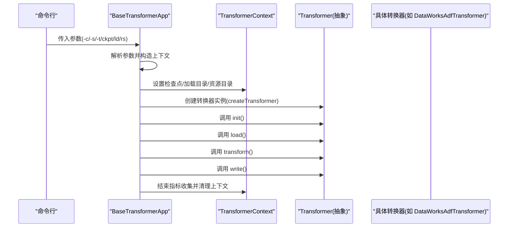
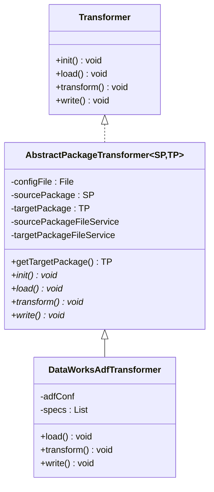
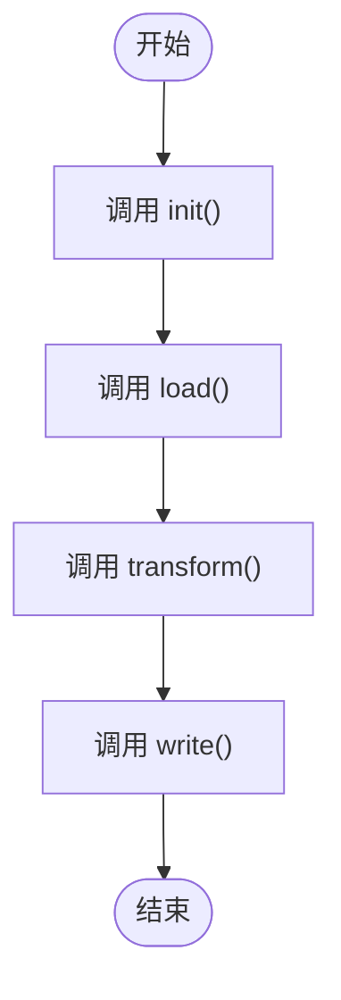
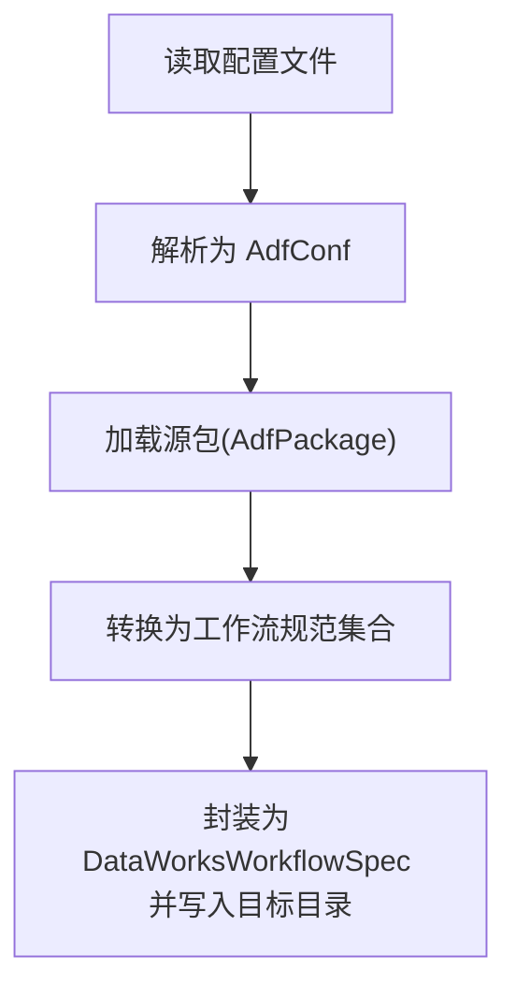
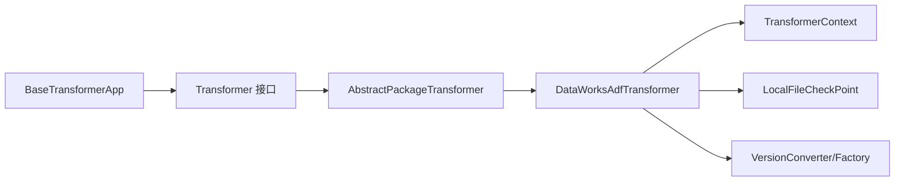

# 转换器接口定义

<cite>
**本文引用的文件列表**
- [Transformer.java](file://client/migrationx/migrationx-transformer/src/main/java/com/aliyun/dataworks/migrationx/transformer/core/transformer/Transformer.java)
- [AbstractPackageTransformer.java](file://client/migrationx/migrationx-transformer/src/main/java/com/aliyun/dataworks/migrationx/transformer/core/transformer/AbstractPackageTransformer.java)
- [BaseTransformerApp.java](file://client/migrationx/migrationx-transformer/src/main/java/com/aliyun/dataworks/migrationx/transformer/core/BaseTransformerApp.java)
- [DataWorksAdfTransformer.java](file://client/migrationx/migrationx-transformer/src/main/java/com/aliyun/dataworks/migrationx/transformer/dataworks/transformer/DataWorksAdfTransformer.java)
- [DataWorksAdfTransformerApp.java](file://client/migrationx/migrationx-transformer/src/main/java/com/aliyun/dataworks/migrationx/transformer/dataworks/apps/DataWorksAdfTransformerApp.java)
- [TransformerContext.java](file://client/migrationx/migrationx-common/src/main/java/com/aliyun/migrationx/common/context/TransformerContext.java)
- [LocalFileCheckPoint.java](file://client/migrationx/migrationx-transformer/src/main/java/com/aliyun/dataworks/migrationx/transformer/core/checkpoint/file/LocalFileCheckPoint.java)
- [DataWorksTransformerConfig.java](file://client/migrationx/migrationx-transformer/src/main/java/com/aliyun/dataworks/migrationx/transformer/dataworks/transformer/DataWorksTransformerConfig.java)
- [VersionConverter.java](file://spec/src/main/java/com/aliyun/dataworks/common/spec/version/VersionConverter.java)
- [AbstractVersionConverter.java](file://spec/src/main/java/com/aliyun/dataworks/common/spec/version/AbstractVersionConverter.java)
- [VersionConverterFactory.java](file://spec/src/main/java/com/aliyun/dataworks/common/spec/version/VersionConverterFactory.java)
</cite>

## 目录
1. [简介](#简介)
2. [项目结构](#项目结构)
3. [核心组件](#核心组件)
4. [架构总览](#架构总览)
5. [组件详解](#组件详解)
6. [依赖关系分析](#依赖关系分析)
7. [性能与可靠性](#性能与可靠性)
8. [故障排查指南](#故障排查指南)
9. [结论](#结论)
10. [附录：实现自定义转换器步骤](#附录实现自定义转换器步骤)

## 简介
本文件系统化梳理了迁移工具中“转换器”接口的设计原理与契约规范，重点阐释其作为转换扩展点的核心作用，并深入解析 AbstractPackageTransformer 抽象类所采用的模板方法模式，说明 init、load、transform、write 四个生命周期钩子的调用时序与扩展机制。同时，文档覆盖转换配置加载、输入输出校验、异常处理、线程安全、资源管理、版本兼容性等共性逻辑的封装策略，并给出实现自定义转换器的实操步骤，最后以 DataWorksAdfTransformer 为例展示接口的实际应用模式与最佳实践。

## 项目结构
围绕转换器接口与其实现的相关模块主要分布在以下路径：
- 接口与抽象基类：client/migrationx/migrationx-transformer/src/main/java/com/aliyun/dataworks/migrationx/transformer/core/transformer
- 应用入口与运行框架：client/migrationx/migrationx-transformer/src/main/java/com/aliyun/dataworks/migrationx/transformer/core
- 具体转换器实现：client/migrationx/migrationx-transformer/src/main/java/com/aliyun/dataworks/migrationx/transformer/dataworks/transformer
- 上下文与指标采集：client/migrationx/migrationx-common/src/main/java/com/aliyun/migrationx/common/context
- 检查点与断点续跑：client/migrationx/migrationx-transformer/src/main/java/com/aliyun/dataworks/migrationx/transformer/core/checkpoint/file
- 版本转换（SPEC）：spec/src/main/java/com/aliyun/dataworks/common/spec/version

图表来源
- [Transformer.java](file://client/migrationx/migrationx-transformer/src/main/java/com/aliyun/dataworks/migrationx/transformer/core/transformer/Transformer.java#L1-L48)
- [AbstractPackageTransformer.java](file://client/migrationx/migrationx-transformer/src/main/java/com/aliyun/dataworks/migrationx/transformer/core/transformer/AbstractPackageTransformer.java#L1-L58)
- [BaseTransformerApp.java](file://client/migrationx/migrationx-transformer/src/main/java/com/aliyun/dataworks/migrationx/transformer/core/BaseTransformerApp.java#L65-L149)
- [DataWorksAdfTransformer.java](file://client/migrationx/migrationx-transformer/src/main/java/com/aliyun/dataworks/migrationx/transformer/dataworks/transformer/DataWorksAdfTransformer.java#L1-L109)
- [DataWorksAdfTransformerApp.java](file://client/migrationx/migrationx-transformer/src/main/java/com/aliyun/dataworks/migrationx/transformer/dataworks/apps/DataWorksAdfTransformerApp.java#L1-L31)
- [TransformerContext.java](file://client/migrationx/migrationx-common/src/main/java/com/aliyun/migrationx/common/context/TransformerContext.java#L1-L119)
- [LocalFileCheckPoint.java](file://client/migrationx/migrationx-transformer/src/main/java/com/aliyun/dataworks/migrationx/transformer/core/checkpoint/file/LocalFileCheckPoint.java#L1-L183)
- [DataWorksTransformerConfig.java](file://client/migrationx/migrationx-transformer/src/main/java/com/aliyun/dataworks/migrationx/transformer/dataworks/transformer/DataWorksTransformerConfig.java#L1-L50)
- [VersionConverter.java](file://spec/src/main/java/com/aliyun/dataworks/common/spec/version/VersionConverter.java#L1-L45)
- [AbstractVersionConverter.java](file://spec/src/main/java/com/aliyun/dataworks/common/spec/version/AbstractVersionConverter.java#L1-L27)
- [VersionConverterFactory.java](file://spec/src/main/java/com/aliyun/dataworks/common/spec/version/VersionConverterFactory.java#L1-L67)

章节来源
- [Transformer.java](file://client/migrationx/migrationx-transformer/src/main/java/com/aliyun/dataworks/migrationx/transformer/core/transformer/Transformer.java#L1-L48)
- [AbstractPackageTransformer.java](file://client/migrationx/migrationx-transformer/src/main/java/com/aliyun/dataworks/migrationx/transformer/core/transformer/AbstractPackageTransformer.java#L1-L58)
- [BaseTransformerApp.java](file://client/migrationx/migrationx-transformer/src/main/java/com/aliyun/dataworks/migrationx/transformer/core/BaseTransformerApp.java#L65-L149)

## 核心组件
- 接口 Transformer：定义转换器的标准生命周期，包含初始化、加载、转换、写出四个阶段，每个阶段均声明可能抛出异常，便于上层统一处理。
- 抽象类 AbstractPackageTransformer：在接口之上增加泛型包类型约束（源包与目标包），并提供公共字段（配置文件、源包、目标包、文件服务等），以及 getTargetPackage 访问器；将 init/load/transform/write 声明为抽象方法，供子类按需实现。
- 应用基类 BaseTransformerApp：负责命令行参数解析、创建转换器实例、设置上下文（检查点、资源目录）、执行生命周期并进行指标收集与清理。
- 具体实现 DataWorksAdfTransformer：以 Azure Data Factory 包为源，转换为目标 DataWorks 规范包，实现 load/transform/write，并通过配置文件加载与线程本地配置管理。
- 运行支撑：TransformerContext 提供线程本地上下文，支持检查点、资源目录、脚本目录等；LocalFileCheckPoint 提供基于文件的检查点能力；DataWorksTransformerConfig 提供线程本地配置。
- 版本兼容：VersionConverter/AbstractVersionConverter/VersionConverterFactory 提供跨版本转换能力，确保输出规范版本一致。

章节来源
- [Transformer.java](file://client/migrationx/migrationx-transformer/src/main/java/com/aliyun/dataworks/migrationx/transformer/core/transformer/Transformer.java#L1-L48)
- [AbstractPackageTransformer.java](file://client/migrationx/migrationx-transformer/src/main/java/com/aliyun/dataworks/migrationx/transformer/core/transformer/AbstractPackageTransformer.java#L1-L58)
- [BaseTransformerApp.java](file://client/migrationx/migrationx-transformer/src/main/java/com/aliyun/dataworks/migrationx/transformer/core/BaseTransformerApp.java#L65-L149)
- [DataWorksAdfTransformer.java](file://client/migrationx/migrationx-transformer/src/main/java/com/aliyun/dataworks/migrationx/transformer/dataworks/transformer/DataWorksAdfTransformer.java#L1-L109)
- [TransformerContext.java](file://client/migrationx/migrationx-common/src/main/java/com/aliyun/migrationx/common/context/TransformerContext.java#L1-L119)
- [LocalFileCheckPoint.java](file://client/migrationx/migrationx-transformer/src/main/java/com/aliyun/dataworks/migrationx/transformer/core/checkpoint/file/LocalFileCheckPoint.java#L1-L183)
- [DataWorksTransformerConfig.java](file://client/migrationx/migrationx-transformer/src/main/java/com/aliyun/dataworks/migrationx/transformer/dataworks/transformer/DataWorksTransformerConfig.java#L1-L50)
- [VersionConverter.java](file://spec/src/main/java/com/aliyun/dataworks/common/spec/version/VersionConverter.java#L1-L45)
- [AbstractVersionConverter.java](file://spec/src/main/java/com/aliyun/dataworks/common/spec/version/AbstractVersionConverter.java#L1-L27)
- [VersionConverterFactory.java](file://spec/src/main/java/com/aliyun/dataworks/common/spec/version/VersionConverterFactory.java#L1-L67)

## 架构总览
下面的序列图展示了从应用入口到转换器生命周期的完整调用链路，体现模板方法模式的控制反转与扩展点设计。

图表来源
- [BaseTransformerApp.java](file://client/migrationx/migrationx-transformer/src/main/java/com/aliyun/dataworks/migrationx/transformer/core/BaseTransformerApp.java#L65-L149)
- [DataWorksAdfTransformerApp.java](file://client/migrationx/migrationx-transformer/src/main/java/com/aliyun/dataworks/migrationx/transformer/dataworks/apps/DataWorksAdfTransformerApp.java#L1-L31)
- [Transformer.java](file://client/migrationx/migrationx-transformer/src/main/java/com/aliyun/dataworks/migrationx/transformer/core/transformer/Transformer.java#L1-L48)
- [DataWorksAdfTransformer.java](file://client/migrationx/migrationx-transformer/src/main/java/com/aliyun/dataworks/migrationx/transformer/dataworks/transformer/DataWorksAdfTransformer.java#L1-L109)

## 组件详解

### 接口与抽象类：Transformer 与 AbstractPackageTransformer
- 接口契约
  - 生命周期方法：init、load、transform、write，均允许抛出异常，便于上层统一捕获与重试策略。
  - 设计意图：将“转换”过程标准化为可插拔的扩展点，不同平台/格式的转换器只需实现相应方法即可接入统一运行框架。
- 抽象类增强
  - 泛型约束：SP、TP 分别代表源包与目标包类型，保证转换器在编译期即明确数据模型边界。
  - 共享状态：持有配置文件、源包、目标包、文件服务等，减少重复注入。
  - 访问器：提供 getTargetPackage，便于后续写入阶段定位输出位置。
  - 钩子方法：将 init/load/transform/write 声明为抽象，强制子类实现各自业务逻辑。

图表来源
- [Transformer.java](file://client/migrationx/migrationx-transformer/src/main/java/com/aliyun/dataworks/migrationx/transformer/core/transformer/Transformer.java#L1-L48)
- [AbstractPackageTransformer.java](file://client/migrationx/migrationx-transformer/src/main/java/com/aliyun/dataworks/migrationx/transformer/core/transformer/AbstractPackageTransformer.java#L1-L58)
- [DataWorksAdfTransformer.java](file://client/migrationx/migrationx-transformer/src/main/java/com/aliyun/dataworks/migrationx/transformer/dataworks/transformer/DataWorksAdfTransformer.java#L1-L109)

章节来源
- [Transformer.java](file://client/migrationx/migrationx-transformer/src/main/java/com/aliyun/dataworks/migrationx/transformer/core/transformer/Transformer.java#L1-L48)
- [AbstractPackageTransformer.java](file://client/migrationx/migrationx-transformer/src/main/java/com/aliyun/dataworks/migrationx/transformer/core/transformer/AbstractPackageTransformer.java#L1-L58)

### 生命周期钩子：模板方法模式与调用时序
- 时序说明
  - BaseTransformerApp 在 doTransform 中依次调用：init -> load -> transform -> write，形成稳定的模板方法流程。
  - 子类仅需关注各自阶段的实现细节，无需关心整体调度。
- 扩展机制
  - 子类可在任意阶段插入前置/后置逻辑（例如日志、指标、缓存预热等），但应遵循异常传播与资源释放原则。
  - 若某阶段无需操作，可留空实现，保持接口一致性。

图表来源
- [BaseTransformerApp.java](file://client/migrationx/migrationx-transformer/src/main/java/com/aliyun/dataworks/migrationx/transformer/core/BaseTransformerApp.java#L100-L114)
- [Transformer.java](file://client/migrationx/migrationx-transformer/src/main/java/com/aliyun/dataworks/migrationx/transformer/core/transformer/Transformer.java#L1-L48)

章节来源
- [BaseTransformerApp.java](file://client/migrationx/migrationx-transformer/src/main/java/com/aliyun/dataworks/migrationx/transformer/core/BaseTransformerApp.java#L100-L114)

### 具体实现：DataWorksAdfTransformer
- 配置加载
  - 通过 loadConf 从配置文件读取并解析为 AdfConf，默认值回退策略保证健壮性。
- 输入输出校验
  - load 阶段使用 AdfPackageFileService 加载源包；write 阶段对目标目录进行存在性判断与临时目录清理，避免覆盖风险。
- 转换逻辑
  - transform 阶段通过 AdfConverter 将源包转换为工作流规范集合，并封装为 DataWorksWorkflowSpec 的 Specification。
- 异常处理
  - 写入阶段对 IO 异常进行记录与跳过，避免单节点失败影响整体流程；应用层对解析与运行期异常进行统一记录与退出。

图表来源
- [DataWorksAdfTransformer.java](file://client/migrationx/migrationx-transformer/src/main/java/com/aliyun/dataworks/migrationx/transformer/dataworks/transformer/DataWorksAdfTransformer.java#L42-L109)

章节来源
- [DataWorksAdfTransformer.java](file://client/migrationx/migrationx-transformer/src/main/java/com/aliyun/dataworks/migrationx/transformer/dataworks/transformer/DataWorksAdfTransformer.java#L1-L109)

### 应用入口：DataWorksAdfTransformerApp
- 作用
  - 继承 BaseTransformerApp，指定源/目标包类型，并在 createTransformer 中创建具体转换器实例。
  - 可通过 initCollector 自定义指标采集类型（如 Azure Data Factory）。
- 与运行框架的协作
  - 由 BaseTransformerApp 完成参数解析、上下文设置、生命周期编排与收尾。

章节来源
- [DataWorksAdfTransformerApp.java](file://client/migrationx/migrationx-transformer/src/main/java/com/aliyun/dataworks/migrationx/transformer/dataworks/apps/DataWorksAdfTransformerApp.java#L1-L31)
- [BaseTransformerApp.java](file://client/migrationx/migrationx-transformer/src/main/java/com/aliyun/dataworks/migrationx/transformer/core/BaseTransformerApp.java#L65-L149)

### 运行支撑：TransformerContext、检查点与配置
- TransformerContext
  - 线程本地上下文，提供检查点、加载目录、资源目录、脚本目录等能力；支持根据 CollectorType 初始化指标采集器。
  - 提供 clear 清理方法，避免线程复用导致的状态污染。
- 检查点 LocalFileCheckPoint
  - 支持按项目名写入/读取检查点文件，提供追加写入与行式解析，便于断点续跑与增量处理。
- DataWorksTransformerConfig
  - 线程本地配置容器，用于在转换过程中传递项目、设置、格式、区域等上下文信息。

章节来源
- [TransformerContext.java](file://client/migrationx/migrationx-common/src/main/java/com/aliyun/migrationx/common/context/TransformerContext.java#L1-L119)
- [LocalFileCheckPoint.java](file://client/migrationx/migrationx-transformer/src/main/java/com/aliyun/dataworks/migrationx/transformer/core/checkpoint/file/LocalFileCheckPoint.java#L1-L183)
- [DataWorksTransformerConfig.java](file://client/migrationx/migrationx-transformer/src/main/java/com/aliyun/dataworks/migrationx/transformer/dataworks/transformer/DataWorksTransformerConfig.java#L1-L50)

### 版本兼容：SPEC 规范版本转换
- 接口与抽象类
  - VersionConverter 定义支持版本与转换能力；AbstractVersionConverter 提供基础骨架。
- 工厂扫描
  - VersionConverterFactory 通过反射扫描子类，动态选择适配的转换器，支持多版本间转换。
- 实践建议
  - 输出规范版本统一由转换器或工厂控制，避免下游解析不一致。

章节来源
- [VersionConverter.java](file://spec/src/main/java/com/aliyun/dataworks/common/spec/version/VersionConverter.java#L1-L45)
- [AbstractVersionConverter.java](file://spec/src/main/java/com/aliyun/dataworks/common/spec/version/AbstractVersionConverter.java#L1-L27)
- [VersionConverterFactory.java](file://spec/src/main/java/com/aliyun/dataworks/common/spec/version/VersionConverterFactory.java#L1-L67)

## 依赖关系分析
- 耦合与内聚
  - BaseTransformerApp 与 Transformer 接口耦合稳定，通过 createTransformer 抽象工厂解耦具体实现。
  - AbstractPackageTransformer 将通用状态与生命周期钩子下沉，降低子类重复代码。
  - DataWorksAdfTransformer 依赖 AdfPackageFileService、AdfConverter、SpecUtil 等领域组件，职责清晰。
- 外部依赖
  - TransformerContext 与 LocalFileCheckPoint 依赖文件系统与 JSON 序列化；VersionConverterFactory 依赖反射扫描。
- 循环依赖
  - 当前结构未见循环依赖迹象，接口与抽象类位于 core 层，实现位于 dataworks 层，上下文与检查点独立。

图表来源
- [BaseTransformerApp.java](file://client/migrationx/migrationx-transformer/src/main/java/com/aliyun/dataworks/migrationx/transformer/core/BaseTransformerApp.java#L65-L149)
- [Transformer.java](file://client/migrationx/migrationx-transformer/src/main/java/com/aliyun/dataworks/migrationx/transformer/core/transformer/Transformer.java#L1-L48)
- [AbstractPackageTransformer.java](file://client/migrationx/migrationx-transformer/src/main/java/com/aliyun/dataworks/migrationx/transformer/core/transformer/AbstractPackageTransformer.java#L1-L58)
- [DataWorksAdfTransformer.java](file://client/migrationx/migrationx-transformer/src/main/java/com/aliyun/dataworks/migrationx/transformer/dataworks/transformer/DataWorksAdfTransformer.java#L1-L109)
- [TransformerContext.java](file://client/migrationx/migrationx-common/src/main/java/com/aliyun/migrationx/common/context/TransformerContext.java#L1-L119)
- [LocalFileCheckPoint.java](file://client/migrationx/migrationx-transformer/src/main/java/com/aliyun/dataworks/migrationx/transformer/core/checkpoint/file/LocalFileCheckPoint.java#L1-L183)
- [VersionConverter.java](file://spec/src/main/java/com/aliyun/dataworks/common/spec/version/VersionConverter.java#L1-L45)
- [VersionConverterFactory.java](file://spec/src/main/java/com/aliyun/dataworks/common/spec/version/VersionConverterFactory.java#L1-L67)

## 性能与可靠性
- 性能特性
  - 文件 I/O 为主要瓶颈，建议批量写入与缓冲优化；检查点采用追加写入，避免大文件重写。
  - 反射扫描转换器仅在首次使用时触发，后续复用已发现的实现，减少开销。
- 可靠性保障
  - 生命周期异常统一由 BaseTransformerApp 捕获并记录，避免中断传播至 CLI 层。
  - 写入阶段对异常进行局部处理并继续执行，提升整体鲁棒性。
  - 检查点与加载目录路径校验，防止误操作导致的数据损坏。

[本节为通用指导，不直接分析具体文件]

## 故障排查指南
- 参数解析失败
  - 现象：命令行解析报错并打印帮助。
  - 排查：确认 -c/-s/-t 必填项是否齐全，路径是否存在。
- 检查点与加载路径冲突
  - 现象：checkpoint 与 load 路径相同会抛出异常。
  - 排查：确保两者不指向同一目录。
- 资源目录不存在
  - 现象：设置 rs 参数时报错。
  - 排查：确认资源目录存在且可访问。
- 写入失败
  - 现象：部分文件写入失败但不影响其他文件。
  - 排查：查看日志定位失败文件，检查权限与磁盘空间。
- 版本转换异常
  - 现象：未找到可用转换器或转换失败。
  - 排查：确认源版本与目标版本组合是否受支持，检查转换器实现是否正确注册。

章节来源
- [BaseTransformerApp.java](file://client/migrationx/migrationx-transformer/src/main/java/com/aliyun/dataworks/migrationx/transformer/core/BaseTransformerApp.java#L65-L149)
- [TransformerContext.java](file://client/migrationx/migrationx-common/src/main/java/com/aliyun/migrationx/common/context/TransformerContext.java#L1-L119)
- [LocalFileCheckPoint.java](file://client/migrationx/migrationx-transformer/src/main/java/com/aliyun/dataworks/migrationx/transformer/core/checkpoint/file/LocalFileCheckPoint.java#L1-L183)
- [VersionConverterFactory.java](file://spec/src/main/java/com/aliyun/dataworks/common/spec/version/VersionConverterFactory.java#L1-L67)

## 结论
该转换器接口体系以 Transformer 为核心契约，通过 AbstractPackageTransformer 下沉通用状态与生命周期，配合 BaseTransformerApp 的模板方法编排，实现了高内聚、低耦合的扩展点设计。DataWorksAdfTransformer 等具体实现展示了如何在各阶段完成配置加载、输入输出校验与异常处理，同时借助 TransformerContext、检查点与版本转换工厂完善了运行时支撑与兼容性保障。遵循本文的最佳实践，可快速实现新的转换器并确保稳定性与可维护性。

[本节为总结性内容，不直接分析具体文件]

## 附录：实现自定义转换器步骤
- 步骤一：继承 AbstractPackageTransformer
  - 明确源包与目标包类型，构造函数中注入配置文件与包对象。
  - 声明并实现 init/load/transform/write 四个钩子方法。
- 步骤二：配置加载与上下文
  - 在构造或 init 中加载配置文件，必要时使用 DataWorksTransformerConfig 或自定义配置类。
  - 使用 TransformerContext 设置检查点、资源目录等运行时参数。
- 步骤三：输入输出校验
  - 在 load 阶段验证源包完整性与可读性；在 write 阶段确保目标目录存在并进行幂等处理（如临时目录隔离）。
- 步骤四：转换逻辑与结果对象
  - 在 transform 阶段完成数据模型映射与规范化，产出目标规范对象（如 Specification）。
- 步骤五：异常处理与可观测性
  - 对关键阶段进行 try-catch 并记录指标；对可恢复错误采用重试策略。
- 步骤六：版本兼容
  - 如需跨版本转换，使用 VersionConverter/VersionConverterFactory 控制输出版本。
- 步骤七：应用入口
  - 新建应用类继承 BaseTransformerApp，重写 createTransformer 返回新转换器实例，并在 initCollector 中设置指标类型。

章节来源
- [AbstractPackageTransformer.java](file://client/migrationx/migrationx-transformer/src/main/java/com/aliyun/dataworks/migrationx/transformer/core/transformer/AbstractPackageTransformer.java#L1-L58)
- [BaseTransformerApp.java](file://client/migrationx/migrationx-transformer/src/main/java/com/aliyun/dataworks/migrationx/transformer/core/BaseTransformerApp.java#L65-L149)
- [DataWorksTransformerConfig.java](file://client/migrationx/migrationx-transformer/src/main/java/com/aliyun/dataworks/migrationx/transformer/dataworks/transformer/DataWorksTransformerConfig.java#L1-L50)
- [VersionConverter.java](file://spec/src/main/java/com/aliyun/dataworks/common/spec/version/VersionConverter.java#L1-L45)
- [VersionConverterFactory.java](file://spec/src/main/java/com/aliyun/dataworks/common/spec/version/VersionConverterFactory.java#L1-L67)