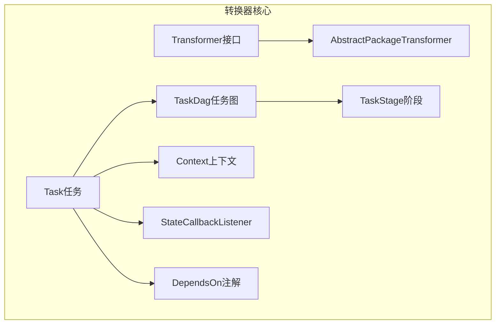
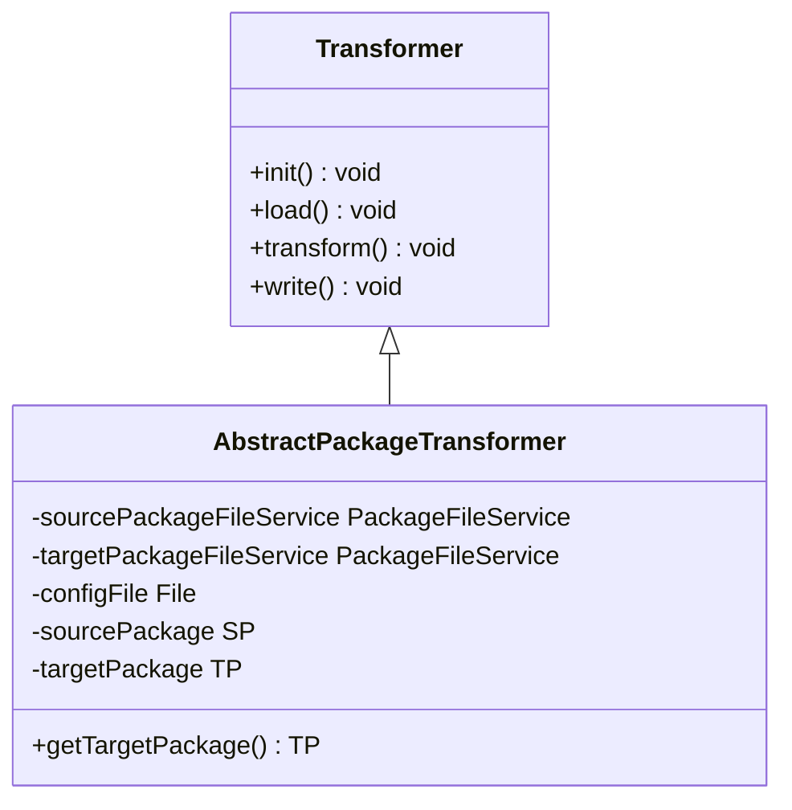
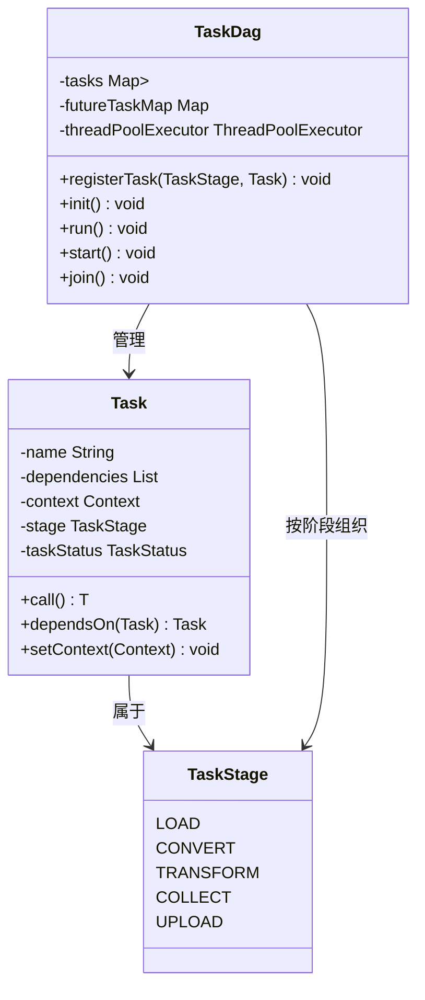
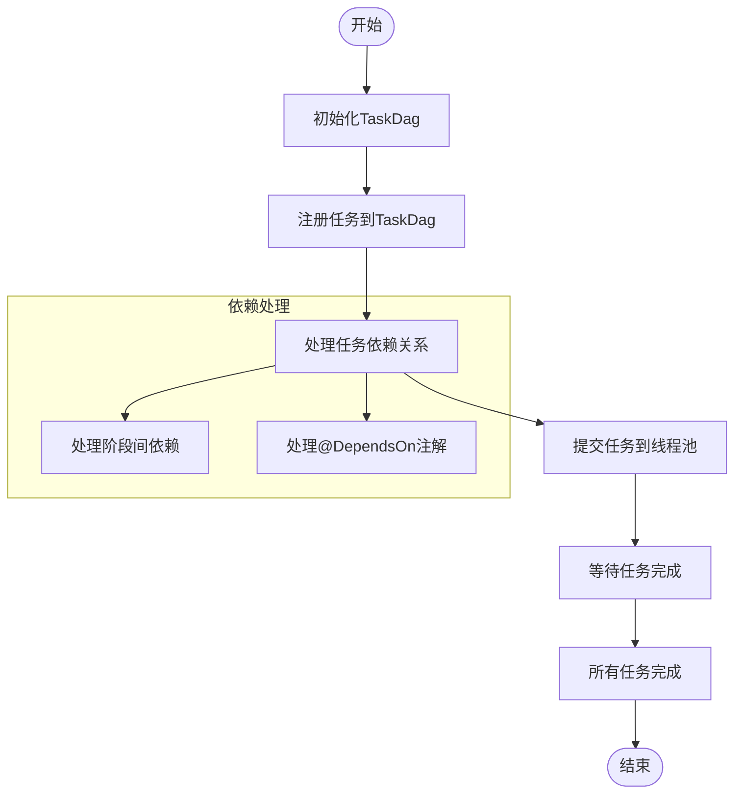
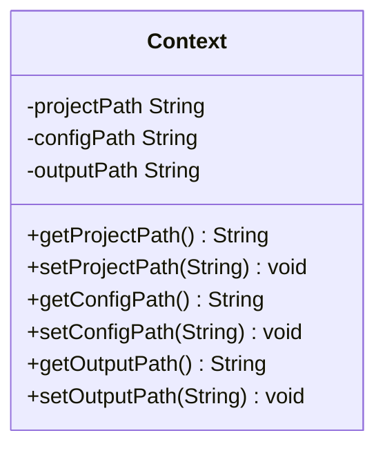
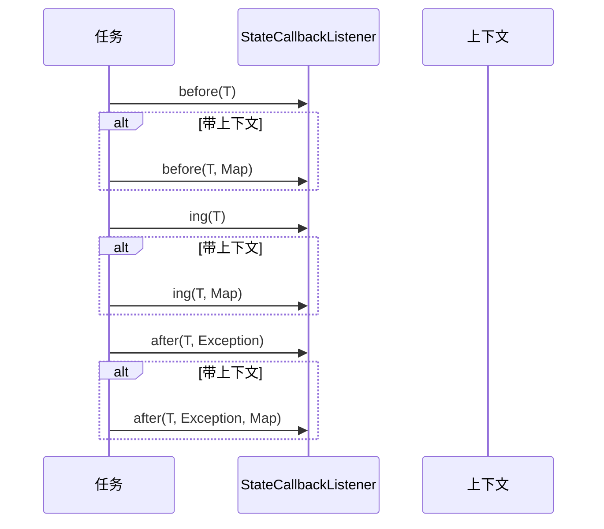
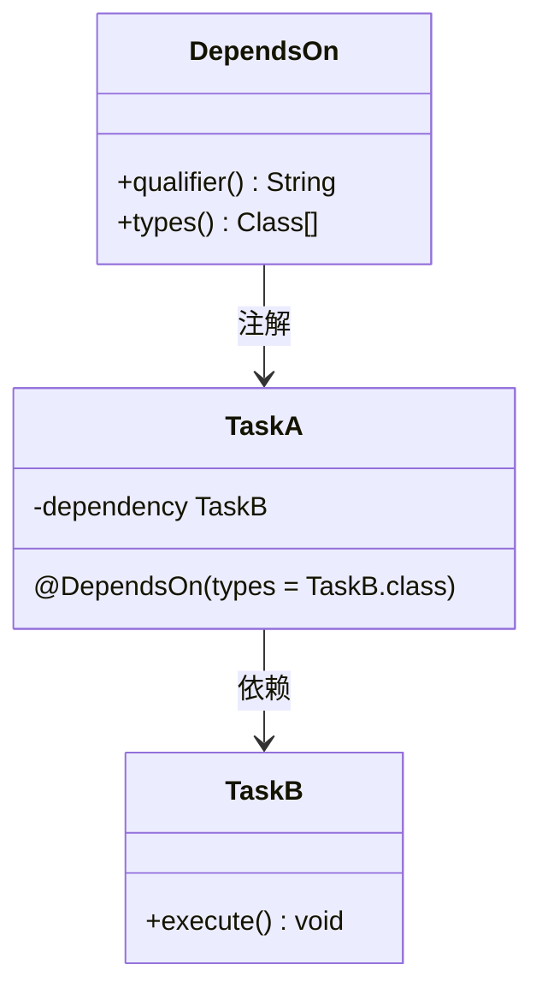
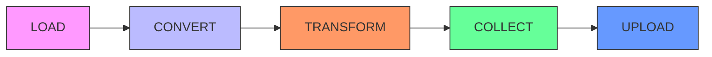
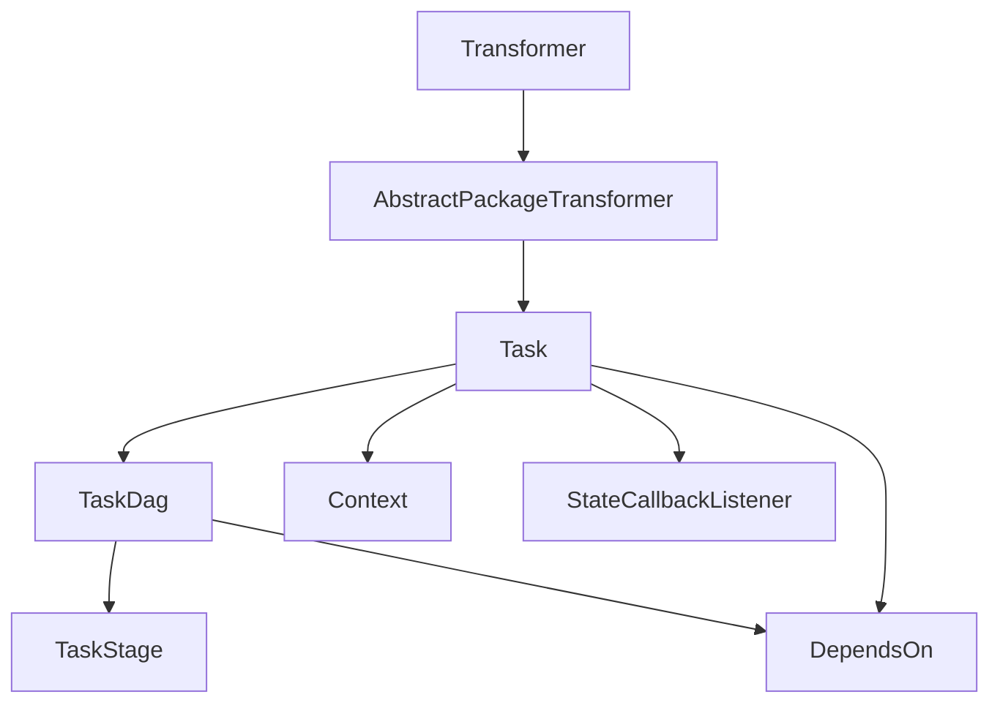

# 转换器核心引擎

<cite>
**本文档引用的文件**  
- [Transformer.java](file://client/migrationx/migrationx-transformer/src/main/java/com/aliyun/dataworks/migrationx/transformer/core/transformer/Transformer.java)
- [AbstractPackageTransformer.java](file://client/migrationx/migrationx-transformer/src/main/java/com/aliyun/dataworks/migrationx/transformer/core/transformer/AbstractPackageTransformer.java)
- [Task.java](file://client/migrationx/migrationx-transformer/src/main/java/com/aliyun/dataworks/migrationx/transformer/core/controller/Task.java)
- [TaskDag.java](file://client/migrationx/migrationx-transformer/src/main/java/com/aliyun/dataworks/migrationx/transformer/core/controller/TaskDag.java)
- [TaskStage.java](file://client/migrationx/migrationx-transformer/src/main/java/com/aliyun/dataworks/migrationx/transformer/core/controller/TaskStage.java)
- [Context.java](file://client/migrationx/migrationx-transformer/src/main/java/com/aliyun/dataworks/migrationx/transformer/core/common/Context.java)
- [StateCallbackListener.java](file://client/migrationx/migrationx-transformer/src/main/java/com/aliyun/dataworks/migrationx/transformer/core/common/StateCallbackListener.java)
- [DependsOn.java](file://client/migrationx/migrationx-transformer/src/main/java/com/aliyun/dataworks/migrationx/transformer/core/annotation/DependsOn.java)
</cite>

## 目录
1. [引言](#引言)
2. [项目结构](#项目结构)
3. [核心组件](#核心组件)
4. [架构概述](#架构概述)
5. [详细组件分析](#详细组件分析)
6. [依赖分析](#依赖分析)
7. [性能考虑](#性能考虑)
8. [故障排除指南](#故障排除指南)
9. [结论](#结论)

## 引言
本文档详细介绍了数据迁移系统中转换器核心引擎的设计与实现。该引擎基于管道-过滤器架构，通过任务调度机制实现复杂的数据转换流程。文档重点分析了Transformer接口、AbstractPackageTransformer抽象类、任务控制器（Task、TaskDag、TaskStage）以及上下文和状态回调机制的设计原理与实现细节。

## 项目结构
转换器核心引擎位于`client/migrationx/migrationx-transformer`模块中，其核心功能分布在`core`包下的多个子包中。主要结构包括：
- `transformer`：定义转换器核心接口和抽象基类
- `controller`：实现任务调度控制逻辑
- `common`：提供上下文和状态回调等通用组件
- `annotation`：定义任务依赖注解



**图示来源**  
- [Transformer.java](file://client/migrationx/migrationx-transformer/src/main/java/com/aliyun/dataworks/migrationx/transformer/core/transformer/Transformer.java)
- [Task.java](file://client/migrationx/migrationx-transformer/src/main/java/com/aliyun/dataworks/migrationx/transformer/core/controller/Task.java)
- [TaskStage.java](file://client/migrationx/migrationx-transformer/src/main/java/com/aliyun/dataworks/migrationx/transformer/core/controller/TaskStage.java)

**本节来源**  
- [项目结构信息](file://client/migrationx/migrationx-transformer/src/main/java/com/aliyun/dataworks/migrationx/transformer)

## 核心组件

转换器核心引擎由多个关键组件构成，包括转换器接口、任务控制器、上下文对象和状态回调机制。这些组件协同工作，实现了灵活可扩展的数据转换框架。

**本节来源**  
- [Transformer.java](file://client/migrationx/migrationx-transformer/src/main/java/com/aliyun/dataworks/migrationx/transformer/core/transformer/Transformer.java)
- [Task.java](file://client/migrationx/migrationx-transformer/src/main/java/com/aliyun/dataworks/migrationx/transformer/core/controller/Task.java)
- [Context.java](file://client/migrationx/migrationx-transformer/src/main/java/com/aliyun/dataworks/migrationx/transformer/core/common/Context.java)

## 架构概述

转换器核心引擎采用分层的任务调度架构，通过TaskDag管理任务依赖关系，按照TaskStage定义的执行阶段有序执行转换任务。整个流程遵循初始化、加载、转换、收集和上传的生命周期。

```mermaid
graph TD
A[初始化] --> B[加载阶段]
B --> C[转换阶段]
C --> D[变换阶段]
D --> E[收集阶段]
E --> F[上传阶段]
subgraph "任务依赖"
B --> C : 依赖
C --> D : 依赖
D --> E : 依赖
E --> F : 依赖
end
```

**图示来源**  
- [TaskStage.java](file://client/migrationx/migrationx-transformer/src/main/java/com/aliyun/dataworks/migrationx/transformer/core/controller/TaskStage.java)
- [TaskDag.java](file://client/migrationx/migrationx-transformer/src/main/java/com/aliyun/dataworks/migrationx/transformer/core/controller/TaskDag.java)

## 详细组件分析

### Transformer接口与AbstractPackageTransformer抽象类

#### 设计原理与实现机制
Transformer接口定义了数据转换的核心生命周期方法，包括初始化、加载、转换和写入。AbstractPackageTransformer作为抽象基类，提供了包级转换的通用实现，通过泛型参数支持不同类型的数据包转换。



**图示来源**  
- [Transformer.java](file://client/migrationx/migrationx-transformer/src/main/java/com/aliyun/dataworks/migrationx/transformer/core/transformer/Transformer.java)
- [AbstractPackageTransformer.java](file://client/migrationx/migrationx-transformer/src/main/java/com/aliyun/dataworks/migrationx/transformer/core/transformer/AbstractPackageTransformer.java)

**本节来源**  
- [Transformer.java](file://client/migrationx/migrationx-transformer/src/main/java/com/aliyun/dataworks/migrationx/transformer/core/transformer/Transformer.java)
- [AbstractPackageTransformer.java](file://client/migrationx/migrationx-transformer/src/main/java/com/aliyun/dataworks/migrationx/transformer/core/transformer/AbstractPackageTransformer.java)

### 任务调度控制器

#### Task、TaskDag和TaskStage协同工作
任务调度系统由Task、TaskDag和TaskStage三个核心类组成。Task表示单个可执行任务，TaskStage定义任务执行阶段，TaskDag负责管理任务间的依赖关系和执行调度。



**图示来源**  
- [Task.java](file://client/migrationx/migrationx-transformer/src/main/java/com/aliyun/dataworks/migrationx/transformer/core/controller/Task.java)
- [TaskDag.java](file://client/migrationx/migrationx-transformer/src/main/java/com/aliyun/dataworks/migrationx/transformer/core/controller/TaskDag.java)
- [TaskStage.java](file://client/migrationx/migrationx-transformer/src/main/java/com/aliyun/dataworks/migrationx/transformer/core/controller/TaskStage.java)

**本节来源**  
- [Task.java](file://client/migrationx/migrationx-transformer/src/main/java/com/aliyun/dataworks/migrationx/transformer/core/controller/Task.java)
- [TaskDag.java](file://client/migrationx/migrationx-transformer/src/main/java/com/aliyun/dataworks/migrationx/transformer/core/controller/TaskDag.java)
- [TaskStage.java](file://client/migrationx/migrationx-transformer/src/main/java/com/aliyun/dataworks/migrationx/transformer/core/controller/TaskStage.java)

#### 管道-过滤器架构执行流程
任务执行流程采用管道-过滤器模式，每个任务作为过滤器处理数据流，TaskDag作为管道协调器管理任务间的依赖和执行顺序。



**图示来源**  
- [TaskDag.java](file://client/migrationx/migrationx-transformer/src/main/java/com/aliyun/dataworks/migrationx/transformer/core/controller/TaskDag.java)

### 上下文与状态回调机制

#### Context上下文对象
Context对象在转换过程中负责传递配置和路径信息，为各个任务提供统一的运行环境。



**图示来源**  
- [Context.java](file://client/migrationx/migrationx-transformer/src/main/java/com/aliyun/dataworks/migrationx/transformer/core/common/Context.java)

#### StateCallbackListener事件通知
StateCallbackListener接口提供任务执行过程中的生命周期事件通知机制，支持在任务执行前后进行状态监控和日志记录。



**图示来源**  
- [StateCallbackListener.java](file://client/migrationx/migrationx-transformer/src/main/java/com/aliyun/dataworks/migrationx/transformer/core/common/StateCallbackListener.java)

**本节来源**  
- [Context.java](file://client/migrationx/migrationx-transformer/src/main/java/com/aliyun/dataworks/migrationx/transformer/core/common/Context.java)
- [StateCallbackListener.java](file://client/migrationx/migrationx-transformer/src/main/java/com/aliyun/dataworks/migrationx/transformer/core/common/StateCallbackListener.java)

### 自定义转换任务开发

#### @DependsOn注解使用示例
通过@DependsOn注解可以方便地定义任务间的依赖关系，支持通过类型或限定符进行依赖注入。



**图示来源**  
- [DependsOn.java](file://client/migrationx/migrationx-transformer/src/main/java/com/aliyun/dataworks/migrationx/transformer/core/annotation/DependsOn.java)

#### 任务执行阶段划分
任务按照TaskStage枚举定义的五个阶段执行：LOAD、CONVERT、TRANSFORM、COLLECT、UPLOAD，确保转换流程的有序性。



**图示来源**  
- [TaskStage.java](file://client/migrationx/migrationx-transformer/src/main/java/com/aliyun/dataworks/migrationx/transformer/core/controller/TaskStage.java)

**本节来源**  
- [DependsOn.java](file://client/migrationx/migrationx-transformer/src/main/java/com/aliyun/dataworks/migrationx/transformer/core/annotation/DependsOn.java)
- [TaskStage.java](file://client/migrationx/migrationx-transformer/src/main/java/com/aliyun/dataworks/migrationx/transformer/core/controller/TaskStage.java)

## 依赖分析

转换器核心引擎的组件间存在明确的依赖关系，通过TaskDag统一管理，确保任务执行的正确顺序和数据一致性。



**图示来源**  
- [项目结构分析](file://client/migrationx/migrationx-transformer/src/main/java/com/aliyun/dataworks/migrationx/transformer)

**本节来源**  
- [所有核心组件文件](file://client/migrationx/migrationx-transformer/src/main/java/com/aliyun/dataworks/migrationx/transformer/core)

## 性能考虑

转换器核心引擎采用线程池并发执行任务，在保证执行效率的同时通过阶段化调度避免资源竞争。TaskDag内部使用ConcurrentHashMap保证多线程环境下的数据安全，FutureTask机制确保任务依赖的正确处理。

## 故障排除指南

### 常见问题排查
针对任务死锁、循环依赖等常见问题，可通过调用TaskDag的print()方法输出任务依赖关系图进行分析。当出现"multi candidate task found"错误时，需使用@DependsOn注解的qualifier属性明确指定依赖任务。

### 扩展任务类型
要扩展新的任务类型，需继承Task抽象类，实现call()方法，并通过TaskDag注册到相应的TaskStage中。新任务可利用Context传递必要的配置信息，并通过StateCallbackListener监控执行状态。

**本节来源**  
- [TaskDag.java](file://client/migrationx/migrationx-transformer/src/main/java/com/aliyun/dataworks/migrationx/transformer/core/controller/TaskDag.java)
- [Task.java](file://client/migrationx/migrationx-transformer/src/main/java/com/aliyun/dataworks/migrationx/transformer/core/controller/Task.java)

## 结论
转换器核心引擎通过精心设计的接口和抽象类，结合灵活的任务调度机制，构建了一个可扩展、易维护的数据转换框架。其管道-过滤器架构和阶段化执行模型确保了复杂转换流程的可靠性和可预测性，为数据迁移系统提供了坚实的基础。