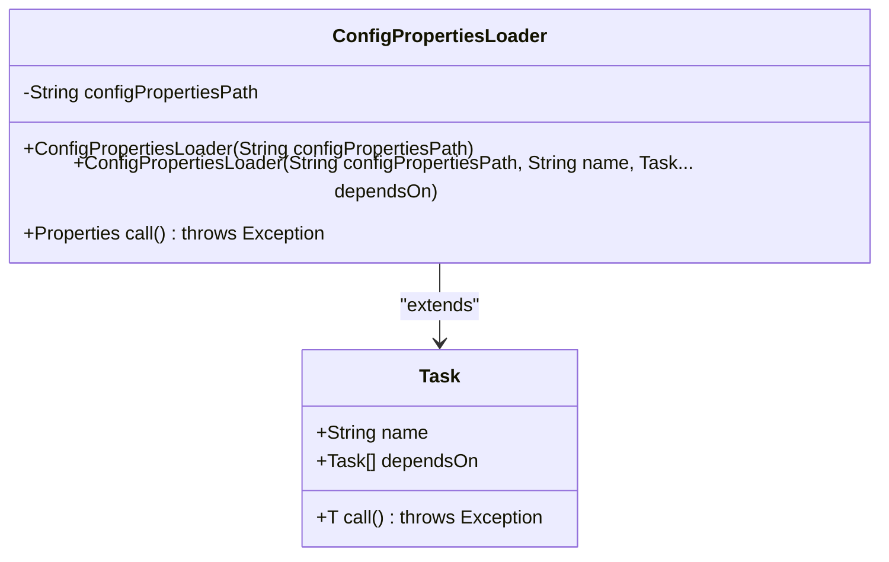

# 配置加载与管理

<cite>
**本文档引用的文件**
- [ConfigPropertiesLoader.java](file://client/migrationx/migrationx-transformer/src/main/java/com/aliyun/dataworks/migrationx/transformer/core/loader/ConfigPropertiesLoader.java)
- [DataWorksTransformerConfig.java](file://client/migrationx/migrationx-transformer/src/main/java/com/aliyun/dataworks/migrationx/transformer/dataworks/transformer/DataWorksTransformerConfig.java)
- [DIJsonProcessor.java](file://client/migrationx/migrationx-transformer/src/main/java/com/aliyun/dataworks/migrationx/transformer/core/sqoop/DIJsonProcessor.java)
- [AbstractBaseConverter.java](file://client/migrationx/migrationx-transformer/src/main/java/com/aliyun/dataworks/migrationx/transformer/dataworks/converter/AbstractBaseConverter.java)
- [dataworks-transformer-config.json](file://client/migrationx/migrationx-transformer/src/main/conf/dataworks-transformer-config.json)
- [dataworks-transformer-config-maxcompute-sample.json](file://client/migrationx/migrationx-transformer/src/main/conf/dataworks-transformer-config-maxcompute-sample.json)
- [dataworks-transformer-config-emr-sample.json](file://client/migrationx/migrationx-transformer/src/main/conf/dataworks-transformer-config-emr-sample.json)
- [MetadataFileValidator.java](file://client/migrationx/migrationx-domain/migrationx-domain-dataworks/src/main/java/com/aliyun/dataworks/migrationx/domain/dataworks/packages/validator/impl/MetadataFileValidator.java)
- [PackageValidateErrorCode.java](file://client/migrationx/migrationx-domain/migrationx-domain-dataworks/src/main/java/com/aliyun/dataworks/migrationx/domain/dataworks/packages/enums/PackageValidateErrorCode.java)
- [validator.py](file://dwcli/dwcli/pkg/schema/validator.py)
</cite>

## 目录
1. [简介](#简介)
2. [配置加载机制](#配置加载机制)
3. [转换配置文件结构](#转换配置文件结构)
4. [配置项详解](#配置项详解)
5. [配置验证与错误处理](#配置验证与错误处理)
6. [多环境配置最佳实践](#多环境配置最佳实践)
7. [自定义配置处理器扩展](#自定义配置处理器扩展)
8. [配置加载失败诊断](#配置加载失败诊断)
9. [结论](#结论)

## 简介

配置加载与管理是数据工作流转换系统的核心组件，负责解析和管理JSON格式的转换配置文件。该系统通过`ConfigPropertiesLoader`类加载配置，使用`DataWorksTransformerConfig`类管理配置数据，并通过`DIJsonProcessor`类提供多级JSON配置信息的无损存储和访问。配置文件如`dataworks-transformer-config.json`定义了源系统元数据映射规则、字段类型转换策略、默认值设置等关键配置项，这些配置直接影响节点类型映射、依赖关系转换和调度策略适配。

## 配置加载机制

配置加载机制的核心是`ConfigPropertiesLoader`类，它继承自`Task<Properties>`，负责从指定路径加载配置属性。该类提供了两个构造函数，一个接受配置文件路径，另一个接受路径、任务名称和依赖任务。`call()`方法实现了实际的配置加载逻辑，使用`FileInputStream`读取配置文件并将其加载到`Properties`对象中。



**图源**
- [ConfigPropertiesLoader.java](file://client/migrationx/migrationx-transformer/src/main/java/com/aliyun/dataworks/migrationx/transformer/core/loader/ConfigPropertiesLoader.java)

**本节源**
- [ConfigPropertiesLoader.java](file://client/migrationx/migrationx-transformer/src/main/java/com/aliyun/dataworks/migrationx/transformer/core/loader/ConfigPropertiesLoader.java)

## 转换配置文件结构

转换配置文件采用JSON格式，主要包含`format`、`locale`、`settings`等顶级字段。`settings`字段下定义了各种转换规则，如`workflow.converter.shellNodeType`用于指定shell节点的转换类型，`workflow.converter.target.engine.type`用于指定目标引擎类型。

```json
{
  "format": "SPEC",
  "locale": "zh_CN",
  "settings": {
    "workflow.converter.shellNodeType": "EMR_SHELL",
    "workflow.converter.commandSqlAs": "EMR_HIVE",
    "workflow.converter.sparkSubmitAs": "EMR_SPARK",
    "workflow.converter.target.unknownNodeTypeAs": "DIDE_SHELL",
    "workflow.converter.mrNodeType": "EMR_MR",
    "workflow.converter.target.engine.type": "EMR",
    "workflow.converter.dolphinscheduler.sqlNodeTypeMapping": {
      "POSTGRESQL": "EMR_HIVE",
      "MYSQL": "EMR_HIVE",
      "HIVE": "EMR_HIVE"
    }
  }
}
```

**本节源**
- [dataworks-transformer-config.json](file://client/migrationx/migrationx-transformer/src/main/conf/dataworks-transformer-config.json)

## 配置项详解

### 源系统元数据映射规则

源系统元数据映射规则通过`workflow.converter.dolphinscheduler.sqlNodeTypeMapping`配置项定义，它是一个映射表，将源系统的SQL节点类型映射到目标系统的相应类型。例如，将DolphinScheduler的`POSTGRESQL`类型映射到EMR的`EMR_HIVE`类型。

### 字段类型转换策略

字段类型转换策略通过`workflow.converter.*As`系列配置项定义，如`workflow.converter.commandSqlAs`指定命令SQL的转换类型，`workflow.converter.sparkSubmitAs`指定Spark提交的转换类型。这些策略确保了不同类型的任务能够正确地转换为目标系统支持的类型。

### 默认值设置

默认值设置通过`workflow.converter.target.unknownNodeTypeAs`配置项定义，当遇到未知的节点类型时，系统将使用此配置项指定的默认类型进行转换。这确保了即使在遇到未预知的节点类型时，转换过程也能继续进行。

**本节源**
- [dataworks-transformer-config.json](file://client/migrationx/migrationx-transformer/src/main/conf/dataworks-transformer-config.json)
- [AbstractBaseConverter.java](file://client/migrationx/migrationx-transformer/src/main/java/com/aliyun/dataworks/migrationx/transformer/dataworks/converter/AbstractBaseConverter.java)

## 配置验证与错误处理

配置验证与错误处理是确保配置文件正确性的关键环节。系统通过`MetadataFileValidator`类对配置文件进行验证，检查JSON格式、必填字段是否存在以及字段值是否匹配实际文件名。如果验证失败，系统会返回相应的错误代码和修复建议。

```mermaid
sequenceDiagram
participant Validator as "验证器"
participant ConfigFile as "配置文件"
participant ErrorReporter as "错误报告器"
Validator->>ConfigFile : 加载配置文件
ConfigFile-->>Validator : 返回文件内容
Validator->>Validator : 验证JSON格式
alt 格式错误
Validator->>ErrorReporter : 报告METADATA_FILE_INVALID_JSON错误
else 有效格式
Validator->>Validator : 验证必填字段
alt 字段缺失
Validator->>ErrorReporter : 报告METADATA_FILE_MISSING_FIELD错误
else 字段存在
Validator->>Validator : 验证字段值匹配
alt 值不匹配
Validator->>ErrorReporter : 报告METADATA_FILE_VALUE_MISMATCH错误
else 值匹配
Validator-->> : 验证通过
end
end
end
```

**图源**
- [MetadataFileValidator.java](file://client/migrationx/migrationx-domain/migrationx-domain-dataworks/src/main/java/com/aliyun/dataworks/migrationx/domain/dataworks/packages/validator/impl/MetadataFileValidator.java)
- [PackageValidateErrorCode.java](file://client/migrationx/migrationx-domain/migrationx-domain-dataworks/src/main/java/com/aliyun/dataworks/migrationx/domain/dataworks/packages/enums/PackageValidateErrorCode.java)

**本节源**
- [MetadataFileValidator.java](file://client/migrationx/migrationx-domain/migrationx-domain-dataworks/src/main/java/com/aliyun/dataworks/migrationx/domain/dataworks/packages/validator/impl/MetadataFileValidator.java)
- [PackageValidateErrorCode.java](file://client/migrationx/migrationx-domain/migrationx-domain-dataworks/src/main/java/com/aliyun/dataworks/migrationx/domain/dataworks/packages/enums/PackageValidateErrorCode.java)

## 多环境配置最佳实践

多环境配置最佳实践包括使用不同的配置文件来适应不同的环境需求，如开发、测试和生产环境。通过为每个环境创建专门的配置文件，可以确保每个环境的配置都是最优的。此外，使用环境变量来覆盖配置文件中的特定值，可以在不修改配置文件的情况下快速切换环境设置。

**本节源**
- [dataworks-transformer-config-maxcompute-sample.json](file://client/migrationx/migrationx-transformer/src/main/conf/dataworks-transformer-config-maxcompute-sample.json)
- [dataworks-transformer-config-emr-sample.json](file://client/migrationx/migrationx-transformer/src/main/conf/dataworks-transformer-config-emr-sample.json)

## 自定义配置处理器扩展

自定义配置处理器扩展允许开发者根据特定需求扩展配置处理功能。通过实现`ConfigPropertiesLoader`的子类或修改`DataWorksTransformerConfig`的行为，可以添加新的配置项或改变现有配置项的处理方式。这种灵活性使得系统能够适应不断变化的需求。

**本节源**
- [ConfigPropertiesLoader.java](file://client/migrationx/migrationx-transformer/src/main/java/com/aliyun/dataworks/migrationx/transformer/core/loader/ConfigPropertiesLoader.java)
- [DataWorksTransformerConfig.java](file://client/migrationx/migrationx-transformer/src/main/java/com/aliyun/dataworks/migrationx/transformer/dataworks/transformer/DataWorksTransformerConfig.java)

## 配置加载失败诊断

配置加载失败可能由多种原因引起，包括文件路径错误、JSON格式错误或缺少必要的配置项。诊断步骤包括检查文件路径是否正确、验证JSON格式是否有效以及确认所有必需的配置项都已提供。使用`DIJsonProcessor`类的`checkJSON`方法可以帮助识别JSON格式问题。

**本节源**
- [DIJsonProcessor.java](file://client/migrationx/migrationx-transformer/src/main/java/com/aliyun/dataworks/migrationx/transformer/core/sqoop/DIJsonProcessor.java)
- [ConfigPropertiesLoader.java](file://client/migrationx/migrationx-transformer/src/main/java/com/aliyun/dataworks/migrationx/transformer/core/loader/ConfigPropertiesLoader.java)

## 结论

配置加载与管理是数据工作流转换系统的关键组成部分，通过精心设计的配置文件结构和强大的配置处理机制，确保了转换过程的准确性和可靠性。通过遵循多环境配置最佳实践和利用自定义配置处理器扩展，可以进一步提高系统的灵活性和适应性。有效的配置验证与错误处理机制保证了配置文件的质量，而详细的诊断指南则帮助快速解决配置加载失败的问题。