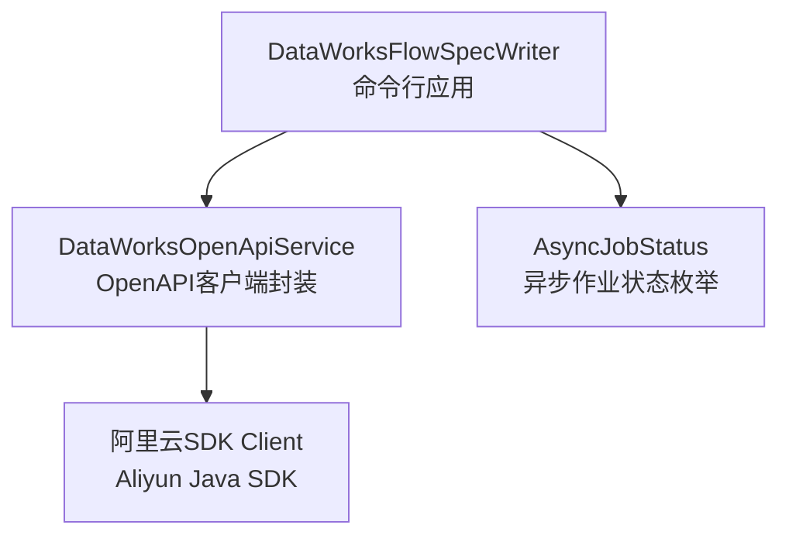
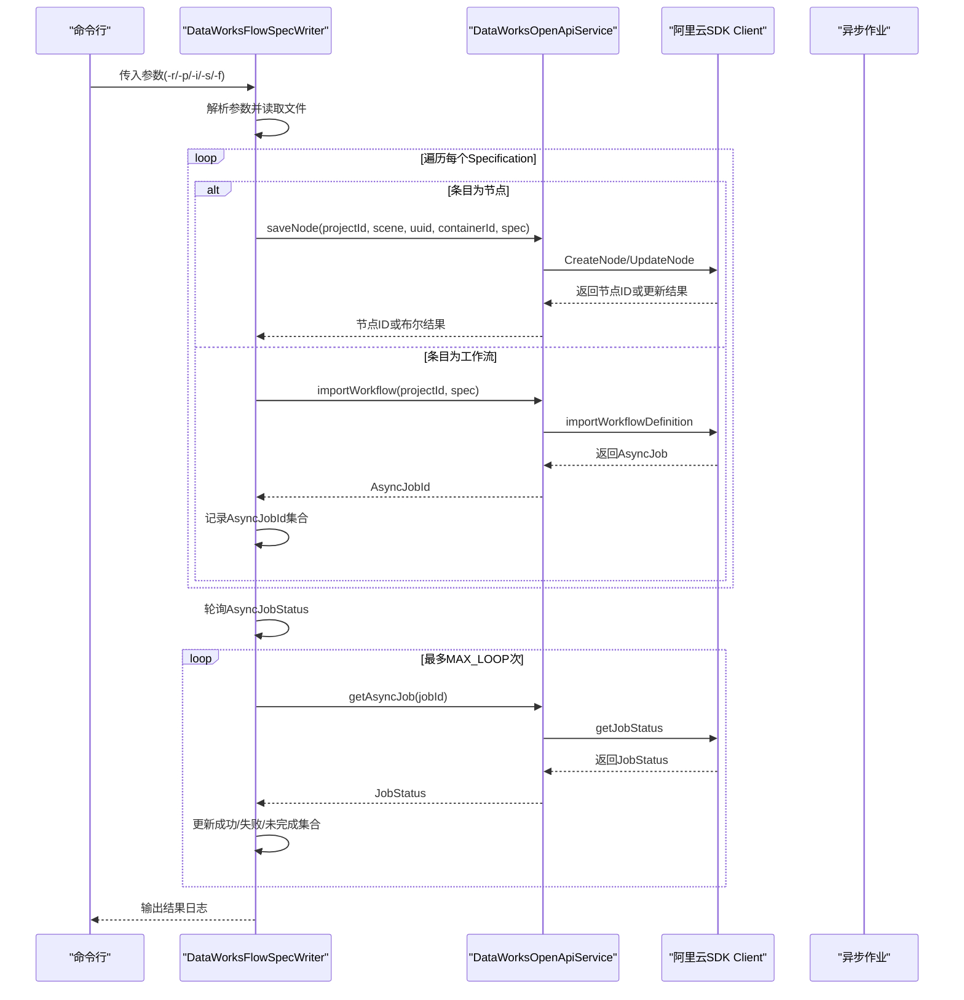
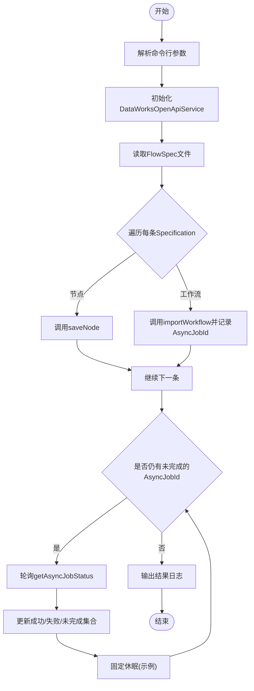
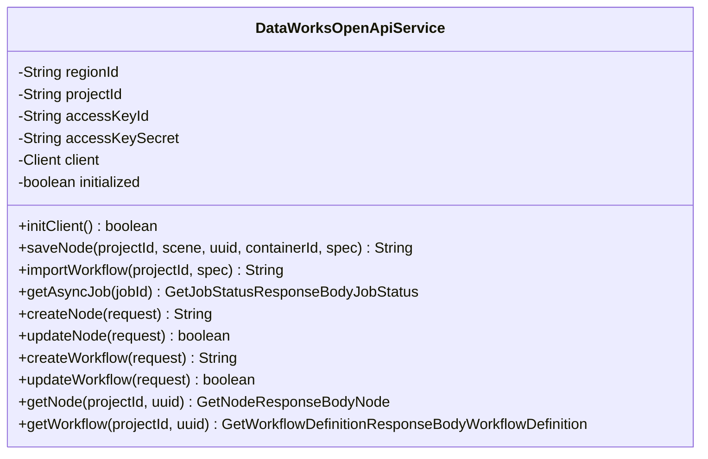
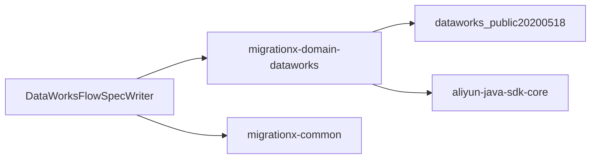

# DataWorksFlowSpecWriter

<cite>
**本文引用的文件列表**
- [DataWorksFlowSpecWriter.java](file://client/migrationx/migrationx-writer/src/main/java/com/aliyun/dataworks/migrationx/writer/dataworks/DataWorksFlowSpecWriter.java)
- [DataWorksOpenApiService.java](file://client/migrationx/migrationx-domain/migrationx-domain-dataworks/src/main/java/com/aliyun/dataworks/migrationx/domain/dataworks/service/openapi/DataWorksOpenApiService.java)
- [AsyncJobStatus.java](file://client/migrationx/migrationx-writer/src/main/java/com/aliyun/dataworks/migrationx/writer/dataworks/model/AsyncJobStatus.java)
- [DataWorksMigrationSpecificationImportWriterTest.java](file://client/migrationx/migrationx-writer/src/test/java/com/aliyun/dataworks/migrationx/writer/DataWorksMigrationSpecificationImportWriterTest.java)
- [pom.xml](file://client/migrationx/migrationx-writer/pom.xml)
</cite>

## 目录
1. [简介](#简介)
2. [项目结构](#项目结构)
3. [核心组件](#核心组件)
4. [架构总览](#架构总览)
5. [详细组件分析](#详细组件分析)
6. [依赖关系分析](#依赖关系分析)
7. [性能与并发特性](#性能与并发特性)
8. [故障排查指南](#故障排查指南)
9. [结论](#结论)
10. [附录](#附录)

## 简介
本文件面向“DataWorksFlowSpecWriter”的实现与使用，聚焦于其通过DataWorks OpenAPI将转换后的FlowSpec导入目标工作空间的完整流程。文档详细说明：
- 基于HTTP客户端的认证机制（AccessKey/SecretKey），支持环境变量注入
- 异步作业提交流程（importWorkflowDefinition）与轮询AsyncJobStatus获取导入结果
- 请求构造、响应解析与错误处理
- 重试策略、超时配置与并发控制机制
- 常见问题处理（API限流、权限不足、资源冲突等）
- 导入进度监控的最佳实践

## 项目结构
DataWorksFlowSpecWriter位于迁移客户端的writer模块中，围绕DataWorksOpenApiService封装了OpenAPI调用与异步作业状态轮询逻辑；AsyncJobStatus定义了异步作业的状态枚举。

图表来源
- [DataWorksFlowSpecWriter.java](file://client/migrationx/migrationx-writer/src/main/java/com/aliyun/dataworks/migrationx/writer/dataworks/DataWorksFlowSpecWriter.java#L1-L204)
- [DataWorksOpenApiService.java](file://client/migrationx/migrationx-domain/migrationx-domain-dataworks/src/main/java/com/aliyun/dataworks/migrationx/domain/dataworks/service/openapi/DataWorksOpenApiService.java#L1-L486)
- [AsyncJobStatus.java](file://client/migrationx/migrationx-writer/src/main/java/com/aliyun/dataworks/migrationx/writer/dataworks/model/AsyncJobStatus.java#L1-L41)

章节来源
- [DataWorksFlowSpecWriter.java](file://client/migrationx/migrationx-writer/src/main/java/com/aliyun/dataworks/migrationx/writer/dataworks/DataWorksFlowSpecWriter.java#L1-L204)
- [DataWorksOpenApiService.java](file://client/migrationx/migrationx-domain/migrationx-domain-dataworks/src/main/java/com/aliyun/dataworks/migrationx/domain/dataworks/service/openapi/DataWorksOpenApiService.java#L1-L486)
- [AsyncJobStatus.java](file://client/migrationx/migrationx-writer/src/main/java/com/aliyun/dataworks/migrationx/writer/dataworks/model/AsyncJobStatus.java#L1-L41)

## 核心组件
- DataWorksFlowSpecWriter：命令行入口，负责参数解析、文件读取、批量提交FlowSpec、异步作业状态轮询与结果汇总。
- DataWorksOpenApiService：OpenAPI客户端封装，提供节点与工作流的创建/更新、工作流导入（异步）、异步作业状态查询等能力。
- AsyncJobStatus：异步作业状态枚举，包含运行中、成功、失败、取消等状态及完成标记。

章节来源
- [DataWorksFlowSpecWriter.java](file://client/migrationx/migrationx-writer/src/main/java/com/aliyun/dataworks/migrationx/writer/dataworks/DataWorksFlowSpecWriter.java#L1-L204)
- [DataWorksOpenApiService.java](file://client/migrationx/migrationx-domain/migrationx-domain-dataworks/src/main/java/com/aliyun/dataworks/migrationx/domain/dataworks/service/openapi/DataWorksOpenApiService.java#L1-L486)
- [AsyncJobStatus.java](file://client/migrationx/migrationx-writer/src/main/java/com/aliyun/dataworks/migrationx/writer/dataworks/model/AsyncJobStatus.java#L1-L41)

## 架构总览
DataWorksFlowSpecWriter通过命令行参数获取区域、项目ID、AccessKey/SecretKey与FlowSpec文件路径，读取文件中的多个Specification条目，分别调用OpenAPI进行节点保存或工作流导入，并对工作流导入返回的异步作业ID进行轮询，最终输出成功/失败/未完成的统计结果。

图表来源
- [DataWorksFlowSpecWriter.java](file://client/migrationx/migrationx-writer/src/main/java/com/aliyun/dataworks/migrationx/writer/dataworks/DataWorksFlowSpecWriter.java#L60-L150)
- [DataWorksOpenApiService.java](file://client/migrationx/migrationx-domain/migrationx-domain-dataworks/src/main/java/com/aliyun/dataworks/migrationx/domain/dataworks/service/openapi/DataWorksOpenApiService.java#L187-L245)

## 详细组件分析

### DataWorksFlowSpecWriter 实现要点
- 参数与认证
  - 支持通过命令行参数传入region、projectId、accessKeyId、accessKeySecret；也支持从环境变量注入（AccessKey ID/Secret）。
  - 通过DataWorksOpenApiService构造客户端并初始化。
- 文件读取与批量提交
  - 读取FlowSpec JSON文件，逐条解析为Specification对象。
  - 若条目为节点，则调用saveNode进行保存（幂等：存在则更新，不存在则创建）。
  - 若条目为工作流，则调用importWorkflow提交异步导入任务，收集AsyncJobId。
- 异步作业轮询与结果判定
  - 使用MAX_LOOP限制轮询次数，默认每次轮询间隔固定（示例中为固定休眠）。
  - 通过getAsyncJobStatus将底层JobStatus映射为AsyncJobStatus，按完成标记区分成功/失败/未完成。
  - 输出失败作业ID与未完成作业ID的日志，便于后续人工干预或重试。

图表来源
- [DataWorksFlowSpecWriter.java](file://client/migrationx/migrationx-writer/src/main/java/com/aliyun/dataworks/migrationx/writer/dataworks/DataWorksFlowSpecWriter.java#L60-L150)

章节来源
- [DataWorksFlowSpecWriter.java](file://client/migrationx/migrationx-writer/src/main/java/com/aliyun/dataworks/migrationx/writer/dataworks/DataWorksFlowSpecWriter.java#L48-L150)

### DataWorksOpenApiService 认证与调用链
- 认证机制
  - 通过Config设置AccessKeyId/AccessKeySecret/Endpoint/RegionId，支持从环境变量注入。
  - 初始化客户端后，后续所有OpenAPI调用均使用该客户端实例。
- 主要接口
  - saveNode：根据是否存在同名节点决定创建或更新，支持幂等。
  - importWorkflow：提交工作流导入任务，返回AsyncJobId（异步）。
  - getAsyncJob：查询异步作业状态，返回底层JobStatus对象。
  - createNode/updateNode/createWorkflow/updateWorkflow等：对应节点与工作流的创建/更新。
- 错误处理
  - 对响应码非200的情况记录错误并抛出异常；对空响应同样抛出异常。
  - 对部分查询接口（如getNode/getWorkflow）捕获异常并返回null，避免中断整体流程。

图表来源
- [DataWorksOpenApiService.java](file://client/migrationx/migrationx-domain/migrationx-domain-dataworks/src/main/java/com/aliyun/dataworks/migrationx/domain/dataworks/service/openapi/DataWorksOpenApiService.java#L84-L485)

章节来源
- [DataWorksOpenApiService.java](file://client/migrationx/migrationx-domain/migrationx-domain-dataworks/src/main/java/com/aliyun/dataworks/migrationx/domain/dataworks/service/openapi/DataWorksOpenApiService.java#L84-L245)

### AsyncJobStatus 状态模型
- 定义了运行中、成功、失败、取消四种状态，并标注completed标志位，便于轮询时快速判断是否停止轮询。
- 通过LabelEnum映射底层字符串状态，统一上层逻辑。

章节来源
- [AsyncJobStatus.java](file://client/migrationx/migrationx-writer/src/main/java/com/aliyun/dataworks/migrationx/writer/dataworks/model/AsyncJobStatus.java#L1-L41)

## 依赖关系分析
- 依赖的SDK与核心库
  - 阿里云OpenAPI SDK：用于实际的HTTP调用与模型封装。
  - aliyn-java-sdk-core：SDK核心依赖。
  - migrationx-common与migrationx-domain-dataworks：通用工具与DataWorks域内服务封装。
- Maven依赖清单参见pom.xml。

图表来源
- [pom.xml](file://client/migrationx/migrationx-writer/pom.xml#L31-L62)

章节来源
- [pom.xml](file://client/migrationx/migrationx-writer/pom.xml#L31-L62)

## 性能与并发特性
- 并发控制
  - 当前实现采用单线程顺序提交与轮询，未显式引入并发池或限速控制。
  - 工作流导入采用异步作业，Writer端通过轮询方式等待完成，避免阻塞主线程。
- 轮询策略
  - 固定轮询次数与固定休眠时间（示例中为固定间隔），未实现指数退避或动态调整。
- 超时配置
  - 未在代码中显式设置HTTP连接/读取超时，依赖SDK默认行为。
- 重试策略
  - 未实现自动重试；若出现网络异常或临时错误，建议外部重试或在上层封装重试逻辑。

章节来源
- [DataWorksFlowSpecWriter.java](file://client/migrationx/migrationx-writer/src/main/java/com/aliyun/dataworks/migrationx/writer/dataworks/DataWorksFlowSpecWriter.java#L111-L150)
- [DataWorksOpenApiService.java](file://client/migrationx/migrationx-domain/migrationx-domain-dataworks/src/main/java/com/aliyun/dataworks/migrationx/domain/dataworks/service/openapi/DataWorksOpenApiService.java#L187-L245)

## 故障排查指南
- 常见错误与处理
  - 文件不存在：在提交前会校验文件存在性，不存在则直接报错并退出。
  - OpenAPI响应非200：记录requestId并抛出异常，建议检查鉴权信息与网络连通性。
  - 异步作业状态为空：可能为网络抖动或SDK解析异常，建议增加重试或检查SDK版本。
  - 权限不足：OpenAPI调用失败通常伴随错误码与requestId，应核对AccessKey权限范围与项目ID。
  - 资源冲突：节点或工作流已存在时走更新流程；若更新失败，建议检查spec一致性与字段合法性。
- 监控与日志
  - 关键请求与响应均记录日志，便于定位问题。
  - 轮询阶段输出完成/失败/未完成集合，便于后续审计与重试。
- 单元测试参考
  - 测试用例展示了importWorkflowDefinition与getJobStatus的Mock场景，可用于验证轮询逻辑与状态切换。

章节来源
- [DataWorksFlowSpecWriter.java](file://client/migrationx/migrationx-writer/src/main/java/com/aliyun/dataworks/migrationx/writer/dataworks/DataWorksFlowSpecWriter.java#L71-L150)
- [DataWorksMigrationSpecificationImportWriterTest.java](file://client/migrationx/migrationx-writer/src/test/java/com/aliyun/dataworks/migrationx/writer/DataWorksMigrationSpecificationImportWriterTest.java#L49-L86)

## 结论
DataWorksFlowSpecWriter通过OpenAPI将FlowSpec导入DataWorks工作空间，实现了从本地文件到云端异步导入的完整闭环。其实现特点如下：
- 认证机制清晰，支持环境变量注入，便于CI/CD集成。
- 异步导入与轮询机制明确，便于大规模导入场景下的可观测性与可控性。
- 错误处理覆盖主要路径，日志详尽，便于问题定位。
- 当前未内置重试、超时与并发控制，建议在上层或扩展版本中补充这些能力以提升稳定性与吞吐。

## 附录
- API调用序列示例（文字版）
  - 步骤1：初始化DataWorksOpenApiService（传入region、projectId、accessKeyId、accessKeySecret）
  - 步骤2：读取FlowSpec文件，逐条解析为Specification
  - 步骤3：若为节点，调用saveNode；若为工作流，调用importWorkflow
  - 步骤4：收集AsyncJobId并进入轮询循环，直到完成或达到最大轮询次数
  - 步骤5：输出成功/失败/未完成集合日志
- 重试策略建议
  - 对网络异常与临时错误（如5xx/超时）增加指数退避重试
  - 对业务错误（如权限不足、资源冲突）建议上层决策是否重试或人工介入
- 超时配置建议
  - 在SDK层设置合理的连接/读取超时，避免长时间阻塞
- 并发控制建议
  - 对工作流导入任务进行分批提交，避免瞬时压力过大
  - 对轮询阶段增加并发上限，避免过多线程占用