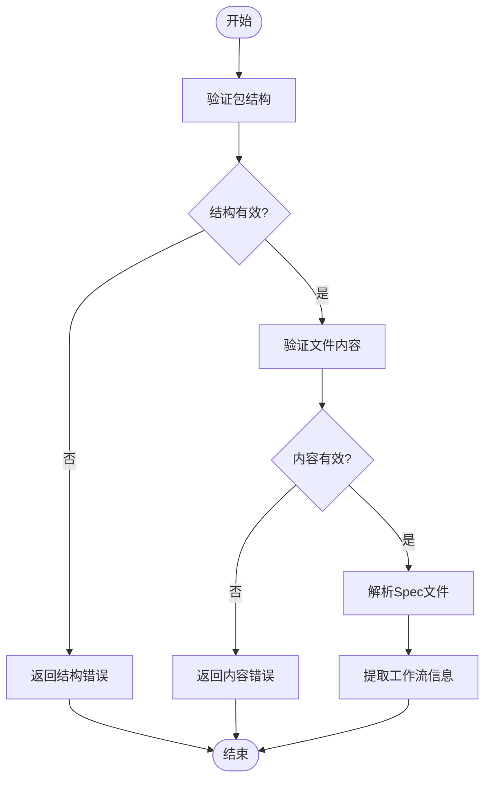
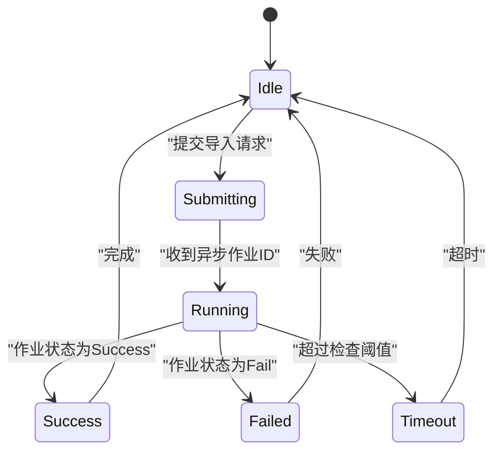
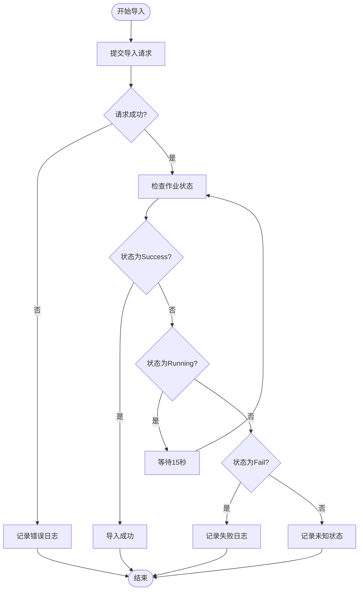

# DataWorksMigrationSpecificationImportWriter

<cite>
**本文档中引用的文件**   
- [DataWorksMigrationSpecificationImportWriter.java](file://client/migrationx/migrationx-writer/src/main/java/com/aliyun/dataworks/migrationx/writer/DataWorksMigrationSpecificationImportWriter.java)
- [DataWorksMigrationSpecificationImportWriterTest.java](file://client/migrationx/migrationx-writer/src/test/java/com/aliyun/dataworks/migrationx/writer/DataWorksMigrationSpecificationImportWriterTest.java)
- [DataWorksOpenApiService.java](file://client/migrationx/migrationx-domain/migrationx-domain-dataworks/src/main/java/com/aliyun/dataworks/migrationx/domain/dataworks/service/openapi/DataWorksOpenApiService.java)
- [SpecPackageValidator.java](file://client/migrationx/migrationx-domain/migrationx-domain-dataworks/src/main/java/com/aliyun/dataworks/migrationx/domain/dataworks/packages/validator/impl/SpecPackageValidator.java)
- [SpecFileValidator.java](file://client/migrationx/migrationx-domain/migrationx-domain-dataworks/src/main/java/com/aliyun/dataworks/migrationx/domain/dataworks/packages/validator/impl/SpecFileValidator.java)
- [SpecInfoUtil.java](file://client/migrationx/migrationx-domain/migrationx-domain-dataworks/src/main/java/com/aliyun/dataworks/migrationx/domain/dataworks/utils/SpecInfoUtil.java)
- [FlowSpecInfoHandler.java](file://client/migrationx/migrationx-domain/migrationx-domain-dataworks/src/main/java/com/aliyun/dataworks/migrationx/domain/dataworks/spec/handler/impl/FlowSpecInfoHandler.java)
- [DataWorksWorkflowSpecWriter.java](file://spec/src/main/java/com/aliyun/dataworks/common/spec/writer/impl/DataWorksWorkflowSpecWriter.java)
</cite>

## 目录
1. [简介](#简介)
2. [核心功能](#核心功能)
3. [Spec包解析与校验](#spec包解析与校验)
4. [批量导入流程](#批量导入流程)
5. [与DataWorks后端服务的交互协议](#与dataworks后端服务的交互协议)
6. [错误重试与恢复机制](#错误重试与恢复机制)
7. [性能优化建议](#性能优化建议)
8. [实际用例](#实际用例)
9. [结论](#结论)

## 简介

DataWorksMigrationSpecificationImportWriter是DataWorks迁移工具中的一个核心组件，负责将工作流定义（FlowSpec）批量导入到DataWorks项目中。该组件通过DataWorks OpenAPI与后端服务进行交互，实现了从Spec包解析、批量校验、分批次提交到错误处理的完整迁移流程。它支持大规模工作流的自动化迁移，确保数据一致性和事务完整性。

## 核心功能

DataWorksMigrationSpecificationImportWriter的核心功能是实现工作流定义的批量导入。该组件通过命令行接口接收参数，包括访问密钥、区域ID、项目ID和Spec文件夹路径。它会遍历指定文件夹中的所有JSON文件，逐个导入工作流定义。导入过程是异步的，组件会提交导入请求并轮询检查导入作业的状态，直到完成或失败。

**Section sources**
- [DataWorksMigrationSpecificationImportWriter.java](file://client/migrationx/migrationx-writer/src/main/java/com/aliyun/dataworks/migrationx/writer/DataWorksMigrationSpecificationImportWriter.java#L47-L70)

## Spec包解析与校验

在导入之前，DataWorksMigrationSpecificationImportWriter会对Spec包进行解析和校验。Spec包必须遵循特定的结构要求，包括根目录下的.dataworks文件夹、.schedule.json或.spec.json文件以及脚本内容文件。.dataworks文件夹中必须包含metadata.json文件和.type文件。

校验过程由SpecPackageValidator和SpecFileValidator等组件完成。SpecPackageValidator负责验证包的整体结构，确保必需的文件和文件夹存在且唯一。SpecFileValidator则负责验证单个Spec文件的内容，调用SpecValidateUtil进行模式校验。



**Diagram sources**
- [SpecPackageValidator.java](file://client/migrationx/migrationx-domain/migrationx-domain-dataworks/src/main/java/com/aliyun/dataworks/migrationx/domain/dataworks/packages/validator/impl/SpecPackageValidator.java#L78-L310)
- [SpecFileValidator.java](file://client/migrationx/migrationx-domain/migrationx-domain-dataworks/src/main/java/com/aliyun/dataworks/migrationx/domain/dataworks/packages/validator/impl/SpecFileValidator.java#L44-L71)

**Section sources**
- [SpecPackageValidator.java](file://client/migrationx/migrationx-domain/migrationx-domain-dataworks/src/main/java/com/aliyun/dataworks/migrationx/domain/dataworks/packages/validator/impl/SpecPackageValidator.java#L45-L310)
- [SpecFileValidator.java](file://client/migrationx/migrationx-domain/migrationx-domain-dataworks/src/main/java/com/aliyun/dataworks/migrationx/domain/dataworks/packages/validator/impl/SpecFileValidator.java#L32-L71)

## 批量导入流程

批量导入流程是DataWorksMigrationSpecificationImportWriter的核心。组件首先初始化DataWorks客户端，然后遍历Spec文件夹中的所有JSON文件。对于每个文件，它会读取内容并调用importSingleFlowSpec方法进行导入。

导入过程分为两个阶段：提交导入请求和检查导入状态。组件调用importWorkflowDefinition API提交异步导入请求，获得异步作业ID。然后，它会定期调用getJobStatus API检查作业状态，直到作业完成、失败或超时。

```mermaid
sequenceDiagram
participant User as "用户"
participant Writer as "ImportWriter"
participant DataWorks as "DataWorks后端"
User->>Writer : 启动批量导入
Writer->>Writer : 初始化客户端
Writer->>Writer : 遍历Spec文件
loop 每个Spec文件
Writer->>Writer : 读取文件内容
Writer->>DataWorks : importWorkflowDefinition(请求)
DataWorks-->>Writer : 返回异步作业ID
loop 检查作业状态
Writer->>DataWorks : getJobStatus(作业ID)
DataWorks-->>Writer : 返回作业状态
alt 状态为"Success"
break 作业成功
else 状态为"Fail"
break 作业失败
else 状态为"Running"
Writer->>Writer : 等待15秒
end
end
end
Writer->>User : 导入完成
```

**Diagram sources**
- [DataWorksMigrationSpecificationImportWriter.java](file://client/migrationx/migrationx-writer/src/main/java/com/aliyun/dataworks/migrationx/writer/DataWorksMigrationSpecificationImportWriter.java#L72-L143)
- [DataWorksOpenApiService.java](file://client/migrationx/migrationx-domain/migrationx-domain-dataworks/src/main/java/com/aliyun/dataworks/migrationx/domain/dataworks/service/openapi/DataWorksOpenApiService.java#L187-L213)

**Section sources**
- [DataWorksMigrationSpecificationImportWriter.java](file://client/migrationx/migrationx-writer/src/main/java/com/aliyun/dataworks/migrationx/writer/DataWorksMigrationSpecificationImportWriter.java#L72-L154)

## 与DataWorks后端服务的交互协议

DataWorksMigrationSpecificationImportWriter通过DataWorks OpenAPI与后端服务进行交互。交互协议基于RESTful API，使用HTTPS进行安全通信。关键的API包括importWorkflowDefinition用于提交导入请求，和getJobStatus用于查询异步作业状态。

事务边界由异步作业模型定义。每个工作流的导入是一个独立的事务，具有原子性。数据一致性通过异步作业的状态机保证：作业要么成功完成，要么失败回滚。如果作业超时，系统会保留作业记录，允许后续查询最终状态。



**Diagram sources**
- [DataWorksOpenApiService.java](file://client/migrationx/migrationx-domain/migrationx-domain-dataworks/src/main/java/com/aliyun/dataworks/migrationx/domain/dataworks/service/openapi/DataWorksOpenApiService.java#L187-L213)
- [DataWorksMigrationSpecificationImportWriter.java](file://client/migrationx/migrationx-writer/src/main/java/com/aliyun/dataworks/migrationx/writer/DataWorksMigrationSpecificationImportWriter.java#L119-L143)

**Section sources**
- [DataWorksOpenApiService.java](file://client/migrationx/migrationx-domain/migrationx-domain-dataworks/src/main/java/com/aliyun/dataworks/migrationx/domain/dataworks/service/openapi/DataWorksOpenApiService.java#L61-L486)

## 错误重试与恢复机制

DataWorksMigrationSpecificationImportWriter实现了健壮的错误处理机制。当导入请求失败时，组件会记录详细的错误日志，包括请求ID和错误信息。对于网络异常等临时性错误，组件依赖于DataWorks OpenAPI客户端的重试机制。

在部分失败场景下，组件采用"尽力而为"的策略：即使某些工作流导入失败，也会继续尝试导入其他工作流。这确保了最大化的迁移成功率。用户可以通过日志分析失败原因，并针对特定工作流重新提交导入请求。



**Diagram sources**
- [DataWorksMigrationSpecificationImportWriter.java](file://client/migrationx/migrationx-writer/src/main/java/com/aliyun/dataworks/migrationx/writer/DataWorksMigrationSpecificationImportWriter.java#L119-L143)
- [DataWorksOpenApiService.java](file://client/migrationx/migrationx-domain/migrationx-domain-dataworks/src/main/java/com/aliyun/dataworks/migrationx/domain/dataworks/service/openapi/DataWorksOpenApiService.java#L194-L206)

**Section sources**
- [DataWorksMigrationSpecificationImportWriter.java](file://client/migrationx/migrationx-writer/src/main/java/com/aliyun/dataworks/migrationx/writer/DataWorksMigrationSpecificationImportWriter.java#L93-L116)
- [DataWorksOpenApiService.java](file://client/migrationx/migrationx-domain/migrationx-domain-dataworks/src/main/java/com/aliyun/dataworks/migrationx/domain/dataworks/service/openapi/DataWorksOpenApiService.java#L194-L206)

## 性能优化建议

为了优化批量导入性能，建议调整批大小和并发度。虽然当前实现是顺序导入，但可以通过并行处理多个Spec文件来提高效率。建议的批大小为10-50个工作流，具体取决于工作流的复杂性和系统负载。

并发度控制可以通过多线程或多进程实现。每个线程/进程处理一个工作流的导入，避免阻塞。同时，应监控API调用速率，避免触发限流。

错误日志分析是性能优化的关键。通过分析失败日志，可以识别常见错误模式，如网络超时、认证失败或数据格式错误，并针对性地优化。建议定期清理已完成的异步作业，以减少状态查询的开销。

## 实际用例

通过DataWorksMigrationSpecificationImportWriter，可以轻松实现大规模工作流迁移。例如，将Airflow工作流迁移到DataWorks时，首先使用迁移工具生成Spec包，然后使用ImportWriter批量导入。

```bash
java -cp migrationx-writer.jar com.aliyun.dataworks.migrationx.writer.DataWorksMigrationSpecificationImportWriter \
  -i <accessKeyId> \
  -k <accessKeySecret> \
  -r cn-shanghai \
  -p <projectId> \
  -f /path/to/spec/files
```

此命令会导入指定文件夹中的所有工作流定义。对于包含数百个工作流的大型迁移项目，整个过程可能需要数小时，但实现了完全自动化，大大减少了人工干预。

**Section sources**
- [DataWorksMigrationSpecificationImportWriter.java](file://client/migrationx/migrationx-writer/src/main/java/com/aliyun/dataworks/migrationx/writer/DataWorksMigrationSpecificationImportWriter.java#L145-L153)

## 结论

DataWorksMigrationSpecificationImportWriter是一个功能强大且可靠的工具，用于将工作流定义批量导入DataWorks。它通过完善的Spec包解析、校验、导入和错误处理机制，确保了迁移过程的稳定性和数据一致性。通过合理的性能优化，可以高效处理大规模迁移任务，是DataWorks生态中不可或缺的组件。