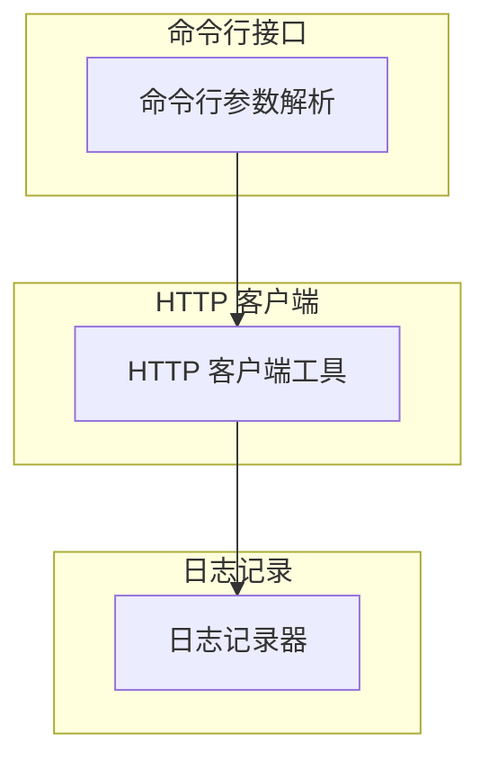
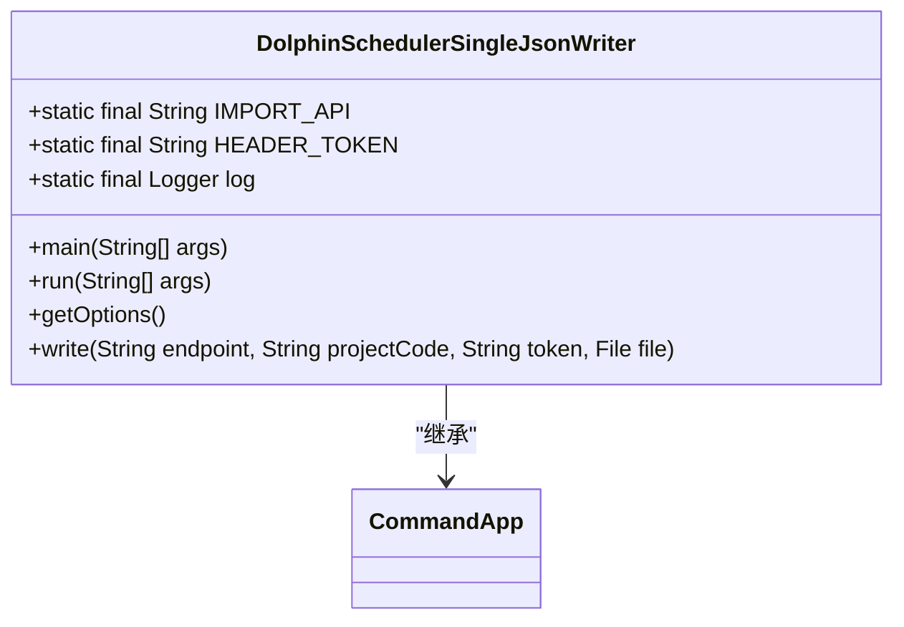
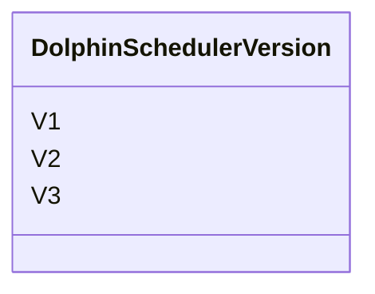
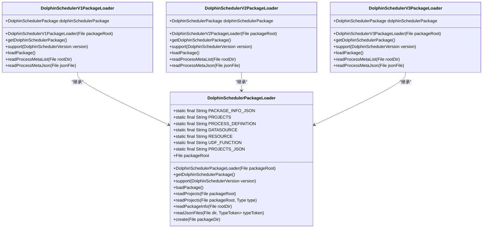
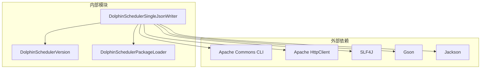

# DolphinSchedulerSingleJsonWriter

<cite>
**本文档引用的文件**
- [DolphinSchedulerSingleJsonWriter.java](file://client/migrationx/migrationx-writer/src/main/java/com/aliyun/dataworks/migrationx/writer/dolphinscheduler/DolphinSchedulerSingleJsonWriter.java)
- [DolphinSchedulerVersion.java](file://client/migrationx/migrationx-domain/migrationx-domain-dolphinscheduler/src/main/java/com/aliyun/dataworks/migrationx/domain/dataworks/dolphinscheduler/DolphinSchedulerVersion.java)
- [DolphinSchedulerV1PackageLoader.java](file://client/migrationx/migrationx-domain/migrationx-domain-dolphinscheduler/src/main/java/com/aliyun/dataworks/migrationx/domain/dataworks/dolphinscheduler/service/DolphinSchedulerV1PackageLoader.java)
- [DolphinSchedulerV2PackageLoader.java](file://client/migrationx/migrationx-domain/migrationx-domain-dolphinscheduler/src/main/java/com/aliyun/dataworks/migrationx/domain/dataworks/dolphinscheduler/service/DolphinSchedulerV2PackageLoader.java)
- [DolphinSchedulerV3PackageLoader.java](file://client/migrationx/migrationx-domain/migrationx-domain-dolphinscheduler/src/main/java/com/aliyun/dataworks/migrationx/domain/dataworks/dolphinscheduler/service/DolphinSchedulerV3PackageLoader.java)
- [DolphinSchedulerPackageLoader.java](file://client/migrationx/migrationx-domain/migrationx-domain-dolphinscheduler/src/main/java/com/aliyun/dataworks/migrationx/domain/dataworks/dolphinscheduler/service/DolphinSchedulerPackageLoader.java)
- [ProcessMeta.java](file://client/migrationx/migrationx-domain/migrationx-domain-dolphinscheduler/src/main/java/com/aliyun/dataworks/migrationx/domain/dataworks/dolphinscheduler/v1/ProcessMeta.java)
- [DagData.java](file://client/migrationx/migrationx-domain/migrationx-domain-dolphinscheduler/src/main/java/com/aliyun/dataworks/migrationx/domain/dataworks/dolphinscheduler/v2/DagData.java)
</cite>

## 目录
1. [简介](#简介)
2. [核心组件](#核心组件)
3. [架构概述](#架构概述)
4. [详细组件分析](#详细组件分析)
5. [依赖分析](#依赖分析)
6. [性能考虑](#性能考虑)
7. [故障排除指南](#故障排除指南)
8. [结论](#结论)

## 简介
DolphinSchedulerSingleJsonWriter 是一个用于将内部 FlowSpec 模型转换为 DolphinScheduler 兼容的 JSON 格式的工具。该工具支持 DolphinScheduler 的多个版本（v1/v2/v3），并能够处理工作流定义、节点配置、依赖关系和调度策略的转换规则。此外，它还支持 DolphinScheduler 特有的功能，如任务超时策略、失败重试机制和资源队列配置的映射。

## 核心组件

DolphinSchedulerSingleJsonWriter 的核心组件包括命令行参数解析、HTTP 客户端工具、日志记录器等。这些组件共同协作，确保数据能够正确地从内部模型转换为 DolphinScheduler 的 JSON 格式，并通过 HTTP 请求发送到目标系统。

**章节来源**
- [DolphinSchedulerSingleJsonWriter.java](file://client/migrationx/migrationx-writer/src/main/java/com/aliyun/dataworks/migrationx/writer/dolphinscheduler/DolphinSchedulerSingleJsonWriter.java#L1-L87)

## 架构概述

DolphinSchedulerSingleJsonWriter 的架构主要包括以下几个部分：
- **命令行接口**：负责解析用户输入的命令行参数。
- **HTTP 客户端**：用于与 DolphinScheduler 的 REST API 进行通信。
- **日志记录**：记录操作过程中的重要信息和错误。

**图表来源**
- [DolphinSchedulerSingleJsonWriter.java](file://client/migrationx/migrationx-writer/src/main/java/com/aliyun/dataworks/migrationx/writer/dolphinscheduler/DolphinSchedulerSingleJsonWriter.java#L1-L87)

## 详细组件分析

### DolphinSchedulerSingleJsonWriter 分析

DolphinSchedulerSingleJsonWriter 类继承自 CommandApp，实现了 run 方法来处理命令行参数并执行写入操作。主要功能包括：
- 解析命令行参数，获取 DolphinScheduler 的端点、令牌、项目代码和源文件路径。
- 验证源文件是否存在。
- 使用 HttpClientUtil 发送 HTTP POST 请求，将 JSON 文件上传到 DolphinScheduler。

#### 对象导向组件

**图表来源**
- [DolphinSchedulerSingleJsonWriter.java](file://client/migrationx/migrationx-writer/src/main/java/com/aliyun/dataworks/migrationx/writer/dolphinscheduler/DolphinSchedulerSingleJsonWriter.java#L1-L87)

### 版本适配机制分析

DolphinScheduler 支持多个版本（v1/v2/v3），每个版本有不同的数据结构和 API。为了支持这些版本，系统使用了 DolphinSchedulerVersion 枚举和相应的包加载器。

#### 版本枚举

**图表来源**
- [DolphinSchedulerVersion.java](file://client/migrationx/migrationx-domain/migrationx-domain-dolphinscheduler/src/main/java/com/aliyun/dataworks/migrationx/domain/dataworks/dolphinscheduler/DolphinSchedulerVersion.java#L1-L35)

#### 包加载器

**图表来源**
- [DolphinSchedulerPackageLoader.java](file://client/migrationx/migrationx-domain/migrationx-domain-dolphinscheduler/src/main/java/com/aliyun/dataworks/migrationx/domain/dataworks/dolphinscheduler/service/DolphinSchedulerPackageLoader.java#L1-L149)
- [DolphinSchedulerV1PackageLoader.java](file://client/migrationx/migrationx-domain/migrationx-domain-dolphinscheduler/src/main/java/com/aliyun/dataworks/migrationx/domain/dataworks/dolphinscheduler/service/DolphinSchedulerV1PackageLoader.java#L1-L131)
- [DolphinSchedulerV2PackageLoader.java](file://client/migrationx/migrationx-domain/migrationx-domain-dolphinscheduler/src/main/java/com/aliyun/dataworks/migrationx/domain/dataworks/dolphinscheduler/service/DolphinSchedulerV2PackageLoader.java#L1-L124)
- [DolphinSchedulerV3PackageLoader.java](file://client/migrationx/migrationx-domain/migrationx-domain-dolphinscheduler/src/main/java/com/aliyun/dataworks/migrationx/domain/dataworks/dolphinscheduler/service/DolphinSchedulerV3PackageLoader.java#L1-L121)

## 依赖分析

DolphinSchedulerSingleJsonWriter 依赖于多个外部库和内部模块，包括：
- **Apache Commons CLI**：用于解析命令行参数。
- **Apache HttpClient**：用于发送 HTTP 请求。
- **SLF4J**：用于日志记录。
- **Gson**：用于 JSON 序列化和反序列化。
- **Jackson**：用于 JSON 处理。

**图表来源**
- [DolphinSchedulerSingleJsonWriter.java](file://client/migrationx/migrationx-writer/src/main/java/com/aliyun/dataworks/migrationx/writer/dolphinscheduler/DolphinSchedulerSingleJsonWriter.java#L1-L87)
- [DolphinSchedulerVersion.java](file://client/migrationx/migrationx-domain/migrationx-domain-dolphinscheduler/src/main/java/com/aliyun/dataworks/migrationx/domain/dataworks/dolphinscheduler/DolphinSchedulerVersion.java#L1-L35)
- [DolphinSchedulerPackageLoader.java](file://client/migrationx/migrationx-domain/migrationx-domain-dolphinscheduler/src/main/java/com/aliyun/dataworks/migrationx/domain/dataworks/dolphinscheduler/service/DolphinSchedulerPackageLoader.java#L1-L149)

## 性能考虑

在处理大量数据时，DolphinSchedulerSingleJsonWriter 需要考虑以下性能因素：
- **内存使用**：避免一次性加载过大的 JSON 文件到内存中。
- **网络传输**：优化 HTTP 请求的大小和频率，减少网络延迟。
- **并发处理**：支持多线程或异步处理，提高处理速度。

## 故障排除指南

### 常见问题
- **文件不存在**：确保提供的源文件路径正确且文件存在。
- **HTTP 请求失败**：检查 DolphinScheduler 的端点和令牌是否正确，确保网络连接正常。
- **JSON 格式错误**：验证 JSON 文件的格式是否符合 DolphinScheduler 的要求。

### 调试建议
- 查看日志输出，定位具体的错误信息。
- 使用调试工具逐步执行代码，观察变量的变化。
- 在开发环境中进行测试，确保所有功能正常工作。

**章节来源**
- [DolphinSchedulerSingleJsonWriter.java](file://client/migrationx/migrationx-writer/src/main/java/com/aliyun/dataworks/migrationx/writer/dolphinscheduler/DolphinSchedulerSingleJsonWriter.java#L1-L87)

## 结论

DolphinSchedulerSingleJsonWriter 是一个强大的工具，能够将内部 FlowSpec 模型转换为 DolphinScheduler 兼容的 JSON 格式。通过支持多个版本和提供详细的错误处理机制，该工具能够满足不同场景下的需求。未来可以进一步优化性能，增加更多的功能支持，以提升用户体验。