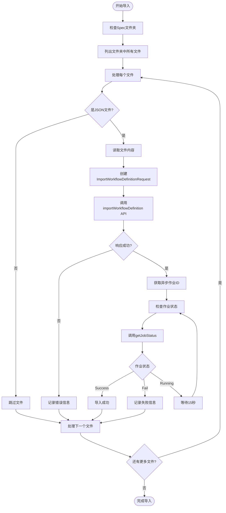
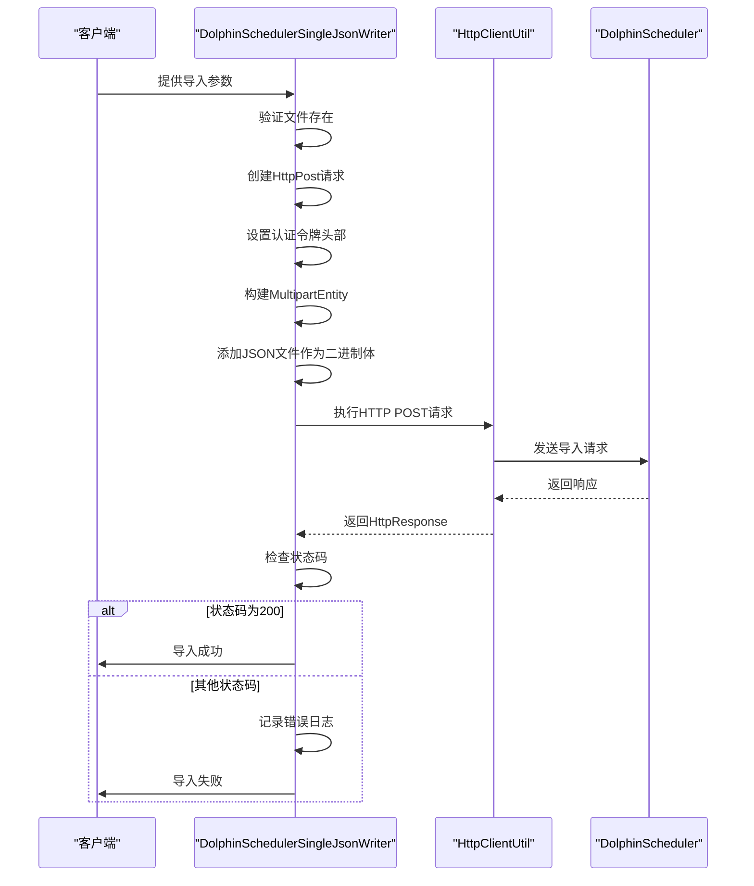

# Writer写入器

<cite>
**本文档中引用的文件**  
- [writer.py](file://client/migrationx/src/main/bin/writer.py)
- [DataWorksFlowSpecWriter.java](file://client/migrationx/migrationx-writer/src/main/java/com/aliyun/dataworks/migrationx/writer/dataworks/DataWorksFlowSpecWriter.java)
- [DataWorksMigrationSpecificationImportWriter.java](file://client/migrationx/migrationx-writer/src/main/java/com/aliyun/dataworks/migrationx/writer/DataWorksMigrationSpecificationImportWriter.java)
- [DolphinSchedulerSingleJsonWriter.java](file://client/migrationx/migrationx-writer/src/main/java/com/aliyun/dataworks/migrationx/writer/dolphinscheduler/DolphinSchedulerSingleJsonWriter.java)
- [AsyncJobStatus.java](file://client/migrationx/migrationx-writer/src/main/java/com/aliyun/dataworks/migrationx/writer/dataworks/model/AsyncJobStatus.java)
- [DataWorksOpenApiService.java](file://client/migrationx/migrationx-domain/migrationx-domain-dataworks/src/main/java/com/aliyun/dataworks/migrationx/domain/dataworks/service/openapi/DataWorksOpenApiService.java)
- [common.py](file://client/client-common/src/main/bin/common.py)
- [migrationx.json](file://client/migrationx/src/main/conf/migrationx.json)
- [usage.md](file://docs/migrationx/usage.md)
</cite>

## 目录
1. [简介](#简介)
2. [核心写入器组件](#核心写入器组件)
3. [DataWorksFlowSpecWriter详解](#dataworksflowspecwriter详解)
4. [DataWorksMigrationSpecificationImportWriter详解](#dataworksmigrationspecificationimportwriter详解)
5. [DolphinSchedulerSingleJsonWriter详解](#dolphinschedulersinglejsonwriter详解)
6. [命令行工具使用](#命令行工具使用)
7. [API调用序列与响应处理](#api调用序列与响应处理)
8. [常见问题与解决方案](#常见问题与解决方案)
9. [总结](#总结)

## 简介
Writer写入器是MigrationX管道-过滤器架构中的目标系统输出组件，负责将转换后的FlowSpec导入到目标工作空间。本系统支持多种目标平台，包括DataWorks和DolphinScheduler，通过不同的写入器实现特定平台的导入功能。写入器通过DataWorks OpenAPI将转换后的FlowSpec导入目标工作空间，实现了认证、异步作业提交和状态轮询机制。对于批量导入和错误重试，系统提供了专门的处理机制。此外，系统还支持将Spec导出为DolphinScheduler兼容的JSON格式，满足不同平台的集成需求。

## 核心写入器组件
Writer写入器系统包含多个核心组件，每个组件负责不同的写入任务。主要组件包括DataWorksFlowSpecWriter、DataWorksMigrationSpecificationImportWriter和DolphinSchedulerSingleJsonWriter。这些组件共同构成了一个完整的写入器系统，能够处理从数据转换到目标系统导入的全过程。系统通过Java实现，利用Apache Commons CLI处理命令行参数，通过SLF4J进行日志记录，并使用Lombok简化代码。写入器的设计遵循了模块化原则，每个写入器专注于特定的目标平台，确保了系统的可扩展性和维护性。

**本节来源**
- [DataWorksFlowSpecWriter.java](file://client/migrationx/migrationx-writer/src/main/java/com/aliyun/dataworks/migrationx/writer/dataworks/DataWorksFlowSpecWriter.java)
- [DataWorksMigrationSpecificationImportWriter.java](file://client/migrationx/migrationx-writer/src/main/java/com/aliyun/dataworks/migrationx/writer/DataWorksMigrationSpecificationImportWriter.java)
- [DolphinSchedulerSingleJsonWriter.java](file://client/migrationx/migrationx-writer/src/main/java/com/aliyun/dataworks/migrationx/writer/dolphinscheduler/DolphinSchedulerSingleJsonWriter.java)

## DataWorksFlowSpecWriter详解
DataWorksFlowSpecWriter是专门用于将FlowSpec导入DataWorks的写入器。该组件通过DataWorks OpenAPI实现与目标系统的交互，支持异步作业提交和状态轮询。写入器首先通过命令行参数获取必要的配置信息，包括区域、项目ID、文件路径以及访问密钥。然后，它使用DataWorksOpenApiService服务进行认证和API调用。

写入过程分为两个主要步骤：批量写入流程和异步作业状态检查。在批量写入阶段，系统会读取输入流中的每个FlowSpec，根据其类型决定是保存单个节点还是导入整个工作流。对于工作流导入，系统会提交异步作业并收集所有作业ID。随后，系统进入状态检查循环，定期轮询每个异步作业的状态，直到所有作业完成或达到最大轮询次数。

```mermaid
sequenceDiagram
participant Client as "客户端"
participant Writer as "DataWorksFlowSpecWriter"
participant Service as "DataWorksOpenApiService"
participant API as "DataWorks OpenAPI"
Client->>Writer : 提交FlowSpec文件
Writer->>Writer : 解析命令行参数
Writer->>Service : 初始化DataWorksOpenApiService
Writer->>Writer : 读取FlowSpec文件
loop 每个FlowSpec
Writer->>Writer : 判断Spec类型
alt 是节点
Writer->>Service : 调用saveNode
Service->>API : 创建或更新节点
API-->>Service : 返回节点ID
else 是工作流
Writer->>Service : 调用importWorkflow
Service->>API : 提交异步导入作业
API-->>Service : 返回异步作业ID
Writer->>Writer : 收集异步作业ID
end
end
loop 检查异步作业状态
Writer->>Service : 调用getAsyncJob
Service->>API : 查询作业状态
API-->>Service : 返回作业状态
Service-->>Writer : 返回AsyncJobStatus
Writer->>Writer : 处理作业状态
alt 作业完成
break
else 未完成
Writer->>Writer : 等待5秒
end
end
Writer->>Client : 返回导入结果
```

**图示来源**
- [DataWorksFlowSpecWriter.java](file://client/migrationx/migrationx-writer/src/main/java/com/aliyun/dataworks/migrationx/writer/dataworks/DataWorksFlowSpecWriter.java#L60-L150)
- [DataWorksOpenApiService.java](file://client/migrationx/migrationx-domain/migrationx-domain-dataworks/src/main/java/com/aliyun/dataworks/migrationx/domain/dataworks/service/openapi/DataWorksOpenApiService.java#L187-L213)

**本节来源**
- [DataWorksFlowSpecWriter.java](file://client/migrationx/migrationx-writer/src/main/java/com/aliyun/dataworks/migrationx/writer/dataworks/DataWorksFlowSpecWriter.java)
- [DataWorksOpenApiService.java](file://client/migrationx/migrationx-domain/migrationx-domain-dataworks/src/main/java/com/aliyun/dataworks/migrationx/domain/dataworks/service/openapi/DataWorksOpenApiService.java)

## DataWorksMigrationSpecificationImportWriter详解
DataWorksMigrationSpecificationImportWriter负责处理批量导入和错误重试机制。该写入器专门设计用于从指定文件夹中批量导入多个FlowSpec文件到DataWorks项目中。与DataWorksFlowSpecWriter相比，它提供了更高级的批量处理功能和更完善的错误处理机制。

写入器的主要功能包括：遍历指定文件夹中的所有JSON文件，逐个导入每个FlowSpec，并实时监控导入作业的状态。系统实现了重试机制，当导入失败时会记录错误信息并继续处理其他文件，确保批量导入过程的鲁棒性。对于每个导入作业，写入器都会启动一个状态检查循环，最多检查20次，每次间隔15秒，以确保能够及时获取作业的最终状态。



**图示来源**
- [DataWorksMigrationSpecificationImportWriter.java](file://client/migrationx/migrationx-writer/src/main/java/com/aliyun/dataworks/migrationx/writer/DataWorksMigrationSpecificationImportWriter.java#L73-L143)
- [DataWorksOpenApiService.java](file://client/migrationx/migrationx-domain/migrationx-domain-dataworks/src/main/java/com/aliyun/dataworks/migrationx/domain/dataworks/service/openapi/DataWorksOpenApiService.java#L187-L213)

**本节来源**
- [DataWorksMigrationSpecificationImportWriter.java](file://client/migrationx/migrationx-writer/src/main/java/com/aliyun/dataworks/migrationx/writer/DataWorksMigrationSpecificationImportWriter.java)
- [DataWorksOpenApiService.java](file://client/migrationx/migrationx-domain/migrationx-domain-dataworks/src/main/java/com/aliyun/dataworks/migrationx/domain/dataworks/service/openapi/DataWorksOpenApiService.java)

## DolphinSchedulerSingleJsonWriter详解
DolphinSchedulerSingleJsonWriter负责将Spec导出为DolphinScheduler兼容的JSON格式。该写入器通过HTTP POST请求将JSON文件导入到DolphinScheduler项目中。与DataWorks写入器不同，DolphinScheduler写入器采用同步文件上传的方式，通过multipart/form-data格式提交JSON文件。

写入器需要以下参数：DolphinScheduler的端点地址、认证令牌、项目代码和源文件路径。系统会创建一个HTTP POST请求，设置必要的头部信息（包括认证令牌），并将JSON文件作为二进制体添加到请求中。通过HttpClientUtil执行请求后，系统会检查响应状态码来判断导入是否成功。



**图示来源**
- [DolphinSchedulerSingleJsonWriter.java](file://client/migrationx/migrationx-writer/src/main/java/com/aliyun/dataworks/migrationx/writer/dolphinscheduler/DolphinSchedulerSingleJsonWriter.java#L63-L85)
- [HttpClientUtil.java](file://client/migrationx/migrationx-common/src/main/java/com/aliyun/migrationx/common/http/HttpClientUtil.java)

**本节来源**
- [DolphinSchedulerSingleJsonWriter.java](file://client/migrationx/migrationx-writer/src/main/java/com/aliyun/dataworks/migrationx/writer/dolphinscheduler/DolphinSchedulerSingleJsonWriter.java)

## 命令行工具使用
Writer写入器通过命令行工具提供用户接口，支持多种参数配置。主要参数包括：

- `--target-type` (-t): 指定目标类型，如SPEC
- `--target-config` (-c): 指定目标配置文件路径
- `-e` (--endpoint): DataWorks OpenAPI端点
- `-i` (--accessKeyId): 阿里云访问密钥ID
- `-k` (--accessKey): 阿里云访问密钥
- `-p` (--projectId): DataWorks项目ID
- `-r` (--regionId): 阿里云区域ID
- `-f` (--flowspecFolder): FlowSpec文件夹路径

使用示例：
```bash
bin/writer.py \
 -a dataworks \
 -e dataworks.cn-shanghai.aliyuncs.com \
 -i $ALIYUN_ACCESS_KEY_ID \
 -k $ALIYUN_ACCESS_KEY_SECRET \
 -p $ALIYUN_DATAWORKS_WORKSPACE_ID \
 -r cn-shanghai \
 -f demo_space.zip \
 -t SPEC
```

系统还支持通过环境变量配置参数，如`ALIBABA_CLOUD_ACCESS_KEY_ID`和`ALIBABA_CLOUD_ACCESS_KEY_SECRET`，这使得在自动化脚本中使用更加方便。配置文件`migrationx.json`定义了完整的迁移流程，包括读取、转换和写入阶段的参数设置。

**本节来源**
- [writer.py](file://client/migrationx/src/main/bin/writer.py)
- [migrationx.json](file://client/migrationx/src/main/conf/migrationx.json)
- [usage.md](file://docs/migrationx/usage.md)

## API调用序列与响应处理
从FlowSpec导入DataWorks的完整API调用序列包括以下步骤：

1. **初始化客户端**: 使用访问密钥和区域信息初始化DataWorksOpenApiService
2. **提交导入请求**: 调用`importWorkflowDefinition` API提交工作流定义
3. **获取异步作业ID**: 从响应中提取异步作业ID
4. **轮询作业状态**: 定期调用`getJobStatus` API查询作业状态
5. **处理最终结果**: 根据作业状态确定导入是否成功

响应处理机制包括：
- 成功响应（状态码200）：提取异步作业ID并开始状态轮询
- 失败响应：记录错误信息并继续处理其他文件
- 异常处理：捕获网络异常和API调用异常，确保系统稳定性

系统通过AsyncJobStatus枚举监控导入进度，该枚举包含RUNNING、SUCCESS、FAIL和CANCEL四种状态。写入器会持续轮询直到作业完成或达到最大轮询次数，确保能够及时获取导入结果。

```mermaid
sequenceDiagram
participant Client as "客户端"
participant Writer as "写入器"
participant Service as "DataWorksOpenApiService"
participant API as "DataWorks OpenAPI"
Client->>Writer : 启动导入
Writer->>Service : 初始化客户端
Service->>API : 建立连接
API-->>Service : 连接成功
Service-->>Writer : 客户端就绪
Writer->>Writer : 读取FlowSpec
Writer->>Service : 调用importWorkflowDefinition
Service->>API : 发送导入请求
API-->>Service : 返回异步作业ID
Service-->>Writer : 返回作业ID
Writer->>Writer : 开始状态轮询
loop 轮询作业状态
Writer->>Service : 调用getJobStatus
Service->>API : 查询作业状态
API-->>Service : 返回状态信息
Service-->>Writer : 返回AsyncJobStatus
Writer->>Writer : 检查状态
alt 状态为Success
break
else 状态为Fail
Writer->>Writer : 记录错误
break
else 状态为Running
Writer->>Writer : 等待5秒
end
end
Writer->>Client : 返回最终结果
```

**图示来源**
- [DataWorksMigrationSpecificationImportWriter.java](file://client/migrationx/migrationx-writer/src/main/java/com/aliyun/dataworks/migrationx/writer/DataWorksMigrationSpecificationImportWriter.java#L94-L143)
- [DataWorksOpenApiService.java](file://client/migrationx/migrationx-domain/migrationx-domain-dataworks/src/main/java/com/aliyun/dataworks/migrationx/domain/dataworks/service/openapi/DataWorksOpenApiService.java#L187-L245)
- [AsyncJobStatus.java](file://client/migrationx/migrationx-writer/src/main/java/com/aliyun/dataworks/migrationx/writer/dataworks/model/AsyncJobStatus.java)

**本节来源**
- [DataWorksMigrationSpecificationImportWriter.java](file://client/migrationx/migrationx-writer/src/main/java/com/aliyun/dataworks/migrationx/writer/DataWorksMigrationSpecificationImportWriter.java)
- [DataWorksOpenApiService.java](file://client/migrationx/migrationx-domain/migrationx-domain-dataworks/src/main/java/com/aliyun/dataworks/migrationx/domain/dataworks/service/openapi/DataWorksOpenApiService.java)
- [AsyncJobStatus.java](file://client/migrationx/migrationx-writer/src/main/java/com/aliyun/dataworks/migrationx/writer/dataworks/model/AsyncJobStatus.java)

## 常见问题与解决方案
在使用Writer写入器时，可能会遇到以下常见问题：

### API限流
**问题描述**: 由于API调用频率过高，导致请求被限流。
**解决方案**: 
- 实现指数退避重试机制
- 在连续请求之间添加适当的延迟
- 批量处理时控制并发请求数量
- 使用异步作业提交，减少API调用频率

### 权限不足
**问题描述**: 访问密钥没有足够的权限执行导入操作。
**解决方案**:
- 检查RAM用户权限策略
- 确保拥有DataWorks项目管理权限
- 使用具有足够权限的服务账号
- 验证访问密钥的有效性

### 文件格式错误
**问题描述**: FlowSpec文件格式不符合预期，导致解析失败。
**解决方案**:
- 验证JSON文件的语法正确性
- 确保文件编码为UTF-8
- 检查文件扩展名为.json
- 使用schema验证工具验证文件结构

### 网络连接问题
**问题描述**: 无法连接到DataWorks OpenAPI端点。
**解决方案**:
- 检查网络连接和防火墙设置
- 验证端点URL的正确性
- 确保DNS解析正常
- 使用ping和telnet测试连接

### 导入超时
**问题描述**: 大型工作流导入耗时过长，超过轮询限制。
**解决方案**:
- 增加轮询次数和间隔时间
- 分批导入大型工作流
- 使用异步处理模式
- 监控导入进度并通过AsyncJobStatus获取状态

**本节来源**
- [DataWorksMigrationSpecificationImportWriter.java](file://client/migrationx/migrationx-writer/src/main/java/com/aliyun/dataworks/migrationx/writer/DataWorksMigrationSpecificationImportWriter.java)
- [DataWorksOpenApiService.java](file://client/migrationx/migrationx-domain/migrationx-domain-dataworks/src/main/java/com/aliyun/dataworks/migrationx/domain/dataworks/service/openapi/DataWorksOpenApiService.java)
- [usage.md](file://docs/migrationx/usage.md)

## 总结
Writer写入器作为MigrationX管道-过滤器架构的关键组件，提供了强大的目标系统输出功能。系统通过多种写入器支持不同的目标平台，其中DataWorks写入器通过OpenAPI实现了高效的异步导入机制。写入器设计考虑了实际使用中的各种场景，包括批量导入、错误处理和状态监控。

核心优势包括：
- **异步作业处理**: 通过异步API调用提高导入效率
- **状态轮询机制**: 实时监控导入进度，确保可靠性
- **批量处理能力**: 支持从文件夹批量导入多个Spec文件
- **完善的错误处理**: 详细的日志记录和错误恢复机制
- **灵活的配置**: 支持命令行参数和环境变量配置

通过AsyncJobStatus监控机制，用户可以实时了解导入进度，及时发现和解决问题。系统设计充分考虑了生产环境的需求，提供了稳定、可靠的导入解决方案。

**本节来源**
- [DataWorksFlowSpecWriter.java](file://client/migrationx/migrationx-writer/src/main/java/com/aliyun/dataworks/migrationx/writer/dataworks/DataWorksFlowSpecWriter.java)
- [DataWorksMigrationSpecificationImportWriter.java](file://client/migrationx/migrationx-writer/src/main/java/com/aliyun/dataworks/migrationx/writer/DataWorksMigrationSpecificationImportWriter.java)
- [DolphinSchedulerSingleJsonWriter.java](file://client/migrationx/migrationx-writer/src/main/java/com/aliyun/dataworks/migrationx/writer/dolphinscheduler/DolphinSchedulerSingleJsonWriter.java)