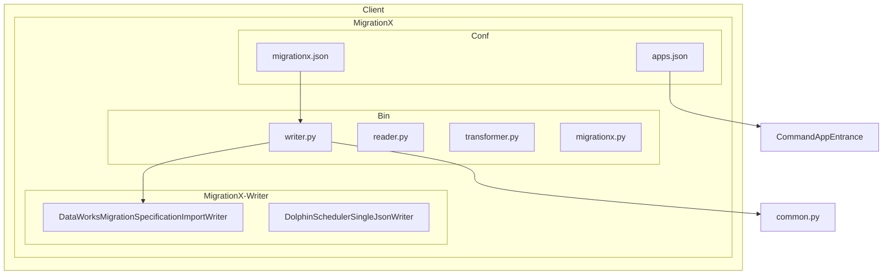
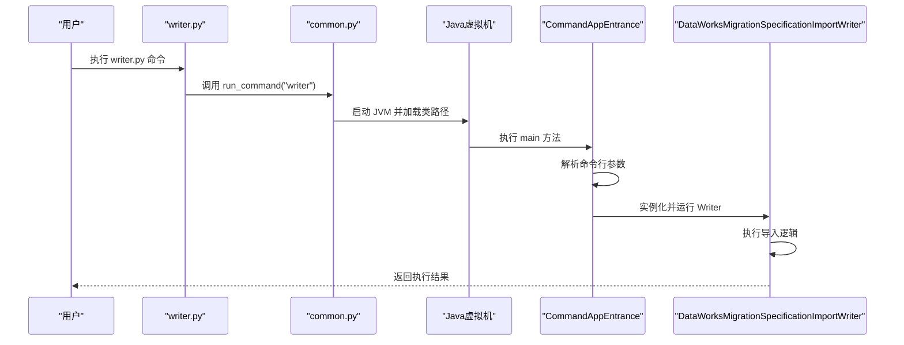
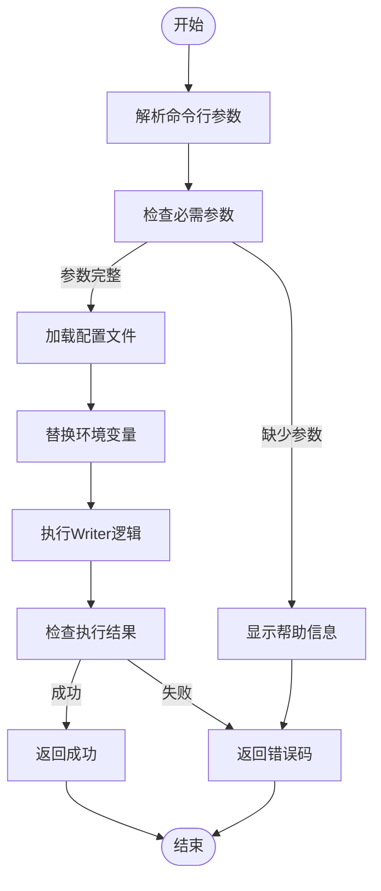
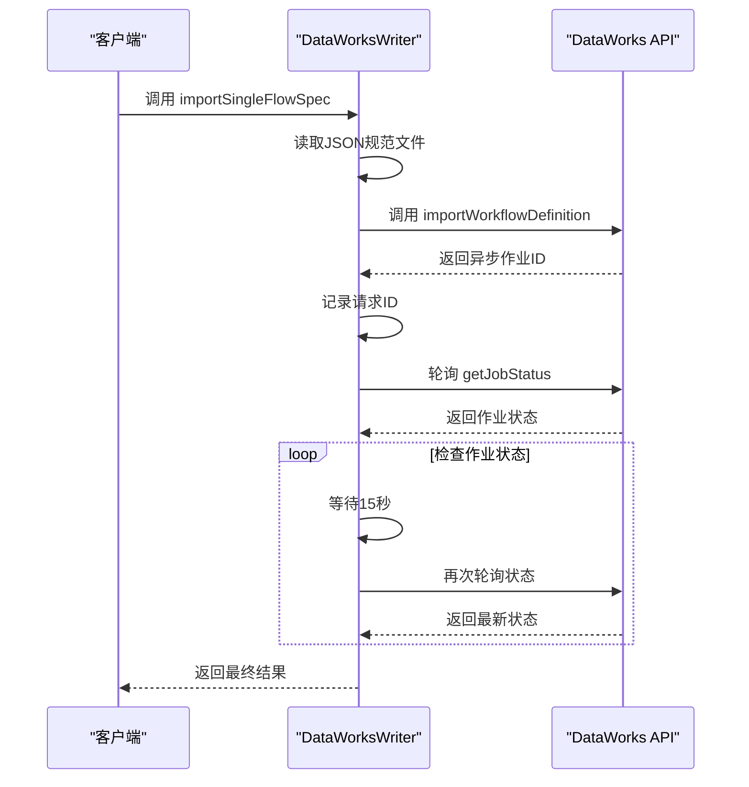
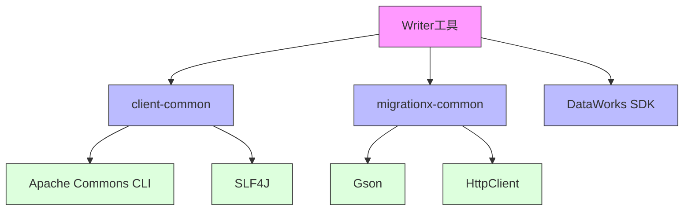

# Writer命令行工具

<cite>
**本文档引用的文件**
- [writer.py](file://client/migrationx/src/main/bin/writer.py)
- [common.py](file://client/client-common/src/main/bin/common.py)
- [migrationx.json](file://client/migrationx/src/main/conf/migrationx.json)
- [DataWorksMigrationSpecificationImportWriter.java](file://client/migrationx/migrationx-writer/src/main/java/com/aliyun/dataworks/migrationx/writer/DataWorksMigrationSpecificationImportWriter.java)
- [DolphinSchedulerSingleJsonWriter.java](file://client/migrationx/migrationx-writer/src/main/java/com/aliyun/dataworks/migrationx/writer/dolphinscheduler/DolphinSchedulerSingleJsonWriter.java)
- [CommandAppEntrance.java](file://client/client-common/src/main/java/com/aliyun/dataworks/client/command/CommandAppEntrance.java)
- [reader.py](file://client/migrationx/src/main/bin/reader.py)
- [transformer.py](file://client/migrationx/src/main/bin/transformer.py)
</cite>

## 目录
1. [简介](#简介)
2. [项目结构](#项目结构)
3. [核心组件](#核心组件)
4. [架构概述](#架构概述)
5. [详细组件分析](#详细组件分析)
6. [依赖分析](#依赖分析)
7. [性能考虑](#性能考虑)
8. [故障排除指南](#故障排除指南)
9. [结论](#结论)

## 简介
Writer命令行工具是MigrationX迁移管道的末端组件，负责将转换后的数据工作流规范写入目标系统。该工具支持多种目标系统，包括DataWorks和DolphinScheduler，通过Java实现的核心功能和Python包装器提供命令行接口。Writer工具作为MigrationX三阶段管道（读取-转换-写入）的最后一环，确保迁移的数据能够正确导入到目标平台。

**Section sources**
- [writer.py](file://client/migrationx/src/main/bin/writer.py)
- [DataWorksMigrationSpecificationImportWriter.java](file://client/migrationx/migrationx-writer/src/main/java/com/aliyun/dataworks/migrationx/writer/DataWorksMigrationSpecificationImportWriter.java)

## 项目结构
MigrationX项目的结构遵循模块化设计，将不同功能分离到独立的模块中。Writer工具位于`client/migrationx`目录下，其核心实现位于`migrationx-writer`模块中，而命令行接口由`src/main/bin/writer.py`提供。配置文件存储在`conf`目录中，包括`migrationx.json`和`apps.json`，这些文件定义了工具的行为和可用的应用程序。

**Diagram sources**
- [writer.py](file://client/migrationx/src/main/bin/writer.py)
- [migrationx.json](file://client/migrationx/src/main/conf/migrationx.json)
- [apps.json](file://client/migrationx/src/main/conf/apps.json)

**Section sources**
- [writer.py](file://client/migrationx/src/main/bin/writer.py)
- [migrationx.json](file://client/migrationx/src/main/conf/migrationx.json)

## 核心组件
Writer工具的核心组件包括Python启动脚本、Java实现类和配置系统。Python脚本`writer.py`作为入口点，调用`common.py`中的`run_command`函数来启动相应的Java应用程序。Java实现类如`DataWorksMigrationSpecificationImportWriter`和`DolphinSchedulerSingleJsonWriter`提供了具体的目标系统写入逻辑。配置系统通过`migrationx.json`文件定义了命令行参数和环境变量替换。

**Section sources**
- [writer.py](file://client/migrationx/src/main/bin/writer.py)
- [common.py](file://client/client-common/src/main/bin/common.py)
- [DataWorksMigrationSpecificationImportWriter.java](file://client/migrationx/migrationx-writer/src/main/java/com/aliyun/dataworks/migrationx/writer/DataWorksMigrationSpecificationImportWriter.java)

## 架构概述
Writer工具的架构基于Java命令行应用程序框架，通过Python脚本包装以提供更友好的接口。当执行`writer.py`时，它会调用`common.run_command("writer")`，后者启动Java虚拟机并加载相应的Writer类。参数解析由Apache Commons CLI库处理，配置加载通过JSON文件实现。错误处理和日志记录由SLF4J框架提供。

**Diagram sources**
- [writer.py](file://client/migrationx/src/main/bin/writer.py)
- [common.py](file://client/client-common/src/main/bin/common.py)
- [CommandAppEntrance.java](file://client/client-common/src/main/java/com/aliyun/dataworks/client/command/CommandAppEntrance.java)
- [DataWorksMigrationSpecificationImportWriter.java](file://client/migrationx/migrationx-writer/src/main/java/com/aliyun/dataworks/migrationx/writer/DataWorksMigrationSpecificationImportWriter.java)

## 详细组件分析

### Writer参数解析与配置机制
Writer工具的参数解析机制基于Apache Commons CLI库，支持必需和可选参数。参数通过短选项（如`-a`）和长选项（如`--app`）指定，配置文件`migrationx.json`定义了默认参数值和环境变量替换。`common.py`中的`replace_os_env_variables`函数处理环境变量替换，允许在配置中使用`${VARIABLE}`语法。

**Diagram sources**
- [common.py](file://client/client-common/src/main/bin/common.py)
- [CommandAppEntrance.java](file://client/client-common/src/main/java/com/aliyun/dataworks/client/command/CommandAppEntrance.java)

**Section sources**
- [common.py](file://client/client-common/src/main/bin/common.py)
- [CommandAppEntrance.java](file://client/client-common/src/main/java/com/aliyun/dataworks/client/command/CommandAppEntrance.java)

### 核心参数详解
Writer工具的核心参数包括`--target-type`、`--target-config`和`--input-path`，这些参数在`migrationx.json`配置文件中定义，并通过命令行传递给Java实现类。

- `--target-type` (`-a`): 指定目标系统类型，如`dataworks`或`dolphinscheduler`
- `--target-config`: 包含目标系统连接配置，如endpoint、access key等
- `--input-path` (`-f`): 指定输入文件或目录路径，包含要导入的工作流规范

这些参数在Java实现类的`getOptions`方法中定义，确保类型安全和参数验证。

**Section sources**
- [DataWorksMigrationSpecificationImportWriter.java](file://client/migrationx/migrationx-writer/src/main/java/com/aliyun/dataworks/migrationx/writer/DataWorksMigrationSpecificationImportWriter.java)
- [DolphinSchedulerSingleJsonWriter.java](file://client/migrationx/migrationx-writer/src/main/java/com/aliyun/dataworks/migrationx/writer/dolphinscheduler/DolphinSchedulerSingleJsonWriter.java)

### DataWorks目标系统集成
DataWorks集成通过`DataWorksMigrationSpecificationImportWriter`类实现，使用阿里云DataWorks公共API进行工作流导入。该类需要以下参数：
- `-e`/`--endpoint`: DataWorks OpenAPI端点
- `-i`/`--accessKeyId`: 访问密钥ID
- `-k`/`--accessKey`: 访问密钥
- `-r`/`--regionId`: 区域ID
- `-p`/`--projectId`: DataWorks项目ID
- `-f`/`--flowspecFolder`: 工作流规范文件夹

导入过程包括提交异步作业和轮询作业状态，确保导入完成。

**Diagram sources**
- [DataWorksMigrationSpecificationImportWriter.java](file://client/migrationx/migrationx-writer/src/main/java/com/aliyun/dataworks/migrationx/writer/DataWorksMigrationSpecificationImportWriter.java)

**Section sources**
- [DataWorksMigrationSpecificationImportWriter.java](file://client/migrationx/migrationx-writer/src/main/java/com/aliyun/dataworks/migrationx/writer/DataWorksMigrationSpecificationImportWriter.java)

### DolphinScheduler目标系统集成
DolphinScheduler集成通过`DolphinSchedulerSingleJsonWriter`类实现，使用HTTP Multipart请求将JSON文件导入到DolphinScheduler项目中。该类需要以下参数：
- `-e`/`--endpoint`: DolphinScheduler端点
- `-t`/`--token`: 认证令牌
- `-p`/`--projectCode`: 项目代码
- `-f`/`--sourceFile`: 源JSON文件路径

写入过程包括构建Multipart请求体并发送POST请求到导入API。

**Section sources**
- [DolphinSchedulerSingleJsonWriter.java](file://client/migrationx/migrationx-writer/src/main/java/com/aliyun/dataworks/migrationx/writer/dolphinscheduler/DolphinSchedulerSingleJsonWriter.java)

## 依赖分析
Writer工具的依赖关系包括内部模块依赖和外部库依赖。内部依赖包括`client-common`提供的通用功能和`migrationx-common`提供的公共工具。外部依赖包括Apache Commons CLI用于命令行解析，SLF4J用于日志记录，以及阿里云SDK用于API调用。

**Diagram sources**
- [pom.xml](file://client/migrationx/migrationx-writer/pom.xml)
- [DataWorksMigrationSpecificationImportWriter.java](file://client/migrationx/migrationx-writer/src/main/java/com/aliyun/dataworks/migrationx/writer/DataWorksMigrationSpecificationImportWriter.java)

**Section sources**
- [pom.xml](file://client/migrationx/migrationx-writer/pom.xml)

## 性能考虑
Writer工具的性能主要受网络延迟和API速率限制影响。对于DataWorks集成，异步作业轮询机制可能导致较长的等待时间。建议批量处理多个工作流规范以提高效率。对于大型迁移项目，应考虑并行执行多个Writer实例，但需注意目标系统的并发限制。

## 故障排除指南
常见使用错误包括配置格式错误、路径不存在和认证失败。以下是常见问题的排查方法：

1. **配置格式错误**: 确保`migrationx.json`文件是有效的JSON格式，使用JSON验证工具检查
2. **路径不存在**: 验证`--input-path`指定的文件或目录确实存在，使用绝对路径避免相对路径问题
3. **认证失败**: 检查访问密钥和令牌是否正确，确保区域ID与目标系统匹配
4. **网络连接问题**: 验证endpoint可达性，检查防火墙设置

日志文件位于`logs/`目录下，包含详细的执行信息和错误堆栈，是排查问题的主要依据。

**Section sources**
- [common.py](file://client/client-common/src/main/bin/common.py)
- [DataWorksMigrationSpecificationImportWriter.java](file://client/migrationx/migrationx-writer/src/main/java/com/aliyun/dataworks/migrationx/writer/DataWorksMigrationSpecificationImportWriter.java)

## 结论
Writer命令行工具是MigrationX迁移管道的关键组件，提供了灵活且可靠的目标系统集成能力。通过清晰的参数设计和健壮的错误处理，它能够有效地将转换后的数据工作流规范写入DataWorks和DolphinScheduler等目标系统。结合CI/CD流程，Writer工具可以实现自动化迁移，提高数据工程团队的工作效率。