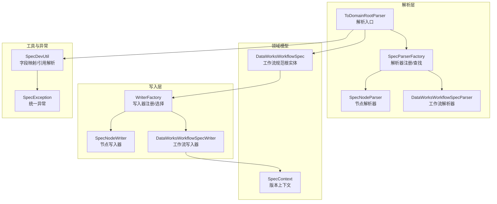
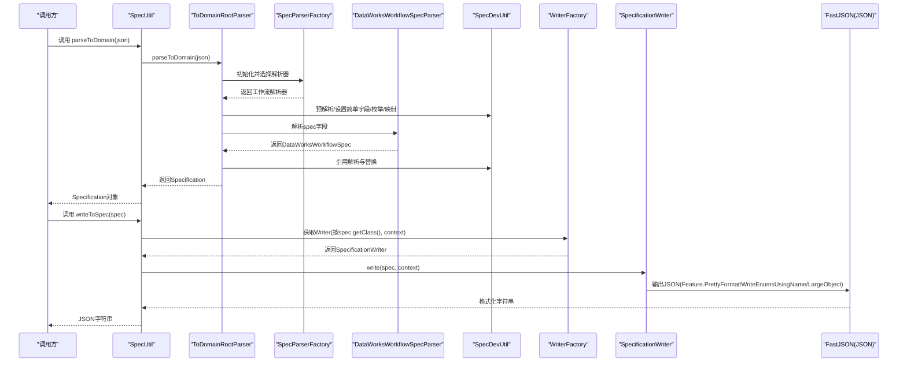
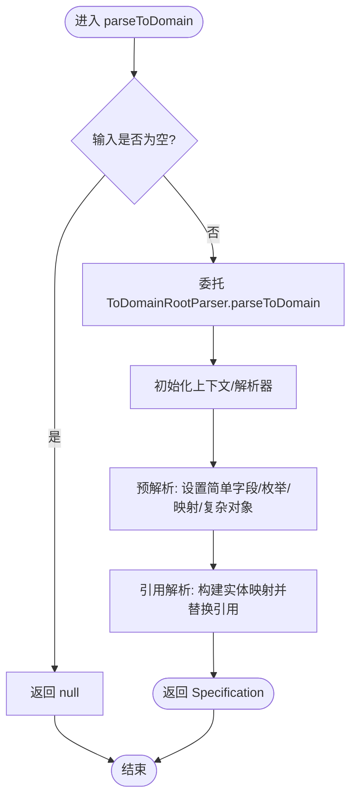
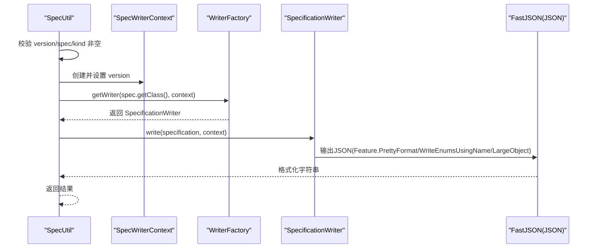
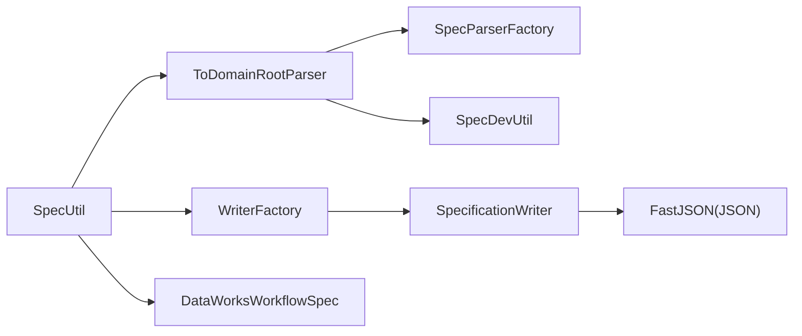

# Spec核心API

<cite>
**本文引用的文件列表**
- [SpecUtil.java](file://spec/src/main/java/com/aliyun/dataworks/common/spec/SpecUtil.java)
- [ToDomainRootParser.java](file://spec/src/main/java/com/aliyun/dataworks/common/spec/parser/ToDomainRootParser.java)
- [SpecParserFactory.java](file://spec/src/main/java/com/aliyun/dataworks/common/spec/parser/SpecParserFactory.java)
- [DataWorksWorkflowSpecParser.java](file://spec/src/main/java/com/aliyun/dataworks/common/spec/parser/impl/DataWorksWorkflowSpecParser.java)
- [SpecNodeParser.java](file://spec/src/main/java/com/aliyun/dataworks/common/spec/parser/impl/SpecNodeParser.java)
- [WriterFactory.java](file://spec/src/main/java/com/aliyun/dataworks/common/spec/writer/WriterFactory.java)
- [DataWorksWorkflowSpec.java](file://spec/src/main/java/com/aliyun/dataworks/common/spec/domain/DataWorksWorkflowSpec.java)
- [SpecContext.java](file://spec/src/main/java/com/aliyun/dataworks/common/spec/domain/SpecContext.java)
- [SpecException.java](file://spec/src/main/java/com/aliyun/dataworks/common/spec/exception/SpecException.java)
- [SpecDevUtil.java](file://spec/src/main/java/com/aliyun/dataworks/common/spec/utils/SpecDevUtil.java)
- [SpecUtilTest.java](file://spec/src/test/java/com/aliyun/dataworks/common/spec/SpecUtilTest.java)
- [example.json](file://spec/src/test/resources/example.json)
- [toSpecDemo.json](file://spec/src/test/resources/toSpecDemo.json)
</cite>

## 目录
1. [简介](#简介)
2. [项目结构](#项目结构)
3. [核心组件](#核心组件)
4. [架构总览](#架构总览)
5. [详细组件分析](#详细组件分析)
6. [依赖关系分析](#依赖关系分析)
7. [性能考量](#性能考量)
8. [故障排查指南](#故障排查指南)
9. [结论](#结论)
10. [附录](#附录)

## 简介
本文件聚焦于Spec核心API，系统性阐述以下内容：
- SpecUtil类中parseToDomain()与writeToSpec()方法的职责、流程与异常处理机制
- parseToDomain()如何将JSON字符串解析为DataWorksWorkflowSpec领域对象，包含ToDomainRootParser的初始化、解析阶段、引用替换与异常传播路径
- writeToSpec()如何通过WriterFactory按类名动态加载对应SpecificationWriter，并利用FastJSON特性进行格式化输出（含PrettyFormat、WriteEnumsUsingName、LargeObject）
- 工厂模式：SpecParserFactory与WriterFactory如何基于反射扫描与注解识别解析器/写入器，支持默认解析器与自定义解析器的注册
- SpecContext在序列化过程中的作用及版本控制机制
- 常见问题与解决方案：空指针、解析器未注册、枚举不匹配、字段设置失败等

## 项目结构
围绕Spec核心API的关键模块分布如下：
- 解析层：ToDomainRootParser负责从JSON到Specification的完整解析；SpecParserFactory负责解析器注册与查找；具体解析器如DataWorksWorkflowSpecParser、SpecNodeParser等
- 写入层：WriterFactory负责写入器注册与选择；具体写入器如DataWorksWorkflowSpecWriter、SpecNodeWriter等
- 领域模型：DataWorksWorkflowSpec作为工作流规范的根实体
- 工具与异常：SpecDevUtil提供字段映射、引用解析、对象生成等通用能力；SpecException统一异常封装
- 上下文：SpecContext承载版本信息，影响序列化行为

图表来源
- [ToDomainRootParser.java](file://spec/src/main/java/com/aliyun/dataworks/common/spec/parser/ToDomainRootParser.java#L62-L120)
- [SpecParserFactory.java](file://spec/src/main/java/com/aliyun/dataworks/common/spec/parser/SpecParserFactory.java#L37-L86)
- [DataWorksWorkflowSpecParser.java](file://spec/src/main/java/com/aliyun/dataworks/common/spec/parser/impl/DataWorksWorkflowSpecParser.java#L31-L55)
- [SpecNodeParser.java](file://spec/src/main/java/com/aliyun/dataworks/common/spec/parser/impl/SpecNodeParser.java#L50-L149)
- [WriterFactory.java](file://spec/src/main/java/com/aliyun/dataworks/common/spec/writer/WriterFactory.java#L35-L86)
- [DataWorksWorkflowSpec.java](file://spec/src/main/java/com/aliyun/dataworks/common/spec/domain/DataWorksWorkflowSpec.java#L64-L130)
- [SpecContext.java](file://spec/src/main/java/com/aliyun/dataworks/common/spec/domain/SpecContext.java#L18-L30)
- [SpecDevUtil.java](file://spec/src/main/java/com/aliyun/dataworks/common/spec/utils/SpecDevUtil.java#L100-L176)
- [SpecException.java](file://spec/src/main/java/com/aliyun/dataworks/common/spec/exception/SpecException.java#L22-L58)

章节来源
- [SpecUtil.java](file://spec/src/main/java/com/aliyun/dataworks/common/spec/SpecUtil.java#L65-L113)
- [ToDomainRootParser.java](file://spec/src/main/java/com/aliyun/dataworks/common/spec/parser/ToDomainRootParser.java#L62-L120)
- [SpecParserFactory.java](file://spec/src/main/java/com/aliyun/dataworks/common/spec/parser/SpecParserFactory.java#L37-L86)
- [WriterFactory.java](file://spec/src/main/java/com/aliyun/dataworks/common/spec/writer/WriterFactory.java#L35-L86)
- [DataWorksWorkflowSpec.java](file://spec/src/main/java/com/aliyun/dataworks/common/spec/domain/DataWorksWorkflowSpec.java#L64-L130)
- [SpecContext.java](file://spec/src/main/java/com/aliyun/dataworks/common/spec/domain/SpecContext.java#L18-L30)
- [SpecDevUtil.java](file://spec/src/main/java/com/aliyun/dataworks/common/spec/utils/SpecDevUtil.java#L100-L176)
- [SpecException.java](file://spec/src/main/java/com/aliyun/dataworks/common/spec/exception/SpecException.java#L22-L58)

## 核心组件
- SpecUtil：对外暴露parseToDomain()与writeToSpec()两大核心方法，封装解析与序列化的入口逻辑
- ToDomainRootParser：解析JSON为Specification的主流程，包含上下文初始化、解析器选择、预解析、引用解析与替换
- SpecParserFactory：静态注册所有解析器，支持默认解析器与自定义解析器，按类名或键类型查找
- WriterFactory：扫描并注册写入器，按目标类型与版本选择合适的SpecificationWriter
- DataWorksWorkflowSpec：工作流规范根实体，承载变量、脚本、节点、触发器、运行资源等
- SpecContext：携带版本信息，影响序列化输出结构（如节点输出字段命名）
- SpecDevUtil：字段映射、枚举设置、引用解析、对象生成等通用能力
- SpecException：统一异常封装，便于定位错误码与消息

章节来源
- [SpecUtil.java](file://spec/src/main/java/com/aliyun/dataworks/common/spec/SpecUtil.java#L65-L113)
- [ToDomainRootParser.java](file://spec/src/main/java/com/aliyun/dataworks/common/spec/parser/ToDomainRootParser.java#L62-L120)
- [SpecParserFactory.java](file://spec/src/main/java/com/aliyun/dataworks/common/spec/parser/SpecParserFactory.java#L37-L86)
- [WriterFactory.java](file://spec/src/main/java/com/aliyun/dataworks/common/spec/writer/WriterFactory.java#L35-L86)
- [DataWorksWorkflowSpec.java](file://spec/src/main/java/com/aliyun/dataworks/common/spec/domain/DataWorksWorkflowSpec.java#L64-L130)
- [SpecContext.java](file://spec/src/main/java/com/aliyun/dataworks/common/spec/domain/SpecContext.java#L18-L30)
- [SpecDevUtil.java](file://spec/src/main/java/com/aliyun/dataworks/common/spec/utils/SpecDevUtil.java#L100-L176)
- [SpecException.java](file://spec/src/main/java/com/aliyun/dataworks/common/spec/exception/SpecException.java#L22-L58)

## 架构总览
下面的时序图展示了从JSON到领域对象再到格式化JSON的完整流程，涵盖异常传播路径与关键决策点。

图表来源
- [SpecUtil.java](file://spec/src/main/java/com/aliyun/dataworks/common/spec/SpecUtil.java#L65-L113)
- [ToDomainRootParser.java](file://spec/src/main/java/com/aliyun/dataworks/common/spec/parser/ToDomainRootParser.java#L62-L120)
- [SpecParserFactory.java](file://spec/src/main/java/com/aliyun/dataworks/common/spec/parser/SpecParserFactory.java#L37-L86)
- [DataWorksWorkflowSpecParser.java](file://spec/src/main/java/com/aliyun/dataworks/common/spec/parser/impl/DataWorksWorkflowSpecParser.java#L31-L55)
- [SpecDevUtil.java](file://spec/src/main/java/com/aliyun/dataworks/common/spec/utils/SpecDevUtil.java#L100-L176)
- [WriterFactory.java](file://spec/src/main/java/com/aliyun/dataworks/common/spec/writer/WriterFactory.java#L66-L86)

## 详细组件分析

### SpecUtil.parseToDomain()：JSON到领域对象的解析
- 入口与前置校验：若输入为null直接返回null；否则委托ToDomainRootParser执行解析
- 关键流程：
  - ToDomainRootParser.parseToDomain()完成上下文初始化、解析器选择、预解析、引用解析与替换
  - 预解析阶段通过SpecDevUtil设置简单字段、枚举、映射与复杂对象
  - 引用解析阶段构建实体映射表，遍历引用上下文，将占位引用替换为真实实体
- 异常处理：
  - 当解析器不支持的kind时抛出SpecException
  - 引用目标缺失时抛出SpecException
  - 字段设置失败、枚举不存在、引用ID格式错误等均会抛出SpecException并携带错误码与消息

图表来源
- [SpecUtil.java](file://spec/src/main/java/com/aliyun/dataworks/common/spec/SpecUtil.java#L65-L113)
- [ToDomainRootParser.java](file://spec/src/main/java/com/aliyun/dataworks/common/spec/parser/ToDomainRootParser.java#L62-L120)
- [SpecDevUtil.java](file://spec/src/main/java/com/aliyun/dataworks/common/spec/utils/SpecDevUtil.java#L100-L176)

章节来源
- [SpecUtil.java](file://spec/src/main/java/com/aliyun/dataworks/common/spec/SpecUtil.java#L65-L113)
- [ToDomainRootParser.java](file://spec/src/main/java/com/aliyun/dataworks/common/spec/parser/ToDomainRootParser.java#L62-L120)
- [SpecDevUtil.java](file://spec/src/main/java/com/aliyun/dataworks/common/spec/utils/SpecDevUtil.java#L100-L176)
- [SpecException.java](file://spec/src/main/java/com/aliyun/dataworks/common/spec/exception/SpecException.java#L22-L58)

### SpecUtil.writeToSpec()：领域对象到格式化JSON的序列化
- 入口与前置校验：若输入为null直接返回null；对version、spec、kind进行非空校验
- 写入流程：
  - 创建SpecWriterContext并设置version
  - 通过WriterFactory按spec.getClass()与context选择合适的SpecificationWriter
  - 若未找到可用写入器则抛出SpecException
  - 使用FastJSON的JSON.toJSONString并启用Feature.PrettyFormat、Feature.WriteEnumsUsingName、Feature.LargeObject输出格式化JSON
- 版本控制：WriterFactory在选择写入器时会依据SpecVersion进行过滤，确保输出符合目标版本约定

图表来源
- [SpecUtil.java](file://spec/src/main/java/com/aliyun/dataworks/common/spec/SpecUtil.java#L79-L95)
- [WriterFactory.java](file://spec/src/main/java/com/aliyun/dataworks/common/spec/writer/WriterFactory.java#L66-L86)

章节来源
- [SpecUtil.java](file://spec/src/main/java/com/aliyun/dataworks/common/spec/SpecUtil.java#L79-L95)
- [WriterFactory.java](file://spec/src/main/java/com/aliyun/dataworks/common/spec/writer/WriterFactory.java#L66-L86)

### ToDomainRootParser：解析器选择与引用替换
- 初始化：从上下文Map中读取kind与version，创建Specification并设置上下文；选择解析器（优先特殊解析器，否则回退默认解析器）
- 预解析：通过SpecDevUtil设置简单字段、枚举、映射与复杂对象
- 引用解析：遍历引用上下文，尝试在实体映射表中查找目标实体；若为特定字段（如output/nodeId）则构造临时实体
- 替换策略：当目标实体存在时直接注入；否则抛出SpecException

章节来源
- [ToDomainRootParser.java](file://spec/src/main/java/com/aliyun/dataworks/common/spec/parser/ToDomainRootParser.java#L62-L120)
- [SpecDevUtil.java](file://spec/src/main/java/com/aliyun/dataworks/common/spec/utils/SpecDevUtil.java#L100-L176)
- [SpecException.java](file://spec/src/main/java/com/aliyun/dataworks/common/spec/exception/SpecException.java#L22-L58)

### SpecParserFactory：解析器工厂模式
- 注册机制：静态块内扫描SpecParser包下的所有实现，实例化后注册到parserMap
- 键值策略：
  - 对DefaultSpecParser子类：使用泛型参数类的getSimpleName作为键
  - 对普通Parser：使用getKeyTypes()返回的键集合注册
  - 对实现类泛型接口的第一个实际类型参数作为键注册
- 查找机制：按解析器名称（通常是类名或键类型）从parserMap中获取

章节来源
- [SpecParserFactory.java](file://spec/src/main/java/com/aliyun/dataworks/common/spec/parser/SpecParserFactory.java#L37-L86)
- [DataWorksWorkflowSpecParser.java](file://spec/src/main/java/com/aliyun/dataworks/common/spec/parser/impl/DataWorksWorkflowSpecParser.java#L31-L55)
- [SpecNodeParser.java](file://spec/src/main/java/com/aliyun/dataworks/common/spec/parser/impl/SpecNodeParser.java#L50-L149)

### WriterFactory：写入器工厂模式
- 扫描策略：先尝试通过类加载器扫描（避免Zip文件关闭导致的栈溢出），再回退到Reflections扫描
- 选择策略：按SpecWriter注解筛选实现类，构造函数注入SpecWriterContext；matchType与support方法共同决定是否匹配
- 版本控制：写入器需支持SpecVersion，WriterFactory在选择时会依据context.version过滤

章节来源
- [WriterFactory.java](file://spec/src/main/java/com/aliyun/dataworks/common/spec/writer/WriterFactory.java#L35-L86)

### DataWorksWorkflowSpec：领域根对象
- 字段覆盖：包含变量、脚本、节点、工作流、触发器、运行资源、数据源、表、数据集成作业等
- 版本兼容：提供getKinds()声明支持的SpecKind集合，用于解析器/写入器的适配

章节来源
- [DataWorksWorkflowSpec.java](file://spec/src/main/java/com/aliyun/dataworks/common/spec/domain/DataWorksWorkflowSpec.java#L64-L130)

### SpecContext：版本上下文
- 作用：承载version信息，影响序列化输出结构（例如节点输出字段在不同版本下的命名差异）
- 使用：WriterFactory在选择写入器时会依据SpecVersion进行过滤

章节来源
- [SpecContext.java](file://spec/src/main/java/com/aliyun/dataworks/common/spec/domain/SpecContext.java#L18-L30)
- [WriterFactory.java](file://spec/src/main/java/com/aliyun/dataworks/common/spec/writer/WriterFactory.java#L66-L86)

### 实际示例与最佳实践
- JSON与领域对象互转示例可参考测试用例：
  - 示例JSON：[example.json](file://spec/src/test/resources/example.json#L1-L214)
  - 简化示例：[toSpecDemo.json](file://spec/src/test/resources/toSpecDemo.json#L1-L42)
  - 测试用例：[SpecUtilTest.java](file://spec/src/test/java/com/aliyun/dataworks/common/spec/SpecUtilTest.java#L110-L180) 展示parseToDomain与writeToSpec的组合使用
- 推荐做法：
  - 在调用writeToSpec前确保spec对象已完整填充version、kind、spec字段
  - 如需自定义解析/写入行为，可通过SpecParser注解/SpecWriter注解注册新解析器/写入器，并保证类名或键类型与工厂注册策略一致

章节来源
- [SpecUtilTest.java](file://spec/src/test/java/com/aliyun/dataworks/common/spec/SpecUtilTest.java#L110-L180)
- [example.json](file://spec/src/test/resources/example.json#L1-L214)
- [toSpecDemo.json](file://spec/src/test/resources/toSpecDemo.json#L1-L42)

## 依赖关系分析
- 组件耦合：
  - SpecUtil依赖ToDomainRootParser、SpecParserFactory、WriterFactory、DataWorksWorkflowSpec
  - ToDomainRootParser依赖SpecParserFactory、SpecDevUtil、SpecException
  - WriterFactory依赖SpecWriter注解、SpecVersion、SpecWriterContext
  - DataWorksWorkflowSpec作为根实体被解析器与写入器广泛使用
- 外部依赖：
  - FastJSON用于序列化（Feature.PrettyFormat、WriteEnumsUsingName、LargeObject）
  - Reflections用于扫描解析器/写入器实现
  - Commons Collections/Text用于集合与字符串处理

图表来源
- [SpecUtil.java](file://spec/src/main/java/com/aliyun/dataworks/common/spec/SpecUtil.java#L65-L113)
- [ToDomainRootParser.java](file://spec/src/main/java/com/aliyun/dataworks/common/spec/parser/ToDomainRootParser.java#L62-L120)
- [SpecParserFactory.java](file://spec/src/main/java/com/aliyun/dataworks/common/spec/parser/SpecParserFactory.java#L37-L86)
- [WriterFactory.java](file://spec/src/main/java/com/aliyun/dataworks/common/spec/writer/WriterFactory.java#L66-L86)
- [DataWorksWorkflowSpec.java](file://spec/src/main/java/com/aliyun/dataworks/common/spec/domain/DataWorksWorkflowSpec.java#L64-L130)

章节来源
- [SpecUtil.java](file://spec/src/main/java/com/aliyun/dataworks/common/spec/SpecUtil.java#L65-L113)
- [ToDomainRootParser.java](file://spec/src/main/java/com/aliyun/dataworks/common/spec/parser/ToDomainRootParser.java#L62-L120)
- [SpecParserFactory.java](file://spec/src/main/java/com/aliyun/dataworks/common/spec/parser/SpecParserFactory.java#L37-L86)
- [WriterFactory.java](file://spec/src/main/java/com/aliyun/dataworks/common/spec/writer/WriterFactory.java#L66-L86)
- [DataWorksWorkflowSpec.java](file://spec/src/main/java/com/aliyun/dataworks/common/spec/domain/DataWorksWorkflowSpec.java#L64-L130)

## 性能考量
- 解析阶段：
  - 反射扫描解析器与实体类型可能带来启动开销；建议在应用启动时提前触发扫描，避免首次请求延迟
  - 预解析与引用解析涉及多次Map操作与集合遍历，建议保持JSON结构简洁、引用层级合理
- 序列化阶段：
  - 启用PrettyFormat会增加输出体积与序列化时间；在生产环境可按需关闭
  - LargeObject与WriteEnumsUsingName对大对象与枚举序列化有额外成本，应结合业务场景权衡

## 故障排查指南
- 空指针异常（NPE）
  - parseToDomain：检查输入JSON是否为null；确认JSON包含version、kind、spec字段
  - writeToSpec：确保传入的specification非null且version、kind、spec均非null
- 解析器未注册错误
  - 现象：抛出SpecException，提示“no available registered writer found for type”
  - 排查：确认目标类是否实现了SpecWriter注解并被WriterFactory扫描到；或确认SpecParserFactory中是否注册了对应解析器
- 枚举不匹配
  - 现象：抛出SpecException，提示枚举不存在
  - 排查：核对JSON中枚举字段的标签值是否与LabelEnum定义一致
- 字段设置失败
  - 现象：抛出SpecException，提示字段设置失败或类型转换错误
  - 排查：核对JSON字段类型与实体字段类型是否一致；检查枚举标签是否正确
- 引用ID格式错误
  - 现象：抛出SpecException，提示引用ID格式不正确
  - 排查：确认引用格式为{{type.id}}或id形式，且type与id合法

章节来源
- [SpecUtil.java](file://spec/src/main/java/com/aliyun/dataworks/common/spec/SpecUtil.java#L79-L95)
- [SpecDevUtil.java](file://spec/src/main/java/com/aliyun/dataworks/common/spec/utils/SpecDevUtil.java#L100-L176)
- [SpecException.java](file://spec/src/main/java/com/aliyun/dataworks/common/spec/exception/SpecException.java#L22-L58)

## 结论
Spec核心API通过SpecUtil提供简洁的入口，结合ToDomainRootParser与WriterFactory实现从JSON到领域对象再到格式化JSON的完整链路。工厂模式与反射扫描确保了解析器与写入器的可扩展性；SpecContext与SpecVersion保障了版本兼容性。遵循本文提供的异常排查与最佳实践，可在大多数场景下稳定地完成JSON与领域对象之间的双向转换。

## 附录
- 实际代码示例（以测试用例为准）：
  - JSON到领域对象：参考[SpecUtilTest.java](file://spec/src/test/java/com/aliyun/dataworks/common/spec/SpecUtilTest.java#L110-L180)
  - 领域对象到JSON：参考[SpecUtilTest.java](file://spec/src/test/java/com/aliyun/dataworks/common/spec/SpecUtilTest.java#L236-L237)
  - 复杂节点与分支：参考[SpecUtilTest.java](file://spec/src/test/java/com/aliyun/dataworks/common/spec/SpecUtilTest.java#L239-L268)
  - 示例JSON文件：[example.json](file://spec/src/test/resources/example.json#L1-L214)、[toSpecDemo.json](file://spec/src/test/resources/toSpecDemo.json#L1-L42)