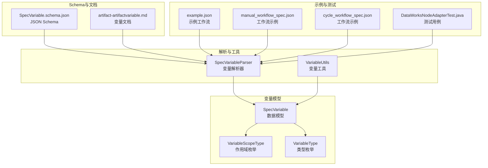
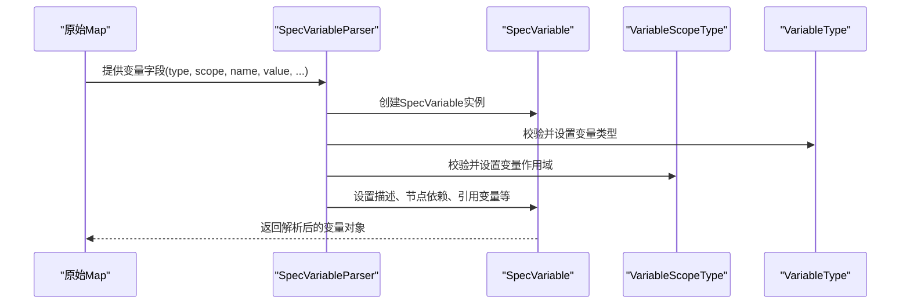
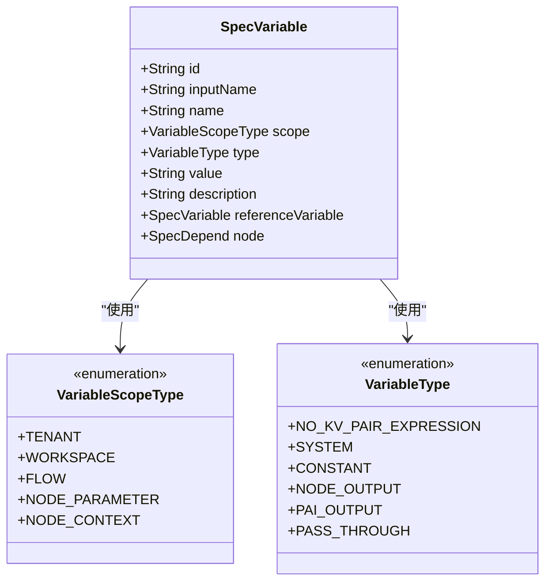
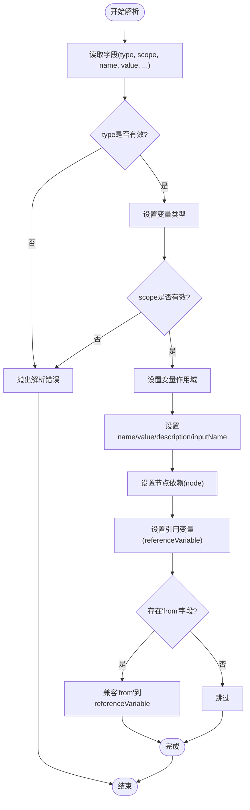
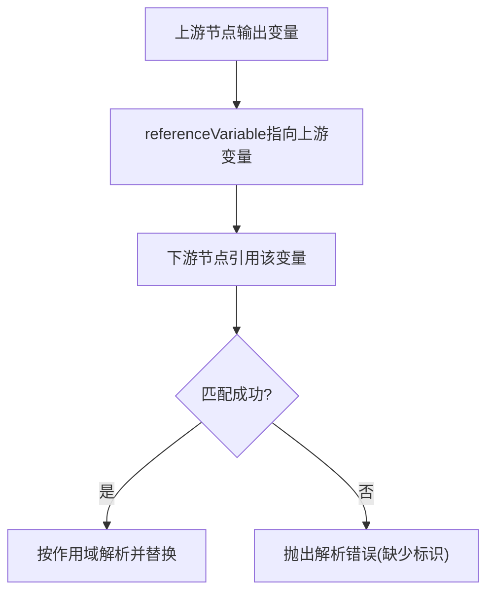
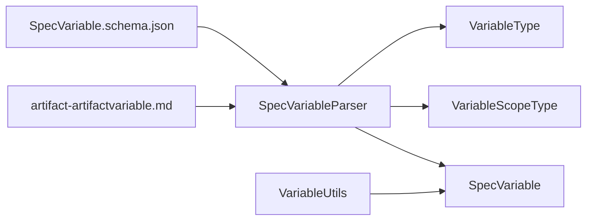

# 变量模型API

<cite>
**本文引用的文件**
- [SpecVariable.java](file://spec/src/main/java/com/aliyun/dataworks/common/spec/domain/ref/SpecVariable.java)
- [SpecVariableParser.java](file://spec/src/main/java/com/aliyun/dataworks/common/spec/parser/impl/SpecVariableParser.java)
- [VariableScopeType.java](file://spec/src/main/java/com/aliyun/dataworks/common/spec/domain/enums/VariableScopeType.java)
- [VariableType.java](file://spec/src/main/java/com/aliyun/dataworks/common/spec/domain/enums/VariableType.java)
- [VariableUtils.java](file://spec/src/main/java/com/aliyun/dataworks/common/spec/utils/VariableUtils.java)
- [SpecVariable.schema.json](file://spec/src/main/resources/spec/schema/SpecVariable.schema.json)
- [artifact-artifactvariable.md](file://schema/docs/artifact-artifactvariable.md)
- [example.json](file://spec/src/test/resources/example.json)
- [manual_workflow_spec.json](file://spec/src/test/resources/copier/manual_workflow_spec.json)
- [cycle_workflow_spec.json](file://spec/src/test/resources/copier/cycle_workflow_spec.json)
- [DataWorksNodeAdapterTest.java](file://spec/src/test/java/com/aliyun/dataworks/common/spec/domain/dw/nodemodel/DataWorksNodeAdapterTest.java)
- [DataWorksNodeInputOutputAdapter.java](file://spec/src/main/java/com/aliyun/dataworks/common/spec/domain/dw/nodemodel/DataWorksNodeInputOutputAdapter.java)
- [spec-fields.md](file://docs/spec/spec-fields.md)
</cite>

## 目录
1. [简介](#简介)
2. [项目结构](#项目结构)
3. [核心组件](#核心组件)
4. [架构总览](#架构总览)
5. [详细组件分析](#详细组件分析)
6. [依赖分析](#依赖分析)
7. [性能考虑](#性能考虑)
8. [故障排查指南](#故障排查指南)
9. [结论](#结论)
10. [附录](#附录)

## 简介
本文件系统性地文档化变量模型API，围绕SpecVariable类展开，覆盖变量的id、name、type、scope、value等核心属性；解释变量在工作流中的作用域机制与继承规则；说明如何在节点代码中通过占位符语法引用变量；给出系统预定义变量的使用方法；并提供创建全局变量与工作流级变量的示例路径，涵盖默认值与动态计算值的配置方式。同时包含变量命名规范、安全存储敏感信息的最佳实践以及变量冲突解决策略。

## 项目结构
变量模型API主要由以下部分组成：
- 数据模型：SpecVariable类及其枚举类型（VariableType、VariableScopeType）
- 解析器：SpecVariableParser负责从原始Map解析变量对象
- 工具类：VariableUtils提供变量解析与分组逻辑
- Schema与文档：SpecVariable.schema.json定义变量的JSON Schema；artifact-artifactvariable.md提供变量字段说明
- 示例与测试：example.json、manual_workflow_spec.json、cycle_workflow_spec.json、DataWorksNodeAdapterTest.java等展示变量的实际用法

图表来源
- [SpecVariable.java](file://spec/src/main/java/com/aliyun/dataworks/common/spec/domain/ref/SpecVariable.java#L1-L56)
- [SpecVariableParser.java](file://spec/src/main/java/com/aliyun/dataworks/common/spec/parser/impl/SpecVariableParser.java#L39-L95)
- [VariableScopeType.java](file://spec/src/main/java/com/aliyun/dataworks/common/spec/domain/enums/VariableScopeType.java#L1-L61)
- [VariableType.java](file://spec/src/main/java/com/aliyun/dataworks/common/spec/domain/enums/VariableType.java#L1-L64)
- [VariableUtils.java](file://spec/src/main/java/com/aliyun/dataworks/common/spec/utils/VariableUtils.java#L1-L74)
- [SpecVariable.schema.json](file://spec/src/main/resources/spec/schema/SpecVariable.schema.json#L1-L53)
- [artifact-artifactvariable.md](file://schema/docs/artifact-artifactvariable.md#L1-L163)
- [example.json](file://spec/src/test/resources/example.json#L1-L214)
- [manual_workflow_spec.json](file://spec/src/test/resources/copier/manual_workflow_spec.json#L543-L624)
- [cycle_workflow_spec.json](file://spec/src/test/resources/copier/cycle_workflow_spec.json#L157-L191)
- [DataWorksNodeAdapterTest.java](file://spec/src/test/java/com/aliyun/dataworks/common/spec/domain/dw/nodemodel/DataWorksNodeAdapterTest.java#L598-L889)

章节来源
- [SpecVariable.java](file://spec/src/main/java/com/aliyun/dataworks/common/spec/domain/ref/SpecVariable.java#L1-L56)
- [SpecVariableParser.java](file://spec/src/main/java/com/aliyun/dataworks/common/spec/parser/impl/SpecVariableParser.java#L39-L95)
- [VariableScopeType.java](file://spec/src/main/java/com/aliyun/dataworks/common/spec/domain/enums/VariableScopeType.java#L1-L61)
- [VariableType.java](file://spec/src/main/java/com/aliyun/dataworks/common/spec/domain/enums/VariableType.java#L1-L64)
- [VariableUtils.java](file://spec/src/main/java/com/aliyun/dataworks/common/spec/utils/VariableUtils.java#L1-L74)
- [SpecVariable.schema.json](file://spec/src/main/resources/spec/schema/SpecVariable.schema.json#L1-L53)
- [artifact-artifactvariable.md](file://schema/docs/artifact-artifactvariable.md#L1-L163)
- [example.json](file://spec/src/test/resources/example.json#L1-L214)
- [manual_workflow_spec.json](file://spec/src/test/resources/copier/manual_workflow_spec.json#L543-L624)
- [cycle_workflow_spec.json](file://spec/src/test/resources/copier/cycle_workflow_spec.json#L157-L191)
- [DataWorksNodeAdapterTest.java](file://spec/src/test/java/com/aliyun/dataworks/common/spec/domain/dw/nodemodel/DataWorksNodeAdapterTest.java#L598-L889)

## 核心组件
- SpecVariable：变量实体，承载id、name、scope、type、value、description、referenceVariable、node等字段
- VariableScopeType：变量作用域枚举，包括租户级、工作空间级、工作流级、节点参数级、节点上下文级等
- VariableType：变量类型枚举，包括系统变量、常量、节点输出、PassThrough等
- SpecVariableParser：将原始Map解析为SpecVariable对象，处理type、scope、name、value、description、node、referenceVariable等字段
- VariableUtils：提供变量解析与分组逻辑，支持无键值对参数表达式的识别与拆分

章节来源
- [SpecVariable.java](file://spec/src/main/java/com/aliyun/dataworks/common/spec/domain/ref/SpecVariable.java#L1-L56)
- [VariableScopeType.java](file://spec/src/main/java/com/aliyun/dataworks/common/spec/domain/enums/VariableScopeType.java#L1-L61)
- [VariableType.java](file://spec/src/main/java/com/aliyun/dataworks/common/spec/domain/enums/VariableType.java#L1-L64)
- [SpecVariableParser.java](file://spec/src/main/java/com/aliyun/dataworks/common/spec/parser/impl/SpecVariableParser.java#L39-L95)
- [VariableUtils.java](file://spec/src/main/java/com/aliyun/dataworks/common/spec/utils/VariableUtils.java#L1-L74)

## 架构总览
变量模型API在解析阶段将原始Map转换为SpecVariable对象，随后在运行期根据作用域与类型进行变量解析与替换。系统预定义变量通过特定语法在节点代码中引用，工作流与节点层面的变量遵循作用域继承规则。

图表来源
- [SpecVariableParser.java](file://spec/src/main/java/com/aliyun/dataworks/common/spec/parser/impl/SpecVariableParser.java#L39-L95)
- [SpecVariable.java](file://spec/src/main/java/com/aliyun/dataworks/common/spec/domain/ref/SpecVariable.java#L1-L56)
- [VariableScopeType.java](file://spec/src/main/java/com/aliyun/dataworks/common/spec/domain/enums/VariableScopeType.java#L1-L61)
- [VariableType.java](file://spec/src/main/java/com/aliyun/dataworks/common/spec/domain/enums/VariableType.java#L1-L64)

## 详细组件分析

### 类图：变量模型与枚举

图表来源
- [SpecVariable.java](file://spec/src/main/java/com/aliyun/dataworks/common/spec/domain/ref/SpecVariable.java#L1-L56)
- [VariableScopeType.java](file://spec/src/main/java/com/aliyun/dataworks/common/spec/domain/enums/VariableScopeType.java#L1-L61)
- [VariableType.java](file://spec/src/main/java/com/aliyun/dataworks/common/spec/domain/enums/VariableType.java#L1-L64)

章节来源
- [SpecVariable.java](file://spec/src/main/java/com/aliyun/dataworks/common/spec/domain/ref/SpecVariable.java#L1-L56)
- [VariableScopeType.java](file://spec/src/main/java/com/aliyun/dataworks/common/spec/domain/enums/VariableScopeType.java#L1-L61)
- [VariableType.java](file://spec/src/main/java/com/aliyun/dataworks/common/spec/domain/enums/VariableType.java#L1-L64)

### 解析流程：从Map到SpecVariable
- 解析入口：SpecVariableParser.parse
- 关键步骤：
  - 校验并设置type，映射到VariableType
  - 校验并设置scope，映射到VariableScopeType
  - 设置name、value、description、inputName
  - 处理node与referenceVariable字段
  - 兼容“from”字段到referenceVariable
- 错误处理：缺失必填字段或非法type时抛出异常

图表来源
- [SpecVariableParser.java](file://spec/src/main/java/com/aliyun/dataworks/common/spec/parser/impl/SpecVariableParser.java#L39-L95)

章节来源
- [SpecVariableParser.java](file://spec/src/main/java/com/aliyun/dataworks/common/spec/parser/impl/SpecVariableParser.java#L39-L95)

### 作用域机制与继承规则
- 作用域枚举（VariableScopeType）：
  - 租户级(TENANT)、工作空间级(WORKSPACE)、工作流级(FLOW)、节点参数级(NODE_PARAMETER)、节点上下文级(NODE_CONTEXT)
- 继承与可见性：
  - 上游节点的NodeOutput变量可通过referenceVariable在下游节点中引用
  - NodeContext变量通常用于节点间传递，可作为PassThrough或System类型
  - NodeParameter变量用于节点参数传入，常用于脚本参数
- 冲突解决：
  - 通过节点依赖的output标识与变量名匹配，若缺少必要标识则抛出解析错误
  - 在比较两个变量时，优先使用id或节点output+name进行匹配，否则抛错

图表来源
- [DataWorksNodeInputOutputAdapter.java](file://spec/src/main/java/com/aliyun/dataworks/common/spec/domain/dw/nodemodel/DataWorksNodeInputOutputAdapter.java#L196-L234)

章节来源
- [VariableScopeType.java](file://spec/src/main/java/com/aliyun/dataworks/common/spec/domain/enums/VariableScopeType.java#L1-L61)
- [DataWorksNodeInputOutputAdapter.java](file://spec/src/main/java/com/aliyun/dataworks/common/spec/domain/dw/nodemodel/DataWorksNodeInputOutputAdapter.java#L196-L234)

### 系统预定义变量与语法
- 系统变量类型（VariableType.SYSTEM）：用于动态计算日期、时间等
- 语法示例：
  - 使用占位符语法在节点代码中引用变量，如“${yyyymmdd}”
  - 支持表达式形式，如“$[yyyymmdd]”、“$[add_months(yyyymmdd,-12)]”
- 文档与Schema：
  - artifact-artifactvariable.md列出type取值与value示例
  - SpecVariable.schema.json定义字段约束与必填项

章节来源
- [artifact-artifactvariable.md](file://schema/docs/artifact-artifactvariable.md#L93-L163)
- [SpecVariable.schema.json](file://spec/src/main/resources/spec/schema/SpecVariable.schema.json#L1-L53)
- [VariableType.java](file://spec/src/main/java/com/aliyun/dataworks/common/spec/domain/enums/VariableType.java#L1-L64)

### 在节点代码中引用变量
- 引用方式：
  - 在脚本参数中使用“{{variables.xxx}}”或直接使用“${var_name}”占位符
  - 在节点输入/输出中通过变量引用上游节点的输出
- 示例路径：
  - example.json展示了在脚本parameters中引用变量
  - manual_workflow_spec.json与cycle_workflow_spec.json展示了NodeContext变量与PassThrough变量的使用

章节来源
- [example.json](file://spec/src/test/resources/example.json#L47-L71)
- [manual_workflow_spec.json](file://spec/src/test/resources/copier/manual_workflow_spec.json#L543-L624)
- [cycle_workflow_spec.json](file://spec/src/test/resources/copier/cycle_workflow_spec.json#L157-L191)

### 创建全局变量与工作流级变量
- 全局变量（工作空间级）：
  - 在工作流顶层声明variables数组，scope设为“Workspace”，type为“Constant”
  - 示例路径：example.json
- 工作流级变量（工作流级）：
  - 在variables数组中声明scope为“Workflow”的变量
  - 示例路径：manual_workflow_spec.json、cycle_workflow_spec.json
- 默认值与动态计算值：
  - 默认值：type为“Constant”，value为固定字符串
  - 动态计算值：type为“System”，value为表达式形式（如“$[yyyymmdd]”）

章节来源
- [example.json](file://spec/src/test/resources/example.json#L8-L46)
- [manual_workflow_spec.json](file://spec/src/test/resources/copier/manual_workflow_spec.json#L543-L624)
- [cycle_workflow_spec.json](file://spec/src/test/resources/copier/cycle_workflow_spec.json#L157-L191)
- [artifact-artifactvariable.md](file://schema/docs/artifact-artifactvariable.md#L93-L163)

### 变量命名规范与最佳实践
- 命名规范：
  - 使用语义清晰、不与系统保留字冲突的名称
  - 避免使用特殊字符，推荐使用字母、数字与下划线组合
- 安全存储敏感信息：
  - 将敏感信息作为常量变量存储，避免硬编码在脚本中
  - 使用工作流级或工作空间级变量集中管理，便于权限控制与审计
- 冲突解决策略：
  - 明确变量id或节点output+name，确保唯一性
  - 在比较变量时，优先使用id或节点output+name进行匹配，缺失时抛错以避免歧义

章节来源
- [DataWorksNodeInputOutputAdapter.java](file://spec/src/main/java/com/aliyun/dataworks/common/spec/domain/dw/nodemodel/DataWorksNodeInputOutputAdapter.java#L196-L234)

## 依赖分析
- 组件耦合：
  - SpecVariable依赖VariableScopeType与VariableType
  - SpecVariableParser依赖VariableScopeType与VariableType进行校验与设置
  - VariableUtils与SpecVariable配合处理节点参数的变量解析
- 外部依赖：
  - JSON Schema用于字段约束与必填项校验
  - 测试样例与文档用于验证与指导使用

图表来源
- [SpecVariableParser.java](file://spec/src/main/java/com/aliyun/dataworks/common/spec/parser/impl/SpecVariableParser.java#L39-L95)
- [VariableScopeType.java](file://spec/src/main/java/com/aliyun/dataworks/common/spec/domain/enums/VariableScopeType.java#L1-L61)
- [VariableType.java](file://spec/src/main/java/com/aliyun/dataworks/common/spec/domain/enums/VariableType.java#L1-L64)
- [SpecVariable.java](file://spec/src/main/java/com/aliyun/dataworks/common/spec/domain/ref/SpecVariable.java#L1-L56)
- [VariableUtils.java](file://spec/src/main/java/com/aliyun/dataworks/common/spec/utils/VariableUtils.java#L1-L74)
- [SpecVariable.schema.json](file://spec/src/main/resources/spec/schema/SpecVariable.schema.json#L1-L53)
- [artifact-artifactvariable.md](file://schema/docs/artifact-artifactvariable.md#L1-L163)

章节来源
- [SpecVariableParser.java](file://spec/src/main/java/com/aliyun/dataworks/common/spec/parser/impl/SpecVariableParser.java#L39-L95)
- [VariableScopeType.java](file://spec/src/main/java/com/aliyun/dataworks/common/spec/domain/enums/VariableScopeType.java#L1-L61)
- [VariableType.java](file://spec/src/main/java/com/aliyun/dataworks/common/spec/domain/enums/VariableType.java#L1-L64)
- [SpecVariable.schema.json](file://spec/src/main/resources/spec/schema/SpecVariable.schema.json#L1-L53)
- [artifact-artifactvariable.md](file://schema/docs/artifact-artifactvariable.md#L1-L163)

## 性能考虑
- 解析阶段的复杂度主要取决于变量数量与嵌套引用深度，建议：
  - 合理拆分变量，避免过深的引用链
  - 对大量变量采用批量解析与缓存策略
  - 在节点参数解析中，尽量使用简单表达式，减少运行期计算开销

## 故障排查指南
- 常见问题与定位：
  - 缺少必填字段：检查type、scope、name、artifactType是否齐全
  - 作用域不匹配：确认变量scope与使用位置一致
  - 引用变量缺失：检查referenceVariable与node字段是否完整
  - 冲突或重复：通过id或节点output+name进行唯一性校验
- 相关错误抛出位置：
  - 解析器在字段缺失或非法type时抛出异常
  - IO适配器在变量标识缺失时抛出解析错误

章节来源
- [SpecVariableParser.java](file://spec/src/main/java/com/aliyun/dataworks/common/spec/parser/impl/SpecVariableParser.java#L61-L95)
- [DataWorksNodeInputOutputAdapter.java](file://spec/src/main/java/com/aliyun/dataworks/common/spec/domain/dw/nodemodel/DataWorksNodeInputOutputAdapter.java#L196-L234)

## 结论
变量模型API通过SpecVariable与相关枚举、解析器、工具类形成完整的变量生命周期管理：从定义、解析、作用域继承到运行期替换。系统预定义变量与表达式语法为动态计算提供了灵活性；通过明确的作用域与冲突解决策略，保证了变量在工作流中的可维护性与可审计性。建议在实际使用中遵循命名规范、集中管理敏感信息，并结合示例与测试文件进行验证。

## 附录
- 变量字段与Schema约束参考：
  - artifact-artifactvariable.md
  - SpecVariable.schema.json
- 示例与测试参考：
  - example.json
  - manual_workflow_spec.json
  - cycle_workflow_spec.json
  - DataWorksNodeAdapterTest.java
- 相关字段说明参考：
  - spec-fields.md（variables、scripts、nodes等）

章节来源
- [artifact-artifactvariable.md](file://schema/docs/artifact-artifactvariable.md#L1-L163)
- [SpecVariable.schema.json](file://spec/src/main/resources/spec/schema/SpecVariable.schema.json#L1-L53)
- [example.json](file://spec/src/test/resources/example.json#L1-L214)
- [manual_workflow_spec.json](file://spec/src/test/resources/copier/manual_workflow_spec.json#L543-L624)
- [cycle_workflow_spec.json](file://spec/src/test/resources/copier/cycle_workflow_spec.json#L157-L191)
- [DataWorksNodeAdapterTest.java](file://spec/src/test/java/com/aliyun/dataworks/common/spec/domain/dw/nodemodel/DataWorksNodeAdapterTest.java#L598-L889)
- [spec-fields.md](file://docs/spec/spec-fields.md#L59-L107)