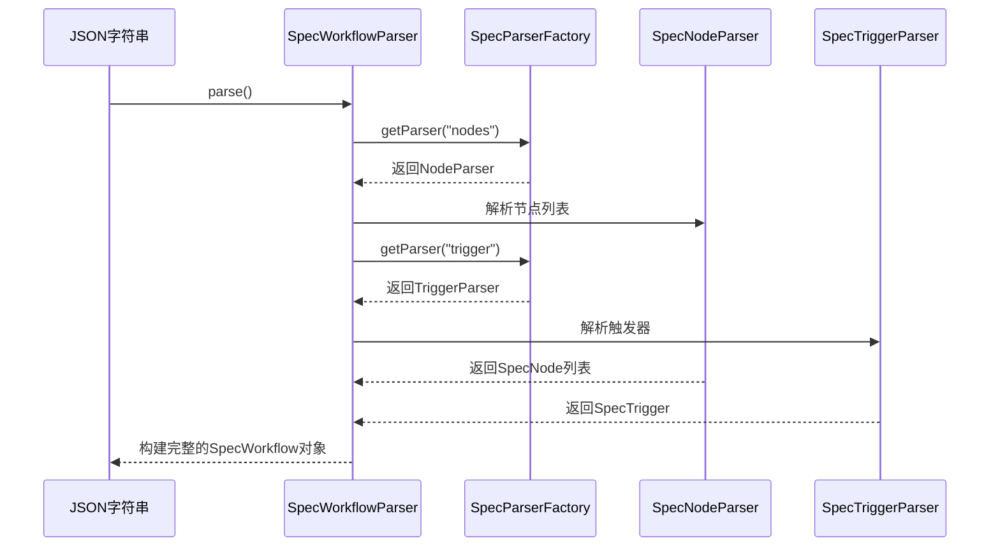

# 工作流模型API

<cite>
**本文档引用的文件**   
- [DataWorksWorkflowSpec.java](file://spec/src/main/java/com/aliyun/dataworks/common/spec/domain/DataWorksWorkflowSpec.java)
- [SpecWorkflow.java](file://spec/src/main/java/com/aliyun/dataworks/common/spec/domain/ref/SpecWorkflow.java)
- [SpecKind.java](file://spec/src/main/java/com/aliyun/dataworks/common/spec/domain/enums/SpecKind.java)
- [SpecUtil.java](file://spec/src/main/java/com/aliyun/dataworks/common/spec/SpecUtil.java)
- [SpecWorkflowParser.java](file://spec/src/main/java/com/aliyun/dataworks/common/spec/parser/impl/SpecWorkflowParser.java)
- [SpecWorkflowWriter.java](file://spec/src/main/java/com/aliyun/dataworks/common/spec/writer/impl/SpecWorkflowWriter.java)
- [SpecWorkflow.schema.json](file://spec/src/main/resources/spec/schema/SpecWorkflow.schema.json)
- [cycle_workflow_spec.json](file://spec/src/test/resources/copier/cycle_workflow_spec.json)
- [manual_workflow_spec.json](file://spec/src/test/resources/copier/manual_workflow_spec.json)
</cite>

## 目录
1. [简介](#简介)
2. [SpecWorkflow类设计](#specworkflow类设计)
3. [核心属性与编排字段](#核心属性与编排字段)
4. [工作流类型语义](#工作流类型语义)
5. [代码示例](#代码示例)
6. [关联关系与反序列化](#关联关系与反序列化)
7. [最佳实践](#最佳实践)

## 简介
本文档详细介绍了DataWorks规范库中的工作流模型API，重点分析`SpecWorkflow`类的设计与实现。`SpecWorkflow`作为工作流的顶级容器，定义了工作流的核心结构和行为。文档将阐述其基础属性、核心编排字段、14种工作流类型的语义差异，并提供创建周期性工作流和手动工作流的代码示例。

## SpecWorkflow类设计
`SpecWorkflow`类是工作流模型的核心，它继承自`SpecRefEntity`，并实现了`Container`、`InputOutputWired`和`ScriptWired`接口，表明它是一个可以包含节点、定义输入输出并关联脚本的容器。

```mermaid
classDiagram
class SpecRefEntity {
+String id
+Map<String, Object> metadata
}
class Container {
<<interface>>
+List<SpecNode> getInnerNodes()
+List<SpecFlowDepend> getInnerDependencies()
}
class InputOutputWired {
<<interface>>
+List<Input> inputs
+List<Output> outputs
}
class ScriptWired {
<<interface>>
+SpecScript script
}
class SpecWorkflow {
+SpecScript script
+SpecTrigger trigger
+List<Input> inputs
+List<Output> outputs
+SpecScheduleStrategy strategy
+List<SpecNode> nodes
+List<SpecFlowDepend> dependencies
+String type
+String name
+String owner
+String description
+Boolean citable
}
SpecWorkflow --|> SpecRefEntity
SpecWorkflow ..|> Container
SpecWorkflow ..|> InputOutputWired
SpecWorkflow ..|> ScriptWired
```



**Diagram sources**
- [SpecWorkflow.java](file://spec/src/main/java/com/aliyun/dataworks/common/spec/domain/ref/SpecWorkflow.java)

**Section sources**
- [SpecWorkflow.java](file://spec/src/main/java/com/aliyun/dataworks/common/spec/domain/ref/SpecWorkflow.java)

## 核心属性与编排字段
`SpecWorkflow`类定义了工作流的基础属性和用于编排的核心字段。

### 基础属性
- **id**: 工作流的唯一标识符。
- **name**: 工作流的名称。
- **description**: 工作流的描述信息。
- **owner**: 工作流的所有者。
- **type**: 工作流的类型（如`CycleWorkflow`, `ManualWorkflow`）。
- **citable**: 指示该工作流是否可被其他工作流引用。

### 核心编排字段
- **flow**: 定义了工作流中节点的依赖关系，是一个`SpecFlowDepend`对象的列表。每个`SpecFlowDepend`指定了一个目标节点（`nodeId`）及其依赖的节点列表（`depends`）。
- **dependencies**: 与`flow`字段互为别名，二者指向同一列表，用于保持向后兼容性。
- **nodes**: 工作流中包含的节点列表，每个节点代表一个可执行的任务。
- **triggers**: 触发器列表，定义了工作流的触发方式（如定时调度、手动触发）。
- **strategy**: 调度策略，定义了工作流的超时时间、重试模式、失败策略等。

**Section sources**
- [SpecWorkflow.java](file://spec/src/main/java/com/aliyun/dataworks/common/spec/domain/ref/SpecWorkflow.java)
- [SpecWorkflow.schema.json](file://spec/src/main/resources/spec/schema/SpecWorkflow.schema.json)

## 工作流类型语义
`DataWorksWorkflowSpec`类通过`getKinds()`方法返回所有支持的工作流类型。这些类型定义在`SpecKind`枚举中，每种类型都有其特定的语义和使用场景。

### 14种工作流类型
| 类型 | 枚举值 | 语义差异与使用场景 |
| :--- | :--- | :--- |
| **周期性工作流** | `CYCLE_WORKFLOW` | 按照预定义的Cron表达式周期性自动执行，适用于数据定时处理任务。 |
| **手动工作流** | `MANUAL_WORKFLOW` | 需要用户手动触发执行，适用于临时性或需要人工干预的任务。 |
| **触发式工作流** | `TRIGGER_WORKFLOW` | 由外部事件（如文件上传、消息队列）触发执行。 |
| **手动节点** | `MANUAL_NODE` | 单个需要手动执行的节点，通常作为工作流的一部分。 |
| **临时工作流** | `TEMPORARY_WORKFLOW` | 一次性或临时创建的工作流，不进行持久化存储。 |
| **PAI工作流** | `PAIFLOW` | 专用于机器学习任务的编排工作流。 |
| **批量部署** | `BATCH_DEPLOYMENT` | 用于批量部署应用或服务的工作流。 |
| **数据源** | `DATASOURCE` | 代表一个数据源的配置。 |
| **数据质量** | `DATA_QUALITY` | 用于数据质量检查和监控的工作流。 |
| **数据目录** | `DATA_CATALOG` | 用于管理数据资产目录。 |
| **组件** | `COMPONENT` | 代表一个可复用的组件。 |
| **节点** | `NODE` | 代表一个工作流中的执行单元。 |
| **资源** | `RESOURCE` | 代表一个计算或存储资源。 |
| **函数** | `FUNCTION` | 代表一个可调用的函数。 |
| **表** | `TABLE` | 代表一个数据表。 |
| **数据集成任务** | `DATA_INTEGRATION_JOB` | 用于数据同步和集成的任务。 |

**Section sources**
- [DataWorksWorkflowSpec.java](file://spec/src/main/java/com/aliyun/dataworks/common/spec/domain/DataWorksWorkflowSpec.java)
- [SpecKind.java](file://spec/src/main/java/com/aliyun/dataworks/common/spec/domain/enums/SpecKind.java)

## 代码示例
以下示例展示了如何创建周期性工作流和手动工作流，并使用`SpecUtil.writeToSpec()`方法将其序列化为JSON。

### 创建周期性工作流
```java
// 创建一个周期性工作流
SpecWorkflow cycleWorkflow = new SpecWorkflow();
cycleWorkflow.setName("DailyETL");
cycleWorkflow.setType("CycleWorkflow");
cycleWorkflow.setDescription("每日ETL任务");
cycleWorkflow.setOwner("user@example.com");

// 设置调度策略
SpecScheduleStrategy strategy = new SpecScheduleStrategy();
strategy.setCron("0 0 2 * * ?");
cycleWorkflow.setStrategy(strategy);

// ... 添加节点和依赖关系

// 序列化为JSON
String json = SpecUtil.writeToSpec(cycleWorkflow);
```

### 创建手动工作流
```java
// 创建一个手动工作流
SpecWorkflow manualWorkflow = new SpecWorkflow();
manualWorkflow.setName("AdHocAnalysis");
manualWorkflow.setType("ManualWorkflow");
manualWorkflow.setDescription("临时分析任务");
manualWorkflow.setOwner("user@example.com");

// 设置触发器为手动
SpecTrigger trigger = new SpecTrigger();
trigger.setType("Manual");
manualWorkflow.setTrigger(trigger);

// ... 添加节点和依赖关系

// 序列化为JSON
String json = SpecUtil.writeToSpec(manualWorkflow);
```

**Section sources**
- [SpecUtil.java](file://spec/src/main/java/com/aliyun/dataworks/common/spec/SpecUtil.java)
- [cycle_workflow_spec.json](file://spec/src/test/resources/copier/cycle_workflow_spec.json)
- [manual_workflow_spec.json](file://spec/src/test/resources/copier/manual_workflow_spec.json)

## 关联关系与反序列化
`SpecWorkflow`与`SpecNode`、`SpecTrigger`等类之间存在紧密的关联关系。在反序列化过程中，系统能够自动识别这些类型。

### 关联关系
- **SpecWorkflow 与 SpecNode**: `SpecWorkflow`通过`nodes`字段包含一个`SpecNode`列表，形成一对多的关系。
- **SpecWorkflow 与 SpecTrigger**: `SpecWorkflow`通过`trigger`字段关联一个`SpecTrigger`，形成一对一的关系。

### 反序列化类型自动识别
反序列化过程由`SpecWorkflowParser`负责。它利用Java的反射机制和自定义的解析器工厂（`SpecParserFactory`），根据JSON中的字段名自动选择正确的解析器来处理`SpecNode`、`SpecTrigger`等嵌套对象，从而实现类型的自动识别。



**Diagram sources**
- [SpecWorkflowParser.java](file://spec/src/main/java/com/aliyun/dataworks/common/spec/parser/impl/SpecWorkflowParser.java)
- [SpecParserFactory.java](file://spec/src/main/java/com/aliyun/dataworks/common/spec/parser/SpecParserFactory.java)

**Section sources**
- [SpecWorkflowParser.java](file://spec/src/main/java/com/aliyun/dataworks/common/spec/parser/impl/SpecWorkflowParser.java)
- [SpecNode.java](file://spec/src/main/java/com/aliyun/dataworks/common/spec/domain/ref/SpecNode.java)
- [SpecTrigger.java](file://spec/src/main/java/com/aliyun/dataworks/common/spec/domain/ref/SpecTrigger.java)

## 最佳实践
### 工作流版本管理
- 使用`version`字段来管理工作流的不同版本。
- 在更新工作流时，递增版本号以确保可追溯性。

### 元数据校验
- 在序列化前，使用`SpecValidateUtil`对`SpecWorkflow`对象进行校验，确保所有必填字段都已设置且符合规范。
- 利用JSON Schema（如`SpecWorkflow.schema.json`）对生成的JSON进行格式校验。

**Section sources**
- [SpecUtil.java](file://spec/src/main/java/com/aliyun/dataworks/common/spec/SpecUtil.java)
- [SpecWorkflow.schema.json](file://spec/src/main/resources/spec/schema/SpecWorkflow.schema.json)