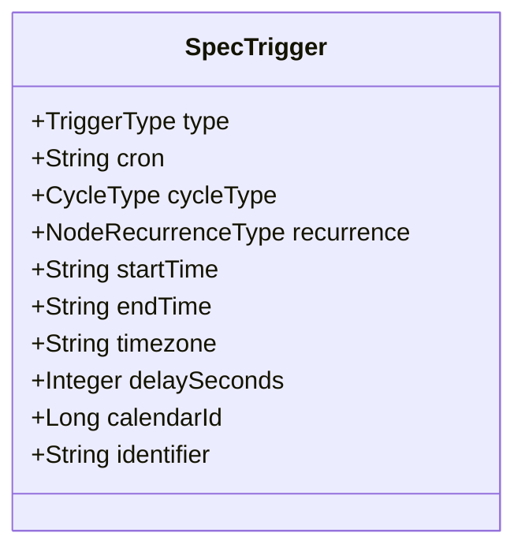
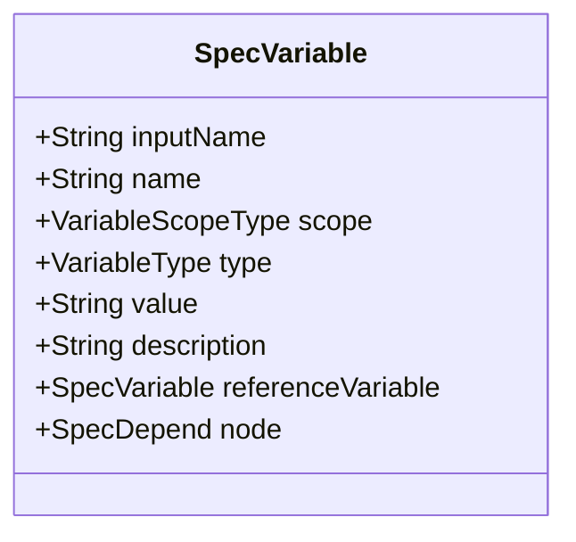
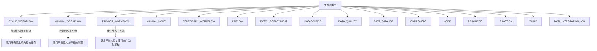
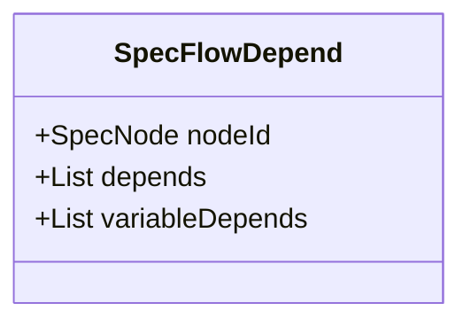

# 数据模型API

<cite>
**本文档引用的文件**
- [DataWorksWorkflowSpec.java](file://spec/src/main/java/com/aliyun/dataworks/common/spec/domain/DataWorksWorkflowSpec.java)
- [SpecNode.java](file://spec/src/main/java/com/aliyun/dataworks/common/spec/domain/ref/SpecNode.java)
- [SpecWorkflow.java](file://spec/src/main/java/com/aliyun/dataworks/common/spec/domain/ref/SpecWorkflow.java)
- [SpecTrigger.java](file://spec/src/main/java/com/aliyun/dataworks/common/spec/domain/ref/SpecTrigger.java)
- [SpecVariable.java](file://spec/src/main/java/com/aliyun/dataworks/common/spec/domain/ref/SpecVariable.java)
- [SpecFlowDepend.java](file://spec/src/main/java/com/aliyun/dataworks/common/spec/domain/noref/SpecFlowDepend.java)
- [DataWorksWorkflowSpec.schema.json](file://spec/src/main/resources/spec/schema/DataWorksWorkflowSpec.schema.json)
- [SpecWorkflow.schema.json](file://spec/src/main/resources/spec/schema/SpecWorkflow.schema.json)
- [SpecTrigger.schema.json](file://spec/src/main/resources/spec/schema/SpecTrigger.schema.json)
- [SpecVariable.schema.json](file://spec/src/main/resources/spec/schema/SpecVariable.schema.json)
- [SpecFlowDepend.schema.json](file://spec/src/main/resources/spec/schema/SpecFlowDepend.schema.json)
</cite>

## 目录
1. [简介](#简介)
2. [核心数据结构](#核心数据结构)
3. [工作流类型说明](#工作流类型说明)
4. [依赖关系模型](#依赖关系模型)
5. [JSON Schema与Java类映射](#json-schema与java类映射)
6. [代码示例](#代码示例)
7. [最佳实践](#最佳实践)

## 简介
DataWorks工作流规范（DataWorksWorkflowSpec）是用于定义和管理数据工作流的核心数据模型。该模型提供了一套完整的API，用于描述工作流的各个组成部分，包括节点、触发器、变量和依赖关系等。本文档详细说明了DataWorksWorkflowSpec核心数据结构及其包含的各个子模型。

## 核心数据结构

### DataWorksWorkflowSpec
DataWorksWorkflowSpec是工作流规范的根对象，包含了工作流的所有配置信息。其主要字段包括：

- **name**: 工作流名称
- **type**: 工作流类型
- **strategy**: 调度策略
- **owner**: 所有者
- **description**: 描述信息
- **variables**: 变量列表
- **triggers**: 触发器列表
- **scripts**: 脚本列表
- **files**: 文件列表
- **artifacts**: 构件列表
- **datasources**: 数据源列表
- **dqcRules**: 数据质量规则列表
- **runtimeResources**: 运行时资源列表
- **fileResources**: 文件资源列表
- **functions**: 函数列表
- **nodes**: 节点列表
- **workflows**: 子工作流列表
- **components**: 组件列表
- **flow**: 流程依赖关系
- **dependencies**: 依赖关系
- **tables**: 表列表
- **dataIntegrationJobs**: 数据集成作业列表

**Section sources**
- [DataWorksWorkflowSpec.java](file://spec/src/main/java/com/aliyun/dataworks/common/spec/domain/DataWorksWorkflowSpec.java#L67-L89)

### SpecNode
SpecNode表示工作流中的任务节点，是工作流的基本执行单元。每个节点可以包含输入、输出、脚本、触发器等属性。

```mermaid
classDiagram
class SpecNode {
+NodeRecurrenceType recurrence
+Integer priority
+Integer timeout
+TimeUnit timeoutUnit
+NodeInstanceModeType instanceMode
+NodeRerunModeType rerunMode
+Integer rerunTimes
+Integer rerunInterval
+Boolean ignoreBranchConditionSkip
+Boolean autoParse
+SpecDatasource datasource
+List<SpecDataset> datasets
+SpecScript script
+SpecTrigger trigger
+SpecRuntimeResource runtimeResource
+List<SpecFileResource> fileResources
+List<SpecFunction> functions
+List<Input> inputs
+List<Output> outputs
+SpecNodeRef reference
+SpecBranch branch
+SpecJoin join
+SpecDoWhile doWhile
+SpecForEach foreach
+SpecSubFlow combined
+SpecParamHub paramHub
+String name
+String owner
+String description
+SpecComponent component
+SpecScheduleStrategy strategy
+SpecSubFlow subflow
+SpecPaiflow paiflow
}
```



**Diagram sources**
- [SpecNode.java](file://spec/src/main/java/com/aliyun/dataworks/common/spec/domain/ref/SpecNode.java#L53-L146)

**Section sources**
- [SpecNode.java](file://spec/src/main/java/com/aliyun/dataworks/common/spec/domain/ref/SpecNode.java#L53-L146)

### SpecWorkflow
SpecWorkflow表示一个完整的工作流，可以包含多个节点和它们之间的依赖关系。

```mermaid
classDiagram
class SpecWorkflow {
+SpecScript script
+SpecTrigger trigger
+List<Input> inputs
+List<Output> outputs
+SpecScheduleStrategy strategy
+List<SpecNode> nodes
+List<SpecFlowDepend> dependencies
+String type
+String name
+String owner
+String description
+Boolean citable
}
```



**Diagram sources**
- [SpecWorkflow.java](file://spec/src/main/java/com/aliyun/dataworks/common/spec/domain/ref/SpecWorkflow.java#L39-L62)

**Section sources**
- [SpecWorkflow.java](file://spec/src/main/java/com/aliyun/dataworks/common/spec/domain/ref/SpecWorkflow.java#L39-L62)

### SpecTrigger
SpecTrigger定义了工作流的触发条件，支持定时触发和事件触发等多种方式。



**Diagram sources**
- [SpecTrigger.java](file://spec/src/main/java/com/aliyun/dataworks/common/spec/domain/ref/SpecTrigger.java#L32-L51)

**Section sources**
- [SpecTrigger.java](file://spec/src/main/java/com/aliyun/dataworks/common/spec/domain/ref/SpecTrigger.java#L32-L51)

### SpecVariable
SpecVariable表示工作流中使用的变量，用于在不同节点之间传递数据。



**Diagram sources**
- [SpecVariable.java](file://spec/src/main/java/com/aliyun/dataworks/common/spec/domain/ref/SpecVariable.java#L42-L55)

**Section sources**
- [SpecVariable.java](file://spec/src/main/java/com/aliyun/dataworks/common/spec/domain/ref/SpecVariable.java#L42-L55)

## 工作流类型说明

DataWorksWorkflowSpec.getKinds()方法返回14种工作流类型，每种类型适用于不同的场景：



**Diagram sources**
- [DataWorksWorkflowSpec.java](file://spec/src/main/java/com/aliyun/dataworks/common/spec/domain/DataWorksWorkflowSpec.java#L112-L128)

**Section sources**
- [DataWorksWorkflowSpec.java](file://spec/src/main/java/com/aliyun/dataworks/common/spec/domain/DataWorksWorkflowSpec.java#L112-L128)

## 依赖关系模型

### SpecFlowDepend
SpecFlowDepend模型用于定义工作流中节点之间的依赖关系，支持复杂的编排逻辑。



**Diagram sources**
- [SpecFlowDepend.java](file://spec/src/main/java/com/aliyun/dataworks/common/spec/domain/noref/SpecFlowDepend.java#L34-L39)

**Section sources**
- [SpecFlowDepend.java](file://spec/src/main/java/com/aliyun/dataworks/common/spec/domain/noref/SpecFlowDepend.java#L34-L39)

### 双向绑定机制
SpecFlowDepend模型中的flow和dependencies字段实现了双向绑定机制：

```java
public DataWorksWorkflowSpec setFlow(List<SpecFlowDepend> flow) {
    this.flow = flow;
    this.dependencies = flow;
    return this;
}

public DataWorksWorkflowSpec setDependencies(List<SpecFlowDepend> dependencies) {
    this.dependencies = dependencies;
    this.flow = dependencies;
    return this;
}
```

这种设计确保了flow和dependencies始终保持同步，简化了API的使用。

**Section sources**
- [DataWorksWorkflowSpec.java](file://spec/src/main/java/com/aliyun/dataworks/common/spec/domain/DataWorksWorkflowSpec.java#L90-L99)

## JSON Schema与Java类映射

### 映射关系
JSON Schema与Java类之间存在明确的映射关系，以下是一些关键字段的映射：

| JSON Schema字段 | Java类字段 | 数据类型 | 说明 |
|----------------|-----------|---------|------|
| name | name | string | 工作流名称 |
| type | type | string | 工作流类型 |
| strategy | strategy | object | 调度策略 |
| owner | owner | string | 所有者 |
| description | description | string | 描述信息 |
| variables | variables | array | 变量列表 |
| triggers | triggers | array | 触发器列表 |
| nodes | nodes | array | 节点列表 |
| flow/dependencies | flow/dependencies | array | 依赖关系 |

### Lombok注解使用
在Java类中使用了Lombok注解来简化代码：

- **@Data**: 自动生成getter、setter、toString、equals和hashCode方法
- **@EqualsAndHashCode**: 控制equals和hashCode方法的生成，支持callSuper参数继承父类的比较逻辑

这些注解减少了样板代码，提高了开发效率。

**Section sources**
- [DataWorksWorkflowSpec.java](file://spec/src/main/java/com/aliyun/dataworks/common/spec/domain/DataWorksWorkflowSpec.java#L64-L65)
- [SpecNode.java](file://spec/src/main/java/com/aliyun/dataworks/common/spec/domain/ref/SpecNode.java#L50-L51)

## 代码示例

以下是一个创建完整工作流规范的代码示例：

```java
DataWorksWorkflowSpec workflowSpec = new DataWorksWorkflowSpec();
workflowSpec.setName("示例工作流");
workflowSpec.setType("CYCLE_WORKFLOW");
workflowSpec.setOwner("admin");

// 添加变量
List<SpecVariable> variables = new ArrayList<>();
SpecVariable var = new SpecVariable();
var.setName("date");
var.setType(VariableType.SYSTEM);
var.setScope(VariableScopeType.WORKFLOW);
variables.add(var);
workflowSpec.setVariables(variables);

// 添加触发器
List<SpecTrigger> triggers = new ArrayList<>();
SpecTrigger trigger = new SpecTrigger();
trigger.setType(TriggerType.SCHEDULED);
trigger.setCron("0 0 12 * * ?");
triggers.add(trigger);
workflowSpec.setTriggers(triggers);

// 添加节点
List<SpecNode> nodes = new ArrayList<>();
SpecNode node = new SpecNode();
node.setName("数据处理节点");
node.setRecurrence(NodeRecurrenceType.DAILY);
node.setTimeout(60);
nodes.add(node);
workflowSpec.setNodes(nodes);

// 设置依赖关系
List<SpecFlowDepend> dependencies = new ArrayList<>();
SpecFlowDepend depend = new SpecFlowDepend();
depend.setNodeId(node);
dependencies.add(depend);
workflowSpec.setDependencies(dependencies);
```

**Section sources**
- [DataWorksWorkflowSpec.java](file://spec/src/main/java/com/aliyun/dataworks/common/spec/domain/DataWorksWorkflowSpec.java)
- [SpecNode.java](file://spec/src/main/java/com/aliyun/dataworks/common/spec/domain/ref/SpecNode.java)
- [SpecTrigger.java](file://spec/src/main/java/com/aliyun/dataworks/common/spec/domain/ref/SpecTrigger.java)
- [SpecVariable.java](file://spec/src/main/java/com/aliyun/dataworks/common/spec/domain/ref/SpecVariable.java)
- [SpecFlowDepend.java](file://spec/src/main/java/com/aliyun/dataworks/common/spec/domain/noref/SpecFlowDepend.java)

## 最佳实践

### 模型验证
在创建工作流规范时，应进行充分的模型验证：

1. 确保必填字段都已设置
2. 验证字段值的合法性
3. 检查依赖关系的完整性
4. 确认调度策略的合理性

### 必填字段检查
以下字段为必填字段：

- name: 工作流名称
- type: 工作流类型
- nodes: 节点列表
- triggers: 触发器列表（对于周期性工作流）

### 性能优化建议
1. 合理设置节点优先级
2. 配置适当的超时时间
3. 优化依赖关系，避免循环依赖
4. 使用批量操作减少API调用次数

**Section sources**
- [DataWorksWorkflowSpec.schema.json](file://spec/src/main/resources/spec/schema/DataWorksWorkflowSpec.schema.json)
- [SpecWorkflow.schema.json](file://spec/src/main/resources/spec/schema/SpecWorkflow.schema.json)
- [SpecTrigger.schema.json](file://spec/src/main/resources/spec/schema/SpecTrigger.schema.json)
- [SpecVariable.schema.json](file://spec/src/main/resources/spec/schema/SpecVariable.schema.json)
- [SpecFlowDepend.schema.json](file://spec/src/main/resources/spec/schema/SpecFlowDepend.schema.json)