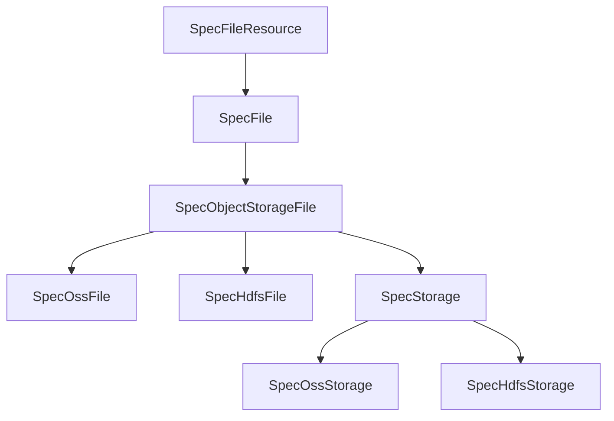
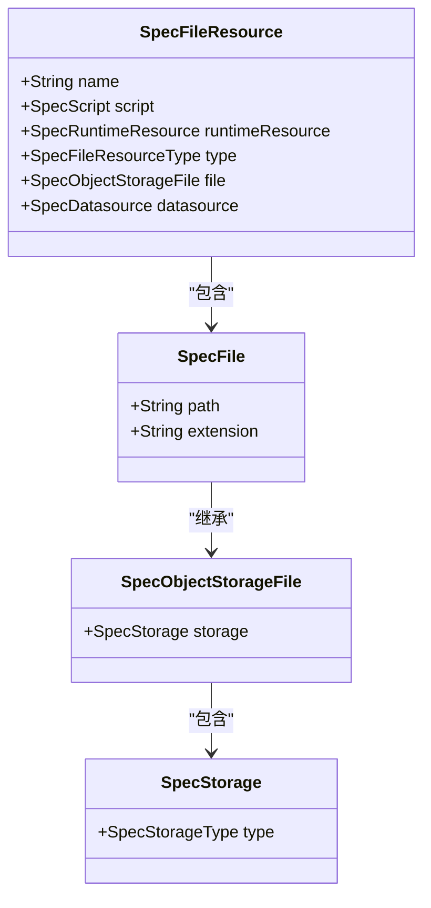
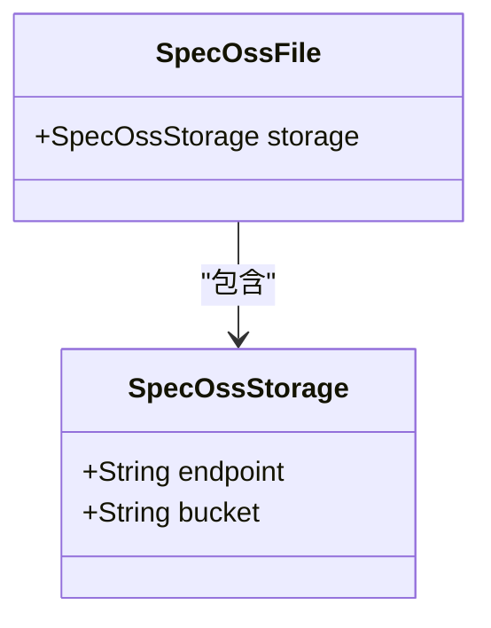
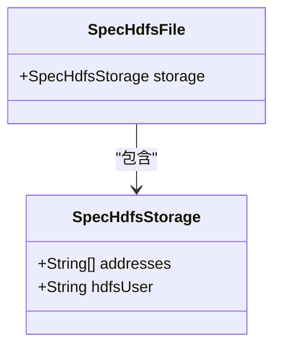
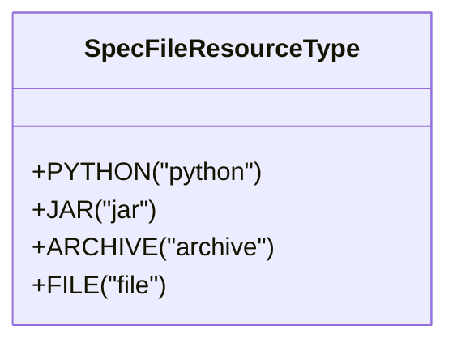
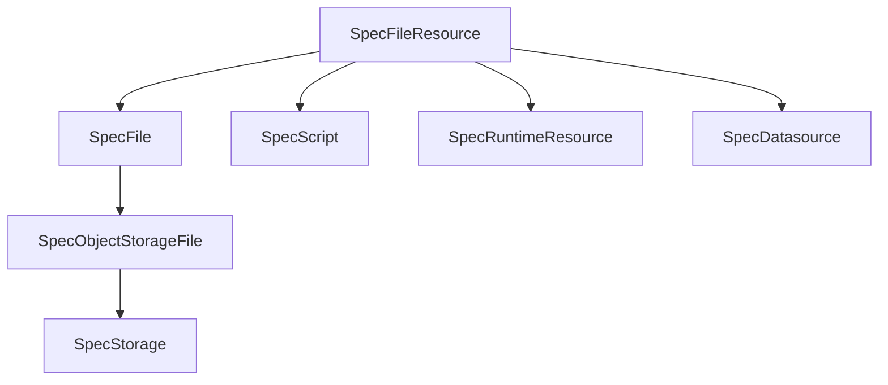

# 文件资源模型API

<cite>
**本文档引用的文件**
- [SpecFileResource.java](file://spec/src/main/java/com/aliyun/dataworks/common/spec/domain/ref/SpecFileResource.java)
- [SpecFile.java](file://spec/src/main/java/com/aliyun/dataworks/common/spec/domain/ref/SpecFile.java)
- [SpecObjectStorageFile.java](file://spec/src/main/java/com/aliyun/dataworks/common/spec/domain/ref/file/SpecObjectStorageFile.java)
- [SpecOssFile.java](file://spec/src/main/java/com/aliyun/dataworks/common/spec/domain/ref/file/SpecOssFile.java)
- [SpecHdfsFile.java](file://spec/src/main/java/com/aliyun/dataworks/common/spec/domain/ref/file/SpecHdfsFile.java)
- [SpecStorage.java](file://spec/src/main/java/com/aliyun/dataworks/common/spec/domain/ref/storage/SpecStorage.java)
- [SpecOssStorage.java](file://spec/src/main/java/com/aliyun/dataworks/common/spec/domain/ref/storage/SpecOssStorage.java)
- [SpecHdfsStorage.java](file://spec/src/main/java/com/aliyun/dataworks/common/spec/domain/ref/storage/SpecHdfsStorage.java)
- [SpecFileResourceType.java](file://spec/src/main/java/com/aliyun/dataworks/common/spec/domain/enums/SpecFileResourceType.java)
- [SpecFileResourceParser.java](file://spec/src/main/java/com/aliyun/dataworks/common/spec/parser/impl/SpecFileResourceParser.java)
- [SpecObjectStorageFileParser.java](file://spec/src/main/java/com/aliyun/dataworks/common/spec/parser/impl/SpecObjectStorageFileParser.java)
</cite>

## 目录
1. [简介](#简介)
2. [核心组件](#核心组件)
3. [架构概述](#架构概述)
4. [详细组件分析](#详细组件分析)
5. [依赖分析](#依赖分析)
6. [性能考虑](#性能考虑)
7. [故障排除指南](#故障排除指南)
8. [结论](#结论)

## 简介
本文档全面解析DataWorks平台的文件资源模型API，重点阐述SpecFile和SpecFileResource类的设计与实现。文档详细说明了文件资源的id、name、path属性，以及如何通过SpecFileResource关联到具体的工作流节点。同时，文档化了不同类型的文件存储后端（OSS、HDFS、本地存储）对应的实现类（SpecOssFile、SpecHdfsFile等），并解释了文件资源的版本控制机制和访问权限管理。此外，还提供了将Python脚本文件或Shell脚本文件关联到工作流节点的代码示例，展示如何配置文件路径和参数传递，以及大文件上传的最佳实践、文件资源依赖管理与DataWorks文件服务的集成方式。

## 核心组件

文件资源模型API的核心组件包括SpecFileResource、SpecFile、SpecObjectStorageFile以及各种具体的存储实现类（如SpecOssFile、SpecHdfsFile）。这些组件共同构成了一个灵活且可扩展的文件资源管理系统，支持多种存储后端和文件类型。

**本节来源**
- [SpecFileResource.java](file://spec/src/main/java/com/aliyun/dataworks/common/spec/domain/ref/SpecFileResource.java)
- [SpecFile.java](file://spec/src/main/java/com/aliyun/dataworks/common/spec/domain/ref/SpecFile.java)
- [SpecObjectStorageFile.java](file://spec/src/main/java/com/aliyun/dataworks/common/spec/domain/ref/file/SpecObjectStorageFile.java)

## 架构概述

文件资源模型API采用分层设计，将文件资源的抽象定义与具体存储实现分离。顶层的SpecFileResource类定义了文件资源的通用属性和行为，而具体的存储实现则通过继承SpecObjectStorageFile类来实现。这种设计使得系统能够轻松支持新的存储后端，同时保持API的一致性和稳定性。

**图表来源**
- [SpecFileResource.java](file://spec/src/main/java/com/aliyun/dataworks/common/spec/domain/ref/SpecFileResource.java)
- [SpecFile.java](file://spec/src/main/java/com/aliyun/dataworks/common/spec/domain/ref/SpecFile.java)
- [SpecObjectStorageFile.java](file://spec/src/main/java/com/aliyun/dataworks/common/spec/domain/ref/file/SpecObjectStorageFile.java)
- [SpecOssFile.java](file://spec/src/main/java/com/aliyun/dataworks/common/spec/domain/ref/file/SpecOssFile.java)
- [SpecHdfsFile.java](file://spec/src/main/java/com/aliyun/dataworks/common/spec/domain/ref/file/SpecHdfsFile.java)
- [SpecStorage.java](file://spec/src/main/java/com/aliyun/dataworks/common/spec/domain/ref/storage/SpecStorage.java)
- [SpecOssStorage.java](file://spec/src/main/java/com/aliyun/dataworks/common/spec/domain/ref/storage/SpecOssStorage.java)
- [SpecHdfsStorage.java](file://spec/src/main/java/com/aliyun/dataworks/common/spec/domain/ref/storage/SpecHdfsStorage.java)

## 详细组件分析

### SpecFileResource类分析
SpecFileResource类是文件资源模型的核心，它定义了文件资源的通用属性，如name、script、runtimeResource、type和file。其中，name属性表示资源名称，script属性关联到具体的脚本配置，runtimeResource属性定义了文件资源在计算引擎中的运行时资源，type属性指定了资源类型，而file属性则指向具体的文件存储。

#### 类图

**图表来源**
- [SpecFileResource.java](file://spec/src/main/java/com/aliyun/dataworks/common/spec/domain/ref/SpecFileResource.java)
- [SpecFile.java](file://spec/src/main/java/com/aliyun/dataworks/common/spec/domain/ref/SpecFile.java)
- [SpecObjectStorageFile.java](file://spec/src/main/java/com/aliyun/dataworks/common/spec/domain/ref/file/SpecObjectStorageFile.java)
- [SpecStorage.java](file://spec/src/main/java/com/aliyun/dataworks/common/spec/domain/ref/storage/SpecStorage.java)

### 文件存储后端实现
文件资源模型支持多种存储后端，包括OSS、HDFS和本地存储。每种存储后端都有对应的实现类，如SpecOssFile、SpecHdfsFile等。这些实现类通过继承SpecObjectStorageFile类来复用通用的文件属性和行为，同时通过设置不同的SpecStorage子类来定义具体的存储配置。

#### OSS存储实现
SpecOssFile类用于表示存储在OSS上的文件资源。它通过设置SpecOssStorage作为其存储配置，定义了OSS的endpoint和bucket等属性。

**图表来源**
- [SpecOssFile.java](file://spec/src/main/java/com/aliyun/dataworks/common/spec/domain/ref/file/SpecOssFile.java)
- [SpecOssStorage.java](file://spec/src/main/java/com/aliyun/dataworks/common/spec/domain/ref/storage/SpecOssStorage.java)

#### HDFS存储实现
SpecHdfsFile类用于表示存储在HDFS上的文件资源。它通过设置SpecHdfsStorage作为其存储配置，定义了HDFS的addresses和hdfsUser等属性。

**图表来源**
- [SpecHdfsFile.java](file://spec/src/main/java/com/aliyun/dataworks/common/spec/domain/ref/file/SpecHdfsFile.java)
- [SpecHdfsStorage.java](file://spec/src/main/java/com/aliyun/dataworks/common/spec/domain/ref/storage/SpecHdfsStorage.java)

### 文件资源类型
文件资源类型通过SpecFileResourceType枚举类定义，支持多种资源类型，如PYTHON、JAR、ARCHIVE和FILE。这些类型用于区分不同类型的文件资源，以便在工作流中正确处理。

**图表来源**
- [SpecFileResourceType.java](file://spec/src/main/java/com/aliyun/dataworks/common/spec/domain/enums/SpecFileResourceType.java)

## 依赖分析

文件资源模型API的各个组件之间存在明确的依赖关系。SpecFileResource依赖于SpecFile、SpecScript、SpecRuntimeResource、SpecDatasource等组件，而SpecFile又依赖于SpecObjectStorageFile和SpecStorage。这种分层依赖结构确保了系统的模块化和可维护性。

**图表来源**
- [SpecFileResource.java](file://spec/src/main/java/com/aliyun/dataworks/common/spec/domain/ref/SpecFileResource.java)
- [SpecFile.java](file://spec/src/main/java/com/aliyun/dataworks/common/spec/domain/ref/SpecFile.java)
- [SpecObjectStorageFile.java](file://spec/src/main/java/com/aliyun/dataworks/common/spec/domain/ref/file/SpecObjectStorageFile.java)
- [SpecStorage.java](file://spec/src/main/java/com/aliyun/dataworks/common/spec/domain/ref/storage/SpecStorage.java)

## 性能考虑

在设计文件资源模型API时，性能是一个重要的考虑因素。为了提高性能，系统采用了反射机制来动态创建存储实例，避免了硬编码的依赖。此外，通过使用Lombok注解减少了样板代码，提高了代码的可读性和维护性。对于大文件上传，建议使用分块上传策略，以减少内存占用和提高上传成功率。

## 故障排除指南

在使用文件资源模型API时，可能会遇到一些常见问题，如文件路径配置错误、存储后端连接失败等。为了解决这些问题，建议首先检查文件路径是否正确，然后确认存储后端的配置是否正确。如果问题仍然存在，可以查看日志文件以获取更多详细信息。

**本节来源**
- [SpecFileResourceParser.java](file://spec/src/main/java/com/aliyun/dataworks/common/spec/parser/impl/SpecFileResourceParser.java)
- [SpecObjectStorageFileParser.java](file://spec/src/main/java/com/aliyun/dataworks/common/spec/parser/impl/SpecObjectStorageFileParser.java)

## 结论

文件资源模型API提供了一个强大且灵活的框架，用于管理和操作各种类型的文件资源。通过分层设计和模块化组件，系统能够轻松支持多种存储后端和文件类型，同时保持API的一致性和稳定性。未来的工作可以进一步优化性能，增加更多的存储后端支持，并提供更丰富的工具和示例来帮助用户更好地使用该API。