# 节点模型API

<cite>
**本文档引用的文件**
- [DataWorksWorkflowSpec.java](file://spec/src/main/java/com/aliyun/dataworks/common/spec/domain/DataWorksWorkflowSpec.java)
- [SpecNode.java](file://spec/src/main/java/com/aliyun/dataworks/common/spec/domain/ref/SpecNode.java)
- [SpecDepend.java](file://spec/src/main/java/com/aliyun/dataworks/common/spec/domain/noref/SpecDepend.java)
- [NodeInstanceModeType.java](file://spec/src/main/java/com/aliyun/dataworks/common/spec/domain/enums/NodeInstanceModeType.java)
- [NodeRerunModeType.java](file://spec/src/main/java/com/aliyun/dataworks/common/spec/domain/enums/NodeRerunModeType.java)
- [DataWorksNodeAdapter.java](file://spec/src/main/java/com/aliyun/dataworks/common/spec/domain/dw/nodemodel/DataWorksNodeAdapter.java)
- [SpecNode.schema.json](file://spec/src/main/resources/spec/schema/SpecNode.schema.json)
- [SpecScript.schema.json](file://spec/src/main/resources/spec/schema/SpecScript.schema.json)
- [DataWorksNodeAdapterTest.java](file://spec/src/test/java/com/aliyun/dataworks/common/spec/domain/dw/nodemodel/DataWorksNodeAdapterTest.java)
</cite>

## 目录
1. [简介](#简介)
2. [项目结构](#项目结构)
3. [核心组件](#核心组件)
4. [架构概述](#架构概述)
5. [详细组件分析](#详细组件分析)
6. [依赖分析](#依赖分析)
7. [性能考虑](#性能考虑)
8. [故障排除指南](#故障排除指南)
9. [结论](#结论)

## 简介
本文档详细解析DataWorks节点模型API，重点介绍SpecNode类的结构与功能。文档涵盖节点的标识属性、执行配置、资源需求以及输入输出等核心概念。同时，深入探讨SpecNode与DataWorksNode适配器模式的实现机制，说明如何通过code属性存储不同类型的节点代码（如SQL、Shell、Python）。此外，文档还详细描述节点依赖SpecDepend的配置方式，提供创建ODPS SQL节点和Shell节点的代码示例，并说明节点实例化模式（INSTANCE_MODE）的配置方法。

## 项目结构
本项目采用模块化设计，主要分为客户端工具、迁移工具和规范定义三个核心部分。节点模型API主要位于spec模块中，通过Java类和JSON Schema共同定义数据结构。

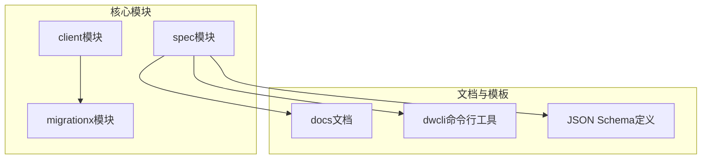

**图源**
- [DataWorksWorkflowSpec.java](file://spec/src/main/java/com/aliyun/dataworks/common/spec/domain/DataWorksWorkflowSpec.java#L1-L130)

**节源**
- [DataWorksWorkflowSpec.java](file://spec/src/main/java/com/aliyun/dataworks/common/spec/domain/DataWorksWorkflowSpec.java#L1-L130)

## 核心组件
节点模型API的核心是SpecNode类，它定义了工作流中节点的所有属性和行为。SpecNode实现了Container、InputOutputWired和ScriptWired接口，支持容器化、输入输出连接和脚本连接等特性。

**节源**
- [SpecNode.java](file://spec/src/main/java/com/aliyun/dataworks/common/spec/domain/ref/SpecNode.java#L1-L192)

## 架构概述
节点模型API采用分层架构设计，上层为Java对象模型，下层为JSON Schema定义，两者通过序列化和反序列化机制相互转换。适配器模式被广泛应用于不同系统之间的数据转换。

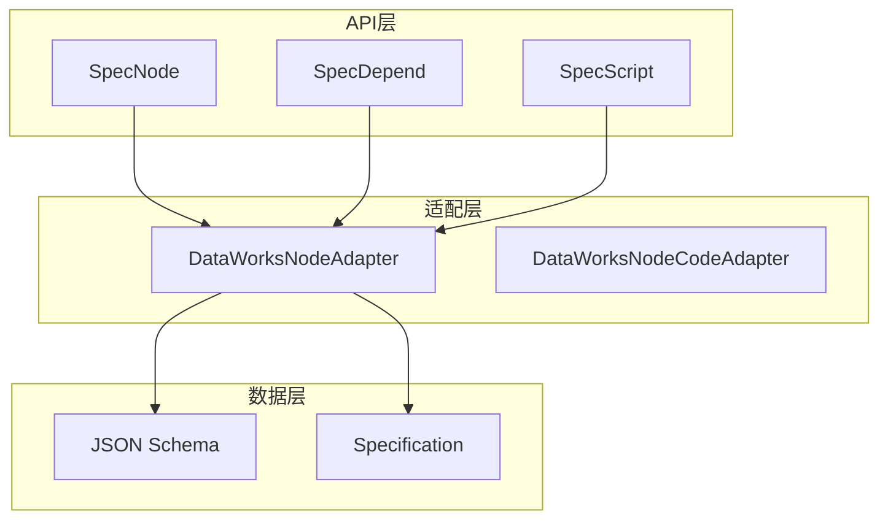

**图源**
- [SpecNode.java](file://spec/src/main/java/com/aliyun/dataworks/common/spec/domain/ref/SpecNode.java#L1-L192)
- [DataWorksNodeAdapter.java](file://spec/src/main/java/com/aliyun/dataworks/common/spec/domain/dw/nodemodel/DataWorksNodeAdapter.java)

## 详细组件分析

### SpecNode类分析
SpecNode类是节点模型的核心，包含节点的所有属性和配置。

#### 类图
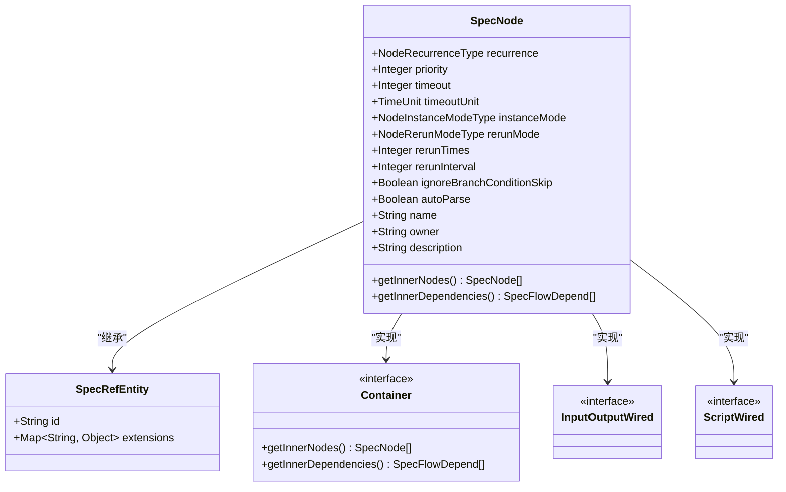

**图源**
- [SpecNode.java](file://spec/src/main/java/com/aliyun/dataworks/common/spec/domain/ref/SpecNode.java#L1-L192)

**节源**
- [SpecNode.java](file://spec/src/main/java/com/aliyun/dataworks/common/spec/domain/ref/SpecNode.java#L1-L192)

### 节点属性详解

#### 标识属性
SpecNode的标识属性包括id和name，用于唯一标识和描述节点。

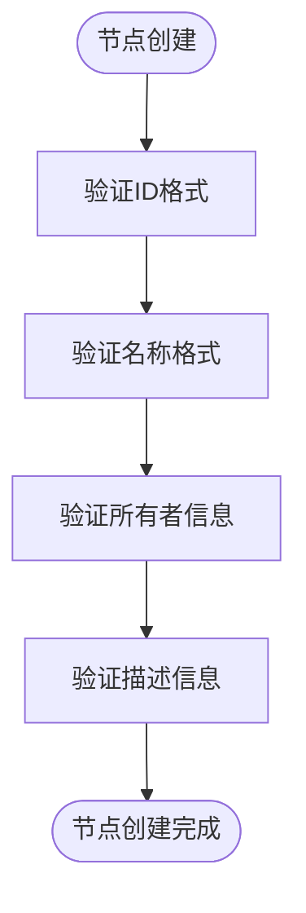

**节源**
- [SpecNode.schema.json](file://spec/src/main/resources/spec/schema/SpecNode.schema.json#L6-L9)

#### 执行配置
节点的执行配置包括优先级、超时时间、重跑模式等关键参数。

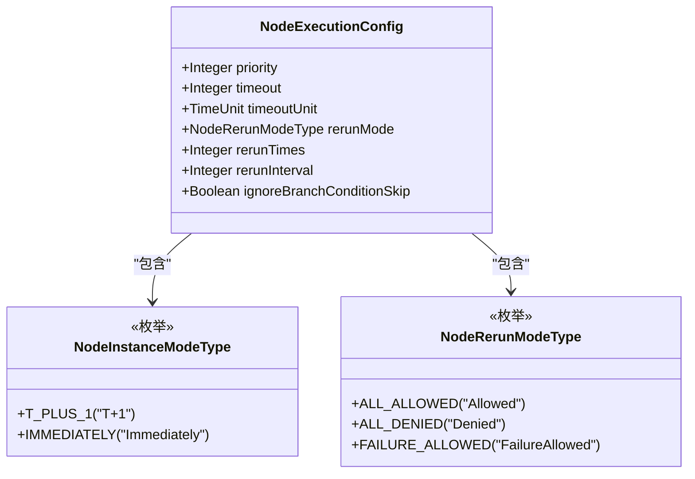

**图源**
- [SpecNode.java](file://spec/src/main/java/com/aliyun/dataworks/common/spec/domain/ref/SpecNode.java#L53-L75)
- [NodeInstanceModeType.java](file://spec/src/main/java/com/aliyun/dataworks/common/spec/domain/enums/NodeInstanceModeType.java)
- [NodeRerunModeType.java](file://spec/src/main/java/com/aliyun/dataworks/common/spec/domain/enums/NodeRerunModeType.java)

**节源**
- [SpecNode.java](file://spec/src/main/java/com/aliyun/dataworks/common/spec/domain/ref/SpecNode.java#L53-L75)

#### 资源需求
节点的资源需求通过runtimeResource属性进行配置，指定运行时资源组。

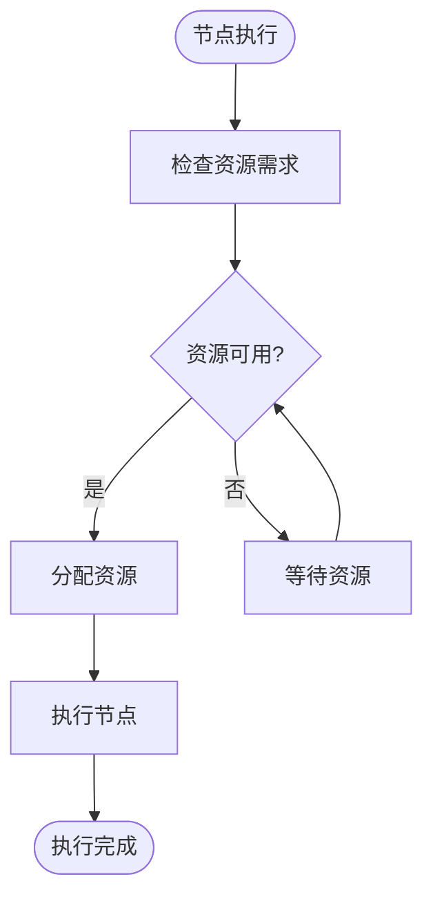

**节源**
- [SpecNode.java](file://spec/src/main/java/com/aliyun/dataworks/common/spec/domain/ref/SpecNode.java#L94-L96)

#### 输入输出
节点的输入输出通过inputs和outputs属性进行配置，支持多种数据类型。

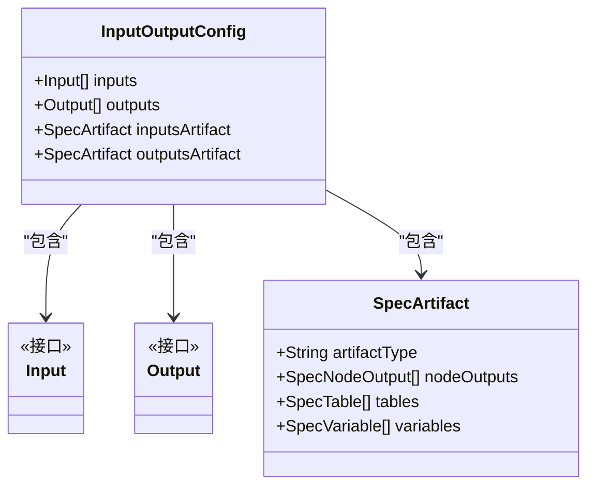

**图源**
- [SpecNode.java](file://spec/src/main/java/com/aliyun/dataworks/common/spec/domain/ref/SpecNode.java#L103-L108)

**节源**
- [SpecNode.java](file://spec/src/main/java/com/aliyun/dataworks/common/spec/domain/ref/SpecNode.java#L103-L108)

### 适配器模式实现
DataWorksNodeAdapter实现了适配器模式，将SpecNode对象转换为DataWorks系统可识别的格式。

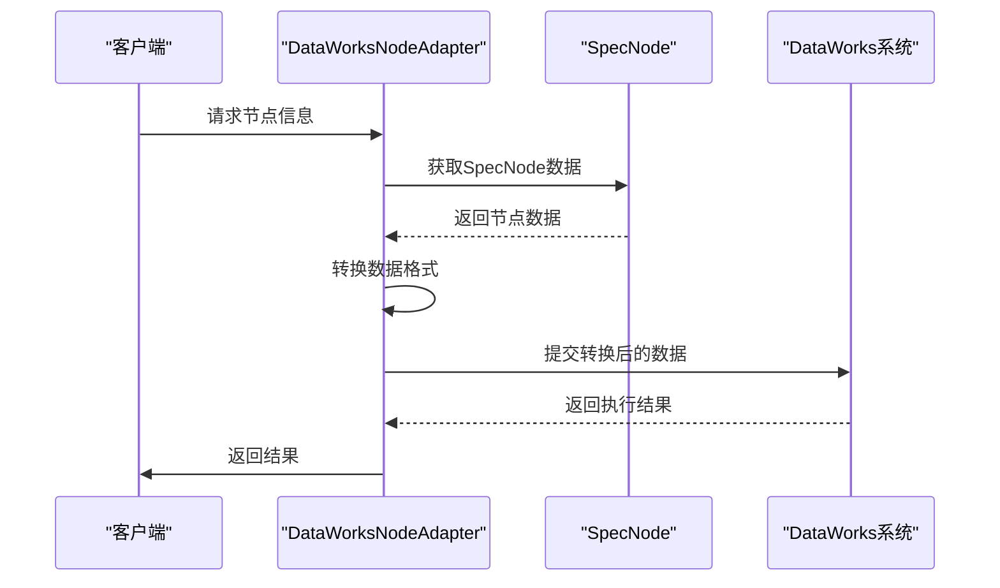

**图源**
- [DataWorksNodeAdapter.java](file://spec/src/main/java/com/aliyun/dataworks/common/spec/domain/dw/nodemodel/DataWorksNodeAdapter.java)
- [DataWorksNodeAdapterTest.java](file://spec/src/test/java/com/aliyun/dataworks/common/spec/domain/dw/nodemodel/DataWorksNodeAdapterTest.java)

**节源**
- [DataWorksNodeAdapter.java](file://spec/src/main/java/com/aliyun/dataworks/common/spec/domain/dw/nodemodel/DataWorksNodeAdapter.java)

### 节点代码存储
不同类型的节点代码通过script属性存储，支持SQL、Shell、Python等多种语言。

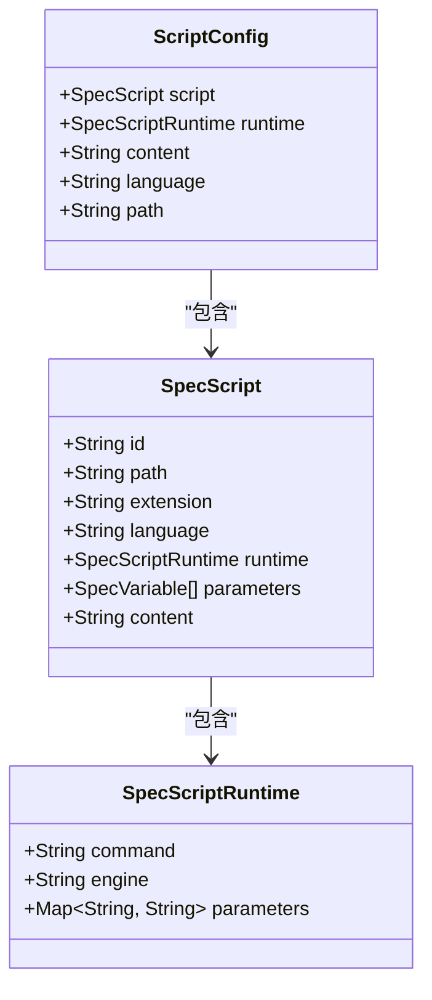

**图源**
- [SpecScript.schema.json](file://spec/src/main/resources/spec/schema/SpecScript.schema.json)
- [SpecNode.java](file://spec/src/main/java/com/aliyun/dataworks/common/spec/domain/ref/SpecNode.java#L88-L90)

**节源**
- [SpecScript.schema.json](file://spec/src/main/resources/spec/schema/SpecScript.schema.json)

### 节点依赖配置
节点依赖通过SpecDepend类进行配置，支持多种依赖类型。

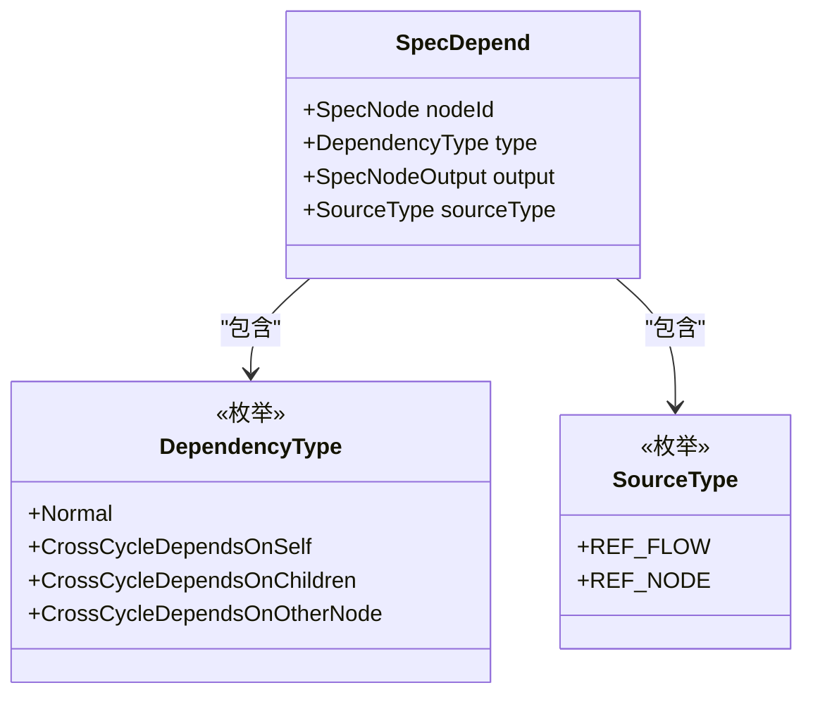

**图源**
- [SpecDepend.java](file://spec/src/main/java/com/aliyun/dataworks/common/spec/domain/noref/SpecDepend.java)
- [SpecNode.java](file://spec/src/main/java/com/aliyun/dataworks/common/spec/domain/ref/SpecNode.java#L111-L113)

**节源**
- [SpecDepend.java](file://spec/src/main/java/com/aliyun/dataworks/common/spec/domain/noref/SpecDepend.java)

## 依赖分析
节点模型API的依赖关系清晰，各组件之间耦合度低，便于维护和扩展。

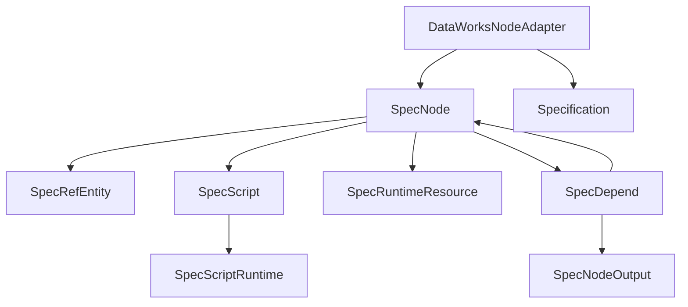

**图源**
- [SpecNode.java](file://spec/src/main/java/com/aliyun/dataworks/common/spec/domain/ref/SpecNode.java#L1-L192)
- [DataWorksNodeAdapter.java](file://spec/src/main/java/com/aliyun/dataworks/common/spec/domain/dw/nodemodel/DataWorksNodeAdapter.java)

**节源**
- [SpecNode.java](file://spec/src/main/java/com/aliyun/dataworks/common/spec/domain/ref/SpecNode.java#L1-L192)

## 性能考虑
节点模型API在设计时充分考虑了性能因素，通过缓存、懒加载等机制优化性能。

- 使用Lombok注解减少样板代码
- 采用不可变集合提高线程安全性
- 通过Optional避免空指针异常
- 使用接口隔离降低耦合度

## 故障排除指南
### 常见配置错误
1. **节点ID缺失**：确保每个节点都有唯一的ID
2. **必填字段未设置**：name和script为必填字段
3. **依赖配置错误**：检查依赖类型和节点ID是否正确
4. **资源组不存在**：确认指定的资源组在系统中存在

### 验证规则
- 节点名称不能为空
- 脚本内容必须存在
- 优先级值应在有效范围内
- 超时时间应为正整数
- 重跑次数应为非负整数

**节源**
- [SpecNode.schema.json](file://spec/src/main/resources/spec/schema/SpecNode.schema.json#L109-L112)

## 结论
节点模型API通过清晰的类结构和完善的配置选项，为DataWorks工作流提供了强大的节点管理能力。适配器模式的使用使得系统具有良好的扩展性，能够轻松集成不同类型的节点。通过详细的文档和示例，开发者可以快速掌握API的使用方法，高效地创建和管理复杂的工作流。