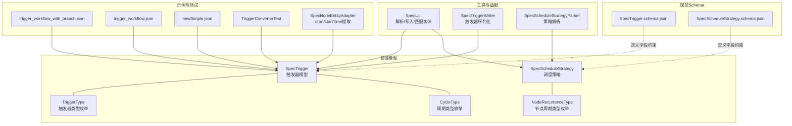
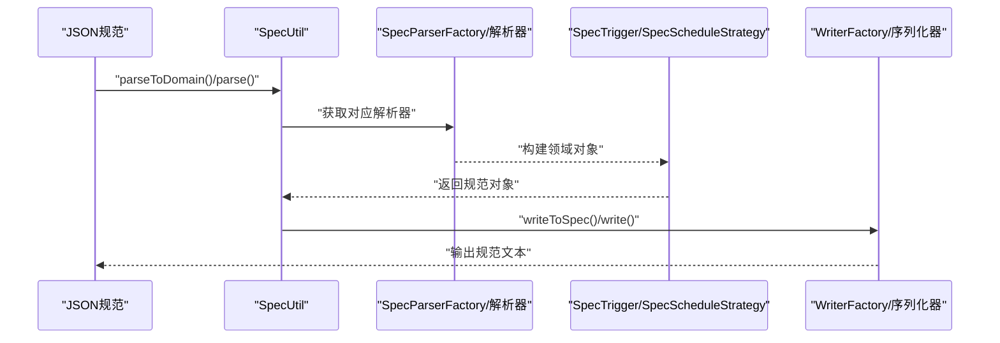
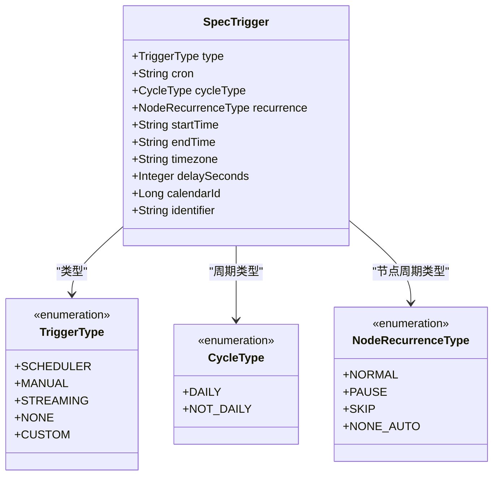
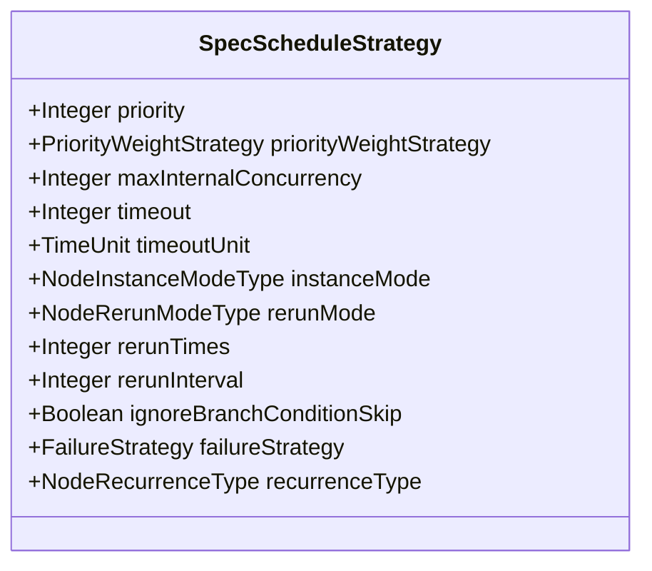
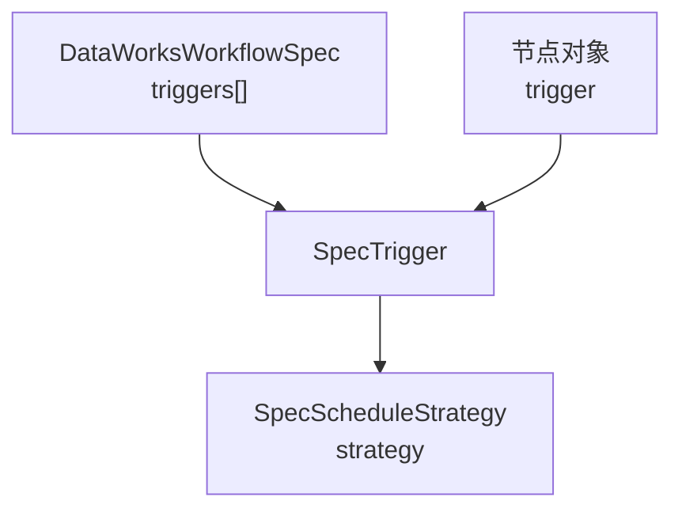
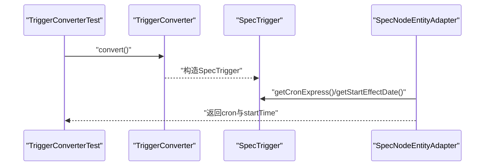
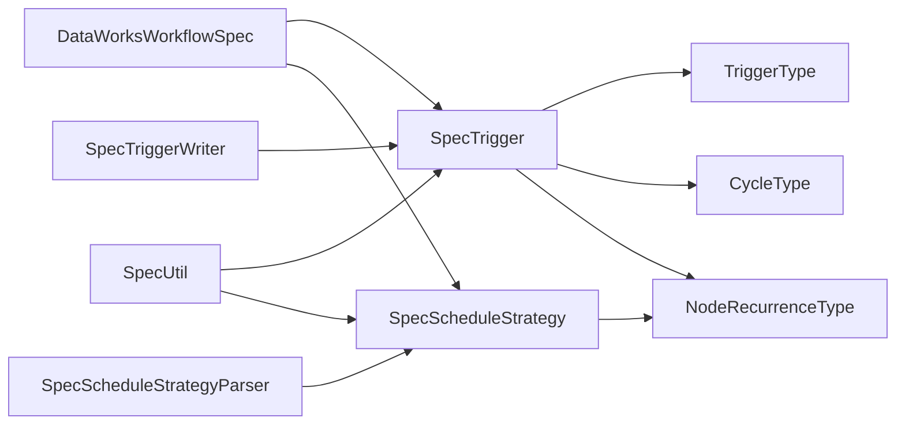

# 触发器模型API

<cite>
**本文引用的文件列表**
- [SpecTrigger.java](file://spec/src/main/java/com/aliyun/dataworks/common/spec/domain/ref/SpecTrigger.java)
- [SpecScheduleStrategy.java](file://spec/src/main/java/com/aliyun/dataworks/common/spec/domain/ref/SpecScheduleStrategy.java)
- [DataWorksWorkflowSpec.java](file://spec/src/main/java/com/aliyun/dataworks/common/spec/domain/DataWorksWorkflowSpec.java)
- [SpecTrigger.schema.json](file://spec/src/main/resources/spec/schema/SpecTrigger.schema.json)
- [SpecScheduleStrategy.schema.json](file://spec/src/main/resources/spec/schema/SpecScheduleStrategy.schema.json)
- [TriggerType.java](file://spec/src/main/java/com/aliyun/dataworks/common/spec/domain/enums/TriggerType.java)
- [CycleType.java](file://spec/src/main/java/com/aliyun/dataworks/common/spec/domain/enums/CycleType.java)
- [NodeRecurrenceType.java](file://spec/src/main/java/com/aliyun/dataworks/common/spec/domain/enums/NodeRecurrenceType.java)
- [SpecUtil.java](file://spec/src/main/java/com/aliyun/dataworks/common/spec/SpecUtil.java)
- [SpecTriggerWriter.java](file://spec/src/main/java/com/aliyun/dataworks/common/spec/writer/impl/SpecTriggerWriter.java)
- [SpecScheduleStrategyParser.java](file://spec/src/main/java/com/aliyun/dataworks/common/spec/parser/impl/SpecScheduleStrategyParser.java)
- [trigger_workflow_with_branch.json](file://spec/src/test/resources/copier/trigger_workflow_with_branch.json)
- [trigger_workflow.json](file://spec/src/test/resources/version/1.x.y/trigger_workflow.json)
- [newSimple.json](file://spec/src/test/resources/newSimple.json)
- [SpecNodeEntityAdapter.java](file://client/migrationx/migrationx-domain/migrationx-domain-dataworks/src/main/java/com/aliyun/dataworks/migrationx/domain/dataworks/service/spec/entity/SpecNodeEntityAdapter.java)
- [TriggerConverterTest.java](file://client/migrationx/migrationx-transformer/src/test/java/com/aliyun/dataworks/migrationx/transformer/dataworks/converter/dolphinscheduler/v3/workflow/TriggerConverterTest.java)
- [CronExpression.java](file://client/migrationx/migrationx-domain/migrationx-domain-dataworks/src/main/java/com/aliyun/dataworks/migrationx/domain/dataworks/utils/quartz/CronExpression.java)
</cite>

## 目录
1. [简介](#简介)
2. [项目结构](#项目结构)
3. [核心组件](#核心组件)
4. [架构总览](#架构总览)
5. [详细组件分析](#详细组件分析)
6. [依赖关系分析](#依赖关系分析)
7. [性能考虑](#性能考虑)
8. [故障排查指南](#故障排查指南)
9. [结论](#结论)
10. [附录](#附录)

## 简介
本文件面向DataWorks Spec触发器模型API，围绕SpecTrigger类进行系统化文档化，重点覆盖以下方面：
- 触发器字段：id、name、type（Scheduler、Manual、Streaming、None、Custom）、cron表达式、recurrence、startTime、endTime、timezone、delaySeconds、calendarId、identifier等。
- 调度策略SpecScheduleStrategy在周期性触发中的作用：优先级、并发控制、超时、实例模式、重跑策略、失败策略、周期类型等。
- 触发器与工作流/节点的绑定关系：DataWorksWorkflowSpec中triggers字段，以及节点层的trigger字段。
- 使用SpecUtil解析cron表达式生成调度计划的流程与要点。
- 创建“每日定时触发器”和“事件触发器”的示例路径与配置方法。
- cron表达式语法指南、触发器状态管理与DataWorks调度系统的集成注意事项。

## 项目结构
与触发器模型API直接相关的模块与文件分布如下：
- 领域模型与枚举：SpecTrigger、SpecScheduleStrategy、TriggerType、CycleType、NodeRecurrenceType
- 规范Schema：SpecTrigger.schema.json、SpecScheduleStrategy.schema.json
- 工具与适配：SpecUtil、SpecTriggerWriter、SpecScheduleStrategyParser
- 示例与测试：trigger_workflow_with_branch.json、trigger_workflow.json、newSimple.json、TriggerConverterTest、SpecNodeEntityAdapter

图表来源
- [SpecTrigger.java](file://spec/src/main/java/com/aliyun/dataworks/common/spec/domain/ref/SpecTrigger.java#L1-L51)
- [SpecScheduleStrategy.java](file://spec/src/main/java/com/aliyun/dataworks/common/spec/domain/ref/SpecScheduleStrategy.java#L1-L70)
- [TriggerType.java](file://spec/src/main/java/com/aliyun/dataworks/common/spec/domain/enums/TriggerType.java#L1-L56)
- [CycleType.java](file://spec/src/main/java/com/aliyun/dataworks/common/spec/domain/enums/CycleType.java#L1-L47)
- [NodeRecurrenceType.java](file://spec/src/main/java/com/aliyun/dataworks/common/spec/domain/enums/NodeRecurrenceType.java#L1-L56)
- [SpecTrigger.schema.json](file://spec/src/main/resources/spec/schema/SpecTrigger.schema.json#L1-L51)
- [SpecScheduleStrategy.schema.json](file://spec/src/main/resources/spec/schema/SpecScheduleStrategy.schema.json#L1-L47)
- [SpecUtil.java](file://spec/src/main/java/com/aliyun/dataworks/common/spec/SpecUtil.java#L1-L239)
- [SpecTriggerWriter.java](file://spec/src/main/java/com/aliyun/dataworks/common/spec/writer/impl/SpecTriggerWriter.java#L1-L31)
- [SpecScheduleStrategyParser.java](file://spec/src/main/java/com/aliyun/dataworks/common/spec/parser/impl/SpecScheduleStrategyParser.java#L1-L21)
- [trigger_workflow_with_branch.json](file://spec/src/test/resources/copier/trigger_workflow_with_branch.json#L1-L335)
- [trigger_workflow.json](file://spec/src/test/resources/version/1.x.y/trigger_workflow.json#L1-L154)
- [newSimple.json](file://spec/src/test/resources/newSimple.json#L1-L12)
- [SpecNodeEntityAdapter.java](file://client/migrationx/migrationx-domain/migrationx-domain-dataworks/src/main/java/com/aliyun/dataworks/migrationx/domain/dataworks/service/spec/entity/SpecNodeEntityAdapter.java#L118-L154)
- [TriggerConverterTest.java](file://client/migrationx/migrationx-transformer/src/test/java/com/aliyun/dataworks/migrationx/transformer/dataworks/converter/dolphinscheduler/v3/workflow/TriggerConverterTest.java#L76-L102)

章节来源
- [SpecTrigger.java](file://spec/src/main/java/com/aliyun/dataworks/common/spec/domain/ref/SpecTrigger.java#L1-L51)
- [SpecScheduleStrategy.java](file://spec/src/main/java/com/aliyun/dataworks/common/spec/domain/ref/SpecScheduleStrategy.java#L1-L70)
- [SpecTrigger.schema.json](file://spec/src/main/resources/spec/schema/SpecTrigger.schema.json#L1-L51)
- [SpecScheduleStrategy.schema.json](file://spec/src/main/resources/spec/schema/SpecScheduleStrategy.schema.json#L1-L47)

## 核心组件
- SpecTrigger：触发器的核心数据模型，承载触发器类型、cron表达式、生效时间范围、时区、延迟秒数、日历标识、自定义标识等。
- SpecScheduleStrategy：工作流/节点的调度策略，包含优先级、并发上限、超时、实例模式、重跑策略、失败策略、周期类型等。
- TriggerType/CycleType/NodeRecurrenceType：触发器类型、周期类型、节点周期类型的枚举定义。
- DataWorksWorkflowSpec：工作流规范对象，包含triggers字段，用于声明工作流级别的触发器集合。
- SpecUtil：通用工具，负责解析JSON为领域对象、写回规范文本、按UUID匹配目标实体等。
- SpecTriggerWriter/SpecScheduleStrategyParser：触发器与调度策略的序列化与解析适配器。

章节来源
- [SpecTrigger.java](file://spec/src/main/java/com/aliyun/dataworks/common/spec/domain/ref/SpecTrigger.java#L1-L51)
- [SpecScheduleStrategy.java](file://spec/src/main/java/com/aliyun/dataworks/common/spec/domain/ref/SpecScheduleStrategy.java#L1-L70)
- [TriggerType.java](file://spec/src/main/java/com/aliyun/dataworks/common/spec/domain/enums/TriggerType.java#L1-L56)
- [CycleType.java](file://spec/src/main/java/com/aliyun/dataworks/common/spec/domain/enums/CycleType.java#L1-L47)
- [NodeRecurrenceType.java](file://spec/src/main/java/com/aliyun/dataworks/common/spec/domain/enums/NodeRecurrenceType.java#L1-L56)
- [DataWorksWorkflowSpec.java](file://spec/src/main/java/com/aliyun/dataworks/common/spec/domain/DataWorksWorkflowSpec.java#L60-L90)
- [SpecUtil.java](file://spec/src/main/java/com/aliyun/dataworks/common/spec/SpecUtil.java#L115-L239)
- [SpecTriggerWriter.java](file://spec/src/main/java/com/aliyun/dataworks/common/spec/writer/impl/SpecTriggerWriter.java#L1-L31)
- [SpecScheduleStrategyParser.java](file://spec/src/main/java/com/aliyun/dataworks/common/spec/parser/impl/SpecScheduleStrategyParser.java#L1-L21)

## 架构总览
触发器模型API在DataWorks Spec体系中的位置与交互如下：

图表来源
- [SpecUtil.java](file://spec/src/main/java/com/aliyun/dataworks/common/spec/SpecUtil.java#L65-L114)
- [SpecTriggerWriter.java](file://spec/src/main/java/com/aliyun/dataworks/common/spec/writer/impl/SpecTriggerWriter.java#L1-L31)
- [SpecScheduleStrategyParser.java](file://spec/src/main/java/com/aliyun/dataworks/common/spec/parser/impl/SpecScheduleStrategyParser.java#L1-L21)

## 详细组件分析

### SpecTrigger 类设计与使用
- 字段语义
  - id/name/type：唯一标识、名称、触发器类型（Scheduler/Manual/Streaming/None/Custom）
  - cron：周期性触发的cron表达式
  - recurrence：周期性触发的周期类型（与cron配合或独立）
  - startTime/endTime/timezone：生效起止时间与时区
  - delaySeconds：延迟秒数
  - calendarId/identifier：调度日历与自定义标识
- 关键点
  - type与recurrence至少满足其一，Schema中以anyOf约束
  - cron字段在Schema中明确描述为“周期性触发的cron表达式”
  - cycleType/cycleType用于区分日调度与非日调度
- 绑定关系
  - 工作流级别：DataWorksWorkflowSpec.triggers
  - 节点级别：节点对象可携带trigger字段（见示例）

图表来源
- [SpecTrigger.java](file://spec/src/main/java/com/aliyun/dataworks/common/spec/domain/ref/SpecTrigger.java#L1-L51)
- [TriggerType.java](file://spec/src/main/java/com/aliyun/dataworks/common/spec/domain/enums/TriggerType.java#L1-L56)
- [CycleType.java](file://spec/src/main/java/com/aliyun/dataworks/common/spec/domain/enums/CycleType.java#L1-L47)
- [NodeRecurrenceType.java](file://spec/src/main/java/com/aliyun/dataworks/common/spec/domain/enums/NodeRecurrenceType.java#L1-L56)

章节来源
- [SpecTrigger.java](file://spec/src/main/java/com/aliyun/dataworks/common/spec/domain/ref/SpecTrigger.java#L1-L51)
- [SpecTrigger.schema.json](file://spec/src/main/resources/spec/schema/SpecTrigger.schema.json#L1-L51)
- [DataWorksWorkflowSpec.java](file://spec/src/main/java/com/aliyun/dataworks/common/spec/domain/DataWorksWorkflowSpec.java#L60-L90)

### SpecScheduleStrategy 调度策略
- 字段语义
  - priority/priorityWeightStrategy：优先级与权重策略
  - maxInternalConcurrency：最大内部并发
  - timeout/timeoutUnit：超时与单位
  - instanceMode：实例模式（如T+1等）
  - rerunMode/rerunTimes/rerunInterval：重跑策略与次数/间隔
  - ignoreBranchConditionSkip：是否忽略分支条件跳过
  - failureStrategy：失败策略（如Break）
  - recurrenceType：节点周期类型（Normal/Pause/Skip/NoneAuto）
- 作用
  - 在周期性触发中，决定实例的并发、重跑、失败处理等行为
  - 与SpecTrigger的cron/startTime/endTime共同构成完整的调度计划

图表来源
- [SpecScheduleStrategy.java](file://spec/src/main/java/com/aliyun/dataworks/common/spec/domain/ref/SpecScheduleStrategy.java#L1-L70)
- [SpecScheduleStrategy.schema.json](file://spec/src/main/resources/spec/schema/SpecScheduleStrategy.schema.json#L1-L47)

章节来源
- [SpecScheduleStrategy.java](file://spec/src/main/java/com/aliyun/dataworks/common/spec/domain/ref/SpecScheduleStrategy.java#L1-L70)
- [SpecScheduleStrategy.schema.json](file://spec/src/main/resources/spec/schema/SpecScheduleStrategy.schema.json#L1-L47)

### 触发器与工作流/节点的绑定关系
- 工作流绑定
  - DataWorksWorkflowSpec包含triggers字段，用于声明工作流级别的触发器集合
- 节点绑定
  - 节点对象可携带trigger字段，实现节点级触发器
- 实例参考
  - 触发工作流示例：trigger_workflow_with_branch.json、trigger_workflow.json
  - 简单周期工作流示例：newSimple.json

图表来源
- [DataWorksWorkflowSpec.java](file://spec/src/main/java/com/aliyun/dataworks/common/spec/domain/DataWorksWorkflowSpec.java#L60-L90)
- [trigger_workflow_with_branch.json](file://spec/src/test/resources/copier/trigger_workflow_with_branch.json#L1-L335)
- [trigger_workflow.json](file://spec/src/test/resources/version/1.x.y/trigger_workflow.json#L1-L154)
- [newSimple.json](file://spec/src/test/resources/newSimple.json#L1-L12)

章节来源
- [DataWorksWorkflowSpec.java](file://spec/src/main/java/com/aliyun/dataworks/common/spec/domain/DataWorksWorkflowSpec.java#L60-L90)
- [trigger_workflow_with_branch.json](file://spec/src/test/resources/copier/trigger_workflow_with_branch.json#L1-L335)
- [trigger_workflow.json](file://spec/src/test/resources/version/1.x.y/trigger_workflow.json#L1-L154)
- [newSimple.json](file://spec/src/test/resources/newSimple.json#L1-L12)

### 使用SpecUtil解析cron表达式生成调度计划
- 解析流程
  - 使用SpecUtil.parseToDomain或SpecUtil.parse将JSON规范解析为领域对象
  - 通过SpecTriggerWriter/SpecScheduleStrategyParser完成序列化与解析
- 提取cron与生效时间
  - 适配器SpecNodeEntityAdapter从节点的trigger中提取cron与startTime
- 测试验证
  - TriggerConverterTest断言了cron、startTime、endTime、timezone、delaySeconds等字段的转换结果

图表来源
- [TriggerConverterTest.java](file://client/migrationx/migrationx-transformer/src/test/java/com/aliyun/dataworks/migrationx/transformer/dataworks/converter/dolphinscheduler/v3/workflow/TriggerConverterTest.java#L76-L102)
- [SpecNodeEntityAdapter.java](file://client/migrationx/migrationx-domain/migrationx-domain-dataworks/src/main/java/com/aliyun/dataworks/migrationx/domain/dataworks/service/spec/entity/SpecNodeEntityAdapter.java#L118-L154)

章节来源
- [SpecUtil.java](file://spec/src/main/java/com/aliyun/dataworks/common/spec/SpecUtil.java#L65-L114)
- [SpecTriggerWriter.java](file://spec/src/main/java/com/aliyun/dataworks/common/spec/writer/impl/SpecTriggerWriter.java#L1-L31)
- [SpecScheduleStrategyParser.java](file://spec/src/main/java/com/aliyun/dataworks/common/spec/parser/impl/SpecScheduleStrategyParser.java#L1-L21)
- [SpecNodeEntityAdapter.java](file://client/migrationx/migrationx-domain/migrationx-domain-dataworks/src/main/java/com/aliyun/dataworks/migrationx/domain/dataworks/service/spec/entity/SpecNodeEntityAdapter.java#L118-L154)
- [TriggerConverterTest.java](file://client/migrationx/migrationx-transformer/src/test/java/com/aliyun/dataworks/migrationx/transformer/dataworks/converter/dolphinscheduler/v3/workflow/TriggerConverterTest.java#L76-L102)

### 创建每日定时触发器与事件触发器的示例路径
- 每日定时触发器
  - 参考示例：newSimple.json
  - 关键字段：type为scheduler、cron为每日表达式、startTime/endTime定义生效期
- 事件触发器
  - 参考示例：trigger_workflow.json
  - 关键字段：type为Custom、startTime/endTime、timezone、identifier用于事件源标识
- 节点级事件触发器
  - 参考示例：trigger_workflow_with_branch.json
  - 节点对象内同样可配置trigger字段，实现节点级事件触发

章节来源
- [newSimple.json](file://spec/src/test/resources/newSimple.json#L1-L12)
- [trigger_workflow.json](file://spec/src/test/resources/version/1.x.y/trigger_workflow.json#L1-L154)
- [trigger_workflow_with_branch.json](file://spec/src/test/resources/copier/trigger_workflow_with_branch.json#L1-L335)

### cron表达式语法指南
- Quartz风格cron字段：秒 分 时 日 月 周 年（可选）
- 常用特殊字符：, - * / ? L W #
- 注意事项
  - 秒字段通常为0，不支持秒级调度
  - 日字段与周字段互斥，建议使用?占位符避免冲突
  - 年字段可省略
- 参考实现
  - CronExpression提供字段含义与允许值说明

章节来源
- [CronExpression.java](file://client/migrationx/migrationx-domain/migrationx-domain-dataworks/src/main/java/com/aliyun/dataworks/migrationx/domain/dataworks/utils/quartz/CronExpression.java#L22-L61)

## 依赖关系分析
- 组件耦合
  - SpecTrigger依赖TriggerType、CycleType、NodeRecurrenceType
  - SpecScheduleStrategy依赖多种枚举类型
  - DataWorksWorkflowSpec聚合SpecTrigger与SpecScheduleStrategy
  - SpecUtil作为解析/写入入口，连接解析器与序列化器
- 外部依赖
  - JSON序列化采用Fastjson2
  - 解析/写入通过工厂模式分派到具体实现

图表来源
- [SpecTrigger.java](file://spec/src/main/java/com/aliyun/dataworks/common/spec/domain/ref/SpecTrigger.java#L1-L51)
- [SpecScheduleStrategy.java](file://spec/src/main/java/com/aliyun/dataworks/common/spec/domain/ref/SpecScheduleStrategy.java#L1-L70)
- [DataWorksWorkflowSpec.java](file://spec/src/main/java/com/aliyun/dataworks/common/spec/domain/DataWorksWorkflowSpec.java#L60-L90)
- [SpecUtil.java](file://spec/src/main/java/com/aliyun/dataworks/common/spec/SpecUtil.java#L65-L114)
- [SpecTriggerWriter.java](file://spec/src/main/java/com/aliyun/dataworks/common/spec/writer/impl/SpecTriggerWriter.java#L1-L31)
- [SpecScheduleStrategyParser.java](file://spec/src/main/java/com/aliyun/dataworks/common/spec/parser/impl/SpecScheduleStrategyParser.java#L1-L21)

## 性能考虑
- 解析与序列化
  - 使用工厂模式选择解析器/写入器，避免重复初始化
  - 对大型规范建议分批处理，减少内存峰值
- 并发与重跑
  - 合理设置maxInternalConcurrency与rerunTimes/rerunInterval，避免资源争用
- cron表达式
  - 尽量使用稳定的表达式，避免过于复杂的组合导致计算开销增大

## 故障排查指南
- 常见问题
  - cron表达式无效：检查字段顺序与特殊字符使用
  - 生效时间未生效：确认startTime/endTime与timezone配置正确
  - 触发器未绑定：核对DataWorksWorkflowSpec.triggers或节点trigger字段
- 定位手段
  - 使用SpecUtil.parseToDomain查看解析后的领域对象
  - 通过SpecNodeEntityAdapter.getCronExpress/getStartEffectDate提取关键信息
  - 参考TriggerConverterTest断言验证字段转换

章节来源
- [SpecUtil.java](file://spec/src/main/java/com/aliyun/dataworks/common/spec/SpecUtil.java#L65-L114)
- [SpecNodeEntityAdapter.java](file://client/migrationx/migrationx-domain/migrationx-domain-dataworks/src/main/java/com/aliyun/dataworks/migrationx/domain/dataworks/service/spec/entity/SpecNodeEntityAdapter.java#L118-L154)
- [TriggerConverterTest.java](file://client/migrationx/migrationx-transformer/src/test/java/com/aliyun/dataworks/migrationx/transformer/dataworks/converter/dolphinscheduler/v3/workflow/TriggerConverterTest.java#L76-L102)

## 结论
SpecTrigger与SpecScheduleStrategy构成了DataWorks Spec触发器模型的核心，前者负责触发器的类型、cron表达式与时间窗口，后者负责调度策略与实例行为。通过SpecUtil与解析/写入适配器，可以稳定地将JSON规范转换为领域对象，并在工作流与节点层面实现灵活的触发绑定。结合示例与测试用例，用户可快速创建每日定时触发器与事件触发器，并在DataWorks调度系统中正确集成。

## 附录
- 触发器状态管理
  - 通过NodeRecurrenceType控制节点是否自动调度（Normal/Pause/Skip/NoneAuto）
  - 通过SpecScheduleStrategy.failureStrategy与rerunTimes等参数管理失败与重跑
- 与DataWorks调度系统的集成注意事项
  - cron表达式需符合Quartz规范
  - timezone应与DataWorks调度时区一致
  - identifier用于事件触发器的外部事件源标识
  - calendarId可用于调度日历定制

章节来源
- [NodeRecurrenceType.java](file://spec/src/main/java/com/aliyun/dataworks/common/spec/domain/enums/NodeRecurrenceType.java#L1-L56)
- [SpecScheduleStrategy.java](file://spec/src/main/java/com/aliyun/dataworks/common/spec/domain/ref/SpecScheduleStrategy.java#L1-L70)
- [trigger_workflow.json](file://spec/src/test/resources/version/1.x.y/trigger_workflow.json#L1-L154)
- [trigger_workflow_with_branch.json](file://spec/src/test/resources/copier/trigger_workflow_with_branch.json#L1-L335)