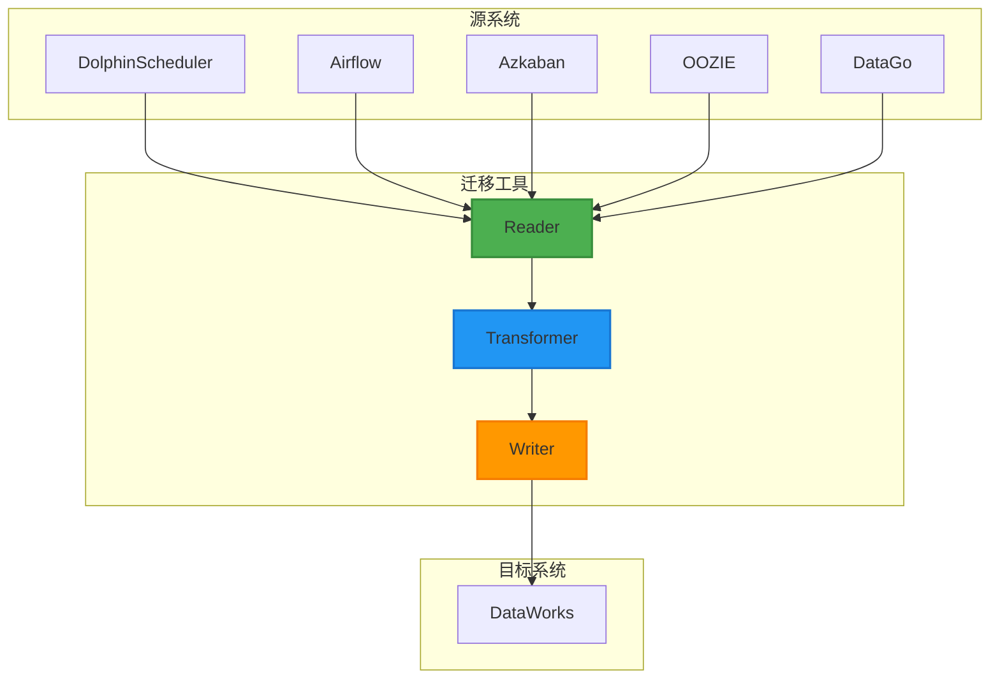
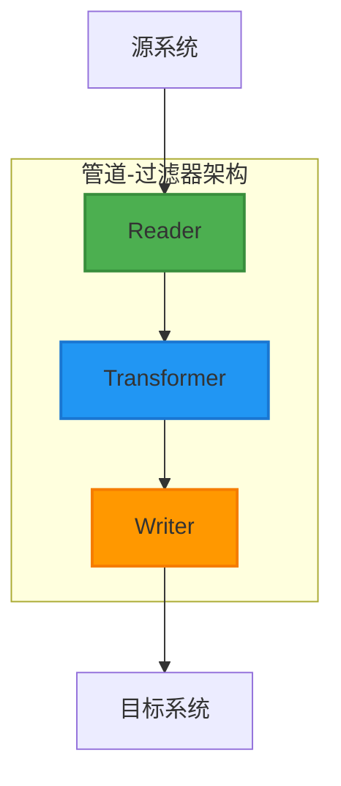
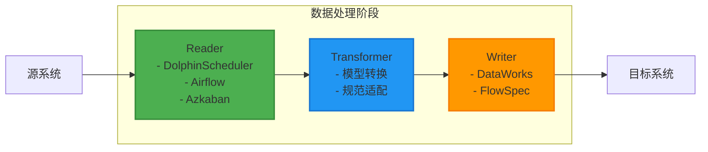
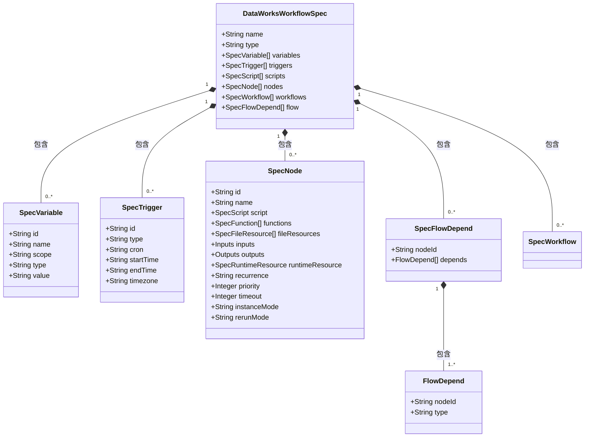
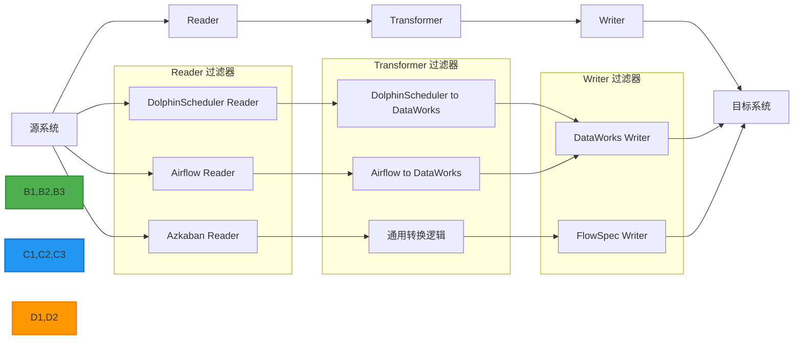

# 技术架构

<cite>
**本文档引用的文件**
- [README.md](file://README.md)
- [pom.xml](file://pom.xml)
- [client/pom.xml](file://client/pom.xml)
- [spec/pom.xml](file://spec/pom.xml)
- [dwcli/setup.py](file://dwcli/setup.py)
- [client/migrationx/src/main/bin/migrationx.py](file://client/migrationx/src/main/bin/migrationx.py)
- [client/migrationx/src/main/conf/apps.json](file://client/migrationx/src/main/conf/apps.json)
- [spec/src/main/java/com/aliyun/dataworks/common/spec/SpecUtil.java](file://spec/src/main/java/com/aliyun/dataworks/common/spec/SpecUtil.java)
- [spec/src/main/java/com/aliyun/dataworks/common/spec/domain/DataWorksWorkflowSpec.java](file://spec/src/main/java/com/aliyun/dataworks/common/spec/domain/DataWorksWorkflowSpec.java)
- [dwcli/dwcli/cli.py](file://dwcli/dwcli/cli.py)
- [schema/flow.schema.json](file://schema/flow.schema.json)
- [client/migrationx/migrationx-transformer/src/main/java/com/aliyun/dataworks/migrationx/transformer/dataworks/converter/dolphinscheduler/filters/DolphinSchedulerConverterFilter.java](file://client/migrationx/migrationx-transformer/src/main/java/com/aliyun/dataworks/migrationx/transformer/dataworks/converter/dolphinscheduler/filters/DolphinSchedulerConverterFilter.java)
- [client/migrationx-transformer/src/main/python/airflow_dag_parser/models/dw_eums.py](file://client/migrationx-transformer/src/main/python/airflow_dag_parser/models/dw_eums.py)
</cite>

## 目录
1. [简介](#简介)
2. [系统上下文图](#系统上下文图)
3. [核心组件](#核心组件)
4. [架构模式](#架构模式)
5. [数据流路径](#数据流路径)
6. [技术栈与依赖](#技术栈与依赖)
7. [组件交互关系](#组件交互关系)
8. [领域驱动设计应用](#领域驱动设计应用)
9. [管道-过滤器架构](#管道-过滤器架构)
10. [版本兼容性](#版本兼容性)

## 简介

dataworks-spec项目是一个基于通用工作流描述规范(FlowSpec)的迁移工具生态系统，旨在实现不同工作流调度系统到DataWorks工作流模型的迁移。该项目定义了一套标准化的工作流描述规范，支持从源系统到目标系统的完整数据迁移流程。系统采用模块化设计，包含spec、migrationx和dwcli三个核心组件，分别负责规范定义、迁移转换和命令行操作。项目支持多种工作流调度系统，包括DolphinScheduler、Airflow、Azkaban等，通过Reader-Transformer-Writer管道模式实现跨平台工作流迁移。

**Section sources**
- [README.md](file://README.md#L1-L460)

## 系统上下文图



**Diagram sources**
- [README.md](file://README.md#L421-L440)
- [client/migrationx/src/main/bin/migrationx.py](file://client/migrationx/src/main/bin/migrationx.py#L1-L44)

## 核心组件

dataworks-spec项目由三个核心组件构成：spec、migrationx和dwcli。spec组件定义了通用工作流描述规范(FlowSpec)，包含工作流、节点、依赖关系等核心实体的定义；migrationx组件实现了基于FlowSpec的迁移工具，支持从不同工作流调度系统到DataWorks的迁移；dwcli组件提供了命令行接口，支持配置即代码(CaC)的管理方式。这些组件协同工作，形成了完整的迁移解决方案。

**Section sources**
- [README.md](file://README.md#L8-L11)
- [pom.xml](file://pom.xml#L25-L28)

## 架构模式

dataworks-spec项目采用了领域驱动设计(DDD)和管道-过滤器架构模式。领域驱动设计用于建模复杂的工作流业务概念，将系统划分为不同的领域模型，如工作流、节点、依赖等。管道-过滤器架构则用于实现迁移流程，将迁移过程分解为Reader、Transformer和Writer三个阶段，每个阶段作为管道中的一个过滤器，接收输入、处理数据并产生输出。这种架构模式提高了系统的可扩展性和可维护性，支持添加新的源系统和目标系统。



**Diagram sources**
- [README.md](file://README.md#L421-L440)
- [client/migrationx/src/main/bin/migrationx.py](file://client/migrationx/src/main/bin/migrationx.py#L1-L44)

## 数据流路径

系统的完整数据流路径遵循源系统 → Reader → Transformer → Writer → 目标系统的模式。Reader组件从源系统读取工作流模型，将其转换为内部表示；Transformer组件对内部表示进行转换，适配到DataWorks工作流规范；Writer组件将转换后的工作流写入目标系统。这个数据流路径体现了管道-过滤器架构的核心思想，每个阶段只关注特定的转换任务，确保了系统的模块化和可扩展性。



**Diagram sources**
- [client/migrationx/src/main/bin/migrationx.py](file://client/migrationx/src/main/bin/migrationx.py#L1-L44)
- [README.md](file://README.md#L421-L440)

## 技术栈与依赖

项目采用Java和Python混合技术栈，Java主要用于核心规范定义和复杂业务逻辑，Python用于脚本化操作和命令行工具。项目依赖多个第三方库，包括Fastjson2、Gson用于JSON处理，Jackson用于XML处理，SnakeYAML用于YAML处理，JsonSchemaValidator用于JSON Schema验证。这些依赖库的选择基于性能、稳定性和社区支持等因素，确保了系统的可靠性和高效性。

**Section sources**
- [pom.xml](file://pom.xml#L41-L51)
- [spec/pom.xml](file://spec/pom.xml#L31-L102)
- [dwcli/setup.py](file://dwcli/setup.py#L19-L26)

## 组件交互关系

核心组件spec、migrationx和dwcli之间存在紧密的交互关系。spec组件提供规范定义和解析能力，被migrationx和dwcli组件依赖；migrationx组件实现迁移逻辑，调用spec组件的API进行规范解析和生成；dwcli组件提供用户接口，调用migrationx组件执行具体操作。这种分层架构确保了组件间的松耦合，提高了系统的可维护性和可扩展性。

```mermaid
classDiagram
class Spec {
+parseToDomain(json)
+writeToSpec(specification)
+parse(json, specCls, context)
}
class MigrationX {
+read()
+transform()
+write()
}
class DWCLI {
+create()
+set()
+unset()
+inspect()
+validate()
}
DWCLI --> MigrationX : "调用"
MigrationX --> Spec : "依赖"
DWCLI --> Spec : "依赖"
note right of Spec
核心规范定义和解析
提供Java API
end
note right of MigrationX
迁移逻辑实现
Reader-Transformer-Writer管道
end
note right of DWCLI
命令行接口
配置即代码管理
end
```

**Diagram sources**
- [spec/src/main/java/com/aliyun/dataworks/common/spec/SpecUtil.java](file://spec/src/main/java/com/aliyun/dataworks/common/spec/SpecUtil.java#L59-L239)
- [client/migrationx/src/main/bin/migrationx.py](file://client/migrationx/src/main/bin/migrationx.py#L1-L44)
- [dwcli/dwcli/cli.py](file://dwcli/dwcli/cli.py#L1-L312)

## 领域驱动设计应用

项目广泛应用领域驱动设计(DDD)原则，将复杂的工作流概念建模为领域对象。核心领域包括工作流(Workflow)、节点(Node)、依赖(FlowDepend)、变量(Variable)等，每个领域对象封装了相关的数据和行为。通过值对象(Value Object)、实体(Entity)和聚合根(Aggregate Root)等DDD模式，确保了领域模型的一致性和完整性。例如，DataWorksWorkflowSpec类作为聚合根，管理着工作流的生命周期和一致性边界。



**Diagram sources**
- [spec/src/main/java/com/aliyun/dataworks/common/spec/domain/DataWorksWorkflowSpec.java](file://spec/src/main/java/com/aliyun/dataworks/common/spec/domain/DataWorksWorkflowSpec.java#L16-L130)
- [README.md](file://README.md#L87-L108)

## 管道-过滤器架构

系统采用管道-过滤器架构模式实现迁移流程，将复杂的迁移任务分解为独立的处理阶段。Reader作为第一个过滤器，负责从源系统读取数据；Transformer作为中间过滤器，负责数据转换和适配；Writer作为最后一个过滤器，负责将结果写入目标系统。每个过滤器只关注特定的处理任务，通过标准接口进行通信，确保了系统的模块化和可扩展性。这种架构支持并行处理和流水线优化，提高了迁移效率。



**Diagram sources**
- [client/migrationx/src/main/bin/migrationx.py](file://client/migrationx/src/main/bin/migrationx.py#L1-L44)
- [client/migrationx/src/main/conf/apps.json](file://client/migrationx/src/main/conf/apps.json#L1-L38)

## 版本兼容性

项目通过明确的版本管理和依赖声明确保了版本兼容性。在pom.xml文件中，所有依赖库都指定了明确的版本号，避免了版本冲突。核心依赖包括Fastjson2 2.0.26、Gson 2.10.1、Jackson 2.13.4.2等，这些版本经过充分测试，确保了稳定性和性能。项目还支持向后兼容，通过版本转换器(VersionConverter)处理不同版本的规范格式，确保了系统的长期可用性。

**Section sources**
- [pom.xml](file://pom.xml#L41-L51)
- [spec/pom.xml](file://spec/pom.xml#L31-L102)
- [spec/src/main/java/com/aliyun/dataworks/common/spec/version/VersionConverter.java](file://spec/src/main/java/com/aliyun/dataworks/common/spec/version/VersionConverter.java)