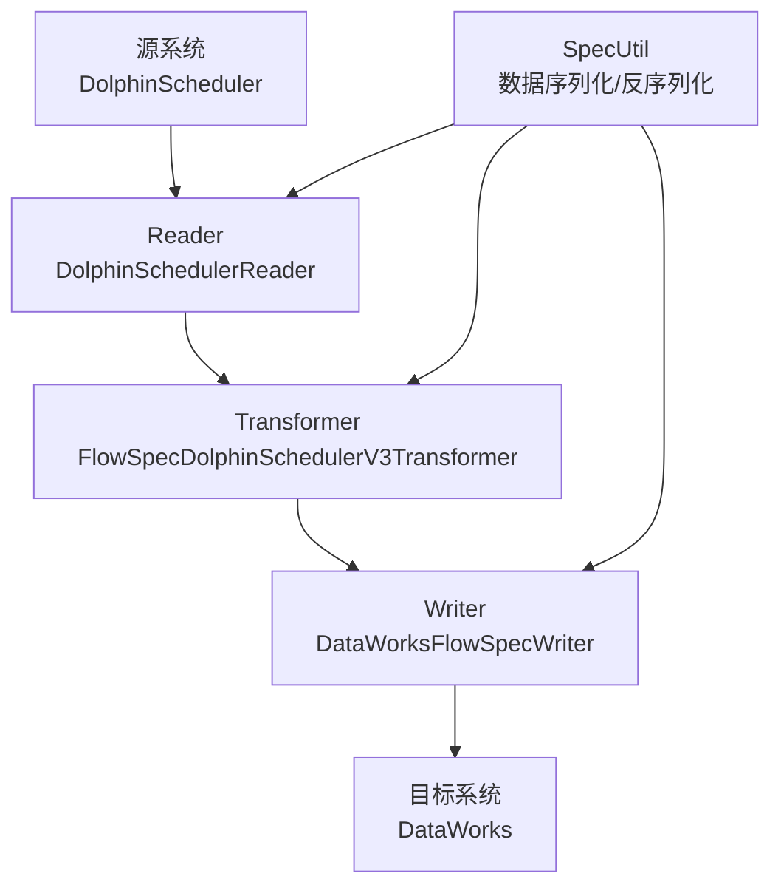
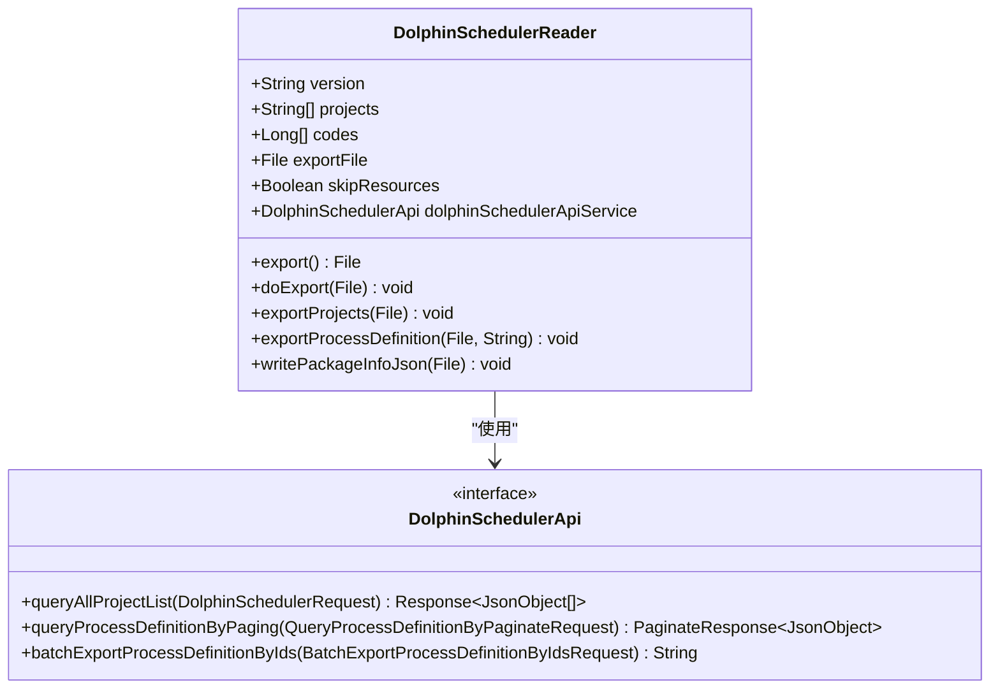
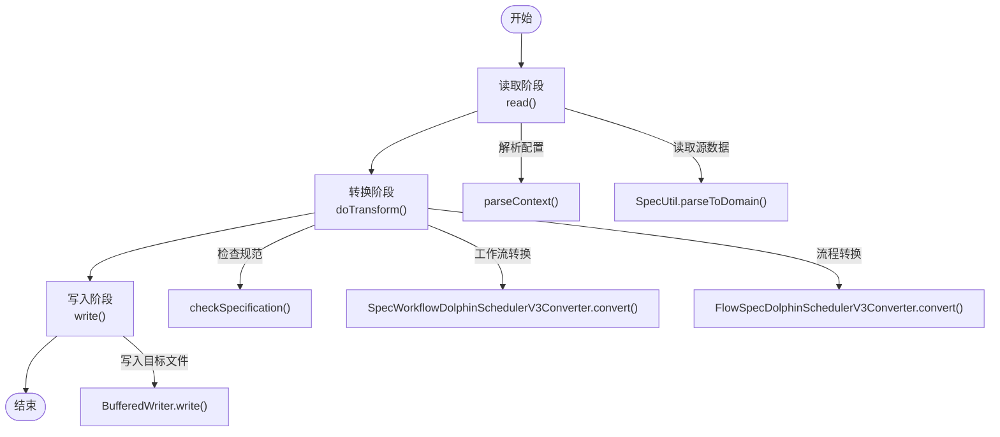
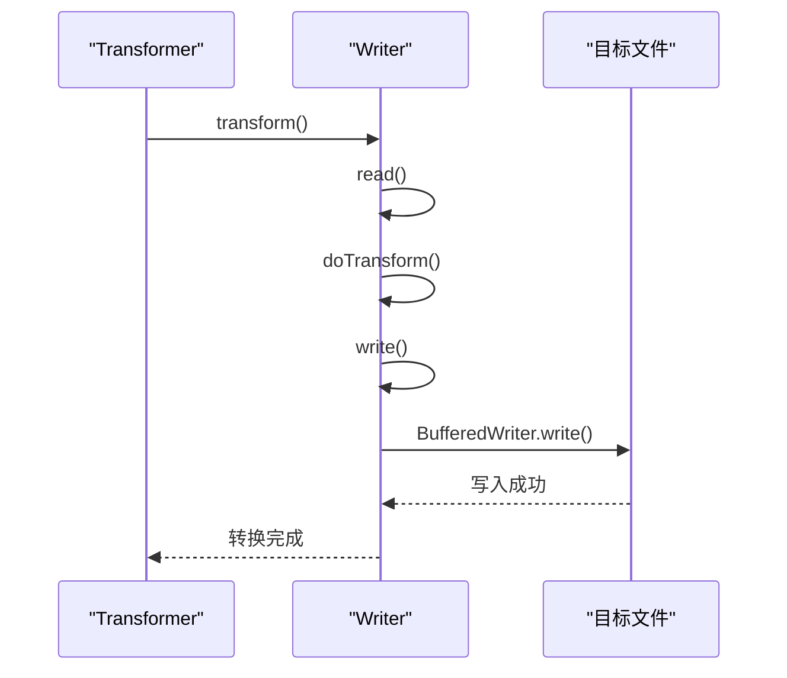
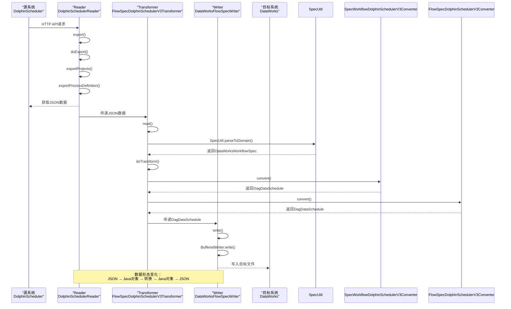
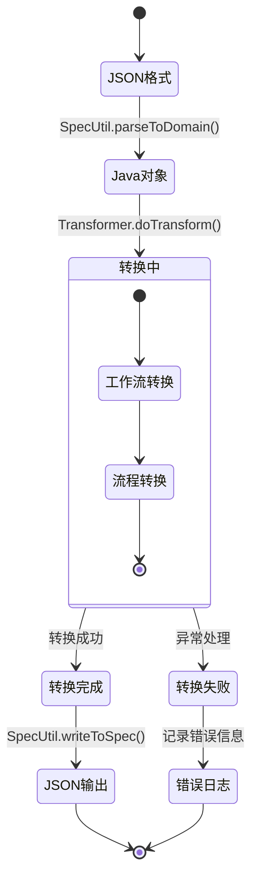
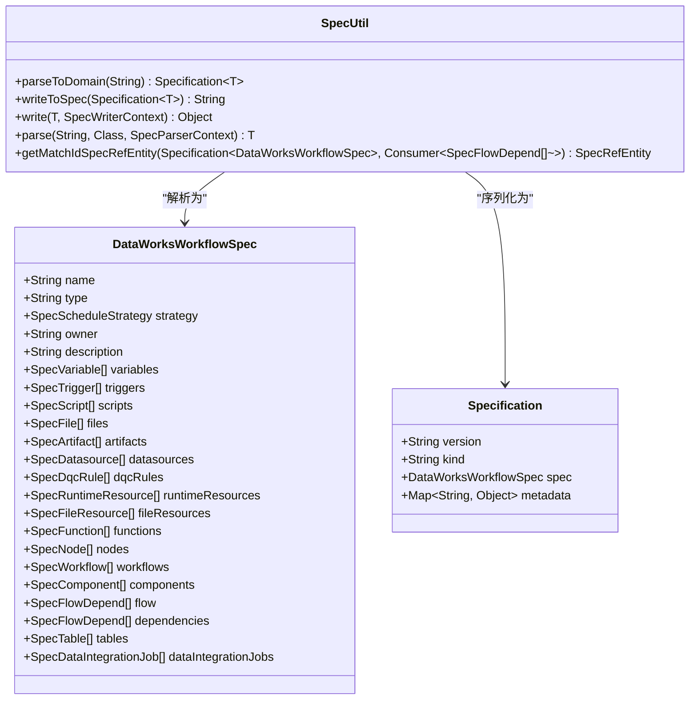
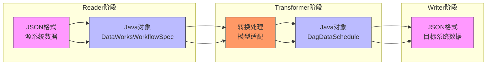

# 数据流

<cite>
**本文档引用的文件**   
- [SpecUtil.java](file://spec/src/main/java/com/aliyun/dataworks/common/spec/SpecUtil.java)
- [DolphinSchedulerReader.java](file://client/migrationx/migrationx-reader/src/main/java/com/aliyun/dataworks/migrationx/reader/dolphinscheduler/DolphinSchedulerReader.java)
- [FlowSpecDolphinSchedulerV3Transformer.java](file://client/migrationx/migrationx-transformer/src/main/java/com/aliyun/dataworks/migrationx/transformer/dolphinscheduler/transformer/flowspec/FlowSpecDolphinSchedulerV3Transformer.java)
- [DataWorksWorkflowSpec.java](file://spec/src/main/java/com/aliyun/dataworks/common/spec/domain/DataWorksWorkflowSpec.java)
- [DagDataSchedule.java](file://client/migrationx/migrationx-domain/migrationx-domain-dolphinscheduler/src/main/java/com/aliyun/dataworks/migrationx/domain/dataworks/dolphinscheduler/v3/v320/DagDataSchedule.java)
- [FlowSpecDolphinSchedulerV3Converter.java](file://client/migrationx/migrationx-transformer/src/main/java/com/aliyun/dataworks/migrationx/transformer/dolphinscheduler/converter/flowspec/FlowSpecDolphinSchedulerV3Converter.java)
- [SpecWorkflowDolphinSchedulerV3Converter.java](file://client/migrationx/migrationx-transformer/src/main/java/com/aliyun/dataworks/migrationx/transformer/dolphinscheduler/converter/flowspec/SpecWorkflowDolphinSchedulerV3Converter.java)
</cite>

## 目录
1. [引言](#引言)
2. [数据流架构概述](#数据流架构概述)
3. [核心组件分析](#核心组件分析)
4. [数据流时序图](#数据流时序图)
5. [状态转换说明](#状态转换说明)
6. [SpecUtil核心作用](#specutil核心作用)
7. [数据形态变化](#数据形态变化)
8. [结论](#结论)

## 引言
本文档详细描述了dataworks-spec项目中从源系统到目标系统的完整数据处理流程，以DolphinScheduler到DataWorks的迁移为例。文档重点阐述了数据流的四个核心阶段：源系统 → Reader → Transformer → Writer → 目标系统，以及SpecUtil在数据序列化和反序列化中的核心作用。

## 数据流架构概述
dataworks-spec项目的数据流架构遵循典型的ETL（提取、转换、加载）模式，实现了从DolphinScheduler到DataWorks的无缝迁移。该架构由四个核心组件构成：Reader负责从源系统提取数据，Transformer负责数据模型的转换和适配，Writer负责将转换后的数据写入目标系统，而SpecUtil则作为数据序列化和反序列化的核心工具贯穿整个流程。

**图源**
- [DolphinSchedulerReader.java](file://client/migrationx/migrationx-reader/src/main/java/com/aliyun/dataworks/migrationx/reader/dolphinscheduler/DolphinSchedulerReader.java)
- [FlowSpecDolphinSchedulerV3Transformer.java](file://client/migrationx/migrationx-transformer/src/main/java/com/aliyun/dataworks/migrationx/transformer/dolphinscheduler/transformer/flowspec/FlowSpecDolphinSchedulerV3Transformer.java)

## 核心组件分析

### DolphinSchedulerReader分析
DolphinSchedulerReader是数据流的入口组件，负责从DolphinScheduler源系统读取数据。该组件通过HTTP API与DolphinScheduler交互，获取项目、工作流、任务定义等元数据，并将其组织成结构化的JSON格式。

**图源**
- [DolphinSchedulerReader.java](file://client/migrationx/migrationx-reader/src/main/java/com/aliyun/dataworks/migrationx/reader/dolphinscheduler/DolphinSchedulerReader.java)

### FlowSpecDolphinSchedulerV3Transformer分析
FlowSpecDolphinSchedulerV3Transformer是数据流的核心转换组件，负责将从Reader获取的数据转换为DataWorks兼容的格式。该组件遵循典型的三阶段处理模式：读取、转换、写入。

**图源**
- [FlowSpecDolphinSchedulerV3Transformer.java](file://client/migrationx/migrationx-transformer/src/main/java/com/aliyun/dataworks/migrationx/transformer/dolphinscheduler/transformer/flowspec/FlowSpecDolphinSchedulerV3Transformer.java)

### DataWorksFlowSpecWriter分析
DataWorksFlowSpecWriter是数据流的出口组件，负责将转换后的数据写入DataWorks目标系统。该组件将Java对象序列化为符合DataWorks规范的JSON格式，并保存到指定的目标文件中。

**图源**
- [FlowSpecDolphinSchedulerV3Transformer.java](file://client/migrationx/migrationx-transformer/src/main/java/com/aliyun/dataworks/migrationx/transformer/dolphinscheduler/transformer/flowspec/FlowSpecDolphinSchedulerV3Transformer.java)

## 数据流时序图
以下时序图详细展示了从DolphinScheduler到DataWorks的数据迁移流程，包括各个组件之间的交互和数据传递。

**图源**
- [DolphinSchedulerReader.java](file://client/migrationx/migrationx-reader/src/main/java/com/aliyun/dataworks/migrationx/reader/dolphinscheduler/DolphinSchedulerReader.java)
- [FlowSpecDolphinSchedulerV3Transformer.java](file://client/migrationx/migrationx-transformer/src/main/java/com/aliyun/dataworks/migrationx/transformer/dolphinscheduler/transformer/flowspec/FlowSpecDolphinSchedulerV3Transformer.java)
- [FlowSpecDolphinSchedulerV3Converter.java](file://client/migrationx/migrationx-transformer/src/main/java/com/aliyun/dataworks/migrationx/transformer/dolphinscheduler/converter/flowspec/FlowSpecDolphinSchedulerV3Converter.java)

## 状态转换说明
数据在处理流程中经历了多个状态转换，每个状态都有其特定的特征和处理逻辑。

**图源**
- [SpecUtil.java](file://spec/src/main/java/com/aliyun/dataworks/common/spec/SpecUtil.java)
- [FlowSpecDolphinSchedulerV3Transformer.java](file://client/migrationx/migrationx-transformer/src/main/java/com/aliyun/dataworks/migrationx/transformer/dolphinscheduler/transformer/flowspec/FlowSpecDolphinSchedulerV3Transformer.java)

## SpecUtil核心作用
SpecUtil是整个数据流架构中的核心工具类，负责数据的序列化和反序列化操作。它提供了两个关键方法：`parseToDomain`用于将JSON字符串解析为Java领域对象，`writeToSpec`用于将Java对象序列化为JSON字符串。

**图源**
- [SpecUtil.java](file://spec/src/main/java/com/aliyun/dataworks/common/spec/SpecUtil.java)
- [DataWorksWorkflowSpec.java](file://spec/src/main/java/com/aliyun/dataworks/common/spec/domain/DataWorksWorkflowSpec.java)

## 数据形态变化
在整个数据处理流程中，数据经历了从JSON到Java对象，再从Java对象到JSON的形态变化。这种变化确保了数据在不同系统间的兼容性和可移植性。

**图源**
- [SpecUtil.java](file://spec/src/main/java/com/aliyun/dataworks/common/spec/SpecUtil.java)
- [DataWorksWorkflowSpec.java](file://spec/src/main/java/com/aliyun/dataworks/common/spec/domain/DataWorksWorkflowSpec.java)
- [DagDataSchedule.java](file://client/migrationx/migrationx-domain/migrationx-domain-dolphinscheduler/src/main/java/com/aliyun/dataworks/migrationx/domain/dataworks/dolphinscheduler/v3/v320/DagDataSchedule.java)

## 结论
dataworks-spec项目的数据流架构设计精巧，通过Reader、Transformer、Writer三个核心组件的协同工作，实现了从DolphinScheduler到DataWorks的高效数据迁移。SpecUtil作为数据序列化和反序列化的核心工具，确保了数据在不同形态间的无缝转换。整个流程遵循JSON→Java对象→转换→Java对象→JSON的数据形态变化路径，保证了数据的完整性和一致性。该架构不仅适用于DolphinScheduler到DataWorks的迁移场景，也为其他类似的数据迁移需求提供了可复用的解决方案。