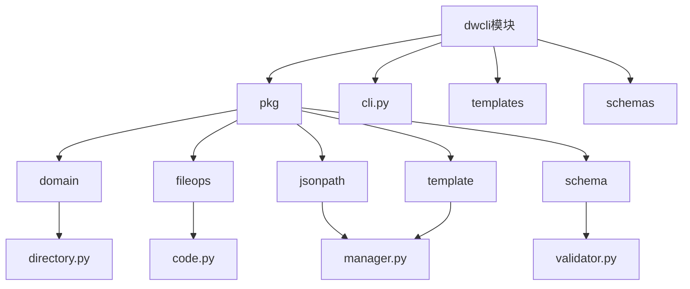
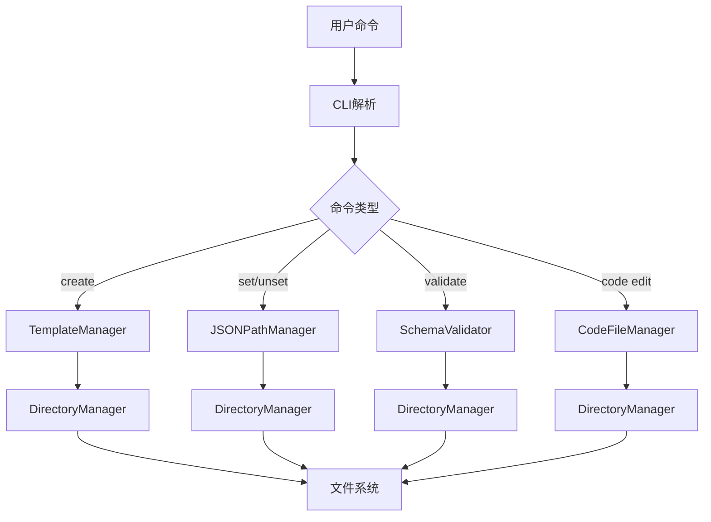
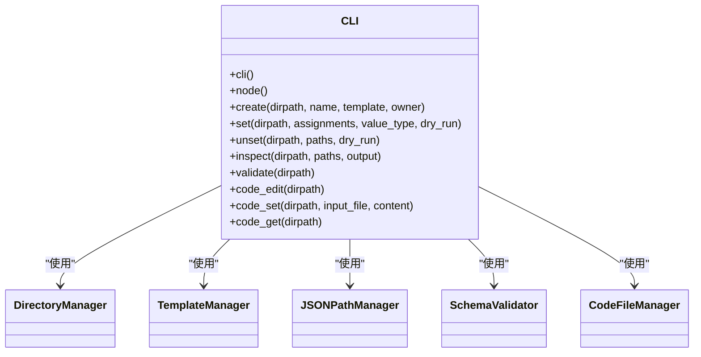
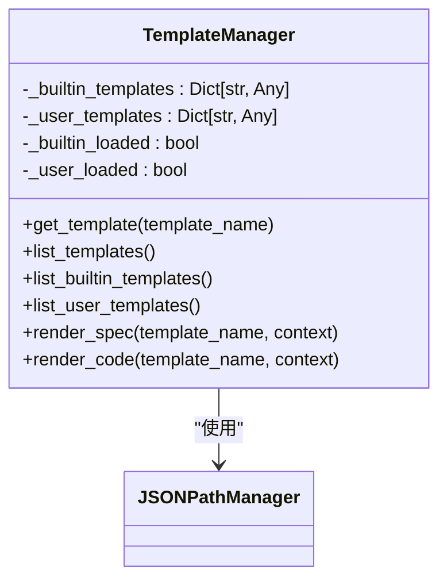
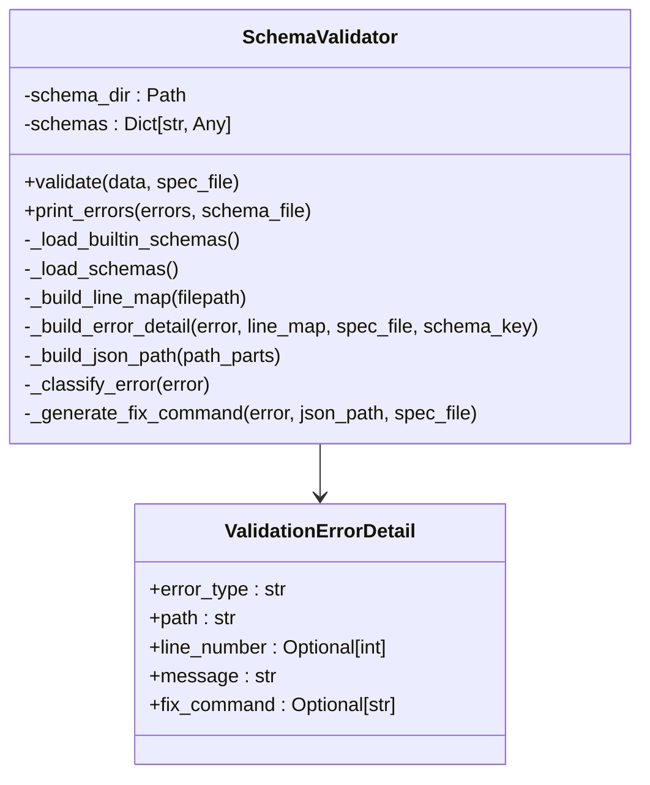
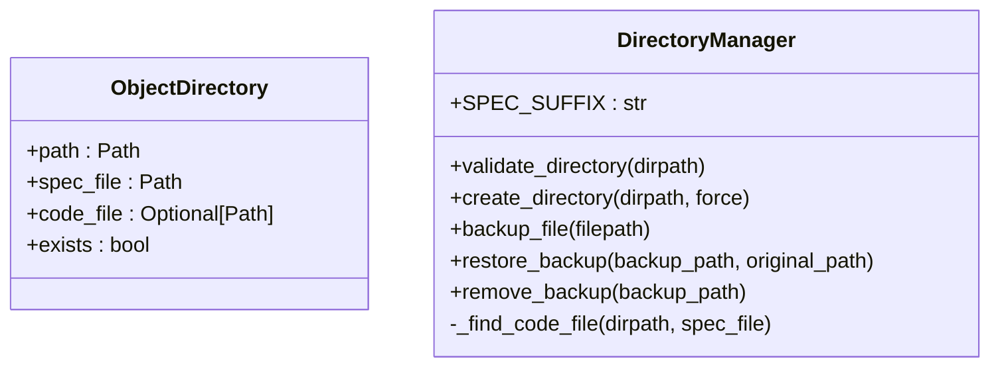
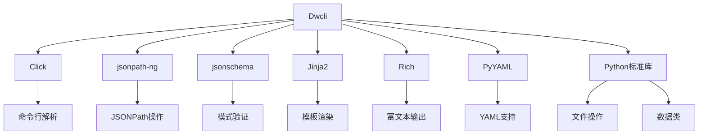

# Dwcli模块

<cite>
**本文档中引用的文件**  
- [cli.py](file://dwcli/dwcli/cli.py)
- [directory.py](file://dwcli/dwcli/pkg/domain/directory.py)
- [manager.py](file://dwcli/dwcli/pkg/jsonpath/manager.py)
- [validator.py](file://dwcli/dwcli/pkg/schema/validator.py)
- [manager.py](file://dwcli/dwcli/pkg/template/manager.py)
- [code.py](file://dwcli/dwcli/pkg/fileops/code.py)
- [odps-sql-daily.template.json](file://dwcli/dwcli/templates/odps-sql-daily.template.json)
- [CycleWorkflow.schedule.schema.json](file://dwcli/dwcli/schemas/CycleWorkflow.schedule.schema.json)
- [setup.py](file://dwcli/setup.py)
- [README.md](file://dwcli/README.md)
</cite>

## 目录
1. [简介](#简介)
2. [项目结构](#项目结构)
3. [核心组件](#核心组件)
4. [架构概述](#架构概述)
5. [详细组件分析](#详细组件分析)
6. [依赖分析](#依赖分析)
7. [性能考虑](#性能考虑)
8. [故障排除指南](#故障排除指南)
9. [结论](#结论)

## 简介
Dwcli是一个为DataWorks平台设计的命令行工具，旨在通过代码化配置（Configuration-as-Code）的方式管理数据工作流。该工具提供了一套完整的命令集，用于创建、验证和管理符合DataWorks规范的工作流节点。Dwcli基于Python开发，利用Click库构建命令行界面，结合Jinja2模板引擎、JSON Schema验证和JSONPath操作，实现了高效的工作流管理能力。用户可以通过简单的命令快速生成标准化的工作流模板，进行配置修改，并确保生成的规范文件符合DataWorks的要求。

## 项目结构
Dwcli模块采用清晰的分层架构，将功能划分为多个独立的包，便于维护和扩展。项目根目录包含标准的Python包配置文件（setup.py）、依赖管理文件（requirements.txt）和文档文件（README.md）。核心功能实现在dwcli/dwcli目录下，按照功能划分为不同的子包。

**图源**  
- [directory.py](file://dwcli/dwcli/pkg/domain/directory.py)
- [code.py](file://dwcli/dwcli/pkg/fileops/code.py)
- [manager.py](file://dwcli/dwcli/pkg/jsonpath/manager.py)
- [validator.py](file://dwcli/dwcli/pkg/schema/validator.py)
- [manager.py](file://dwcli/dwcli/pkg/template/manager.py)

**章节来源**  
- [setup.py](file://dwcli/setup.py)
- [README.md](file://dwcli/README.md)

## 核心组件
Dwcli的核心组件包括命令行接口（CLI）、模板管理器（TemplateManager）、验证器（Validator）、目录管理器（DirectoryManager）和JSONPath管理器（JSONPathManager）。这些组件协同工作，实现了从模板生成到配置验证的完整工作流。CLI作为用户交互的入口，解析用户命令并调用相应的功能模块。TemplateManager负责加载和渲染JSON模板，生成符合规范的工作流定义。Validator利用JSON Schema对生成的规范文件进行严格校验，确保其符合DataWorks的要求。DirectoryManager管理本地工作区的文件结构，确保目录和文件的正确组织。JSONPathManager提供对JSON文件的精确操作能力，支持配置的读取、修改和删除。

**章节来源**  
- [cli.py](file://dwcli/dwcli/cli.py#L1-L312)
- [directory.py](file://dwcli/dwcli/pkg/domain/directory.py#L1-L85)
- [manager.py](file://dwcli/dwcli/pkg/jsonpath/manager.py#L1-L153)
- [validator.py](file://dwcli/dwcli/pkg/schema/validator.py#L1-L231)
- [manager.py](file://dwcli/dwcli/pkg/template/manager.py#L1-L123)

## 架构概述
Dwcli的架构设计遵循单一职责原则，将不同的功能分离到独立的模块中。整个系统以cli.py作为主入口，通过Click框架定义命令行命令。当用户执行命令时，CLI解析参数并调用相应的功能模块。模板管理、配置验证、文件操作等核心功能被封装在独立的包中，通过清晰的接口进行交互。这种模块化的设计使得系统易于维护和扩展，同时也便于单元测试。

**图源**  
- [cli.py](file://dwcli/dwcli/cli.py#L1-L312)
- [directory.py](file://dwcli/dwcli/pkg/domain/directory.py#L1-L85)

## 详细组件分析

### CLI主入口分析
cli.py是Dwcli模块的主入口文件，使用Click库定义了所有命令行命令。文件通过装饰器模式定义了命令组和具体命令，实现了清晰的命令层次结构。主要命令包括node create（创建节点）、node set（设置配置）、node unset（删除配置）、node inspect（查看配置）、node validate（验证配置）以及node code子命令（代码管理）。每个命令都通过参数解析获取用户输入，并调用相应的功能模块完成具体操作。

**图源**  
- [cli.py](file://dwcli/dwcli/cli.py#L1-L312)

**章节来源**  
- [cli.py](file://dwcli/dwcli/cli.py#L1-L312)

### 模板管理功能分析
TemplateManager类负责管理Dwcli的模板功能，支持内置模板和用户自定义模板。模板文件以JSON格式存储，包含spec和code两个主要部分。spec部分定义了工作流的结构，使用Jinja2模板语法包含变量（如{{ name }}），在渲染时会被实际值替换。code部分定义了代码文件的扩展名和初始内容。TemplateManager通过_load_builtin_templates方法加载内置模板（位于templates目录），通过_load_user_templates方法加载用户自定义模板（位于~/.config/dwcli/templates目录）。

**图源**  
- [manager.py](file://dwcli/dwcli/pkg/template/manager.py#L1-L123)
- [odps-sql-daily.template.json](file://dwcli/dwcli/templates/odps-sql-daily.template.json)

**章节来源**  
- [manager.py](file://dwcli/dwcli/pkg/template/manager.py#L1-L123)

### 验证器功能分析
SchemaValidator类利用JSON Schema对工作流定义进行验证。验证器支持内置模式（位于schemas目录）和用户自定义模式（位于~/.config/dwcli/schemas目录）。验证过程包括加载模式文件、构建验证器实例、执行验证并收集错误信息。验证器还提供了详细的错误报告功能，包括错误类型、路径、行号和修复建议。_build_line_map方法通过解析JSON文件构建行号映射，使得错误信息能够精确到具体的行号。

**图源**  
- [validator.py](file://dwcli/dwcli/pkg/schema/validator.py#L1-L231)
- [CycleWorkflow.schedule.schema.json](file://dwcli/dwcli/schemas/CycleWorkflow.schedule.schema.json)

**章节来源**  
- [validator.py](file://dwcli/dwcli/pkg/schema/validator.py#L1-L231)

### 目录管理功能分析
DirectoryManager类负责管理本地工作区的文件结构。它定义了ObjectDirectory数据类来表示一个工作流节点目录，包含路径、规范文件和代码文件等属性。validate_directory方法验证目录结构的正确性，确保目录存在、是目录类型，并且包含且仅包含一个以.schedule.json结尾的规范文件。create_directory方法创建新的目录结构，backup_file和restore_backup方法提供文件备份和恢复功能，用于在配置修改失败时回滚更改。

**图源**  
- [directory.py](file://dwcli/dwcli/pkg/domain/directory.py#L1-L85)

**章节来源**  
- [directory.py](file://dwcli/dwcli/pkg/domain/directory.py#L1-L85)

## 依赖分析
Dwcli模块依赖多个第三方库来实现其功能。主要依赖包括：Click（命令行界面）、jsonpath-ng（JSONPath操作）、jsonschema（JSON Schema验证）、jinja2（模板渲染）、rich（富文本输出）和pyyaml（YAML支持）。这些依赖在setup.py文件中明确定义，并通过pip安装。Dwcli还依赖于Python标准库中的pathlib、json、dataclasses等模块。项目内部模块之间通过清晰的接口进行交互，降低了耦合度。

**图源**  
- [setup.py](file://dwcli/setup.py#L1-L39)

**章节来源**  
- [setup.py](file://dwcli/setup.py#L1-L39)

## 性能考虑
Dwcli的设计考虑了性能和用户体验。通过将模板和模式文件预加载到内存中，避免了每次命令执行时重复读取文件的开销。JSONPath操作通过自定义实现而非依赖jsonpath-ng的完整功能，提高了执行效率。文件操作采用原子性设计，通过备份机制确保在配置修改失败时能够安全回滚。错误处理机制提供了详细的错误信息和修复建议，减少了用户调试时间。整体设计使得命令执行快速且可靠。

## 故障排除指南
当使用Dwcli遇到问题时，可以参考以下常见问题的解决方案：
1. **模板未找到**：确保模板名称正确，或检查~/.config/dwcli/templates目录中是否存在自定义模板。
2. **验证失败**：根据验证器提供的详细错误信息和修复建议进行修改，注意错误行号的提示。
3. **目录结构错误**：确保工作流节点目录中包含且仅包含一个以.schedule.json结尾的文件。
4. **依赖缺失**：确保已安装所有必需的Python包，可通过pip install -e .重新安装。

**章节来源**  
- [cli.py](file://dwcli/dwcli/cli.py#L1-L312)
- [validator.py](file://dwcli/dwcli/pkg/schema/validator.py#L1-L231)
- [directory.py](file://dwcli/dwcli/pkg/domain/directory.py#L1-L85)

## 结论
Dwcli模块是一个功能强大且设计良好的DataWorks命令行工具，通过代码化配置的方式简化了工作流的管理。其模块化的架构、清晰的接口设计和丰富的功能使其成为DataWorks开发者的有力工具。通过模板管理、配置操作和严格验证的结合，Dwcli确保了工作流定义的一致性和正确性，提高了开发效率和质量。