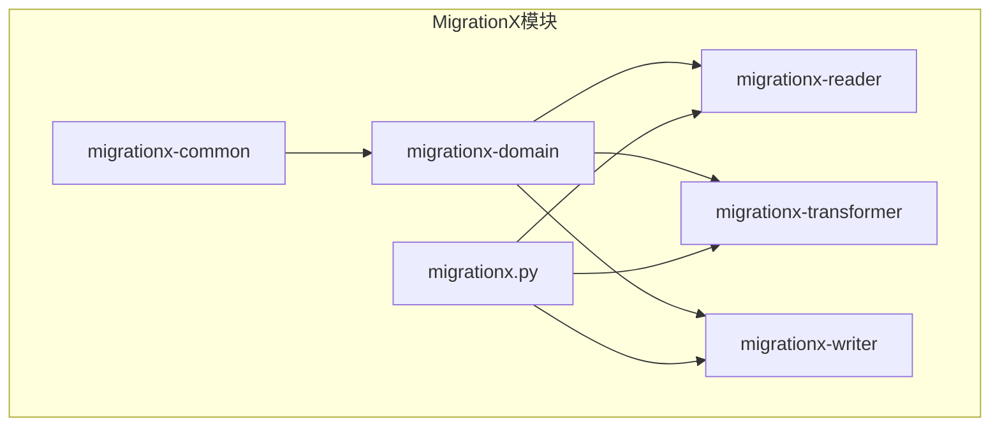
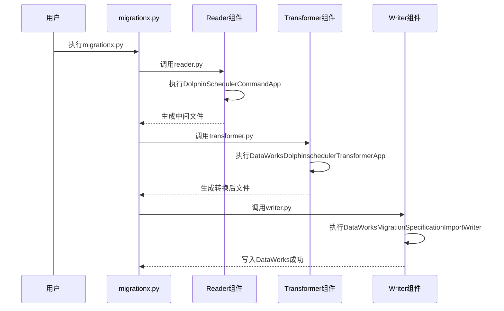
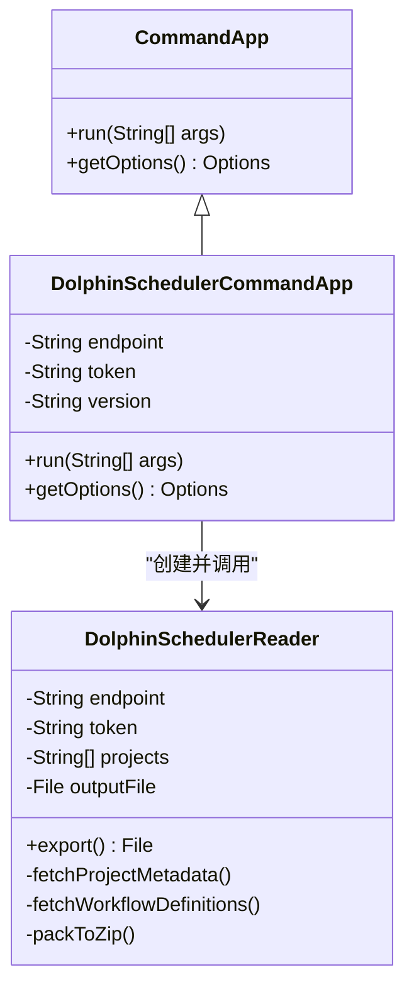
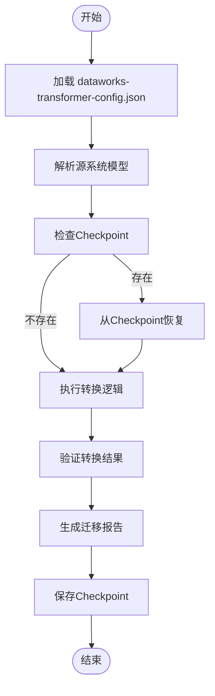
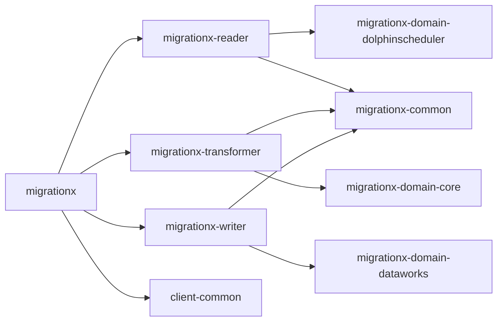

# MigrationX模块

<cite>
**本文档引用的文件**  
- [migrationx.py](file://client/migrationx/src/main/bin/migrationx.py)
- [reader.py](file://client/migrationx/src/main/bin/reader.py)
- [transformer.py](file://client/migrationx/src/main/bin/transformer.py)
- [writer.py](file://client/migrationx/src/main/bin/writer.py)
- [common.py](file://client/client-common/src/main/bin/common.py)
- [migrationx.json](file://client/migrationx/src/main/conf/migrationx.json)
- [dataworks-transformer-config.json](file://client/migrationx/migrationx-transformer/src/main/conf/dataworks-transformer-config.json)
- [DolphinSchedulerCommandApp.java](file://client/migrationx/migrationx-reader/src/main/java/com/aliyun/dataworks/migrationx/reader/dolphinscheduler/DolphinSchedulerCommandApp.java)
- [DolphinSchedulerReader.java](file://client/migrationx/migrationx-reader/src/main/java/com/aliyun/dataworks/migrationx/reader/dolphinscheduler/DolphinSchedulerReader.java)
- [DataWorksDolphinschedulerTransformerApp.java](file://client/migrationx/migrationx-transformer/src/main/java/com/aliyun/dataworks/migrationx/transformer/dataworks/apps/DataWorksDolphinschedulerTransformerApp.java)
- [BaseTransformerApp.java](file://client/migrationx/migrationx-transformer/src/main/java/com/aliyun/dataworks/migrationx/transformer/BaseTransformerApp.java)
- [DataWorksMigrationSpecificationImportWriter.java](file://client/migrationx/migrationx-writer/src/main/java/com/aliyun/dataworks/migrationx/writer/DataWorksMigrationSpecificationImportWriter.java)
</cite>

## 目录
1. [简介](#简介)
2. [项目结构](#项目结构)
3. [核心组件](#核心组件)
4. [架构概述](#架构概述)
5. [详细组件分析](#详细组件分析)
6. [依赖分析](#依赖分析)
7. [性能考虑](#性能考虑)
8. [故障排除指南](#故障排除指南)
9. [结论](#结论)

## 简介
MigrationX模块是一个基于管道-过滤器架构的迁移框架，旨在将多种调度系统（如ADF、Airflow、DolphinScheduler等）的工作流和任务模型迁移至阿里云DataWorks平台。该模块通过Reader、Transformer和Writer三大组件协同工作，实现源系统模型的解析、转换和写入。本文档详细阐述其架构设计、执行流程、配置机制及可恢复性保障。

## 项目结构
MigrationX模块采用模块化设计，主要由migrationx-common、migrationx-domain、migrationx-reader、migrationx-transformer和migrationx-writer五个子模块构成。主入口脚本位于`client/migrationx/src/main/bin/`目录下，包括`migrationx.py`、`reader.py`、`transformer.py`和`writer.py`。配置文件位于`client/migrationx/src/main/conf/`目录，核心配置为`migrationx.json`和`dataworks-transformer-config.json`。

**图示来源**
- [migrationx.py](file://client/migrationx/src/main/bin/migrationx.py)
- [project_structure](file://project_structure)

## 核心组件
MigrationX的核心由Reader、Transformer和Writer三个子组件构成，遵循管道-过滤器模式。Reader负责从源系统（如DolphinScheduler）读取原始数据并序列化为中间格式；Transformer根据配置文件对中间数据进行模型转换，适配DataWorks规范；Writer则将转换后的规范数据写入DataWorks平台。三者通过文件系统进行数据交换，确保了组件间的松耦合。

**组件来源**
- [migrationx.py](file://client/migrationx/src/main/bin/migrationx.py#L15-L33)
- [migrationx.json](file://client/migrationx/src/main/conf/migrationx.json)

## 架构概述
MigrationX采用命令行应用模式，由`migrationx.py`作为总控入口，根据`migrationx.json`配置文件依次调用Reader、Transformer和Writer的执行脚本。每个子组件通过Java的`CommandApp`模式启动，利用`common.py`中的`run_command`函数构建并执行Java命令。整个流程形成一条清晰的数据管道，支持checkpoint机制以保证迁移过程的可恢复性。

**图示来源**
- [migrationx.py](file://client/migrationx/src/main/bin/migrationx.py)
- [common.py](file://client/client-common/src/main/bin/common.py#L55-L81)
- [DolphinSchedulerCommandApp.java](file://client/migrationx/migrationx-reader/src/main/java/com/aliyun/dataworks/migrationx/reader/dolphinscheduler/DolphinSchedulerCommandApp.java)
- [DataWorksDolphinschedulerTransformerApp.java](file://client/migrationx/migrationx-transformer/src/main/java/com/aliyun/dataworks/migrationx/transformer/dataworks/apps/DataWorksDolphinschedulerTransformerApp.java)

## 详细组件分析

### Reader组件分析
Reader组件负责解析源系统模型。以DolphinScheduler为例，`DolphinSchedulerCommandApp`继承自`CommandApp`，通过命令行参数（如API端点、令牌、项目名）初始化`DolphinSchedulerReader`。该Reader通过HTTP API从DolphinScheduler获取项目、工作流和任务的元数据，并将其打包为ZIP文件作为中间产物。

**图示来源**
- [DolphinSchedulerCommandApp.java](file://client/migrationx/migrationx-reader/src/main/java/com/aliyun/dataworks/migrationx/reader/dolphinscheduler/DolphinSchedulerCommandApp.java)
- [DolphinSchedulerReader.java](file://client/migrationx/migrationx-reader/src/main/java/com/aliyun/dataworks/migrationx/reader/dolphinscheduler/DolphinSchedulerReader.java)

### Transformer组件分析
Transformer组件基于配置文件执行模型转换。`DataWorksDolphinschedulerTransformerApp`是具体的转换应用，它读取`dataworks-transformer-config.json`中的配置，如`workflow.converter.sqlNodeTypeMapping`定义了不同SQL类型到DataWorks节点的映射关系。转换过程支持跳过不支持的类型和继续处理错误，确保迁移的健壮性。

**图示来源**
- [DataWorksDolphinschedulerTransformerApp.java](file://client/migrationx/migrationx-transformer/src/main/java/com/aliyun/dataworks/migrationx/transformer/dataworks/apps/DataWorksDolphinschedulerTransformerApp.java)
- [BaseTransformerApp.java](file://client/migrationx/migrationx-transformer/src/main/java/com/aliyun/dataworks/migrationx/transformer/BaseTransformerApp.java)
- [dataworks-transformer-config.json](file://client/migrationx/migrationx-transformer/src/main/conf/dataworks-transformer-config.json)

### Writer组件分析
Writer组件负责将转换后的规范数据写入DataWorks。`DataWorksMigrationSpecificationImportWriter`接收转换后的ZIP文件，通过DataWorks的API将工作流、任务、依赖等元数据导入目标工作空间。它利用`migrationx.json`中的认证信息（AccessKey ID/Secret）和区域配置进行安全通信。

**组件来源**
- [DataWorksMigrationSpecificationImportWriter.java](file://client/migrationx/migrationx-writer/src/main/java/com/aliyun/dataworks/migrationx/writer/DataWorksMigrationSpecificationImportWriter.java)
- [migrationx.json](file://client/migrationx/src/main/conf/migrationx.json#L23-L33)

## 依赖分析
MigrationX模块依赖于多个外部库和内部模块。`migrationx-common`提供通用工具和上下文管理；`migrationx-domain`定义了各源系统和目标系统的数据模型；`client-common`提供了`CommandApp`命令模式的基础实现。各组件通过Maven进行依赖管理，确保版本一致性。

**图示来源**
- [pom.xml](file://client/migrationx/pom.xml)
- [pom.xml](file://client/migrationx/migrationx-reader/pom.xml)
- [pom.xml](file://client/migrationx/migrationx-transformer/pom.xml)
- [pom.xml](file://client/migrationx/migrationx-writer/pom.xml)

## 性能考虑
MigrationX在设计上考虑了性能和可扩展性。Reader组件采用分页和批量请求减少API调用次数；Transformer组件支持并行任务转换和内存检查点；Writer组件通过异步API调用提高导入效率。建议在高并发场景下调整JVM堆大小和网络超时参数。

## 故障排除指南
常见问题包括API认证失败、网络连接超时和模型转换错误。应首先检查`migrationx.json`中的配置项是否正确，特别是环境变量（如`${ALIYUN_ACCESS_KEY_ID}`）是否已设置。日志文件位于`logs/`目录下，按组件命名（如`reader.log`），可用于追踪具体错误。对于转换错误，可启用`transformContinueWithError`配置项跳过问题项。

**故障排除来源**
- [common.py](file://client/client-common/src/main/bin/common.py#L69-L75)
- [dataworks-transformer-config.json](file://client/migrationx/migrationx-transformer/src/main/conf/dataworks-transformer-config.json#L5-L6)

## 结论
MigrationX模块通过清晰的管道-过滤器架构，实现了多源调度系统到DataWorks的自动化迁移。其模块化设计和基于配置的转换机制，使得扩展新的源系统支持变得简单。CommandApp命令模式和checkpoint机制确保了执行的可靠性和可恢复性，是企业级数据迁移的理想解决方案。