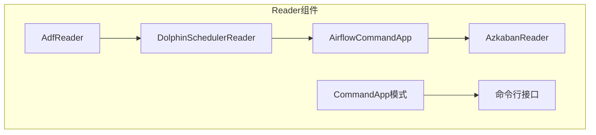
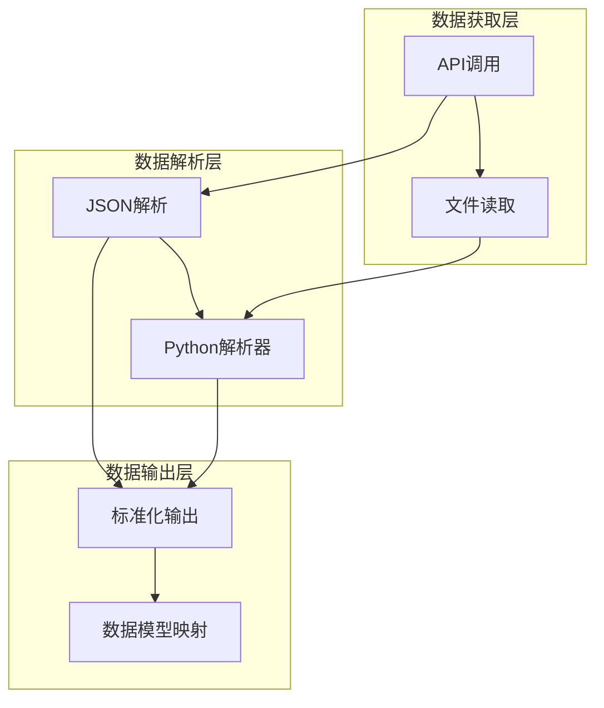
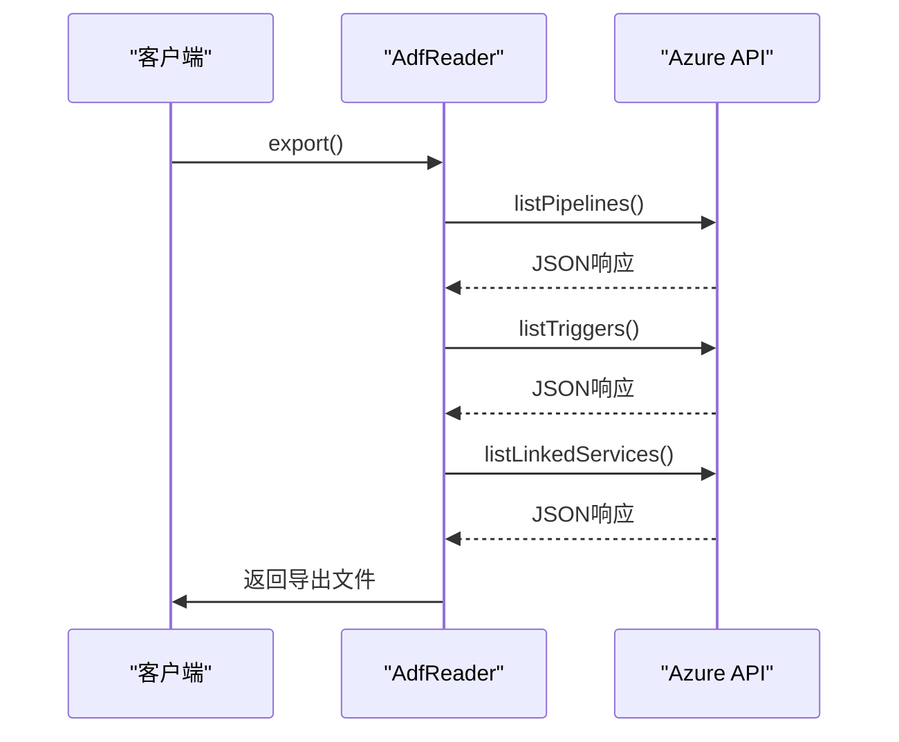
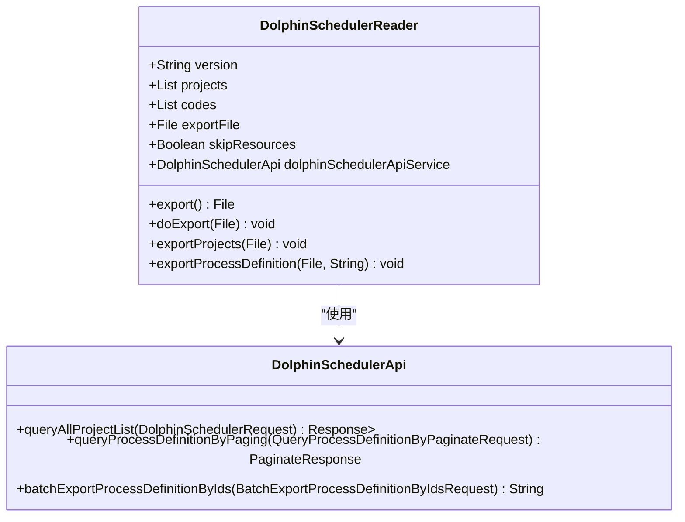
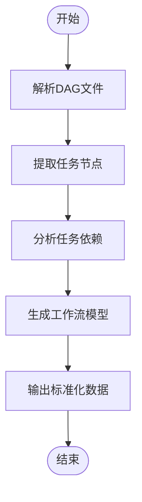
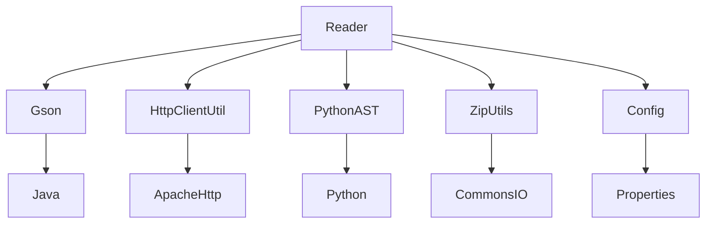

# Reader组件

<cite>
**本文档引用的文件**
- [AdfReader.java](file://client/migrationx/migrationx-reader/src/main/java/com/aliyun/dataworks/migrationx/reader/adf/AdfReader.java)
- [DolphinSchedulerReader.java](file://client/migrationx/migrationx-reader/src/main/java/com/aliyun/dataworks/migrationx/reader/dolphinscheduler/DolphinSchedulerReader.java)
- [DolphinSchedulerSingleJsonReader.java](file://client/migrationx/migrationx-reader/src/main/java/com/aliyun/dataworks/migrationx/reader/dolphinscheduler/DolphinSchedulerSingleJsonReader.java)
- [AdfPackage.java](file://client/migrationx/migrationx-domain/migrationx-domain-adf/src/main/java/com/aliyun/dataworks/migrationx/domain/adf/AdfPackage.java)
- [AirflowWorkflow.java](file://client/migrationx/migrationx-domain/migrationx-domain-airflow/src/main/java/com/aliyun/dataworks/migrationx/domain/dataworks/airflow/AirflowWorkflow.java)
- [Package.java](file://client/migrationx/migrationx-domain/migrationx-domain-core/src/main/java/com/aliyun/dataworks/migrationx/domain/dataworks/standard/objects/Package.java)
- [airflow_dag_parser.py](file://client/migrationx/migrationx-reader/src/main/python/src/airflow_dag_parser/dag_parser.py)
- [dag_converter.py](file://client/migrationx/migrationx-transformer/src/main/python/airflow_dag_parser/converter/dag_converter.py)
</cite>

## 目录
1. [简介](#简介)
2. [项目结构](#项目结构)
3. [核心组件](#核心组件)
4. [架构概述](#架构概述)
5. [详细组件分析](#详细组件分析)
6. [依赖分析](#依赖分析)
7. [性能考虑](#性能考虑)
8. [故障排除指南](#故障排除指南)
9. [结论](#结论)

## 简介
Reader组件是数据迁移管道中的关键数据源组件，负责解析多种调度系统的原生模型，包括ADF、Airflow、DolphinScheduler和Azkaban等。该组件通过统一的接口设计，实现了对不同调度系统工作流定义的解析和转换，为后续的数据迁移和转换提供了标准化的数据输入。本文档将深入阐述Reader组件的设计原理、实现机制以及扩展方法。

## 项目结构
Reader组件位于`client/migrationx/migrationx-reader`目录下，采用模块化设计，每个调度系统都有独立的Reader实现。组件主要由Java和Python两种语言实现，Java部分负责与外部系统的API交互和数据获取，Python部分则专注于复杂的数据解析任务，特别是Airflow的DAG文件解析。

**图示来源**
- [AdfReader.java](file://client/migrationx/migrationx-reader/src/main/java/com/aliyun/dataworks/migrationx/reader/adf/AdfReader.java)
- [DolphinSchedulerReader.java](file://client/migrationx/migrationx-reader/src/main/java/com/aliyun/dataworks/migrationx/reader/dolphinscheduler/DolphinSchedulerReader.java)

**本节来源**
- [AdfReader.java](file://client/migrationx/migrationx-reader/src/main/java/com/aliyun/dataworks/migrationx/reader/adf/AdfReader.java)
- [DolphinSchedulerReader.java](file://client/migrationx/migrationx-reader/src/main/java/com/aliyun/dataworks/migrationx/reader/dolphinscheduler/DolphinSchedulerReader.java)

## 核心组件
Reader组件的核心功能是作为数据迁移管道的数据源，负责从各种调度系统中提取原生模型数据。组件通过工厂模式和策略模式的结合，实现了对不同调度系统的统一管理和灵活扩展。每个Reader实现都遵循相同的接口规范，确保了组件的可替换性和可测试性。

**本节来源**
- [AdfReader.java](file://client/migrationx/migrationx-reader/src/main/java/com/aliyun/dataworks/migrationx/reader/adf/AdfReader.java)
- [DolphinSchedulerReader.java](file://client/migrationx/migrationx-reader/src/main/java/com/aliyun/dataworks/migrationx/reader/dolphinscheduler/DolphinSchedulerReader.java)

## 架构概述
Reader组件采用分层架构设计，分为数据获取层、数据解析层和数据输出层。数据获取层负责与外部系统进行通信，获取原始数据；数据解析层负责将原始数据转换为内部统一的数据模型；数据输出层则负责将解析后的数据以标准化格式输出，供后续组件使用。

**图示来源**
- [AdfReader.java](file://client/migrationx/migrationx-reader/src/main/java/com/aliyun/dataworks/migrationx/reader/adf/AdfReader.java)
- [airflow_dag_parser.py](file://client/migrationx/migrationx-reader/src/main/python/src/airflow_dag_parser/dag_parser.py)

## 详细组件分析

### AdfReader分析
AdfReader负责解析Azure Data Factory的JSON格式包。它通过Azure Management API获取管道、触发器和链接服务的定义，并将其转换为内部数据模型。Reader使用HttpClientUtil进行HTTP请求，通过GsonUtils进行JSON序列化和反序列化。

**图示来源**
- [AdfReader.java](file://client/migrationx/migrationx-reader/src/main/java/com/aliyun/dataworks/migrationx/reader/adf/AdfReader.java)
- [AdfPackage.java](file://client/migrationx/migrationx-domain/migrationx-domain-adf/src/main/java/com/aliyun/dataworks/migrationx/domain/adf/AdfPackage.java)

**本节来源**
- [AdfReader.java](file://client/migrationx/migrationx-reader/src/main/java/com/aliyun/dataworks/migrationx/reader/adf/AdfReader.java)
- [AdfPackage.java](file://client/migrationx/migrationx-domain/migrationx-domain-adf/src/main/java/com/aliyun/dataworks/migrationx/domain/adf/AdfPackage.java)

### DolphinSchedulerReader分析
DolphinSchedulerReader通过API或文件读取v1/v2/v3版本的工作流定义。它支持分页查询和批量导出，能够处理大规模的工作流数据。Reader根据版本号动态选择相应的API服务实现，确保了对不同版本的兼容性。

**图示来源**
- [DolphinSchedulerReader.java](file://client/migrationx/migrationx-reader/src/main/java/com/aliyun/dataworks/migrationx/reader/dolphinscheduler/DolphinSchedulerReader.java)
- [DolphinSchedulerApiService.java](file://client/migrationx/migrationx-domain/migrationx-domain-dolphinscheduler/src/main/java/com/aliyun/dataworks/migrationx/domain/dataworks/dolphinscheduler/v1/DolphinSchedulerApiService.java)

**本节来源**
- [DolphinSchedulerReader.java](file://client/migrationx/migrationx-reader/src/main/java/com/aliyun/dataworks/migrationx/reader/dolphinscheduler/DolphinSchedulerReader.java)

### AirflowCommandApp分析
AirflowCommandApp利用Python解析器处理DAG文件。它通过CommandApp模式提供命令行接口，允许用户直接调用解析功能。Python解析器使用AST（抽象语法树）技术深入分析DAG文件的结构，提取任务依赖关系和执行逻辑。

**图示来源**
- [airflow_dag_parser.py](file://client/migrationx/migrationx-reader/src/main/python/src/airflow_dag_parser/dag_parser.py)
- [dag_converter.py](file://client/migrationx/migrationx-transformer/src/main/python/airflow_dag_parser/converter/dag_converter.py)

**本节来源**
- [airflow_dag_parser.py](file://client/migrationx/migrationx-reader/src/main/python/src/airflow_dag_parser/dag_parser.py)
- [AirflowWorkflow.java](file://client/migrationx/migrationx-domain/migrationx-domain-airflow/src/main/java/com/aliyun/dataworks/migrationx/domain/dataworks/airflow/AirflowWorkflow.java)

## 依赖分析
Reader组件依赖于多个核心库和工具，包括Gson用于JSON处理，HttpClientUtil用于HTTP通信，以及Python的AST库用于代码解析。这些依赖项通过Maven和pip进行管理，确保了版本的一致性和可重复性。

**图示来源**
- [pom.xml](file://client/migrationx/migrationx-reader/pom.xml)
- [requirements.txt](file://client/migrationx/migrationx-reader/src/main/python/requirements.txt)

**本节来源**
- [pom.xml](file://client/migrationx/migrationx-reader/pom.xml)

## 性能考虑
Reader组件在设计时充分考虑了性能因素。对于大规模数据的处理，采用了分页查询和流式处理的方式，避免了内存溢出。同时，通过异步IO和连接池技术，提高了与外部系统的通信效率。对于复杂的解析任务，如Airflow DAG文件的解析，采用了多线程并行处理，显著提升了处理速度。

## 故障排除指南
在使用Reader组件时，可能会遇到API调用失败、数据解析错误等问题。建议首先检查网络连接和认证信息，然后查看日志文件中的详细错误信息。对于数据解析问题，可以尝试使用更详细的日志级别来定位问题。此外，确保Python环境正确配置，特别是AST相关库的版本兼容性。

**本节来源**
- [AdfReader.java](file://client/migrationx/migrationx-reader/src/main/java/com/aliyun/dataworks/migrationx/reader/adf/AdfReader.java)
- [DolphinSchedulerReader.java](file://client/migrationx/migrationx-reader/src/main/java/com/aliyun/dataworks/migrationx/reader/dolphinscheduler/DolphinSchedulerReader.java)

## 结论
Reader组件作为数据迁移管道的关键数据源，通过灵活的设计和强大的解析能力，成功实现了对多种调度系统的支持。其模块化架构和清晰的接口设计，使得扩展新的Reader实现变得简单而高效。未来，可以进一步优化性能，增加对更多调度系统的支持，并提供更丰富的配置选项。