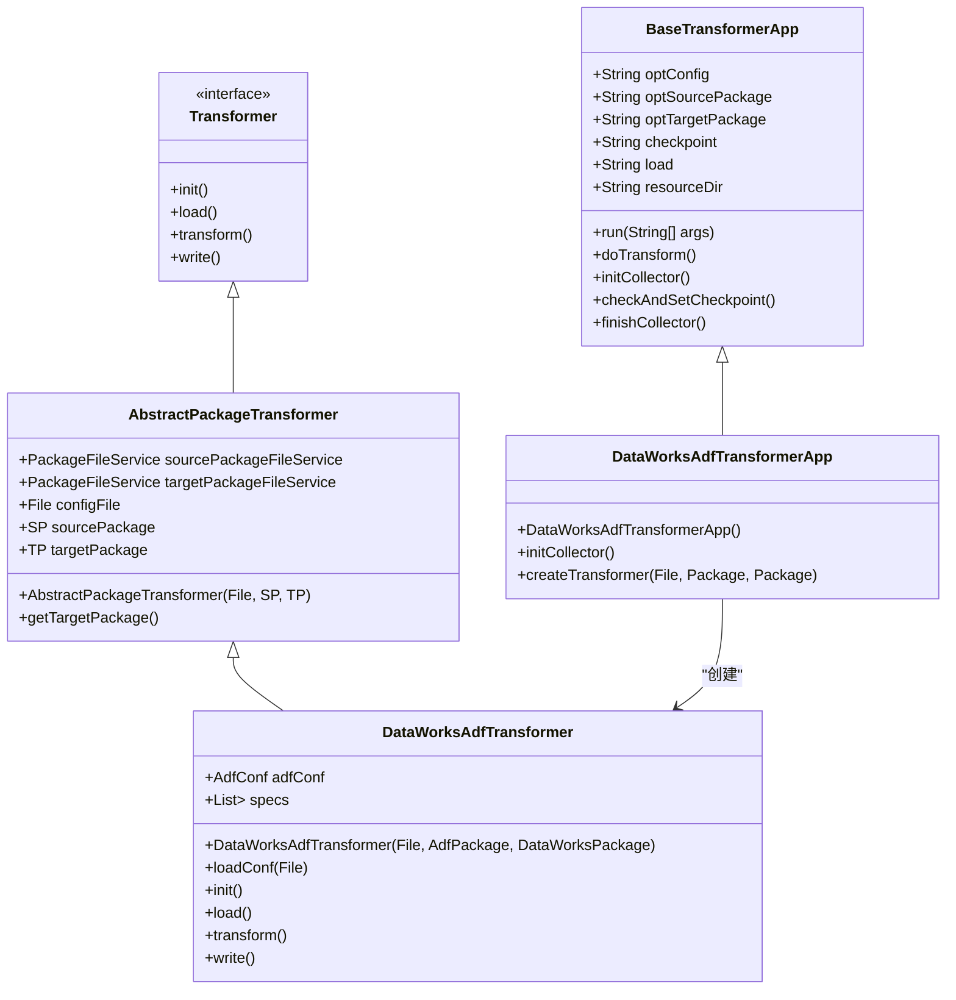
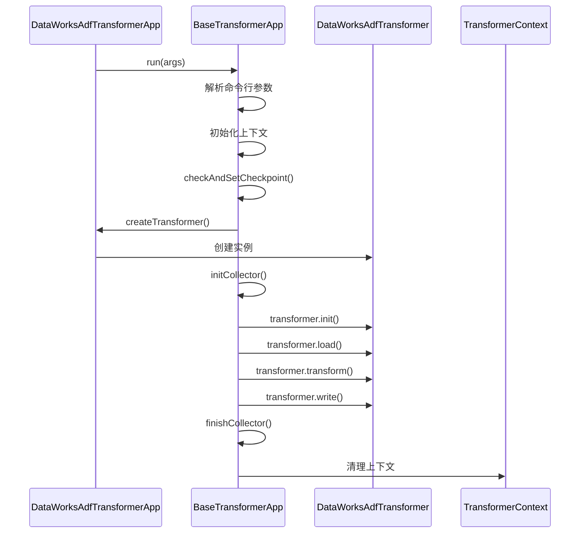
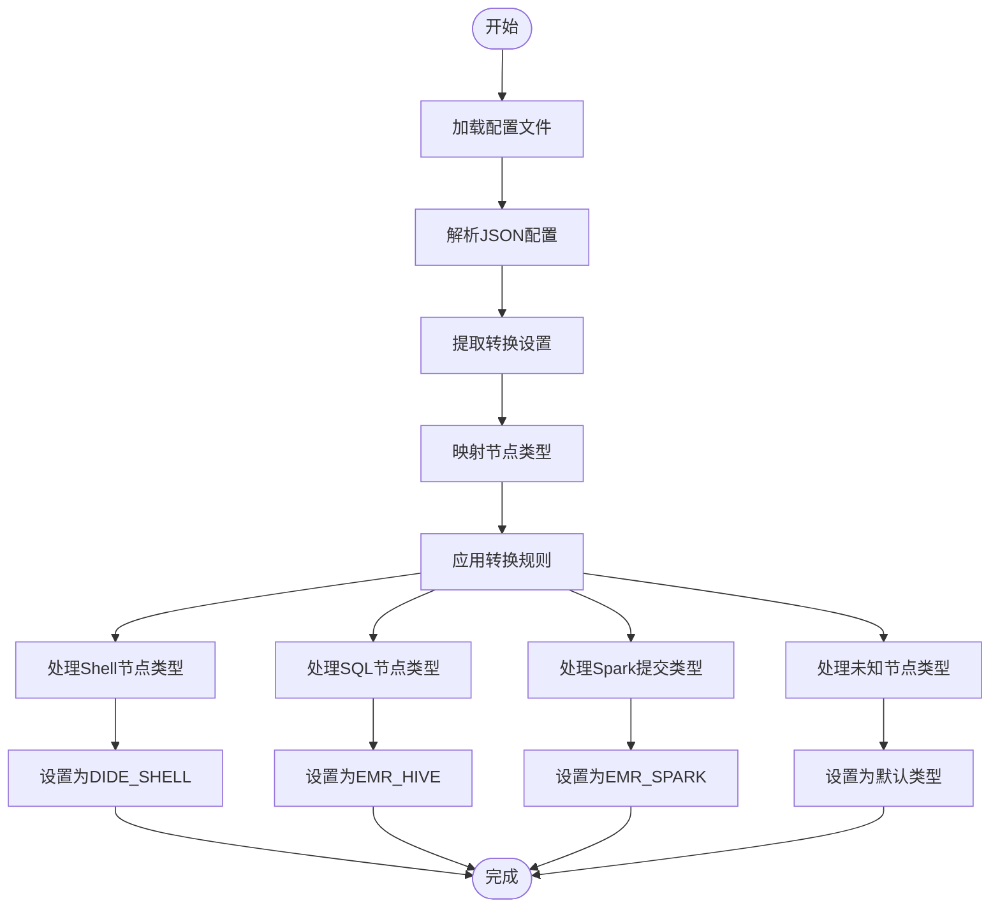
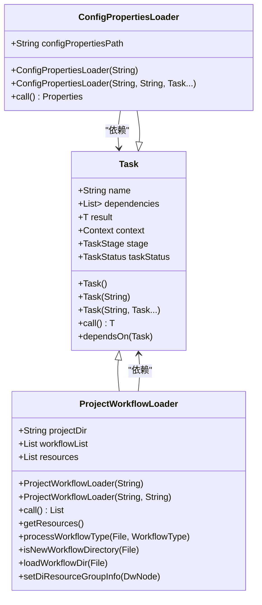
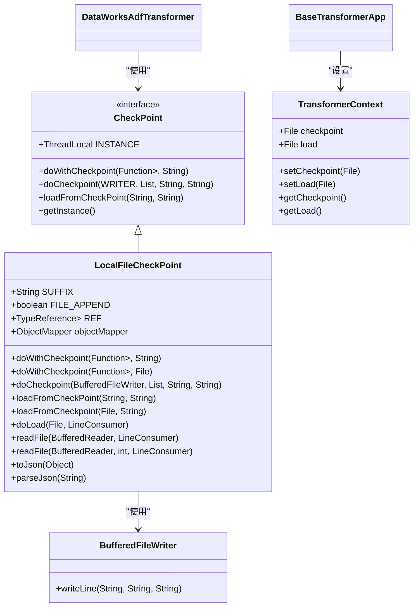
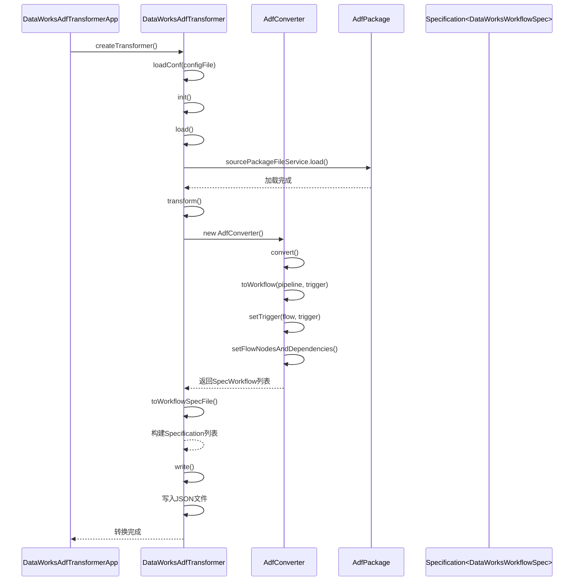
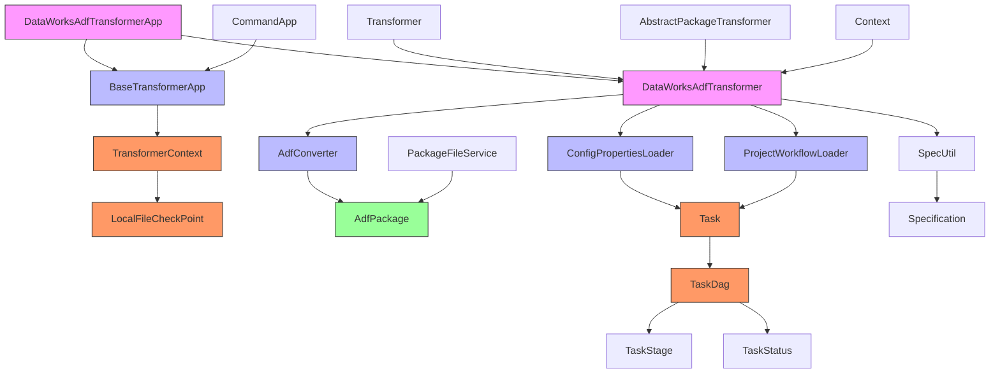

# Transformer组件

<cite>
**本文档引用的文件**
- [BaseTransformerApp.java](file://client/migrationx/migrationx-transformer/src/main/java/com/aliyun/dataworks/migrationx/transformer/core/BaseTransformerApp.java)
- [Transformer.java](file://client/migrationx/migrationx-transformer/src/main/java/com/aliyun/dataworks/migrationx/transformer/core/transformer/Transformer.java)
- [AbstractPackageTransformer.java](file://client/migrationx/migrationx-transformer/src/main/java/com/aliyun/dataworks/migrationx/transformer/core/transformer/AbstractPackageTransformer.java)
- [DataWorksAdfTransformerApp.java](file://client/migrationx/migrationx-transformer/src/main/java/com/aliyun/dataworks/migrationx/transformer/dataworks/apps/DataWorksAdfTransformerApp.java)
- [DataWorksAdfTransformer.java](file://client/migrationx/migrationx-transformer/src/main/java/com/aliyun/dataworks/migrationx/transformer/dataworks/transformer/DataWorksAdfTransformer.java)
- [ConfigPropertiesLoader.java](file://client/migrationx/migrationx-transformer/src/main/java/com/aliyun/dataworks/migrationx/transformer/core/loader/ConfigPropertiesLoader.java)
- [ProjectWorkflowLoader.java](file://client/migrationx/migrationx-transformer/src/main/java/com/aliyun/dataworks/migrationx/transformer/core/loader/ProjectWorkflowLoader.java)
- [CheckPoint.java](file://client/migrationx/migrationx-transformer/src/main/java/com/aliyun/dataworks/migrationx/transformer/core/checkpoint/CheckPoint.java)
- [LocalFileCheckPoint.java](file://client/migrationx/migrationx-transformer/src/main/java/com/aliyun/dataworks/migrationx/transformer/core/checkpoint/file/LocalFileCheckPoint.java)
- [Task.java](file://client/migrationx/migrationx-transformer/src/main/java/com/aliyun/dataworks/migrationx/transformer/core/controller/Task.java)
- [TaskDag.java](file://client/migrationx/migrationx-transformer/src/main/java/com/aliyun/dataworks/migrationx/transformer/core/controller/TaskDag.java)
- [dataworks-transformer-config.json](file://client/migrationx/migrationx-transformer/src/main/conf/dataworks-transformer-config.json)
- [AdfConverter.java](file://client/migrationx/migrationx-transformer/src/main/java/com/aliyun/dataworks/migrationx/transformer/dataworks/converter/adf/AdfConverter.java)
</cite>

## 目录
1. [简介](#简介)
2. [核心架构](#核心架构)
3. [转换任务生命周期](#转换任务生命周期)
4. [配置文件与规则引擎](#配置文件与规则引擎)
5. [上下文加载机制](#上下文加载机制)
6. [断点续传与状态恢复](#断点续传与状态恢复)
7. [具体实现分析](#具体实现分析)
8. [依赖关系分析](#依赖关系分析)

## 简介
Transformer组件是数据迁移管道的核心处理引擎，负责将Reader组件读取的源系统模型转换为DataWorks规范模型。该组件通过配置文件驱动的转换规则引擎，实现了从多种源系统（如Azure Data Factory、Airflow等）到DataWorks平台的自动化转换。组件采用模块化设计，通过任务依赖图（TaskDag）管理转换流程，支持断点续传和状态恢复功能。

## 核心架构

**图示来源**
- [BaseTransformerApp.java](file://client/migrationx/migrationx-transformer/src/main/java/com/aliyun/dataworks/migrationx/transformer/core/BaseTransformerApp.java)
- [Transformer.java](file://client/migrationx/migrationx-transformer/src/main/java/com/aliyun/dataworks/migrationx/transformer/core/transformer/Transformer.java)
- [AbstractPackageTransformer.java](file://client/migrationx/migrationx-transformer/src/main/java/com/aliyun/dataworks/migrationx/transformer/core/transformer/AbstractPackageTransformer.java)
- [DataWorksAdfTransformer.java](file://client/migrationx/migrationx-transformer/src/main/java/com/aliyun/dataworks/migrationx/transformer/dataworks/transformer/DataWorksAdfTransformer.java)
- [DataWorksAdfTransformerApp.java](file://client/migrationx/migrationx-transformer/src/main/java/com/aliyun/dataworks/migrationx/transformer/dataworks/apps/DataWorksAdfTransformerApp.java)

**本节来源**
- [BaseTransformerApp.java](file://client/migrationx/migrationx-transformer/src/main/java/com/aliyun/dataworks/migrationx/transformer/core/BaseTransformerApp.java)
- [Transformer.java](file://client/migrationx/migrationx-transformer/src/main/java/com/aliyun/dataworks/migrationx/transformer/core/transformer/Transformer.java)
- [AbstractPackageTransformer.java](file://client/migrationx/migrationx-transformer/src/main/java/com/aliyun/dataworks/migrationx/transformer/core/transformer/AbstractPackageTransformer.java)

## 转换任务生命周期

**图示来源**
- [BaseTransformerApp.java](file://client/migrationx/migrationx-transformer/src/main/java/com/aliyun/dataworks/migrationx/transformer/core/BaseTransformerApp.java)
- [DataWorksAdfTransformerApp.java](file://client/migrationx/migrationx-transformer/src/main/java/com/aliyun/dataworks/migrationx/transformer/dataworks/apps/DataWorksAdfTransformerApp.java)
- [DataWorksAdfTransformer.java](file://client/migrationx/migrationx-transformer/src/main/java/com/aliyun/dataworks/migrationx/transformer/dataworks/transformer/DataWorksAdfTransformer.java)

**本节来源**
- [BaseTransformerApp.java](file://client/migrationx/migrationx-transformer/src/main/java/com/aliyun/dataworks/migrationx/transformer/core/BaseTransformerApp.java)

## 配置文件与规则引擎

**图示来源**
- [dataworks-transformer-config.json](file://client/migrationx/migrationx-transformer/src/main/conf/dataworks-transformer-config.json)

**本节来源**
- [dataworks-transformer-config.json](file://client/migrationx/migrationx-transformer/src/main/conf/dataworks-transformer-config.json)

## 上下文加载机制

**图示来源**
- [ConfigPropertiesLoader.java](file://client/migrationx/migrationx-transformer/src/main/java/com/aliyun/dataworks/migrationx/transformer/core/loader/ConfigPropertiesLoader.java)
- [ProjectWorkflowLoader.java](file://client/migrationx/migrationx-transformer/src/main/java/com/aliyun/dataworks/migrationx/transformer/core/loader/ProjectWorkflowLoader.java)
- [Task.java](file://client/migrationx/migrationx-transformer/src/main/java/com/aliyun/dataworks/migrationx/transformer/core/controller/Task.java)

**本节来源**
- [ConfigPropertiesLoader.java](file://client/migrationx/migrationx-transformer/src/main/java/com/aliyun/dataworks/migrationx/transformer/core/loader/ConfigPropertiesLoader.java)
- [ProjectWorkflowLoader.java](file://client/migrationx/migrationx-transformer/src/main/java/com/aliyun/dataworks/migrationx/transformer/core/loader/ProjectWorkflowLoader.java)

## 断点续传与状态恢复

**图示来源**
- [CheckPoint.java](file://client/migrationx/migrationx-transformer/src/main/java/com/aliyun/dataworks/migrationx/transformer/core/checkpoint/CheckPoint.java)
- [LocalFileCheckPoint.java](file://client/migrationx/migrationx-transformer/src/main/java/com/aliyun/dataworks/migrationx/transformer/core/checkpoint/file/LocalFileCheckPoint.java)
- [BaseTransformerApp.java](file://client/migrationx/migrationx-transformer/src/main/java/com/aliyun/dataworks/migrationx/transformer/core/BaseTransformerApp.java)

**本节来源**
- [CheckPoint.java](file://client/migrationx/migrationx-transformer/src/main/java/com/aliyun/dataworks/migrationx/transformer/core/checkpoint/CheckPoint.java)
- [LocalFileCheckPoint.java](file://client/migrationx/migrationx-transformer/src/main/java/com/aliyun/dataworks/migrationx/transformer/core/checkpoint/file/LocalFileCheckPoint.java)
- [BaseTransformerApp.java](file://client/migrationx/migrationx-transformer/src/main/java/com/aliyun/dataworks/migrationx/transformer/core/BaseTransformerApp.java)

## 具体实现分析

**图示来源**
- [DataWorksAdfTransformerApp.java](file://client/migrationx/migrationx-transformer/src/main/java/com/aliyun/dataworks/migrationx/transformer/dataworks/apps/DataWorksAdfTransformerApp.java)
- [DataWorksAdfTransformer.java](file://client/migrationx/migrationx-transformer/src/main/java/com/aliyun/dataworks/migrationx/transformer/dataworks/transformer/DataWorksAdfTransformer.java)
- [AdfConverter.java](file://client/migrationx/migrationx-transformer/src/main/java/com/aliyun/dataworks/migrationx/transformer/dataworks/converter/adf/AdfConverter.java)

**本节来源**
- [DataWorksAdfTransformerApp.java](file://client/migrationx/migrationx-transformer/src/main/java/com/aliyun/dataworks/migrationx/transformer/dataworks/apps/DataWorksAdfTransformerApp.java)
- [DataWorksAdfTransformer.java](file://client/migrationx/migrationx-transformer/src/main/java/com/aliyun/dataworks/migrationx/transformer/dataworks/transformer/DataWorksAdfTransformer.java)
- [AdfConverter.java](file://client/migrationx/migrationx-transformer/src/main/java/com/aliyun/dataworks/migrationx/transformer/dataworks/converter/adf/AdfConverter.java)

## 依赖关系分析

**图示来源**
- [BaseTransformerApp.java](file://client/migrationx/migrationx-transformer/src/main/java/com/aliyun/dataworks/migrationx/transformer/core/BaseTransformerApp.java)
- [DataWorksAdfTransformerApp.java](file://client/migrationx/migrationx-transformer/src/main/java/com/aliyun/dataworks/migrationx/transformer/dataworks/apps/DataWorksAdfTransformerApp.java)
- [DataWorksAdfTransformer.java](file://client/migrationx/migrationx-transformer/src/main/java/com/aliyun/dataworks/migrationx/transformer/dataworks/transformer/DataWorksAdfTransformer.java)
- [AdfConverter.java](file://client/migrationx/migrationx-transformer/src/main/java/com/aliyun/dataworks/migrationx/transformer/dataworks/converter/adf/AdfConverter.java)
- [ConfigPropertiesLoader.java](file://client/migrationx/migrationx-transformer/src/main/java/com/aliyun/dataworks/migrationx/transformer/core/loader/ConfigPropertiesLoader.java)
- [ProjectWorkflowLoader.java](file://client/migrationx/migrationx-transformer/src/main/java/com/aliyun/dataworks/migrationx/transformer/core/loader/ProjectWorkflowLoader.java)
- [Task.java](file://client/migrationx/migrationx-transformer/src/main/java/com/aliyun/dataworks/migrationx/transformer/core/controller/Task.java)
- [TaskDag.java](file://client/migrationx/migrationx-transformer/src/main/java/com/aliyun/dataworks/migrationx/transformer/core/controller/TaskDag.java)
- [CheckPoint.java](file://client/migrationx/migrationx-transformer/src/main/java/com/aliyun/dataworks/migrationx/transformer/core/checkpoint/CheckPoint.java)
- [LocalFileCheckPoint.java](file://client/migrationx/migrationx-transformer/src/main/java/com/aliyun/dataworks/migrationx/transformer/core/checkpoint/file/LocalFileCheckPoint.java)

**本节来源**
- [BaseTransformerApp.java](file://client/migrationx/migrationx-transformer/src/main/java/com/aliyun/dataworks/migrationx/transformer/core/BaseTransformerApp.java)
- [DataWorksAdfTransformerApp.java](file://client/migrationx/migrationx-transformer/src/main/java/com/aliyun/dataworks/migrationx/transformer/dataworks/apps/DataWorksAdfTransformerApp.java)
- [DataWorksAdfTransformer.java](file://client/migrationx/migrationx-transformer/src/main/java/com/aliyun/dataworks/migrationx/transformer/dataworks/transformer/DataWorksAdfTransformer.java)
- [AdfConverter.java](file://client/migrationx/migrationx-transformer/src/main/java/com/aliyun/dataworks/migrationx/transformer/dataworks/converter/adf/AdfConverter.java)
- [ConfigPropertiesLoader.java](file://client/migrationx/migrationx-transformer/src/main/java/com/aliyun/dataworks/migrationx/transformer/core/loader/ConfigPropertiesLoader.java)
- [ProjectWorkflowLoader.java](file://client/migrationx/migrationx-transformer/src/main/java/com/aliyun/dataworks/migrationx/transformer/core/loader/ProjectWorkflowLoader.java)
- [Task.java](file://client/migrationx/migrationx-transformer/src/main/java/com/aliyun/dataworks/migrationx/transformer/core/controller/Task.java)
- [TaskDag.java](file://client/migrationx/migrationx-transformer/src/main/java/com/aliyun/dataworks/migrationx/transformer/core/controller/TaskDag.java)