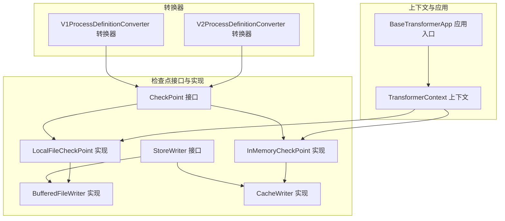
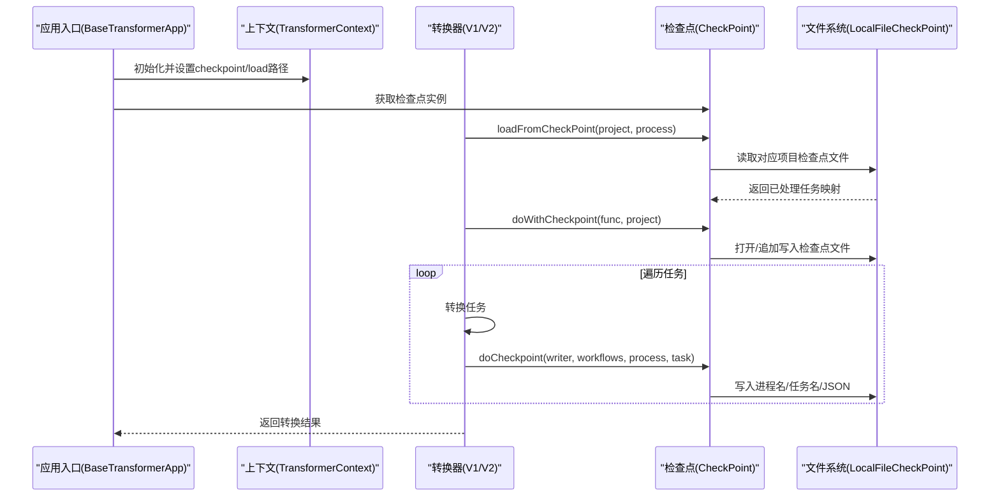
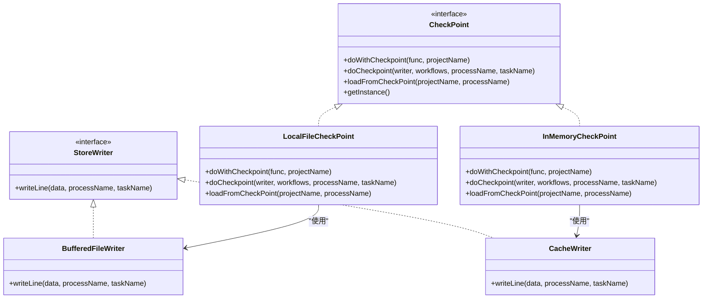

# 检查点与状态管理

<cite>
**本文引用的文件列表**
- [CheckPoint.java](file://client/migrationx/migrationx-transformer/src/main/java/com/aliyun/dataworks/migrationx/transformer/core/checkpoint/CheckPoint.java)
- [StoreWriter.java](file://client/migrationx/migrationx-transformer/src/main/java/com/aliyun/dataworks/migrationx/transformer/core/checkpoint/StoreWriter.java)
- [LocalFileCheckPoint.java](file://client/migrationx/migrationx-transformer/src/main/java/com/aliyun/dataworks/migrationx/transformer/core/checkpoint/file/LocalFileCheckPoint.java)
- [BufferedFileWriter.java](file://client/migrationx/migrationx-transformer/src/main/java/com/aliyun/dataworks/migrationx/transformer/core/checkpoint/file/BufferedFileWriter.java)
- [InMemoryCheckPoint.java](file://client/migrationx/migrationx-transformer/src/main/java/com/aliyun/dataworks/migrationx/transformer/core/checkpoint/memory/InMemoryCheckPoint.java)
- [CacheWriter.java](file://client/migrationx/migrationx-transformer/src/main/java/com/aliyun/dataworks/migrationx/transformer/core/checkpoint/memory/CacheWriter.java)
- [TransformerContext.java](file://client/migrationx/migrationx-common/src/main/java/com/aliyun/migrationx/common/context/TransformerContext.java)
- [BaseTransformerApp.java](file://client/migrationx/migrationx-transformer/src/main/java/com/aliyun/dataworks/migrationx/transformer/core/BaseTransformerApp.java)
- [V1ProcessDefinitionConverter.java](file://client/migrationx/migrationx-transformer/src/main/java/com/aliyun/dataworks/migrationx/transformer/dataworks/converter/dolphinscheduler/v1/nodes/V1ProcessDefinitionConverter.java)
- [V2ProcessDefinitionConverter.java](file://client/migrationx/migrationx-transformer/src/main/java/com/aliyun/dataworks/migrationx/transformer/dataworks/converter/dolphinscheduler/v2/nodes/V2ProcessDefinitionConverter.java)
</cite>

## 目录
1. [引言](#引言)
2. [项目结构](#项目结构)
3. [核心组件](#核心组件)
4. [架构总览](#架构总览)
5. [组件详解](#组件详解)
6. [依赖关系分析](#依赖关系分析)
7. [性能与可靠性考量](#性能与可靠性考量)
8. [故障排查指南](#故障排查指南)
9. [结论](#结论)
10. [附录：使用场景与最佳实践](#附录使用场景与最佳实践)

## 引言
本技术文档聚焦于“检查点与状态管理”子系统，系统性解析 CheckPoint 接口及其两种实现（本地文件检查点 LocalFileCheckPoint 与内存检查点 InMemoryCheckPoint），阐明其在转换流程中如何实现断点续传与状态恢复。文档覆盖以下关键主题：
- 检查点数据的存储格式与序列化机制
- StoreWriter 的写入策略与行记录编码
- 在转换失败或中断后如何从检查点恢复执行
- 大规模数据迁移场景下的使用方法与注意事项

## 项目结构
围绕检查点与状态管理的相关代码主要位于迁移转换模块的 transformer 子模块中，并通过公共上下文 TransformerContext 注入路径与行为控制。下图给出与检查点相关的核心文件与角色映射。

图表来源
- [CheckPoint.java](file://client/migrationx/migrationx-transformer/src/main/java/com/aliyun/dataworks/migrationx/transformer/core/checkpoint/CheckPoint.java#L1-L36)
- [LocalFileCheckPoint.java](file://client/migrationx/migrationx-transformer/src/main/java/com/aliyun/dataworks/migrationx/transformer/core/checkpoint/file/LocalFileCheckPoint.java#L1-L183)
- [InMemoryCheckPoint.java](file://client/migrationx/migrationx-transformer/src/main/java/com/aliyun/dataworks/migrationx/transformer/core/checkpoint/memory/InMemoryCheckPoint.java#L1-L37)
- [StoreWriter.java](file://client/migrationx/migrationx-transformer/src/main/java/com/aliyun/dataworks/migrationx/transformer/core/checkpoint/StoreWriter.java#L1-L24)
- [BufferedFileWriter.java](file://client/migrationx/migrationx-transformer/src/main/java/com/aliyun/dataworks/migrationx/transformer/core/checkpoint/file/BufferedFileWriter.java#L1-L41)
- [CacheWriter.java](file://client/migrationx/migrationx-transformer/src/main/java/com/aliyun/dataworks/migrationx/transformer/core/checkpoint/memory/CacheWriter.java#L1-L27)
- [TransformerContext.java](file://client/migrationx/migrationx-common/src/main/java/com/aliyun/migrationx/common/context/TransformerContext.java#L1-L119)
- [BaseTransformerApp.java](file://client/migrationx/migrationx-transformer/src/main/java/com/aliyun/dataworks/migrationx/transformer/core/BaseTransformerApp.java#L116-L149)
- [V1ProcessDefinitionConverter.java](file://client/migrationx/migrationx-transformer/src/main/java/com/aliyun/dataworks/migrationx/transformer/dataworks/converter/dolphinscheduler/v1/nodes/V1ProcessDefinitionConverter.java#L75-L180)
- [V2ProcessDefinitionConverter.java](file://client/migrationx/migrationx-transformer/src/main/java/com/aliyun/dataworks/migrationx/transformer/dataworks/converter/dolphinscheduler/v2/nodes/V2ProcessDefinitionConverter.java#L105-L160)

章节来源
- [CheckPoint.java](file://client/migrationx/migrationx-transformer/src/main/java/com/aliyun/dataworks/migrationx/transformer/core/checkpoint/CheckPoint.java#L1-L36)
- [LocalFileCheckPoint.java](file://client/migrationx/migrationx-transformer/src/main/java/com/aliyun/dataworks/migrationx/transformer/core/checkpoint/file/LocalFileCheckPoint.java#L1-L183)
- [TransformerContext.java](file://client/migrationx/migrationx-common/src/main/java/com/aliyun/migrationx/common/context/TransformerContext.java#L1-L119)

## 核心组件
- CheckPoint 接口：定义统一的检查点能力，包括带检查点执行、落盘检查点、从检查点加载等；提供线程局部实例工厂方法。
- StoreWriter 接口：抽象写入器，负责将单条检查点记录写入底层存储。
- LocalFileCheckPoint：基于本地文件的检查点实现，采用行式记录与 JSON 序列化，支持按项目名分片的检查点文件。
- BufferedFileWriter：面向字符流的缓冲写入器，按固定格式写入进程名、任务名与 JSON 数据。
- InMemoryCheckPoint 与 CacheWriter：内存型检查点实现（当前为占位实现，未提供具体逻辑）。
- TransformerContext：全局上下文，注入检查点输出目录与加载目录，驱动检查点生命周期。
- BaseTransformerApp：应用入口，负责初始化上下文并清理历史检查点文件。
- 转换器（如 V1/V2 ProcessDefinitionConverter）：在转换流程中调用检查点接口，实现断点续传与状态恢复。

章节来源
- [CheckPoint.java](file://client/migrationx/migrationx-transformer/src/main/java/com/aliyun/dataworks/migrationx/transformer/core/checkpoint/CheckPoint.java#L1-L36)
- [StoreWriter.java](file://client/migrationx/migrationx-transformer/src/main/java/com/aliyun/dataworks/migrationx/transformer/core/checkpoint/StoreWriter.java#L1-L24)
- [LocalFileCheckPoint.java](file://client/migrationx/migrationx-transformer/src/main/java/com/aliyun/dataworks/migrationx/transformer/core/checkpoint/file/LocalFileCheckPoint.java#L1-L183)
- [BufferedFileWriter.java](file://client/migrationx/migrationx-transformer/src/main/java/com/aliyun/dataworks/migrationx/transformer/core/checkpoint/file/BufferedFileWriter.java#L1-L41)
- [InMemoryCheckPoint.java](file://client/migrationx/migrationx-transformer/src/main/java/com/aliyun/dataworks/migrationx/transformer/core/checkpoint/memory/InMemoryCheckPoint.java#L1-L37)
- [CacheWriter.java](file://client/migrationx/migrationx-transformer/src/main/java/com/aliyun/dataworks/migrationx/transformer/core/checkpoint/memory/CacheWriter.java#L1-L27)
- [TransformerContext.java](file://client/migrationx/migrationx-common/src/main/java/com/aliyun/migrationx/common/context/TransformerContext.java#L1-L119)
- [BaseTransformerApp.java](file://client/migrationx/migrationx-transformer/src/main/java/com/aliyun/dataworks/migrationx/transformer/core/BaseTransformerApp.java#L116-L149)
- [V1ProcessDefinitionConverter.java](file://client/migrationx/migrationx-transformer/src/main/java/com/aliyun/dataworks/migrationx/transformer/dataworks/converter/dolphinscheduler/v1/nodes/V1ProcessDefinitionConverter.java#L75-L180)
- [V2ProcessDefinitionConverter.java](file://client/migrationx/migrationx-transformer/src/main/java/com/aliyun/dataworks/migrationx/transformer/dataworks/converter/dolphinscheduler/v2/nodes/V2ProcessDefinitionConverter.java#L105-L160)

## 架构总览
检查点机制贯穿转换流程的关键阶段：启动时根据上下文决定是否启用检查点；转换过程中对每个任务生成检查点记录；失败或中断后可从检查点恢复，跳过已成功任务，继续后续任务。

图表来源
- [BaseTransformerApp.java](file://client/migrationx/migrationx-transformer/src/main/java/com/aliyun/dataworks/migrationx/transformer/core/BaseTransformerApp.java#L116-L149)
- [TransformerContext.java](file://client/migrationx/migrationx-common/src/main/java/com/aliyun/migrationx/common/context/TransformerContext.java#L1-L119)
- [V1ProcessDefinitionConverter.java](file://client/migrationx/migrationx-transformer/src/main/java/com/aliyun/dataworks/migrationx/transformer/dataworks/converter/dolphinscheduler/v1/nodes/V1ProcessDefinitionConverter.java#L90-L156)
- [V2ProcessDefinitionConverter.java](file://client/migrationx/migrationx-transformer/src/main/java/com/aliyun/dataworks/migrationx/transformer/dataworks/converter/dolphinscheduler/v2/nodes/V2ProcessDefinitionConverter.java#L112-L160)
- [LocalFileCheckPoint.java](file://client/migrationx/migrationx-transformer/src/main/java/com/aliyun/dataworks/migrationx/transformer/core/checkpoint/file/LocalFileCheckPoint.java#L61-L117)

## 组件详解

### CheckPoint 接口与实例工厂
- 角色定位：统一检查点能力抽象，屏蔽存储介质差异。
- 关键方法：
  - doWithCheckpoint：在给定写入器上下文中执行转换函数，若无检查点则直接执行。
  - doCheckpoint：将某任务的转换结果写入检查点。
  - loadFromCheckPoint：从加载目录读取指定项目/流程的检查点，返回任务到工作流列表的映射。
  - getInstance：线程局部实例工厂，默认返回本地文件检查点实现。
- 设计要点：通过泛型约束 WRITER 与 SPEC，使实现可扩展至不同存储介质与数据类型。

章节来源
- [CheckPoint.java](file://client/migrationx/migrationx-transformer/src/main/java/com/aliyun/dataworks/migrationx/transformer/core/checkpoint/CheckPoint.java#L1-L36)

### StoreWriter 接口与写入策略
- 角色定位：抽象写入器，负责将一行检查点记录写入底层存储。
- 行记录格式（由 BufferedFileWriter 定义）：
  - 进程名长度（字节）
  - 进程名（UTF-8 字符串）
  - 任务名长度（字节）
  - 任务名（UTF-8 字符串）
  - JSON 数据（序列化后的工作流列表）
  - 换行符
- 写入策略：
  - 使用 UTF-8 编码与缓冲写入，保证跨平台一致性与性能。
  - 每次写入后立即 flush，确保崩溃后最小丢失。

章节来源
- [StoreWriter.java](file://client/migrationx/migrationx-transformer/src/main/java/com/aliyun/dataworks/migrationx/transformer/core/checkpoint/StoreWriter.java#L1-L24)
- [BufferedFileWriter.java](file://client/migrationx/migrationx-transformer/src/main/java/com/aliyun/dataworks/migrationx/transformer/core/checkpoint/file/BufferedFileWriter.java#L1-L41)

### LocalFileCheckPoint：文件存储与序列化
- 文件命名与分片：
  - 检查点文件后缀为 .ckpt，按项目名分片存储于 checkpoint 目录。
- 读取策略：
  - 从 load 目录扫描匹配项目名的 .ckpt 文件，逐行解析。
  - 行解析顺序读取进程名长度、进程名、任务名长度、任务名、JSON 数据。
  - 仅保留与目标流程名一致的任务记录。
- 写入策略：
  - doWithCheckpoint 支持传入 File 或字符串项目名，自动拼接路径。
  - doCheckpoint 将任务的工作流列表序列化为 JSON，写入一行记录。
- 序列化机制：
  - 使用 Jackson ObjectMapper，启用多态类型校验，允许反序列化 DwNode 与 DwResource 等多态类型。
- 错误处理：
  - IO 异常包装为运行时异常，便于上层转换器统一处理。

章节来源
- [LocalFileCheckPoint.java](file://client/migrationx/migrationx-transformer/src/main/java/com/aliyun/dataworks/migrationx/transformer/core/checkpoint/file/LocalFileCheckPoint.java#L1-L183)

### InMemoryCheckPoint 与 CacheWriter：内存实现
- 当前实现为占位，未提供具体逻辑，但遵循相同接口契约，便于替换为内存存储实现。
- CacheWriter 作为 StoreWriter 的内存实现，预留 writeLine 方法。

章节来源
- [InMemoryCheckPoint.java](file://client/migrationx/migrationx-transformer/src/main/java/com/aliyun/dataworks/migrationx/transformer/core/checkpoint/memory/InMemoryCheckPoint.java#L1-L37)
- [CacheWriter.java](file://client/migrationx/migrationx-transformer/src/main/java/com/aliyun/dataworks/migrationx/transformer/core/checkpoint/memory/CacheWriter.java#L1-L27)

### TransformerContext：上下文与生命周期
- 提供 checkpoint 与 load 两个目录：
  - checkpoint：用于写入 .ckpt 文件。
  - load：用于读取历史检查点文件。
- 应用入口 BaseTransformerApp 在启动时设置上下文，并清理同目录下历史 .ckpt 文件，避免脏数据影响。
- 上下文还包含指标收集器、脚本目录、资源目录等，为转换流程提供环境支撑。

章节来源
- [TransformerContext.java](file://client/migrationx/migrationx-common/src/main/java/com/aliyun/migrationx/common/context/TransformerContext.java#L1-L119)
- [BaseTransformerApp.java](file://client/migrationx/migrationx-transformer/src/main/java/com/aliyun/dataworks/migrationx/transformer/core/BaseTransformerApp.java#L116-L149)

### 转换器中的检查点集成
- V1ProcessDefinitionConverter：
  - 启动时通过 CheckPoint.getInstance() 获取实例。
  - 先 loadFromCheckPoint 获取已处理任务映射，再 doWithCheckpoint 包裹转换函数。
  - 对每个任务转换完成后调用 doCheckpoint 写入该任务的工作流列表。
  - 若从检查点命中，直接标记成功并跳过转换。
- V2ProcessDefinitionConverter：
  - 逻辑与 V1 类似，同样在任务级进行断点续传与状态恢复。

章节来源
- [V1ProcessDefinitionConverter.java](file://client/migrationx/migrationx-transformer/src/main/java/com/aliyun/dataworks/migrationx/transformer/dataworks/converter/dolphinscheduler/v1/nodes/V1ProcessDefinitionConverter.java#L75-L180)
- [V2ProcessDefinitionConverter.java](file://client/migrationx/migrationx-transformer/src/main/java/com/aliyun/dataworks/migrationx/transformer/dataworks/converter/dolphinscheduler/v2/nodes/V2ProcessDefinitionConverter.java#L105-L160)

## 依赖关系分析
- 接口与实现：
  - CheckPoint 是抽象，LocalFileCheckPoint 与 InMemoryCheckPoint 分别实现不同存储介质。
  - StoreWriter 抽象写入器，BufferedFileWriter 与 CacheWriter 分别实现文件与内存写入。
- 上下文耦合：
  - LocalFileCheckPoint 依赖 TransformerContext 提供的 checkpoint 与 load 目录。
  - BaseTransformerApp 在启动时设置上下文并清理历史检查点文件。
- 转换器依赖：
  - V1/V2 转换器在转换流程中直接依赖 CheckPoint 接口，实现断点续传。

图表来源
- [CheckPoint.java](file://client/migrationx/migrationx-transformer/src/main/java/com/aliyun/dataworks/migrationx/transformer/core/checkpoint/CheckPoint.java#L1-L36)
- [StoreWriter.java](file://client/migrationx/migrationx-transformer/src/main/java/com/aliyun/dataworks/migrationx/transformer/core/checkpoint/StoreWriter.java#L1-L24)
- [LocalFileCheckPoint.java](file://client/migrationx/migrationx-transformer/src/main/java/com/aliyun/dataworks/migrationx/transformer/core/checkpoint/file/LocalFileCheckPoint.java#L1-L183)
- [BufferedFileWriter.java](file://client/migrationx/migrationx-transformer/src/main/java/com/aliyun/dataworks/migrationx/transformer/core/checkpoint/file/BufferedFileWriter.java#L1-L41)
- [InMemoryCheckPoint.java](file://client/migrationx/migrationx-transformer/src/main/java/com/aliyun/dataworks/migrationx/transformer/core/checkpoint/memory/InMemoryCheckPoint.java#L1-L37)
- [CacheWriter.java](file://client/migrationx/migrationx-transformer/src/main/java/com/aliyun/dataworks/migrationx/transformer/core/checkpoint/memory/CacheWriter.java#L1-L27)

## 性能与可靠性考量
- 写入策略
  - BufferedFileWriter 使用缓冲写入并即时 flush，降低磁盘抖动，提升吞吐；同时在崩溃时可能丢失最近一次 flush 前的数据。
- 序列化与多态
  - LocalFileCheckPoint 使用 Jackson 并配置多态类型校验，允许反序列化 DwNode/DwResource 等类型，满足复杂对象的持久化需求。
- 文件组织
  - 按项目名分片的 .ckpt 文件，便于清理与并行加载；建议在 checkpoint 与 load 目录不一致，避免相互覆盖。
- 中断与重试
  - doWithCheckpoint 支持传入 File 或项目名，便于在不同部署形态下复用同一逻辑。
  - 转换器侧通过 loadFromCheckPoint 跳过已完成任务，减少重复计算。

[本节为通用性能讨论，无需列出章节来源]

## 故障排查指南
- 检查点路径为空
  - 现象：doWithCheckpoint 直接执行函数，不写入检查点。
  - 排查：确认 TransformerContext 的 checkpoint 是否设置且存在。
  - 参考：[CheckPoint.java](file://client/migrationx/migrationx-transformer/src/main/java/com/aliyun/dataworks/migrationx/transformer/core/checkpoint/CheckPoint.java#L24-L36)，[LocalFileCheckPoint.java](file://client/migrationx/migrationx-transformer/src/main/java/com/aliyun/dataworks/migrationx/transformer/core/checkpoint/file/LocalFileCheckPoint.java#L61-L71)
- 加载目录无效或无 .ckpt 文件
  - 现象：loadFromCheckPoint 返回空映射，转换器会重新转换所有任务。
  - 排查：确认 load 目录存在且包含匹配项目名的 .ckpt 文件。
  - 参考：[LocalFileCheckPoint.java](file://client/migrationx/migrationx-transformer/src/main/java/com/aliyun/dataworks/migrationx/transformer/core/checkpoint/file/LocalFileCheckPoint.java#L102-L117)
- 写入失败
  - 现象：doCheckpoint 抛出运行时异常。
  - 排查：检查 checkpoint 目录权限、磁盘空间、文件句柄限制。
  - 参考：[BufferedFileWriter.java](file://client/migrationx/migrationx-transformer/src/main/java/com/aliyun/dataworks/migrationx/transformer/core/checkpoint/file/BufferedFileWriter.java#L30-L40)，[LocalFileCheckPoint.java](file://client/migrationx/migrationx-transformer/src/main/java/com/aliyun/dataworks/migrationx/transformer/core/checkpoint/file/LocalFileCheckPoint.java#L85-L100)
- 路径冲突
  - 现象：checkpoint 与 load 目录相同导致异常。
  - 排查：BaseTransformerApp 在启动时会校验并拒绝相同路径。
  - 参考：[BaseTransformerApp.java](file://client/migrationx/migrationx-transformer/src/main/java/com/aliyun/dataworks/migrationx/transformer/core/BaseTransformerApp.java#L122-L131)
- 多态反序列化失败
  - 现象：JSON 反序列化抛错。
  - 排查：确认 JSON 中包含正确的类型信息，或调整多态类型校验策略。
  - 参考：[LocalFileCheckPoint.java](file://client/migrationx/migrationx-transformer/src/main/java/com/aliyun/dataworks/migrationx/transformer/core/checkpoint/file/LocalFileCheckPoint.java#L37-L58)

章节来源
- [CheckPoint.java](file://client/migrationx/migrationx-transformer/src/main/java/com/aliyun/dataworks/migrationx/transformer/core/checkpoint/CheckPoint.java#L24-L36)
- [LocalFileCheckPoint.java](file://client/migrationx/migrationx-transformer/src/main/java/com/aliyun/dataworks/migrationx/transformer/core/checkpoint/file/LocalFileCheckPoint.java#L61-L117)
- [BufferedFileWriter.java](file://client/migrationx/migrationx-transformer/src/main/java/com/aliyun/dataworks/migrationx/transformer/core/checkpoint/file/BufferedFileWriter.java#L30-L40)
- [BaseTransformerApp.java](file://client/migrationx/migrationx-transformer/src/main/java/com/aliyun/dataworks/migrationx/transformer/core/BaseTransformerApp.java#L122-L131)

## 结论
检查点机制通过统一接口抽象与文件行式记录，实现了转换流程的断点续传与状态恢复。LocalFileCheckPoint 以 .ckpt 文件为载体，结合 Jackson 多态反序列化，兼顾了可读性与扩展性；BufferedFileWriter 的写入策略保证了写入性能与可靠性。配合 TransformerContext 的上下文注入与 BaseTransformerApp 的生命周期管理，检查点在大规模数据迁移场景中具备良好的可用性与可维护性。

[本节为总结性内容，无需列出章节来源]

## 附录：使用场景与最佳实践
- 大规模数据迁移中的使用
  - 场景：转换任务繁多、耗时长、易受网络/IO/外部服务波动影响。
  - 建议：
    - 明确 checkpoint 与 load 目录分离，避免相互覆盖。
    - 在任务粒度上进行断点续传，减少重复工作量。
    - 对失败任务进行重试与告警，必要时人工介入修复后继续。
- 数据格式与兼容性
  - JSON 序列化包含多态类型信息，确保反序列化正确性。
  - 如需升级数据模型，注意多态类型校验策略与兼容字段。
- 性能优化
  - 合理设置 checkpoint 目录所在磁盘，避免高延迟存储。
  - 控制任务粒度，避免单条检查点记录过大导致读写压力。
- 安全与合规
  - 检查点文件包含业务数据，应遵循访问控制与加密策略。

[本节为通用指导，无需列出章节来源]