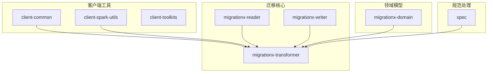
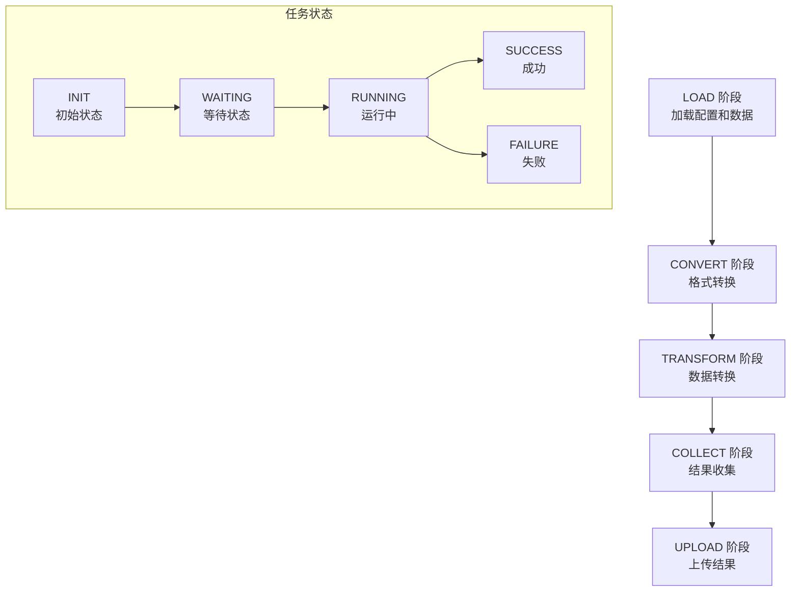
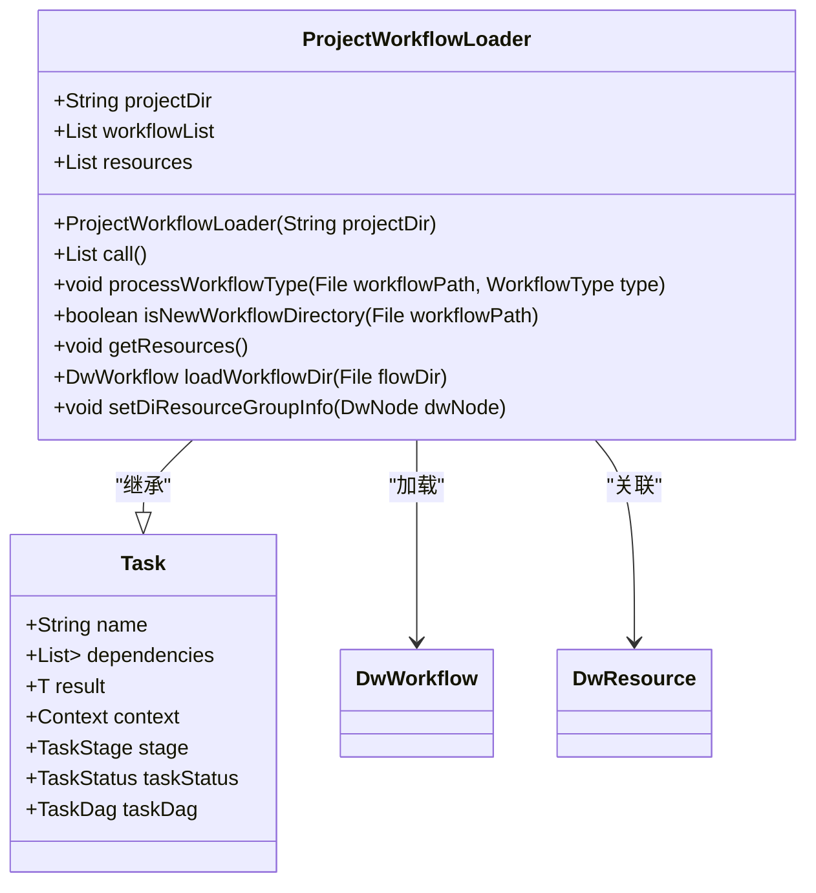
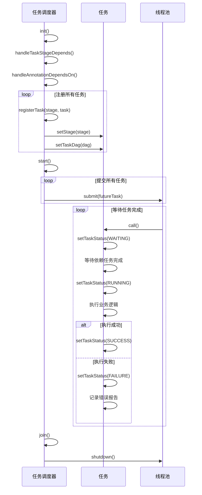
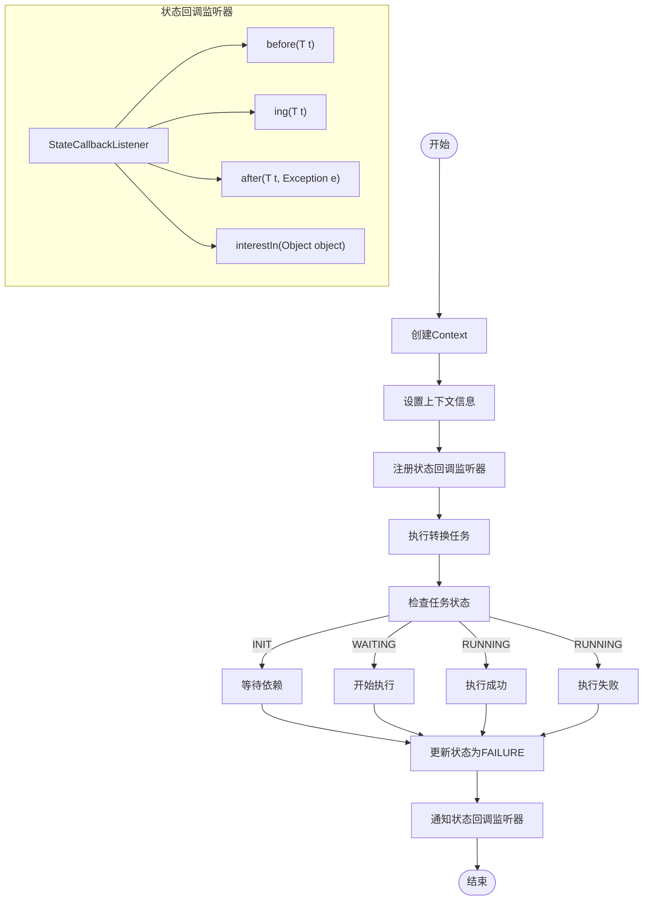
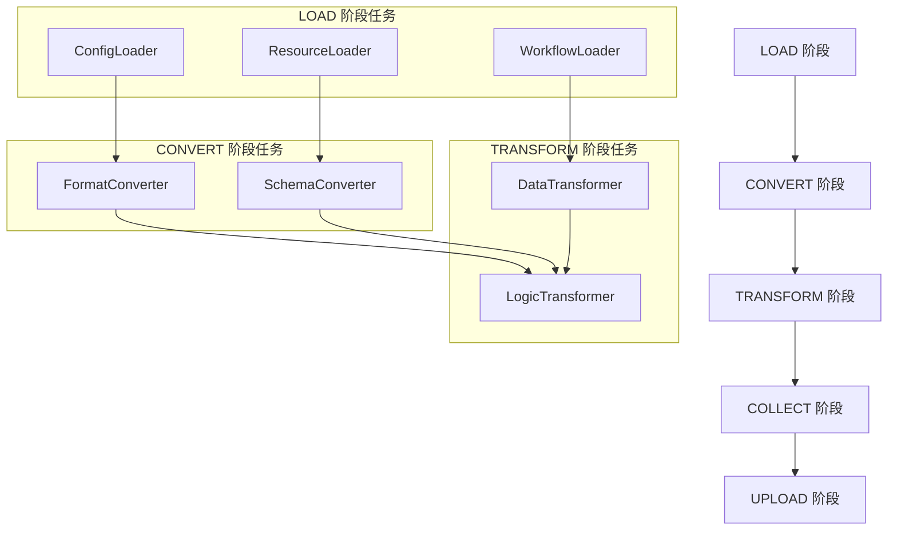

# 转换上下文与任务控制

<cite>
**本文档引用的文件**   
- [ProjectWorkflowLoader.java](file://client/migrationx/migrationx-transformer/src/main/java/com/aliyun/dataworks/migrationx/transformer/core/loader/ProjectWorkflowLoader.java)
- [Task.java](file://client/migrationx/migrationx-transformer/src/main/java/com/aliyun/dataworks/migrationx/transformer/core/controller/Task.java)
- [TaskDag.java](file://client/migrationx/migrationx-transformer/src/main/java/com/aliyun/dataworks/migrationx/transformer/core/controller/TaskDag.java)
- [TaskStatus.java](file://client/migrationx/migrationx-transformer/src/main/java/com/aliyun/dataworks/migrationx/transformer/core/controller/TaskStatus.java)
- [TaskStage.java](file://client/migrationx/migrationx-transformer/src/main/java/com/aliyun/dataworks/migrationx/transformer/core/controller/TaskStage.java)
- [StateCallbackListener.java](file://client/migrationx/migrationx-transformer/src/main/java/com/aliyun/dataworks/migrationx/transformer/core/common/StateCallbackListener.java)
- [Context.java](file://client/migrationx/migrationx-transformer/src/main/java/com/aliyun/dataworks/migrationx/transformer/core/common/Context.java)
- [TransformerContext.java](file://client/migrationx/migrationx-common/src/main/java/com/aliyun/migrationx/common/context/TransformerContext.java)
</cite>

## 目录
1. [引言](#引言)
2. [项目结构](#项目结构)
3. [核心组件](#核心组件)
4. [架构概述](#架构概述)
5. [详细组件分析](#详细组件分析)
6. [依赖分析](#依赖分析)
7. [性能考虑](#性能考虑)
8. [故障排除指南](#故障排除指南)
9. [结论](#结论)

## 引言
本文档详细阐述了数据迁移系统中转换上下文与任务控制的核心机制。重点分析了ProjectWorkflowLoader如何构建转换上下文，包括项目资产、资源和工作流的加载过程。同时详细说明了Task和TaskDag如何实现转换任务的编排与调度，解释任务依赖关系的建立和执行流程。文档涵盖了任务状态管理（TaskStatus）、执行阶段划分（TaskStage）以及状态回调监听器（StateCallbackListener）的工作机制，展示了如何通过任务控制模型实现复杂的转换逻辑。

## 项目结构
本项目采用模块化设计，主要包含客户端工具、迁移核心逻辑、领域模型和规范处理等模块。转换上下文与任务控制的核心实现位于`client/migrationx/migrationx-transformer`模块中，该模块负责转换过程的控制流管理。

**Diagram sources**
- [ProjectWorkflowLoader.java](file://client/migrationx/migrationx-transformer/src/main/java/com/aliyun/dataworks/migrationx/transformer/core/loader/ProjectWorkflowLoader.java)

**Section sources**
- [ProjectWorkflowLoader.java](file://client/migrationx/migrationx-transformer/src/main/java/com/aliyun/dataworks/migrationx/transformer/core/loader/ProjectWorkflowLoader.java)

## 核心组件
系统的核心组件包括ProjectWorkflowLoader用于加载项目工作流，Task作为任务执行的基本单元，TaskDag用于管理任务依赖关系和执行调度。Context和TransformerContext提供了转换过程中的上下文信息管理，而TaskStatus和TaskStage则分别管理任务状态和执行阶段。

**Section sources**
- [ProjectWorkflowLoader.java](file://client/migrationx/migrationx-transformer/src/main/java/com/aliyun/dataworks/migrationx/transformer/core/loader/ProjectWorkflowLoader.java)
- [Task.java](file://client/migrationx/migrationx-transformer/src/main/java/com/aliyun/dataworks/migrationx/transformer/core/controller/Task.java)
- [TaskDag.java](file://client/migrationx/migrationx-transformer/src/main/java/com/aliyun/dataworks/migrationx/transformer/core/controller/TaskDag.java)

## 架构概述
系统采用基于任务依赖图（TaskDag）的架构，通过分阶段的任务执行模型来管理复杂的转换流程。每个任务（Task）在特定的执行阶段（TaskStage）运行，并根据依赖关系进行调度。

**Diagram sources**
- [TaskStage.java](file://client/migrationx/migrationx-transformer/src/main/java/com/aliyun/dataworks/migrationx/transformer/core/controller/TaskStage.java)
- [TaskStatus.java](file://client/migrationx/migrationx-transformer/src/main/java/com/aliyun/dataworks/migrationx/transformer/core/controller/TaskStatus.java)

## 详细组件分析

### ProjectWorkflowLoader 分析
ProjectWorkflowLoader负责加载项目中的工作流、资源和函数等资产，构建转换上下文的基础。

**Diagram sources**
- [ProjectWorkflowLoader.java](file://client/migrationx/migrationx-transformer/src/main/java/com/aliyun/dataworks/migrationx/transformer/core/loader/ProjectWorkflowLoader.java)

**Section sources**
- [ProjectWorkflowLoader.java](file://client/migrationx/migrationx-transformer/src/main/java/com/aliyun/dataworks/migrationx/transformer/core/loader/ProjectWorkflowLoader.java)

### Task 和 TaskDag 分析
Task和TaskDag共同实现了任务的编排与调度机制，通过依赖关系管理复杂的转换流程。

**Diagram sources**
- [Task.java](file://client/migrationx/migrationx-transformer/src/main/java/com/aliyun/dataworks/migrationx/transformer/core/controller/Task.java)
- [TaskDag.java](file://client/migrationx/migrationx-transformer/src/main/java/com/aliyun/dataworks/migrationx/transformer/core/controller/TaskDag.java)

**Section sources**
- [Task.java](file://client/migrationx/migrationx-transformer/src/main/java/com/aliyun/dataworks/migrationx/transformer/core/controller/Task.java)
- [TaskDag.java](file://client/migrationx/migrationx-transformer/src/main/java/com/aliyun/dataworks/migrationx/transformer/core/controller/TaskDag.java)

### 上下文与状态管理分析
Context和状态管理组件提供了转换过程中的上下文信息和状态跟踪能力。

**Diagram sources**
- [Context.java](file://client/migrationx/migrationx-transformer/src/main/java/com/aliyun/dataworks/migrationx/transformer/core/common/Context.java)
- [StateCallbackListener.java](file://client/migrationx/migrationx-transformer/src/main/java/com/aliyun/dataworks/migrationx/transformer/core/common/StateCallbackListener.java)

**Section sources**
- [Context.java](file://client/migrationx/migrationx-transformer/src/main/java/com/aliyun/dataworks/migrationx/transformer/core/common/Context.java)
- [StateCallbackListener.java](file://client/migrationx/migrationx-transformer/src/main/java/com/aliyun/dataworks/migrationx/transformer/core/common/StateCallbackListener.java)

## 依赖分析
系统通过TaskDag管理任务间的依赖关系，支持基于注解和显式声明的依赖配置。

**Diagram sources**
- [TaskDag.java](file://client/migrationx/migrationx-transformer/src/main/java/com/aliyun/dataworks/migrationx/transformer/core/controller/TaskDag.java)

**Section sources**
- [TaskDag.java](file://client/migrationx/migrationx-transformer/src/main/java/com/aliyun/dataworks/migrationx/transformer/core/controller/TaskDag.java)

## 性能考虑
系统通过线程池和并发执行优化性能，同时提供任务状态监控和错误处理机制。

**Section sources**
- [TaskDag.java](file://client/migrationx/migrationx-transformer/src/main/java/com/aliyun/dataworks/migrationx/transformer/core/controller/TaskDag.java)

## 故障排除指南
当任务执行失败时，系统会记录详细的错误信息，包括异常堆栈和任务上下文。

**Section sources**
- [Task.java](file://client/migrationx/migrationx-transformer/src/main/java/com/aliyun/dataworks/migrationx/transformer/core/controller/Task.java)
- [TaskDag.java](file://client/migrationx/migrationx-transformer/src/main/java/com/aliyun/dataworks/migrationx/transformer/core/controller/TaskDag.java)

## 结论
本文档详细阐述了转换上下文与任务控制系统的架构和实现。通过ProjectWorkflowLoader构建转换上下文，利用Task和TaskDag实现任务的编排与调度，结合TaskStatus、TaskStage和StateCallbackListener等组件，形成了完整的任务控制模型。该模型支持复杂的转换逻辑，具有良好的扩展性和可维护性。