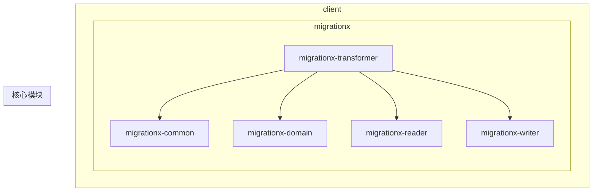
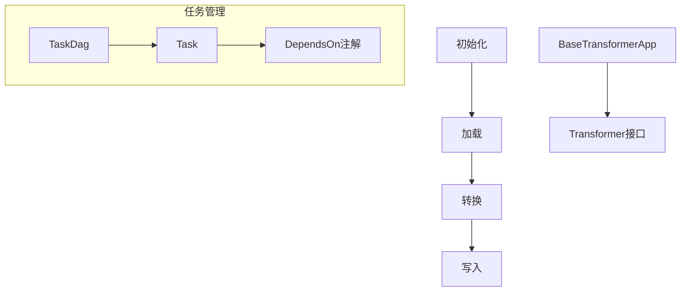
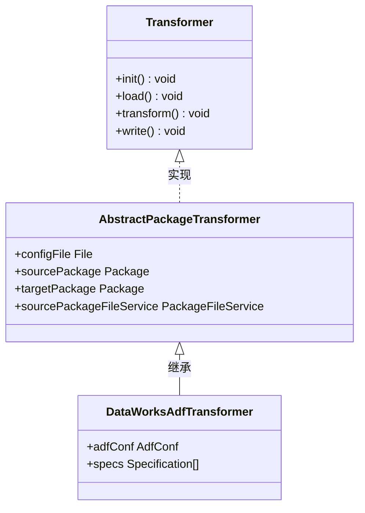
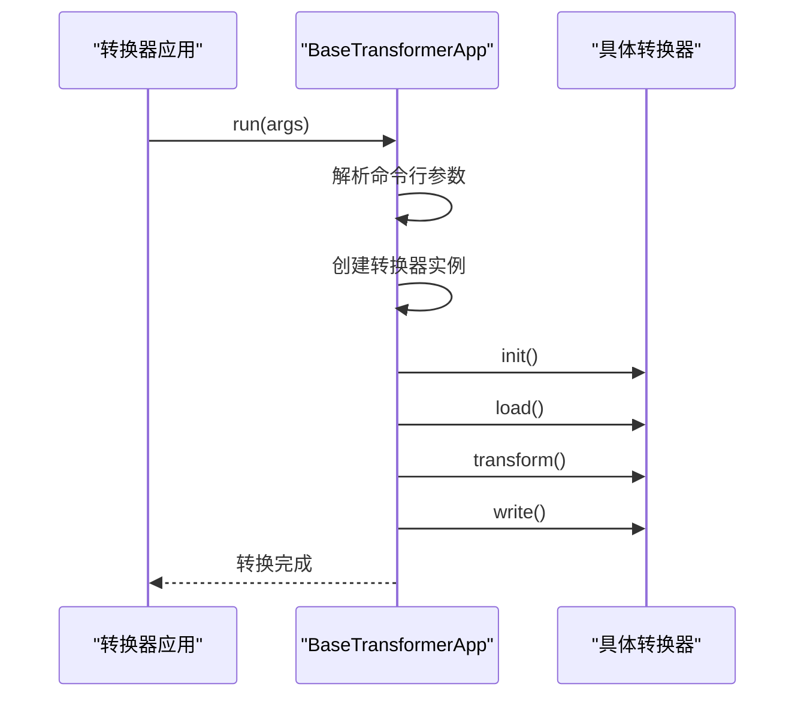
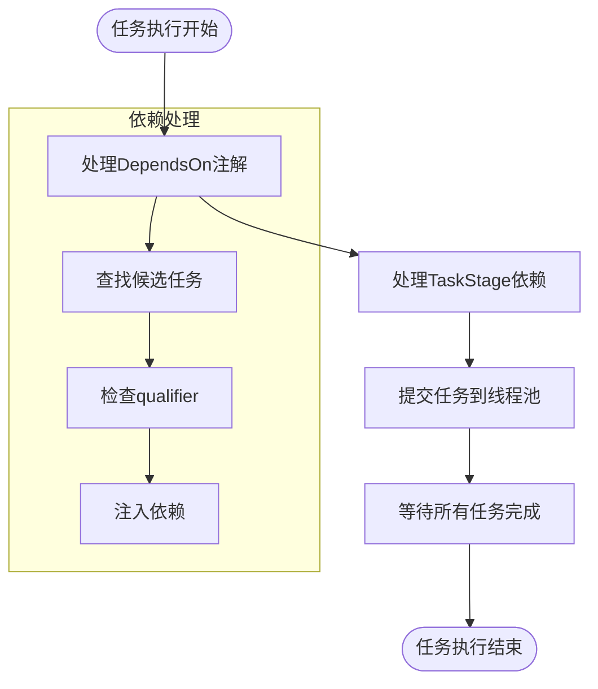
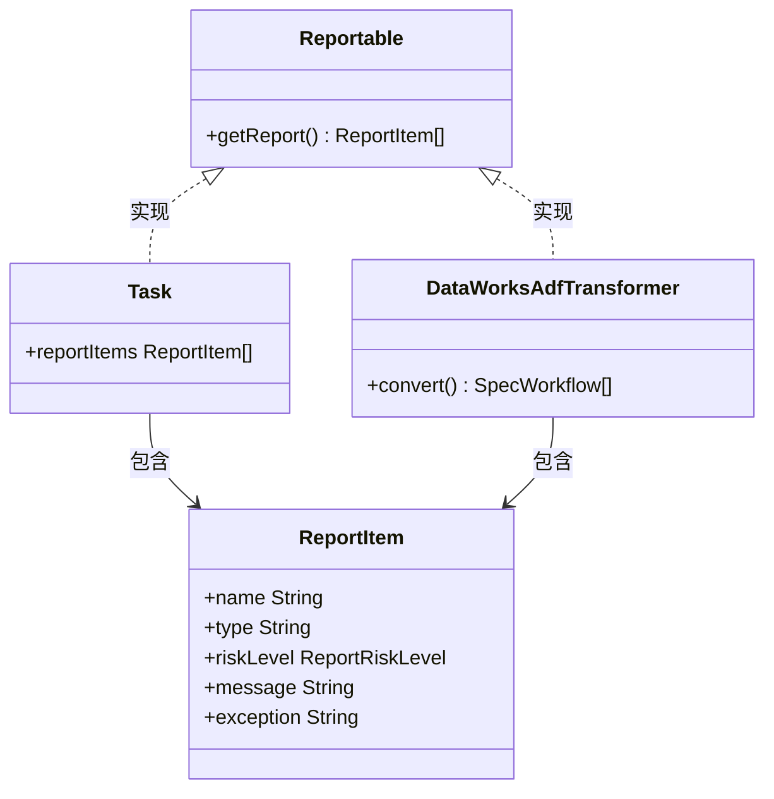
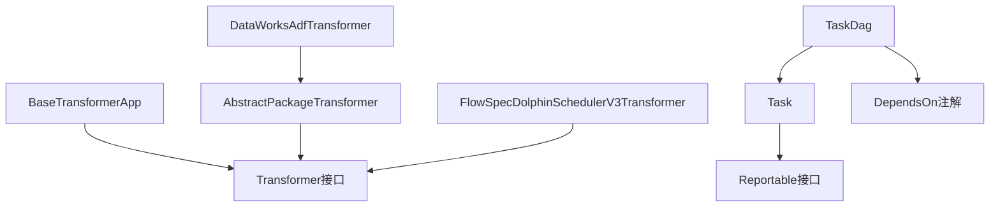

# 转换器实现与应用

<cite>
**本文档引用的文件**
- [Transformer.java](file://client/migrationx/migrationx-transformer/src/main/java/com/aliyun/dataworks/migrationx/transformer/core/transformer/Transformer.java)
- [BaseTransformerApp.java](file://client/migrationx/migrationx-transformer/src/main/java/com/aliyun/dataworks/migrationx/transformer/core/BaseTransformerApp.java)
- [DataWorksAdfTransformerApp.java](file://client/migrationx/migrationx-transformer/src/main/java/com/aliyun/dataworks/migrationx/transformer/dataworks/apps/DataWorksAdfTransformerApp.java)
- [DolphinSchedulerV3FlowSpecTransformerApp.java](file://client/migrationx/migrationx-transformer/src/main/java/com/aliyun/dataworks/migrationx/transformer/dolphinscheduler/app/FlowSpecDolphinSchedulerV3TransformerApp.java)
- [AbstractPackageTransformer.java](file://client/migrationx/migrationx-transformer/src/main/java/com/aliyun/dataworks/migrationx/transformer/core/transformer/AbstractPackageTransformer.java)
- [DataWorksAdfTransformer.java](file://client/migrationx/migrationx-transformer/src/main/java/com/aliyun/dataworks/migrationx/transformer/dataworks/transformer/DataWorksAdfTransformer.java)
- [DependsOn.java](file://client/migrationx/migrationx-transformer/src/main/java/com/aliyun/dataworks/migrationx/transformer/core/annotation/DependsOn.java)
- [Task.java](file://client/migrationx/migrationx-transformer/src/main/java/com/aliyun/dataworks/migrationx/transformer/core/controller/Task.java)
- [TaskDag.java](file://client/migrationx/migrationx-transformer/src/main/java/com/aliyun/dataworks/migrationx/transformer/core/controller/TaskDag.java)
- [Reportable.java](file://client/migrationx/migrationx-transformer/src/main/java/com/aliyun/dataworks/migrationx/transformer/core/report/Reportable.java)
- [TransformerContext.java](file://client/migrationx/migrationx-common/src/main/java/com/aliyun/migrationx/common/context/TransformerContext.java)
</cite>

## 目录
1. [引言](#引言)
2. [项目结构](#项目结构)
3. [核心组件](#核心组件)
4. [架构概述](#架构概述)
5. [详细组件分析](#详细组件分析)
6. [依赖分析](#依赖分析)
7. [性能考虑](#性能考虑)
8. [故障排除指南](#故障排除指南)
9. [结论](#结论)

## 引言
本文档详细阐述了DataWorks项目中转换器的实现与应用。以Transformer接口为核心，文档将深入探讨其作为转换逻辑执行引擎的职责和扩展方式。通过DataWorksAdfTransformerApp、FlowSpecDolphinSchedulerV3TransformerApp等具体实现，展示如何开发针对不同源系统的转换应用。文档涵盖转换器的生命周期管理、依赖注入（DependsOn注解）、转换报告生成（Reportable接口）以及如何集成到整体迁移流程中，为开发者提供清晰的二次开发指南。

## 项目结构
DataWorks项目采用模块化设计，主要包含client、docs、dwcli、schema和spec等目录。client目录下包含migrationx模块，该模块是转换器实现的核心，包含migrationx-common、migrationx-domain、migrationx-reader、migrationx-transformer和migrationx-writer等子模块。其中migrationx-transformer模块专门负责不同工作流调度引擎之间的转换逻辑实现。

**图表来源**
- [项目结构](file://project_structure)

**章节来源**
- [项目结构](file://project_structure)

## 核心组件
转换器系统的核心组件包括Transformer接口、BaseTransformerApp基类、各种具体转换器实现（如DataWorksAdfTransformer）以及任务管理组件（Task和TaskDag）。这些组件共同构成了一个灵活、可扩展的转换框架，支持从不同源系统到DataWorks的迁移。

**章节来源**
- [Transformer.java](file://client/migrationx/migrationx-transformer/src/main/java/com/aliyun/dataworks/migrationx/transformer/core/transformer/Transformer.java)
- [BaseTransformerApp.java](file://client/migrationx/migrationx-transformer/src/main/java/com/aliyun/dataworks/migrationx/transformer/core/BaseTransformerApp.java)

## 架构概述
转换器系统的架构基于责任分离原则，将转换过程分解为初始化、加载、转换和写入四个阶段。通过BaseTransformerApp统一管理这些阶段的执行流程，而具体的转换逻辑由实现Transformer接口的类负责。任务调度通过TaskDag实现，支持复杂的依赖关系和并行执行。

**图表来源**
- [BaseTransformerApp.java](file://client/migrationx/migrationx-transformer/src/main/java/com/aliyun/dataworks/migrationx/transformer/core/BaseTransformerApp.java)
- [Transformer.java](file://client/migrationx/migrationx-transformer/src/main/java/com/aliyun/dataworks/migrationx/transformer/core/transformer/Transformer.java)
- [TaskDag.java](file://client/migrationx/migrationx-transformer/src/main/java/com/aliyun/dataworks/migrationx/transformer/core/controller/TaskDag.java)

## 详细组件分析

### Transformer接口分析
Transformer接口是所有转换器实现的核心契约，定义了转换过程的四个基本阶段：init、load、transform和write。每个阶段都有明确的职责，确保转换过程的可预测性和可维护性。

**图表来源**
- [Transformer.java](file://client/migrationx/migrationx-transformer/src/main/java/com/aliyun/dataworks/migrationx/transformer/core/transformer/Transformer.java)
- [AbstractPackageTransformer.java](file://client/migrationx/migrationx-transformer/src/main/java/com/aliyun/dataworks/migrationx/transformer/core/transformer/AbstractPackageTransformer.java)
- [DataWorksAdfTransformer.java](file://client/migrationx/migrationx-transformer/src/main/java/com/aliyun/dataworks/migrationx/transformer/dataworks/transformer/DataWorksAdfTransformer.java)

**章节来源**
- [Transformer.java](file://client/migrationx/migrationx-transformer/src/main/java/com/aliyun/dataworks/migrationx/transformer/core/transformer/Transformer.java)
- [AbstractPackageTransformer.java](file://client/migrationx/migrationx-transformer/src/main/java/com/aliyun/dataworks/migrationx/transformer/core/transformer/AbstractPackageTransformer.java)

### BaseTransformerApp分析
BaseTransformerApp作为所有转换器应用的基类，提供了统一的命令行接口和执行流程。它负责解析命令行参数、初始化转换器实例，并按顺序执行转换的各个阶段。

**图表来源**
- [BaseTransformerApp.java](file://client/migrationx/migrationx-transformer/src/main/java/com/aliyun/dataworks/migrationx/transformer/core/BaseTransformerApp.java)

**章节来源**
- [BaseTransformerApp.java](file://client/migrationx/migrationx-transformer/src/main/java/com/aliyun/dataworks/migrationx/transformer/core/BaseTransformerApp.java)

### 任务管理分析
任务管理系统通过Task和TaskDag类实现，支持复杂的任务依赖关系和并行执行。DependsOn注解用于声明任务间的依赖关系，TaskDag负责解析这些依赖并调度任务执行。

**图表来源**
- [TaskDag.java](file://client/migrationx/migrationx-transformer/src/main/java/com/aliyun/dataworks/migrationx/transformer/core/controller/TaskDag.java)
- [DependsOn.java](file://client/migrationx/migrationx-transformer/src/main/java/com/aliyun/dataworks/migrationx/transformer/core/annotation/DependsOn.java)

**章节来源**
- [TaskDag.java](file://client/migrationx/migrationx-transformer/src/main/java/com/aliyun/dataworks/migrationx/transformer/core/controller/TaskDag.java)
- [Task.java](file://client/migrationx/migrationx-transformer/src/main/java/com/aliyun/dataworks/migrationx/transformer/core/controller/Task.java)
- [DependsOn.java](file://client/migrationx/migrationx-transformer/src/main/java/com/aliyun/dataworks/migrationx/transformer/core/annotation/DependsOn.java)

### 报告生成分析
报告生成功能通过Reportable接口实现，允许转换器在执行过程中收集和报告各种信息，包括成功、警告和错误等不同风险级别的报告项。

**图表来源**
- [Reportable.java](file://client/migrationx/migrationx-transformer/src/main/java/com/aliyun/dataworks/migrationx/transformer/core/report/Reportable.java)
- [ReportItem.java](file://client/migrationx/migrationx-transformer/src/main/java/com/aliyun/dataworks/migrationx/transformer/core/report/ReportItem.java)
- [Task.java](file://client/migrationx/migrationx-transformer/src/main/java/com/aliyun/dataworks/migrationx/transformer/core/controller/Task.java)

**章节来源**
- [Reportable.java](file://client/migrationx/migrationx-transformer/src/main/java/com/aliyun/dataworks/migrationx/transformer/core/report/Reportable.java)
- [Task.java](file://client/migrationx/migrationx-transformer/src/main/java/com/aliyun/dataworks/migrationx/transformer/core/controller/Task.java)

## 依赖分析
转换器系统内部组件之间存在明确的依赖关系。BaseTransformerApp依赖于Transformer接口，而具体的转换器实现依赖于BaseTransformerApp。任务管理系统独立于具体的转换逻辑，通过接口与转换器交互。

**图表来源**
- [BaseTransformerApp.java](file://client/migrationx/migrationx-transformer/src/main/java/com/aliyun/dataworks/migrationx/transformer/core/BaseTransformerApp.java)
- [Transformer.java](file://client/migrationx/migrationx-transformer/src/main/java/com/aliyun/dataworks/migrationx/transformer/core/transformer/Transformer.java)
- [TaskDag.java](file://client/migrationx/migrationx-transformer/src/main/java/com/aliyun/dataworks/migrationx/transformer/core/controller/TaskDag.java)

**章节来源**
- [BaseTransformerApp.java](file://client/migrationx/migrationx-transformer/src/main/java/com/aliyun/dataworks/migrationx/transformer/core/BaseTransformerApp.java)
- [Transformer.java](file://client/migrationx/migrationx-transformer/src/main/java/com/aliyun/dataworks/migrationx/transformer/core/transformer/Transformer.java)
- [TaskDag.java](file://client/migrationx/migrationx-transformer/src/main/java/com/aliyun/dataworks/migrationx/transformer/core/controller/TaskDag.java)

## 性能考虑
转换器系统在设计时考虑了性能因素，通过并行任务执行和线程池管理来提高转换效率。TaskDag使用ThreadPoolExecutor管理任务执行，支持50-100个线程的动态调整，确保在多核处理器上充分利用计算资源。

**章节来源**
- [TaskDag.java](file://client/migrationx/migrationx-transformer/src/main/java/com/aliyun/dataworks/migrationx/transformer/core/controller/TaskDag.java)

## 故障排除指南
当转换器执行出现问题时，可以通过检查转换报告、查看日志输出和验证输入参数来诊断问题。系统会自动收集执行过程中的异常信息，并通过Reportable接口提供详细的错误报告。

**章节来源**
- [Reportable.java](file://client/migrationx/migrationx-transformer/src/main/java/com/aliyun/dataworks/migrationx/transformer/core/report/Reportable.java)
- [TaskDag.java](file://client/migrationx/migrationx-transformer/src/main/java/com/aliyun/dataworks/migrationx/transformer/core/controller/TaskDag.java)

## 结论
本文档详细介绍了DataWorks项目中转换器的实现与应用。通过分析Transformer接口、BaseTransformerApp基类、任务管理系统和报告生成机制，为开发者提供了全面的二次开发指南。转换器系统的设计充分考虑了灵活性、可扩展性和性能，能够有效支持从不同源系统到DataWorks的迁移需求。