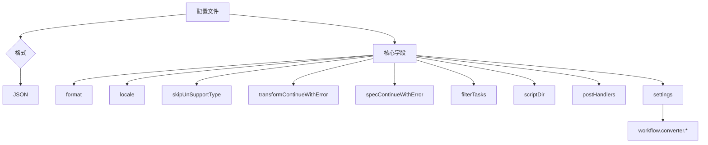
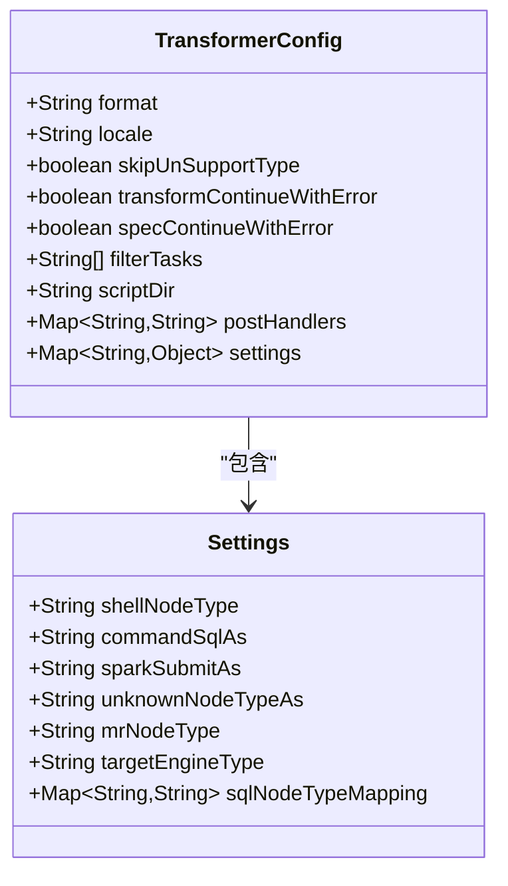
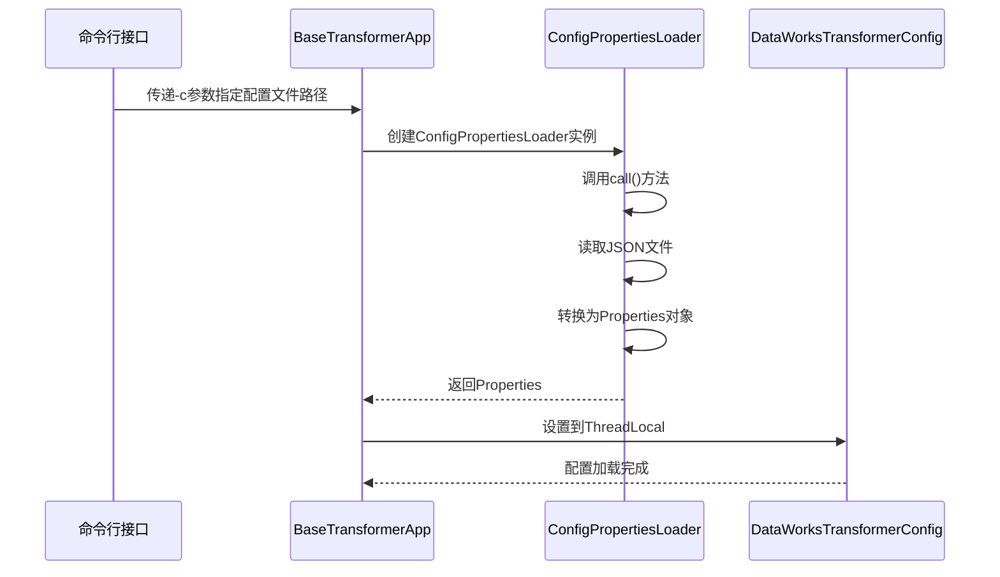
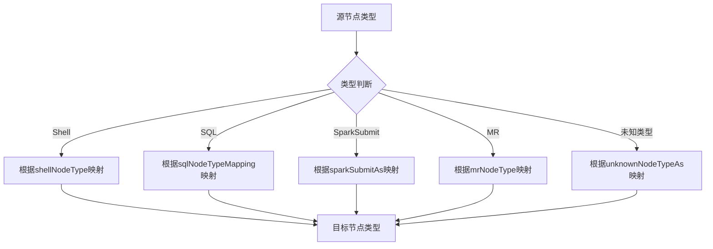

# 转换配置管理

<cite>
**本文档引用文件**  
- [ConfigPropertiesLoader.java](file://client/migrationx/migrationx-transformer/src/main/java/com/aliyun/dataworks/migrationx/transformer/core/loader/ConfigPropertiesLoader.java)
- [DataWorksTransformerConfig.java](file://client/migrationx/migrationx-transformer/src/main/java/com/aliyun/dataworks/migrationx/transformer/dataworks/transformer/DataWorksTransformerConfig.java)
- [dataworks-transformer-config.json](file://client/migrationx/migrationx-transformer/src/main/conf/dataworks-transformer-config.json)
- [dataworks-transformer-config-emr-sample.json](file://client/migrationx/migrationx-transformer/src/main/conf/dataworks-transformer-config-emr-sample.json)
- [dataworks-transformer-config-hologres-sample.json](file://client/migrationx/migrationx-transformer/src/main/conf/dataworks-transformer-config-hologres-sample.json)
- [dataworks-transformer-config-maxcompute-sample.json](file://client/migrationx/migrationx-transformer/src/main/conf/dataworks-transformer-config-maxcompute-sample.json)
- [flowspec-airflowV2-transformer-config.json](file://client/migrationx/migrationx-transformer/src/main/conf/flowspec-airflowV2-transformer-config.json)
- [DataWorksDolphinSchedulerTransformer.java](file://client/migrationx/migrationx-transformer/src/main/java/com/aliyun/dataworks/migrationx/transformer/dataworks/transformer/DataWorksDolphinSchedulerTransformer.java)
- [AbstractBaseConverter.java](file://client/migrationx/migrationx-transformer/src/main/java/com/aliyun/dataworks/migrationx/transformer/dataworks/converter/AbstractBaseConverter.java)
- [BaseTransformerApp.java](file://client/migrationx/migrationx-transformer/src/main/java/com/aliyun/dataworks/migrationx/transformer/core/BaseTransformerApp.java)
</cite>

## 目录
1. [引言](#引言)
2. [配置文件结构](#配置文件结构)
3. [核心配置项详解](#核心配置项详解)
4. [配置加载机制](#配置加载机制)
5. [转换行为控制](#转换行为控制)
6. [错误处理与默认值策略](#错误处理与默认值策略)
7. [配置示例与应用场景](#配置示例与应用场景)
8. [总结](#总结)

## 引言
本文档详细阐述了DataWorks迁移工具中转换配置管理的实现机制，重点分析`ConfigPropertiesLoader`如何加载和解析`dataworks-transformer-config.json`等配置文件。文档涵盖配置文件的结构设计、支持的配置项（如源系统类型、目标系统类型、转换规则、映射策略等），并通过实际配置示例说明如何定制化转换流程。同时，说明配置加载过程中的错误处理机制和默认值策略。

## 配置文件结构

转换配置文件采用JSON格式，主要包含以下核心结构：

- `format`: 指定输出格式，如"SPEC"
- `locale`: 本地化设置，如"zh_CN"
- `skipUnSupportType`: 是否跳过不支持的类型
- `transformContinueWithError`: 转换过程中遇到错误是否继续
- `specContinueWithError`: 规范化过程中遇到错误是否继续
- `filterTasks`: 任务过滤规则
- `scriptDir`: 脚本目录路径
- `postHandlers`: 后处理处理器映射
- `settings`: 核心转换设置，包含各种转换映射规则



**Diagram sources**
- [dataworks-transformer-config.json](file://client/migrationx/migrationx-transformer/src/main/conf/dataworks-transformer-config.json)
- [dataworks-transformer-config-emr-sample.json](file://client/migrationx/migrationx-transformer/src/main/conf/dataworks-transformer-config-emr-sample.json)

**Section sources**
- [dataworks-transformer-config.json](file://client/migrationx/migrationx-transformer/src/main/conf/dataworks-transformer-config.json)
- [dataworks-transformer-config-emr-sample.json](file://client/migrationx/migrationx-transformer/src/main/conf/dataworks-transformer-config-emr-sample.json)
- [dataworks-transformer-config-hologres-sample.json](file://client/migrationx/migrationx-transformer/src/main/conf/dataworks-transformer-config-hologres-sample.json)

## 核心配置项详解

### 基础配置项
- **format**: 定义输出规范格式，当前支持"SPEC"格式
- **locale**: 设置本地化语言，影响错误信息和日志输出的语言
- **skipUnSupportType**: 布尔值，决定是否跳过不支持的节点类型
- **transformContinueWithError**: 转换阶段遇到错误时是否继续执行
- **specContinueWithError**: 规范化阶段遇到错误时是否继续执行

### settings配置项
`settings`对象包含所有转换映射规则：

- **workflow.converter.shellNodeType**: Shell节点类型映射规则
- **workflow.converter.commandSqlAs**: 命令SQL节点映射目标
- **workflow.converter.sparkSubmitAs**: Spark提交任务映射目标
- **workflow.converter.target.unknownNodeTypeAs**: 未知节点类型的默认映射
- **workflow.converter.mrNodeType**: MR任务节点映射目标
- **workflow.converter.target.engine.type**: 目标引擎类型
- **workflow.converter.dolphinscheduler.sqlNodeTypeMapping**: DolphinScheduler SQL节点类型映射表



**Diagram sources**
- [dataworks-transformer-config.json](file://client/migrationx/migrationx-transformer/src/main/conf/dataworks-transformer-config.json)
- [DataWorksTransformerConfig.java](file://client/migrationx/migrationx-transformer/src/main/java/com/aliyun/dataworks/migrationx/transformer/dataworks/transformer/DataWorksTransformerConfig.java)

**Section sources**
- [dataworks-transformer-config.json](file://client/migrationx/migrationx-transformer/src/main/conf/dataworks-transformer-config.json)
- [dataworks-transformer-config-emr-sample.json](file://client/migrationx/migrationx-transformer/src/main/conf/dataworks-transformer-config-emr-sample.json)
- [dataworks-transformer-config-maxcompute-sample.json](file://client/migrationx/migrationx-transformer/src/main/conf/dataworks-transformer-config-maxcompute-sample.json)

## 配置加载机制

### ConfigPropertiesLoader类
`ConfigPropertiesLoader`是配置加载的核心组件，继承自`Task<Properties>`，负责从指定路径加载配置文件。

```java
public class ConfigPropertiesLoader extends Task<Properties> {
    private String configPropertiesPath;

    public ConfigPropertiesLoader(String configPropertiesPath) {
        super(ConfigPropertiesLoader.class.getSimpleName());
        this.configPropertiesPath = configPropertiesPath;
    }

    @Override
    public Properties call() throws Exception {
        Properties properties = new Properties();
        properties.load(new FileInputStream(new File(configPropertiesPath)));
        return properties;
    }
}
```

### 配置加载流程
1. 命令行参数解析获取配置文件路径
2. 创建`ConfigPropertiesLoader`实例
3. 调用`call()`方法加载配置文件
4. 将JSON配置转换为`Properties`对象
5. 存储到`DataWorksTransformerConfig`的ThreadLocal中



**Diagram sources**
- [ConfigPropertiesLoader.java](file://client/migrationx/migrationx-transformer/src/main/java/com/aliyun/dataworks/migrationx/transformer/core/loader/ConfigPropertiesLoader.java)
- [BaseTransformerApp.java](file://client/migrationx/migrationx-transformer/src/main/java/com/aliyun/dataworks/migrationx/transformer/core/BaseTransformerApp.java)
- [DataWorksTransformerConfig.java](file://client/migrationx/migrationx-transformer/src/main/java/com/aliyun/dataworks/migrationx/transformer/dataworks/transformer/DataWorksTransformerConfig.java)

**Section sources**
- [ConfigPropertiesLoader.java](file://client/migrationx/migrationx-transformer/src/main/java/com/aliyun/dataworks/migrationx/transformer/core/loader/ConfigPropertiesLoader.java)
- [BaseTransformerApp.java](file://client/migrationx/migrationx-transformer/src/main/java/com/aliyun/dataworks/migrationx/transformer/core/BaseTransformerApp.java)

## 转换行为控制

### 类型映射策略
配置文件通过`settings`中的映射规则控制转换行为：

- **精确匹配**: 直接指定映射关系，如`"workflow.converter.commandSqlAs": "EMR_HIVE"`
- **通配符匹配**: 支持模式匹配，如`"ff.*": "EMR_SHELL"`
- **条件匹配**: 根据项目名、工作流名、任务名进行条件判断

### 目标引擎类型
`workflow.converter.target.engine.type`配置项决定目标计算引擎类型，影响：
- 节点类型的默认映射
- 资源组的分配策略
- 调度参数的生成

### SQL节点类型映射
针对不同源系统的SQL节点，通过`sqlNodeTypeMapping`进行精细化控制：
- POSTGRESQL → EMR_HIVE/HOLOGRES_SQL/ODPS_SQL
- MYSQL → EMR_HIVE/HOLOGRES_SQL/ODPS_SQL  
- HIVE → EMR_HIVE/HOLOGRES_SQL/ODPS_SQL
- CLICKHOUSE → CLICK_SQL



**Diagram sources**
- [dataworks-transformer-config.json](file://client/migrationx/migrationx-transformer/src/main/conf/dataworks-transformer-config.json)
- [AbstractBaseConverter.java](file://client/migrationx/migrationx-transformer/src/main/java/com/aliyun/dataworks/migrationx/transformer/dataworks/converter/AbstractBaseConverter.java)

**Section sources**
- [dataworks-transformer-config.json](file://client/migrationx/migrationx-transformer/src/main/conf/dataworks-transformer-config.json)
- [dataworks-transformer-config-emr-sample.json](file://client/migrationx/migrationx-transformer/src/main/conf/dataworks-transformer-config-emr-sample.json)
- [dataworks-transformer-config-hologres-sample.json](file://client/migrationx/migrationx-transformer/src/main/conf/dataworks-transformer-config-hologres-sample.json)
- [dataworks-transformer-config-maxcompute-sample.json](file://client/migrationx/migrationx-transformer/src/main/conf/dataworks-transformer-config-maxcompute-sample.json)

## 错误处理与默认值策略

### 错误处理机制
系统提供多层次的错误处理策略：

- **transformContinueWithError**: 转换阶段错误处理
  - true: 遇到错误继续执行，记录错误日志
  - false: 遇到错误立即停止
- **specContinueWithError**: 规范化阶段错误处理
  - true: 允许部分失败，继续处理其他任务
  - false: 严格模式，任何错误都中断流程

### 默认值策略
当配置缺失或类型不支持时，系统采用以下默认策略：

1. **未知节点类型处理**:
```java
protected String getDefaultTypeIfNotSupported(Properties properties, CodeProgramType defaultNodeType) {
    return StringUtils.defaultIfBlank(
        properties.getProperty(CONVERTER_TARGET_UNSUPPORTED_NODE_TYPE_AS, null),
        defaultNodeType.name());
}
```

2. **必填字段验证**:
- 使用`Preconditions.checkNotNull()`确保关键参数不为空
- 使用`Preconditions.checkArgument()`验证参数有效性

3. **ThreadLocal配置管理**:
```java
private static final ThreadLocal<DataWorksTransformerConfig> threadLocal = new ThreadLocal<>();

public static void setConfig(DataWorksTransformerConfig config) {
    threadLocal.set(config);
}

public static DataWorksTransformerConfig getConfig() {
    return threadLocal.get();
}
```

**Section sources**
- [AbstractBaseConverter.java](file://client/migrationx/migrationx-transformer/src/main/java/com/aliyun/dataworks/migrationx/transformer/dataworks/converter/AbstractBaseConverter.java)
- [DataWorksTransformerConfig.java](file://client/migrationx/migrationx-transformer/src/main/java/com/aliyun/dataworks/migrationx/transformer/dataworks/transformer/DataWorksTransformerConfig.java)

## 配置示例与应用场景

### EMR目标平台配置
适用于将工作流迁移到EMR平台的场景：

```json
{
  "format": "SPEC",
  "locale": "zh_CN",
  "skipUnSupportType": true,
  "transformContinueWithError": true,
  "specContinueWithError": true,
  "filterTasks": ["*"],
  "scriptDir": "scripts",
  "postHandlers": {
    "SHELL": "shell_converter.py"
  },
  "settings": {
    "workflow.converter.shellNodeType": {
      "ff.shell1.shell2": "DIDE_SHELL",
      "ff.shell1.*": "EMR_SHELL",
      "ff.*": "EMR_SHELL",
      "*": "EMR_SHELL"
    },
    "workflow.converter.target.engine.type": "EMR"
  }
}
```

### Hologres目标平台配置
适用于迁移到Hologres平台的场景：

```json
{
  "format": "SPEC",
  "locale": "zh_CN",
  "settings": {
    "workflow.converter.target.engine.type": "Hologres",
    "workflow.converter.dolphinscheduler.sqlNodeTypeMapping": {
      "POSTGRESQL": "HOLOGRES_SQL",
      "MYSQL": "HOLOGRES_SQL",
      "HIVE": "HOLOGRES_SQL"
    }
  }
}
```

### MaxCompute目标平台配置
适用于迁移到MaxCompute平台的场景：

```json
{
  "format": "SPEC",
  "locale": "zh_CN",
  "settings": {
    "workflow.converter.target.engine.type": "MaxCompute",
    "workflow.converter.dolphinscheduler.sqlNodeTypeMapping": {
      "POSTGRESQL": "ODPS_SQL",
      "MYSQL": "ODPS_SQL",
      "HIVE": "ODPS_SQL"
    }
  }
}
```

**Section sources**
- [dataworks-transformer-config-emr-sample.json](file://client/migrationx/migrationx-transformer/src/main/conf/dataworks-transformer-config-emr-sample.json)
- [dataworks-transformer-config-hologres-sample.json](file://client/migrationx/migrationx-transformer/src/main/conf/dataworks-transformer-config-hologres-sample.json)
- [dataworks-transformer-config-maxcompute-sample.json](file://client/migrationx/migrationx-transformer/src/main/conf/dataworks-transformer-config-maxcompute-sample.json)

## 总结
本文档全面介绍了DataWorks迁移工具的转换配置管理系统。`ConfigPropertiesLoader`作为核心加载器，负责从JSON文件加载配置并转换为Properties对象。配置文件通过`settings`中的映射规则精确控制转换行为，支持多种目标平台（EMR、Hologres、MaxCompute）的定制化需求。系统提供了完善的错误处理机制和默认值策略，确保转换过程的健壮性和灵活性。通过合理配置，用户可以实现从不同源系统到DataWorks平台的平滑迁移。