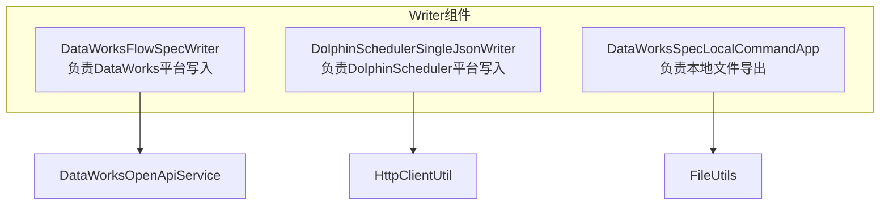
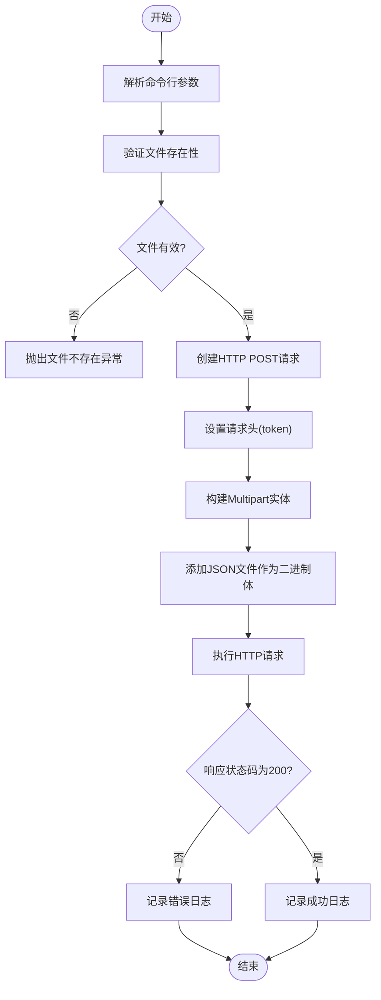
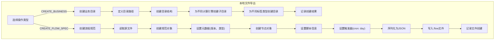
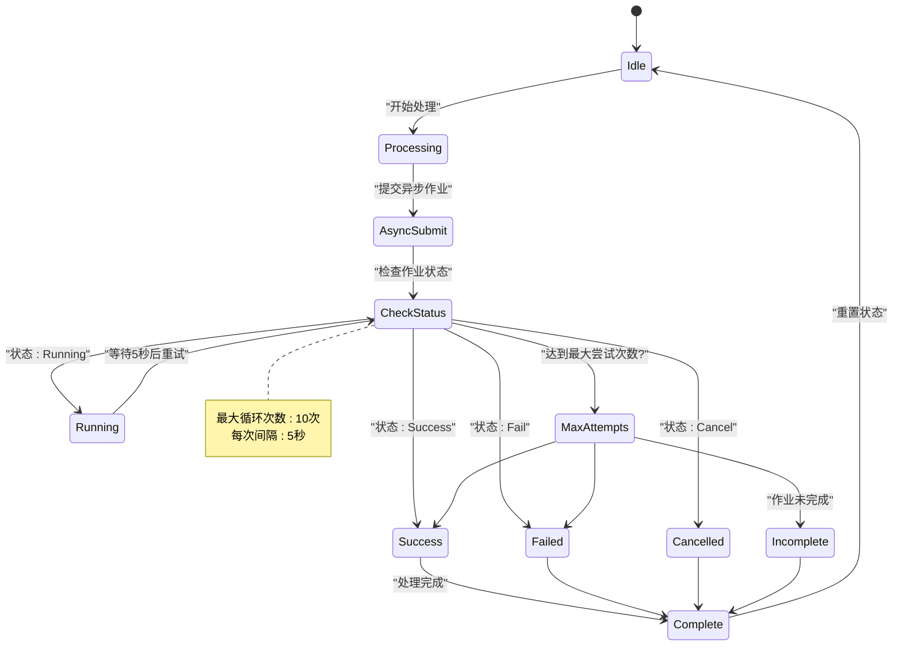
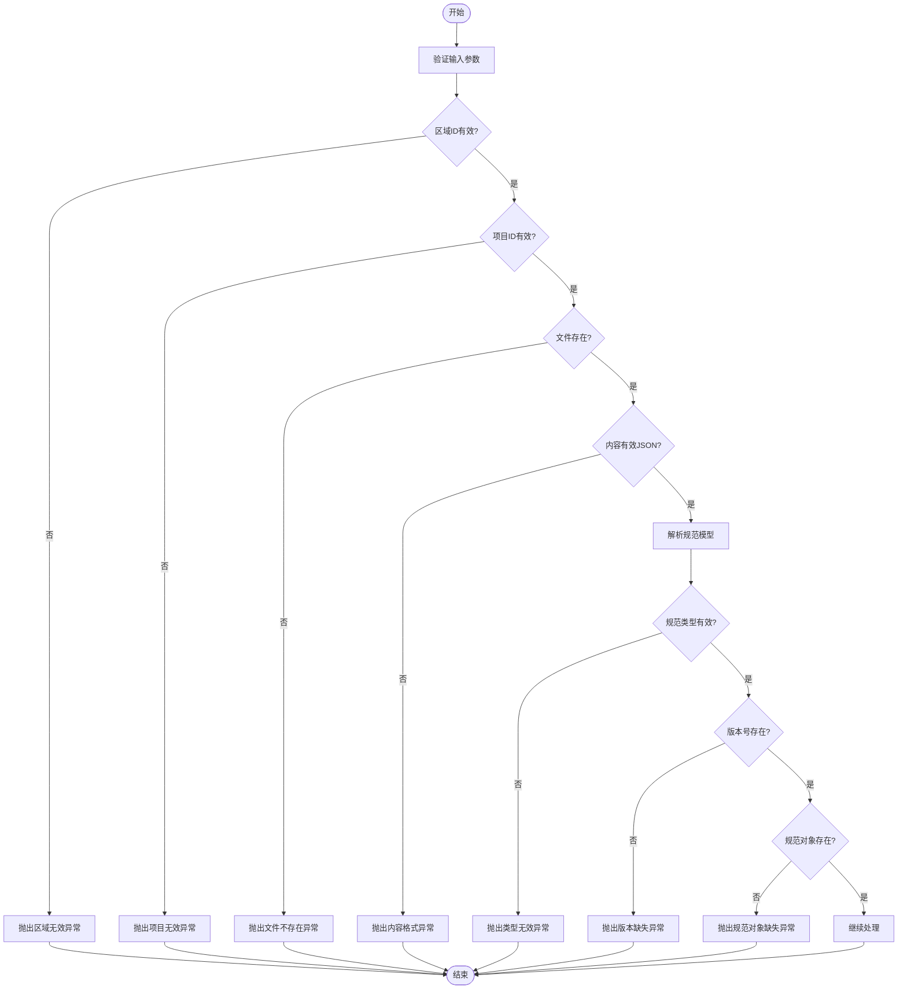
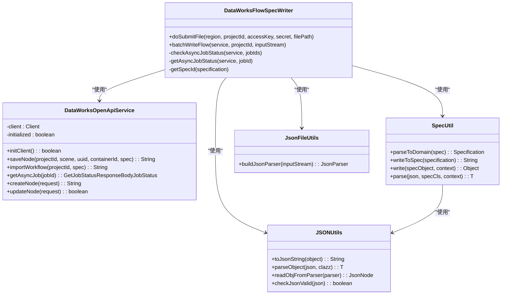

# Writer组件

<cite>
**本文档引用的文件**
- [DataWorksFlowSpecWriter.java](file://client/migrationx/migrationx-writer/src/main/java/com/aliyun/dataworks/migrationx/writer/dataworks/DataWorksFlowSpecWriter.java)
- [DolphinSchedulerSingleJsonWriter.java](file://client/migrationx/migrationx-writer/src/main/java/com/aliyun/dataworks/migrationx/writer/dolphinscheduler/DolphinSchedulerSingleJsonWriter.java)
- [DataWorksSpecLocalCommandApp.java](file://client/migrationx/migrationx-writer/src/main/java/com/aliyun/dataworks/migrationx/local/DataWorksSpecLocalCommandApp.java)
- [DataWorksOpenApiService.java](file://client/migrationx/migrationx-domain/migrationx-domain-dataworks/src/main/java/com/aliyun/dataworks/migrationx/domain/dataworks/service/openapi/DataWorksOpenApiService.java)
- [AsyncJobStatus.java](file://client/migrationx/migrationx-writer/src/main/java/com/aliyun/dataworks/migrationx/writer/dataworks/model/AsyncJobStatus.java)
- [SpecUtil.java](file://spec/src/main/java/com/aliyun/dataworks/common/spec/SpecUtil.java)
- [JSONUtils.java](file://client/migrationx/migrationx-common/src/main/java/com/aliyun/migrationx/common/utils/JSONUtils.java)
- [JsonFileUtils.java](file://client/migrationx/migrationx-common/src/main/java/com/aliyun/migrationx/common/utils/JsonFileUtils.java)
- [DataWorksMigrationSpecificationImportWriter.java](file://client/migrationx/migrationx-writer/src/main/java/com/aliyun/dataworks/migrationx/writer/DataWorksMigrationSpecificationImportWriter.java)
- [DataWorksMigrationAssistWriter.java](file://client/migrationx/migrationx-writer/src/main/java/com/aliyun/dataworks/migrationx/writer/DataWorksMigrationAssistWriter.java)
</cite>

## 目录
1. [简介](#简介)
2. [核心组件分析](#核心组件分析)
3. [DataWorksFlowSpecWriter实现](#dataworksflowspecwriter实现)
4. [DolphinSchedulerSingleJsonWriter实现](#dolphinschedulersinglejsonwriter实现)
5. [本地文件导出支持](#本地文件导出支持)
6. [错误处理与重试机制](#错误处理与重试机制)
7. [数据验证策略](#数据验证策略)
8. [序列化与API交互](#序列化与api交互)
9. [结论](#结论)

## 简介
Writer组件是迁移管道中的数据汇角色，负责将Transformer输出的规范模型写入目标系统。该组件包含多个实现，分别针对不同的目标平台，如DataWorks和DolphinScheduler。核心功能包括将Java对象序列化为符合目标API要求的JSON格式，并通过相应的OpenAPI提交到目标平台。同时，组件还支持本地文件导出功能，便于开发和调试。

## 核心组件分析

Writer组件主要由三个核心类组成：DataWorksFlowSpecWriter、DolphinSchedulerSingleJsonWriter和DataWorksSpecLocalCommandApp。这些组件共同实现了将规范模型写入不同目标系统的能力。



**图源**
- [DataWorksFlowSpecWriter.java](file://client/migrationx/migrationx-writer/src/main/java/com/aliyun/dataworks/migrationx/writer/dataworks/DataWorksFlowSpecWriter.java)
- [DolphinSchedulerSingleJsonWriter.java](file://client/migrationx/migrationx-writer/src/main/java/com/aliyun/dataworks/migrationx/writer/dolphinscheduler/DolphinSchedulerSingleJsonWriter.java)
- [DataWorksSpecLocalCommandApp.java](file://client/migrationx/migrationx-writer/src/main/java/com/aliyun/dataworks/migrationx/local/DataWorksSpecLocalCommandApp.java)

**本节源**
- [DataWorksFlowSpecWriter.java](file://client/migrationx/migrationx-writer/src/main/java/com/aliyun/dataworks/migrationx/writer/dataworks/DataWorksFlowSpecWriter.java#L1-L204)
- [DolphinSchedulerSingleJsonWriter.java](file://client/migrationx/migrationx-writer/src/main/java/com/aliyun/dataworks/migrationx/writer/dolphinscheduler/DolphinSchedulerSingleJsonWriter.java#L1-L87)
- [DataWorksSpecLocalCommandApp.java](file://client/migrationx/migrationx-writer/src/main/java/com/aliyun/dataworks/migrationx/local/DataWorksSpecLocalCommandApp.java#L1-L174)

## DataWorksFlowSpecWriter实现

DataWorksFlowSpecWriter是Writer组件的核心实现之一，负责将规范模型写入DataWorks平台。该组件通过DataWorksOpenApiService与DataWorks平台进行交互，实现了异步作业提交和状态检查机制。

```mermaid
sequenceDiagram
participant Client as "客户端"
participant Writer as "DataWorksFlowSpecWriter"
participant Service as "DataWorksOpenApiService"
participant DataWorks as "DataWorks平台"
Client->>Writer : 提交规范文件
Writer->>Service : 初始化OpenAPI客户端
Service->>DataWorks : 调用importWorkflow API
DataWorks-->>Service : 返回异步作业ID
Service-->>Writer : 返回作业ID
Writer->>Writer : 启动状态检查循环
loop 检查作业状态(最多10次)
Writer->>Service : 调用getAsyncJob API
Service->>DataWorks : 查询作业状态
DataWorks-->>Service : 返回作业状态
Service-->>Writer : 返回状态信息
alt 作业完成
Writer->>Writer : 记录成功/失败状态
break
else 作业仍在运行
Writer->>Writer : 等待5秒后重试
end
end
Writer-->>Client : 返回最终结果
```

**图源**
- [DataWorksFlowSpecWriter.java](file://client/migrationx/migrationx-writer/src/main/java/com/aliyun/dataworks/migrationx/writer/dataworks/DataWorksFlowSpecWriter.java#L1-L204)
- [DataWorksOpenApiService.java](file://client/migrationx/migrationx-domain/migrationx-domain-dataworks/src/main/java/com/aliyun/dataworks/migrationx/domain/dataworks/service/openapi/DataWorksOpenApiService.java#L1-L486)

**本节源**
- [DataWorksFlowSpecWriter.java](file://client/migrationx/migrationx-writer/src/main/java/com/aliyun/dataworks/migrationx/writer/dataworks/DataWorksFlowSpecWriter.java#L1-L204)

## DolphinSchedulerSingleJsonWriter实现

DolphinSchedulerSingleJsonWriter负责将规范模型写入DolphinScheduler平台。该组件通过HTTP Multipart请求将JSON文件上传到DolphinScheduler的导入API。



**图源**
- [DolphinSchedulerSingleJsonWriter.java](file://client/migrationx/migrationx-writer/src/main/java/com/aliyun/dataworks/migrationx/writer/dolphinscheduler/DolphinSchedulerSingleJsonWriter.java#L1-L87)

**本节源**
- [DolphinSchedulerSingleJsonWriter.java](file://client/migrationx/migrationx-writer/src/main/java/com/aliyun/dataworks/migrationx/writer/dolphinscheduler/DolphinSchedulerSingleJsonWriter.java#L1-L87)

## 本地文件导出支持

DataWorksSpecLocalCommandApp组件提供了本地文件导出功能，支持创建业务目录结构和生成本地规范文件。该功能主要用于开发和测试场景。



**图源**
- [DataWorksSpecLocalCommandApp.java](file://client/migrationx/migrationx-writer/src/main/java/com/aliyun/dataworks/migrationx/local/DataWorksSpecLocalCommandApp.java#L1-L174)

**本节源**
- [DataWorksSpecLocalCommandApp.java](file://client/migrationx/migrationx-writer/src/main/java/com/aliyun/dataworks/migrationx/local/DataWorksSpecLocalCommandApp.java#L1-L174)

## 错误处理与重试机制

Writer组件实现了完善的错误处理和重试机制，确保在各种异常情况下能够提供清晰的错误信息并尝试恢复。



**图源**
- [DataWorksFlowSpecWriter.java](file://client/migrationx/migrationx-writer/src/main/java/com/aliyun/dataworks/migrationx/writer/dataworks/DataWorksFlowSpecWriter.java#L1-L204)
- [AsyncJobStatus.java](file://client/migrationx/migrationx-writer/src/main/java/com/aliyun/dataworks/migrationx/writer/dataworks/model/AsyncJobStatus.java#L1-L41)

**本节源**
- [DataWorksFlowSpecWriter.java](file://client/migrationx/migrationx-writer/src/main/java/com/aliyun/dataworks/migrationx/writer/dataworks/DataWorksFlowSpecWriter.java#L111-L149)
- [AsyncJobStatus.java](file://client/migrationx/migrationx-writer/src/main/java/com/aliyun/dataworks/migrationx/writer/dataworks/model/AsyncJobStatus.java#L1-L41)

## 数据验证策略

Writer组件在写入数据前实施了多层次的数据验证策略，确保数据的完整性和正确性。



**图源**
- [DataWorksFlowSpecWriter.java](file://client/migrationx/migrationx-writer/src/main/java/com/aliyun/dataworks/migrationx/writer/dataworks/DataWorksFlowSpecWriter.java#L1-L204)
- [DataWorksOpenApiService.java](file://client/migrationx/migrationx-domain/migrationx-domain-dataworks/src/main/java/com/aliyun/dataworks/migrationx/domain/dataworks/service/openapi/DataWorksOpenApiService.java#L1-L486)

**本节源**
- [DataWorksOpenApiService.java](file://client/migrationx/migrationx-domain/migrationx-domain-dataworks/src/main/java/com/aliyun/dataworks/migrationx/domain/dataworks/service/openapi/DataWorksOpenApiService.java#L84-L120)

## 序列化与API交互

Writer组件通过SpecUtil和JSONUtils工具类实现Java对象到JSON的序列化，并通过OpenAPI与目标平台交互。



**图源**
- [DataWorksFlowSpecWriter.java](file://client/migrationx/migrationx-writer/src/main/java/com/aliyun/dataworks/migrationx/writer/dataworks/DataWorksFlowSpecWriter.java#L1-L204)
- [DataWorksOpenApiService.java](file://client/migrationx/migrationx-domain/migrationx-domain-dataworks/src/main/java/com/aliyun/dataworks/migrationx/domain/dataworks/service/openapi/DataWorksOpenApiService.java#L1-L486)
- [SpecUtil.java](file://spec/src/main/java/com/aliyun/dataworks/common/spec/SpecUtil.java#L1-L239)
- [JSONUtils.java](file://client/migrationx/migrationx-common/src/main/java/com/aliyun/migrationx/common/utils/JSONUtils.java#L1-L422)
- [JsonFileUtils.java](file://client/migrationx/migrationx-common/src/main/java/com/aliyun/migrationx/common/utils/JsonFileUtils.java)

**本节源**
- [DataWorksFlowSpecWriter.java](file://client/migrationx/migrationx-writer/src/main/java/com/aliyun/dataworks/migrationx/writer/dataworks/DataWorksFlowSpecWriter.java#L86-L93)
- [SpecUtil.java](file://spec/src/main/java/com/aliyun/dataworks/common/spec/SpecUtil.java#L72-L95)
- [JSONUtils.java](file://client/migrationx/migrationx-common/src/main/java/com/aliyun/migrationx/common/utils/JSONUtils.java#L322-L328)

## 结论

Writer组件作为迁移管道的数据汇，实现了将规范模型写入不同目标系统的功能。组件通过清晰的架构设计，将不同目标平台的写入逻辑分离，同时保持了统一的错误处理和重试机制。DataWorksFlowSpecWriter通过异步API调用和状态轮询确保了大规模数据写入的可靠性，而DolphinSchedulerSingleJsonWriter则通过标准的HTTP Multipart上传实现了与DolphinScheduler的集成。本地文件导出功能为开发和测试提供了便利。整体设计体现了高内聚、低耦合的原则，便于维护和扩展。