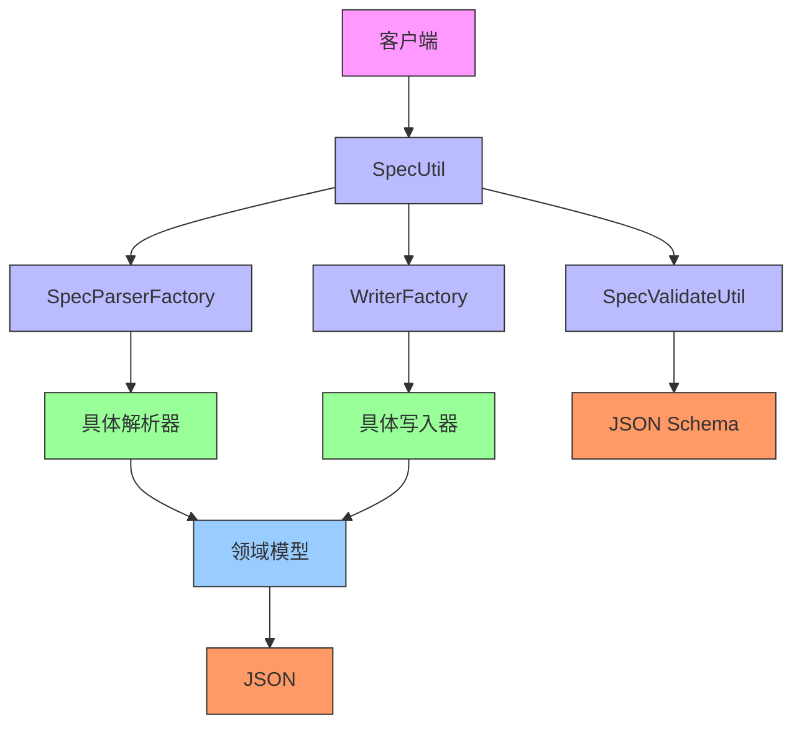
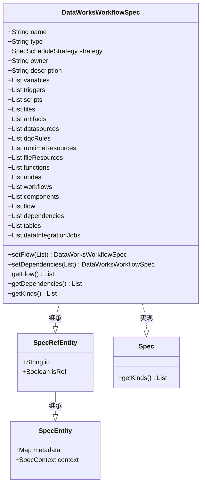
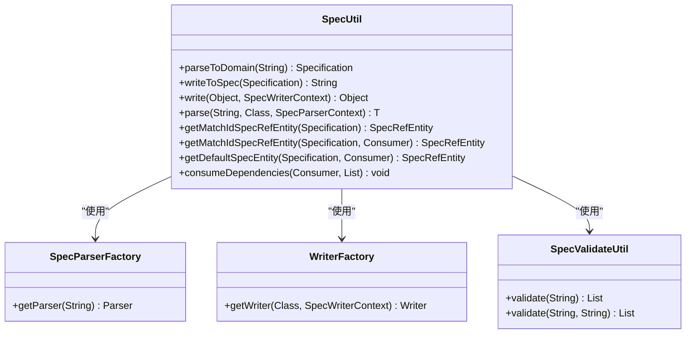
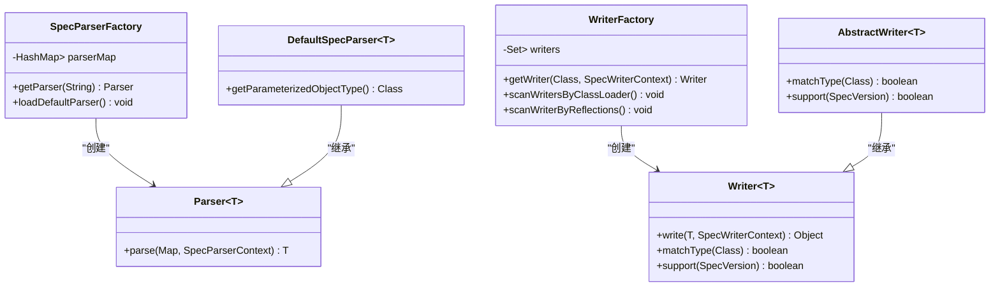
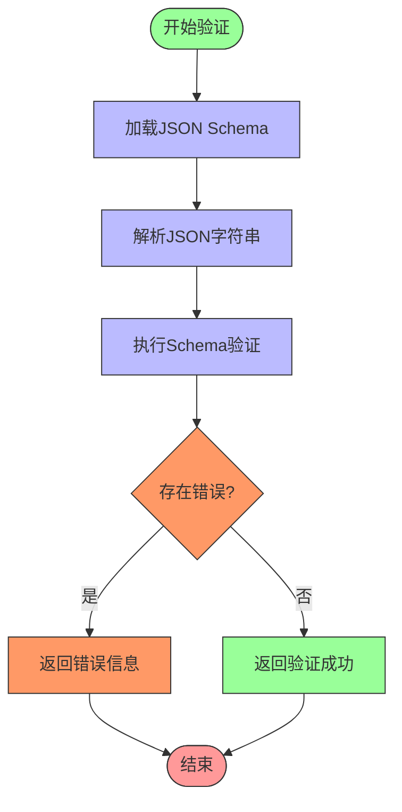
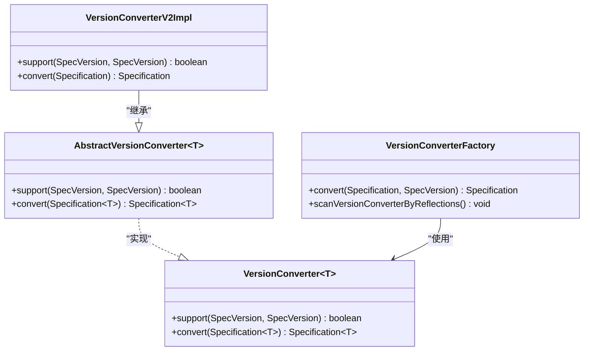
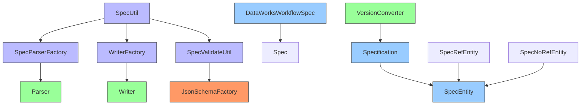

# Spec模块

<cite>
**本文档引用的文件**
- [SpecUtil.java](file://spec/src/main/java/com/aliyun/dataworks/common/spec/SpecUtil.java)
- [DataWorksWorkflowSpec.java](file://spec/src/main/java/com/aliyun/dataworks/common/spec/domain/DataWorksWorkflowSpec.java)
- [Specification.java](file://spec/src/main/java/com/aliyun/dataworks/common/spec/domain/Specification.java)
- [Spec.java](file://spec/src/main/java/com/aliyun/dataworks/common/spec/domain/Spec.java)
- [SpecEntity.java](file://spec/src/main/java/com/aliyun/dataworks/common/spec/domain/SpecEntity.java)
- [SpecRefEntity.java](file://spec/src/main/java/com/aliyun/dataworks/common/spec/domain/SpecRefEntity.java)
- [SpecNoRefEntity.java](file://spec/src/main/java/com/aliyun/dataworks/common/spec/domain/SpecNoRefEntity.java)
- [SpecParserFactory.java](file://spec/src/main/java/com/aliyun/dataworks/common/spec/parser/SpecParserFactory.java)
- [WriterFactory.java](file://spec/src/main/java/com/aliyun/dataworks/common/spec/writer/WriterFactory.java)
- [VersionConverter.java](file://spec/src/main/java/com/aliyun/dataworks/common/spec/version/VersionConverter.java)
- [SpecWorkflowParser.java](file://spec/src/main/java/com/aliyun/dataworks/common/spec/parser/impl/SpecWorkflowParser.java)
- [SpecWorkflowWriter.java](file://spec/src/main/java/com/aliyun/dataworks/common/spec/writer/impl/SpecWorkflowWriter.java)
- [SpecValidateUtil.java](file://spec/src/main/java/com/aliyun/dataworks/common/spec/utils/SpecValidateUtil.java)
- [flow.schema.json](file://schema/flow.schema.json)
- [DataWorksWorkflowSpec.schema.json](file://spec/src/main/resources/spec/schema/DataWorksWorkflowSpec.schema.json)
</cite>

## 目录
1. [简介](#简介)
2. [项目结构](#项目结构)
3. [核心组件](#核心组件)
4. [架构概述](#架构概述)
5. [详细组件分析](#详细组件分析)
6. [依赖分析](#依赖分析)
7. [性能考虑](#性能考虑)
8. [故障排除指南](#故障排除指南)
9. [结论](#结论)

## 简介
Spec模块是dataworks-spec项目的核心领域模型，负责定义和处理DataWorks工作流的规范。该模块提供了一套完整的机制来解析、序列化和验证工作流规范，支持不同版本之间的兼容性转换。模块采用领域驱动设计，通过工厂模式实现了解析器和写入器的动态加载，确保了系统的可扩展性和灵活性。

## 项目结构
Spec模块的项目结构清晰地划分了不同功能的组件，主要包括核心领域模型、解析器、写入器、工具类和版本转换器。这种分层设计使得各组件职责明确，便于维护和扩展。

```mermaid
graph TD
    subgraph "spec模块"
        subgraph "domain"
            DataWorksWorkflowSpec[DataWorksWorkflowSpec]
            Specification[Specification]
            Spec[Spec]
            SpecEntity[SpecEntity]
            SpecRefEntity[SpecRefEntity]
            SpecNoRefEntity[SpecNoRefEntity]
        end
        subgraph "parser"
            SpecParserFactory[SpecParserFactory]
            Parser[Parser]
        end
        subgraph "writer"
            WriterFactory[WriterFactory]
            Writer[Writer]
        end
        subgraph "utils"
            SpecUtil[SpecUtil]
            SpecValidateUtil[SpecValidateUtil]
        end
        subgraph "version"
            VersionConverter[VersionConverter]
            VersionConverterFactory[VersionConverterFactory]
        end
    end
    SpecUtil --> SpecParserFactory : "使用"
    SpecUtil --> WriterFactory : "使用"
    SpecUtil --> SpecValidateUtil : "使用"
    DataWorksWorkflowSpec --> Spec : "实现"
    Specification --> SpecEntity : "继承"
    SpecRefEntity --> SpecEntity : "继承"
    SpecNoRefEntity --> SpecEntity : "继承"
```

**图表来源**
- [DataWorksWorkflowSpec.java](file://spec/src/main/java/com/aliyun/dataworks/common/spec/domain/DataWorksWorkflowSpec.java)
- [Specification.java](file://spec/src/main/java/com/aliyun/dataworks/common/spec/domain/Specification.java)
- [Spec.java](file://spec/src/main/java/com/aliyun/dataworks/common/spec/domain/Spec.java)
- [SpecEntity.java](file://spec/src/main/java/com/aliyun/dataworks/common/spec/domain/SpecEntity.java)
- [SpecParserFactory.java](file://spec/src/main/java/com/aliyun/dataworks/common/spec/parser/SpecParserFactory.java)
- [WriterFactory.java](file://spec/src/main/java/com/aliyun/dataworks/common/spec/writer/WriterFactory.java)
- [SpecUtil.java](file://spec/src/main/java/com/aliyun/dataworks/common/spec/SpecUtil.java)
- [SpecValidateUtil.java](file://spec/src/main/java/com/aliyun/dataworks/common/spec/utils/SpecValidateUtil.java)
- [VersionConverter.java](file://spec/src/main/java/com/aliyun/dataworks/common/spec/version/VersionConverter.java)

**章节来源**
- [spec/src/main/java/com/aliyun/dataworks/common/spec](file://spec/src/main/java/com/aliyun/dataworks/common/spec)

## 核心组件
Spec模块的核心组件包括DataWorksWorkflowSpec实体、SpecUtil工具类、解析器和写入器工厂、版本转换器以及JSON Schema验证机制。这些组件协同工作，实现了工作流规范的完整生命周期管理。

**章节来源**
- [DataWorksWorkflowSpec.java](file://spec/src/main/java/com/aliyun/dataworks/common/spec/domain/DataWorksWorkflowSpec.java)
- [SpecUtil.java](file://spec/src/main/java/com/aliyun/dataworks/common/spec/SpecUtil.java)
- [SpecParserFactory.java](file://spec/src/main/java/com/aliyun/dataworks/common/spec/parser/SpecParserFactory.java)
- [WriterFactory.java](file://spec/src/main/java/com/aliyun/dataworks/common/spec/writer/WriterFactory.java)
- [VersionConverter.java](file://spec/src/main/java/com/aliyun/dataworks/common/spec/version/VersionConverter.java)
- [SpecValidateUtil.java](file://spec/src/main/java/com/aliyun/dataworks/common/spec/utils/SpecValidateUtil.java)

## 架构概述
Spec模块采用分层架构设计，各层之间通过清晰的接口进行通信。这种设计模式提高了系统的可维护性和可扩展性。



**图表来源**
- [SpecUtil.java](file://spec/src/main/java/com/aliyun/dataworks/common/spec/SpecUtil.java)
- [SpecParserFactory.java](file://spec/src/main/java/com/aliyun/dataworks/common/spec/parser/SpecParserFactory.java)
- [WriterFactory.java](file://spec/src/main/java/com/aliyun/dataworks/common/spec/writer/WriterFactory.java)
- [SpecValidateUtil.java](file://spec/src/main/java/com/aliyun/dataworks/common/spec/utils/SpecValidateUtil.java)
- [DataWorksWorkflowSpec.java](file://spec/src/main/java/com/aliyun/dataworks/common/spec/domain/DataWorksWorkflowSpec.java)

## 详细组件分析
### DataWorksWorkflowSpec实体分析
DataWorksWorkflowSpec是Spec模块的核心实体，定义了工作流规范的所有属性和行为。该实体继承自SpecRefEntity，实现了Spec接口，具有引用实体的特性。



**图表来源**
- [DataWorksWorkflowSpec.java](file://spec/src/main/java/com/aliyun/dataworks/common/spec/domain/DataWorksWorkflowSpec.java)
- [SpecRefEntity.java](file://spec/src/main/java/com/aliyun/dataworks/common/spec/domain/SpecRefEntity.java)
- [SpecEntity.java](file://spec/src/main/java/com/aliyun/dataworks/common/spec/domain/SpecEntity.java)
- [Spec.java](file://spec/src/main/java/com/aliyun/dataworks/common/spec/domain/Spec.java)

**章节来源**
- [DataWorksWorkflowSpec.java](file://spec/src/main/java/com/aliyun/dataworks/common/spec/domain/DataWorksWorkflowSpec.java)

### SpecUtil工具类分析
SpecUtil是Spec模块的核心工具类，协调了解析和序列化过程。它提供了静态方法来处理规范的转换，是客户端与底层解析器和写入器之间的桥梁。



**图表来源**
- [SpecUtil.java](file://spec/src/main/java/com/aliyun/dataworks/common/spec/SpecUtil.java)
- [SpecParserFactory.java](file://spec/src/main/java/com/aliyun/dataworks/common/spec/parser/SpecParserFactory.java)
- [WriterFactory.java](file://spec/src/main/java/com/aliyun/dataworks/common/spec/writer/WriterFactory.java)
- [SpecValidateUtil.java](file://spec/src/main/java/com/aliyun/dataworks/common/spec/utils/SpecValidateUtil.java)

**章节来源**
- [SpecUtil.java](file://spec/src/main/java/com/aliyun/dataworks/common/spec/SpecUtil.java)

### 解析器和写入器工厂分析
解析器和写入器工厂采用工厂模式实现，通过反射机制动态加载具体的解析器和写入器。这种设计模式使得系统可以轻松扩展，支持新的规范类型而无需修改现有代码。



**图表来源**
- [SpecParserFactory.java](file://spec/src/main/java/com/aliyun/dataworks/common/spec/parser/SpecParserFactory.java)
- [WriterFactory.java](file://spec/src/main/java/com/aliyun/dataworks/common/spec/writer/WriterFactory.java)
- [Parser.java](file://spec/src/main/java/com/aliyun/dataworks/common/spec/parser/Parser.java)
- [Writer.java](file://spec/src/main/java/com/aliyun/dataworks/common/spec/writer/Writer.java)

**章节来源**
- [SpecParserFactory.java](file://spec/src/main/java/com/aliyun/dataworks/common/spec/parser/SpecParserFactory.java)
- [WriterFactory.java](file://spec/src/main/java/com/aliyun/dataworks/common/spec/writer/WriterFactory.java)

### JSON Schema验证机制分析
JSON Schema验证机制确保了工作流规范的完整性和正确性。通过定义严格的JSON Schema，系统可以在运行时验证规范的结构和数据类型，防止无效的规范被处理。



**图表来源**
- [SpecValidateUtil.java](file://spec/src/main/java/com/aliyun/dataworks/common/spec/utils/SpecValidateUtil.java)
- [flow.schema.json](file://schema/flow.schema.json)
- [DataWorksWorkflowSpec.schema.json](file://spec/src/main/resources/spec/schema/DataWorksWorkflowSpec.schema.json)

**章节来源**
- [SpecValidateUtil.java](file://spec/src/main/java/com/aliyun/dataworks/common/spec/utils/SpecValidateUtil.java)

### 版本转换器分析
版本转换器负责处理不同版本规范之间的兼容性问题。通过实现VersionConverter接口，系统可以支持规范的版本升级和降级，确保了向后兼容性。



**图表来源**
- [VersionConverter.java](file://spec/src/main/java/com/aliyun/dataworks/common/spec/version/VersionConverter.java)
- [AbstractVersionConverter.java](file://spec/src/main/java/com/aliyun/dataworks/common/spec/version/AbstractVersionConverter.java)
- [VersionConverterFactory.java](file://spec/src/main/java/com/aliyun/dataworks/common/spec/version/VersionConverterFactory.java)
- [VersionConverterV2Impl.java](file://spec/src/main/java/com/aliyun/dataworks/common/spec/version/VersionConverterV2Impl.java)

**章节来源**
- [VersionConverter.java](file://spec/src/main/java/com/aliyun/dataworks/common/spec/version/VersionConverter.java)

## 依赖分析
Spec模块的依赖关系清晰地展示了各组件之间的交互方式。通过工厂模式和依赖注入，系统实现了松耦合的设计。



**图表来源**
- [SpecUtil.java](file://spec/src/main/java/com/aliyun/dataworks/common/spec/SpecUtil.java)
- [SpecParserFactory.java](file://spec/src/main/java/com/aliyun/dataworks/common/spec/parser/SpecParserFactory.java)
- [WriterFactory.java](file://spec/src/main/java/com/aliyun/dataworks/common/spec/writer/WriterFactory.java)
- [SpecValidateUtil.java](file://spec/src/main/java/com/aliyun/dataworks/common/spec/utils/SpecValidateUtil.java)
- [DataWorksWorkflowSpec.java](file://spec/src/main/java/com/aliyun/dataworks/common/spec/domain/DataWorksWorkflowSpec.java)
- [Specification.java](file://spec/src/main/java/com/aliyun/dataworks/common/spec/domain/Specification.java)
- [SpecEntity.java](file://spec/src/main/java/com/aliyun/dataworks/common/spec/domain/SpecEntity.java)
- [VersionConverter.java](file://spec/src/main/java/com/aliyun/dataworks/common/spec/version/VersionConverter.java)

**章节来源**
- [spec/src/main/java/com/aliyun/dataworks/common/spec](file://spec/src/main/java/com/aliyun/dataworks/common/spec)

## 性能考虑
Spec模块在设计时充分考虑了性能因素。通过使用静态工厂和缓存机制，减少了对象创建的开销。同时，采用流式处理和增量解析技术，提高了大规模规范处理的效率。

## 故障排除指南
当遇到Spec模块相关问题时，可以按照以下步骤进行排查：
1. 检查规范的JSON格式是否正确
2. 验证规范是否符合JSON Schema定义
3. 确认使用的版本转换器是否支持当前规范版本
4. 检查解析器和写入器工厂是否正确加载了所需的组件
5. 查看日志中是否有具体的错误信息

**章节来源**
- [SpecValidateUtil.java](file://spec/src/main/java/com/aliyun/dataworks/common/spec/utils/SpecValidateUtil.java)
- [SpecUtil.java](file://spec/src/main/java/com/aliyun/dataworks/common/spec/SpecUtil.java)

## 结论
Spec模块作为dataworks-spec项目的核心，提供了一套完整的领域模型和处理机制。通过精心设计的架构和模式，模块实现了高内聚、低耦合的特点，具有良好的可扩展性和维护性。未来可以进一步优化性能，增加更多的验证规则，并支持更多的规范类型。