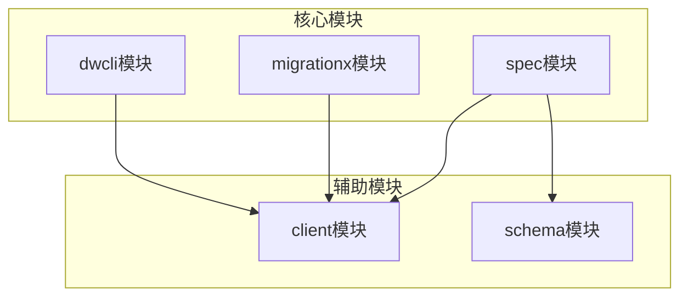
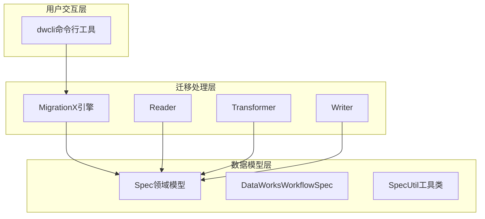
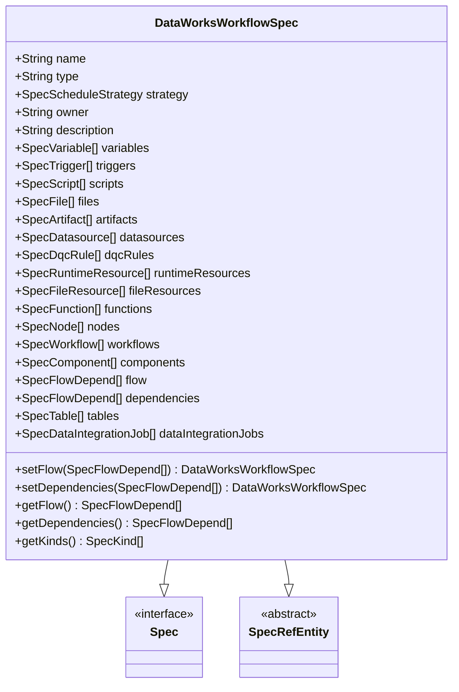
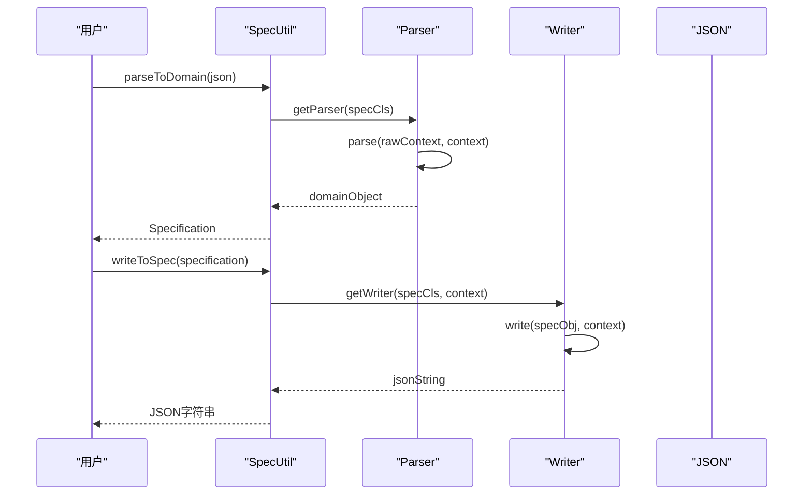
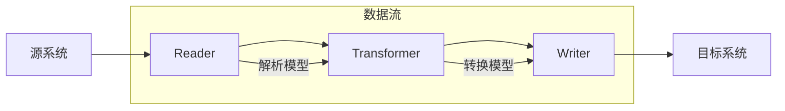
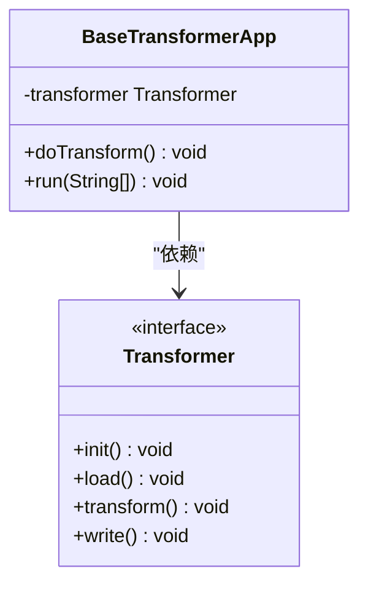
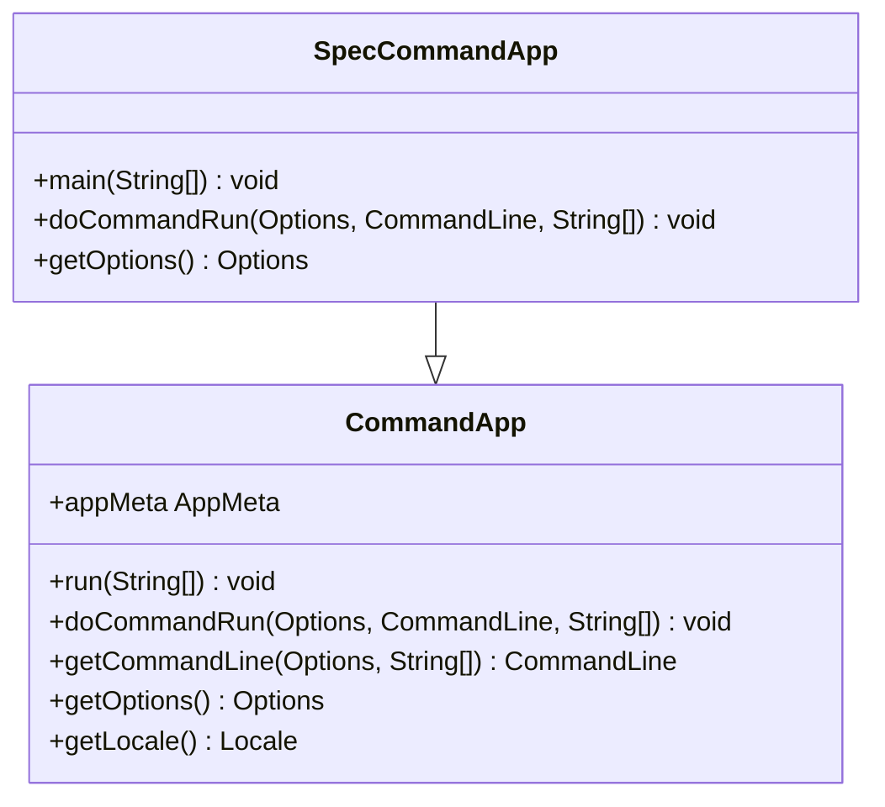
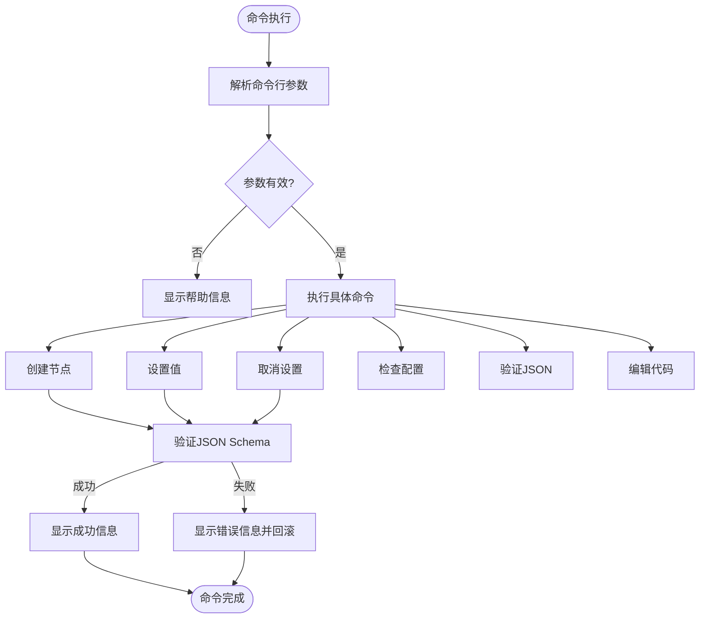
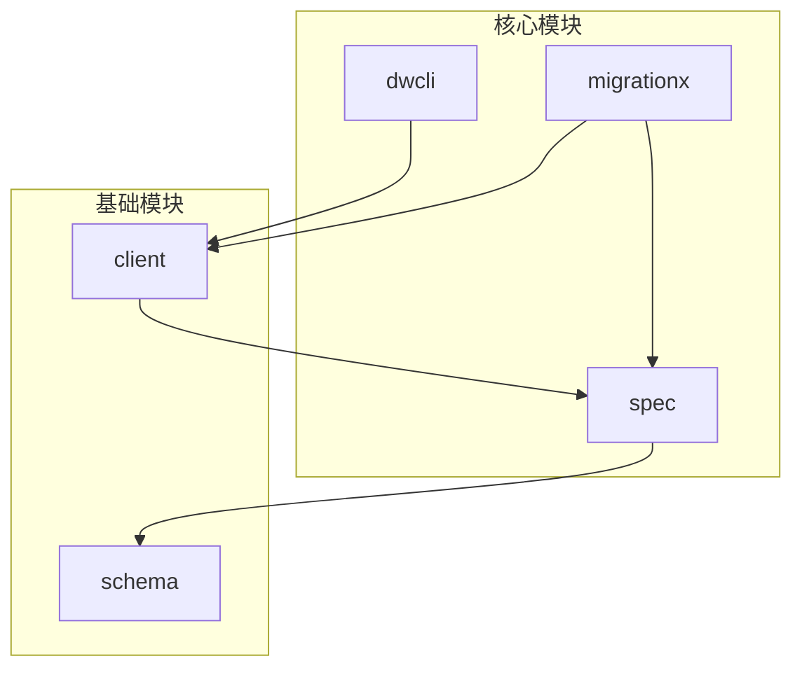

# 核心组件分解

<cite>
**本文档引用的文件**  
- [SpecUtil.java](file://spec/src/main/java/com/aliyun/dataworks/common/spec/SpecUtil.java)
- [DataWorksWorkflowSpec.java](file://spec/src/main/java/com/aliyun/dataworks/common/spec/domain/DataWorksWorkflowSpec.java)
- [Writer.java](file://spec/src/main/java/com/aliyun/dataworks/common/spec/writer/Writer.java)
- [Parser.java](file://spec/src/main/java/com/aliyun/dataworks/common/spec/parser/Parser.java)
- [CommandApp.java](file://client/client-common/src/main/java/com/aliyun/dataworks/client/command/CommandApp.java)
- [SpecCommandApp.java](file://client/client-toolkits/src/main/java/com/aliyun/dataworks/client/toolkits/command/SpecCommandApp.java)
- [Transformer.java](file://client/migrationx/migrationx-transformer/src/main/java/com/aliyun/dataworks/migrationx/transformer/core/transformer/Transformer.java)
- [cli.py](file://dwcli/dwcli/cli.py)
</cite>

## 目录
1. [引言](#引言)
2. [项目结构](#项目结构)
3. [核心组件](#核心组件)
4. [架构概述](#架构概述)
5. [详细组件分析](#详细组件分析)
6. [依赖分析](#依赖分析)
7. [性能考虑](#性能考虑)
8. [故障排除指南](#故障排除指南)
9. [结论](#结论)

## 引言
本文档旨在深入解析dataworks-spec项目中三大核心模块：spec、migrationx和dwcli的技术架构与实现细节。spec模块作为领域模型的核心，负责定义DataWorksWorkflowSpec等实体及其序列化/反序列化逻辑；migrationx模块采用管道-过滤器架构，包含Reader（解析源系统模型）、Transformer（模型转换）和Writer（写入目标系统）三个子组件；dwcli模块提供命令行接口，支持模板管理和JSON验证。文档将详细说明各组件的包结构、关键类及其协作关系。

## 项目结构
dataworks-spec项目采用模块化设计，主要分为spec、migrationx和dwcli三大核心模块，以及client和schema等辅助模块。项目结构清晰，各模块职责分明，便于维护和扩展。

**图源**  
- [项目结构](file://README.md)

## 核心组件
本节将深入分析spec、migrationx和dwcli三大核心模块的职责与实现。

**本节源**  
- [spec模块](file://spec/)
- [migrationx模块](file://client/migrationx/)
- [dwcli模块](file://dwcli/)

## 架构概述
dataworks-spec项目的整体架构采用分层设计，上层为命令行接口(dwcli)，中层为迁移引擎(migrationx)，底层为领域模型(spec)。各层之间通过清晰的接口进行通信，确保了系统的可维护性和可扩展性。

**图源**  
- [架构设计](file://docs/dev/develop-guide.md)

## 详细组件分析

### spec模块分析
spec模块是整个项目的核心，负责定义领域模型和处理序列化/反序列化逻辑。

#### 领域模型类图

**图源**  
- [DataWorksWorkflowSpec.java](file://spec/src/main/java/com/aliyun/dataworks/common/spec/domain/DataWorksWorkflowSpec.java)

#### 序列化/反序列化流程

**图源**  
- [SpecUtil.java](file://spec/src/main/java/com/aliyun/dataworks/common/spec/SpecUtil.java)
- [Parser.java](file://spec/src/main/java/com/aliyun/dataworks/common/spec/parser/Parser.java)
- [Writer.java](file://spec/src/main/java/com/aliyun/dataworks/common/spec/writer/Writer.java)

**本节源**  
- [SpecUtil.java](file://spec/src/main/java/com/aliyun/dataworks/common/spec/SpecUtil.java)
- [DataWorksWorkflowSpec.java](file://spec/src/main/java/com/aliyun/dataworks/common/spec/domain/DataWorksWorkflowSpec.java)
- [Parser.java](file://spec/src/main/java/com/aliyun/dataworks/common/spec/parser/Parser.java)
- [Writer.java](file://spec/src/main/java/com/aliyun/dataworks/common/spec/writer/Writer.java)

### migrationx模块分析
migrationx模块实现管道-过滤器架构，包含Reader、Transformer和Writer三个子组件。

#### 管道-过滤器架构

**图源**  
- [migrationx架构](file://docs/migrationx/index.md)

#### Transformer接口

**图源**  
- [Transformer.java](file://client/migrationx/migrationx-transformer/src/main/java/com/aliyun/dataworks/migrationx/transformer/core/transformer/Transformer.java)

**本节源**  
- [Transformer.java](file://client/migrationx/migrationx-transformer/src/main/java/com/aliyun/dataworks/migrationx/transformer/core/transformer/Transformer.java)

### dwcli模块分析
dwcli模块提供命令行接口，支持模板管理和JSON验证。

#### 命令行架构

**图源**  
- [CommandApp.java](file://client/client-common/src/main/java/com/aliyun/dataworks/client/command/CommandApp.java)
- [SpecCommandApp.java](file://client/client-toolkits/src/main/java/com/aliyun/dataworks/client/toolkits/command/SpecCommandApp.java)

#### CLI命令流程

**图源**  
- [cli.py](file://dwcli/dwcli/cli.py)

**本节源**  
- [cli.py](file://dwcli/dwcli/cli.py)
- [CommandApp.java](file://client/client-common/src/main/java/com/aliyun/dataworks/client/command/CommandApp.java)
- [SpecCommandApp.java](file://client/client-toolkits/src/main/java/com/aliyun/dataworks/client/toolkits/command/SpecCommandApp.java)

## 依赖分析
项目各模块之间的依赖关系清晰，遵循高内聚低耦合的设计原则。

**图源**  
- [pom.xml](file://pom.xml)

**本节源**  
- [pom.xml](file://pom.xml)

## 性能考虑
在设计和实现过程中，项目考虑了以下性能因素：
- 使用Fastjson2进行高效的JSON序列化和反序列化
- 采用工厂模式和单例模式减少对象创建开销
- 在Transformer中实现批量处理以提高转换效率
- 使用缓存机制避免重复解析相同的配置

## 故障排除指南
当遇到问题时，可以按照以下步骤进行排查：
1. 检查JSON配置是否符合Schema定义
2. 验证命令行参数是否正确
3. 查看日志输出以获取详细错误信息
4. 确认依赖的外部服务是否正常运行

**本节源**  
- [日志配置](file://client/client-common/src/main/resources/logback.xml)

## 结论
dataworks-spec项目通过清晰的模块划分和良好的架构设计，实现了DataWorks工作流规范的定义、迁移和管理功能。spec模块作为领域模型核心，提供了强大的序列化/反序列化能力；migrationx模块采用管道-过滤器架构，实现了灵活的模型转换；dwcli模块提供了友好的命令行接口，方便用户进行日常操作。三个模块协同工作，构成了一个完整的工作流管理解决方案。