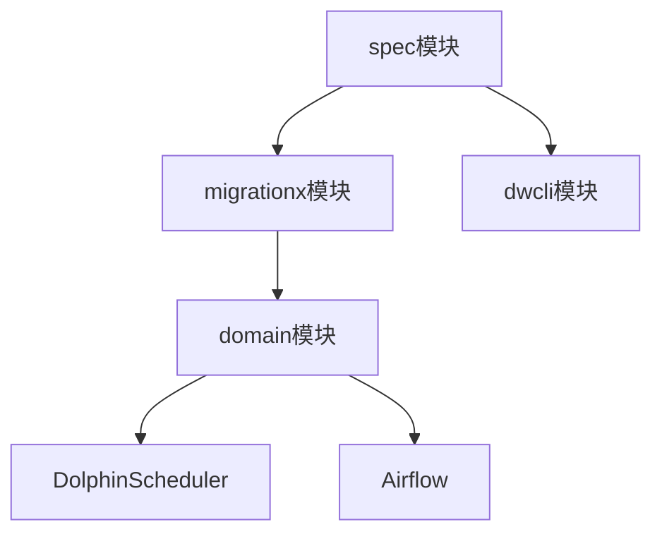
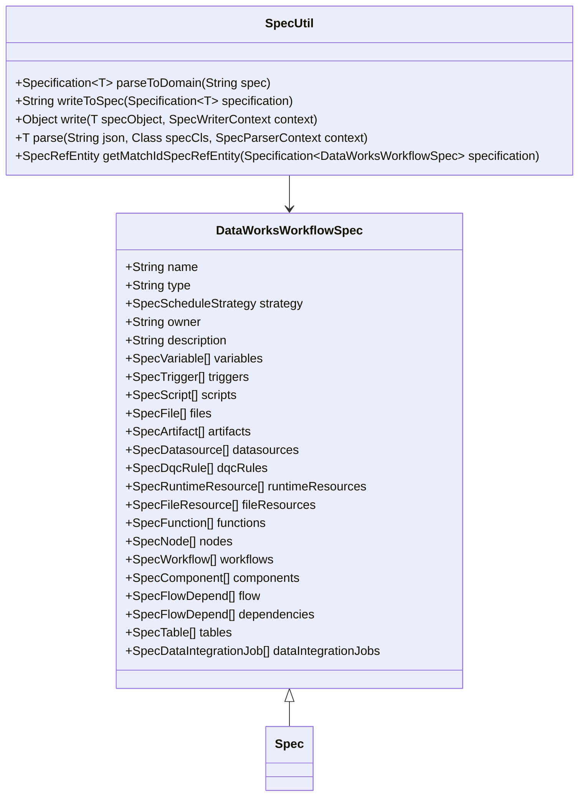
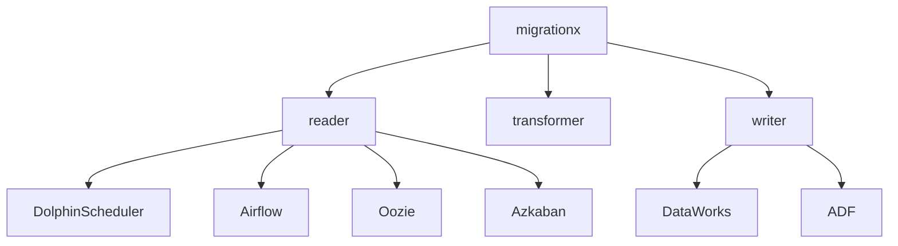
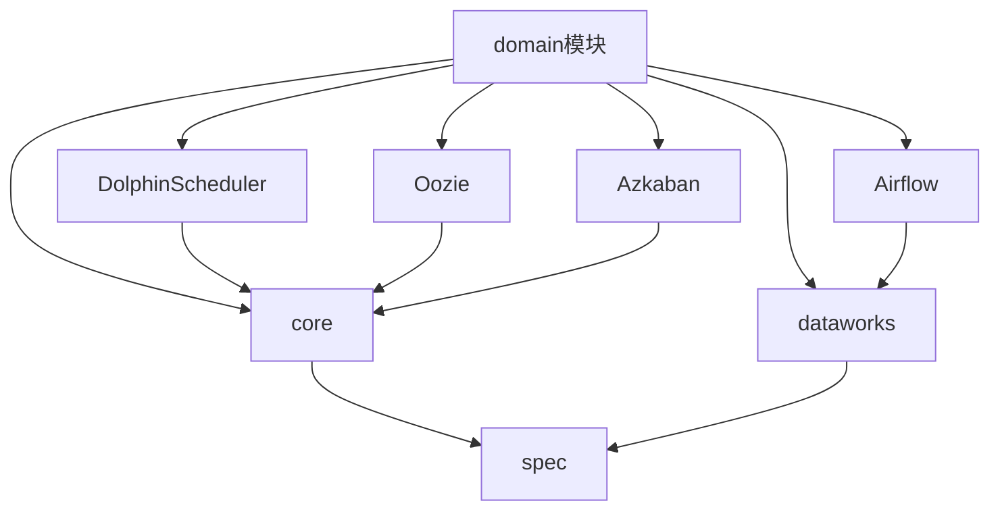
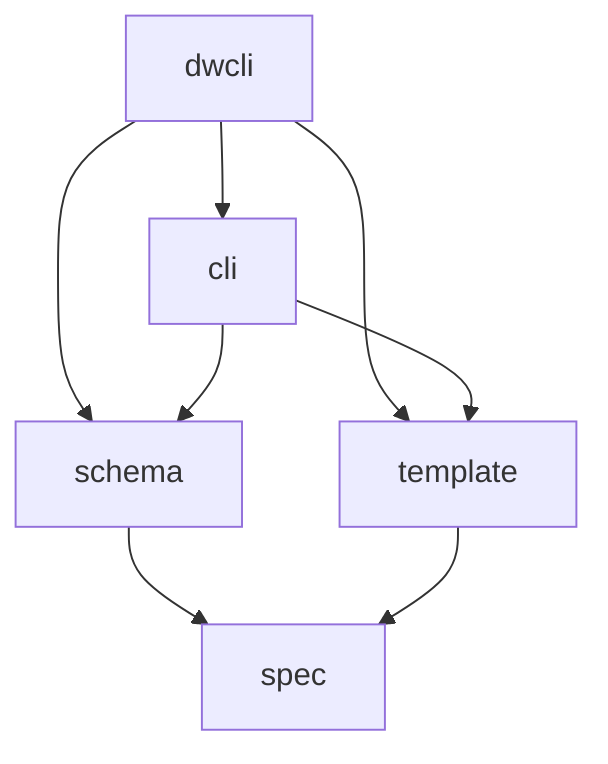
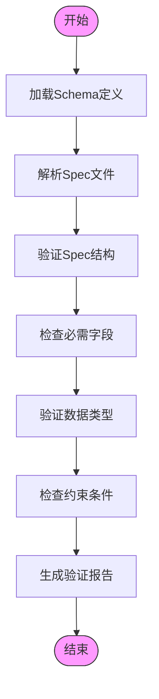
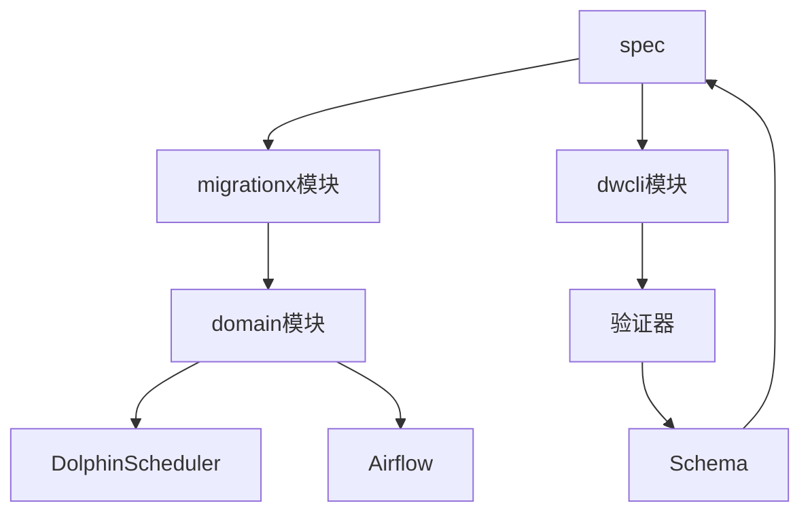
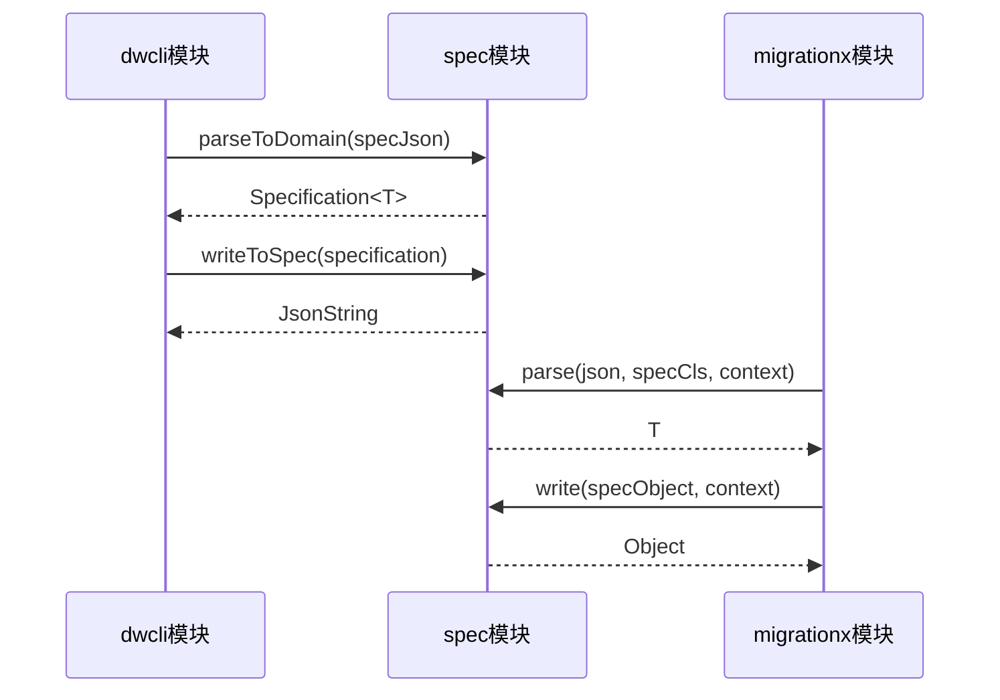
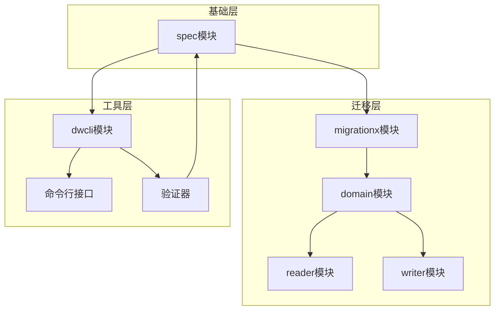

# 系统关系

<cite>
**本文档引用的文件**   
- [spec/pom.xml](file://spec/pom.xml)
- [client/migrationx/pom.xml](file://client/migrationx/pom.xml)
- [client/migrationx/migrationx-domain/migrationx-domain-core/pom.xml](file://client/migrationx/migrationx-domain/migrationx-domain-core/pom.xml)
- [client/migrationx/migrationx-domain/migrationx-domain-dolphinscheduler/pom.xml](file://client/migrationx/migrationx-domain/migrationx-domain-dolphinscheduler/pom.xml)
- [client/migrationx/migrationx-domain/migrationx-domain-airflow/pom.xml](file://client/migrationx/migrationx-domain/migrationx-domain-airflow/pom.xml)
- [client/migrationx/migrationx-domain/migrationx-domain-dataworks/pom.xml](file://client/migrationx/migrationx-domain/migrationx-domain-dataworks/pom.xml)
- [dwcli/setup.py](file://dwcli/setup.py)
- [dwcli/dwcli/cli.py](file://dwcli/dwcli/cli.py)
- [dwcli/dwcli/pkg/schema/validator.py](file://dwcli/dwcli/pkg/schema/validator.py)
- [spec/src/main/java/com/aliyun/dataworks/common/spec/SpecUtil.java](file://spec/src/main/java/com/aliyun/dataworks/common/spec/SpecUtil.java)
- [spec/src/main/java/com/aliyun/dataworks/common/spec/domain/DataWorksWorkflowSpec.java](file://spec/src/main/java/com/aliyun/dataworks/common/spec/domain/DataWorksWorkflowSpec.java)
- [spec/src/main/java/com/aliyun/dataworks/common/spec/parser/SpecParserFactory.java](file://spec/src/main/java/com/aliyun/dataworks/common/spec/parser/SpecParserFactory.java)
- [schema/flow.schema.json](file://schema/flow.schema.json)
</cite>

## 目录
1. [引言](#引言)
2. [核心模块架构](#核心模块架构)
3. [spec模块分析](#spec模块分析)
4. [migrationx模块分析](#migrationx模块分析)
5. [dwcli模块分析](#dwcli模块分析)
6. [模块间依赖关系](#模块间依赖关系)
7. [API调用关系](#api调用关系)
8. [组件依赖图](#组件依赖图)
9. [结论](#结论)

## 引言
dataworks-spec项目是一个用于描述和管理DataWorks工作流的规范系统，包含三个核心模块：spec、migrationx和dwcli。这些模块共同构成了一个完整的生态系统，用于定义、迁移和管理数据工作流。本文档将详细描述这三个核心模块之间的依赖和交互关系，重点分析spec模块作为基础依赖被其他模块引用的架构设计。

## 核心模块架构
dataworks-spec项目的核心架构由三个主要模块组成：spec、migrationx和dwcli。spec模块作为基础依赖，为其他两个模块提供数据结构定义和验证功能。migrationx模块负责不同源系统之间的迁移工作，支持多种源系统如DolphinScheduler和Airflow。dwcli模块则提供命令行接口，用于模板验证和配置管理。

**图源**
- [spec/pom.xml](file://spec/pom.xml)
- [client/migrationx/pom.xml](file://client/migrationx/pom.xml)

## spec模块分析
spec模块是整个系统的基础，提供了数据工作流的规范定义和验证功能。该模块通过Java类和JSON Schema定义了工作流的结构，包括节点、依赖关系、调度策略等核心概念。

**图源**
- [spec/src/main/java/com/aliyun/dataworks/common/spec/domain/DataWorksWorkflowSpec.java](file://spec/src/main/java/com/aliyun/dataworks/common/spec/domain/DataWorksWorkflowSpec.java)
- [spec/src/main/java/com/aliyun/dataworks/common/spec/SpecUtil.java](file://spec/src/main/java/com/aliyun/dataworks/common/spec/SpecUtil.java)

**节源**
- [spec/src/main/java/com/aliyun/dataworks/common/spec/domain/DataWorksWorkflowSpec.java](file://spec/src/main/java/com/aliyun/dataworks/common/spec/domain/DataWorksWorkflowSpec.java)
- [spec/src/main/java/com/aliyun/dataworks/common/spec/SpecUtil.java](file://spec/src/main/java/com/aliyun/dataworks/common/spec/SpecUtil.java)

## migrationx模块分析
migrationx模块负责实现不同源系统之间的迁移功能，通过domain模块支持多种源系统。该模块的架构设计允许通过reader/writer实现双向集成，支持从源系统读取数据并写入目标系统。

**图源**
- [client/migrationx/pom.xml](file://client/migrationx/pom.xml)

**节源**
- [client/migrationx/pom.xml](file://client/migrationx/pom.xml)

### domain模块支持多源系统
migrationx通过domain模块支持多种源系统，每个源系统都有独立的实现模块。这种设计模式允许系统灵活扩展，支持新的源系统而无需修改核心代码。

**图源**
- [client/migrationx/migrationx-domain/migrationx-domain-core/pom.xml](file://client/migrationx/migrationx-domain/migrationx-domain-core/pom.xml)
- [client/migrationx/migrationx-domain/migrationx-domain-dolphinscheduler/pom.xml](file://client/migrationx/migrationx-domain/migrationx-domain-dolphinscheduler/pom.xml)
- [client/migrationx/migrationx-domain/migrationx-domain-airflow/pom.xml](file://client/migrationx/migrationx-domain/migrationx-domain-airflow/pom.xml)
- [client/migrationx/migrationx-domain/migrationx-domain-dataworks/pom.xml](file://client/migrationx/migrationx-domain/migrationx-domain-dataworks/pom.xml)

**节源**
- [client/migrationx/migrationx-domain/migrationx-domain-core/pom.xml](file://client/migrationx/migrationx-domain/migrationx-domain-core/pom.xml)
- [client/migrationx/migrationx-domain/migrationx-domain-dolphinscheduler/pom.xml](file://client/migrationx/migrationx-domain/migrationx-domain-dolphinscheduler/pom.xml)
- [client/migrationx/migrationx-domain/migrationx-domain-airflow/pom.xml](file://client/migrationx/migrationx-domain/migrationx-domain-airflow/pom.xml)
- [client/migrationx/migrationx-domain/migrationx-domain-dataworks/pom.xml](file://client/migrationx/migrationx-domain/migrationx-domain-dataworks/pom.xml)

## dwcli模块分析
dwcli模块提供命令行接口，用于模板验证和配置管理。该模块利用spec模块的schema进行模板验证，确保生成的配置文件符合规范要求。

**图源**
- [dwcli/setup.py](file://dwcli/setup.py)

**节源**
- [dwcli/setup.py](file://dwcli/setup.py)

### 模板验证机制
dwcli模块通过schema验证器对生成的配置文件进行验证，确保其符合spec模块定义的规范。这种设计保证了配置文件的质量和一致性。

**图源**
- [dwcli/dwcli/pkg/schema/validator.py](file://dwcli/dwcli/pkg/schema/validator.py)

**节源**
- [dwcli/dwcli/pkg/schema/validator.py](file://dwcli/dwcli/pkg/schema/validator.py)

## 模块间依赖关系
三个核心模块之间存在明确的依赖关系，spec模块作为基础依赖被migrationx和dwcli模块引用。这种分层架构设计确保了系统的可维护性和可扩展性。

**图源**
- [spec/pom.xml](file://spec/pom.xml)
- [client/migrationx/pom.xml](file://client/migrationx/pom.xml)
- [dwcli/setup.py](file://dwcli/setup.py)

**节源**
- [spec/pom.xml](file://spec/pom.xml)
- [client/migrationx/pom.xml](file://client/migrationx/pom.xml)
- [dwcli/setup.py](file://dwcli/setup.py)

## API调用关系
模块间的API调用关系体现了系统的交互模式。spec模块提供核心的解析和序列化API，migrationx和dwcli模块通过这些API与规范数据进行交互。

**图源**
- [spec/src/main/java/com/aliyun/dataworks/common/spec/SpecUtil.java](file://spec/src/main/java/com/aliyun/dataworks/common/spec/SpecUtil.java)

**节源**
- [spec/src/main/java/com/aliyun/dataworks/common/spec/SpecUtil.java](file://spec/src/main/java/com/aliyun/dataworks/common/spec/SpecUtil.java)

## 组件依赖图
组件依赖图展示了系统中各个组件之间的依赖关系，包括编译时依赖和运行时交互。

**图源**
- [spec/pom.xml](file://spec/pom.xml)
- [client/migrationx/pom.xml](file://client/migrationx/pom.xml)
- [dwcli/setup.py](file://dwcli/setup.py)

**节源**
- [spec/pom.xml](file://spec/pom.xml)
- [client/migrationx/pom.xml](file://client/migrationx/pom.xml)
- [dwcli/setup.py](file://dwcli/setup.py)

## 结论
dataworks-spec项目的系统架构设计体现了清晰的分层和模块化思想。spec模块作为基础依赖，为migrationx和dwcli模块提供了统一的数据规范和验证机制。migrationx模块通过domain模块支持多种源系统，实现了灵活的双向集成能力。dwcli模块则利用spec的schema进行模板验证，确保配置文件的质量。这种架构设计不仅保证了系统的可维护性，还为未来的扩展提供了良好的基础。