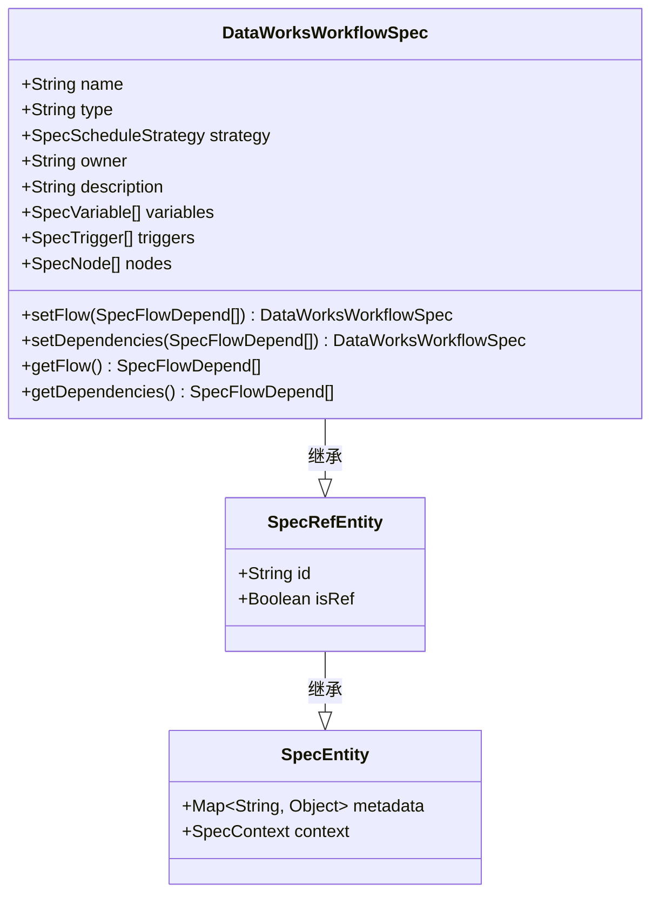
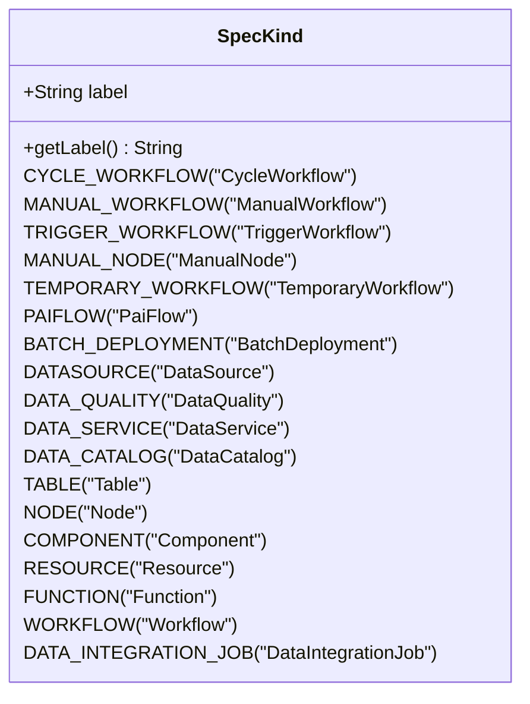
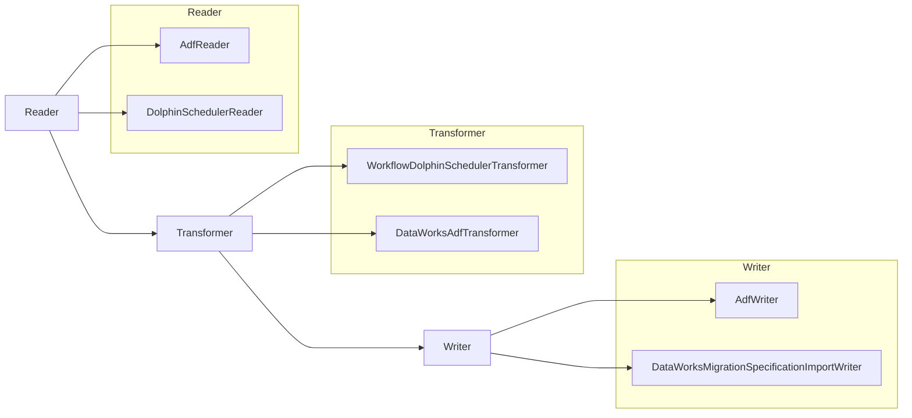
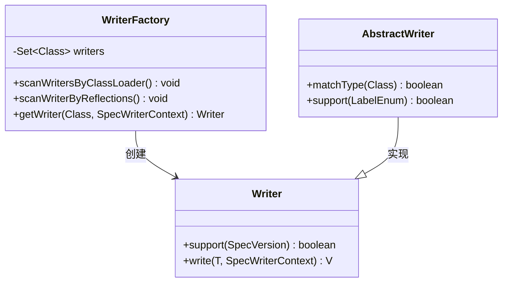
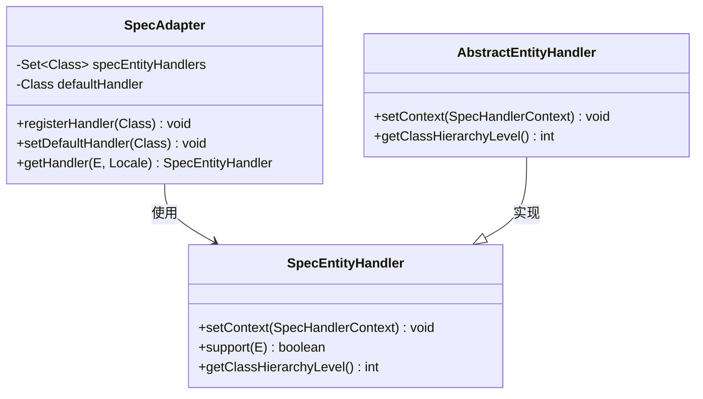
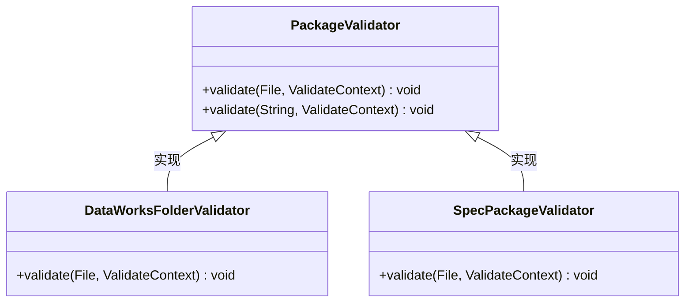

# 设计模式

<cite>
**本文档中引用的文件**  
- [DataWorksWorkflowSpec.java](file://spec/src/main/java/com/aliyun/dataworks/common/spec/domain/DataWorksWorkflowSpec.java)
- [SpecAdapter.java](file://spec/src/main/java/com/aliyun/dataworks/common/spec/adapter/SpecAdapter.java)
- [WriterFactory.java](file://spec/src/main/java/com/aliyun/dataworks/common/spec/writer/WriterFactory.java)
- [PackageValidator.java](file://client/migrationx/migrationx-domain/migrationx-domain-dataworks/src/main/java/com/aliyun/dataworks/migrationx/domain/dataworks/packages/validator/PackageValidator.java)
- [Transformer.java](file://client/migrationx/migrationx-transformer/src/main/java/com/aliyun/dataworks/migrationx/transformer/core/transformer/Transformer.java)
- [Writer.java](file://spec/src/main/java/com/aliyun/dataworks/common/spec/writer/Writer.java)
- [SpecEntity.java](file://spec/src/main/java/com/aliyun/dataworks/common/spec/domain/SpecEntity.java)
- [SpecRefEntity.java](file://spec/src/main/java/com/aliyun/dataworks/common/spec/domain/SpecRefEntity.java)
- [SpecKind.java](file://spec/src/main/java/com/aliyun/dataworks/common/spec/domain/enums/SpecKind.java)
- [AbstractEntityHandler.java](file://spec/src/main/java/com/aliyun/dataworks/common/spec/adapter/handler/AbstractEntityHandler.java)
</cite>

## 目录
1. [引言](#引言)
2. [领域驱动设计（DDD）的应用](#领域驱动设计ddd的应用)
3. [管道-过滤器架构在migrationx中的实现](#管道-过滤器架构在migrationx中的实现)
4. [工厂模式的使用](#工厂模式的使用)
5. [适配器模式的实现](#适配器模式的实现)
6. [策略模式的应用](#策略模式的应用)
7. [设计模式对系统可扩展性和可维护性的影响](#设计模式对系统可扩展性和可维护性的影响)
8. [结论](#结论)

## 引言
dataworks-spec项目是一个用于定义和管理数据工作流规范的系统，其设计中广泛应用了多种设计模式，以提升系统的可扩展性、可维护性和灵活性。本文档将深入分析该项目中领域驱动设计（DDD）、管道-过滤器架构、工厂模式、适配器模式和策略模式的具体实现与应用场景。

## 领域驱动设计（DDD）的应用

在dataworks-spec项目中，领域驱动设计（DDD）被用来组织核心业务逻辑和数据结构。通过聚合根、值对象和仓储模式的使用，系统实现了清晰的边界划分和高内聚低耦合的设计。

### 聚合根：DataWorksWorkflowSpec

`DataWorksWorkflowSpec` 类是系统中的一个核心聚合根，代表了一个完整的工作流规范。它继承自 `SpecRefEntity`，并包含了多个子实体，如 `SpecVariable`、`SpecTrigger`、`SpecNode` 等。这些子实体共同构成了一个完整的工作流定义。

**图示来源**  
- [DataWorksWorkflowSpec.java](file://spec/src/main/java/com/aliyun/dataworks/common/spec/domain/DataWorksWorkflowSpec.java#L66-L130)
- [SpecRefEntity.java](file://spec/src/main/java/com/aliyun/dataworks/common/spec/domain/SpecRefEntity.java#L34-L38)
- [SpecEntity.java](file://spec/src/main/java/com/aliyun/dataworks/common/spec/domain/SpecEntity.java#L31-L39)

**本节来源**  
- [DataWorksWorkflowSpec.java](file://spec/src/main/java/com/aliyun/dataworks/common/spec/domain/DataWorksWorkflowSpec.java#L66-L130)

### 值对象与枚举：SpecKind

`SpecKind` 枚举类定义了所有可能的工作流类型，如 `CYCLE_WORKFLOW`、`MANUAL_WORKFLOW` 等。这些枚举值作为值对象，在系统中用于标识不同类型的工作流，确保了类型安全和语义清晰。

**图示来源**  
- [SpecKind.java](file://spec/src/main/java/com/aliyun/dataworks/common/spec/domain/enums/SpecKind.java#L24-L112)

**本节来源**  
- [SpecKind.java](file://spec/src/main/java/com/aliyun/dataworks/common/spec/domain/enums/SpecKind.java#L24-L112)

## 管道-过滤器架构在migrationx中的实现

migrationx模块采用了典型的管道-过滤器架构，将数据处理流程分解为三个主要阶段：Reader → Transformer → Writer。每个阶段都实现了特定的接口，并通过组合的方式构建完整的数据迁移流水线。

### Reader、Transformer 和 Writer 接口

- **Reader**：负责从源系统读取原始数据。
- **Transformer**：负责对读取的数据进行转换和处理。
- **Writer**：负责将处理后的数据写入目标系统。

**图示来源**  
- [Transformer.java](file://client/migrationx/migrationx-transformer/src/main/java/com/aliyun/dataworks/migrationx/transformer/core/transformer/Transformer.java#L22-L48)

**本节来源**  
- [Transformer.java](file://client/migrationx/migrationx-transformer/src/main/java/com/aliyun/dataworks/migrationx/transformer/core/transformer/Transformer.java#L22-L48)

## 工厂模式的使用

`WriterFactory` 类是工厂模式的典型应用，它根据输入类型和版本信息动态创建合适的 `Writer` 实例。该工厂通过反射机制扫描所有实现了 `Writer` 接口的类，并根据注解 `@SpecWriter` 进行注册和匹配。

**图示来源**  
- [WriterFactory.java](file://spec/src/main/java/com/aliyun/dataworks/common/spec/writer/WriterFactory.java#L37-L86)
- [Writer.java](file://spec/src/main/java/com/aliyun/dataworks/common/spec/writer/Writer.java#L26-L45)

**本节来源**  
- [WriterFactory.java](file://spec/src/main/java/com/aliyun/dataworks/common/spec/writer/WriterFactory.java#L37-L86)
- [Writer.java](file://spec/src/main/java/com/aliyun/dataworks/common/spec/writer/Writer.java#L26-L45)

## 适配器模式的实现

`SpecAdapter` 类是适配器模式的核心实现，它允许不同来源的数据实体（如来自不同系统的节点配置）被统一转换为标准的 `SpecEntity` 对象。通过注册多个 `SpecEntityHandler`，系统可以根据输入实体的类型选择最合适的处理器。

**图示来源**  
- [SpecAdapter.java](file://spec/src/main/java/com/aliyun/dataworks/common/spec/adapter/SpecAdapter.java#L38-L96)
- [AbstractEntityHandler.java](file://spec/src/main/java/com/aliyun/dataworks/common/spec/adapter/handler/AbstractEntityHandler.java#L30-L54)

**本节来源**  
- [SpecAdapter.java](file://spec/src/main/java/com/aliyun/dataworks/common/spec/adapter/SpecAdapter.java#L38-L96)
- [AbstractEntityHandler.java](file://spec/src/main/java/com/aliyun/dataworks/common/spec/adapter/handler/AbstractEntityHandler.java#L30-L54)

## 策略模式的应用

`PackageValidator` 接口是策略模式的体现，它定义了包验证的标准行为。不同的实现类（如 `DataWorksFolderValidator`、`SpecPackageValidator`）提供了不同的验证策略，系统可以在运行时根据需要选择合适的验证器。

**图示来源**  
- [PackageValidator.java](file://client/migrationx/migrationx-domain/migrationx-domain-dataworks/src/main/java/com/aliyun/dataworks/migrationx/domain/dataworks/packages/validator/PackageValidator.java#L11-L18)

**本节来源**  
- [PackageValidator.java](file://client/migrationx/migrationx-domain/migrationx-domain-dataworks/src/main/java/com/aliyun/dataworks/migrationx/domain/dataworks/packages/validator/PackageValidator.java#L11-L18)

## 设计模式对系统可扩展性和可维护性的影响

通过上述设计模式的应用，dataworks-spec项目实现了高度的模块化和松耦合：

1. **可扩展性**：新增一种数据源或目标系统只需实现相应的 `Reader`、`Transformer` 或 `Writer`，无需修改现有代码。
2. **可维护性**：各组件职责明确，修改某一模块不会影响其他模块。
3. **灵活性**：通过配置即可切换不同的处理策略，适应多种业务场景。
4. **可测试性**：每个组件都可以独立测试，便于单元测试和集成测试。

这些设计模式不仅提升了代码质量，还为未来的功能扩展和技术演进提供了坚实的基础。

## 结论

dataworks-spec项目通过精心设计的架构和多种设计模式的综合运用，成功构建了一个灵活、可扩展且易于维护的数据工作流规范管理系统。领域驱动设计确保了业务逻辑的清晰表达，管道-过滤器架构实现了数据处理流程的解耦，而工厂、适配器和策略模式则进一步增强了系统的灵活性和可配置性。这些设计实践为类似系统的开发提供了有价值的参考。