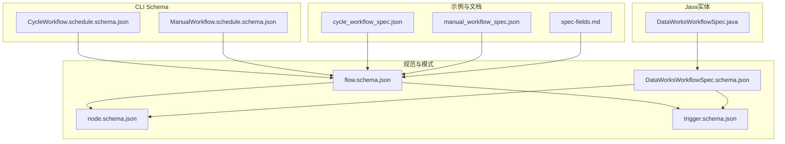
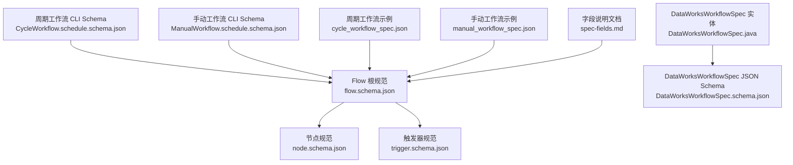
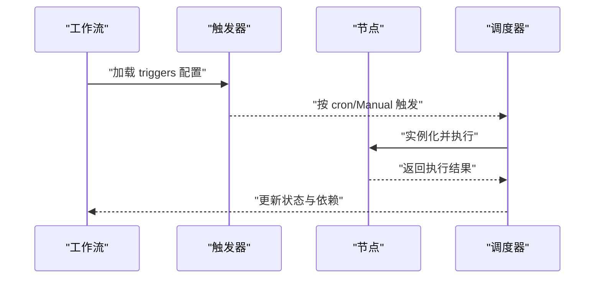
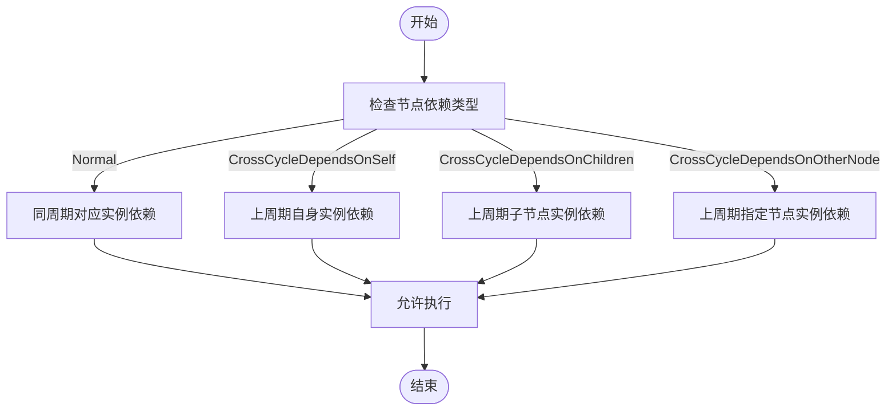
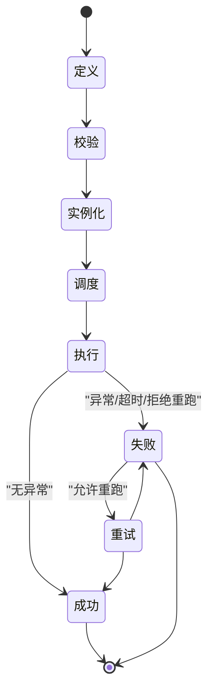
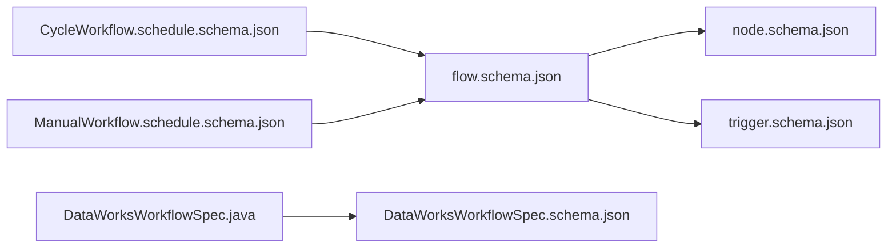
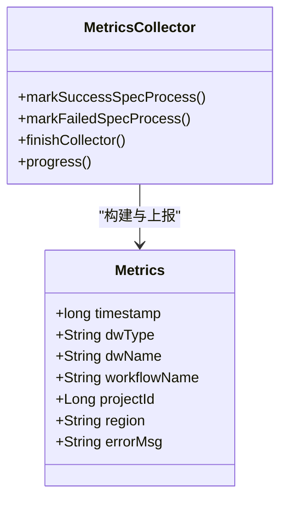

# 工作流模型

<cite>
**本文引用的文件**
- [flow.schema.json](file://schema/flow.schema.json)
- [trigger.schema.json](file://schema/trigger.schema.json)
- [node.schema.json](file://schema/node.schema.json)
- [DataWorksWorkflowSpec.java](file://spec/src/main/java/com/aliyun/dataworks/common/spec/domain/DataWorksWorkflowSpec.java)
- [DataWorksWorkflowSpec.schema.json](file://spec/src/main/resources/spec/schema/DataWorksWorkflowSpec.schema.json)
- [CycleWorkflow.schedule.schema.json](file://dwcli/dwcli/schemas/CycleWorkflow.schedule.schema.json)
- [ManualWorkflow.schedule.schema.json](file://dwcli/dwcli/schemas/ManualWorkflow.schedule.schema.json)
- [cycle_workflow_spec.json](file://spec/src/test/resources/copier/cycle_workflow_spec.json)
- [manual_workflow_spec.json](file://spec/src/test/resources/copier/manual_workflow_spec.json)
- [spec-fields.md](file://docs/spec/spec-fields.md)
- [FailureStrategy.java](file://spec/src/main/java/com/aliyun/dataworks/common/spec/domain/enums/FailureStrategy.java)
- [Metrics.java](file://client/migrationx/migrationx-common/src/main/java/com/aliyun/migrationx/common/metrics/Metrics.java)
- [MetricsCollector.java](file://client/migrationx/migrationx-common/src/main/java/com/aliyun/migrationx/common/metrics/MetricsCollector.java)
</cite>

## 目录
1. [简介](#简介)
2. [项目结构](#项目结构)
3. [核心组件](#核心组件)
4. [架构总览](#架构总览)
5. [详细组件分析](#详细组件分析)
6. [依赖关系分析](#依赖关系分析)
7. [性能与监控](#性能与监控)
8. [故障排查指南](#故障排查指南)
9. [结论](#结论)
10. [附录](#附录)

## 简介
本文件面向 dataworks-spec 仓库，系统化梳理工作流模型，围绕 DataWorksWorkflowSpec 与 Flow.schema.json 所定义的工作流结构展开，覆盖工作流元数据、调度策略、触发器配置、执行模式、版本控制、状态管理、异常处理、生命周期阶段、依赖管理、参数传递与执行上下文配置，并给出周期性工作流与手动工作流的配置示例与最佳实践，以及性能优化与监控指标建议。

## 项目结构
- 规范与模式定义位于 schema 与 spec 资源目录，分别提供 JSON Schema 与 Java 实体映射。
- dwcli 提供独立的周期/手动工作流 JSON Schema，便于 CLI 场景校验与模板生成。
- 示例与测试资源位于 spec/src/test/resources 下，包含真实工作流样例。

图表来源
- [flow.schema.json](file://schema/flow.schema.json#L1-L202)
- [node.schema.json](file://schema/node.schema.json#L1-L160)
- [trigger.schema.json](file://schema/trigger.schema.json#L1-L36)
- [DataWorksWorkflowSpec.schema.json](file://spec/src/main/resources/spec/schema/DataWorksWorkflowSpec.schema.json#L1-L119)
- [DataWorksWorkflowSpec.java](file://spec/src/main/java/com/aliyun/dataworks/common/spec/domain/DataWorksWorkflowSpec.java#L60-L130)
- [CycleWorkflow.schedule.schema.json](file://dwcli/dwcli/schemas/CycleWorkflow.schedule.schema.json#L1-L136)
- [ManualWorkflow.schedule.schema.json](file://dwcli/dwcli/schemas/ManualWorkflow.schedule.schema.json#L1-L103)
- [cycle_workflow_spec.json](file://spec/src/test/resources/copier/cycle_workflow_spec.json#L1-L200)
- [manual_workflow_spec.json](file://spec/src/test/resources/copier/manual_workflow_spec.json#L1-L200)
- [spec-fields.md](file://docs/spec/spec-fields.md#L1-L569)

章节来源
- [flow.schema.json](file://schema/flow.schema.json#L1-L202)
- [DataWorksWorkflowSpec.schema.json](file://spec/src/main/resources/spec/schema/DataWorksWorkflowSpec.schema.json#L1-L119)
- [DataWorksWorkflowSpec.java](file://spec/src/main/java/com/aliyun/dataworks/common/spec/domain/DataWorksWorkflowSpec.java#L60-L130)
- [CycleWorkflow.schedule.schema.json](file://dwcli/dwcli/schemas/CycleWorkflow.schedule.schema.json#L1-L136)
- [ManualWorkflow.schedule.schema.json](file://dwcli/dwcli/schemas/ManualWorkflow.schedule.schema.json#L1-L103)
- [spec-fields.md](file://docs/spec/spec-fields.md#L1-L569)

## 核心组件
- 工作流规范根对象：包含 version、kind、metadata、spec 字段；kind 决定工作流类型（周期/手动）。
- WorkflowSpec：包含 nodes、scripts、artifacts、variables、runtimeResources、fileResources、functions、flow 等集合。
- 触发器：支持 Scheduler 与 Manual 两类，周期工作流在 spec.triggers 中定义，节点也可单独 trigger。
- 调度策略：节点层面的 recurrence、timeout、priority、instanceMode、rerunMode 等；工作流层面可有 strategy 或 workflow 层 strategy。
- 元数据：owner、description 等扩展信息。
- 依赖关系：flow 定义节点间依赖，支持普通依赖与跨周期依赖类型。

章节来源
- [flow.schema.json](file://schema/flow.schema.json#L1-L202)
- [node.schema.json](file://schema/node.schema.json#L1-L160)
- [trigger.schema.json](file://schema/trigger.schema.json#L1-L36)
- [DataWorksWorkflowSpec.java](file://spec/src/main/java/com/aliyun/dataworks/common/spec/domain/DataWorksWorkflowSpec.java#L60-L130)
- [DataWorksWorkflowSpec.schema.json](file://spec/src/main/resources/spec/schema/DataWorksWorkflowSpec.schema.json#L1-L119)

## 架构总览
工作流模型由“JSON Schema 规范 + Java 实体映射 + CLI Schema + 示例与文档”构成，形成从定义到落地的一致视图。

图表来源
- [flow.schema.json](file://schema/flow.schema.json#L1-L202)
- [node.schema.json](file://schema/node.schema.json#L1-L160)
- [trigger.schema.json](file://schema/trigger.schema.json#L1-L36)
- [DataWorksWorkflowSpec.java](file://spec/src/main/java/com/aliyun/dataworks/common/spec/domain/DataWorksWorkflowSpec.java#L60-L130)
- [DataWorksWorkflowSpec.schema.json](file://spec/src/main/resources/spec/schema/DataWorksWorkflowSpec.schema.json#L1-L119)
- [CycleWorkflow.schedule.schema.json](file://dwcli/dwcli/schemas/CycleWorkflow.schedule.schema.json#L1-L136)
- [ManualWorkflow.schedule.schema.json](file://dwcli/dwcli/schemas/ManualWorkflow.schedule.schema.json#L1-L103)
- [cycle_workflow_spec.json](file://spec/src/test/resources/copier/cycle_workflow_spec.json#L1-L200)
- [manual_workflow_spec.json](file://spec/src/test/resources/copier/manual_workflow_spec.json#L1-L200)
- [spec-fields.md](file://docs/spec/spec-fields.md#L1-L569)

## 详细组件分析

### 工作流元数据与版本控制
- 版本：version 字段标识规范版本，用于解析与兼容性判断。
- 类型：kind 限定为 CycleWorkflow 或 ManualWorkflow。
- 元数据：metadata.owner、metadata.description 等扩展信息，便于资产治理与运维追踪。
- 版本转换：通过版本转换工厂与转换器实现不同版本间的互操作，保证历史工作流的演进与迁移。

章节来源
- [flow.schema.json](file://schema/flow.schema.json#L1-L202)
- [spec-fields.md](file://docs/spec/spec-fields.md#L1-L569)
- [DataWorksWorkflowSpec.java](file://spec/src/main/java/com/aliyun/dataworks/common/spec/domain/DataWorksWorkflowSpec.java#L60-L130)

### 调度策略与触发器配置
- 周期工作流：在 spec.triggers 中定义 Scheduler 触发器，包含 cron、startTime、endTime、timezone 等。
- 节点级触发器：节点可单独配置 trigger，覆盖工作流级触发器。
- 手动工作流：节点 trigger.type 为 Manual，无需 cron 表达式。

图表来源
- [flow.schema.json](file://schema/flow.schema.json#L171-L201)
- [trigger.schema.json](file://schema/trigger.schema.json#L1-L36)
- [node.schema.json](file://schema/node.schema.json#L1-L160)

章节来源
- [flow.schema.json](file://schema/flow.schema.json#L171-L201)
- [trigger.schema.json](file://schema/trigger.schema.json#L1-L36)
- [node.schema.json](file://schema/node.schema.json#L1-L160)

### 执行模式与节点属性
- recurrence：Normal/Skip/Pause 控制节点是否实际运行。
- priority：数值越大优先级越高，影响并发调度顺序。
- timeout：节点超时秒数，超时将终止执行。
- instanceMode：T+1 或 Immediately，决定配置变更生效时机。
- rerunMode：Allowed/Denied/FailureAllowed，控制重跑策略。

章节来源
- [node.schema.json](file://schema/node.schema.json#L1-L160)
- [spec-fields.md](file://docs/spec/spec-fields.md#L314-L354)

### 依赖管理与跨周期依赖
- flow.edges：定义 nodeId 与其 depends 列表，depends 支持 Normal 与多种跨周期依赖类型（如自依赖、子节点依赖、其他节点依赖）。
- 依赖类型语义：用于跨周期实例间的依赖关系建模，确保数据一致性与时序正确性。

图表来源
- [flow.schema.json](file://schema/flow.schema.json#L86-L154)

章节来源
- [flow.schema.json](file://schema/flow.schema.json#L86-L154)

### 参数传递与执行上下文
- variables：工作流/节点级变量声明，支持常量、系统变量与上下文引用。
- inputs/outputs：节点输入输出可引用 artifacts、variables、nodeOutputs。
- 示例中展示了节点输出作为下游输入、系统变量注入等用法。

章节来源
- [spec-fields.md](file://docs/spec/spec-fields.md#L59-L107)
- [node.schema.json](file://schema/node.schema.json#L1-L160)
- [cycle_workflow_spec.json](file://spec/src/test/resources/copier/cycle_workflow_spec.json#L1-L200)
- [manual_workflow_spec.json](file://spec/src/test/resources/copier/manual_workflow_spec.json#L1-L200)

### 工作流生命周期与状态管理
- 生命周期阶段（概念性说明）：定义、校验、实例化、调度、执行、回滚/重试、完成/失败。
- 状态管理：节点状态受 recurrence、timeout、rerunMode 等影响；工作流层面可通过 strategy/failureStrategy 控制失败策略（Continue/Break）。

图表来源
- [FailureStrategy.java](file://spec/src/main/java/com/aliyun/dataworks/common/spec/domain/enums/FailureStrategy.java#L1-L46)
- [node.schema.json](file://schema/node.schema.json#L1-L160)
- [DataWorksWorkflowSpec.schema.json](file://spec/src/main/resources/spec/schema/DataWorksWorkflowSpec.schema.json#L1-L119)

章节来源
- [FailureStrategy.java](file://spec/src/main/java/com/aliyun/dataworks/common/spec/domain/enums/FailureStrategy.java#L1-L46)
- [DataWorksWorkflowSpec.schema.json](file://spec/src/main/resources/spec/schema/DataWorksWorkflowSpec.schema.json#L1-L119)

### 异常处理机制
- 失败策略：FailureStrategy 提供 Continue/Break，用于工作流/策略层面对失败的处理决策。
- 重跑策略：rerunMode 与 rerunTimes/rerunInterval 组合控制重试行为。
- 超时控制：timeout 限制单节点最大执行时长，避免资源占用。

章节来源
- [FailureStrategy.java](file://spec/src/main/java/com/aliyun/dataworks/common/spec/domain/enums/FailureStrategy.java#L1-L46)
- [node.schema.json](file://schema/node.schema.json#L1-L160)

### 周期性工作流与手动工作流配置示例
- 周期工作流：在 spec.triggers 中配置 Scheduler 类型触发器；节点可单独配置 trigger；支持 variables、scripts、artifacts、runtimeResources、functions、flow 等。
- 手动工作流：节点 trigger.type 为 Manual；节点 inputs 可引用上游节点输出变量。

章节来源
- [CycleWorkflow.schedule.schema.json](file://dwcli/dwcli/schemas/CycleWorkflow.schedule.schema.json#L1-L136)
- [ManualWorkflow.schedule.schema.json](file://dwcli/dwcli/schemas/ManualWorkflow.schedule.schema.json#L1-L103)
- [cycle_workflow_spec.json](file://spec/src/test/resources/copier/cycle_workflow_spec.json#L1-L200)
- [manual_workflow_spec.json](file://spec/src/test/resources/copier/manual_workflow_spec.json#L1-L200)

### 最佳实践
- 明确依赖边界：使用 Normal 与跨周期依赖类型清晰表达时序关系，避免隐式耦合。
- 合理设置优先级与超时：高优先级任务应配合更严格的 timeout，防止阻塞。
- 使用变量与上下文：统一通过 variables 与 nodeOutputs 管理参数与产出，提升可维护性。
- 分层触发器：工作流级 Scheduler 负责整体节奏，节点级 Manual/Scheduler 用于细粒度控制。
- 失败策略与重跑：根据业务容忍度选择 FailureStrategy 与 rerunMode，平衡稳定性与效率。

章节来源
- [spec-fields.md](file://docs/spec/spec-fields.md#L314-L354)
- [node.schema.json](file://schema/node.schema.json#L1-L160)

## 依赖关系分析
- JSON Schema 与 Java 实体映射：DataWorksWorkflowSpec.java 与 DataWorksWorkflowSpec.schema.json 对应，确保运行时对象与 JSON 结构一致。
- 规范内依赖：flow.schema.json 引用 node.schema.json 与 trigger.schema.json，形成工作流规范的最小完备集。
- CLI Schema 与根规范：CycleWorkflow.schedule.schema.json 与 ManualWorkflow.schedule.schema.json 在 CLI 场景下复用根规范字段。

图表来源
- [flow.schema.json](file://schema/flow.schema.json#L1-L202)
- [node.schema.json](file://schema/node.schema.json#L1-L160)
- [trigger.schema.json](file://schema/trigger.schema.json#L1-L36)
- [DataWorksWorkflowSpec.java](file://spec/src/main/java/com/aliyun/dataworks/common/spec/domain/DataWorksWorkflowSpec.java#L60-L130)
- [DataWorksWorkflowSpec.schema.json](file://spec/src/main/resources/spec/schema/DataWorksWorkflowSpec.schema.json#L1-L119)
- [CycleWorkflow.schedule.schema.json](file://dwcli/dwcli/schemas/CycleWorkflow.schedule.schema.json#L1-L136)
- [ManualWorkflow.schedule.schema.json](file://dwcli/dwcli/schemas/ManualWorkflow.schedule.schema.json#L1-L103)

章节来源
- [flow.schema.json](file://schema/flow.schema.json#L1-L202)
- [DataWorksWorkflowSpec.java](file://spec/src/main/java/com/aliyun/dataworks/common/spec/domain/DataWorksWorkflowSpec.java#L60-L130)
- [DataWorksWorkflowSpec.schema.json](file://spec/src/main/resources/spec/schema/DataWorksWorkflowSpec.schema.json#L1-L119)

## 性能与监控
- 性能优化策略
  - 优先级与并发：合理设置 priority，避免热点节点阻塞；结合资源组 runtimeResources 控制并发度。
  - 超时与重试：为耗时节点设置合理 timeout 与 rerunMode，减少无效重试。
  - 依赖拓扑：尽量缩短关键路径，合并可并行的任务，降低等待时间。
- 监控指标
  - 采集维度：工作流名称、节点类型/名称、项目标识、错误信息、时间戳等。
  - 指标类型：成功/失败计数、耗时分布、重试次数、失败率等。
  - 报告与收集：通过 Metrics 与 MetricsCollector 接口进行指标构建与上报。

图表来源
- [Metrics.java](file://client/migrationx/migrationx-common/src/main/java/com/aliyun/migrationx/common/metrics/Metrics.java#L1-L49)
- [MetricsCollector.java](file://client/migrationx/migrationx-common/src/main/java/com/aliyun/migrationx/common/metrics/MetricsCollector.java#L44-L63)

章节来源
- [Metrics.java](file://client/migrationx/migrationx-common/src/main/java/com/aliyun/migrationx/common/metrics/Metrics.java#L1-L49)
- [MetricsCollector.java](file://client/migrationx/migrationx-common/src/main/java/com/aliyun/migrationx/common/metrics/MetricsCollector.java#L44-L63)

## 故障排查指南
- 触发器问题
  - 检查 cron、startTime、endTime、timezone 是否匹配预期；确认触发器类型与工作流类型一致。
- 依赖问题
  - 核对 flow.edges 中的 nodeId 与 depends.nodeId 是否存在且拼写正确；跨周期依赖类型是否符合业务意图。
- 节点执行问题
  - 查看 timeout 设置是否过短；rerunMode 是否允许重试；instanceMode 是否导致配置未及时生效。
- 异常处理
  - 若失败策略为 Break，需关注上游失败传播；必要时调整为 Continue 并配合重试策略。
- 监控定位
  - 通过 MetricsCollector 上报的指标定位失败节点与错误原因，结合 errorMsg 与时间戳快速定位。

章节来源
- [trigger.schema.json](file://schema/trigger.schema.json#L1-L36)
- [flow.schema.json](file://schema/flow.schema.json#L86-L154)
- [node.schema.json](file://schema/node.schema.json#L1-L160)
- [FailureStrategy.java](file://spec/src/main/java/com/aliyun/dataworks/common/spec/domain/enums/FailureStrategy.java#L1-L46)
- [MetricsCollector.java](file://client/migrationx/migrationx-common/src/main/java/com/aliyun/migrationx/common/metrics/MetricsCollector.java#L44-L63)

## 结论
dataworks-spec 以 JSON Schema 与 Java 实体双轨并行的方式，提供了完整的工作流模型定义。通过明确的元数据、调度策略、触发器、依赖与参数传递机制，以及版本控制与状态管理，能够支撑复杂的数据工作流编排。结合 CLI Schema 与示例，用户可在不同场景下快速落地周期性与手动工作流，并通过监控指标持续优化性能与稳定性。

## 附录
- 关键字段速览
  - 根对象：version、kind、metadata、spec
  - WorkflowSpec：nodes、scripts、artifacts、variables、runtimeResources、fileResources、functions、flow
  - 触发器：id、type、cron、startTime、endTime、timezone
  - 节点属性：recurrence、priority、timeout、instanceMode、rerunMode
  - 失败策略：Continue、Break

章节来源
- [flow.schema.json](file://schema/flow.schema.json#L1-L202)
- [node.schema.json](file://schema/node.schema.json#L1-L160)
- [trigger.schema.json](file://schema/trigger.schema.json#L1-L36)
- [spec-fields.md](file://docs/spec/spec-fields.md#L1-L569)