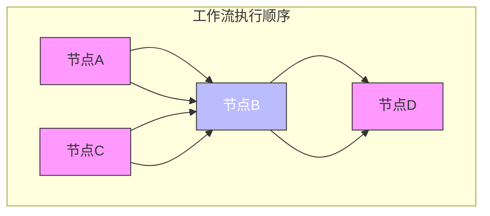
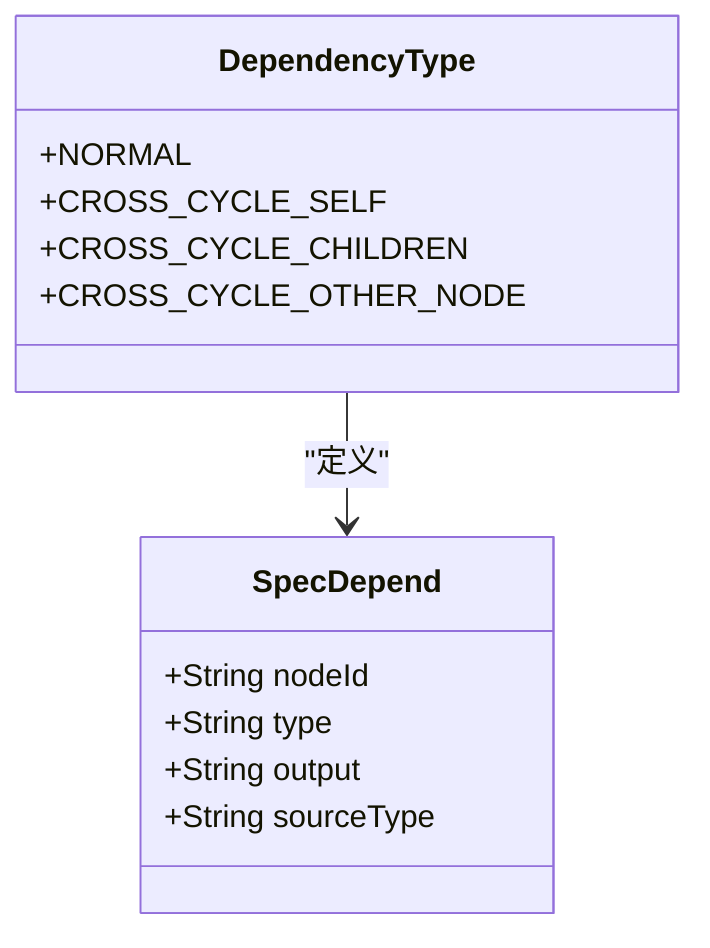
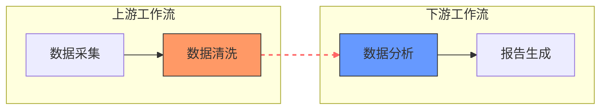
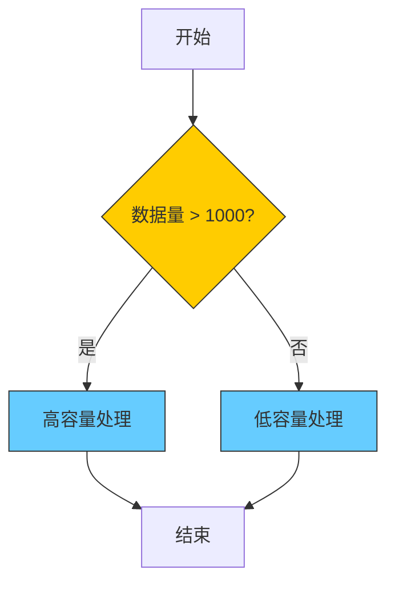
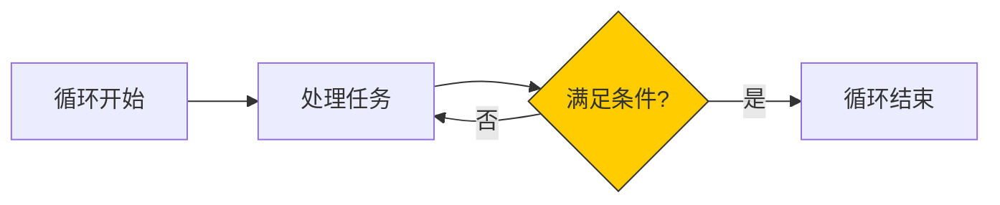

# 依赖关系

<cite>
**本文档中引用的文件**  
- [flow.schema.json](file://schema/flow.schema.json)
- [SpecDepend.schema.json](file://spec/src/main/resources/spec/schema/SpecDepend.schema.json)
- [SpecFlowDepend.schema.json](file://spec/src/main/resources/spec/schema/SpecFlowDepend.schema.json)
- [SpecVariableDepend.schema.json](file://spec/src/main/resources/spec/schema/SpecVariableDepend.schema.json)
- [SpecVariableFlowDepend.schema.json](file://spec/src/main/resources/spec/schema/SpecVariableFlowDepend.schema.json)
- [DependencyType.java](file://spec/src/main/java/com/aliyun/dataworks/common/spec/domain/enums/DependencyType.java)
- [all_depend_types.json](file://spec/src/test/resources/nodemodel/all_depend_types.json)
- [cycle_workflow_spec.json](file://spec/src/test/resources/copier/cycle_workflow_spec.json)
</cite>

## 目录
1. [简介](#简介)
2. [工作流节点依赖配置](#工作流节点依赖配置)
3. [依赖类型详解](#依赖类型详解)
4. [跨工作流依赖配置](#跨工作流依赖配置)
5. [复杂依赖场景配置](#复杂依赖场景配置)
6. [最佳实践与常见问题](#最佳实践与常见问题)

## 简介
dataworks-spec项目提供了一套标准化的工作流描述规范，用于定义数据处理工作流中节点间的依赖关系。本文档详细说明了如何配置前置依赖、后置依赖和条件依赖，解释了不同依赖类型的使用场景，并提供了复杂依赖场景的配置示例和解决方案。

## 工作流节点依赖配置

在dataworks-spec中，工作流节点间的依赖关系通过`flow`字段进行配置。每个节点可以定义其依赖的前置节点，系统根据这些依赖关系确定节点的执行顺序。

依赖配置位于工作流规范的`spec.flow`数组中，每个元素包含`nodeId`和`depends`两个主要属性：
- `nodeId`：当前节点的唯一标识符
- `depends`：该节点所依赖的前置节点列表

每个依赖项可以指定依赖类型和具体的依赖目标。依赖目标可以通过`output`字段引用其他节点的输出，或者通过`nodeId`直接引用节点。



**图表来源**
- [flow.schema.json](file://schema/flow.schema.json#L86-L149)
- [all_depend_types.json](file://spec/src/test/resources/nodemodel/all_depend_types.json#L142-L180)

**本节来源**
- [flow.schema.json](file://schema/flow.schema.json#L86-L149)
- [SpecFlowDepend.schema.json](file://spec/src/main/resources/spec/schema/SpecFlowDepend.schema.json#L1-L26)

## 依赖类型详解

dataworks-spec定义了多种依赖类型，以满足不同的业务场景需求。这些依赖类型通过`DependencyType`枚举进行定义，主要包括正常依赖、跨周期依赖等。

### 依赖类型选项

| 依赖类型 | 枚举值 | 描述 | 使用场景 |
|--------|-------|------|--------|
| 正常依赖 | NORMAL | 节点依赖同周期的对应节点实例 | 大多数常规的数据处理任务 |
| 自身跨周期依赖 | CROSS_CYCLE_SELF | 节点当前周期的实例依赖上一周期自身的实例 | 需要基于前一天数据进行处理的场景 |
| 子节点跨周期依赖 | CROSS_CYCLE_CHILDREN | 节点当前周期的实例依赖上一周期所有子节点的实例 | 汇总类任务，需要等待所有子任务完成 |
| 其他节点跨周期依赖 | CROSS_CYCLE_OTHER_NODE | 节点当前周期的实例依赖上一周期指定节点的实例 | 跨节点的周期性数据依赖 |



**图表来源**
- [DependencyType.java](file://spec/src/main/java/com/aliyun/dataworks/common/spec/domain/enums/DependencyType.java#L24-L45)
- [SpecDepend.schema.json](file://spec/src/main/resources/spec/schema/SpecDepend.schema.json#L1-L52)

### 依赖类型使用场景

#### 数据依赖
数据依赖是最常见的依赖类型，用于确保数据处理的正确顺序。当一个节点需要使用另一个节点产生的数据时，应配置数据依赖。

```json
{
  "nodeId": "node_b",
  "depends": [
    {
      "type": "Normal",
      "output": "node_a_output"
    }
  ]
}
```

#### 时间依赖
时间依赖用于处理周期性任务之间的依赖关系。例如，每日任务可能需要等待前一天的同名任务完成后才能开始。

```json
{
  "nodeId": "daily_report",
  "depends": [
    {
      "type": "CrossCycleDependsOnSelf",
      "output": "daily_report"
    }
  ]
}
```

#### 手动依赖
手动依赖通常用于需要人工确认或审批的场景。这种依赖可以通过外部系统触发来解除。

```json
{
  "nodeId": "publish_data",
  "depends": [
    {
      "type": "Normal",
      "output": "approval_node"
    }
  ]
}
```

**本节来源**
- [DependencyType.java](file://spec/src/main/java/com/aliyun/dataworks/common/spec/domain/enums/DependencyType.java#L24-L45)
- [SpecDepend.schema.json](file://spec/src/main/resources/spec/schema/SpecDepend.schema.json#L1-L52)
- [all_depend_types.json](file://spec/src/test/resources/nodemodel/all_depend_types.json#L146-L178)

## 跨工作流依赖配置

跨工作流依赖允许一个工作流引用另一个工作流的输出作为自己的输入，实现工作流之间的协同工作。

### 引用其他工作流输出

要配置跨工作流依赖，需要在依赖项中指定目标工作流的输出标识符。这通常通过`output`字段完成，其值为被引用工作流节点的输出ID。

```json
{
  "nodeId": "current_node",
  "depends": [
    {
      "type": "CrossCycleDependsOnOtherNode",
      "output": "external_workflow_output_id"
    }
  ]
}
```

### 配置方法

1. 确定要引用的外部工作流及其输出节点
2. 获取该节点的输出标识符（output ID）
3. 在当前工作流的依赖配置中添加相应的依赖项
4. 设置适当的依赖类型（通常为`CrossCycleDependsOnOtherNode`）

跨工作流依赖特别适用于以下场景：
- 数据管道中的上下游工作流协调
- 共享数据集的多个处理流程
- 主从式工作流架构



**图表来源**
- [SpecDepend.schema.json](file://spec/src/main/resources/spec/schema/SpecDepend.schema.json#L1-L52)
- [all_depend_types.json](file://spec/src/test/resources/nodemodel/all_depend_types.json#L152-L162)

**本节来源**
- [SpecDepend.schema.json](file://spec/src/main/resources/spec/schema/SpecDepend.schema.json#L1-L52)
- [all_depend_types.json](file://spec/src/test/resources/nodemodel/all_depend_types.json#L152-L162)

## 复杂依赖场景配置

dataworks-spec支持多种复杂依赖场景的配置，包括并行执行、分支条件和循环依赖等。

### 并行执行配置

通过为一个节点配置多个前置依赖，可以实现并行执行。当所有前置依赖都满足时，该节点才会执行。

```json
{
  "nodeId": "merge_node",
  "depends": [
    {
      "type": "Normal",
      "output": "parallel_task_1"
    },
    {
      "type": "Normal",
      "output": "parallel_task_2"
    },
    {
      "type": "Normal",
      "output": "parallel_task_3"
    }
  ]
}
```

### 分支条件处理

分支节点允许根据条件表达式选择不同的执行路径。每个分支可以定义自己的条件和输出。

```json
{
  "nodeId": "branch_node",
  "branch": {
    "branches": [
      {
        "when": "${data_volume} > 1000",
        "output": "high_volume_processing"
      },
      {
        "when": "${data_volume} <= 1000",
        "output": "low_volume_processing"
      }
    ]
  }
}
```



**图表来源**
- [cycle_workflow_spec.json](file://spec/src/test/resources/copier/cycle_workflow_spec.json#L657-L673)
- [branch.md](file://docs/spec-templates/control-flow/branch.md#L117-L121)

### 循环依赖处理策略

对于循环依赖，dataworks-spec提供了`do-while`和`foreach`等控制结构来安全地处理循环逻辑。

#### Do-While循环
```json
{
  "nodeId": "loop_node",
  "do-while": {
    "nodes": ["inner_task"],
    "while": "condition_check",
    "maxIterations": 10
  }
}
```

#### For-Each循环
```json
{
  "nodeId": "iterate_node",
  "foreach": {
    "nodes": ["processing_task"],
    "array": "${input_array}",
    "parallelism": 3
  }
}
```



**图表来源**
- [cycle_workflow_spec.json](file://spec/src/test/resources/copier/cycle_workflow_spec.json#L387-L562)
- [DataWorksNodeAdapter.java](file://spec/src/main/java/com/aliyun/dataworks/common/spec/domain/dw/nodemodel/DataWorksNodeAdapter.java#L274-L284)

**本节来源**
- [cycle_workflow_spec.json](file://spec/src/test/resources/copier/cycle_workflow_spec.json#L387-L562)
- [DataWorksNodeAdapter.java](file://spec/src/main/java/com/aliyun/dataworks/common/spec/domain/dw/nodemodel/DataWorksNodeAdapter.java#L274-L284)
- [branch.md](file://docs/spec-templates/control-flow/branch.md#L117-L121)

## 最佳实践与常见问题

### 依赖配置最佳实践

1. **明确依赖关系**：确保每个节点的依赖关系都清晰明确，避免隐式依赖
2. **合理使用跨周期依赖**：仅在确实需要时使用跨周期依赖，避免不必要的复杂性
3. **控制依赖链长度**：尽量保持依赖链简短，过长的依赖链会影响调度效率
4. **使用有意义的节点ID**：采用有意义的节点ID命名规则，便于理解和维护

### 常见问题及解决方案

#### 循环依赖检测
系统会自动检测并阻止可能导致死锁的循环依赖。如果遇到循环依赖错误，建议：
- 重新设计工作流逻辑
- 使用`do-while`或`foreach`等专门的循环结构
- 将循环逻辑分解为多个独立的工作流

#### 依赖解析失败
当依赖解析失败时，可能的原因包括：
- 被引用的节点不存在
- 节点ID拼写错误
- 工作流版本不匹配

解决方案：
- 验证所有引用的节点ID是否正确
- 检查工作流定义文件的完整性
- 确保所有依赖的工作流都已正确部署

#### 性能优化建议
- 对于大量并行任务，合理设置`parallelism`参数
- 使用适当的超时设置，避免任务无限等待
- 定期审查和优化依赖关系，消除不必要的依赖

**本节来源**
- [cycle_workflow_spec.json](file://spec/src/test/resources/copier/cycle_workflow_spec.json#L387-L562)
- [DataWorksNodeAdapter.java](file://spec/src/main/java/com/aliyun/dataworks/common/spec/domain/dw/nodemodel/DataWorksNodeAdapter.java#L274-L284)
- [branch.md](file://docs/spec-templates/control-flow/branch.md#L117-L121)