# 参数配置

<cite>
**本文档引用的文件**
- [VariableScopeType.java](file://spec/src/main/java/com/aliyun/dataworks/common/spec/domain/enums/VariableScopeType.java)
- [VariableType.java](file://spec/src/main/java/com/aliyun/dataworks/common/spec/domain/enums/VariableType.java)
- [SpecVariable.schema.json](file://spec/src/main/resources/spec/schema/SpecVariable.schema.json)
- [SpecVariableParser.java](file://spec/src/main/java/com/aliyun/dataworks/common/spec/parser/impl/SpecVariableParser.java)
- [VariableUtils.java](file://spec/src/main/java/com/aliyun/dataworks/common/spec/utils/VariableUtils.java)
- [param_hub.json](file://spec/src/test/resources/param_hub.json)
- [parameter_node.json](file://spec/src/test/resources/parameter_node.json)
- [SpecParamHub.schema.json](file://spec/src/main/resources/spec/schema/SpecParamHub.schema.json)
- [SpecContainerEnvVar.schema.json](file://spec/src/main/resources/spec/schema/SpecContainerEnvVar.schema.json)
- [SpecContainerEnvVarParser.java](file://spec/src/main/java/com/aliyun/dataworks/common/spec/parser/impl/SpecContainerEnvVarParser.java)
</cite>

## 目录
1. [参数配置概述](#参数配置概述)
2. [参数类型与作用域](#参数类型与作用域)
3. [参数定义与使用](#参数定义与使用)
4. [参数传递机制](#参数传递机制)
5. [参数表达式与计算](#参数表达式与计算)
6. [复杂参数场景示例](#复杂参数场景示例)
7. [最佳实践](#最佳实践)

## 参数配置概述

dataworks-spec项目提供了一套完整的参数配置系统，用于在工作流中定义和管理各种类型的参数。该系统支持全局参数、节点参数和环境变量的配置，通过灵活的作用域机制和参数传递方式，实现了复杂工作流场景下的参数管理需求。参数配置系统基于JSON Schema定义了严格的参数结构，确保了参数定义的规范性和可验证性。

**Section sources**
- [SpecVariable.schema.json](file://spec/src/main/resources/spec/schema/SpecVariable.schema.json)
- [SpecParamHub.schema.json](file://spec/src/main/resources/spec/schema/SpecParamHub.schema.json)

## 参数类型与作用域

### 变量作用域类型

dataworks-spec项目定义了多种变量作用域，通过`VariableScopeType`枚举类实现，每种作用域决定了参数的可见性和生命周期。

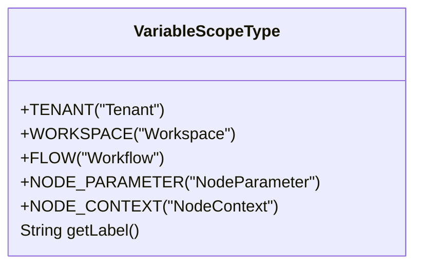

**Diagram sources**
- [VariableScopeType.java](file://spec/src/main/java/com/aliyun/dataworks/common/spec/domain/enums/VariableScopeType.java)

#### 作用域级别说明

- **租户级(TENANT)**：在整个租户范围内可见，适用于跨工作空间共享的全局配置
- **工作空间级(WORKSPACE)**：在特定工作空间内可见，适用于工作空间级别的共享配置
- **工作流级(FLOW)**：在单个工作流内可见，适用于工作流级别的参数共享
- **节点参数级(NODE_PARAMETER)**：作为节点的输入参数，用于接收外部传入的参数值
- **节点上下文级(NODE_CONTEXT)**：在节点执行过程中生成或定义的参数，可用于后续节点的输入

### 参数类型

参数类型通过`VariableType`枚举类定义，支持多种参数类型以满足不同的使用场景。

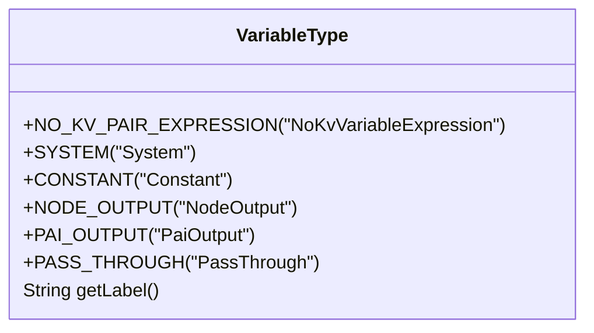

**Diagram sources**
- [VariableType.java](file://spec/src/main/java/com/aliyun/dataworks/common/spec/domain/enums/VariableType.java)

#### 参数类型说明

- **NO_KV_PAIR_EXPRESSION**：非键值对表达式，兼容旧版参数格式
- **SYSTEM**：系统变量，如`${yyyymmdd}`等内置时间变量
- **CONSTANT**：常量，固定不变的参数值
- **NODE_OUTPUT**：节点输出变量，由前序节点执行后输出的参数
- **PAI_OUTPUT**：PAI组件输出变量，特定于PAI组件的输出参数
- **PASS_THROUGH**：透传变量，用于将前序节点的输出直接传递给后续节点

**Section sources**
- [VariableType.java](file://spec/src/main/java/com/aliyun/dataworks/common/spec/domain/enums/VariableType.java)
- [SpecVariable.schema.json](file://spec/src/main/resources/spec/schema/SpecVariable.schema.json)

## 参数定义与使用

### 全局参数配置

全局参数在工作流级别定义，可在整个工作流中使用。通过`variables`字段在工作流规范中定义全局参数。

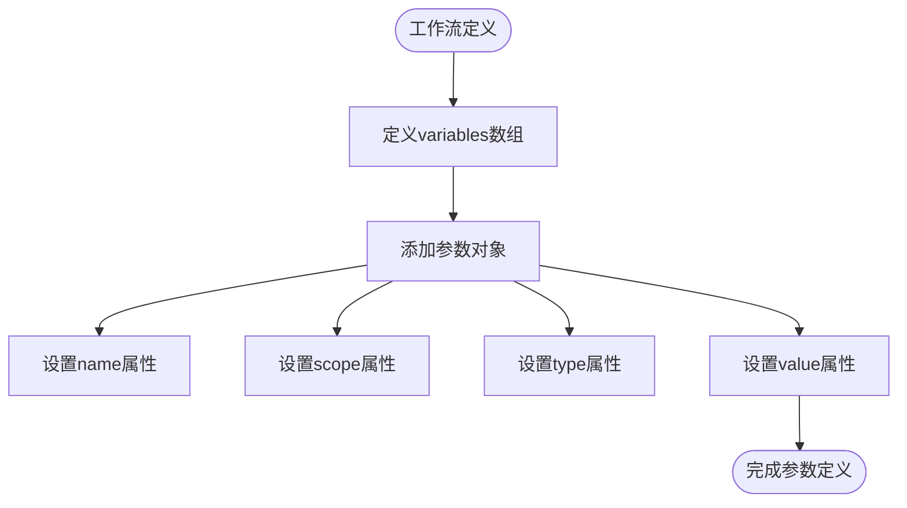

**Diagram sources**
- [SpecVariable.schema.json](file://spec/src/main/resources/spec/schema/SpecVariable.schema.json)

### 节点参数配置

节点参数通过`param-hub`结构在节点级别定义，用于管理节点的输入输出参数。

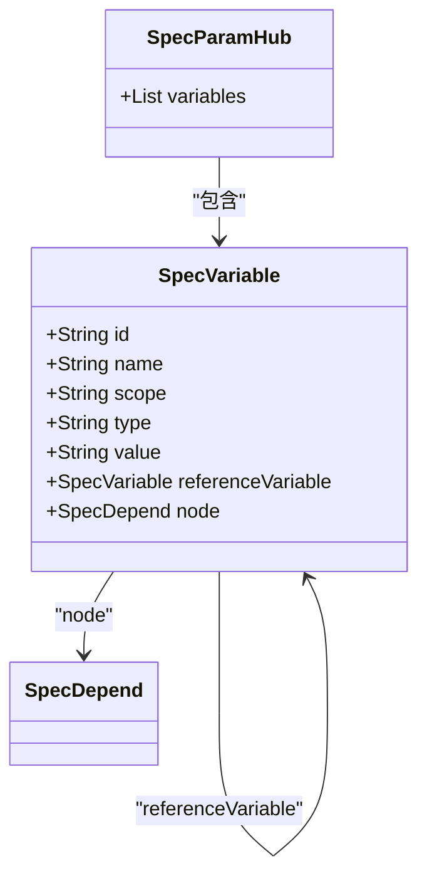

**Diagram sources**
- [SpecParamHub.schema.json](file://spec/src/main/resources/spec/schema/SpecParamHub.schema.json)
- [SpecVariable.schema.json](file://spec/src/main/resources/spec/schema/SpecVariable.schema.json)

### 环境变量配置

环境变量通过`SpecContainerEnvVar`类定义，用于配置容器运行时的环境变量。

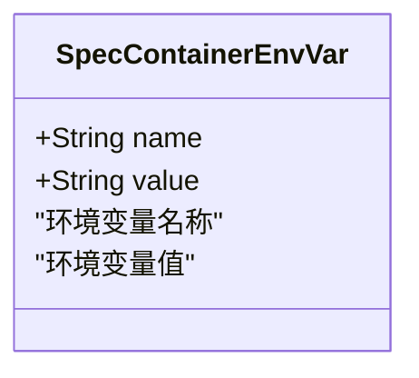

**Diagram sources**
- [SpecContainerEnvVar.schema.json](file://spec/src/main/resources/spec/schema/SpecContainerEnvVar.schema.json)
- [SpecContainerEnvVarParser.java](file://spec/src/main/java/com/aliyun/dataworks/common/spec/parser/impl/SpecContainerEnvVarParser.java)

**Section sources**
- [SpecVariable.schema.json](file://spec/src/main/resources/spec/schema/SpecVariable.schema.json)
- [SpecParamHub.schema.json](file://spec/src/main/resources/spec/schema/SpecParamHub.schema.json)
- [SpecContainerEnvVar.schema.json](file://spec/src/main/resources/spec/schema/SpecContainerEnvVar.schema.json)

## 参数传递机制

### 静态参数传递

静态参数在工作流定义时就已经确定，通过常量或系统变量的形式传递。

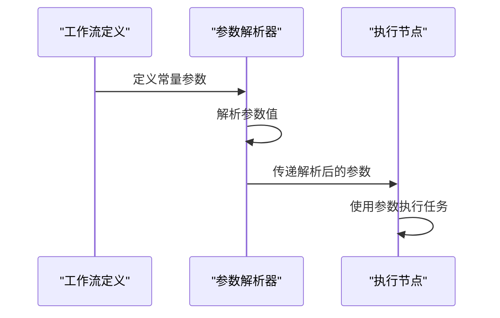

**Diagram sources**
- [SpecVariableParser.java](file://spec/src/main/java/com/aliyun/dataworks/common/spec/parser/impl/SpecVariableParser.java)

### 动态参数传递

动态参数在工作流执行过程中生成，通过节点输出变量的形式在节点间传递。

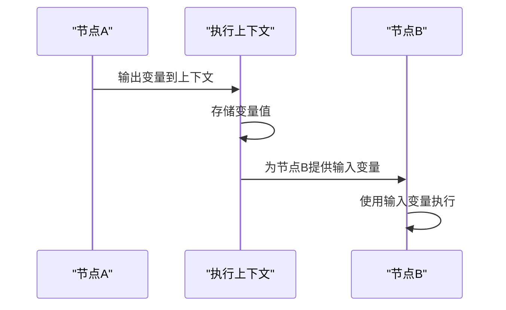

**Diagram sources**
- [VariableUtils.java](file://spec/src/main/java/com/aliyun/dataworks/common/spec/utils/VariableUtils.java)

### 运行时参数传递

运行时参数在节点执行时动态计算，支持复杂的参数表达式和函数调用。

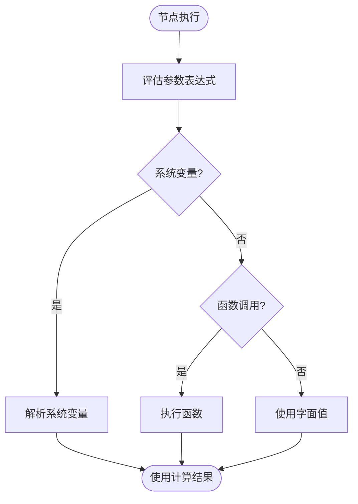

**Diagram sources**
- [SpecVariableParser.java](file://spec/src/main/java/com/aliyun/dataworks/common/spec/parser/impl/SpecVariableParser.java)
- [VariableUtils.java](file://spec/src/main/java/com/aliyun/dataworks/common/spec/utils/VariableUtils.java)

**Section sources**
- [SpecVariableParser.java](file://spec/src/main/java/com/aliyun/dataworks/common/spec/parser/impl/SpecVariableParser.java)
- [VariableUtils.java](file://spec/src/main/java/com/aliyun/dataworks/common/spec/utils/VariableUtils.java)

## 参数表达式与计算

### 内置函数支持

系统支持多种内置函数用于参数计算，包括字符串处理、日期时间操作、数学计算等。

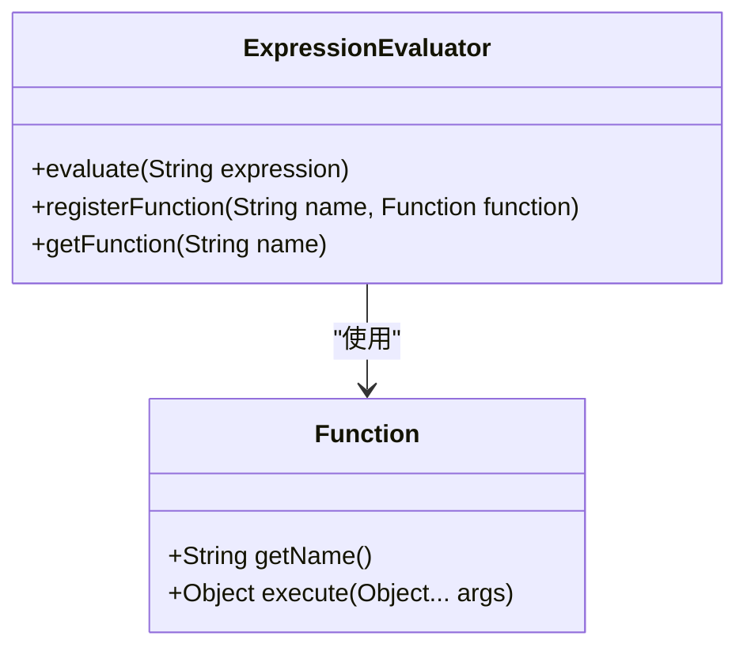

**Diagram sources**
- [SpecVariableParser.java](file://spec/src/main/java/com/aliyun/dataworks/common/spec/parser/impl/SpecVariableParser.java)

### 自定义函数扩展

支持通过插件机制扩展自定义函数，满足特定业务场景的计算需求。

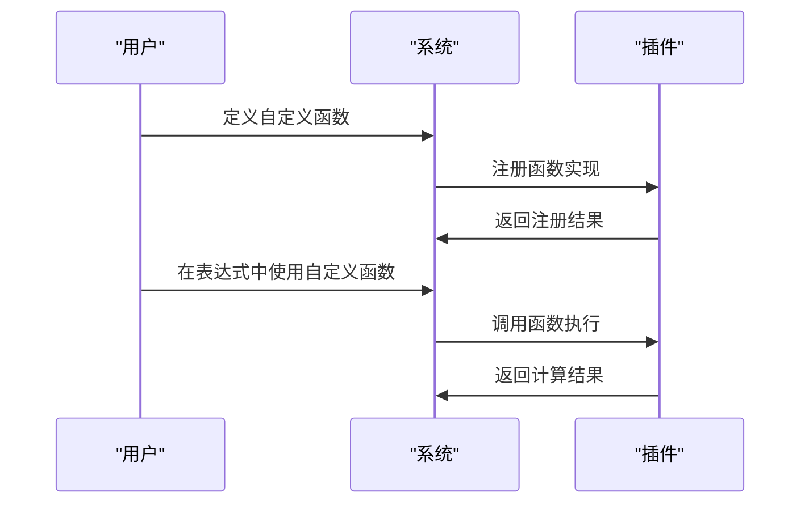

**Diagram sources**
- [SpecVariableParser.java](file://spec/src/main/java/com/aliyun/dataworks/common/spec/parser/impl/SpecVariableParser.java)

### 参数表达式语法

参数表达式支持标准的EL表达式语法，包括变量引用、函数调用和运算符。

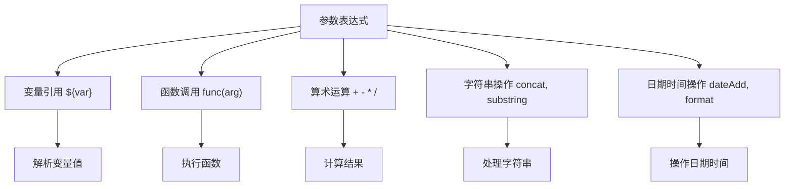

**Diagram sources**
- [VariableUtils.java](file://spec/src/main/java/com/aliyun/dataworks/common/spec/utils/VariableUtils.java)

**Section sources**
- [SpecVariableParser.java](file://spec/src/main/java/com/aliyun/dataworks/common/spec/parser/impl/SpecVariableParser.java)
- [VariableUtils.java](file://spec/src/main/java/com/aliyun/dataworks/common/spec/utils/VariableUtils.java)

## 复杂参数场景示例

### 参数枢纽配置示例

参数枢纽（Param Hub）用于集中管理节点的输入输出参数，支持复杂的参数依赖关系。

```json
{
  "version": "1.0.0",
  "kind": "CycleWorkflow",
  "nodes": [
    {
      "id": "param_1",
      "param-hub": {
        "variables": [
          {
            "name": "my_const",
            "type": "Constant",
            "scope": "NodeContext",
            "value": "cn-shanghai"
          },
          {
            "name": "my_var",
            "type": "System",
            "scope": "NodeContext",
            "value": "${yyyymmdd}"
          },
          {
            "name": "outputs",
            "type": "PassThrough",
            "scope": "NodeContext",
            "referenceVariable": {
              "name": "outputs",
              "type": "NodeOutput",
              "scope": "NodeContext",
              "value": "${outputs}",
              "node": {
                "output": "autotest.28517448_out"
              }
            }
          }
        ]
      }
    }
  ]
}
```

**Diagram sources**
- [param_hub.json](file://spec/src/test/resources/param_hub.json)

### 参数节点配置示例

参数节点用于定义工作流中的参数传递关系，支持跨节点的参数引用。

```json
{
  "version": "1.0.0",
  "kind": "CycleWorkflow",
  "variables": [
    {
      "id": "ctx_cst_1",
      "name": "region",
      "scope": "NodeContext",
      "type": "Constant",
      "value": "ch-shanghai"
    },
    {
      "id": "ctx_var_2",
      "name": "bizdate",
      "scope": "NodeParameter",
      "type": "System",
      "value": "${yyyymmdd}"
    }
  ],
  "nodes": [
    {
      "id": "param_1",
      "inputs": {
        "variables": [
          "{{variables.ctx_var_upstream_1}}"
        ]
      },
      "outputs": {
        "variables": [
          "{{variables.ctx_cst_1}}",
          "{{variables.ctx_var_2}}"
        ]
      }
    }
  ]
}
```

**Diagram sources**
- [parameter_node.json](file://spec/src/test/resources/parameter_node.json)

**Section sources**
- [param_hub.json](file://spec/src/test/resources/param_hub.json)
- [parameter_node.json](file://spec/src/test/resources/parameter_node.json)

## 最佳实践

### 参数命名规范

遵循统一的参数命名规范，提高参数的可读性和可维护性。

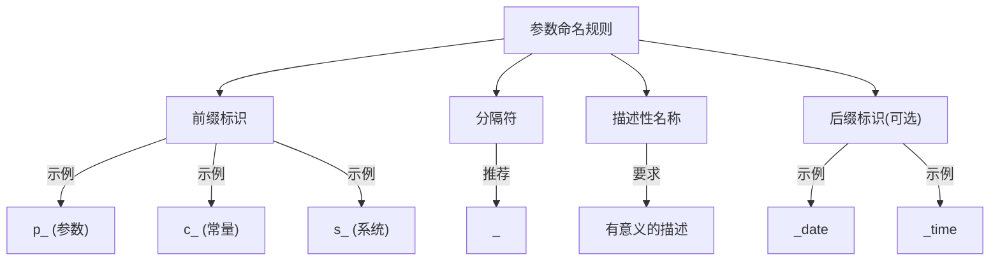

### 参数作用域选择

根据参数的使用范围选择合适的作用域，避免作用域过大或过小。

```mermaid
decisionDiagram
Start{参数使用范围}
Start -->|整个租户| TENANT["选择TENANT作用域"]
Start -->|整个工作空间| WORKSPACE["选择WORKSPACE作用域"]
Start -->|单个工作流| FLOW["选择FLOW作用域"]
Start -->|节点输入| NODE_PARAMETER["选择NODE_PARAMETER作用域"]
Start -->|节点内部| NODE_CONTEXT["选择NODE_CONTEXT作用域"]
```

### 参数安全性考虑

敏感参数应进行加密处理，避免明文存储。

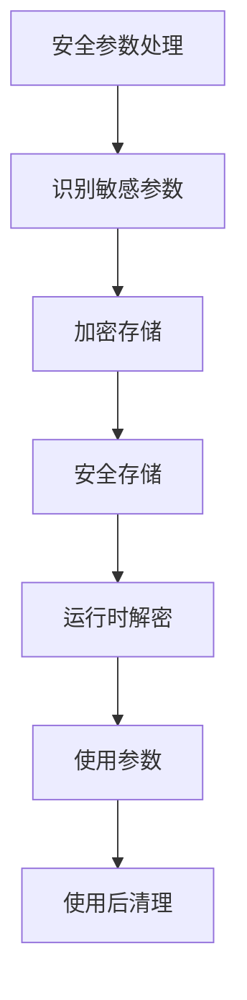

**Section sources**
- [SpecVariable.schema.json](file://spec/src/main/resources/spec/schema/SpecVariable.schema.json)
- [SpecVariableParser.java](file://spec/src/main/java/com/aliyun/dataworks/common/spec/parser/impl/SpecVariableParser.java)